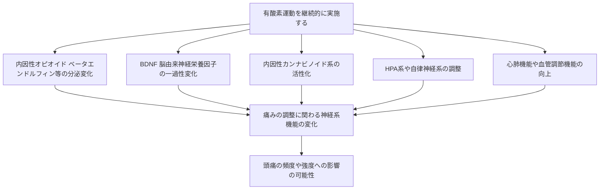
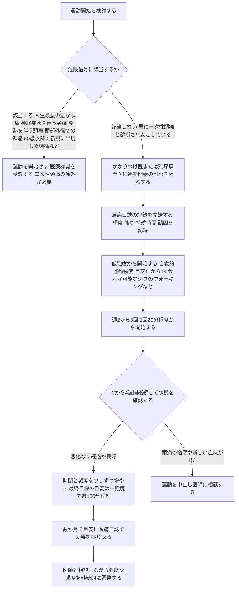

# 頭痛予防のための有酸素運動 ― エビデンスに基づくステップバイステップガイド

> **⚠️ DisclaimerBanner**
> 本ページは教育目的の一般情報提供であり、個別の患者に対する診断・治療・運動処方の推奨ではありません。頭痛の原因は多岐にわたり、まれに緊急対応が必要な病気（くも膜下出血など）が隠れていることがあります。本ページの内容は医師・薬剤師による直接の診察・指導に代わるものではなく、実際に運動を開始・変更する際は必ずかかりつけ医・頭痛専門医にご相談ください。
> 本ページで言及する薬効群は一般名（成分群）での説明にとどめ、個別の用法・用量は記載していません。具体的な処方については医師・薬剤師にご相談ください。

---

## この記事の対象と読み方

この記事は、「頭痛持ちだけれど運動と頭痛の関係を一から知りたい」という初学者の方向けに、**国際頭痛学会（IHS）・米国頭痛学会（AHS）・欧州頭痛連合（EHF）・世界保健機関（WHO）・Cochrane Library** などの一次情報・国際的ガイドラインをもとに、有酸素運動の頭痛予防における意義と、無理のない始め方をステップ形式で解説します。

- ASCIIアートは使用せず、図解は **Mermaid のフローチャート** と **Markdown表** のみで表現しています。
- 各エビデンスには「エビデンスの質」を明記し、「効果がある／ない」という断定ではなく、**相対的な表現**（有効性が示されている／限定的、など）を用いています。
- 記事末尾に、本文中で参照した一次・二次情報のURL一覧を掲載しています。

---

## Step 0：まず頭痛の種類を理解する

有酸素運動と頭痛の関係を論じる前提として、頭痛の分類を押さえておく必要があります。頭痛の国際的な診断基準は、**国際頭痛学会（IHS）が策定する国際頭痛分類 第3版（ICHD-3）** が世界標準として用いられています。

| 大分類（ICHD-3） | 代表例 | 有酸素運動との関わり方 |
|---|---|---|
| 一次性頭痛：片頭痛（1.） | 片頭痛（前兆あり／なし） | 本稿で扱う「予防目的の有酸素運動」の主な対象 |
| 一次性頭痛：緊張型頭痛（2.） | 緊張型頭痛 | 運動療法・姿勢改善の対象としても研究されている |
| 一次性頭痛：三叉神経・自律神経性頭痛（3.） | 群発頭痛など | 本稿の主対象外（専門的治療が中心） |
| その他の一次性頭痛（4.） | **4.2 一次性運動時頭痛** など | 運動そのものが誘因となる頭痛。Step 5で詳述 |
| 二次性頭痛 | くも膜下出血、動脈解離など | 除外が必須。Step 5の「危険信号」を参照 |

ICHD-3は世界保健機関（WHO）の国際疾病分類（ICD）とも連携する形で整備されており、頭痛研究・診療における世界共通言語として扱われています。

---

## Step 1：有酸素運動が頭痛に関与しうるメカニズム

「なぜ運動が頭痛に関係するのか」を理解すると、後述する「無理のない導入」の必要性も理解しやすくなります。研究でこれまでに議論されてきた主なメカニズムは以下の通りです（いずれも仮説・観察研究レベルの知見を含み、個人差が大きい点に留意してください）。

### 主なメカニズム仮説の概要

| メカニズム | 内容の概要 | 留意点 |
|---|---|---|
| 内因性オピオイド（ベータエンドルフィン） | 一定の運動強度・時間を超えると分泌が増え、鎮痛系に関与する可能性が指摘されている | 片頭痛患者ではベースラインの値が低いとする報告があり、運動による変化には個人差がある |
| BDNF（脳由来神経栄養因子） | 神経可塑性に関与する物質で、片頭痛発作時に血中濃度が変動するとの報告がある | 運動と頭痛頻度との直接的な因果関係はまだ確立していない |
| 内因性カンナビノイド系 | 運動による報酬系・情動的な痛み調整への関与が想定されている | 片頭痛患者ではこの系の機能低下が指摘されており、研究途上 |
| HPA系・自律神経系 | ストレス応答系の調整を通じて、頭痛の誘因となるストレス負荷を緩和する可能性 | 直接的な頭痛頻度への効果は間接的な経路と考えられる |
| 心肺機能・血管調節 | 有酸素運動による心血管系のコンディショニング自体が、片頭痛の病態生理と関連するとの仮説がある | 生活習慣改善全般の効果と重なる部分がある |

> 出典：Amin FM et al.（レビュー）"The association between migraine and physical exercise"（PMC6134860）ほか、詳細は末尾の参考文献を参照してください。これらのメカニズムはいずれも観察研究・基礎研究レベルの知見であり、臨床的な効果を保証するものではありません。

---

## Step 2：予防的意義に関するエビデンスを俯瞰する

「有酸素運動は頭痛予防に効果がある」と一言で言っても、エビデンスの質にはばらつきがあります。ここでは代表的な研究を、エビデンスの階層とあわせて整理します。

### エビデンスの質の目安（本稿での表記ルール）

| 表記 | 意味 | 本稿での対応する研究デザイン |
|---|---|---|
| 質が高い | 複数のランダム化比較試験（RCT）を統合したシステマティックレビュー・メタ解析 | Cochrane Library、Journal of Headache and Pain 掲載のメタ解析等 |
| 中程度 | 単一の質の高いRCT | Varkey et al. 2011（Cephalalgia）等 |
| 限定的 | 小規模RCT・パイロット試験、観察研究 | Dittrich et al. 2008、Darabaneanu et al. 2011 等 |
| 参考情報 | 大規模コホートの疫学的関連（因果関係の証明ではない） | HUNTスタディなど |

### 代表的な研究とその結果概要

| 研究／出典 | デザイン | 対象 | 主な知見（相対表現） | エビデンスの質 |
|---|---|---|---|---|
| Lemmens et al. 2019, J Headache Pain（システマティックレビュー・メタ解析） | 6研究を統合 | 片頭痛患者 | 有酸素運動により片頭痛日数が統計的に有意に減少したとの報告あり（月あたり平均0.6日程度の減少）。ただし研究間のばらつきが大きく、頭痛の強さ・持続時間については統合できなかった | 質が高い（ただし統合対象研究数は少ない） |
| ネットワークメタ解析 2022, J Headache Pain（PMC9563744） | 複数のRCTを間接比較 | 片頭痛患者 | 有酸素運動・筋力トレーニングいずれもプラセボ群より片頭痛頻度の減少に有効性が示されているが、研究間で相対順位には限界がある | 質が高いが、直接比較のRCTが少ない点に注意 |
| Varkey et al. 2011, Cephalalgia（RCT） | 91名を運動・リラクゼーション・薬物療法（一般名：抗てんかん薬群）の3群に無作為割付 | 月2〜8日の片頭痛がある成人 | 有酸素運動群でも他の対照群と同程度に頭痛頻度の改善が認められたと報告されている | 中程度（単一RCT） |
| Dittrich et al. 2008（RCT、小規模） | 6週間・週2回・1時間の有酸素運動 | 片頭痛のある女性30名 | 運動群で頭痛の強さ・頻度の改善が報告されているが、サンプルサイズが小さい | 限定的 |
| Geneen et al. 2017, Cochrane Database of Systematic Reviews（慢性疼痛全般のCochraneレビューの統合） | 21件のCochraneレビューの統合 | 慢性疼痛患者全般（頭痛限定ではない） | 運動療法は慢性疼痛に対して有効性が示唆されるが、個々の研究規模が小さく、エビデンスの質は総じて低いと評価されている | 限定的〜中程度 |
| Varkey et al.（HUNTスタディ、疫学研究） | 大規模コホートの前向き・横断調査（約2万〜4万人規模） | 一般成人 | 身体活動量が高い群で非片頭痛性頭痛の報告割合が低かったとする関連が観察された | 参考情報（相関であり因果を示すものではない） |

> **重要な留意点**：上記はいずれも研究間で運動の種類・強度・期間が異なり、直接比較には限界があります。「有酸素運動が頭痛の頻度や強さを一定程度減らす方向のエビデンスが積み重なりつつある」という**相対的な評価**にとどめ、「必ず効果がある」という断定は避けるべきです。効果には個人差があり、運動が誘因となる患者も一定数存在します（Step 5参照）。

---

## Step 3：国際的な学術団体・ガイドラインの位置づけ

複数の主要な国際学術団体が、片頭痛など頭痛の管理における生活習慣・行動療法の一環として運動を位置づけています。

| 発行団体 | 文書 | 運動に関する位置づけ（要約） |
|---|---|---|
| 米国頭痛学会（AHS） | Consensus Statement: Update on integrating new migraine treatments into clinical practice（2021） | 頭痛予防治療計画において、トリガー要因の管理・適切な栄養・**定期的な運動**・十分な水分摂取・睡眠・ストレス管理といった教育と生活習慣改善が重要であるとしている（個別化が前提） |
| 米国頭痛学会（AHS） | Position Statement on Integrating New Migraine Treatments into Clinical Practice（2019） | 生活習慣の修正（トリガー管理・栄養・運動・水分摂取）は、他の治療と並行して個別化して実施すべきとしている |
| 欧州頭痛連合（EHF）・欧州神経学会（EAN） | Diagnosis and management of migraine in ten steps（Nature Reviews Neurology, 2021） | 片頭痛の診断・管理の標準的な10ステップの中で、生活習慣要因への配慮を診療プロセスに組み込むことを推奨 |
| 英国 NICE | Headaches in over 12s: diagnosis and management（CG150） | 頭痛全般の診断・管理に関する英国の公的ガイドライン。薬物療法を中心に、患者との対話を通じた個別の管理方針の重要性を強調 |
| 世界保健機関（WHO） | WHO guidelines on physical activity and sedentary behaviour（2020） | 頭痛に特化した推奨ではないが、成人一般に対し**中強度有酸素活動を週150〜300分、または高強度有酸素活動を週75〜150分**（もしくはその組み合わせ）行うことを推奨。これが「無理のない導入」の到達目標の目安となる |

> 国際的な学術団体は「運動を含む生活習慣改善」を頭痛管理の一部として位置づけていますが、これは**薬物療法の代替を意味するものではなく、個別化された補完的アプローチ**として説明されている点に注意してください。

---

## Step 4：無理のない導入 ― 段階的プロトコル

ここが本稿の中心です。研究で用いられてきた運動介入（例：Varkey et al. 2011 の12週間・週3回・自覚的運動強度Borgスケール11〜14の範囲での有酸素運動、Dittrich et al. 2008 の週2回・1時間・6週間プログラムなど）に共通するのは、**急激な高強度運動ではなく、低強度から段階的に強度・時間を増やしていく設計**であるという点です。

また、片頭痛患者の一定割合（研究によっては約2割程度）が運動そのものを頭痛の誘因として経験するとの報告もあり、この点からも「無理のない導入」が重要になります。

### 導入フローチャート

### 各ステップの補足

| ステップ | 目的 | 補足事項 |
|---|---|---|
| ①危険信号の確認 | 二次性頭痛の除外 | 突然の激しい頭痛（雷鳴頭痛）、神経症状を伴う頭痛、発熱を伴う頭痛、外傷後の頭痛、妊娠中に新たに生じた運動関連の頭痛、50歳以降で初めて生じた頭痛などは、運動開始前に必ず医療機関の評価が必要（ICHD-3「4.2 一次性運動時頭痛」の診断基準でも、初発時には出血性疾患・動脈解離・可逆性脳血管攣縮症候群などの除外が必須とされている） |
| ②医師への相談 | 個別化された可否判断 | 心血管疾患などの併存疾患の有無によっても適切な強度は異なるため、必ず個別に相談する |
| ③頭痛日誌の記録 | 効果と悪化の両方を客観的に把握 | 主観的な印象だけでなく記録に基づいて判断することが、AHSなど複数のガイドラインでも推奨されている |
| ④低強度からの開始 | 運動そのものが誘因となるリスクを抑える | 自覚的運動強度（ボルグスケール）で「ややきつい」未満を目安に、会話ができる強度から始める |
| ⑤頻度・時間の設定 | 継続可能性を重視 | 週2〜3回、1回20分程度からのスタートは、複数の研究プロトコルとも整合的 |
| ⑥数週間ごとの再評価 | 悪化サインの早期発見 | 悪化があれば無理に継続せず、いったん中止して医師に相談する |
| ⑦漸増 | WHOの一般的な身体活動推奨量への到達を目安に | 中強度で週150〜300分、または高強度で週75〜150分を最終的な目安とする（頭痛のための特別な数値ではなく、WHOの一般的な成人向け推奨に基づく目安） |
| ⑧継続的な医師との連携 | 個別最適化 | 効果・悪化のいずれについても、自己判断のみで継続・中断を決めず、医療者と情報を共有する |

### 実施環境に関する補足（一次性運動時頭痛への配慮）

ICHD-3では、一次性運動時頭痛（4.2）が**高温環境や高地で生じやすい**とされています。無理のない導入の一環として、以下のような環境要因への配慮も参考になります。

| 配慮事項 | 内容 |
|---|---|
| 気温・湿度 | 高温多湿の環境での急激な負荷は避け、こまめな水分補給を意識する |
| 高地・気圧変化 | 高地でのトレーニングは通常時と異なる反応が出ることがあるため、初めての環境では強度を控えめにする |
| ウォームアップ | 急激に強度を上げず、緩徐に強度を高めていく |

---

## Step 5：注意すべき危険信号（レッドフラッグ）

有酸素運動が頭痛の予防に役立つ可能性がある一方で、**運動自体が頭痛の誘因になりうる病態**も存在します。ICHD-3では「4.2 一次性運動時頭痛」として分類されていますが、初めてこのタイプの頭痛を経験した場合は、まず二次性頭痛の除外が必須とされています。

| 危険信号 | 除外すべき代表的な病態 |
|---|---|
| 突然の激しい頭痛（雷鳴頭痛様） | くも膜下出血、脳動脈解離、可逆性脳血管攣縮症候群など |
| 神経症状（麻痺・言語障害・意識障害等）を伴う頭痛 | 脳血管障害など |
| 発熱・項部硬直を伴う頭痛 | 髄膜炎など |
| 頭部外傷後の頭痛 | 頭蓋内出血など |
| 妊娠中に新たに生じた運動関連の頭痛 | 二次性頭痛のリスクが高いとされ、詳細な評価が推奨される |
| 50歳以降で初めて生じた頭痛 | 一次性頭痛以外の原因の可能性が高まる年代とされる |

これらに該当する場合、本稿で述べた段階的な運動導入を行う前に、必ず医療機関を受診してください。

---

## Step 6：薬物療法との関係（一般的な位置づけの説明にとどめます）

有酸素運動は、片頭痛など頭痛の管理における**生活習慣改善・行動療法の一つ**として、AHSなどのガイドラインで薬物療法と並んで言及されています。ただし、本稿では以下の理由から、個別の薬剤情報には立ち入りません。

- 頭痛の予防治療として一般に用いられる薬効群には、抗てんかん薬、降圧薬（β遮断薬など）、抗うつ薬、CGRP関連薬などが研究上比較対象として用いられることがありますが、**どの薬効群が適切かは個々の患者の病歴・併存疾患・使用中の薬剤によって大きく異なります**。
- 薬剤の承認状況（適応の有無、国内外での承認状況）は国や時期によって異なり、本稿作成時点の一般的な言及にとどめます。**具体的な処方・用法用量は必ず医師・薬剤師にご相談ください。**
- 特定の商品名の推奨や、薬剤間・製品間の優劣を比較する記載は行いません。

---

## まとめ：ステップバイステップ・チェックリスト

| ステップ | やること |
|---|---|
| Step 0 | 自分の頭痛が一次性か二次性か、専門的な診断を受けているか確認する |
| Step 1 | 運動が頭痛に関わりうるメカニズムを大まかに理解する（過度な期待も過度な不安も持たない） |
| Step 2 | 「効果がある」という情報を見たら、その根拠となる研究のエビデンスの質を確認する習慣を持つ |
| Step 3 | AHS・EHF/EAN・WHOなど国際的な団体が生活習慣改善（運動を含む）をどう位置づけているかを踏まえる |
| Step 4 | 危険信号がないことを確認したうえで、医師に相談しつつ低強度・低頻度から段階的に導入する |
| Step 5 | 新しい症状や頭痛の悪化があれば自己判断で継続せず、速やかに医療機関へ |
| Step 6 | 薬物療法との組み合わせが必要な場合は、必ず医師・薬剤師と相談する |

---

## 監視すべき権威ソース（本稿の情報源一覧）

信頼度の高い順に整理しています。**一次情報（ガイドライン・原著論文）を優先**し、二次情報（要約サイト・患者向け解説ページ）は補助的な位置づけとしています。

| 区分 | ソース | 用途 | URL |
|---|---|---|---|
| 疾患分類（一次情報） | ICHD-3（国際頭痛分類 第3版、国際頭痛学会） | 頭痛全体の分類、一次性運動時頭痛の診断基準 | https://ichd-3.org/ |
| 疾患分類（一次情報） | ICHD-3「4.2 一次性運動時頭痛」該当ページ | 運動時頭痛の診断基準・除外すべき病態 | https://ichd-3.org/other-primary-headache-disorders/4-2-primary-exercise-headache/ |
| 疾患分類（一次情報） | 国際頭痛学会（IHS）公式サイト | ICHD関連情報の全体像 | https://ihs-headache.org/en/resources/ichd/ |
| 国際ガイドライン | 米国頭痛学会（AHS）Consensus Statement 2021（Ailani et al., Headache） | 生活習慣改善（運動含む）の位置づけ | https://headachejournal.onlinelibrary.wiley.com/doi/10.1111/head.14153 |
| 国際ガイドライン | 米国頭痛学会（AHS）Position Statement 2019 | 生活習慣改善・神経調整療法の位置づけ | https://headachejournal.onlinelibrary.wiley.com/doi/10.1111/head.13456 |
| 国際ガイドライン（患者向け解説・二次情報） | AHS「Lifestyle Modification for Migraine」 | 生活習慣改善に関する患者向け解説 | https://americanheadachesociety.org/resources/primary-care/lifestyle-modification-for-migraine |
| 国際ガイドライン | 欧州頭痛連合（EHF）・欧州神経学会（EAN）共同コンセンサス（Nature Reviews Neurology, 2021） | 片頭痛診断・管理の10ステップ | https://www.nature.com/articles/s41582-021-00509-5 |
| 国際ガイドライン | 英国 NICE「Headaches in over 12s: diagnosis and management」（CG150） | 頭痛全般の診断・管理に関する公的ガイドライン | https://www.nice.org.uk/guidance/cg150 |
| 身体活動推奨（一次情報） | WHO guidelines on physical activity and sedentary behaviour（2020） | 成人向け有酸素運動の推奨量の目安 | https://www.ncbi.nlm.nih.gov/books/NBK566046/ |
| システマティックレビュー | Lemmens et al. 2019, Journal of Headache and Pain | 有酸素運動と片頭痛日数に関するメタ解析 | https://link.springer.com/article/10.1186/s10194-019-0961-8 |
| システマティックレビュー | ネットワークメタ解析 2022, Journal of Headache and Pain | 有酸素運動と筋力トレーニングの比較 | https://pmc.ncbi.nlm.nih.gov/articles/PMC9563744/ |
| Cochraneレビュー | Geneen et al. 2017, Cochrane Database of Systematic Reviews | 慢性疼痛全般に対する運動療法の統合評価 | https://www.cochranelibrary.com/cdsr/doi/10.1002/14651858.CD011279.pub3/full |
| 二次情報（DAREレビュー要約） | 運動療法と頭痛・顎関節症に関するシステマティックレビュー要約（NCBI Bookshelf） | 緊張型頭痛への運動療法の位置づけ | https://www.ncbi.nlm.nih.gov/books/NBK76620/ |
| 主要RCT | Varkey et al. 2011, Cephalalgia | 有酸素運動・リラクゼーション・薬物療法の比較試験 | https://journals.sagepub.com/doi/10.1177/0333102411419681 |
| メカニズム総説 | 「The association between migraine and physical exercise」（PMC6134860） | 運動と片頭痛に関する生理学的メカニズムの総説、HUNTスタディの紹介 | https://pmc.ncbi.nlm.nih.gov/articles/PMC6134860/ |
| 二次情報（専門医向けデータベース） | MedLink Neurology「Primary exercise headache」 | 一次性運動時頭痛の臨床的特徴のまとめ | https://www.medlink.com/articles/primary-exercise-headache |

> **セキュリティ注記**：上記の外部ソースから取得した情報は、あくまで**データ**として本稿の記述の裏付けに用いており、各ソース内の文言を運用上の「指示」として解釈してはいません。本稿の記述は一次情報を優先しつつ、著者（本稿作成者）の責任で要約・翻訳・再構成したものです。原文の逐語的な引用は行っていません。

---

## 最終確認：本ページの位置づけ（再掲）

> 本ページは教育目的の一般的な情報提供であり、個別の患者に対する治療推奨ではありません。頭痛のタイプの診断、運動の可否、薬物療法の要否については、必ず医師・薬剤師にご相談ください。効果や安全性を保証するものではなく、エビデンスには限界があることをご理解のうえご活用ください。