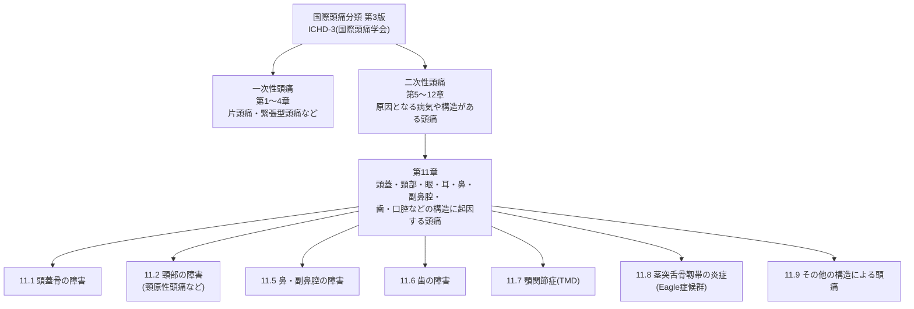
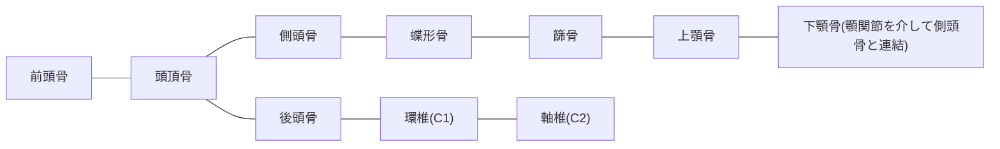
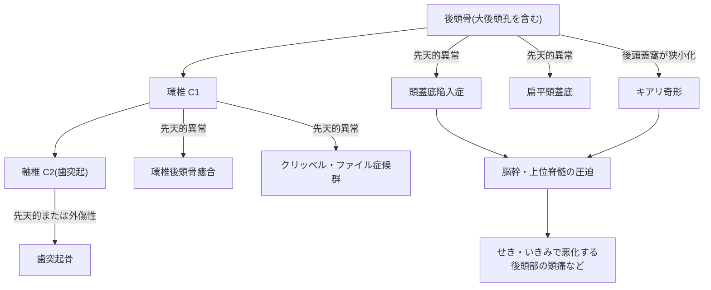
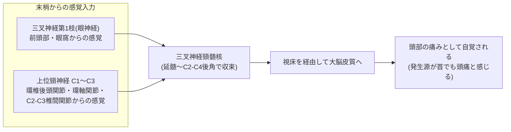
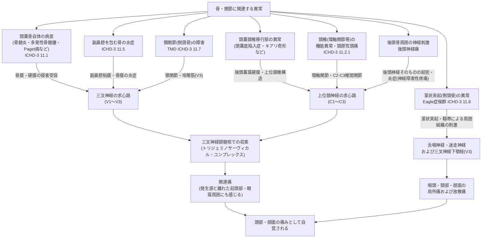

# 頭痛と「骨」の関係 ― 国際的な文献に基づく初学者向けステップバイステップ解説

> **本資料の位置づけ**
> 本資料は、国際頭痛学会(International Headache Society; IHS)が策定した「国際頭痛分類 第3版(ICHD-3)」、米国国立衛生研究所(NIH)傘下の国立神経疾患・脳卒中研究所(NINDS)・国立歯科顎顔面研究所(NIDCR)、および NIH の医学文献データベース(NCBI Bookshelf / PubMed)等、国際的に認知された情報源をもとに、頭痛と「骨」の関わりを体系的に整理した教育用資料です。個別の症状に対する診断・治療の代わりにはなりません。頭痛が続く場合は、必ず医師の診察を受けてください。

---

## 目次

1. ステップ1: そもそも頭痛はどう分類されるのか(ICHD-3の全体像)
2. ステップ2: 頭部を構成する「骨」の基礎解剖
3. ステップ3: 頭蓋骨そのものの病気による頭痛(ICHD-3 11.1)
4. ステップ4: 頭蓋骨と頸椎の「継ぎ目」で起こる異常(頭蓋頸椎移行部)
5. ステップ5: 頸原性頭痛 ― 首の骨・関節が引き起こす頭痛(ICHD-3 11.2.1)
6. ステップ6: 副鼻腔(骨に囲まれた空洞)による頭痛(ICHD-3 11.5)
7. ステップ7: 顎関節(側頭骨)による頭痛 ― TMD(ICHD-3 11.7)
8. ステップ8: 後頭部の骨と神経 ― 後頭神経痛
9. ステップ9: 側頭骨の突起による頭痛 ― Eagle症候群(ICHD-3 11.8)
10. ステップ10: 全体まとめ ― なぜ「骨」の異常が頭痛になるのか
11. 参考文献(ソース一覧)

---

## ステップ1: そもそも頭痛はどう分類されるのか(ICHD-3の全体像)

頭痛を国際的に議論する際の共通言語となっているのが、国際頭痛学会(IHS)が作成した **国際頭痛分類 第3版(ICHD-3)** です。ICHD-3は世界中の頭痛研究・診療で標準的に用いられており、WHOの疾病分類(ICD)とも連携しています。

ICHD-3は頭痛を大きく「一次性頭痛(原因となる病気が見つからないタイプ、片頭痛や緊張型頭痛など)」と「二次性頭痛(何らかの病気や構造異常が原因となるタイプ)」に分けます。骨に関連する頭痛の多くは、この**二次性頭痛の第11章**「頭蓋骨・頸部・眼・耳・鼻・副鼻腔・歯・口腔、またはその他の顔面/頸部構造の障害に起因する頭痛」に分類されます。

**ポイント**: 「骨が原因の頭痛」は一つの病気ではなく、頭蓋骨そのもの・頸椎・副鼻腔を囲む骨・顎関節・側頭骨の突起など、複数の部位にまたがる複数の疾患群として整理されています。

---

## ステップ2: 頭部を構成する「骨」の基礎解剖

頭痛の話に入る前に、頭部の骨の基本を押さえましょう。頭蓋骨(skull)は大きく、脳を収める **脳頭蓋(neurocranium)** と、顔の骨格を作る **顔面頭蓋(viscerocranium)** の2つに分けられます。成人の頭蓋骨は合計22個の骨から構成されます。

| 骨の名称(日本語) | 英語名 | 分類 | 頭痛との関連の要点 |
|---|---|---|---|
| 前頭骨 | Frontal bone | 脳頭蓋 | 内部に前頭洞を含み、副鼻腔性頭痛の発生源になりうる |
| 頭頂骨(左右) | Parietal bone | 脳頭蓋 | 頭蓋冠の大部分を構成、単独での病変は稀 |
| 側頭骨(左右) | Temporal bone | 脳頭蓋 | 顎関節(TMJ)・乳様突起・茎状突起・中耳を含み、TMD・乳様突起炎・Eagle症候群の起点 |
| 後頭骨 | Occipital bone | 脳頭蓋 | 大後頭孔を含み、頭蓋頸椎移行部異常やキアリ奇形、後頭神経痛に関連 |
| 蝶形骨 | Sphenoid bone | 脳頭蓋(頭蓋底) | 蝶形骨洞を含み、頭蓋底の要をなす骨。頭蓋底腫瘍の好発部位 |
| 篩骨 | Ethmoid bone | 脳頭蓋/顔面 | 篩骨洞(副鼻腔の一つ)を含み、鼻・副鼻腔性頭痛に関連 |
| 上顎骨(左右) | Maxilla | 顔面頭蓋 | 上顎洞(副鼻腔)と上顎の歯を支持、歯性・副鼻腔性頭痛に関連 |
| 下顎骨 | Mandible | 顔面頭蓋 | 側頭骨と顎関節を形成、TMDに直結 |
| 頬骨・鼻骨・涙骨・口蓋骨・下鼻甲介・鋤骨 | Zygomatic, Nasal, Lacrimal, Palatine, Inferior nasal concha, Vomer | 顔面頭蓋 | 顔面の輪郭・眼窩・鼻腔を構成 |

出典: NCBI Bookshelf(StatPearls)による各骨の解剖記述 [注1, 注2, 注3]

さらに、頭蓋骨は単独で存在するのではなく、**頸椎(特に第1頸椎=環椎/C1、第2頸椎=軸椎/C2)** と関節を介して連結しています。大後頭孔(foramen magnum)そのものは延髄・脊髄や血管が通過する「開口部」であり、関節面ではありません。実際に頭蓋と頸椎をつないでいるのは、大後頭孔の左右にある **後頭顆(occipital condyle)** と環椎(C1)の **上関節面** が形成する **環椎後頭関節(atlanto-occipital joint)** です。この「頭蓋骨と頸椎のつなぎ目」を **頭蓋頸椎移行部(craniocervical junction, CVJ)** と呼び、頭痛の原因として重要な部位です(ステップ4で詳述)。

---

## ステップ3: 頭蓋骨そのものの病気による頭痛(ICHD-3 11.1)

ICHD-3の **11.1「頭蓋骨の障害に起因する頭痛」** は、頭蓋骨自体の病変が原因となる頭痛を扱います。重要な点として、ICHD-3は「頭蓋骨の先天奇形・骨折・腫瘍・転移の多くは、実は頭痛を伴わないことが多い」と明記しています。その中で、頭痛を起こしやすい代表的な例外として、以下が挙げられています。

- **骨髄炎(osteomyelitis)**: 骨の細菌感染
- **多発性骨髄腫(multiple myeloma)**: 骨を侵す血液がん
- **Paget病(Paget's disease of bone)**: 骨の代謝異常により骨が変形・肥厚する疾患
- **乳様突起の病変・錐体骨炎(petrositis)**: 側頭骨の一部である乳様突起や錐体部の炎症

診断の考え方(ICHD-3の基準を平易にまとめたもの):

| 診断のステップ | 内容 |
|---|---|
| ① 臨床所見・画像所見 | 頭蓋骨に頭痛を起こしうる病変があると確認されている |
| ② 因果関係の証拠(2つ以上) | 病変の発症と頭痛の発症が時期的に一致する/病変の悪化・改善と頭痛の悪化・改善が並行する/頭痛が病変部位を押すと悪化する/頭痛が病変の部位に一致して局在する |
| ③ 除外診断 | 他のICHD-3診断でよりよく説明されない |

出典: 国際頭痛分類 第3版(ICHD-3)11.1「頭蓋骨の障害に起因する頭痛」[注4]

---

## ステップ4: 頭蓋骨と頸椎の「継ぎ目」で起こる異常(頭蓋頸椎移行部)

後頭骨・環椎(C1)・軸椎(C2)が接する部分を **頭蓋頸椎移行部(craniocervical junction, CVJ)** と呼びます。ここは延髄や上位脊髄が通る非常に重要な場所であり、骨の形成異常や位置異常があると、脳幹や脊髄が圧迫されて頭痛を含むさまざまな神経症状が出ます。代表的な異常を整理します。

| 異常の名称 | 何が起きているか | 主な原因 |
|---|---|---|
| 頭蓋底陥入症(basilar invagination) | 軸椎の歯突起が大後頭孔の中に押し上げられる | 先天性、関節リウマチ、Paget病など |
| 扁平頭蓋底(platybasia) | 頭蓋底(後頭骨)が平坦化する | 先天性、代謝性骨疾患 |
| 環椎後頭骨癒合(atlas assimilation) | 環椎(C1)が後頭骨と癒合する | 先天性 |
| クリッペル・ファイル症候群(Klippel-Feil malformation) | 複数の頸椎が癒合する | 先天性 |
| 歯突起骨(os odontoideum) | 軸椎の歯突起が本来の骨から分離している | 先天性または外傷後 |
| キアリ奇形(Chiari malformation) | 小脳の一部が大後頭孔を越えて脊柱管側に下垂する | 後頭蓋窩が先天的に小さいことなどが関与 |

これらの異常があると、しばしば「せき・くしゃみ・いきみで悪化する後頭部の頭痛」が特徴的な症状として報告されます。これはキアリ奇形における頭痛の典型像として、米国NINDS(米国国立神経疾患・脳卒中研究所)も明記しています[注5]。ただし、頭痛が起こる正確な機序(脳脊髄液の流れの変化なのか、別の要因なのか)については、近年でも研究が続けられており、完全には解明されていません[注6]。

出典: 米国NINDS「キアリ奇形ファクトシート」[注5]、Merck Manual(専門家版)「頭蓋頸椎移行部異常」[注7]、MSD Manual(一般向け)「頭蓋頸椎移行部の病気」[注8]、PMC収載の頭蓋底陥入症とキアリ奇形I型の症例報告[注28]

---

## ステップ5: 頸原性頭痛 ― 首の骨・関節が引き起こす頭痛(ICHD-3 11.2.1)

**頸原性頭痛(cervicogenic headache; CGH)** は、ICHD-3の11.2.1に定義される二次性頭痛で、首(頸椎)の骨・関節・筋肉・靱帯といった筋骨格系の障害によって引き起こされます。有病率は **対象とする母集団と用いる診断基準によって大きく異なる** 点に注意が必要です。ICHD-2の基準を適用した一般人口の疫学調査(ノルウェーのAkershus study of chronic headache, Cephalalgia 2010)では **0.17%** と報告されています[注9]。一方、すでに頭痛を有する患者を母集団とした集計では **0.4〜4%** とされており、この値は一般人口の有病率ではありません[注14]。

原因となりうる代表的な構造は以下の通りです[注10]。

- **環椎後頭関節(atlanto-occipital joint)**
- **正中・外側環軸関節(atlanto-axial joints)**
- **C2-C3椎間板・C2-C3椎間関節(zygapophysial joint)**
- 上部頸部の筋肉(僧帽筋・胸鎖乳突筋など)や硬膜

### なぜ「首の骨・関節」の問題が「頭」の痛みとして感じられるのか

このカラクリを理解する鍵が **三叉神経頸髄核(trigeminocervical nucleus)** という神経の中継地点です。三叉神経(顔・前頭部の感覚を担う脳神経)の脊髄路核は、延髄から下降して上位頸髄(C1〜C4付近)の後角にまで連続しています。ここに、三叉神経由来の感覚情報と、上位頸神経(C1〜C3、首の骨・関節由来の感覚情報)が「合流」します。そのため、首の骨や関節の異常刺激が、あたかも頭部(前頭部や眼窩周囲を含む)の痛みであるかのように脳へ伝わってしまうのです[注11, 注12]。

### 診断の考え方(ICHD-3 11.2.1の要点を平易にまとめたもの)

| 診断のステップ | 内容 |
|---|---|
| ① 病変の証拠 | 頸椎または頸部軟部組織に、頭痛を起こしうる臨床的または画像的な障害・病変が確認される |
| ② 因果関係の証拠(2つ以上) | 頭痛の発症が頸部障害の発症と時期的に一致する/頸部障害の改善と並行して頭痛が改善する/頸部の可動域制限があり、誘発手技で頭痛が明らかに悪化する/頸部の構造やその神経支配への診断的ブロックで頭痛が消失する |
| ③ 除外診断 | 他のICHD-3診断でよりよく説明されない |

出典: 国際頭痛分類 第3版(ICHD-3)11.2.1「頸原性頭痛」[注13]、米国NCBI Bookshelf(StatPearls)「頸原性頭痛」[注14]

---

## ステップ6: 副鼻腔(骨に囲まれた空洞)による頭痛(ICHD-3 11.5)

副鼻腔(paranasal sinuses)は、前頭骨・篩骨・上顎骨・蝶形骨という「骨の中にある空洞」です。ICHD-3の11.5では、この鼻・副鼻腔の障害による頭痛を扱います。ただし、ICHD-3自身が「"副鼻腔性頭痛(sinus headache)"という用語は、実際には片頭痛など別の一次性頭痛に対しても誤って使われてきた、時代遅れの表現である」と明確に注意を促している点は、初学者にとって特に重要です[注15]。

| 部位 | 痛みの典型的な局在(参考) |
|---|---|
| 上顎洞炎(上顎骨内) | 頬・歯肉・上顎の歯の周囲 |
| 篩骨洞炎(篩骨内) | 両眼の間 |
| 前頭洞炎(前頭骨内) | 前頭部 |

出典: 米国頭痛学会関連の教育資料（Michael J. Marmura, MD による解説）[注16]

急性副鼻腔炎による頭痛(11.5.1)の診断の考え方は次の通りです。

- 頭痛の発症が急性副鼻腔炎の発症と時期的に一致する、または改善と並行して頭痛が改善する
- 副鼻腔の上を圧迫すると頭痛が悪化する
- 片側性の副鼻腔炎であれば、頭痛もその側に局在する
- 他のICHD-3診断でよりよく説明されない

慢性・反復性副鼻腔炎による頭痛(11.5.2)でも同様の因果関係の基準が用いられますが、慢性の場合はより慎重な評価(鼻内視鏡検査や画像検査での炎症所見の確認)が推奨されます[注17, 注18]。

---

## ステップ7: 顎関節(側頭骨)による頭痛 ― TMD(ICHD-3 11.7)

顎関節症(temporomandibular disorders; TMD)は、**側頭骨** と下顎骨の間にある顎関節(TMJ)、およびそれを動かす咀嚼筋群に関する30種類以上の疾患群の総称です。米国国立歯科顎顔面研究所(NIDCR、NIHの一機関)によれば、米国だけで1,100万〜1,200万人の成人が顎関節周囲の痛みを抱えているとされ、頭痛・線維筋痛症など他の疾患と併発することも多いとされています[注19, 注20]。

ICHD-3の11.7では、TMDに起因する頭痛について次のように整理されています。

- 痛みは側頭部・耳前部・咬筋部に最も強く出やすく、両側の顎関節に病変があれば両側性になりやすい
- 痛みの原因としては、関節円板のずれ・関節の変形性関節症・筋膜性疼痛などが挙げられる
- 顎関節そのものの骨折や骨髄炎、腫瘍など「TMD以外の顎の病気」は、局所の痛みが主体で頭痛単独としては現れにくく、その場合はICHD-3の別項目(11.9)で分類される

出典: 国際頭痛分類 第3版(ICHD-3)11.7「顎関節症(TMD)に起因する頭痛」[注21]、NIDCR「顎関節症(TMD)」に関する解説[注22]、米国家庭医学会(AAFP)によるエビデンスレビュー[注23]

---

## ステップ8: 後頭部の骨と神経 ― 後頭神経痛

**後頭神経痛(occipital neuralgia)** は、後頭骨の下縁から頭皮に向かって走行する **大後頭神経(greater occipital nerve)** ・小後頭神経(lesser occipital nerve)・第三後頭神経(third occipital nerve)が、骨・筋膜のトンネルを通過する部分などで刺激・絞扼されることによって生じる、電気が走るような鋭い痛みを特徴とする病態です。大後頭神経は解剖学的に第2頸神経(C2)後枝の内側枝、第三後頭神経は第3頸神経(C3)後枝の内側枝であり、いずれも軸椎(C2)周囲の骨・靱帯構造やC2-C3椎間関節と密接に関係しています[注24, 注25]。

痛みは首の後ろから始まり、頭皮・前頭部・眼の奥にまで広がることがあり、頭皮の接触過敏や光過敏を伴うこともあります[注25]。

臨床的には、罹患が疑われる神経(大後頭神経・小後頭神経・第三後頭神経)へのブロック(局所麻酔薬の注射)によって痛みが **一時的に軽減する** かどうかが、診断的にも治療的にも重要な手がかりとして用いられています[注26]。

---

## ステップ9: 側頭骨の突起による頭痛 ― Eagle症候群(ICHD-3 11.8)

側頭骨からは **茎状突起(styloid process)** という細長い骨の突起が下方に伸びており、そこに茎突舌骨靱帯(stylohyoid ligament)が付着しています。この突起が通常より長い、あるいは靱帯が石灰化することで周囲を刺激し、頭部・頸部・咽頭・顔面の痛みを引き起こす状態を **Eagle症候群** と呼び、ICHD-3では11.8「茎突舌骨靱帯の炎症に起因する頭痛または顔面痛」として分類されています[注27]。

診断の手がかり(ICHD-3の基準の要点):

- 画像検査で茎状突起の石灰化・伸長が確認される
- 茎突舌骨靱帯を指で圧迫すると痛みが誘発・悪化する
- 局所麻酔薬の注射や靱帯・突起の切除で痛みが有意に改善する
- 痛みは炎症のある側と一致する

出典: 国際頭痛分類 第3版(ICHD-3)11.8「茎突舌骨靱帯の炎症に起因する頭痛または顔面痛」[注27]

---

## ステップ10: 全体まとめ ― なぜ「骨」の異常が頭痛になるのか

ここまで見てきたように、「骨に関連する頭痛」は単一の病気ではなく、**骨そのものの病変・骨と骨の連結部の異常・骨に囲まれた空洞の炎症・骨に支えられた関節の障害・骨を通過する神経の刺激** という、複数の異なるメカニズムから成り立っています。

共通して重要なのは、**痛みを感じる場所(頭)と、実際に問題が起きている場所(骨・関節)が必ずしも一致しない** という点です。これは三叉神経系と上位頸神経系が神経学的に「合流」する構造(トリジェミノサーヴィカル・コンプレックス)を持つためであり、この仕組みを理解することが、頸原性頭痛や後頭神経痛など「骨・関節由来の頭痛」を正しく捉える第一歩になります。

---

## 参考文献(ソース一覧)

以下はすべて国際的に認知された学術・専門機関による情報源です。

**国際頭痛分類 第3版(ICHD-3)/ 国際頭痛学会(International Headache Society)**
- [注4, 注13, 注15, 注17, 注18, 注21, 注27] ICHD-3 公式サイト トップページ: https://ichd-3.org/
- 分類全体の一覧: https://ichd-3.org/classification-outline/
- 第11章 総論: https://ichd-3.org/11-headache-or-facial-pain-attributed-to-disorder-of-the-cranium-neck-eyes-ears-nose-sinuses-teeth-mouth-or-other-facial-or-cervical-structure/
- 11.1 頭蓋骨の障害に起因する頭痛: https://ichd-3.org/11-headache-or-facial-pain-attributed-to-disorder-of-the-cranium-neck-eyes-ears-nose-sinuses-teeth-mouth-or-other-facial-or-cervical-structure/11-1-headache-attributed-to-disorder-of-cranial-bone/
- 11.2.1 頸原性頭痛: https://ichd-3.org/11-headache-or-facial-pain-attributed-to-disorder-of-the-cranium-neck-eyes-ears-nose-sinuses-teeth-mouth-or-other-facial-or-cervical-structure/11-2-headache-attributed-to-disorder-of-the-neck/11-2-1-cervicogenic-headache/
- 11.5 鼻・副鼻腔の障害に起因する頭痛: https://ichd-3.org/11-headache-or-facial-pain-attributed-to-disorder-of-the-cranium-neck-eyes-ears-nose-sinuses-teeth-mouth-or-other-facial-or-cervical-structure/11-5-headache-attributed-to-disorder-of-the-nose-or-paranasal-sinuses/
- 11.5.1 急性副鼻腔炎による頭痛: https://ichd-3.org/11-headache-or-facial-pain-attributed-to-disorder-of-the-cranium-neck-eyes-ears-nose-sinuses-teeth-mouth-or-other-facial-or-cervical-structure/11-5-headache-attributed-to-disorder-of-the-nose-or-paranasal-sinuses/11-5-1-headache-attributed-to-acute-rhinosinusitis/
- 11.5.2 慢性・反復性副鼻腔炎による頭痛: https://ichd-3.org/11-headache-or-facial-pain-attributed-to-disorder-of-the-cranium-neck-eyes-ears-nose-sinuses-teeth-mouth-or-other-facial-or-cervical-structure/11-5-headache-attributed-to-disorder-of-the-nose-or-paranasal-sinuses/11-5-2-headache-attributed-to-chronic-or-recurring-rhinosinusitis/
- 11.6 歯の障害に起因する頭痛: https://ichd-3.org/11-headache-or-facial-pain-attributed-to-disorder-of-the-cranium-neck-eyes-ears-nose-sinuses-teeth-mouth-or-other-facial-or-cervical-structure/11-6-headache-attributed-to-disorder-of-the-teeth-or-jaw/
- 11.7 顎関節症(TMD)に起因する頭痛: https://ichd-3.org/11-headache-or-facial-pain-attributed-to-disorder-of-the-cranium-neck-eyes-ears-nose-sinuses-teeth-mouth-or-other-facial-or-cervical-structure/11-7-headache-attributed-to-temporomandibular-disorder-tmd/
- 11.8 茎突舌骨靱帯の炎症に起因する頭痛(Eagle症候群): https://ichd-3.org/11-headache-or-facial-pain-attributed-to-disorder-of-the-cranium-neck-eyes-ears-nose-sinuses-teeth-mouth-or-other-facial-or-cervical-structure/11-8-head-or-facial-pain-attributed-to-inflammation-of-the-stylohyoid-ligament/
- 11.9 その他の構造に起因する頭痛: https://ichd-3.org/11-headache-or-facial-pain-attributed-to-disorder-of-the-cranium-neck-eyes-ears-nose-sinuses-teeth-mouth-or-other-facial-or-cervical-structure/11-9-headache-or-facial-pain-attributed-to-other-disorder-of-cranium-neck-eyes-ears-nose-sinuses-teeth-mouth-or-other-facial-or-cervical-structure/

**米国国立衛生研究所(NIH)関連**
- [注1, 注2, 注3] NCBI Bookshelf(StatPearls)前頭骨: https://www.ncbi.nlm.nih.gov/books/NBK535424/
- NCBI Bookshelf(StatPearls)後頭骨・動脈・静脈・神経: https://www.ncbi.nlm.nih.gov/books/NBK541093/
- NCBI Bookshelf(StatPearls)蝶形骨: https://www.ncbi.nlm.nih.gov/books/NBK544308/
- NCBI Bookshelf(StatPearls)頭蓋骨孔: https://www.ncbi.nlm.nih.gov/books/NBK546621/
- NCBI Bookshelf(StatPearls)頭蓋骨画像診断: https://www.ncbi.nlm.nih.gov/books/NBK556122/
- [注14] NCBI Bookshelf(StatPearls)頸原性頭痛(「頭痛患者における有病率0.4〜4%」の出典): https://www.ncbi.nlm.nih.gov/books/NBK507862/
- [注9] Knackstedt H, et al. Cervicogenic headache in the general population: the Akershus study of chronic headache. Cephalalgia. 2010;30(12):1468-76.(ICHD-2基準による一般人口有病率0.17%): https://pubmed.ncbi.nlm.nih.gov/20974607/
- [注12] Bartsch T, Goadsby PJ. Increased responses in trigeminocervical nociceptive neurons to cervical input after stimulation of the dura mater. Brain. 2003;126(Pt 8):1801-13.(三叉神経入力と頸神経入力の収束を示した実験的研究): https://doi.org/10.1093/brain/awg190
- [注5] NINDS「キアリ奇形」: https://www.ninds.nih.gov/health-information/disorders/chiari-malformation
- [注19, 注22] NIDCR/米国科学・工学・医学アカデミー 顎関節症(TMD)関連資料: https://www.nationalacademies.org/projects/HMD-HSP-18-21
- [注20] 医療技術評価機関(AHRQ)委託によるTMD治療ガイドラインに関する技術概要: https://effectivehealthcare.ahrq.gov/sites/default/files/nt_docs/1029-temporomandibular-dysfunction-topic-brief.pdf
- [注24] PMC(NIH/NLM収載論文)大後頭神経の形態学的特徴: https://www.ncbi.nlm.nih.gov/pmc/articles/PMC10780152/
- [注11] PMC(NIH/NLM収載論文)後頭神経痛による顔面症状の報告: https://www.ncbi.nlm.nih.gov/pmc/articles/PMC5346380/
- [注28] PMC(NIH/NLM収載論文)頭蓋底陥入症とキアリ奇形I型の症例報告: https://www.ncbi.nlm.nih.gov/pmc/articles/PMC10518641/

**その他の国際的専門機関・学会**
- [注25] Society for Neuroscience「BrainFacts.org」(NINDS作成の疾患解説の転載): https://www.brainfacts.org/diseases-and-disorders/neurological-disorders-az/diseases-a-to-z-from-ninds/occipital-neuralgia
- [注26] 米国麻酔専門誌 Anesthesiology and Pain Medicine 掲載論文(超音波ガイド下大後頭神経ブロック): https://www.ncbi.nlm.nih.gov/pmc/articles/PMC3833045/
- [注10] 米国区域麻酔・疼痛医学会(ASRA Pain Medicine)頸原性頭痛解説: https://asra.com/news-publications/asra-updates/blog-landing/legacy-b-blog-posts/2019/08/06/cervicogenic-headache
- [注16] 米国頭痛学会関連 継続教育資料(UCNS: United Council for Neurologic Subspecialties): https://ucns.org/common/Uploaded%20files/Continuous%20Certification/2026%20HM%20Marmura_Headaches-due-to-Nasal-and-Paranasal-Sinus-Disease.pdf
- [注23] 米国家庭医学会(AAFP)機関誌 American Family Physician: https://www.aafp.org/pubs/afp/issues/2023/0100/temporomandibular-disorders.html
- [注7] Merck Manual(専門家版)頭蓋頸椎移行部異常: https://www.merckmanuals.com/professional/neurologic-disorders/craniocervical-junction-abnormalities/craniocervical-junction-abnormalities
- [注8] MSD Manual(一般向け)頭蓋頸椎移行部の病気: https://www.msdmanuals.com/home/brain-spinal-cord-and-nerve-disorders/craniocervical-junction-disorders/craniocervical-junction-disorders
- [注6] キアリ奇形における脳脊髄液動態に関する近年の研究(medRxiv プレプリント): https://www.medrxiv.org/content/10.1101/2025.05.01.25326708.full.pdf

---

*本資料は教育目的で作成されたものであり、特定個人への医学的助言・診断を目的としたものではありません。頭痛が続く、悪化する、または神経症状(しびれ・脱力・視覚異常など)を伴う場合は、速やかに医療機関を受診してください。*
