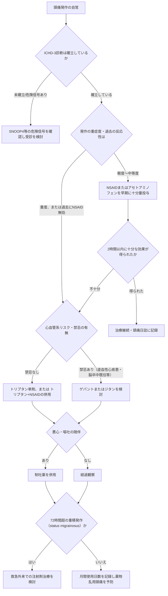
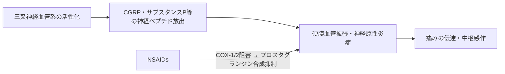
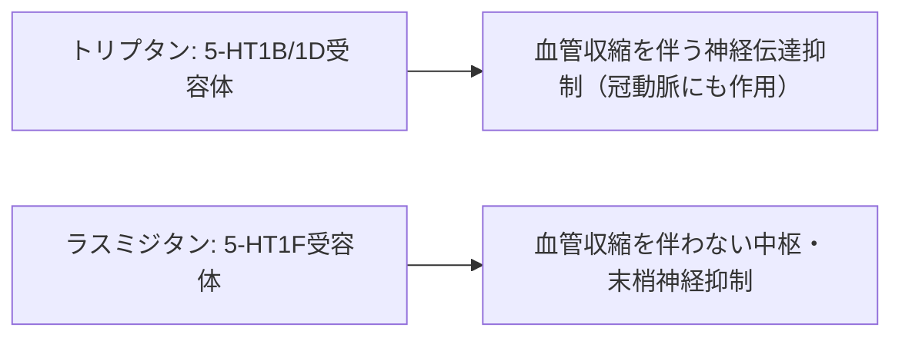
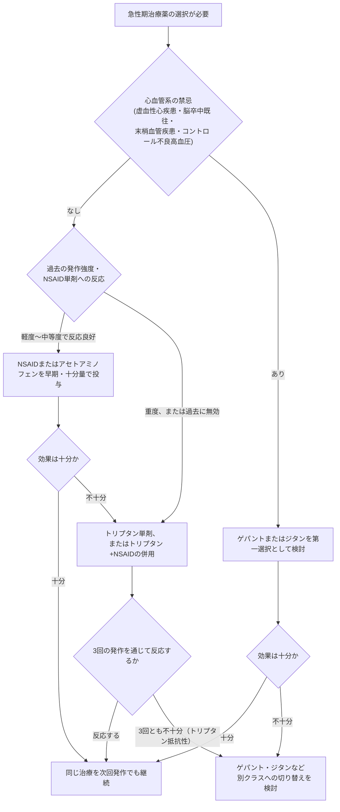
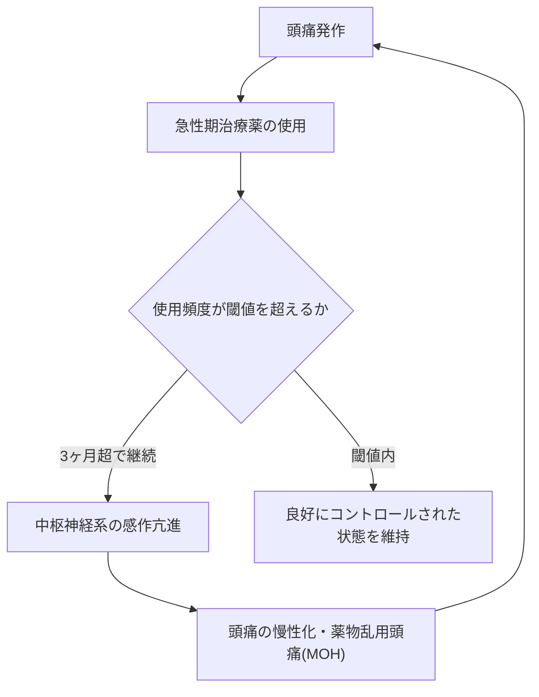

# 頭痛の急性期治療薬 完全ガイド ― アセトアミノフェン・NSAIDs・トリプタン・ジタン・ゲパント

> **対象読者**: 頭痛医学・神経内科領域を学ぶ初学者〜中級者
> **本ガイドの位置づけ**: 国際的な学術文献・診療ガイドラインに基づく教育目的の解説資料です。個々の患者への処方判断は、必ず医師・薬剤師にご相談ください。

---

## 目次

1. [はじめに](#1-はじめに)
2. [急性期治療の基本原則](#2-急性期治療の基本原則)
3. [薬剤クラス別 徹底解説](#3-薬剤クラス別-徹底解説)
   - 3.1 [アセトアミノフェン（パラセタモール）](#31-アセトアミノフェンパラセタモール)
   - 3.2 [NSAIDs（非ステロイド性抗炎症薬）](#32-nsaids非ステロイド性抗炎症薬)
   - 3.3 [トリプタン](#33-トリプタン)
   - 3.4 [ジタン（ラスミジタン）](#34-ジタンラスミジタン)
   - 3.5 [ゲパント（CGRP受容体拮抗薬）](#35-ゲパントcgrp受容体拮抗薬)
   - 3.6 [その他の重要な薬剤・併用療法](#36-その他の重要な薬剤併用療法)
4. [薬剤選択のステップバイステップ・フローチャート](#4-薬剤選択のステップバイステップフローチャート)
5. [薬剤クラス比較表](#5-薬剤クラス比較表)
6. [薬物乱用頭痛（MOH）](#6-薬物乱用頭痛moh)
7. [特別な患者集団での注意点](#7-特別な患者集団での注意点)
8. [まとめ](#8-まとめ)
9. [参考文献・ソース一覧](#9-参考文献ソース一覧)

---

## 1. はじめに

頭痛、特に片頭痛の急性期治療薬は、この20年余りで大きく進化しました。従来のアセトアミノフェン・NSAIDs・トリプタンに加え、2019年以降は「ジタン(ditan)」と「ゲパント(gepant)」という2つの新しい薬剤クラスがFDAに承認され、片頭痛に特異的な薬理学的選択肢が広がっています。

本ガイドは、以下の国際的な情報源を横断的に参照し、各薬剤クラスの**作用機序・代表的薬剤・エビデンス・禁忌・ガイドライン上の位置づけ**を体系的に整理したものです。

- 国際頭痛分類第3版（ICHD-3、国際頭痛学会）
- 米国頭痛学会（AHS）2021年コンセンサスステートメント
- 国際頭痛学会（IHS）の急性期薬物治療に関するグローバル実践推奨（2024年）
- 英国NICEガイドライン（CG150）
- 米国内科学会（ACP）臨床ガイドライン
- Cochrane Library の系統的レビュー群
- 米国FDA承認時の添付文書情報

---

## 2. 急性期治療の基本原則

### 2.1 なぜ「早期治療」が重要なのか

片頭痛発作は、三叉神経血管系の活性化から始まり、時間経過とともに中枢性感作(central sensitization)が進行します。治療が遅れるほど薬剤への反応性が低下するため、AHSやIHSの推奨では「発作の早期、痛みが軽度〜中等度のうちに十分量を投与する」ことが一貫して強調されています。また、急性期治療が長期にわたって最適化されないと、反復発作が慢性片頭痛へ移行するリスク(chronification)が高まることも指摘されています。

### 2.2 治療戦略の考え方：層別化治療（Stratified Care）

伝統的な「弱い薬から段階的に強い薬へ」という画一的な階段状治療(stepped care)に対し、患者ごとの発作強度や機能障害度に応じて最初から適切な強度の薬剤を選ぶ「層別化治療(stratified care)」の方が、臨床アウトカム(頭痛への反応、機能障害の時間)で優れていることが多施設共同のDISC試験などで示されています。

### 2.3 治療目標（AHS 2021コンセンサスステートメントに基づく）

- 迅速かつ一貫した「痛みからの解放(pain-free)」を達成すること
- 悪心・光過敏・音過敏など随伴症状も含めて改善すること
- 機能を回復させ、日常生活・仕事への復帰を早めること
- 再発を最小化し、レスキュー薬の必要性を減らすこと
- 薬物乱用頭痛（後述）を引き起こさないこと
- 副作用を最小限に抑え、安全に長期使用できること

### 2.4 全体像フローチャート

---

## 3. 薬剤クラス別 徹底解説

### 3.1 アセトアミノフェン（パラセタモール）

**概要**
アセトアミノフェン（米国名：acetaminophen、国際一般名：paracetamol）は、非オピオイド系の解熱鎮痛薬で、軽度〜中等度の片頭痛発作に対する単剤治療として広く使用されています。抗炎症作用は非常に弱く、NSAIDsとは薬理学的に区別されます。

**作用機序**
明確な単一機序はまだ解明されていませんが、有力な仮説は以下の通りです。

- 中枢神経系におけるシクロオキシゲナーゼ(COX)経路への弱い阻害作用（末梢のCOX-1/2にはほとんど影響しない）
- 下行性セロトニン抑制系の賦活
- 中枢での一酸化窒素合成やカンナビノイド系（AM404を介したTRPV1活性化）への関与が示唆されている

一時期提唱された「COX-3阻害」仮説は、ヒトで機能的なCOX-3アイソフォームが確認されていないため、現在では主要な機序として支持されていません。

**エビデンス上の位置づけ**
臨床効力のスペクトラムで見ると、アセトアミノフェンはNSAIDsの中でも比較的効果が弱い部類に位置づけられます。ACP（米国内科学会）の臨床ガイドラインでは、トリプタン・NSAIDs・アセトアミノフェン単剤、およびトリプタンとNSAID/アセトアミノフェンの併用がいずれもプラセボに対して有効とされつつ、アセトアミノフェン単剤で反応不十分な場合はトリプタンの追加が提案されています。

**禁忌・注意点**
- 肝毒性: 過量投与・慢性大量摂取・アルコール多飲者では重篤な肝障害のリスク
- 重篤な肝疾患がある患者では禁忌に準じた注意が必要

**ガイドライン上の位置づけ**
英国NICE CG150では、単剤のみを希望する患者に対する選択肢の一つとして、経口トリプタン・NSAID・高用量アスピリン(900mg)と並んでアセトアミノフェンが挙げられています。

---

### 3.2 NSAIDs（非ステロイド性抗炎症薬）

**概要**
イブプロフェン、ナプロキセン、ジクロフェナク、アスピリン、セレコキシブなどが含まれます。市販薬として広く入手可能であり、軽度〜中等度の発作における第一選択薬として国際的に高い地位を占めています。

**作用機序**

NSAIDsはアラキドン酸からプロスタグランジンを合成するCOX-1/COX-2酵素を直接阻害します。プロスタグランジンは末梢の侵害受容器を感作し、神経原性炎症を増強するため、その合成を抑えることで抗炎症・鎮痛効果を発揮します。

**代表的薬剤とエビデンス（Cochrane系統的レビューより）**

| 薬剤 | 代表的用量 | エビデンスの要点 |
|---|---|---|
| イブプロフェン | 400 mg | 2時間時点の完全除痛率26%（プラセボ12%）。可溶性製剤はより速効性 |
| アスピリン | 900〜1000 mg | 13試験のレビューで2時間時点の頭痛軽快率52%（プラセボ32%） |
| ナプロキセン | 500〜825 mg | 単剤でのNNT(2時間完全除痛)は約11と芳しくなく、単独使用の臨床的有用性は限定的 |
| ジクロフェナクカリウム | 50 mg | 速効性製剤としての良好なデータあり |
| セレコキシブ経口液 | ― | AHS 2021コンセンサスステートメントで新たに言及されたNSAID |

臨床効力の観点からは、イブプロフェンやジクロフェナク、インドメタシンなどが比較的良好な選択肢とされ、COX-2選択的阻害薬はNSAIDsに不耐容な患者向けの代替として位置づけられています（ただし血管リスクの観点からは非選択的NSAIDsより優れているわけではありません）。

**禁忌・注意点**
- 消化管潰瘍・出血の既往
- 腎機能障害（特に高齢者、脱水時）
- 心血管疾患（特にCOX-2選択的阻害薬で懸念あり）
- 妊娠後期（特に妊娠30週以降は胎児動脈管早期閉鎖のリスクから原則禁忌）

**ガイドライン上の位置づけ**
NICE CG150は、経口トリプタンとNSAIDの併用、または単剤としてのNSAIDを、患者の希望・併存疾患・有害事象リスクを踏まえて検討するよう推奨しています。

---

### 3.3 トリプタン

**概要**
トリプタンは1990年代に登場した、片頭痛に特異的な最初の薬剤クラスです。スマトリプタン、リザトリプタン、ゾルミトリプタン、エレトリプタン、ナラトリプタン、アルモトリプタン、フロバトリプタンなど複数の薬剤が存在します。

**作用機序**
トリプタンは選択的な5-HT1B/1D受容体作動薬です。

- **5-HT1B受容体**（頭蓋内血管平滑筋に発現）→ 拡張した頭蓋内血管の収縮
- **5-HT1D受容体**（三叉神経終末に発現）→ CGRPやサブスタンスPなど神経原性炎症物質の放出抑制、痛覚伝達の抑制

5-HT1B受容体は冠動脈にも発現しているため、トリプタンには冠血管を含む末梢血管の収縮作用があり、これが後述の心血管系禁忌の根拠になっています。

**エビデンス**
Cochraneレビューによると、経口スマトリプタン50mgはプラセボに対し、2時間時点の完全除痛でNNT 6.1、1時間・2時間の頭痛軽快でそれぞれNNT 7.5・4.0という良好な成績を示しています。133件のRCTを統合したネットワークメタ解析では、標準用量のトリプタンは2時間以内の頭痛軽快率が42〜76%に達し、NSAIDsやアセトアミノフェンと同等かそれ以上、エルゴタミン製剤よりも優れた成績とされています。個別の薬剤では、皮下注射のスマトリプタン、口腔内崩壊錠のリザトリプタン・ゾルミトリプタン、錠剤のエレトリプタンが特に良好な成績と報告されています。

**禁忌・注意点（心血管系リスクが中心）**
- 虚血性冠動脈疾患（狭心症、心筋梗塞既往、冠攣縮を含む）
- 脳卒中・一過性脳虚血発作の既往
- 末梢血管疾患
- コントロール不良の高血圧
- 片麻痺性片頭痛・脳幹性前兆を伴う片頭痛
- WPW症候群など不整脈のリスクを伴う心伝導障害

**ガイドライン上の位置づけ**
IHS(国際頭痛学会)の2024年グローバル実践推奨では、エレトリプタン・リザトリプタン・スマトリプタン・ゾルミトリプタンは単純鎮痛薬やNSAIDsと同等以上に有効であり、単純鎮痛薬・NSAIDsに反応しない患者がトリプタンにも反応しにくいというエビデンスはないため、禁忌がなければトリプタンへの切り替えを推奨するとしています。ACPガイドラインでは、トリプタン(スマトリプタン)とNSAID(ナプロキセン)の併用が、比較検討された選択肢の中で最も高いネット・ベネフィットを示したとされています。

---

### 3.4 ジタン（ラスミジタン）

**概要**
ラスミジタン（商品名: Reyvow）は、2019年10月に米国FDAで承認された「ジタン」クラス最初で唯一の薬剤です。片頭痛特異的な薬剤でありながら、トリプタンとは異なる受容体を標的とすることが最大の特徴です。

**作用機序**

ラスミジタンは高い選択性を持つ5-HT1F受容体作動薬で、5-HT1B/1D受容体への親和性がトリプタンに比べて非常に低いことが特徴です。実験データでは、スマトリプタンがヒト摘出血管を収縮させたのに対し、ラスミジタンは同条件下で血管収縮作用を示さなかったと報告されています。この「血管収縮を伴わない」薬理特性により、心血管疾患を有する患者への使用可能性が期待されています。

**エビデンス**
第III相のSAMURAI試験・SPARTAN試験（合計4,000例超）に基づき承認されました。200mg投与群では、2時間時点の完全除痛率がSAMURAI試験で32.2%、SPARTAN試験で38.8%（プラセボはそれぞれ15.3%、21.3%）と報告されています。

**禁忌・注意点**
- **運転障害**: 中枢神経系抑制作用があり、めまい・傾眠などの有害事象が高頻度に報告されています。FDA添付文書では、服用後**少なくとも8時間は自動車の運転や機械の操作を避ける**よう明記されています。
- 米国では規制物質法上のスケジュールVに指定されています。
- 予防治療目的の適応はなく、あくまで急性期治療薬です。

**ガイドライン上の位置づけ**
心血管疾患のためにトリプタンが使用できない患者、またはトリプタンで十分な効果が得られなかった患者における代替選択肢として、AHS 2021コンセンサスステートメントで新規治療薬の一つとして位置づけられています。

---

### 3.5 ゲパント（CGRP受容体拮抗薬）

**概要**
「ゲパント(gepant)」は、CGRP（カルシトニン遺伝子関連ペプチド）受容体を直接阻害する低分子薬剤の総称です。片頭痛の病態生理においてCGRPが中心的な役割を果たすことが判明したことを受けて開発されました。第一世代のゲパント（テルカゲパント、オルセゲパントなど）は肝毒性の懸念から開発が中止されましたが、第二世代のゲパントはこの問題を克服し、複数の薬剤が承認されています。

**作用機序**
CGRPは三叉神経終末から放出され、硬膜血管の拡張・神経原性炎症・痛覚伝達の亢進を引き起こします。ゲパントはCGRP受容体を競合的に阻害することで、この経路そのものをブロックします。トリプタンやジタンのように受容体を「刺激」するのではなく、CGRP受容体を「遮断」する点が作用機序上の大きな違いです。血管収縮作用を伴わないことも特徴です。

**代表的薬剤**

| 薬剤（商品名） | 適応 | 承認・特徴 |
|---|---|---|
| ウブロゲパント（Ubrelvy） | 急性期治療 | 2019年12月、米国FDA承認。片頭痛(前兆の有無を問わず)の急性期治療薬として世界初承認のゲパント |
| リメゲパント（Nurtec ODT） | 急性期治療＋予防 | 2020年2月に急性期適応でFDA承認。口腔内崩壊錠(ODT)で、急性期と予防の両方に承認された唯一のゲパント |
| ザベゲパント | 急性期治療 | 点鼻スプレー製剤として承認された、より速い吸収を意図したゲパント |
| アトゲパント（Qulipta） | 予防のみ | 急性期治療の適応はなく、予防専用に開発された経口ゲパント |

**エビデンスと安全性の特徴**
ランダム化比較試験では、プラセボと比較して2時間時点の完全除痛率で有意な改善が示されています。有害事象は悪心・口渇・倦怠感など軽度なものが中心で、現行世代のゲパントでは血管収縮や肝毒性のエビデンスは確認されていません。これまでの報告では、ゲパントの使用が薬物乱用頭痛(MOH)を誘発するというエビデンスは見られておらず、心血管疾患は禁忌とされていません。

**ガイドライン上の位置づけ**
NICEは、過去に少なくとも2種類のトリプタンを試して効果不十分、または禁忌があった成人の急性期片頭痛治療において、リメゲパント(舌下投与)を医療技術評価(TA)ガイダンスの中で推奨しています。AHS 2021コンセンサスステートメントでは、トリプタンが禁忌または不耐容な患者への選択肢として位置づけられています。

---

### 3.6 その他の重要な薬剤・併用療法

**エルゴタミン・ジヒドロエルゴタミン(DHE)**
トリプタン登場以前から使用されてきた麦角アルカロイド系薬剤です。5-HT受容体に対する選択性が低く、トリプタンよりも悪心・嘔吐や末梢血管収縮に伴う有害事象が多い一方、再発率の低さから重積発作(status migrainosus)に対する点滴・筋注・点鼻製剤として、入院治療の選択肢に残っています。妊娠中は禁忌です。

**制吐薬（メトクロプラミド、プロクロルペラジンなど）**
悪心・嘔吐がなくても、他の急性期治療薬に追加して考慮すべきとNICEガイドラインで推奨されています。米国のAHS 2016年版救急外来ガイドラインでは、静注メトクロプラミド・静注プロクロルペラジン・皮下注スマトリプタンが推奨され、再発予防としてデキサメタゾンの併用も挙げられています。

**併用療法（トリプタン＋NSAID）**
ACPガイドラインの比較有効性評価では、スマトリプタンとナプロキセンの併用が、単剤治療よりも高いネット・ベネフィットを示したとされています。NICEも同様に、経口トリプタンとNSAID、または経口トリプタンとアセトアミノフェンの併用を選択肢として提示しています。

**避けるべき薬剤：オピオイド**
AHSの救急外来ガイドライン(2016年)では、モルヒネやヒドロモルフォンなどの注射用オピオイドの使用は避けるべきとされています。オピオイドは片頭痛特異的な機序を持たず、薬物乱用頭痛や依存のリスクを高めることが懸念されています。

---

## 4. 薬剤選択のステップバイステップ・フローチャート

以下は、AHS・IHS・NICEの推奨を統合した、実践的な意思決定プロセスです。

---

## 5. 薬剤クラス比較表

| 薬剤クラス | 作用機序 | 代表薬 | 血管収縮作用 | 主な禁忌・注意 | MOHリスク閾値 |
|---|---|---|---|---|---|
| アセトアミノフェン | 中枢性COX阻害・下行性抑制系賦活（機序未確定） | パラセタモール | なし | 重篤な肝疾患、過量投与時の肝毒性 | 月15日以上×3ヶ月超 |
| NSAIDs | 末梢COX-1/2阻害→プロスタグランジン合成抑制 | イブプロフェン、ナプロキセン、ジクロフェナク、アスピリン | なし | 消化管出血、腎障害、心血管リスク、妊娠後期 | 月15日以上×3ヶ月超 |
| トリプタン | 5-HT1B/1D受容体作動 | スマトリプタン、リザトリプタン、ゾルミトリプタン、エレトリプタン | あり（頭蓋内・冠動脈） | 虚血性心疾患、脳卒中既往、末梢血管疾患、コントロール不良高血圧 | 月10日以上×3ヶ月超 |
| ジタン | 5-HT1F受容体作動 | ラスミジタン | なし | 運転障害・CNS抑制（服用後8時間の運転回避）、規制物質 | データ蓄積中 |
| ゲパント | CGRP受容体拮抗 | ウブロゲパント、リメゲパント、ザベゲパント | なし | 軽度AE（悪心・口渇・傾眠）中心、重大な血管禁忌は報告なし | MOH誘発のエビデンスなし |
| エルゴタミン/DHE | 非選択的5-HT受容体作動 | ジヒドロエルゴタミン | あり（末梢性、より非選択的） | 妊娠、末梢血管疾患、トリプタンとの併用禁止 | 月10日以上×3ヶ月超 |

---

## 6. 薬物乱用頭痛（MOH）

急性期治療薬は、使用頻度が高くなりすぎると、かえって頭痛を慢性化させる「薬物乱用頭痛(Medication-Overuse Headache, MOH)」を引き起こすことがあります。国際頭痛分類第3版(ICHD-3)は、以下の診断基準を定めています。

**ICHD-3 診断基準の骨子（8.2 薬物乱用頭痛）**
1. 既存の頭痛性疾患を有する患者において、頭痛が月15日以上で出現する
2. 急性期・対症的な頭痛治療薬を3ヶ月を超えて定期的に乱用している
3. 他のICHD-3診断ではうまく説明できない

**乱用とみなされる使用日数（薬剤クラス別）**

| 薬剤クラス | 乱用の閾値 |
|---|---|
| エルゴタミン、トリプタン、オピオイド、配合鎮痛薬 | 月10日以上を3ヶ月超えて使用 |
| NSAIDs、アセトアミノフェン、アスピリンなどの単純鎮痛薬 | 月15日以上を3ヶ月超えて使用 |
| 複数クラスの併用で単独の薬剤では乱用基準を満たさない場合 | 合計で月10日以上を3ヶ月超えて使用 |

MOHへの対応は、原因薬剤の中止、適切な予防治療の導入、患者教育、そして中止後の経過観察が基本方針とされています。

---

## 7. 特別な患者集団での注意点

**心血管疾患を有する患者**
トリプタンおよびエルゴタミン系薬剤は血管収縮作用を持つため、虚血性心疾患・脳卒中既往・末梢血管疾患のある患者では原則として禁忌です。ゲパントやジタンは血管収縮作用を持たないため、これらの患者における代替選択肢として位置づけられています（ただしジタンは中枢神経抑制作用に注意）。

**妊娠中の患者**
アセトアミノフェンが第一選択として広く推奨されています。NSAIDsは特に妊娠後期（胎児動脈管早期閉鎖のリスク）で避けるべきとされ、エルゴタミン系薬剤は禁忌です。トリプタンについては、レジストリデータの蓄積により以前より安心材料が増えているとする報告もありますが、個別の判断が必要です。

**小児・青年期の患者**
Cochraneレビューでは、イブプロフェンが有効性・安全性・入手性のバランスから小児片頭痛の優れた第一選択肢とされています。パラセタモールを支持する十分なエビデンスは限定的とされ、イブプロフェンが無効な場合の第二選択としてトリプタン（国・地域により承認薬剤が異なる）が挙げられています。なお、**アスピリンはライ症候群のリスクから小児・青年には原則使用しません**（一般的な小児薬理の基本原則として広く知られています）。

---

## 8. まとめ

- 急性期治療の大原則は「発作の早期に、十分量を」投与することです。
- アセトアミノフェン・NSAIDsは軽度〜中等度発作の第一選択ですが、効力には薬剤間で差があります。
- トリプタンは片頭痛特異的な最初の薬剤クラスで、有効性は高い一方、血管収縮作用による心血管系の禁忌に注意が必要です。
- ジタン（ラスミジタン）とゲパント（ウブロゲパント、リメゲパントなど）は、血管収縮を伴わない新しい薬理学的選択肢として、トリプタンが使えない・効かない患者層に新たな道を開いています。
- どの薬剤クラスを使う場合でも、使用頻度の管理は薬物乱用頭痛の予防に不可欠です。

---

## 9. 参考文献・ソース一覧

1. Ailani J, Burch RC, Robbins MS; Board of Directors of the American Headache Society. *The American Headache Society Consensus Statement: Update on integrating new migraine treatments into clinical practice.* Headache. 2021;61(7):1021-1039.
   https://headachejournal.onlinelibrary.wiley.com/doi/10.1111/head.14153

2. Puledda F, Sacco S, Diener HC, et al. *International Headache Society global practice recommendations for the acute pharmacological treatment of migraine.* Cephalalgia. 2024.
   https://journals.sagepub.com/doi/10.1177/03331024241252666

3. International Classification of Headache Disorders 3rd edition (ICHD-3) — 8.2 Medication-overuse headache
   https://ichd-3.org/8-headache-attributed-to-a-substance-or-its-withdrawal/8-2-medication-overuse-headache-moh/

4. NICE Clinical Guideline 150 — *Headaches in over 12s: diagnosis and management*, Recommendations
   https://www.nice.org.uk/guidance/cg150/chapter/recommendations

5. American College of Physicians. *Pharmacologic Treatments of Acute Episodic Migraine Headache in Outpatient Settings: A Clinical Guideline from the American College of Physicians.* Annals of Internal Medicine.
   https://www.acpjournals.org/doi/10.7326/ANNALS-24-03095

6. Rabbie R, Derry S, Moore RA. *Ibuprofen with or without an antiemetic for acute migraine headaches in adults.* Cochrane Database Syst Rev.
   https://www.cochrane.org/evidence/CD008039_ibuprofen-or-without-antiemetic-acute-migraine-headaches-adults

7. Law S, Derry S, Moore RA. *Naproxen with or without an antiemetic for acute migraine headaches in adults.* Cochrane Database Syst Rev.
   https://www.cochrane.org/evidence/CD009455_naproxen-acute-migraine-adults

8. Derry CJ, Derry S, Moore RA. *Sumatriptan (oral route of administration) for acute migraine attacks in adults.* Cochrane Database Syst Rev.
   https://www.cochrane.org/evidence/CD008615_sumatriptan-oral-route-administration-acute-migraine-attacks-adults

9. Richer L, et al. *Drugs for the acute treatment of migraine in children and adolescents.* Cochrane Database Syst Rev.
   https://www.cochranelibrary.com/cdsr/doi/10.1002/14651858.CD005220.pub2/full

10. Pardutz A, Schoenen J. *NSAIDs in the Acute Treatment of Migraine: A Review of Clinical and Experimental Data.* Pharmaceuticals (Basel). 2010.
    https://pmc.ncbi.nlm.nih.gov/articles/PMC4033962/

11. Cameron C, et al. *Triptans in the Acute Treatment of Migraine: A Systematic Review and Network Meta-Analysis.* Headache. 2015.
    https://pubmed.ncbi.nlm.nih.gov/26178694/

12. Hutchinson S. *Triptans & Cardiovascular Safety: How to Assess the Risk?* American Headache Society Scottsdale Symposium資料.
    https://cdn.ymaws.com/welcome.ahsnet.org/resource/resmgr/2016_Scottsdale_Headache_Symposium/Presentation_Slides/Thursday/Hutchinson-Susan_Triptans--C.pdf

13. Triptans for Migraine: Balancing Potential Vascular Risk With Meaningful Benefit. Journal of the American Heart Association.
    https://www.ahajournals.org/doi/full/10.1161/JAHA.125.048385

14. FDA Prescribing Information — REYVOW (lasmiditan) tablets.
    https://www.accessdata.fda.gov/drugsatfda_docs/label/2019/211280s000lbl.pdf

15. Rubio-Beltrán E, et al. *Characterization of binding, functional activity, and contractile responses of the selective 5-HT1F receptor agonist lasmiditan.* Br J Pharmacol.
    https://www.ncbi.nlm.nih.gov/pmc/articles/PMC6965684/

16. Scott LJ. *Ubrogepant: First Approval.* Drugs. 2020.
    https://www.ncbi.nlm.nih.gov/pmc/articles/PMC7062659/

17. Gepants: targeting the CGRP pathway for migraine relief. Frontiers in Pharmacology. 2025.
    https://www.ncbi.nlm.nih.gov/pmc/articles/PMC12678924/

18. Small-molecule CGRP receptor antagonists: A new approach to the acute and preventive treatment of migraine. ScienceDirect.
    https://www.sciencedirect.com/science/article/pii/S2590098620300403

19. Medication-Overuse Headache. StatPearls, NCBI Bookshelf.
    https://www.ncbi.nlm.nih.gov/books/NBK538150/

20. Analgesic Effect of Acetaminophen: A Review of Known and Novel Mechanisms of Action. Frontiers in Pharmacology. 2020.
    https://www.frontiersin.org/journals/pharmacology/articles/10.3389/fphar.2020.580289/full

21. Migraine Headache Guidelines: Guidelines Summary (AHS 2016年救急外来ガイドライン、オピオイド回避に関する記載を含む). Medscape.
    https://emedicine.medscape.com/article/1142556-guidelines

---

*本ガイドは教育・情報提供を目的としたものであり、個別の診断・処方の代替とはなりません。実際の治療方針は、必ず医療専門職にご相談ください。*
