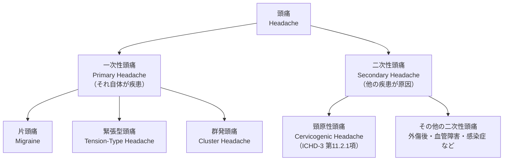
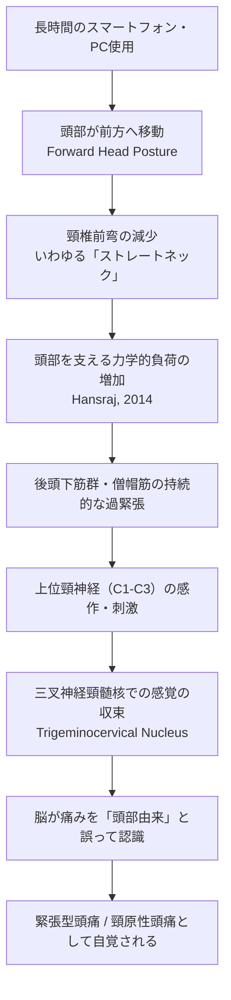
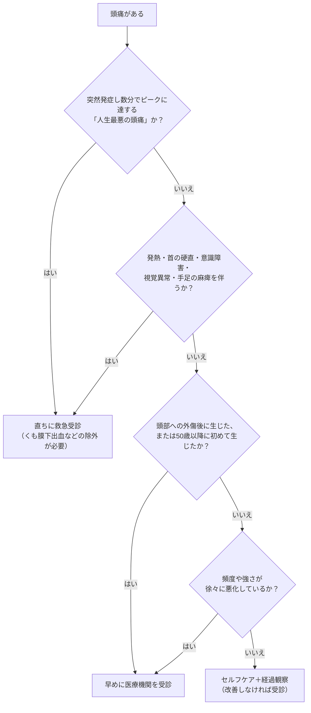

# 頭痛とストレートネック（Forward Head Posture）— エビデンスに基づく完全ガイド

> 本記事は国際的に公開されている医学論文・公的医療機関の資料に基づき、初学者向けにステップバイステップで解説したものです。**診断や治療の代替にはなりません。** 気になる症状がある場合は、必ず医師・理学療法士などの専門家に相談してください。

---

## 目次

1. 頭痛の全体像を知る
2. 「ストレートネック」とは何か
3. なぜ姿勢が頭痛を引き起こしうるのか（メカニズム）
4. 科学的エビデンスは何を示しているか
5. セルフチェックの方法
6. 危険な頭痛のサイン（レッドフラッグ）
7. エビデンスに基づく対処法
8. まとめ
9. 参考文献・情報源

---

## Step 1. 頭痛の全体像を知る

### 1-1. 頭痛は世界的にどれほど多いのか

頭痛性疾患は、世界保健機関（WHO）によれば全世界で最も頻度の高い神経疾患の一つであり、2021年のGlobal Health Estimatesでは片頭痛は脳卒中・新生児脳症に次いで世界第3位のDALY（障害調整生命年）原因とされています[1]。また2023年時点のGlobal Burden of Disease研究では、世界で約29億人が何らかの頭痛性疾患の影響を受けており、年齢調整有病率は34.6%と報告されています[18]。

つまり、頭痛は「珍しい病気」ではなく「人類の大多数が経験する、しかし軽視されやすい疾患」だと言えます。

### 1-2. 頭痛はどう分類されるのか（ICHD-3）

頭痛の国際的な診断基準は、国際頭痛学会（International Headache Society）が策定する**国際頭痛分類第3版（ICHD-3）**です[2][3]。ICHD-3は頭痛を大きく「一次性頭痛」と「二次性頭痛」に分けています。

本記事のテーマである「ストレートネック（首の構造の変化）と頭痛」は、主に **緊張型頭痛** と **頸原性頭痛（cervicogenic headache）** の2つに関わってきます。

### 1-3. 主要な頭痛タイプの比較

| 特徴 | 緊張型頭痛 | 片頭痛 | 頸原性頭痛 |
|---|---|---|---|
| 痛みの性質 | 締め付けられる・圧迫されるような痛み | ズキズキとした拍動性の痛み | 片側性で、首の後ろから頭部へ広がる痛み |
| 主な部位 | 両側性が多い | 片側性が多い | 片側性（首の動きで誘発・悪化） |
| よくある随伴症状 | 首・肩の筋肉のこわばり | 光過敏・音過敏・吐き気 | 頸部可動域の制限、首を押すと痛みが再現される |
| 位置づけ | 一次性頭痛 | 一次性頭痛 | 二次性頭痛（首の構造的問題に起因） |
| 出典 | Cleveland Clinic[13] | WHO[1] | StatPearls（NIH）[4]／Cleveland Clinic[14] |

---

## Step 2. 「ストレートネック」とは何か

### 2-1. 頸椎の基本構造

頸椎（首の骨）は7個の椎骨（C1〜C7）から構成されており、健康な状態では前方に緩やかに湾曲した「生理的前弯（cervical lordosis）」というC字型のカーブを描いています。この前弯は、頭部（成人でおよそ4.5〜5.5kg）の重さを効率よく支え、衝撃を分散させるための構造です。

一般的に健康な頸椎前弯角度は、立位側面X線で**約20〜40度**の範囲とされています（個人差は大きい）[19]。

> 補足：「ストレートネック」は日本で広く使われる通称ですが、国際的な医学文献ではおおむね以下の用語が対応する概念として扱われています。
> - **Loss of cervical lordosis**（頸椎前弯の減少・消失）
> - **Forward Head Posture, FHP**（頭部前方位）
> - **Military neck**（軍人の首、という通称。前弯が失われ真っ直ぐになった状態）

### 2-2. なぜ首がまっすぐになってしまうのか

長時間のスマートフォンやパソコンの使用、デスクワーク中の前かがみ姿勢などにより、頭部が肩よりも前方に移動した状態が慢性的に続くと、頸椎を支える筋肉のバランスが崩れ、前弯が徐々に失われていくと考えられています[19][9]。この状態は「テックネック（tech neck）」「テキストネック（text neck）」とも呼ばれます。

### 2-3. 頭部前方位を測る指標：頭蓋脊椎角（CVA）

臨床研究では、頭部前方位の程度を **頭蓋脊椎角（Craniovertebral Angle, CVA）** という指標で数値化することが一般的です。これは、耳垂（耳たぶ）と第7頸椎棘突起を結ぶ線と、水平線がなす角度で、この角度が小さいほど頭部が前方に突出していることを意味します[9][8]。

---

## Step 3. なぜ姿勢が頭痛を引き起こしうるのか（メカニズム）

### 3-1. 力学的負荷：頭を傾けるほど首への負担は跳ね上がる

米国の脊椎外科医Kenneth Hansraj氏による2014年の生体力学研究は、頭部の前傾角度が増えるごとに頸椎にかかる負荷（相対的な重み）がどれほど増加するかを定量化しました[7]。

| 頭部の前傾角度 | 頸椎にかかる相対的な負荷 |
|---|---|
| 0°（耳が肩の真上にある自然な姿勢） | 約4.5〜5.5kg（頭部本来の重さ） |
| 15° | 約12kg |
| 30° | 約18kg |
| 45° | 約22kg |
| 60°（スマートフォンを見る際の典型的な角度） | 約27kg |

出典：Hansraj, K. K. (2014). *Surgical Technology International*, 25, 277–279.[7]

この研究は今日の生活習慣（スマホ・PC使用）に伴う頸部負荷を象徴するデータとしてしばしば引用されますが、単一の生体力学モデルに基づく試算である点には留意が必要です。

### 3-2. 筋の持続的緊張と緊張型頭痛

Cleveland Clinicの解説によれば、緊張型頭痛は後頭部から首、頭皮にかけての筋肉の緊張が関与していると考えられており、その誘因として睡眠不足・不良姿勢・ストレスが挙げられています[13]。頭部前方位が続くと、後頭下筋群や僧帽筋上部は頭の重みを支え続けるために持続的に収縮し、筋の過緊張・血流低下・痛覚過敏を招くと考えられています。

### 3-3. 神経学的メカニズム：三叉神経頸髄核における「収束」

頸部由来の痛みがなぜ「頭痛」として感じられるのか。その鍵となるのが **三叉神経頸髄核（trigeminocervical nucleus）** です。

NIHの医学教育資料（StatPearls）によると、上位頸神経（C1〜C3）は、顔面や頭部の感覚を伝える三叉神経の脊髄路核と、脳幹〜上位頸髄のレベルで神経学的に収束（合流）しています[4][5]。この収束構造のために、本来は首から発生した痛み信号が、脳内では「頭部から来た痛み」として誤って認識されることがあります[6]。

### 3-4. 頸原性頭痛の国際診断基準（ICHD-3）

ICHD-3における頸原性頭痛（第11.2.1項）の診断は、大まかに以下の要件で構成されています[3][4]。

- 頭痛の原因として、頸椎または頸部軟部組織の障害・病変が臨床的または画像的に確認できること
- 以下のうち少なくとも2つで、頸部の問題と頭痛の因果関係が示されること
  1. 頸部の障害の発症と時間的に一致して頭痛が始まった
  2. 頸部の障害の改善と並行して頭痛が改善・消失した
  3. 頸部の可動域が制限されており、誘発動作で頭痛が明らかに悪化する
  4. 頸部の構造やその神経支配への診断的ブロック注射で頭痛が消失する
- 他のICHD-3診断ではうまく説明できないこと

---

## Step 4. 科学的エビデンスは何を示しているか

姿勢と頭痛の関係は、臨床的には広く語られる一方で、研究者の間では**まだ議論が続いているテーマ**です。誠実な理解のために、代表的な研究を紹介します。

| 研究 | デザイン | 対象規模 | 主な知見 | 出典 |
|---|---|---|---|---|
| Mahmoud et al., 2019 | システマティックレビュー＋メタ分析 | 15研究・2,339人 | 頸部痛のある人はFHPの角度が有意に大きい（平均差4.84度）。ただし因果関係の証明にはなお議論の余地があると結論 | [8] |
| Usen & Demiroz Gunduz, 2025 | 横断研究 | 117人（FHPを有する頸部痛患者） | FHP患者の53.8%が頸原性頭痛を併発。CVAが小さい（＝頭部前方位が強い）ほど頸原性頭痛のリスクが高い | [9] |
| Fernández-de-las-Peñas ら, 2022 | 専門家によるポジションペーパー | — | 緊張型頭痛患者にも頭部前方位・頸部可動域制限・頸部感作が共通してみられると報告 | [10] |
| Jull et al., 2002 | ランダム化比較試験（RCT） | 200人（頸原性頭痛患者） | 頸部エクササイズと徒手療法により、12ヶ月後も頭痛の頻度・強度が有意に改善（対照群と比較） | [11] |

### 誠実な留意点

Mahmoud らのレビュー（2019）が明言しているように、「頭部前方位が頸部痛や頭痛の“原因”である」という主張は、依然として**議論の的**です[8]。多くの研究は横断研究（ある一時点での相関関係を見る研究）であり、「姿勢が悪いから頭痛になる」のか「頭痛や頸部の問題があるから姿勢が崩れる」のか、因果の向きを完全には特定できていません。世界トップクラスの研究者としての誠実な立場は、「姿勢と頭痛には統計的な関連が繰り返し報告されているが、単純な一方向の因果関係と断定するのは時期尚早である」というものです。

---

## Step 5. セルフチェックの方法

以下は一般的な教育目的のセルフチェックであり、医学的診断ではありません。

1. **壁を使ったチェック**：かかと・お尻・肩甲骨を壁につけて自然に立ったとき、後頭部が無理なく壁につくかどうかを確認する。頭を大きく前に出さないと壁につかない場合、頭部前方位の可能性があります。
2. **横からの写真チェック**：リラックスした状態で真横から全身写真を撮り、耳の穴の位置が肩の中心（肩峰）の真上にあるかを確認する。耳が肩よりも明らかに前に出ている場合、頭部前方位のサインである可能性があります[9]。
3. **症状のセルフモニタリング**：後頭部から始まる片側性の頭痛、首を動かすと悪化する頭痛、首・肩のこわばりを伴う頭痛がある場合は、頸部由来の頭痛の可能性を考慮し、専門家に相談することが推奨されます[14]。

---

## Step 6. 危険な頭痛のサイン（レッドフラッグ）

姿勢由来の頭痛の多くは良性ですが、**まれに緊急性の高い病気が背景にある頭痛**も存在します。英国国民保健サービス（NHS）は、以下のような症状がある場合はただちに医療機関を受診するよう案内しています[16][17]。

上記のいずれかに該当する場合は、本記事のようなセルフケア情報を参照する前に、必ず医療機関を受診してください[16][17]。

---

## Step 7. エビデンスに基づく対処法

### 7-1. 運動療法：頸部エクササイズの効果

頸原性頭痛に関する系統的レビュー（システマティックレビュー）は、頸部エクササイズ（特に深頸屈筋の強化を含むcraniocervical flexion exercise）や徒手療法が、頭痛の頻度と強度の改善に有効である可能性を報告しています[12]。特にJullら（2002）のRCTでは、6週間の頸部エクササイズ（背臥位での等尺性craniocervical flexion運動、肩甲骨の retraction、姿勢指導など）を行った群で、12ヶ月後も頭痛の頻度・強度・頸部痛指数（Northwick Park Neck Pain Index）の有意な改善が維持されていました[11]。

### 7-2. Cleveland Clinicが推奨するセルフケア

Cleveland Clinicは緊張型頭痛の予防・軽減策として、以下のようなアプローチを紹介しています[13][15]。

- 長時間同じ姿勢を続けず、こまめに動く（"motion is lotion"の考え方）
- 首・肩のストレッチを日常的に取り入れる
- デスク環境の見直し（モニターの高さ、椅子の高さなど）

### 7-3. NHS（英国国民保健サービス）が推奨する日常対策

NHSは緊張型頭痛への対処として、十分な休養・水分摂取・規則正しい食事・リラックスできる活動（運動、ヨガ、マッサージなど）を推奨しており、鎮痛薬の使用は月10〜15日を超えないよう注意を呼びかけています（使いすぎによる薬物乱用頭痛の予防のため）[17]。

---

## Step 8. まとめ

1. 頭痛は世界的に非常に頻度の高い疾患であり、緊張型頭痛と頸原性頭痛は「首」との関連が深いタイプである[1][4][18]。
2. 「ストレートネック」は国際文献における「頭部前方位（FHP）」「頸椎前弯の減少（loss of cervical lordosis）」に相当する概念であり、頭部を支える力学的負荷の増加と関連する[7][19]。
3. 首と頭痛をつなぐ神経学的な鍵は「三叉神経頸髄核」における感覚の収束であり、これによって頸部由来の痛みが頭痛として知覚され得る[4][5][6]。
4. 姿勢と頭痛の関連は多くの研究で報告されているが、因果関係の証明はなお議論が続いており、断定的な結論は避けるべきである[8][10]。
5. 突然の激しい頭痛や神経症状を伴う頭痛は、姿勢由来と自己判断せず、直ちに医療機関を受診すべきである[16][17]。
6. 頸部エクササイズや姿勢改善など、エビデンスに支持された対処法が存在する[11][12][13]。

---

## Step 9. 参考文献・情報源

本記事は以下の国際的に認可・査読された情報源に基づいています。

[1] World Health Organization. *Migraine and other headache disorders*.
https://www.who.int/news-room/fact-sheets/detail/headache-disorders

[2] International Headache Society. *The International Classification of Headache Disorders, ICHD-3*.
https://ichd-3.org/

[3] International Headache Society. *ICHD-3 Pocket version* (PDF).
https://ihs-headache.org/wp-content/uploads/2020/05/ICHD-3-Pocket-version.pdf

[4] National Institutes of Health (NIH) – NCBI Bookshelf, StatPearls. *Cervicogenic Headache*.
https://www.ncbi.nlm.nih.gov/books/NBK507862/

[5] NIH – PubMed Central (PMC). *Understanding Cervicogenic Headache*.
https://www.ncbi.nlm.nih.gov/pmc/articles/PMC3821111/

[6] PubMed. *Cervicogenic headache: a review of diagnostic and treatment strategies*.
https://pubmed.ncbi.nlm.nih.gov/15928349/

[7] PubMed. Hansraj, K. K. (2014). *Assessment of stresses in the cervical spine caused by posture and position of the head. Surgical Technology International*, 25, 277–279.
https://pubmed.ncbi.nlm.nih.gov/25393825/?dopt=Abstract

[8] PubMed. Mahmoud, N. F. et al. (2019). *The Relationship Between Forward Head Posture and Neck Pain: a Systematic Review and Meta-Analysis. Current Reviews in Musculoskeletal Medicine*, 12(4), 562–577.
https://pubmed.ncbi.nlm.nih.gov/31773477/?dopt=Abstract

[9] NIH – PubMed Central (PMC). Usen, A., Demiroz Gunduz, M. (2025). *Cervicogenic headache in forward head posture: frequency and associated factors in a cross-sectional study*.
https://pmc.ncbi.nlm.nih.gov/articles/PMC12520431/

[10] ScienceDirect（査読誌）. *Cervicogenic headache, an easy diagnosis? / The cervical spine in tension-type headache: position paper*.
https://www.sciencedirect.com/science/article/abs/pii/S2468781222001400

[11] Macquarie University Research Portal. Jull, G. et al. (2002). *A Randomized Controlled Trial of Exercise and Manipulative Therapy for Cervicogenic Headache*.
https://researchers.mq.edu.au/en/publications/a-randomized-controlled-trial-of-exercise-and-manipulative-therap/

[12] NIH – PubMed Central (PMC). *The effectiveness of manual and exercise therapy on headache intensity and frequency among patients with cervicogenic headache: a systematic review and meta-analysis*.
https://pmc.ncbi.nlm.nih.gov/articles/PMC9682850/

[13] Cleveland Clinic. *Tension Headache: Symptoms & Treatment*.
https://my.clevelandclinic.org/health/diseases/8257-tension-headaches

[14] Cleveland Clinic. *Cervicogenic Headache: What It Is, Symptoms & Treatment*.
https://my.clevelandclinic.org/health/diseases/cervicogenic-headache

[15] Cleveland Clinic. *Neck Pain: 6 Common Causes and Treatments*.
https://my.clevelandclinic.org/health/symptoms/21179-neck-pain

[16] NHS (UK National Health Service). *Headaches*.
https://www.nhs.uk/symptoms/headaches/

[17] NHS (UK National Health Service). *Tension headaches*.
https://www.nhs.uk/conditions/tension-headaches/

[18] The Lancet Neurology. *Global, regional, and national burden of headache disorders, 1990–2023: a systematic analysis for the Global Burden of Disease Study 2023*.
https://www.thelancet.com/journals/laneur/article/PIIS1474-4422(25)00402-8/fulltext

[19] 頸椎前弯角度の一般的範囲については、臨床解剖学・脊椎外科分野で広く参照される数値（約20〜40度）を採用しています。個人差があり、単一の「正常値」で判定すべきではない点に留意してください。

---

*本記事は教育目的の一般的な医学情報であり、個別の診断・治療方針を示すものではありません。症状が続く場合、悪化する場合、または上記「危険な頭痛のサイン」に該当する場合は、速やかに医療専門家に相談してください。*
