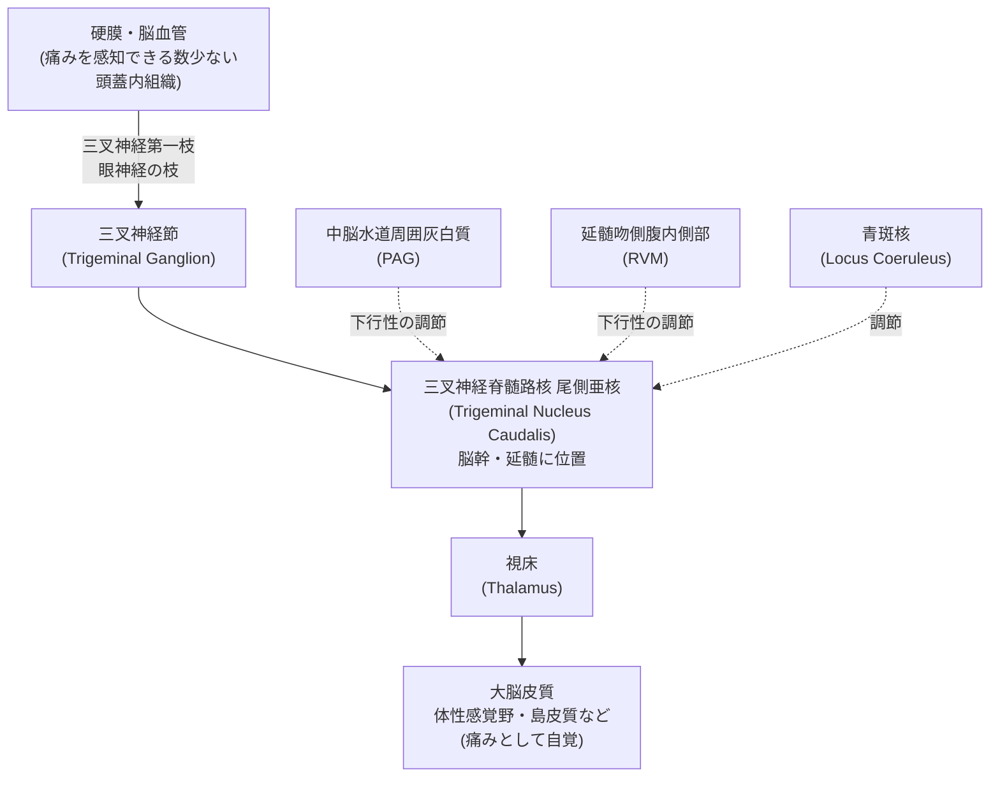
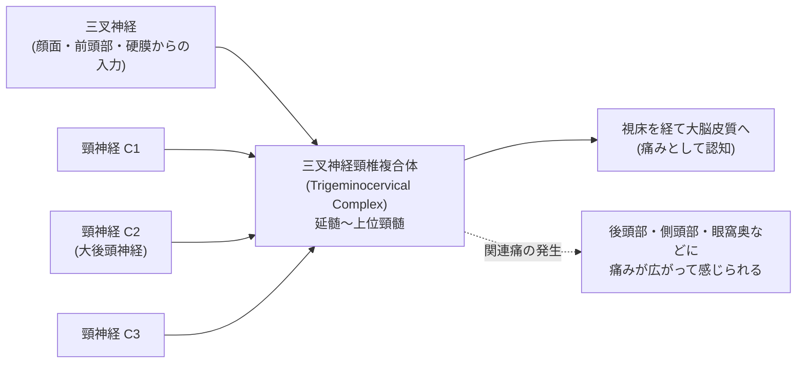
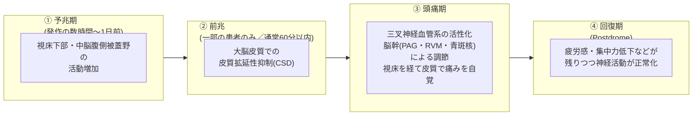

# 頭痛と脳・脳幹 ― 国際文献に基づく神経科学的解説

> 本稿は、国際頭痛学会（International Headache Society, IHS）、世界保健機関（WHO）、米国国立神経疾患・脳卒中研究所（NINDS/NIH）、および *Physiological Reviews*・*Nature Reviews Neurology*・*The Lancet Neurology* 等に掲載された査読済み総説論文をもとに、頭痛に関わる脳・脳幹の仕組みを初学者向けに整理したものです。医学的診断や治療方針の決定を目的としたものではありません。強い頭痛、突然発症した頭痛、今までと性質の異なる頭痛がある場合は、必ず医療機関を受診してください。

---

## 目次

1. この記事の位置づけ
2. 頭痛とは何か ― 国際的な分類の枠組み
3. 「痛みを感じる脳」というよくある誤解
4. 三叉神経血管系 ― 頭痛が生まれる入口
5. 脳幹 ― 頭痛の中継点であり調整役
6. 三叉神経頸椎複合体 ― 首と頭痛がつながる理由
7. 視床下部 ― 予兆症状と発作の周期性
8. 大脳皮質と皮質拡延性抑制（CSD）― 前兆のメカニズム
9. 片頭痛発作の全体像（統合フローチャート）
10. 群発頭痛と三叉神経自律神経反射
11. まとめ表 ― 脳・脳幹の主要構造と頭痛への関与
12. 治療標的との接点
13. 参考文献・情報源

---

## 1. この記事の位置づけ

頭痛は世界的に非常にありふれた神経症状ですが、その背後にある神経科学は決して単純ではありません。WHOのファクトシートによれば、頭痛疾患は神経系疾患の中でも特に頻度の高いものの一つであり、片頭痛・緊張型頭痛・群発頭痛などの一次性頭痛が、痛みそのものを主症状とする疾患として位置づけられています［出典12］。

かつて頭痛は「血管の拡張・収縮」だけで説明される「血管性頭痛」と考えられていました。しかし1980年代以降の研究により、頭痛は末梢の血管だけでなく、三叉神経系・脳幹・視床下部・大脳皮質が相互に関わる「神経血管性（neurovascular）」な現象であることが明らかになっています［出典1, 6, 8］。本稿では、この神経科学的な理解を段階的に解説します。

---

## 2. 頭痛とは何か ― 国際的な分類の枠組み

頭痛の診断・研究における国際標準は、国際頭痛学会が発行する **国際頭痛分類第3版（ICHD-3）** です。ICHD-3はWHOの国際疾病分類（ICD）とも連携しており、世界中の臨床・研究で共通言語として用いられています［出典13, 14, 15］。

ICHD-3は頭痛を大きく3つの部門に分けています。

| 部門 | 内容 | 代表的な疾患 |
|---|---|---|
| 一次性頭痛 | 頭痛そのものが病気の本体であり、他の疾患の症状ではないもの | 片頭痛、緊張型頭痛、群発頭痛などの三叉神経自律神経性頭痛 |
| 二次性頭痛 | 他の疾患（外傷、血管障害、感染など）に起因して生じるもの | 薬物乱用頭痛、くも膜下出血に伴う頭痛など |
| 有痛性脳神経ニューロパチー・顔面痛・その他の頭痛 | 脳神経そのものの障害などによるもの | 三叉神経痛など |

本稿では、一次性頭痛（特に片頭痛・群発頭痛）の発生に脳・脳幹がどう関わるかに焦点を当てます。これは研究が最も進んでいる領域であり、脳幹の役割を理解する上で最も情報量の多いテーマだからです［出典16, 17］。

---

## 3. 「痛みを感じる脳」というよくある誤解

初学者が誤解しやすい点として、「頭痛＝脳そのものが痛んでいる」というイメージがあります。しかし、これは神経解剖学的には正確ではありません。

脳の実質（神経細胞やグリア細胞が集まった組織そのもの）には、痛みを感知する侵害受容器がほとんど存在しません。実際に痛みを感じる（＝侵害刺激を受容できる）頭蓋内の構造は限られており、主に以下のようなものです。

- 硬膜（脳を包む一番外側の膜）とその血管
- 静脈洞（硬膜内を走る太い静脈）
- 頭蓋底付近の大血管（内頸動脈・椎骨動脈など）
- 頭皮・頭蓋骨周囲の筋肉や血管

これらの構造は主に三叉神経（特に第一枝である眼神経）と、上位頸髄神経（C1〜C3）によって支配されています［出典7, 9, 10］。つまり頭痛の「痛みの発生源」は脳そのものではなく、脳を取り巻く膜・血管・神経であり、その情報が脳幹を経由して脳へと伝えられることで「頭が痛い」という知覚が生まれるのです。

---

## 4. 三叉神経血管系 ― 頭痛が生まれる入口

この硬膜・血管と脳をつなぐ神経回路網は、**三叉神経血管系（trigeminovascular system）** と呼ばれます。1980年代にMoskowitzらのグループによって提唱され、その後May・Goadsbyらによって体系的にまとめられた、頭痛研究における中核的な概念です［出典1, 8］。

基本的な流れは次の通りです。



三叉神経節の細い感覚神経線維（C線維・Aδ線維）は、硬膜血管の周囲に分布しています。これらの神経終末は、CGRP（カルシトニン遺伝子関連ペプチド）やサブスタンスPといった神経ペプチドを含んでおり、刺激されると血管を拡張させると同時に、痛みの信号を脳幹へと伝えます［出典3, 4, 18, 19］。特にCGRPは、片頭痛発作時に血中濃度が上昇することが確認されており、現在の片頭痛治療薬（後述）の主要な標的にもなっています［出典18, 19, 20］。

重要なのは、この経路が一方向ではないという点です。硬膜から脳幹への「上行性」の痛み信号だけでなく、脳幹から硬膜血管への「下行性」の調節（三叉神経副交感神経反射など）も存在し、双方向のループを形成しています［出典1］。

---

## 5. 脳幹 ― 頭痛の中継点であり調整役

脳幹は、単なる「痛み信号の通り道」ではなく、痛みの強さそのものを増幅させたり抑制させたりする調整役として働きます。ここでは頭痛研究において特に重要とされる脳幹核をひとつずつ見ていきます。

### 5-1. 三叉神経脊髄路核 尾側亜核（Trigeminal Nucleus Caudalis, TNC）

三叉神経の中枢側の入口にあたる核で、延髄から上位頸髄（C1〜C2）にかけて連続的に広がっています。硬膜や顔面から届いた痛み信号を最初に受け取る「二次ニューロン」が存在する場所であり、後述する三叉神経頸椎複合体の中心的な構成要素です［出典7, 9, 10］。

### 5-2. 中脳水道周囲灰白質（Periaqueductal Gray, PAG）

中脳に位置するPAGは、古くから全身の痛みを抑制する「下行性疼痛抑制系」の中枢として知られてきました。動物実験ではPAGを刺激するとTNCニューロンの活動が抑えられ、逆にPAGの機能を薬理学的に阻害すると、TNCニューロンの自発活動・痛み関連活動がともに増加することが示されています［出典5, 11］。

### 5-3. 延髄吻側腹内側部（Rostral Ventromedial Medulla, RVM）

RVMはPAGからの下行性信号をTNCへ中継する「通過点」として働くと考えられており、状況に応じて痛みを促進する方向にも抑制する方向にも働き得る、双方向性の調節を担っています［出典5, 11］。

### 5-4. 青斑核（Locus Coeruleus, LC）・縫線核（Raphe Nuclei）

青斑核はノルアドレナリン作動性ニューロンが集まる脳幹核で、覚醒・注意・自律神経調節に関わることで知られていますが、頭痛研究においてもCGRPやPACAP（下垂体アデニル酸シクラーゼ活性化ポリペプチド）を含む神経細胞体が高密度に存在することが確認されており、三叉神経頸椎複合体の活動調節に関与すると考えられています［出典2, 6］。縫線核はセロトニン作動性の中枢であり、同様に下行性の痛み調節に関わります。

### 5-5. 「片頭痛発生装置（migraine generator）」論争

1990年代のPET研究で、片頭痛発作中に中脳・橋（背外側橋、dorsolateral pons）に活動の増加が観察されたことから、この領域が発作そのものを引き起こす「片頭痛発生装置」であるとする仮説が提唱されました［出典6, 21］。

一方で、この仮説には現在も活発な学術的議論があります。批判的な立場の研究者は、脳幹の活動は片頭痛に特異的ではなく、他の痛みの状態でも同様に観察されうること、またPAGそのものが発作中に常に活性化しているとは限らないことを指摘し、「発生装置」という単純化した見方よりも、背外側橋周辺の核群が顔面・頭蓋周囲の圧痛、吐き気、感覚の変調、そして痛みの調節といった複数の機能に関わる、より複雑な役割を担っているとする見解を示しています［出典22］。

このように、脳幹が片頭痛の病態に深く関与していること自体は多くの研究で一致していますが、その関与が「発作の引き金」なのか「発作に伴う調節反応」なのかについては、現在も国際的な議論が続いているというのが正確な理解です［出典17, 21, 22］。

---

## 6. 三叉神経頸椎複合体 ― 首と頭痛がつながる理由

「肩や首のこりが頭痛につながる」という経験は多くの人にありますが、これには明確な神経解剖学的根拠があります。

三叉神経脊髄路核尾側亜核は、解剖学的に上位頸髄（C1〜C3、特にC2）の後角と連続しており、両者はまとめて **三叉神経頸椎複合体（Trigeminocervical Complex, TCC）** と呼ばれます［出典7, 9, 10, 23］。



TCCでは、三叉神経（顔・前頭部・硬膜からの入力）と上位頸神経（後頭部・首からの入力）の信号が同じ二次ニューロンに収束（convergence）します。脳はこの収束した信号の「発信源」を正確に区別できないため、首の構造からの痛み信号が頭部の痛みとして自覚されたり、逆に頭痛が首や肩の症状として自覚されたりする「関連痛」が起こります［出典9, 10, 23, 24］。これが、緊張型頭痛や片頭痛でしばしば首のこわばりや後頭部の痛みを伴う神経学的な背景です。

---

## 7. 視床下部 ― 予兆症状と発作の周期性

片頭痛発作の多くは、頭痛そのものが始まる数時間から1日ほど前に、あくび、集中力低下、疲労感、食欲の変化、頻尿といった「予兆症状（premonitory symptoms）」を伴うことが知られています［出典17, 25, 26］。

これらの予兆症状の背景には視床下部の活動があると考えられています。ニトログリセリンで片頭痛発作を誘発する実験でH2(15)O-PETを用いた研究では、頭痛が始まる前の予兆期の段階で、後部視床下部・中脳腹側被蓋野・PAGの血流増加（活動の増加）が観察されました［出典17, 25］。この所見は、視床下部が片頭痛発作の非常に早い段階、すなわち痛みが発生するよりも前の段階から関与していることを示す重要な証拠とされています。

視床下部の関与は群発頭痛においてさらに明確です。Mayらによる1998年のPET研究では、群発頭痛発作中に限って**後部視床下部灰白質**の活動が特異的に増加することが示されました。この活動は発作間欠期には見られず、片頭痛や実験的な頭部痛でも同様の所見は認められませんでした［出典27, 28, 29］。この発見は、群発頭痛の特徴である厳密な日内・季節性の周期性（体内時計様の規則性）を説明する神経基盤として重視されています［出典30］。

---

## 8. 大脳皮質と皮質拡延性抑制（CSD）― 前兆のメカニズム

片頭痛の一部の患者（約3割程度）は、頭痛の前や最中に「前兆（aura）」と呼ばれる一過性の神経症状（視野のギザギザした光、しびれなど）を経験します。この前兆の神経基盤として最も有力視されているのが、**皮質拡延性抑制（Cortical Spreading Depression, CSD）** です。

CSDは1944年にブラジルの生理学者アリスチデス・レアオンによって動物脳で初めて記載された現象で、大脳皮質上を毎分数ミリメートルというごく緩やかな速度で伝播する、神経細胞の脱分極の波とそれに続く電気活動の抑制です［出典31, 32, 33］。この波の伝播速度が、片頭痛の前兆症状（視覚症状が視野の中をゆっくり広がっていく様子）と一致することから、CSDが前兆の生理学的な基盤であるとする仮説が広く支持されています［出典31］。

CSDは単に大脳皮質だけの現象ではなく、皮質から三叉神経血管系を活性化させる引き金にもなりうると考えられています。つまり、前兆（皮質の現象）と頭痛（三叉神経血管系・脳幹の現象）は、CSDを介してひとつながりの過程として理解されつつあります［出典3, 31］。

---

## 9. 片頭痛発作の全体像（統合フローチャート）

ここまで見てきた要素を、片頭痛発作の時間経過に沿って統合すると、以下のようになります。



この4段階モデルは、Goadsbyらによる2017年の総説（*Physiological Reviews*）で体系的に整理されたもので、片頭痛が「頭痛が起きてから始まる病気」ではなく、「脳の感覚処理システムが発作前から周期的に変化している病気」であるという理解を裏付けています［出典17, 25, 26］。

---

## 10. 群発頭痛と三叉神経自律神経反射

群発頭痛は、片方の目の奥を中心とした激烈な痛みが、涙や結膜充血、鼻閉といった自律神経症状を伴って起こる一次性頭痛で、国際頭痛分類上は「三叉神経自律神経性頭痛（Trigeminal Autonomic Cephalalgias, TACs）」というグループに分類されます［出典13, 34, 35］。

この自律神経症状の背景には、**三叉神経自律神経反射（trigeminal-autonomic reflex）** と呼ばれる脳幹内の反射弓があります。

```mermaid
flowchart TD
    N["三叉神経(眼神経領域)への<br/>侵害刺激"] --> TNC["三叉神経脊髄路核"]
    TNC --> SSN["上唾液核<br/>(Superior Salivatory Nucleus)<br/>橋に位置"]
    SSN -->|副交感神経遠心路<br/>顔面神経(第VII脳神経)経由| SPG["翼口蓋神経節<br/>(蝶形口蓋神経節)"]
    SPG --> SYM["流涙・結膜充血・鼻閉などの<br/>自律神経症状"]
    PH["後部視床下部<br/>(Posterior Hypothalamus)"] -.発作の誘発・周期性の調節.-> SSN
    TNC --> THAL["視床・大脳皮質へ<br/>(痛みの認知)"]
```

三叉神経から入った痛みの信号は、三叉神経脊髄路核だけでなく橋にある上唾液核にも伝わります。上唾液核から出る副交感神経の遠心性線維は、顔面神経を経由して翼口蓋神経節（蝶形口蓋神経節）に至り、そこから涙腺や鼻粘膜の血管を刺激することで、涙・鼻閉といった自律神経症状を引き起こします［出典34, 36, 37, 38］。

前述の通り、後部視床下部はこの反射の活動性そのものを調節しており、群発頭痛特有の厳密な発作周期の背景にあると考えられています［出典27, 34, 35］。なお、こうした自律神経症状は群発頭痛に限らず、片頭痛や三叉神経痛でも程度の差はあれ見られることがあり、TACsとその他の頭痛との違いは症状の「有無」ではなく「強さ・程度」にあるとされています［出典37］。

---

## 11. まとめ表 ― 脳・脳幹の主要構造と頭痛への関与

| 構造 | 主な位置 | 頭痛における主な役割 | 関連が深い頭痛 |
|---|---|---|---|
| 三叉神経節 | 頭蓋底（末梢） | 硬膜・血管からの痛み信号を最初に受け取り、CGRPなどを放出 | 片頭痛、群発頭痛など |
| 三叉神経脊髄路核 尾側亜核（TNC） | 延髄〜上位頸髄 | 痛み信号を受け取る中枢側の最初の中継点。三叉神経頸椎複合体の中核 | すべての一次性頭痛 |
| 中脳水道周囲灰白質（PAG） | 中脳 | 下行性の痛み調節（抑制・修飾） | 片頭痛（発生装置仮説の対象） |
| 延髄吻側腹内側部（RVM） | 延髄 | PAGからの調節信号をTNCへ中継 | 片頭痛 |
| 青斑核（LC） | 橋 | ノルアドレナリン作動性の調節、CGRP・PACAP高発現 | 片頭痛 |
| 上唾液核 | 橋 | 三叉神経自律神経反射の遠心路の起点 | 群発頭痛などTACs |
| 視床下部（特に後部） | 間脳 | 予兆症状の発生、発作の周期性・体内時計様調節 | 片頭痛（予兆期）、群発頭痛 |
| 視床 | 間脳 | 痛み信号を大脳皮質へ中継、痛みの感作にも関与 | 片頭痛（アロディニアなど） |
| 大脳皮質 | 終脳 | 皮質拡延性抑制（CSD）による前兆症状の発生 | 片頭痛（前兆あり） |

---

## 12. 治療標的との接点

ここまで解説した神経回路の理解は、実際の頭痛治療薬の作用機序にも直結しています。

- **トリプタン系薬剤**：セロトニン5-HT1B/1D受容体を介して三叉神経終末やTNCの活動を抑制すると考えられています［出典17, 21］。
- **CGRP関連薬（ゲパント系薬剤・抗CGRP抗体）**：三叉神経血管系で放出されるCGRPの作用をブロックすることで、痛み信号の発生・伝達を抑制します。抗CGRP抗体（エレヌマブ、フレマネズマブなど）は片頭痛の予防薬として、また一部は群発頭痛の予防薬としても国際的に承認されています［出典18, 19, 20, 39］。
- **後頭神経ブロック・翼口蓋神経節への介入**：三叉神経頸椎複合体や三叉神経自律神経反射という解剖学的知見に基づき、頸部や翼口蓋神経節への介入が一部の頭痛治療で用いられています［出典9, 36］。

このように、脳幹や視床下部といった中枢神経系の理解が進んだことで、単なる対症療法ではなく、発症機序そのものを標的とした治療薬の開発が可能になったという経緯があります。

---

## 13. 参考文献・情報源

本稿の内容は、以下の国際的に認知された学術誌・国際機関の一次資料に基づいています（アクセス日：2026年8月）。

1. May A, Goadsby PJ. The trigeminovascular system in humans: pathophysiologic implications for primary headache syndromes of the neural influences on the cerebral circulation. *J Cereb Blood Flow Metab*. 1999.
   https://journals.sagepub.com/doi/10.1097/00004647-199902000-00001
2. Neuropeptide localization in the "migraine generator" region of the human brainstem. *PubMed*.
   https://pubmed.ncbi.nlm.nih.gov/11422090/
3. Migraine pathophysiology: anatomy of the trigeminovascular pathway and associated neurological symptoms, CSD, sensitization and modulation of pain. *PubMed*.
   https://pubmed.ncbi.nlm.nih.gov/24347803/
4. Ion Channel Disturbances in Migraine Headache. *PMC*.
   https://www.ncbi.nlm.nih.gov/pmc/articles/PMC10706278/
5. Peripheral and central mechanisms of migraine (PAG・RVM・TNCの調節に関する記述を含む総説). *PMC*.
   https://pmc.ncbi.nlm.nih.gov/articles/PMC6668207
6. An update on migraine: current understanding and future directions（片頭痛発生装置仮説に関する記述）. *J Neurol / Springer*.
   https://link.springer.com/article/10.1007/s00415-017-8434-y
7. Convergence of cervical and trigeminal sensory afferents. *Curr Pain Headache Rep*.
   https://pubmed.ncbi.nlm.nih.gov/12946291/
8. Ashina M et al. Migraine and the trigeminovascular system-40 years and counting. *Lancet Neurol*. 2019.
   https://pubmed.ncbi.nlm.nih.gov/31160203/
9. Ipsilateral Limb Extension of Referred Trigeminal Facial Pain due to Greater Occipital Nerve Entrapment（三叉神経頸椎複合体の解剖に関する記述）. *PMC*.
   https://www.ncbi.nlm.nih.gov/pmc/articles/PMC9734007/
10. Only cervical vertebrae C0-C2, not C3 are relevant for subgrouping migraine patients（TCCと頸椎の関係）. *PMC*.
    https://www.ncbi.nlm.nih.gov/pmc/articles/PMC9034562/
11. Peripheral and central mechanisms of migraine（PAGによるTNC活動の抑制に関する実験データ）. *PMC*.
    https://pmc.ncbi.nlm.nih.gov/articles/PMC6668207
12. WHOファクトシート「Migraine and other headache disorders」. *World Health Organization*.
    https://www.who.int/news-room/fact-sheets/detail/headache-disorders
13. The International Classification of Headache Disorders, 3rd edition (ICHD-3). *International Headache Society*.
    https://ichd-3.org/
14. International Classification of Headache Disorders（ICHDのページ）. *International Headache Society*.
    https://ihs-headache.org/en/resources/ichd/
15. International Classification of Headache Disorders. *The Lancet Neurology*.
    https://www.thelancet.com/journals/laneur/article/PIIS1474-4422(18)30085-1/fulltext
16. Headache. *National Institute of Neurological Disorders and Stroke (NINDS), NIH*.
    https://www.ninds.nih.gov/health-information/disorders/headache
17. Goadsby PJ, Holland PR, Martins-Oliveira M, Hoffmann J, Schankin C, Akerman S. Pathophysiology of Migraine: A Disorder of Sensory Processing. *Physiological Reviews*. 2017.
    https://journals.physiology.org/doi/full/10.1152/physrev.00034.2015
18. Edvinsson L, Haanes KA, Warfvinge K, Krause DN. CGRP as the target of new migraine therapies. *Nature Reviews Neurology*. 2018.
    https://www.nature.com/articles/s41582-018-0003-1
19. CGRP physiology, pharmacology, and therapeutic targets. *Physiological Reviews*.
    https://journals.physiology.org/doi/full/10.1152/physrev.00059.2021
20. Efficacy and Safety of Anti-CGRP Monoclonal Antibodies in Preventing Migraines. *PMC*.
    https://www.ncbi.nlm.nih.gov/pmc/articles/PMC10586710/
21. Migraine | Nature Reviews Disease Primers. 2022.
    https://www.nature.com/articles/s41572-021-00328-4
22. The ongoing debate over the validity of the brainstem migraine generator theory. *PMC*.
    https://pmc.ncbi.nlm.nih.gov/articles/PMC3711518
23. Trigeminocervical Complex（総説解説ページ）. Watson Headache.
    https://watsonheadache.com/unveiling-the-gateway-the-trigeminocervical-complex-as-the-key-player-in-headache-and-migraine/
24. Only cervical vertebrae C0-C2, not C3 are relevant for subgrouping migraine patients. *PMC*.
    https://www.ncbi.nlm.nih.gov/pmc/articles/PMC9034562/
25. Neuroimaging in the pre-ictal or premonitory phase of migraine: a narrative review. *PubMed*.
    https://pubmed.ncbi.nlm.nih.gov/37563570/
26. Pathophysiology of Migraine: A Disorder of Sensory Processing（予兆期の視床下部活動に関する記述）. *PubMed*.
    https://pubmed.ncbi.nlm.nih.gov/28179394/
27. May A, Bahra A, Büchel C, Frackowiak RS, Goadsby PJ. Hypothalamic activation in cluster headache attacks. *The Lancet*. 1998.
    https://www.thelancet.com/journals/lancet/article/PIIS0140-6736(98)02470-2/abstract
28. PET demonstration of hypothalamic activation in cluster headache. *Neurology*.
    https://www.neurology.org/doi/10.1212/WNL.52.7.1522
29. Hypothalamic activation in cluster headache attacks. *PubMed*.
    https://pubmed.ncbi.nlm.nih.gov/9690407/
30. Goadsby PJ. Pathophysiology of cluster headache: a trigeminal autonomic cephalgia. *The Lancet Neurology*. 2002.
    https://pubmed.ncbi.nlm.nih.gov/12849458/
31. Charles A, Baca SM. Cortical spreading depression and migraine. *Nature Reviews Neurology*. 2013.
    https://www.nature.com/articles/nrneurol.2013.192
32. Leão's cortical spreading depression（歴史的解説）. *Neurology*.
    https://www.neurology.org/doi/10.1212/01.wnl.0000183281.12779.cd
33. History of migraine with aura and cortical spreading depression from 1941 and onwards. *Cephalalgia*.
    https://journals.sagepub.com/doi/full/10.1111/j.1468-2982.2009.02015.x
34. The Neuropharmacology of Cluster Headache and other Trigeminal Autonomic Cephalalgias. *PubMed*.
    https://pubmed.ncbi.nlm.nih.gov/26411963/
35. Neuroimaging in cluster headache and other trigeminal autonomic cephalalgias. *PMC*.
    https://www.ncbi.nlm.nih.gov/pmc/articles/PMC3253152/
36. TRIGEMINAL AUTONOMIC CEPHALALGIAS: CLUSTER HEADACHE AND RELATED CONDITIONS（上唾液核・翼口蓋神経節の経路に関する記述）. Clinical Gate.
    https://clinicalgate.com/2015/04/10/trigeminal-autonomic-cephalalgias-cluster-headache-and-related-conditions/
37. Goadsby PJ. Cluster headache and the trigeminal-autonomic reflex: Driving or being driven? *Cephalalgia*. 2018.
    https://journals.sagepub.com/doi/full/10.1177/0333102417738252
38. The unique role of the trigeminal autonomic reflex and its modulation in primary headache disorders. ResearchGate（元論文の要旨）.
    https://www.researchgate.net/publication/331848983_The_unique_role_of_the_trigeminal_autonomic_reflex_and_its_modulation_in_primary_headache_disorders
39. Migraine | National Institute of Neurological Disorders and Stroke (NINDS), NIH.
    https://www.ninds.nih.gov/health-information/disorders/migraine

---

*本稿は教育目的の要約であり、個々の症例の診断・治療方針は必ず医療専門家にご相談ください。*
