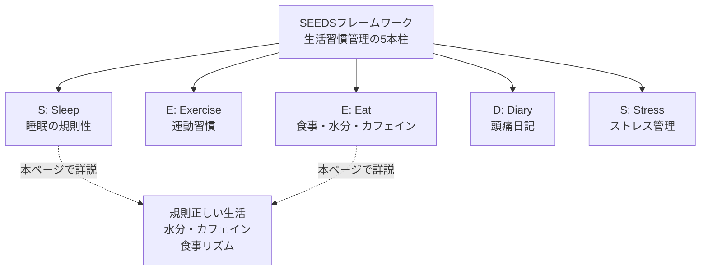
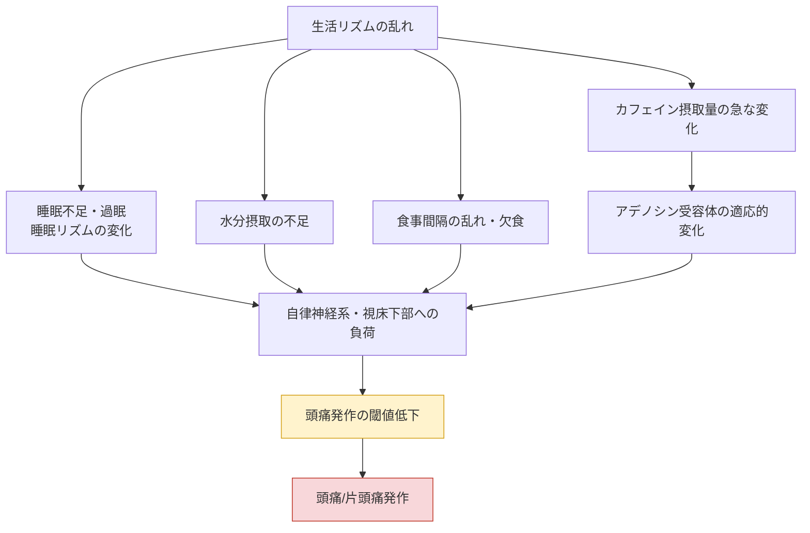

# 頭痛療養の基本 ― 生活習慣管理とSEEDSフレームワーク

> **免責事項（本ページの位置づけ）**
> 本ページは頭痛に関する一般的な生活指導を紹介する **教育・情報提供目的のコンテンツ** であり、個々の患者に対する治療推奨・診断・処方ではありません。症状の評価や具体的な対処法については、必ず医師または薬剤師にご相談ください。本ページで紹介する数値（水分量・カフェイン量など）は研究で用いられた目安であり、個人の体質・持病・生活環境によって適切な範囲は異なります。

---

## この記事で学べること

頭痛（特に片頭痛）の管理は、薬物療法だけでなく **生活習慣の調整** が重要な柱の一つとされています。本ページでは、国際的に認知されている生活指導の枠組みである **SEEDS**（Sleep・Exercise・Eat・Diary・Stress）を軸に、特に基本となる

1. 規則正しい生活（睡眠リズム）
2. 水分補給
3. カフェインとの付き合い方
4. 食事リズム（欠食・空腹の回避）

について、初学者にもわかりやすいようステップバイステップで解説します。

---

## ステップ0：なぜ生活習慣が重要なのか

片頭痛をはじめとする一次性頭痛は、遺伝的な素因を背景に、睡眠・食事・ストレスなどの環境因子が引き金（トリガー）となって発作が誘発されると考えられています。米国の頭痛専門医による総説では、生活習慣の是正を治療の出発点として位置づけ、睡眠・食事・運動といった基本的な生活行動を整えることの重要性が強調されています。同総説では、片頭痛は世界的に見ても障害を伴う疾患負担の大きい神経疾患の一つに位置づけられています。

> **重要な注意点**：生活習慣の調整は薬物療法の代わりになるものではなく、あくまで補助的なアプローチです。効果には個人差があり、「必ず頭痛が治る」ことを保証するものではありません。生活改善を行っても症状が続く、あるいは悪化する場合は医師に相談してください。

### エビデンスグレードの見方（本ページ共通）

本ページでは、各生活指導項目のエビデンスの強さを以下の4段階で表記します。

| グレード | 意味 |
|---|---|
| **bA** | 複数の質の高いランダム化比較試験（RCT）やシステマティックレビューで一貫して支持されている |
| **bB** | 一定数の臨床研究で支持されているが、RCTが限定的、または結果の一貫性に課題がある |
| **bC** | 主に観察研究・相関研究、または小規模・パイロット試験にとどまる |
| **bU** | 生理学的な機序や専門家のコンセンサスが中心で、直接的な介入試験のエビデンスが乏しい |

---

## ステップ1：SEEDSフレームワークの全体像

SEEDSは、米国メイヨークリニックの頭痛専門医らが臨床医向けに提唱した、片頭痛患者への生活指導をまとめた頭字語です。5つの柱（睡眠・運動・食事・日記・ストレス）について、それぞれのエビデンスと実践上のポイントがまとめられています。

各柱の概要は以下の通りです。睡眠については標準的な睡眠衛生指導により睡眠の量と質を最大化すること、運動については週3〜5回・1回30〜60分程度の実施、食事については規則正しい食事・十分な水分摂取・安定したカフェイン摂取量の維持、日記についてはベースラインの把握と治療反応の評価、ストレスについては認知行動療法やマインドフルネス、リラクゼーション、バイオフィードバックなどが挙げられています。

| 柱 | 主な内容 | エビデンスの位置づけ |
|---|---|---|
| Sleep（睡眠） | 起床・就寝時刻を一定に保つ | bB |
| Exercise（運動） | 有酸素運動を週3〜5回程度 | bB |
| Eat（食事） | 規則正しい食事・十分な水分・安定したカフェイン量 | bB〜bC（項目により異なる） |
| Diary（記録） | 頭痛日記による発作パターンの把握 | bC（診断・モニタリング用途） |
| Stress（ストレス） | 認知行動療法・リラクゼーション等 | bB |

---

## ステップ2：規則正しい生活（睡眠リズム）

### 睡眠と頭痛の関係

睡眠と頭痛の関連は100年以上前から臨床的に指摘されてきましたが、実証的な研究が蓄積してきたのは近年です。片頭痛専門外来を受診した1,283名を対象とした大規模臨床研究では、多くの患者が慢性的に睡眠時間が短い傾向にあり、患者の半数で睡眠障害が頭痛の誘因になっていたことが報告されています。特に平均睡眠時間が6時間程度の群でより重い頭痛パターンがみられ、短時間睡眠群・過剰睡眠群のいずれも頭痛頻度や重症度の増加と関連していたことが示されています。

### 「週末頭痛」という現象

平日の睡眠不足を補おうと休日に寝だめをすることが、かえって頭痛（片頭痛）の誘因になりうる現象は「週末頭痛（weekend migraine）」として知られています。これは、睡眠時間の長さそのものよりも、**睡眠リズムの変化・不規則性** が頭痛の誘因になりうることを示唆しています。

### 実践のポイント（一般的な睡眠衛生指導）

| 項目 | 内容 |
|---|---|
| 起床・就寝時刻 | 平日・休日を問わず、できるだけ一定の時刻を保つ |
| 睡眠時間 | 極端な短時間睡眠・長時間睡眠の両方を避ける |
| 寝だめ | 休日の大幅な「寝だめ」は避ける |
| 環境 | 就寝前の強い光・スクリーン使用を控える |
| 医療機関への相談 | 不眠や睡眠時無呼吸などの併存が疑われる場合は医師に相談する |

**エビデンスグレード：bB**（大規模臨床サンプルでの関連は明確に示されているが、睡眠リズムを是正する介入そのものが頭痛頻度を減らすかを検証したRCTは限定的）

---

## ステップ3：水分補給

### 脱水と頭痛の関係をどう考えるか

「水分不足が頭痛を招く」という考え方は広く知られていますが、ICHD-3（国際頭痛分類 第3版）には脱水そのものを単独の頭痛類型として定義する項目はなく、空腹（絶食）による頭痛など関連する項目が個別に定義されています。水分摂取と頭痛の関係を検証した臨床研究はまだ数が限られており、結果も一様ではありません。

### 主な研究

オランダのプライマリケアで実施されたランダム化比較試験では、頭痛のある患者に1日あたり1.5リットルの水分摂取量の増加を指示したところ、片頭痛特異的QOL（MSQOL）スコアの統計的に有意な改善がみられましたが、月あたりの頭痛日数そのものには明確な変化はみられませんでした。同グループの先行パイロット試験でも同様に、水分摂取量を増やすことで2週間あたりの頭痛時間や頭痛強度に改善傾向がみられましたが、統計的な有意差には至りませんでした。

一方、片頭痛患者256名を対象とした横断研究では、日常の飲水量と頭痛の重症度・持続時間との間に負の相関（水分摂取が多いほど頭痛が軽い傾向）が報告されていますが、横断研究であるため因果関係は明らかではなく、著者ら自身も更なる臨床試験の必要性を指摘しています。

### 実践のポイント

- 特別な疾患がない場合、**日常的に十分な水分を継続的に摂取する** ことは、頭痛対策に限らず一般的な健康管理として広く推奨されています。
- 研究で用いられた「通常の摂取量に1.5リットル追加する」という数値はあくまで臨床試験のプロトコルであり、万人に当てはまる目標量ではありません。持病（腎疾患・心疾患など）がある方は、水分摂取量について医師に相談してください。
- 水分摂取だけで頭痛が「治る」と保証するものではなく、他のSEEDS項目と組み合わせた包括的な生活管理の一部として位置づけるのが妥当です。

**エビデンスグレード：bC**（小規模RCT・パイロット試験・横断研究が中心で、頭痛日数そのものへの効果は一貫して示されていない）

---

## ステップ4：カフェインとの付き合い方

カフェインは頭痛に対して「引き金」にも「対処法」にもなりうる、二面性のある物質として知られています。コーヒーを飲んだ後に片頭痛が来るように感じられても、それが本当のトリガーではなく、あくび・倦怠感・眠気といった片頭痛の前兆症状（プロドローム）の結果としてカフェイン摂取が先行しているだけの場合もあると指摘されています。

### カフェイン離脱頭痛（Caffeine-withdrawal headache）

ICHD-3では、カフェイン離脱による頭痛が独立した診断カテゴリーとして定義されています。要点を整理すると以下のようになります。

| 診断のポイント | 内容 |
|---|---|
| 摂取歴 | 1日200mgを超えるカフェインを2週間以上、習慣的に摂取していた |
| 中断 | その摂取が中断または遅延した |
| 発症時期 | 最終摂取から24時間以内に頭痛が出現 |
| 軽快の仕方 | カフェイン100mg程度の摂取で1時間以内に軽快する、または摂取を完全にやめてから7日以内に自然消失する|

このメカニズムの背景には、慢性的なカフェイン摂取によって脳内のアデノシン受容体が適応的に変化し、摂取が途絶えるとアデノシンの作用が相対的に強まって頭痛・倦怠感・眠気などが生じるという説明があります。

### 「トリガーとしてのカフェイン」の実際のエビデンス

2020年までの文献を対象としたレビューでは、カフェイン／カフェイン離脱が片頭痛のトリガーになるかを調べた17研究のうち、実際にトリガーと報告された割合は参加者の2〜30%にとどまり、全体としては「すべての片頭痛患者に対してカフェインの完全な中止を推奨するだけの根拠は不十分」と結論づけられています。ただし、カフェインの過剰摂取が頭痛の慢性化に関与しうること、急な中断が頭痛を誘発しうることも同時に指摘されており、摂取するのであれば **量をできるだけ一定に保つこと** が推奨されています。

### 実践のポイント

- カフェインを摂取する場合は、**量と時間帯をできるだけ日によって変えない** ことが、離脱頭痛の予防という観点では合理的とされています。
- 一般的な健康な成人における目安として、1日200〜400mg程度（コーヒー約4〜5杯相当）までが安全域として言及されることが多いですが、片頭痛のある人ではより少なめ（1日200mg未満）を目安とする文献もあります。ただし、これは一般的な目安であり、個別の摂取上限を指示するものではありません。
- カフェインを完全に断つべきかどうかは一律に決められるものではなく、頭痛日記と併せて自分自身のパターンを確認し、必要であれば医師に相談することが望まれます。

**エビデンスグレード：bB**（離脱頭痛の機序・診断基準は確立されているが、一般集団における「トリガーとしての重要性」は研究間で一致していない）

---

## ステップ5：食事リズム（欠食・空腹の回避）

### 「空腹」も頭痛の誘因になりうる

ICHD-3には「絶食に起因する頭痛（Headache attributed to fasting）」という診断カテゴリーが設けられています。要点は以下の通りです。

| 診断のポイント | 内容 |
|---|---|
| 頭痛の性質 | 拡散性（部位がはっきりしない）で、非拍動性、軽度〜中等度の強さが典型的 |
| 発症条件 | 8時間以上の絶食中、またはその結果として出現 |
| 軽快の仕方 | 食事を摂ることで軽快する |
| 頻度との関係 | 絶食時間が長いほど頭痛が起こりやすくなる傾向がある|

また、片頭痛の既往がある人では、空腹によって誘発される頭痛が典型的な前兆のない片頭痛の形をとることもあり、その場合はあくまで「片頭痛」として扱われ、空腹はその誘因の一つと位置づけられます。

複数国にまたがる最近の研究でも、長時間の空腹を伴う生活パターン（宗教的な断食期間など）において、拍動性の頭痛や吐き気・光過敏・音過敏を伴う頭痛が高頻度に報告されており、その多くが片頭痛様の性質を持つことが示唆されています。

### 実践のポイント

- 1日のうちで食事の間隔が極端に空きすぎないよう、**規則正しい食事リズム** を心がけることが基本的な生活指導として位置づけられています。
- 特定の食品を除去する「除去食」のような対応は、エビデンスが確立されていないため、自己判断で極端な食事制限を行うことは推奨されません。気になる場合は医師・管理栄養士に相談してください。
- 長時間の絶食を伴うダイエットや宗教的断食を行う場合、頭痛の既往がある人は事前に医師に相談し、食事タイミングの調整について助言を受けることが望まれます。

**エビデンスグレード：bB**（ICHD-3で明確に定義された臨床像であり、複数地域での観察研究が一貫した傾向を示しているが、介入研究（食事間隔を是正することの効果を直接検証したRCT）は限定的）

---

## ステップ6：生活習慣が頭痛につながる仕組み（概念図）

ここまで見てきた4つの要素は、それぞれ異なる経路を通じて頭痛の起こりやすさ（閾値）に影響すると考えられています。以下は、各要素と頭痛発作の関係を概念的に整理した図です（個々の矢印は確立された単一経路を示すものではなく、教育目的の概念整理です）。

---

## ステップ7：SEEDSの残り3要素（簡潔に）

本ページの主眼である「規則正しい生活・水分・カフェイン・食事リズム」以外にも、SEEDSフレームワークには以下の要素が含まれます。

| 要素 | 内容 | エビデンスの位置づけ |
|---|---|---|
| Exercise（運動） | 週3〜5回、1回30〜60分程度の運動が一般的な目安として紹介されている | bB |
| Diary（頭痛日記） | 発作の頻度・誘因・治療反応を記録し、診断精度や治療効果の評価に役立てる | 診断・モニタリング用途（bC） |
| Stress（ストレス管理） | 認知行動療法・マインドフルネス・リラクゼーション・バイオフィードバックなどが紹介されている | bB |

これらは本ページでは概要のみの紹介とし、詳細な解説は別ページに譲ります。

---

## ステップ8：日々の生活チェックリスト（まとめ）

| チェック項目 | 目安 |
|---|---|
| 起床・就寝時刻 | 毎日ほぼ同じ時刻を保っているか |
| 水分摂取 | 1日を通じてこまめに水分を摂れているか |
| カフェイン | 量・タイミングが日によって大きくばらついていないか |
| 食事 | 食事の間隔が極端に空いていないか |
| 頭痛日記 | 発作の日時・誘因らしきもの・対処法とその効果を記録できているか |

---

## ステップ9：個人差と受診の目安

頭痛の誘因には大きな個人差があります。同じ生活パターンでも頭痛が起こる人と起こらない人がおり、SEEDSの各要素も「全員に等しく効果がある」というものではありません。まずは頭痛日記を通じて自分自身のパターンを把握し、無理のない範囲で生活習慣を調整することが現実的なアプローチとされています。

以下のような場合は、自己判断で対応を続けるのではなく、医師の診察を受けてください。

- 生活習慣を調整しても頭痛が改善しない、または悪化する場合
- 頭痛の性質・頻度が急に変化した場合
- 市販薬や処方薬の使用が増えている、あるいは薬を使う日数が多くなっている場合

具体的な治療方針（薬物療法を含む）については、本ページの範囲を超えるため、医師・薬剤師にご相談ください。

---

## 参考文献・情報源

一次情報（ガイドライン・原著論文）を優先し、要約サイトは補助的な参照にとどめています。

| 区分 | ソース | 参照箇所 | URL |
|---|---|---|---|
| 疾患分類（一次情報） | ICHD-3（国際頭痛分類 第3版、国際頭痛学会） | 8.3.1 カフェイン離脱頭痛 | https://ichd-3.org/8-headache-attributed-to-a-substance-or-its-withdrawal/8-3-headache-attributed-to-substance-withdrawal/8-3-1-caffeine-withdrawal-headache/ |
| 疾患分類（一次情報） | ICHD-3 | 10.5 絶食に起因する頭痛 | https://ichd-3.org/10-headache-attributed-to-disorder-of-homoeostasis/10-5-headache-attributed-to-fasting/ |
| レビュー論文（一次情報） | Robblee J, Starling AJ. "SEEDS for success: Lifestyle management in migraine." Cleve Clin J Med. 2019;86(11):741-749. | SEEDSフレームワーク全体 | https://www.ccjm.org/content/86/11/741（PubMed: https://pubmed.ncbi.nlm.nih.gov/31710587/） |
| 原著論文（一次情報） | Spigt M, et al. "A randomized trial on the effects of regular water intake in patients with recurrent headaches." Fam Pract. 2012;29(4):370-375. | 水分補給のRCT | https://academic.oup.com/fampra/article-abstract/29/4/370/492787 |
| 原著論文（一次情報） | Spigt MG, et al. "Increasing the daily water intake for the prophylactic treatment of headache: a pilot trial." (PubMed ID: 16128874) | 水分補給のパイロット試験 | https://pubmed.ncbi.nlm.nih.gov/16128874/ |
| 原著論文（一次情報） | Khorsha F, et al. "Association of drinking water and migraine headache severity." J Clin Neurosci. 2020;77:81-84. | 水分摂取と頭痛重症度の横断研究 | https://pubmed.ncbi.nlm.nih.gov/32446809/ |
| レビュー論文（一次情報） | "The Ambiguous Role of Caffeine in Migraine Headache: From Trigger to Treatment" | カフェインのトリガーとしてのエビデンス | https://www.ncbi.nlm.nih.gov/pmc/articles/PMC7468766/ |
| レビュー論文（一次情報） | "Caffeine for Headaches: Helpful or Harmful? A Brief Review of the Literature" | カフェインの安全域の目安 | https://www.ncbi.nlm.nih.gov/pmc/articles/PMC10385675/ |
| レビュー論文（一次情報） | "Caffeine and Primary (Migraine) Headaches—Friend or Foe?" | カフェインとプロドロームの関係 | https://www.ncbi.nlm.nih.gov/pmc/articles/PMC6901704/ |
| 原著論文（一次情報） | Kelman L, Rains JC. "Headache and sleep: examination of sleep patterns and complaints in a large clinical sample of migraineurs." Headache. 2005;45(7):904-910. | 睡眠パターンと頭痛の大規模臨床研究 | https://pubmed.ncbi.nlm.nih.gov/15985108/ |
| 原著論文（一次情報） | "Primary headache disorders susceptibility is associated with fasting-related headache" (Frontiers in Neurology, 多国間研究) | 空腹と頭痛の多国間研究 | https://www.frontiersin.org/journals/neurology/articles/10.3389/fneur.2026.1859536/full |
| 国際ガイドライン | NICE CG150「Headaches in over 12s: diagnosis and management」（英国国立医療技術評価機構） | 頭痛全般の診断・管理指針 | https://www.nice.org.uk/guidance/cg150 |
| 国内ガイドライン | 日本神経学会・日本頭痛学会・日本神経治療学会「頭痛の診療ガイドライン2021」 | 国内標準治療・用語の参照 | https://www.neurology-jp.org/guidelinem/headache_medical_2021.html（Minds版: https://minds.jcqhc.or.jp/summary/c00689/） |
| 基礎資料（機序） | NCBI Bookshelf (StatPearls) "Caffeine Withdrawal" | カフェイン離脱の神経生理学的機序 | https://www.ncbi.nlm.nih.gov/books/NBK430790/ |
