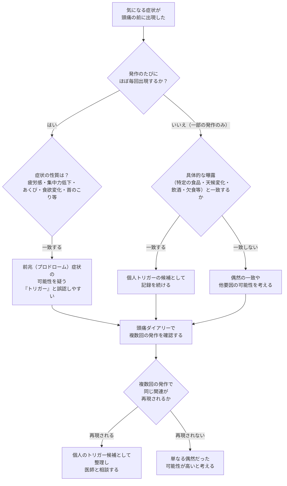
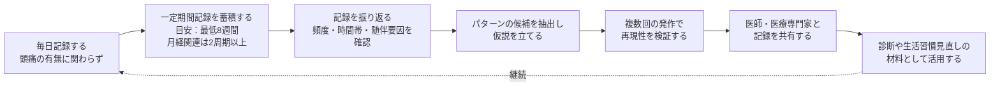
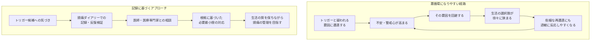

# 頭痛トリガーの特定と管理 ― 記録から振り返りまでの実践ガイド

> **⚠️ DisclaimerBanner**
> 本ページは教育目的の一般的な情報提供であり、個別の患者に対する治療推奨ではありません。頭痛の診断、トリガーの特定、生活習慣の見直しについては、自己判断で完結させず、必ず医師・医療専門家にご相談ください。本ページはエビデンスの現状を紹介するものであり、特定の方法の効果や安全性を保証するものではありません。

---

## この記事の対象と読み方

- 対象読者：頭痛（片頭痛・緊張型頭痛など）のトリガー（誘発因子）について、記録と振り返りの方法を基礎から学びたい方
- 本記事は国際頭痛分類（ICHD-3）、国内外のガイドライン、査読付き文献に基づいて構成しています
- 具体的な薬剤の用法・用量には触れません。薬物治療については医師・薬剤師にご相談ください
- 記載しているエビデンスの強さは相対的な表現（強い／中等度／限定的／不明）にとどめ、断定は避けています

---

## 1. 頭痛トリガーとは何か

「トリガー（誘発因子）」とは、頭痛発作の引き金になりうると考えられている内的・外的な要因のことです。国際頭痛分類（ICHD-3）は頭痛そのものの診断基準を定めるものであり、個々のトリガーを診断基準として規定しているわけではありませんが、片頭痛のレビュー文献では、ストレス、月経周期の変化、天候変化、睡眠の乱れ、アルコール、特定の食品などが自己申告で多く挙げられるトリガー候補として整理されています。

重要な前提として、実験的に確実に頭痛を誘発できる物質（ニトログリセリンなど）とは異なり、日常生活で自己申告される「自然な」トリガーは再現性が低く、個人差が大きいことが指摘されています。つまり、「誰かに効いた・当てはまった」トリガー対策が、そのまま自分にも当てはまるとは限りません。

---

## 2. トリガーと前兆（プロドローム）症状の混同という落とし穴

頭痛のセルフケアで見落とされがちなのが、「トリガーだと思っていた症状が、実は頭痛発作そのものの前兆（プロドローム）症状だった」というケースです。

片頭痛発作は、頭痛が始まる前から「予兆期（premonitory phase／prodrome）」と呼ばれる段階を経ることが知られており、疲労感、集中力の低下、首のこり、あくび、特定の食べ物への渇望（食渇望）といった症状がこの時期に現れることがあります。電子日記を用いた古典的な研究では、こうした予兆症状を報告した患者の多くが、実際にその後の頭痛発作を高い割合で予測できたことが示されています。

この事実が重要なのは、たとえば「チョコレートを食べた後に頭痛が起きた」という経験について、実際には「頭痛発作の予兆としてチョコレートへの渇望が生じ、それを食べた後にもともと予定されていた頭痛が発生した」だけという可能性があるためです。つまり、チョコレートが頭痛を引き起こしたのではなく、頭痛発作の過程の一部としてチョコレートへの欲求が先に出ていた、という解釈です。近年のレビューでも、トリガーと予兆症状を区別する視点（threshold hypothesis）が提唱されており、両者を峻別する重要性が指摘されています。

### トリガーか前兆かを見分ける視点（フローチャート）

> この判別は自己判断だけで完結させず、記録をもとに医師と相談しながら進めることが推奨されます。

---

## 3. 報告されているトリガー候補とエビデンスの現状

以下は自己申告や観察研究で頻繁に挙げられるトリガー候補と、現時点でのエビデンスの相対的な強さです。**個人差が大きいため、この表はあくまで「何を記録すべきかの手がかり」であり、特定の食品や行動の回避を推奨するものではありません。**

**エビデンス表記の凡例**

| 表記 | 意味 |
|---|---|
| **bA** | 複数の質の高い研究・レビューで比較的一貫して支持されている |
| **bB** | 一定数の研究で関連が示されているが、因果関係の解明や質の高い検証はなお発展途上 |
| **bC** | 自己申告としての報告頻度は高いが、実験的検証（二重盲検の誘発試験等）では支持が乏しい、または研究間で結果が一致しない |
| **bU** | 現時点では明確な結論を出すだけの根拠が乏しい |

| トリガー候補 | 内容の例 | エビデンスの現状 | 評価 |
|---|---|---|---|
| ホルモン変動 | 月経周期に伴うエストロゲン低下 | 月経周期との関連は比較的一貫して報告されている | **bB** |
| 空腹・欠食 | 食事を抜く、長時間の絶食 | 複数の臨床研究で関連が確認されている | **bB** |
| 睡眠の変化 | 睡眠不足、睡眠過多、リズムの乱れ | 関連を示す研究が複数ある | **bB** |
| ストレスとその解放（letdown） | 緊張状態からの弛緩期 | 自己申告で最も頻度の高い要因の一つだが、因果関係の生物学的機序は解明が進行中 | **bB** |
| カフェインの急な中断 | 普段の摂取習慣を急にやめる | ICHD-3にカフェイン離脱頭痛の診断基準があり、関連性は比較的明確 | **bB** |
| 感覚刺激 | 強い光、音、匂い | 片頭痛の発作間欠期でも感覚過敏が確認されており、関連は比較的支持されている | **bB** |
| 気象・気圧の変化 | 低気圧、天候の急変 | 関連を示唆する報告はあるが、個人差が大きく研究間の一貫性に乏しい | **bC** |
| アルコール | 特に赤ワインなど | 自己申告としての報告は多いが、実験的に再現性を確認した研究は限定的 | **bC** |
| 特定の食品・食品添加物 | チョコレート、うま味調味料など | 自己申告は多い一方、対照試験では支持が乏しく、前兆期の食渇望を「トリガー」と誤認している可能性が指摘されている | **bC〜bU** |

小児・青年を対象としたレビューでも、食事関連のトリガーについては根拠が非常に限定的であるとされており、明確な個別のトリガーが特定されていない段階で特定の食品を場当たり的に制限するよりも、欠食を避けてバランスの良い食事をとることを助言する方が妥当だとされています。この点は、根拠の乏しい食事制限がかえって生活の質を損なう可能性があるという観点からも重要です。

---

## 4. 頭痛ダイアリー（記録）が重視される理由

### 4-1. なぜ「記憶」ではなく「記録」なのか

人は頭痛の頻度や強さを後から振り返って報告するとき、その場その場の記憶をそのまま思い出しているわけではなく、記憶の再構成による偏り（想起バイアス）の影響を受けることが、症状報告研究の分野で繰り返し指摘されています。電子日記の活用に関する総説では、数日から数週間にわたる期間を振り返って一つの代表値を答えるという作業そのものに、認知的な偏りが入り込みやすいことが論じられています。

頭痛領域でも、前向きに毎日記録した日記データと、後から振り返って回答した質問票データを比較した研究において、両者の間に統計的に有意な差があり、振り返り型の質問票は日々の日記データと必ずしも一致しないことが示されています。小児頭痛を対象にした先行研究でも同様の想起バイアスの存在が報告されています。

### 4-2. ガイドラインにおける頭痛ダイアリーの位置づけ

英国NICEのガイドライン（CG150）では、頭痛の診断や治療効果のモニタリング、患者との対話の基盤として頭痛ダイアリーの活用を推奨しており、記録する場合は少なくとも8週間継続すること、月経関連片頭痛の診断には少なくとも2回の月経周期にわたる記録を用いることを挙げています。記録項目としては、頭痛の頻度・持続時間・強さ、随伴症状、使用した市販薬・処方薬（すべて）、想定される誘因、月経との関連が挙げられています。

国内の「頭痛の診療ガイドライン2021」（日本神経学会・日本頭痛学会・日本神経治療学会監修）でも、頭痛ダイアリーの有用性そのものを検討する項目（CQ：頭痛ダイアリーは有用か）が設けられており、日常診療における記録の位置づけが整理されています。

### 4-3. 紙の日記と電子日記（アプリ）の違い

紙の日記は手軽である一方、その場で記録せず後でまとめて記入してしまう「後付け入力」が起こりやすく、これが想起バイアスの混入につながる可能性が指摘されています。電子日記（スマートフォンアプリや専用デバイス）は、入力時刻の記録や事後編集の制限などによって、より高い信頼性が期待できるとする報告があります。ただし、これは「電子日記でなければ意味がない」ということではなく、紙であっても**その日のうちに、できごとの直後に記録する習慣**が最も重要である、という点が実務的な要点です。

どの記録方法（紙／特定のアプリ）を選ぶかは個人の使いやすさによるため、本ガイドでは特定の製品名を推奨することはしません。継続しやすい方法を選ぶことが、記録の精度そのものより優先されることも少なくありません。

---

## 5. 頭痛ダイアリーに何を記録するか

| 記録項目 | 記録内容の例 | タイミング |
|---|---|---|
| 頭痛の有無・開始/終了時刻 | 頭痛がなかった日も含めて毎日記録する | 毎日 |
| 強さ | 0〜10などのスケール、または軽度・中等度・重度 | 頭痛が起きたとき |
| 随伴症状 | 悪心・嘔吐、光過敏、音過敏、拍動性の有無など | 頭痛が起きたとき |
| 服薬の記録 | 市販薬・処方薬を使用したかどうかとタイミング（具体的な用量の指導は本ガイドの範囲外です） | 頭痛が起きたとき |
| 想定される誘因の候補 | 睡眠時間、食事状況（欠食の有無）、ストレス度、天候など | 毎日 |
| 前兆的な症状の有無 | あくび、集中力低下、首のこり、食欲・気分の変化など | 頭痛の前 |
| 月経との関連（該当者） | 月経周期の日数 | 毎日/周期ごと |

ポイントは「頭痛が起きた日だけ」記録するのではなく、**頭痛がなかった日も含めて毎日記録する**ことです。これにより、「その要因があった日に頭痛が起きなかった頻度」も把握でき、見かけ上の関連（偶然の一致）を見分けやすくなります。

---

## 6. 記録から振り返りへ ― パターン抽出のステップ

### 振り返り時に注意すべきこと

- **1回の一致だけで結論づけない**：ある要因のあった日に1回頭痛が起きたからといって、それが真のトリガーとは限りません。複数回（できれば同じ要因が「あった日」と「なかった日」の両方の記録）を比較して、繰り返し関連が見られるかを確認します。個々の患者ごとにトリガー候補を絞り込んでいく手法（個人内でのトリガー特定アプローチ）を扱った研究でも、こうした反復的な検証の重要性が論じられています。
- **確証バイアスに注意する**：「甘いものが原因だ」と思い込んでいると、甘いものを食べて頭痛が起きた日ばかりが印象に残り、食べても頭痛が起きなかった日を見落としがちです。日々の記録はこの偏りを補正する役割を持ちます。
- **複数要因が重なっている可能性を考える**：睡眠不足とストレスと欠食が同時に重なっていた場合、どれか一つだけを「犯人」と決めつけるのは早計です。
- **前兆症状との切り分けを忘れない**（第2章参照）。

---

## 7. トリガー回避という対応の落とし穴

「トリガーを避けることが最善の予防策である」という助言は広く行われていますが、この考え方そのものを問い直す研究の系譜があります。行動医学分野のレビューでは、トリガー回避を推奨する従来の臨床的助言が、必ずしも明確な理論やエビデンスに基づいて確立されたものではないと指摘されており、不安症における「回避によってかえって過敏さが強まる」という学習理論の知見を踏まえた再検討が提案されています。

具体的には、トリガーになりうる刺激との接触に対して不安や警戒心を強め、それを避け続けることが、かえってその刺激への過敏さ（感作）を助長し、生活の選択肢を狭めてしまう可能性が議論されています。片頭痛患者を対象にした実験心理学的研究でも、トリガーに関連する刺激に対する注意の向け方に、健康な対照群とは異なるパターンがみられ、学習された回避的な反応である可能性が示唆されています。

### 回避の悪循環と、記録に基づくバランスの取れた対応

ここで強調したいのは、「トリガーを一切気にしなくてよい」ということではありません。記録によって再現性が確認された要因については、医師と相談のうえで現実的な対応（睡眠リズムの安定化、規則的な食事など）を検討する価値があります。一方で、根拠の乏しい段階で幅広い食品や活動を自己判断で制限していくことは、生活の質の低下や不必要な不安の助長につながりうるため、慎重さが求められます。

---

## 8. こんなときは医療機関に相談を

頭痛の性質が普段と異なる場合や、以下のような特徴を伴う場合は、トリガーの自己分析よりも先に医療機関へ相談することが推奨されます。これは国際的に提唱されている二次性頭痛（他の疾患が原因の頭痛）を見逃さないための注意点（いわゆるレッドフラグ）の一部です。

| 注意すべき特徴（一部抜粋） | 該当しうる状況の例 |
|---|---|
| 今までに経験したことのない、突然・激烈な頭痛 | 「今まで最悪」の頭痛が数分以内にピークに達する |
| 発熱や意識障害を伴う頭痛 | 感染症や中枢神経系の異常が疑われる場合 |
| 神経学的な異常所見を伴う頭痛 | 手足の麻痺、言葉が出にくい、視野の異常など |
| 65歳以降に初めて発症した頭痛、または頭痛のパターンが最近急に変化した場合 | これまでと明らかに違う頭痛が続く |
| 咳・くしゃみ・排便・運動で誘発される頭痛 | 特定の動作で毎回頭痛が引き起こされる |
| 妊娠中・産褥期の頭痛 | この時期特有のリスクを考慮する必要がある |
| 市販の鎮痛薬や頭痛薬を頻回に使用している | 薬物乱用頭痛（MOH）の可能性を含め、医師に相談 |

この一覧はあくまで一般的な目安であり、網羅的なチェックリストではありません。少しでも不安がある場合は自己判断で済まさず、医師に相談してください。

---

## 9. まとめ

- 頭痛のトリガーは個人差が大きく、「自然な」トリガーの多くは実験的な再現性が低いとされています
- 頭痛前に感じる症状の中には、トリガーではなく発作自体の前兆（プロドローム）症状が含まれている可能性があり、両者の切り分けが重要です
- 頭痛ダイアリーは、想起バイアスを避け、パターンを客観的に把握するための科学的根拠のある手法として、国内外のガイドラインで推奨されています
- 記録は「頭痛があった日」だけでなく「なかった日」も含めて毎日行い、複数回の発作で再現性を確認することが望まれます
- トリガー回避を絶対視することにはリスクもあり、根拠に基づいた必要最小限の対応を、医師と相談しながら検討することが推奨されます
- 普段と違う頭痛や危険な兆候がある場合は、自己分析より先に医療機関を受診してください

---

## 出典・参考文献

| 出典 | 概要 | URL |
|---|---|---|
| International Classification of Headache Disorders, 3rd edition（ICHD-3） | 国際頭痛学会（IHS）による頭痛分類の国際標準 | https://ichd-3.org/ |
| 頭痛の診療ガイドライン2021（日本神経学会・日本頭痛学会・日本神経治療学会監修） | 国内標準の頭痛診療ガイドライン。頭痛ダイアリーの有用性に関するCQを含む | https://www.neurology-jp.org/guidelinem/headache_medical_2021.html |
| NICE CG150「Headaches in over 12s: diagnosis and management」 | 英国NICEによる頭痛診療ガイドライン。頭痛ダイアリーの記録項目・期間を推奨 | https://www.nice.org.uk/guidance/cg150/chapter/recommendations |
| Marmura MJ. Triggers, Protectors, and Predictors in Episodic Migraine. Curr Pain Headache Rep. 2018 | 片頭痛のトリガーに関する代表的なレビュー | https://pubmed.ncbi.nlm.nih.gov/30291562/ |
| Giffin NJ, et al. Premonitory symptoms in migraine: an electronic diary study. Neurology. 2003 | 電子日記を用いた前兆（プロドローム）症状研究の古典的論文 | https://pubmed.ncbi.nlm.nih.gov/12654956/ |
| Sebastianelli G, et al. Insights from triggers and prodromal symptoms on how migraine attacks start: the threshold hypothesis. Cephalalgia. 2024 | トリガーと前兆症状の区別に関する近年のレビュー（国際頭痛学会 IHS-iHEAD） | https://journals.sagepub.com/doi/full/10.1177/03331024241287224 |
| Martin PR. Behavioral management of migraine headache triggers: learning to cope with triggers. Curr Pain Headache Rep. 2010 | トリガー回避という助言そのものを問い直す行動医学的レビュー | https://pubmed.ncbi.nlm.nih.gov/20425190/ |
| Puschmann AK, Sommer C. Hypervigilance or avoidance of trigger related cues in migraineurs? BMC Neurology. 2011 | トリガー関連刺激への注意バイアスを検討した症例対照研究 | https://bmcneurol.biomedcentral.com/articles/10.1186/1471-2377-11-141 |
| Broderick JE. Electronic diaries: appraisal and current status. Pharmaceut Med. 2008 | 電子日記と想起バイアスに関する総説 | https://pmc.ncbi.nlm.nih.gov/articles/PMC2796846/ |
| Comparing prospective headache diary and retrospective four-week headache questionnaire over 20 weeks（Cephalalgia関連の二次解析） | 前向き日記と振り返り質問票の一致度を検証した研究 | https://pmc.ncbi.nlm.nih.gov/articles/PMC9060397/ |
| Peris F, et al. Towards improved migraine management: determining potential trigger factors in individual patients. Cephalalgia. 2017 | 個人ごとのトリガー特定アプローチに関する研究 | https://doi.org/10.1177/0333102416649761 |
| A Review on the Triggers of Pediatric Migraine with the Aim of Improving Headache Education | 小児・青年の片頭痛トリガーに関するレビュー。食事制限への慎重な姿勢を指摘 | https://www.ncbi.nlm.nih.gov/pmc/articles/PMC7699367/ |
| Do TP, et al. Red and orange flags for secondary headaches in clinical practice: SNNOOP10 list. Neurology. 2019 | 二次性頭痛を見分けるための警告徴候（レッドフラグ）に関する代表的な文献 | https://www.neurology.org/doi/10.1212/WNL.0000000000006697 |
