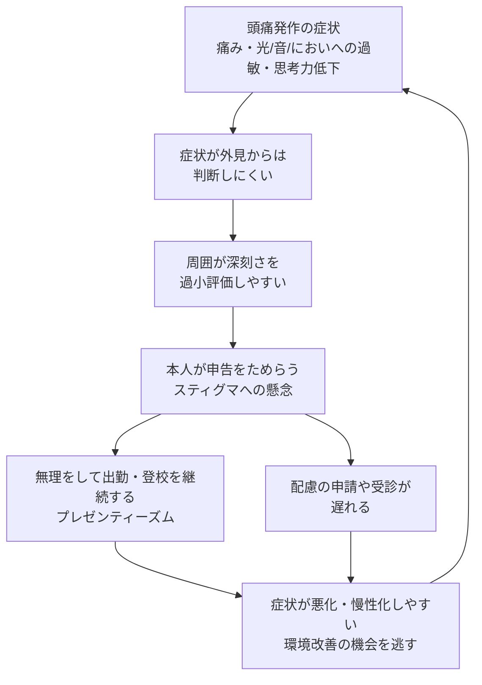
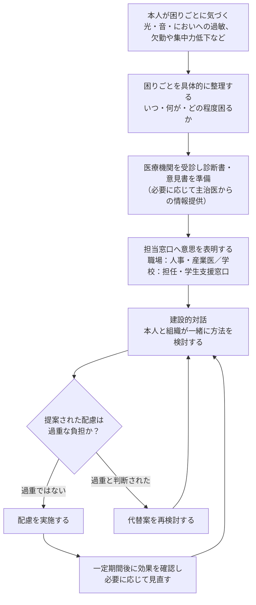
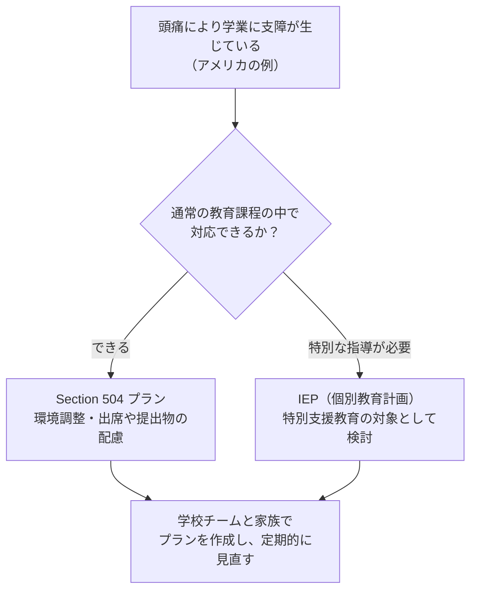

# 頭痛と「働く・学ぶ」場所 — 職場・学校での対処と周囲の理解（合理的配慮の一般論）

> **⚠️ ディスクレーマー（DisclaimerBanner）**
> 本ページは教育目的の一般情報提供であり、個別の治療推奨・法律相談・診断書作成の代替ではありません。頭痛の診断・治療については医師に、職場での配慮については産業医・人事担当部門に、学校での配慮については学校の相談窓口・主治医に、法的な権利関係については弁護士等の専門家にご相談ください。
> 制度や法律は国・地域・時期によって異なり、改正される場合があります。本ページの記載は執筆時点の公開情報に基づく一般的な整理であり、特定の個人・組織における配慮の要否を保証するものではありません。

---

## エビデンスレベルの表記について

本ガイドでは、GRADE／AAN／AHSの考え方を参考に、記載内容の根拠の強さをおおまかに次の4段階で示します。個々の配慮策の「効果」を保証するものではなく、あくまで現時点の研究の蓄積の程度を示すものです。

| バッジ | 意味 |
|---|---|
| **bA** | 複数の質の高い研究（システマティックレビュー・大規模疫学調査など）が一貫して支持している |
| **bB** | 一定数の研究による支持があるが、観察研究が中心で、研究間の一貫性や質に限りがある |
| **bC** | 症例報告・専門家のコンセンサス・小規模調査が中心で、エビデンスは限定的 |
| **bU** | 現時点で裏付けるデータが乏しい、またはほとんど存在しない |

---

## 1. なぜ「周囲の理解」が重要なのか — 数字で見る頭痛の社会的インパクト

頭痛は「よくあるつらい症状」として軽視されがちですが、国際的なデータは頭痛が個人の生活と社会全体に大きな影響を与えていることを示しています。

- WHOのファクトシートによれば、Global Health Estimates 2021に基づくと、片頭痛は脳卒中・新生児脳症に次いで、世界で3番目に障害調整生存年数（DALY）を生じさせる原因とされています[1]。頭痛発作の反復や「次の発作への不安」そのものが、家庭生活・社会生活・就労に影響を及ぼすと報告されています[1]。
- Global Burden of Disease（GBD）2023の解析では、2023年時点で世界の約29億人が頭痛性疾患の影響を受けていると推計されています（年齢調整有病率34.6%）[2]。
- Lifting The Burden（WHOと公式関係にある非営利団体）が主導した研究群に基づくと、頭痛性疾患はYLD（障害を伴って生活する年数）の世界第2位の原因であり、15〜49歳という「働く・学ぶ世代」に限れば片頭痛単独で第3位とされています[3]。
- 片頭痛による生産性損失の多くは「休む」ことではなく「出勤・出席はしているが本来のパフォーマンスが出せない」状態、すなわちプレゼンティーズムに起因します。Begasse de Dhaemらのスコーピングレビュー（Cephalalgia, 2021）は、片頭痛関連の生産性損失の**最大89%がプレゼンティーズムによるもの**と報告しています[5]（bA：複数の疫学研究が一貫して支持）。
- 日本国内の医療機関職員を対象とした実態調査（日本頭痛学会誌, 2023）では、頭痛時に自覚的な就業能力が低下している一方で、頭痛による早退・欠勤経験は5%以下にとどまり、「職場での配慮について自分からは言わない」と回答した職員が53.6%にのぼりました[20]。この調査は、日本の職場でもプレゼンティーズムが主要な課題であり、多くの人が配慮を自発的に求めていない実態を示しています。

こうしたデータは、「頭痛は自己管理すべき軽い症状」という見方だけでは実態を捉えきれないこと、そして職場・学校側の理解と環境調整が生産性や学業継続に直接関わることを示しています。

---

## 2. 頭痛はなぜ理解されにくいのか — 「見えない障害」というレンズ

頭痛性疾患、特に片頭痛は、外見からは症状の重さが判断しにくい「見えない障害（invisible disability）」の典型例とされます。この「見えにくさ」は、スティグマ（負の烙印）と申告控えの悪循環を生みやすいことが研究で指摘されています。

- Neurology誌に掲載された研究（Shapiro et al., 2024）は、片頭痛関連のスティグマが本人の障害度・発作間欠期の負担・生活の質と関連することを報告し、職場でのスティグマ評価がプレゼンティーズムや配慮申請行動の理解に有用である可能性を指摘しています[17]（bB：単一の大規模研究、今後の追試が期待される）。
- 慢性疾患スティグマ尺度を用いた研究（Young et al.）では、慢性片頭痛患者のスティグマスコアはてんかん患者と同程度に高く、「就労能力の低下」がスティグマの最も強い予測因子であったと報告されています[18]（bB）。
- 日本国内でのOVERCOME Japan研究（Igarashi et al., 2024, *Brain and Behavior*）は、片頭痛のない一般住民を対象に、片頭痛に対するスティグマ的な態度（例：「仮病ではないか」といった疑念）が一定程度存在すること、また頭痛のある人自身がスティグマや社会的負担を過小報告する傾向があることを示しています[19]（bB：日本人集団を対象とした横断調査）。

これらの知見は、「頭痛持ちは怠けている」という誤解が本人の申告控えにつながり、結果として必要な配慮が講じられないまま症状が悪化する、という構造を示唆しています。周囲の理解を広げること自体が、対処の第一歩として位置づけられます。

---

## 3. 合理的配慮とは何か — 国際的に共通する基本的な考え方

「合理的配慮（reasonable accommodation / reasonable adjustment）」という言葉は国によって呼び方が異なりますが、共通する骨格があります。

- 障害（または障害に相当する健康上の制約）のある人が、他の人と平等に働く・学ぶ機会を得られるようにするための、個別の調整・変更であること
- 一律の措置ではなく、本人の状況に応じて個別に検討されること
- 提供する側（雇用主・学校）にとって「過重な負担（undue hardship / disproportionate burden）」とならない範囲であること
- 多くの制度で、本人からの意思表明と、提供側との「建設的対話（interactive process）」を通じて内容を決めていくプロセスが重視されていること

### 主要な法的・制度的枠組みの比較（一般的な整理）

以下は代表的な制度の概要であり、要件の詳細（対象となる障害の判定基準、事業者規模の要件など）は必ず一次情報・専門家に確認してください。

| 国・地域 | 根拠法・制度 | 所管機関 | 基本的な考え方 |
|---|---|---|---|
| アメリカ合衆国（雇用） | 障害のあるアメリカ人法（ADA）第I編 | 雇用機会均等委員会（EEOC） | 心身の障害が「主要な生活活動」を実質的に制限する場合に保護対象となりうる。従業員15人以上の事業主に「合理的配慮」提供の義務があり、過重な負担がある場合は除外されうる[8][9] |
| アメリカ合衆国（初等中等教育） | リハビリテーション法504条 | 教育省 公民権局（OCR） | 障害により教育機会に支障がある児童生徒に対し、通常の教育課程の中で行う配慮（いわゆる「504プラン」）を提供する[10] |
| イギリス | 平等法2010（Equality Act 2010） | 平等人権委員会（EHRC） | 日常生活動作への実質的・長期的な影響がある場合に障害として保護されうる。雇用主には「合理的調整（reasonable adjustments）」の義務がある[12][13] |
| 日本 | 障害者差別解消法 | 内閣府（全体調整）、事業分野ごとの主務大臣 | 行政機関等は合理的配慮の提供が法的義務。民間事業者も2024年4月の改正法施行により、合理的配慮の提供が法的義務化された。事業分野ごとの「対応指針」を参考に、建設的対話を通じて検討する[14][15] |

いずれの枠組みでも、「診断名があること」自体が自動的に配慮の対象を意味するわけではなく、日常生活・就労・就学への実質的な支障の程度が判断の中心に置かれている点は共通しています（例えば米国のADAに関する解説でも、片頭痛が障害と認められるかは個別事案ごとの判断とされています）。

---

## 4. 職場における合理的配慮

### 配慮を考える2つの切り口

米国のJob Accommodation Network（JAN、米国労働省が運営する情報提供機関）は、職場での配慮案を整理する際に、次の2つの軸で考えることを提案しています[9]。

- **制限（Limitation）別**：頭痛そのものによる痛み、光・音への過敏、ストレス耐性の低下など、本人が経験している困りごとから出発する
- **職務機能（Work-Related Function）別**：光環境、音環境、ストレス要因など、職場側の要素から出発する

この2方向から整理することで、「頭痛という診断名」ではなく「具体的にどの場面で何に困るか」を起点に配慮を検討しやすくなります。

### 職場での配慮の例とエビデンスレベル

Begasse de Dhaemらのスコーピングレビュー（Cephalalgia, 2021）は、片頭痛のある成人の職場での生産性に関連する要因と、報告されている配慮・介入を包括的に整理しています[5]。同レビューは、個々の環境調整に関する研究の多くが横断研究・自己報告データにとどまり、介入の効果を厳密に検証したデザイン（対照群を伴う前向き研究など）は限られると指摘しています。以下は、その知見と関連研究を踏まえた整理です。

| 配慮の種類 | 具体例 | エビデンスレベル |
|---|---|---|
| 光環境の調整 | 照明の変更、まぶしさを抑えるフィルター、自然光量の調整 | bC |
| 香り・におい対策 | 無香料方針の周知、換気の改善 | bC |
| 音環境の調整 | 静かな作業スペースの確保、遮音・防音対策 | bC |
| 勤務時間・場所の柔軟化 | フレックスタイム、テレワーク、休憩の分割取得 | bB |
| 欠勤・遅刻に関する運用の調整 | 頭痛関連の欠勤・遅刻を画一的に不利益評価しない取り扱い | bC |
| 職場での頭痛教育・臨床評価プログラム | 従業員向け頭痛啓発、産業保健スタッフによる評価・受診連携 | bB |

上記のうち、勤務時間の柔軟化や職場教育プログラムについては、複数の前向きコホート研究で欠勤・プレゼンティーズムの改善が報告されており[7]、比較的まとまった知見があります（bB）。一方、個別の環境調整（照明・香り・音）は理論的根拠と当事者の実感に基づく報告が中心で、厳密な効果検証はまだ限られています（bC）。ただし、エビデンスの蓄積が薄いことは「効果がない」ことを意味するのではなく、「まだ十分に検証されていない」ことを意味する点に注意が必要です。

---

## 5. 学校における合理的配慮（子ども・学生の場合）

頭痛、特に片頭痛は小児・思春期にも珍しくない疾患であり、学業への影響（欠席の増加、成績への影響、生活の質の低下）が報告されています[11]。

### アメリカの制度例：504プランとIEPの違い

米国教育省公民権局（OCR）は、片頭痛のある生徒に対するSection 504（リハビリテーション法504条）の適用について、通常の教育課程の中で環境調整（教室の照明、香りのある芳香剤の使用制限、サングラス着用の許可など）を行う「修正（modifications）」が求められうるとしています[10]。米国頭痛学会（American Headache Society）の臨床家向け資料では、頭痛が原因で欠席・提出物の遅れなどにより学業上の不利益を受けている場合、または受けるおそれがある場合に504プランを検討することが望ましいとされています[11]。

### 学校での配慮の例（米国の資料を中心に）

| 分野 | 配慮の例 |
|---|---|
| 出席・提出物 | 頭痛による欠席・遅刻への配慮、提出期限の柔軟化[10][11] |
| 試験・課題の環境 | 静かな別室での受験、時間延長、口頭での回答の許可[11] |
| 教室環境 | 蛍光灯以外の照明への変更、香りのある製品の使用制限、サングラス着用の許可[10] |
| 保健室等の利用 | 発作時に休養できる場所の確保、水分補給の許可 |
| 周囲の理解 | 教職員・関係者への正しい知識の共有（本人・保護者の同意の範囲で） |

### 日本の学校における「合理的配慮」の一般的な枠組み

日本では、頭痛に特化した学校向けの公式ガイドラインは確認できていませんが、教育分野における「合理的配慮」の一般的な定義が文部科学省により示されています。初等中等教育段階における合理的配慮とは、「障害のある子どもが、他の子どもと平等に『教育を受ける権利』を享有・行使することを確保するために、学校の設置者及び学校が必要かつ適当な変更・調整を行うこと」であり、学校の設置者・学校に対して「体制面、財政面において、均衡を失した又は過度の負担を課さないもの」とされています[16]。この一般的な枠組みは、障害者差別解消法の対象範囲が「日常生活および社会生活全般に係る分野」を広く含むことと合わせて、教育機関にも適用され得るものです[14]。頭痛による学業への支障がある場合、この一般的な枠組みを踏まえたうえで、学校の相談窓口・スクールカウンセラー・主治医と個別に相談することが現実的な出発点となります。

---

## 6. 開示（ディスクロージャー）とスティグマへの向き合い方

頭痛の状況を職場・学校に伝える（開示する）かどうかは、本人の判断に委ねられる非常に個人的な選択です。研究からは、開示には次のような両面があることが示されています。

- 開示は、配慮を受けるための前提となる場合が多く、産業保健スタッフや学校側との建設的対話の出発点になり得ます[6][9]。
- 一方で、スティグマ研究は、頭痛（特に片頭痛）に対する「大げさに言っているのではないか」といった誤解が一般集団にも一定程度存在することを示しており[18][19]、開示によって偏見にさらされることへの懸念が申告控えにつながっていると考えられます[17]。

こうした研究知見を踏まえると、「開示すべきかどうか」を一律に判断することはできず、本人が信頼できる相談先（産業医、人事の相談窓口、学校の相談窓口、主治医など）とともに、開示の範囲・タイミング・伝え方を検討することが、現状のエビデンスと整合的なアプローチと言えます。

---

## 7. まとめ：一般的な進め方の整理

これまでの内容を踏まえた、一般的な進め方の整理です。個別の状況に応じた具体的な判断は、必ず該当する専門家・窓口にご相談ください。

1. **困りごとを言語化する**：頭痛が「いつ」「何によって」「どの程度」学業・仕事に影響しているかを、可能であれば頭痛ダイアリー等の記録とともに整理する
2. **医療機関を受診する**：診断・重症度の評価とあわせて、必要に応じて診断書や意見書の作成を相談する
3. **相談先を確認する**：職場なら人事・産業医、学校なら担任・学生支援窓口・スクールカウンセラーなど、組織ごとの窓口を確認する
4. **建設的対話に臨む**：診断名そのものより、「どの場面で何に困っているか」を具体的に伝えることが対話の出発点になる
5. **定期的に見直す**：配慮の内容は一度決めて終わりではなく、症状の変化に応じて見直すプロセスとして捉える

---

## ソース一覧

| 番号 | ソース | 種別 | URL |
|---|---|---|---|
| 1 | WHO Fact sheet: Headache disorders | 国際機関ファクトシート | https://www.who.int/news-room/fact-sheets/detail/headache-disorders |
| 2 | Husøy AK, et al. Global, regional, and national burden of headache disorders, 1990–2023 (GBD 2023). *Lancet Neurology*. 2025 | 一次文献（システマティック解析） | https://www.thelancet.com/journals/laneur/article/PIIS1474-4422(25)00402-8/fulltext |
| 3 | Stovner LJ, et al. The Global Burden of Headache. *PubMed* | 一次文献レビュー | https://pubmed.ncbi.nlm.nih.gov/29791944/ |
| 5 | Begasse de Dhaem O, et al. Identification of work accommodations and interventions associated with work productivity in adults with migraine: A scoping review. *Cephalalgia*. 2021 | 一次文献（スコーピングレビュー） | https://journals.sagepub.com/doi/full/10.1177/0333102420977852 |
| 6 | Begasse de Dhaem O, Sakai F. Migraine in the workplace. *eNeurologicalSci*. 2022 | 一次文献（レビュー） | https://pubmed.ncbi.nlm.nih.gov/35774055/ |
| 7 | Sakai F, et al. Diagnosis, knowledge, perception, and productivity impact of headache education and clinical evaluation program in the workplace. *Cephalalgia*. 2023 | 一次文献（前向きコホート） | https://journals.sagepub.com/doi/full/10.1177/03331024231165682 |
| 8 | U.S. EEOC. Enforcement Guidance on Reasonable Accommodation and Undue Hardship Under the ADA | 米国政府機関ガイダンス | https://www.eeoc.gov/laws/guidance/enforcement-guidance-reasonable-accommodation-and-undue-hardship-under-ada |
| 9 | Job Accommodation Network (JAN, U.S. Department of Labor). Migraines | 米国政府系情報提供機関 | https://askjan.org/disabilities/Migraines.cfm |
| 10 | U.S. Department of Education, Office for Civil Rights. Section 504 Protections for Students with Migraine | 米国政府機関ファクトシート | https://www.ed.gov/media/document/ocr-factsheet-migraine-108821.pdf |
| 11 | American Headache Society. Resources to Support Students with Headache | 専門学会臨床家向け資料 | https://americanheadachesociety.org/resources/clinicians/clinical-practice-resources/resources-to-support-students-with-headache-2 |
| 12 | Equality and Human Rights Commission (UK). Proving disability and reasonable adjustments | 英国法定機関ガイド | https://www.equalityhumanrights.com/sites/default/files/proving_disability_and_reasonable_adjustments.pdf |
| 13 | UK Parliament. Written question on migraine and employment support | 英国議会公式記録 | https://questions-statements.parliament.uk/written-questions/detail/2025-10-10/80971 |
| 14 | 内閣府．障害を理由とする差別の解消の推進に関する基本方針 | 日本政府（一次情報） | https://www8.cao.go.jp/shougai/suishin/sabekai/kihonhoushin/honbun.html |
| 15 | 内閣府．合理的配慮の提供（障害者の差別解消に向けた理解促進ポータルサイト） | 日本政府（一次情報） | https://shougaisha-sabetukaishou.go.jp/goritekihairyo/ |
| 16 | 文部科学省．本検討会における「合理的配慮」の定義について（案） | 日本政府（一次情報） | https://www.mext.go.jp/a_menu/koutou/gakuseishien/shugaku/1324325.htm |
| 17 | Shapiro RE, et al. Migraine-Related Stigma and Its Relationship to Disability, Interictal Burden, and Quality of Life. *Neurology*. 2024 | 一次文献 | https://www.neurology.org/doi/10.1212/WNL.0000000000208074 |
| 18 | Young WB, et al. The Stigma of Migraine. *PMC* | 一次文献 | https://www.ncbi.nlm.nih.gov/pmc/articles/PMC3546922/ |
| 19 | Igarashi H, et al. Underrecognition of migraine-related stigmatizing attitudes and social burden: Results of the OVERCOME Japan study. *Brain and Behavior*. 2024 | 一次文献 | https://onlinelibrary.wiley.com/doi/10.1002/brb3.3547 |
| 20 | 加藤宏一．医療機関職員における頭痛の実態調査．日本頭痛学会誌．2023;49(3):584-589 | 一次文献（国内学会誌） | https://www.jstage.jst.go.jp/article/jjho/49/3/49_584/_article/-char/ja/ |
