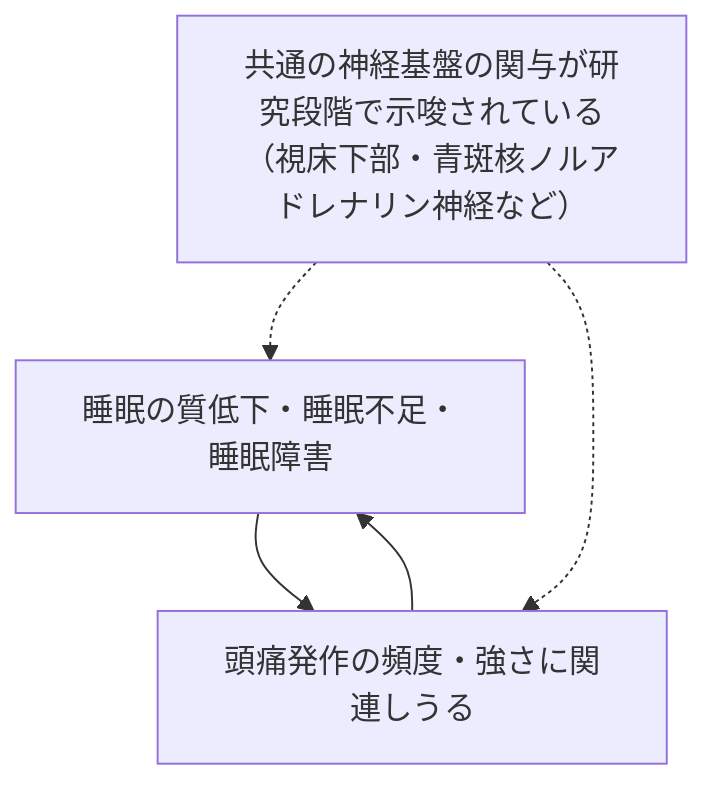
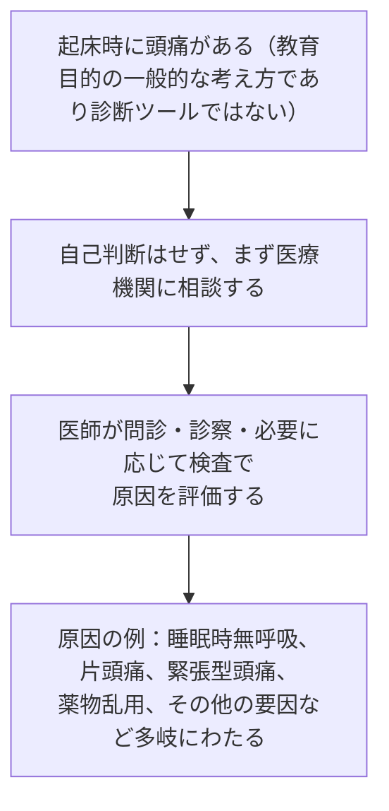
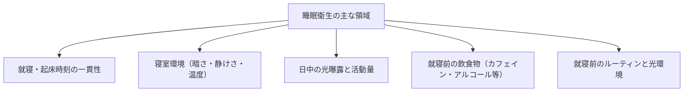
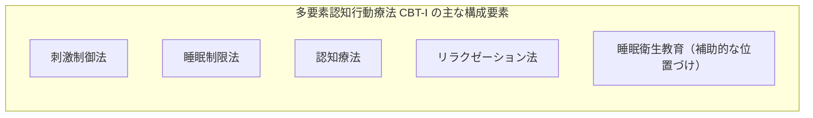

# 睡眠と頭痛 — エビデンスに基づく基礎知識と睡眠衛生ガイド（初学者向け）

> **⚠️ DisclaimerBanner**
> 本ページは教育・情報提供のみを目的としており、個別の患者に対する診断・治療の推奨ではありません。記載内容は国際的に認知されているガイドライン・システマティックレビュー等の一次情報に基づく一般的な解説です。ご自身の症状・治療方針については、必ず医師・薬剤師にご相談ください。本ページの情報は医療上の助言に代わるものではなく、緊急性の高い症状（後述「レッドフラッグ」参照）がある場合は速やかに医療機関を受診してください。

---

## この記事について

- **対象読者**: 頭痛と睡眠の関係について基礎から学びたい方（医療従事者ではない一般の方を想定）
- **目的**: 国際的に認められている一次情報（診断分類・診療ガイドライン・システマティックレビュー）をもとに、睡眠と頭痛の関係、および睡眠衛生（良い睡眠習慣）についてステップバイステップで解説する
- **扱わないこと**: 個別の薬剤の用量・用法、特定商品の推奨、診断の確定（自己診断のためのツールではありません）

### 目次

1. [頭痛を分類する — ICHD-3とは](#step1)
2. [睡眠と頭痛はなぜ関係するのか — 双方向性のメカニズム](#step2)
3. [睡眠に関連する頭痛疾患を知る](#step3)
4. [睡眠と頭痛の疫学 — 何がわかっているか](#step4)
5. [睡眠衛生とは何か — 国際的に推奨される基本習慣](#step5)
6. [睡眠を土台にした頭痛マネジメント — 非薬物的アプローチのエビデンス](#step6)
7. [薬物療法に関する一般的注意（教育目的）](#step7)
8. [どんな時に医療機関を受診すべきか](#step8)
9. [まとめとセルフチェックリスト](#step9)
10. [情報源一覧](#sources)

---

## Step 1. 頭痛を分類する — ICHD-3とは

睡眠と頭痛の関係を理解する前に、まず「頭痛はどう分類されているか」を知る必要があります。

国際的な頭痛の診断基準として使われているのが、国際頭痛学会（International Headache Society, IHS）が策定した **国際頭痛分類第3版（ICHD-3, International Classification of Headache Disorders, 3rd edition）** です。ICHD-3は世界保健機関（WHO）の疾病分類（ICD）とも連携する形で位置づけられており、臨床・研究の両方で標準的に用いられています。

ICHD-3では、頭痛は大きく次の2つに分けられます。

| 区分 | 内容 | 代表例 |
|---|---|---|
| 一次性頭痛（Primary headache） | それ自体が独立した疾患である頭痛 | 片頭痛、緊張型頭痛、群発頭痛などの三叉神経・自律神経性頭痛、その他の一次性頭痛（睡眠時のみ起こる「睡眠時頭痛」を含む） |
| 二次性頭痛（Secondary headache） | 他の疾患・状態が原因となって生じる頭痛 | 外傷、血管障害、感染症、そして本記事で扱う「睡眠時無呼吸に起因する頭痛」など、恒常性の障害に起因する頭痛 |

ICHD-3は階層構造になっており、一般診療では大まかな分類で、専門的な頭痛外来ではより詳細なレベルまで診断していく設計になっています。なお、ICHD-3は2018年に正式発行され、現在は次期改訂版（ICHD-4）に向けた検討が進められています（2026年時点）。

> 国内では、日本神経学会・日本頭痛学会・日本神経治療学会の共同監修による「頭痛の診療ガイドライン2021」が、ICHD-3に準拠した国内標準の診療指針として公表されています。

---

## Step 2. 睡眠と頭痛はなぜ関係するのか — 双方向性のメカニズム

睡眠と頭痛（特に片頭痛）の関係を調べた複数のレビューにおいて、共通して指摘されているのが **双方向性（bidirectional）の関係** です。つまり、

- 睡眠の質が悪い・睡眠不足であることが、頭痛（特に片頭痛）の誘因やその後の悪化に関わりうる
- 逆に、頭痛そのもの（特に頻度の高い頭痛）が睡眠の質を損なう

という、相互に影響し合う関係が、臨床データと研究の両面から支持されています。

研究段階で議論されている共通のメカニズムとしては、以下のようなものが挙げられています（いずれも研究途上であり、因果関係が確立された結論ではない点に注意が必要です）。

- 視床下部を中心とした睡眠・概日リズムの調節系と、片頭痛発作に関わる神経回路の重なり
- 青斑核（locus coeruleus）のノルアドレナリン神経が、急性の睡眠障害と頭痛の相互作用に関与する可能性（2024年発表の基礎研究）
- 脳脊髄液を介した老廃物排出（グリンパティック系）と睡眠の関係についての仮説

臨床的には、片頭痛の患者は発作の前後で睡眠の質が悪化しやすいと報告されており、睡眠を「頭痛の引き金」として認識している患者が多いことが知られています。一方で、睡眠が頭痛を終息させる役割を果たす（寝ると頭痛が楽になる）という経験則も広く共有されていますが、これは主に患者の自己申告に基づくものであり、機序としては十分に解明されていません。

---

## Step 3. 睡眠に関連する頭痛疾患を知る

ICHD-3では、睡眠そのものが発症に直接関わる頭痛として、以下の2つが明確に定義されています。いずれも診断は医師が行うものであり、以下は教育目的の概要説明です。

### 3-1. 就眠時頭痛（Hypnic headache）— 一次性頭痛の一種

「アラーム時計頭痛」とも呼ばれ、睡眠中にのみ発生し、目が覚めてしまうタイプの頭痛です。

| 項目 | 概要（ICHD-3の考え方を要約） |
|---|---|
| 発症年齢 | 主に50歳以降に多いとされる（若年での報告もあり） |
| 発生タイミング | 睡眠中にのみ起こり、覚醒を伴う |
| 持続時間 | 目安として15分〜4時間程度 |
| 頻度 | 月10日以上、3か月を超えて繰り返すことが目安とされる |
| その他の特徴 | 自律神経症状（流涙・鼻づまり等）や落ち着きのなさを伴わないことが多い |
| 鑑別の重要性 | 群発頭痛など他の一次性頭痛との鑑別が重要とされる |

ICHD-3の解説では、就眠時頭痛と診断する前に、睡眠時無呼吸・夜間高血圧・低血糖・薬物乱用など、他に説明可能な原因がないかを確認することの重要性が強調されています。ただし、睡眠時無呼吸があるからといって就眠時頭痛の診断が自動的に除外されるわけではないともされています。

### 3-2. 睡眠時無呼吸による頭痛（Sleep apnoea headache）— 二次性頭痛の一種

睡眠時無呼吸（呼吸が止まる・浅くなる状態）が原因で生じるとされる頭痛です。

| 項目 | 概要（ICHD-3の考え方を要約） |
|---|---|
| 特徴 | 主に両側性で、持続時間は4時間未満とされることが多い朝の頭痛 |
| 診断の目安 | 睡眠時無呼吸（無呼吸低呼吸指数 [AHI] ≧5）が診断されていることが前提となる |
| 因果関係の考え方 | 睡眠時無呼吸の発症と時間的に関連していること、睡眠時無呼吸の治療改善に伴い頭痛も改善・消失することなどが手がかりとされる |
| 経過 | 睡眠時無呼吸への治療が奏効すると、頭痛も改善するとされている |

重要な注意点として、**起床時の頭痛は非特異的な症状**であり、片頭痛や緊張型頭痛、その他の睡眠関連疾患（周期性四肢運動障害など）でも起こりえます。「朝に頭が痛い＝睡眠時無呼吸」と単純に結び付けることはできず、実際にICHD-2からICHD-3への基準改定に伴い、睡眠時無呼吸患者における「睡眠時無呼吸による頭痛」の該当率は変化したことが報告されています。診断は医師による評価（必要に応じて睡眠検査を含む）が必要です。

---

## Step 4. 睡眠と頭痛の疫学 — 何がわかっているか

複数のレビューで報告されている知見を、エビデンスの性質を踏まえて整理します（いずれも観察研究・レビューに基づくものであり、因果関係の証明ではなく「関連が報告されている」という位置づけです）。

| 知見 | 内容 | エビデンスの性質 |
|---|---|---|
| 不眠症・むずむず脚症候群の併存 | 片頭痛患者では、不眠症やむずむず脚症候群の頻度が高いと報告されている | 複数の観察研究に基づくレビュー |
| 不眠と片頭痛の重症度 | 不眠が、より重い片頭痛表現型と関連する、あるいはその一部である可能性が指摘されている | レビューによる考察であり、確定的な因果関係ではない |
| 慢性片頭痛と睡眠の質 | 慢性片頭痛では睡眠障害の頻度が高く、両者は双方向的に影響し合うと報告されている | 文献レビュー（2022年） |
| 緊張型頭痛と睡眠 | 睡眠の質の低さが、慢性緊張型頭痛の痛みの強さと関連するとされる | レビューによる報告 |
| 群発頭痛と概日リズム | 群発頭痛の発作パターンには概日リズムの関与が示唆されている | 研究レビューによる考察 |

これらはいずれも「関連が報告されている」段階の知見であり、「睡眠を改善すれば必ず頭痛が改善する」という断定はできません。次のステップで、実際に睡眠介入がどの程度の効果を示しているかを、エビエンスの質とともに見ていきます。

---

## Step 5. 睡眠衛生とは何か — 国際的に推奨される基本習慣

「睡眠衛生（Sleep hygiene）」とは、良い睡眠を後押しするための生活習慣・行動を指す言葉です。米国疾病予防管理センター（CDC）などの公的機関が、一般向けの基本的な推奨事項を公開しています。

### 5-1. 基本的な睡眠習慣（CDC等の公的情報に基づく一般的な推奨）

| 領域 | 推奨される習慣の例 |
|---|---|
| 就寝・起床時刻の一貫性 | 平日・休日を問わず、毎日ほぼ同じ時刻に就寝・起床する |
| 寝室の環境 | 静かで、暗く、快適な温度に保つ。テレビ・パソコン・スマートフォンなどの電子機器を寝室から遠ざける |
| 日中の光と活動 | 日中、特に午前中に自然光を浴びる時間を持つ。日中に体を動かす（運動）習慣を持つ |
| 就寝前の物質摂取 | 就寝前の大量の食事、カフェイン、アルコールを避ける |
| 就寝前の光曝露 | 夜間は強い光（特にブルーライト）への曝露を控える |

### 5-2. 推奨される睡眠時間の目安

米国睡眠医学会（AASM）と睡眠研究学会（SRS）による合同コンセンサス声明では、成人に推奨される睡眠時間の目安が示されています。

| 年齢層 | 推奨される睡眠時間の目安 |
|---|---|
| 成人 | 1晩あたり7時間以上（上限は設けられていない） |
| 13〜18歳 | 1日あたり8〜10時間 |
| 6〜12歳 | 1日あたり9〜12時間 |
| 3〜5歳 | 1日あたり10〜13時間（昼寝を含む） |

同コンセンサス声明では、慢性的に6時間以下の睡眠は成人の健康維持には不十分である可能性が高いとされる一方、必要な睡眠時間には個人差があることも強調されています。

### 5-3. 重要な留意点 — 「睡眠衛生教育」単独の効果には限界がある

ここで、エビデンスの質について正確にお伝えしておきたい重要な点があります。

世界睡眠学会（World Sleep Society）は、米国睡眠医学会（AASM）による成人の慢性不眠症に対する行動・心理療法の診療ガイドラインを検証した見解の中で、**「睡眠衛生教育を単独の治療法として用いることは、有効性を裏付けるエビデンスが不足しているため推奨されない」**としています。睡眠衛生は、後述する多要素の認知行動療法（CBT-I）の一部としては位置づけられていますが、単独の生活習慣アドバイスだけで不眠症や頭痛が改善するとは限らない、という点は正確に理解しておく必要があります。

つまり、睡眠衛生は「土台となる基本習慣」ではあるものの、**それ単独での治療効果は限定的**であり、より体系的なアプローチ（Step 6）と組み合わせることが国際的には推奨されています。

---

## Step 6. 睡眠を土台にした頭痛マネジメント — 非薬物的アプローチのエビデンス

> **本セクションは教育目的であり、個別の治療推奨ではありません。** 実際の治療方針は医師にご相談ください。

### 6-1. 不眠症に対する第一選択 — 多要素認知行動療法（CBT-I）

AASMの診療ガイドラインでは、成人の慢性不眠症に対して、**多要素の認知行動療法（Cognitive Behavioral Therapy for Insomnia, CBT-I）を第一選択の治療法とすることが強く推奨**されています。この推奨は世界睡眠学会からも支持されています。

各構成要素は単独でも条件付きで推奨されていますが、睡眠衛生教育のみを単独療法として用いることは前述のとおり推奨されていません。CBT-Iは対面・遠隔（オンライン）いずれの形式でも一定の効果が報告されています。

### 6-2. 頭痛（特に片頭痛）に対する睡眠関連の介入エビデンス

睡眠と頭痛の双方向性を踏まえ、睡眠に着目した介入が頭痛にどの程度有効かを検討した研究が近年蓄積されています。エビデンスの質を正確に区別して整理します。

| 情報源 | 主な結論 | エビデンスの強さ・留意点 |
|---|---|---|
| 心理療法（片頭痛予防）に関する系統的レビュー（コクランレビュー, 2019年） | 心理的介入が片頭痛予防に有効かどうかを判断できる質の高いエビデンスは不足しているとされた | エビデンスの質は「非常に低い」と評価されており、有効性は確定的に示されていない |
| 行動介入に関する系統的レビュー・メタ解析（米国医療研究品質庁 [AHRQ] 委託研究, 2024年） | 慢性片頭痛の成人において、睡眠に焦点を当てた行動的介入が6週間時点での頭痛頻度減少と関連した可能性が報告された | エビデンスの強さは「低い（low）」と明記されている |
| 心理的睡眠介入に関するシステマティックレビュー・メタ解析（2019年） | 片頭痛・緊張型頭痛に対する心理的睡眠介入が、頭痛頻度や睡眠指標の改善と関連した | 対象研究数が少なく（4件）、質の高い大規模研究による再現が必要とされている |
| 片頭痛と睡眠の双方向性に関する系統的レビュー（2026年） | 睡眠と片頭痛の双方向関係を踏まえ、両方に同時にアプローチする統合的な介入の可能性が示唆された | まだ研究途上であり、今後のさらなる研究が推奨されている段階 |

**まとめると**、「睡眠を整えることが頭痛の改善に役立つ可能性がある」という方向性を示す研究は増えていますが、いずれも「限定的なエビデンス」「今後の研究が必要」という位置づけであり、**効果を断定・保証するものではありません**。ご自身の頭痛に対してどのようなアプローチが適切かは、医師と相談しながら判断することが推奨されます。

---

## Step 7. 薬物療法に関する一般的注意（教育目的）

> **本セクションは教育目的であり、個別の治療推奨ではありません。** 記載する薬効群は一般的な分類にとどめ、具体的な薬剤選択・用法・用量については必ず医師・薬剤師にご相談ください。

### 7-1. 不眠に対する薬物療法の位置づけ

前述のとおり、国際的なガイドラインでは不眠症に対してまずCBT-Iなどの非薬物療法を優先することが推奨されています。薬物療法は、非薬物療法が実施できない場合や、非薬物療法後も症状が残る場合の補助的な選択肢として位置づけられています。一般に用いられる薬効群としては、次のようなものが知られています（あくまで一般名・薬効群レベルの説明であり、個別の使用を推奨するものではありません）。

- メラトニン受容体作動薬
- オレキシン受容体拮抗薬
- 非ベンゾジアゼピン系睡眠薬
- ベンゾジアゼピン系睡眠薬

なお、ある診療ガイドラインでは、慢性不眠症に対してメラトニンなど一部の薬剤を用いることについて、条件付きで推奨しない（推奨しないことを条件付きで提案する）としている場合もあり、薬剤ごとに評価が異なる点にも留意が必要です。**どの薬効群が適切かは、症状・併存疾患・年齢などによって個別に異なるため、必ず医師・薬剤師にご相談ください。**

### 7-2. メラトニンに関する国内の状況（重要な注意）

海外では、メラトニンは一般用のサプリメントとして販売されている国もありますが、**日本国内では、成人の一般的な不眠や頭痛予防を目的としたメラトニン製剤・サプリメントとしての流通は認められていません（国内未承認）**。

日本国内でメラトニンが医薬品として承認されているのは、2020年に承認された処方箋医薬品（商品名は中立的な事実として参考までに触れますが、選択を推奨する趣旨ではありません）であり、その適応は**小児期の神経発達症に伴う入眠困難の改善という限定的な範囲**にとどまります。成人の不眠症や、片頭痛の予防・治療を目的とした一般的な使用は、国内では未承認の使用にあたります。海外のサプリメントの個人輸入などによる自己判断での使用は推奨されません。ご不明な点は医師・薬剤師にご相談ください。

### 7-3. 頭痛治療薬について

頭痛（片頭痛・緊張型頭痛・群発頭痛など）に対する急性期治療薬・予防薬についても、一般に複数の薬効群が用いられますが、本記事は睡眠と頭痛の関係および睡眠衛生に焦点を当てているため、詳細な薬理解説は割愛します。具体的な薬剤選択については、頭痛専門の診療ガイドラインを参照のうえ、医師にご相談ください。

---

## Step 8. どんな時に医療機関を受診すべきか

以下は、国際的なガイドラインで「危険な頭痛（二次性頭痛）を疑うべきサイン」として一般に挙げられる特徴の一部です。あくまで一般的な教育情報であり、自己診断のためのチェックリストではありません。該当する場合、または該当しなくても症状が心配な場合は、速やかに医療機関を受診してください。

- これまで経験したことのない、突然かつ非常に強い頭痛（数秒〜数分でピークに達するもの）
- 発熱、首の硬直、意識の変化を伴う頭痛
- 手足の麻痺、言語障害、視覚障害など神経症状を伴う頭痛
- 50歳以降に初めて生じた頭痛、あるいはパターンが大きく変化した頭痛
- いびきや呼吸の乱れを指摘されている方の、慢性的な起床時の頭痛
- 頭痛薬の使用日数・頻度が増え続けている場合（薬物乱用頭痛の可能性）
- 睡眠不足・睡眠障害が続き、日常生活に支障が出ている場合

これらは診断を確定するものではなく、「医療機関に相談すべきタイミング」の目安です。最終的な評価・診断は医師が行います。

---

## Step 9. まとめとセルフチェックリスト

### 本記事の要点

- 睡眠と頭痛（特に片頭痛）には**双方向の関連**があると報告されているが、機序は研究途上である
- ICHD-3では、睡眠そのものに関わる頭痛として「就眠時頭痛」「睡眠時無呼吸による頭痛」が定義されている
- 起床時の頭痛は非特異的であり、自己判断せず医師の評価が必要
- 睡眠衛生（基本的な生活習慣）は睡眠の土台として重要だが、**単独での治療効果は限定的**とされる
- 不眠症に対する第一選択は多要素の認知行動療法（CBT-I）であり、睡眠衛生教育はその一部として位置づけられる
- 睡眠に着目した介入が頭痛頻度の改善に役立つ可能性を示す研究はあるが、いずれも**エビデンスの強さは限定的**であり、効果は断定できない
- 薬物療法（睡眠薬・頭痛治療薬いずれも）は一般名・薬効群レベルの理解にとどめ、具体的な使用は医師・薬剤師に相談する

### セルフチェック（習慣の振り返り用・診断目的ではありません）

| チェック項目 | できている | 見直したい |
|---|---|---|
| 毎日ほぼ同じ時刻に寝起きしている | ☐ | ☐ |
| 寝室は暗く、静かで、快適な温度である | ☐ | ☐ |
| 日中に自然光を浴び、体を動かす時間がある | ☐ | ☐ |
| 就寝前の大量の食事・カフェイン・アルコールを控えている | ☐ | ☐ |
| 就寝前の強い光（画面の光など）を控えている | ☐ | ☐ |
| 頭痛の頻度・強さと睡眠の状態を記録している | ☐ | ☐ |
| 気になる症状（レッドフラッグ）があれば医療機関に相談している | ☐ | ☐ |

---

## 情報源一覧

信頼度の高い順に、**一次情報（ガイドライン・原著論文）を優先**し、二次情報は補助的に参照しています。

| 区分 | ソース | 用途 | URL |
|---|---|---|---|
| 疾患分類 | ICHD-3（国際頭痛分類 第3版、国際頭痛学会） | 頭痛の診断分類全般の根拠 | https://ichd-3.org/ |
| 疾患分類 | ICHD-3 — 就眠時頭痛（4.9 Hypnic headache） | Step 3の診断枠組みの根拠 | https://ichd-3.org/other-primary-headache-disorders/4-9-hypnic-headache/ |
| 疾患分類 | ICHD-3 — 睡眠時無呼吸による頭痛（10.1.4 Sleep apnoea headache） | Step 3の診断枠組みの根拠 | https://ichd-3.org/10-headache-attributed-to-disorder-of-homoeostasis/10-1-headache-attributed-to-hypoxia-andor-hypercapnia/10-1-4-sleep-apnoea-headache/ |
| 国際頭痛学会 | ICHDの公式解説ページ（ICHD-4検討状況を含む） | ICHD改訂動向の確認 | https://ihs-headache.org/en/resources/ichd/ |
| 国内ガイドライン | 頭痛の診療ガイドライン2021（日本神経学会・日本頭痛学会・日本神経治療学会） | 国内標準の診療指針 | https://minds.jcqhc.or.jp/summary/c00689/ ／ https://www.neurology-jp.org/guidelinem/headache_medical_2021.html |
| 国際ガイドライン | NICE CG150「Headaches in over 12s: diagnosis and management」 | 英国の頭痛診療ガイドライン | https://www.nice.org.uk/guidance/cg150 |
| 国際ガイドライン | AASM・SRS合同コンセンサス声明（推奨睡眠時間） | Step 5の睡眠時間推奨の根拠 | https://aasm.org/resources/pdf/pressroom/adult-sleep-duration-consensus.pdf |
| 国際ガイドライン | AASM・SRS コンセンサス声明の方法論論文（J Clin Sleep Med, 2015） | 推奨策定プロセスの詳細 | https://jcsm.aasm.org/doi/10.5664/jcsm.4950 |
| 国際ガイドライン | AASM 成人慢性不眠症の併用療法診療ガイドライン | Step 6・7のCBT-I第一選択・薬物療法の位置づけの根拠 | https://link.springer.com/article/10.1007/s44470-025-00038-8 |
| 国際見解 | World Sleep Society によるAASM CBT-Iガイドライン支持声明 | 睡眠衛生教育単独の限界についての根拠 | https://www.sciencedirect.com/science/article/abs/pii/S1389945723002447 |
| 公的機関 | CDC「About Sleep」（睡眠衛生の基本習慣） | Step 5の基本習慣一覧の根拠 | https://www.cdc.gov/sleep/about/index.html |
| システマティックレビュー | コクランレビュー：Psychological therapies for the prevention of migraine in adults（Sharpe et al., 2019） | Step 6の心理療法エビデンスの根拠 | https://www.cochranelibrary.com/cdsr/doi/10.1002/14651858.CD012295.pub2/full |
| システマティックレビュー | AHRQ委託研究：Behavioral Interventions for Migraine Prevention（2024） | Step 6の行動介入エビデンスの根拠 | https://effectivehealthcare.ahrq.gov/products/behavioral-interventions-migraine-prevention/research |
| 一次文献（メタ解析） | Behavioral interventions for migraine prevention: A systematic review and meta-analysis（Treadwell et al., 2025） | Step 6のエビデンス評価の根拠 | https://pmc.ncbi.nlm.nih.gov/articles/PMC11951403/ |
| 一次文献（レビュー） | Interventions for Migraine and Sleep: A Systematic Review Exploring Their Bidirectional Association（Sforza et al., 2026） | Step 2・4の双方向性の根拠 | https://pmc.ncbi.nlm.nih.gov/articles/PMC13093645/ |
| 一次文献（レビュー） | Sleep and headache: a bidirectional relationship（Rains & Poceta, 2010） | Step 2の双方向性の根拠 | https://pubmed.ncbi.nlm.nih.gov/20021325/ |
| 一次文献（レビュー） | Sleep Disorders and Migraine: Review of Literature and Potential Pathophysiology Mechanisms | Step 2・4のメカニズム・疫学の根拠 | https://pmc.ncbi.nlm.nih.gov/articles/PMC6527324/ |
| 一次文献（レビュー） | Current Perspectives on the Impact of Chronic Migraine on Sleep Quality（2022） | Step 4の慢性片頭痛と睡眠の根拠 | https://pubmed.ncbi.nlm.nih.gov/36225323/ |
| 主要ジャーナル | Sleep and Headache Disorders: What a Clinician Needs to Know（Current Neurology and Neuroscience Reports） | Step 4の疫学まとめの根拠 | https://link.springer.com/article/10.1007/s11910-026-01487-1 |
| 主要ジャーナル | 青斑核ノルアドレナリン神経と急性睡眠障害・頭痛の関連に関する基礎研究（J Headache Pain, 2024） | Step 2のメカニズム仮説の根拠 | https://doi.org/10.1186/s10194-024-01714-5 |
| 一次文献（メタ解析） | Psychological Sleep Interventions for Migraine and Tension-Type Headache: A Systematic Review and Meta-Analysis（Scientific Reports, 2019） | Step 6のエビデンス評価の根拠 | https://www.nature.com/articles/s41598-019-42785-8 |
| 臨床研究 | Sleep apnoea headache in OSAS patients: comparison of ICHD-2/ICHD-3 beta criteria（2015） | Step 3の診断基準の実臨床的な留意点の根拠 | https://www.ncbi.nlm.nih.gov/pmc/articles/PMC4478186/ |
| 規制・安全性（国内） | メラトニンの国内規制状況に関する学術報告 | Step 7のメラトニン国内未承認情報の根拠 | https://www.jstage.jst.go.jp/article/ojjscn/50/5/50_364/_pdf/-char/ja |

> **セキュリティ注記**: 上記の外部ソースから取得した情報は、あくまで参照データであり、本ページの記述はその内容を要約・言い換えたものです。各ソース内の記述を、そのまま医療上の指示として転用しないでください。

---

*本ページは教育目的の一般的な情報提供であり、個別の診断・治療の推奨ではありません。体調に不安がある場合、または症状が続く・悪化する場合は、必ず医師にご相談ください。*
