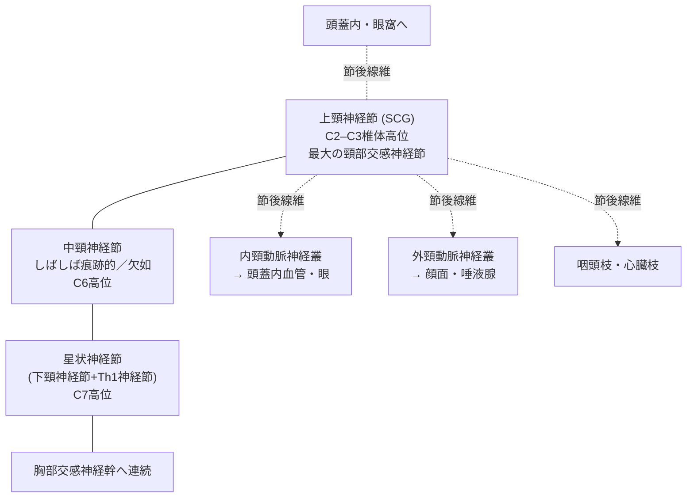
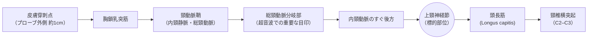
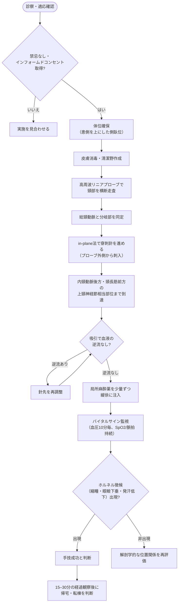
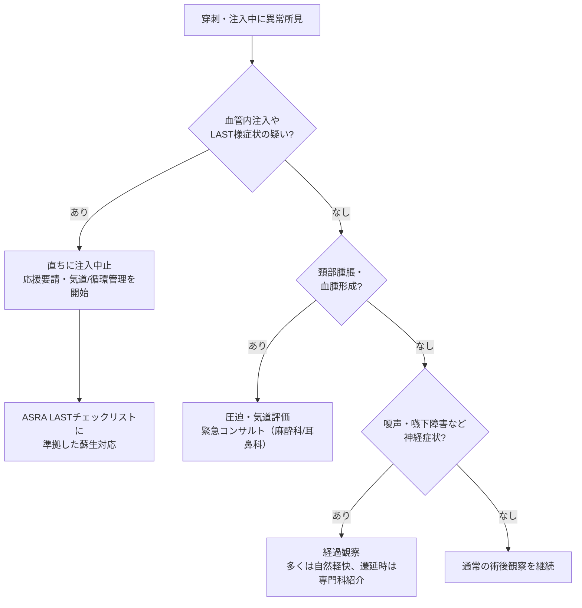

# 上頸神経節ブロック（Superior Cervical Ganglion Block）完全ガイド
### ― 国際文献に基づくステップ・バイ・ステップ解説 ―

> **本資料の位置づけ（免責事項）**
> 本資料は、国際的に査読を受けた医学文献（PubMed収載論文、*Regional Anesthesia and Pain Medicine*誌、*Pain Medicine*誌、Springer社刊行書籍など）に基づき、教育・学習目的で作成した解説資料です。実際の臨床手技は、解剖・薬理・救急対応に精通した医師が、超音波装置や蘇生設備が整った環境で、患者ごとの適応と禁忌を十分評価したうえで実施すべきものであり、本資料はその代替とはなりません。各施設のプロトコルおよび指導医の監督に従ってください。

---

## 目次

1. はじめに：「上頚神経ブロック」という言葉の整理
2. 頸部交感神経系の解剖
3. 適応
4. 禁忌
5. 術前評価と準備
6. 手技：ステップ・バイ・ステップ（超音波ガイド下法）
7. 参考：古典的経口法（Transoral法）
8. 効果判定：ホルネル徴候
9. 合併症とその対応
10. 星状神経節ブロックとの違い
11. 国際文献のエビデンスまとめ
12. まとめ
13. 参考文献（一次情報源URL付き）

---

## 1. はじめに：「上頚神経ブロック」という言葉の整理

日本語の臨床現場では「上頚神経ブロック」「上頚神経節ブロック」という表現が使われますが、これは正式には **上頸神経節ブロック（Superior Cervical Ganglion Block: SCGB）** を指します。頸部の交感神経節（自律神経の中継点）のうち、最も頭側（上方）にある「上頸神経節」を標的とするブロックです。

初学者が混同しやすい類似手技を、下表で整理します。

| 名称 | 標的 | 主な適応領域 | 備考 |
|---|---|---|---|
| **上頸神経節ブロック**（本資料の対象） | 上頸神経節（交感神経節、C2–C3高位） | 顔面・頭部の痛み、頭痛、耳鳴りなど | 星状神経節ブロックより頭側 |
| 星状神経節ブロック（Stellate Ganglion Block） | 星状神経節（下頸神経節＋Th1神経節、C6–C7高位） | 顔・肩・上肢・上胸部の症状 | 日本で最も普及した交感神経節ブロック |
| 頸神経叢ブロック（Cervical Plexus Block） | C1–C4頸神経前枝（体性神経） | 頸動脈内膜剥離術、鎖骨骨折の鎮痛など | 交感神経ではなく体性感覚神経が対象 |
| 頚椎神経根ブロック（Cervical Nerve Root Block） | 頸椎の脊髄神経根 | 頸椎椎間板ヘルニア等による頸部～上肢の疼痛 | 整形外科・脊椎領域で頻用 |

この整理は、上頸神経節と星状神経節を対比した国際文献の記載にも一致します[1]。本資料では、以降「上頸神経節ブロック（SCGB）」という正式名称で統一して解説します。

---

## 2. 頸部交感神経系の解剖

頸部の交感神経幹には、通常**上頸神経節・中頸神経節・星状神経節（下頸神経節＋Th1神経節が融合したもの）**の3つの神経節が存在します[3][4]。中頸神経節は個体差があり、しばしば痕跡的、あるいは欠如することもあります。

上頸神経節（SCG）は3つのうち**最も大きく**、紡錘形で長径10〜30mmとされ[5]、次のような位置関係にあります[1][2][6]。

- 高位：**第2〜第3頸椎（C2–C3）横突起の前方**（上は下顎角のやや尾側、下は第4頸椎上縁まで及ぶことがある）
- 前後関係：**総頸動脈分岐部のすぐ後方（深部）**、**頭長筋（Longus capitis）の前方**
- 内側性の関係：**迷走神経の後内側**に位置する
- 個体差：cadaver（献体）を用いた形態学的研究では、位置の個体差は比較的小さいと報告されている[6]

### 2-1. 頸部交感神経幹の模式図（概念図・実寸ではありません）

### 2-2. 穿刺経路の位置関係（超音波ガイド下・in-plane法の概念図）

実際の手技では、以下の順序で構造物を確認しながら針を進めます[1]。

> **ポイント**：総頸動脈が内頸動脈・外頸動脈に分岐する部位（carotid bifurcation）を超音波で同定することが、上頸神経節を安全かつ正確に見つけるための最重要ランドマークです[1][2]。

---

## 3. 適応

上頸神経節ブロックの適応は、基本的に星状神経節ブロックと重なりますが、**頭部・顔面に及ぼす影響がより明確**であるとされています[4]。国際文献で報告されている主な適応は以下の通りです。

| 分類 | 具体的な病態・報告例 | 出典 |
|---|---|---|
| 顔面の神経障害性疼痛 | 特発性顔面痛（persistent idiopathic facial pain）、外傷後三叉神経障害性疼痛、帯状疱疹後三叉神経障害性疼痛、舌痛症（burning mouth syndrome） | [1] |
| 頭痛性疾患 | 片頭痛発作（トリプタン製剤との併用）、後頭神経痛 | [1][10] |
| 三叉神経・顔面痛 | 三叉神経痛、非定型顔面痛 | [4][9] |
| 耳鼻科領域 | 耳鳴り（治療抵抗性） | [4] |
| 脳血管攣縮関連 | くも膜下出血後の脳血管攣縮・遅発性脳虚血の治療 | [4]（引用元研究に基づく） |
| その他報告例 | 微小血管虚血による外転神経麻痺の回復促進 | [4] |

> **注意**：うつ症状への応用など、一部の適応は症例報告レベルの限定的なエビデンスであり[4]、標準治療としては確立していません。適応判断は個々の症例と施設のプロトコルに基づいて慎重に行う必要があります。

---

## 4. 禁忌

上頸神経節ブロックは頸動脈・頸静脈・脳神経に近接した部位を穿刺するため、以下のような禁忌・慎重投与が国際的なレビューで指摘されています[1][3][8]。

| 区分 | 禁忌・注意事項 | 理由 |
|---|---|---|
| 絶対的禁忌 | 局所麻酔薬に対するアレルギー | アナフィラキシー・局所麻酔薬中毒のリスク |
| 絶対的禁忌 | 穿刺部位の感染・蜂窩織炎 | 感染の深部への波及リスク |
| 絶対的禁忌 | 患者の同意が得られない、または体動制御が困難 | 血管損傷リスクの増大 |
| 相対的禁忌 | 抗凝固薬・抗血小板薬内服中、凝固異常 | 血腫（特に致死的となりうる後咽頭血腫）のリスク[7][8] |
| 相対的禁忌 | 対側の反回神経麻痺・声帯麻痺の既往 | 両側性声帯麻痺による気道閉塞リスク |
| 相対的禁忌 | 横隔神経依存の呼吸状態（頸髄損傷等） | 横隔神経遮断による呼吸抑制の懸念 |
| 相対的禁忌 | 重度の頸動脈狭窄・頸動脈手術直後 | 血管操作による血行動態への影響 |
| 相対的禁忌 | 妊娠 | データが限られており、リスク・ベネフィットを個別に評価 |

---

## 5. 術前評価と準備

1. **問診・診察**：疼痛の性状・分布、既往歴（出血傾向、抗凝固薬内服、頸部手術歴）、アレルギー歴の確認
2. **インフォームドコンセント**：目的、期待される効果（ホルネル徴候が出ることを含む）、合併症のリスクを説明し同意を取得
3. **画像・血液検査**：必要に応じて凝固能検査、頸部の解剖学的異常（腫瘍、術後瘢痕）の評価
4. **モニタリング環境の準備**：血圧計、パルスオキシメーター、心電図モニター、救急蘇生薬剤（脂肪乳剤を含む）と気道確保器具をすぐ使える状態にしておく
5. **体位**：患側を上にした側臥位、または仰臥位で頸部をやや伸展位に保持[1][9]

---

## 6. 手技：ステップ・バイ・ステップ（超音波ガイド下法）

現在、国際文献で報告されている主流の手法は**超音波ガイド下アプローチ**です。以下は、代表的な報告[1][2]に基づく手順です。

| ステップ | 内容 |
|---|---|
| ① 体位確保 | 患側を上にした側臥位（または仰臥位・頸部軽度伸展位）とする |
| ② 消毒・清潔野作成 | 乳様突起から頸部にかけて広く消毒し、清潔野を作成する |
| ③ プローブ走査 | 高周波（6–13MHz程度）リニアプローブを頸部下方に横断的に当て、気管・食道・甲状腺を確認しながら外側へ走査する |
| ④ 血管の同定 | 内頸静脈と総頸動脈をカラードプラで確認し、プローブを頭側へ移動して総頸動脈の分岐部（bifurcation）を描出する |
| ⑤ 目標構造の確認 | 分岐部のすぐ後方・頭長筋前方にある上頸神経節相当部位を同定する |
| ⑥ 穿刺 | 25G程度の穿刺針を、プローブ外側の刺入点からin-plane法（針全体を超音波画面上で見ながら進める方法）でリアルタイムに進める |
| ⑦ 針先の位置決め | 内頸動脈の後方、頭長筋の前方まで針先を進める |
| ⑧ 吸引テスト | 注入前に必ず吸引を行い、血液の逆流がないことを確認する |
| ⑨ 薬液注入 | 局所麻酔薬（例：1%メピバカイン 2–3mL）を少量ずつ緩徐に注入する[1] |
| ⑩ モニタリング | 注入後は血圧を10分ごと、脈拍・SpO₂を持続的に約30分間モニタリングする[1] |
| ⑪ 効果判定 | 注入後15〜30分でホルネル徴候（後述）の出現を確認する[1] |

### 手技全体のフローチャート

---

## 7. 参考：古典的経口法（Transoral法）

現在主流の超音波ガイド下法が普及する以前は、口腔内から「ストッパー」と呼ばれる器具を用いて針の進達距離を制限しながら盲目的に穿刺する**経口法（transoral approach）**が古典的な手技として報告されていました[2][4]。しかし、この方法は針先を標的から離れた位置にしか到達させられず、内頸動脈誤穿刺の懸念から局所麻酔薬の注入自体が禁忌とされていたほか、口腔内からの穿刺に伴う**頭蓋頸部膿瘍の症例報告**もあり[9]、感染リスクの観点からも現在ではほとんど用いられていません。2013年に発表された献体を用いた研究で超音波ガイド下アプローチの正確性（95%の成功率）が示されて以降[2]、超音波ガイド下法が事実上の標準となっています。

---

## 8. 効果判定：ホルネル徴候

上頸神経節が正しくブロックされると、同側の交感神経遠心路が遮断され、**ホルネル徴候（Horner's sign）**と呼ばれる特徴的な所見が出現します。これは合併症ではなく、**手技が成功したことを示す生理学的な指標**として扱われます。

| 徴候 | 機序 |
|---|---|
| 縮瞳（miosis） | 瞳孔散大筋への交感神経支配の消失 |
| 眼瞼下垂（ptosis） | Müller筋（上眼瞼挙筋の一部）の機能低下 |
| 眼球陥凹（enophthalmos）様所見 | 眼窩筋の緊張低下 |
| 顔面の発汗低下（anhidrosis） | 汗腺への交感神経支配の消失 |

ある単施設の後方視的研究では、43回の手技すべてでホルネル徴候が確認されており（100%）[1]、これは解剖学的な位置の個体差が比較的小さいことの裏付けとしても言及されています[1][6]。ホルネル徴候は通常、局所麻酔薬の効果消退とともに数時間以内に自然軽快します。

---

## 9. 合併症とその対応

| 合併症 | 内容 | 対応・備考 |
|---|---|---|
| 血管穿刺 | 総頸動脈・内頸動脈・内頸静脈・椎骨動脈の誤穿刺 | 圧迫止血、超音波でのリアルタイム観察により回避 |
| 後咽頭血腫 | まれだが**気道閉塞に至り致死的となりうる**合併症[7][8] | 頸部腫脹・呼吸困難出現時は直ちに気道評価と緊急対応 |
| 局所麻酔薬中毒（LAST） | 血管内誤注入による痙攣・不整脈・心停止 | 少量分割注入・頻回吸引で予防。ASRAのLASTチェックリストに準拠した蘇生対応を準備 |
| 反回神経遮断 | 一過性の嗄声・嚥下違和感 | 通常自然軽快。遷延時は耳鼻科的評価 |
| 迷走神経・舌咽神経・舌下神経への波及 | 嚥下障害、咽頭違和感 | 一過性であることが多い |
| ホルネル徴候の遷延 | 通常は数時間で消退 | 遷延する場合は原因精査 |
| 感染・膿瘍 | 特に経口法で報告例あり[9] | 無菌操作の徹底、超音波ガイド下法の選択で低減 |
| 横隔神経遮断（理論上） | 呼吸機能への影響 | 呼吸予備能の低い患者では特に注意 |

### 合併症発生時の対応フロー（簡易版）

---

## 10. 星状神経節ブロックとの違い

初学者が最も混同しやすいのが星状神経節ブロックとの違いです。国際文献での位置づけを整理すると以下のようになります[1][4]。

| 比較項目 | 上頸神経節ブロック（SCGB） | 星状神経節ブロック（SGB） |
|---|---|---|
| 標的神経節 | 上頸神経節（3神経節中最大） | 星状神経節（下頸神経節＋Th1神経節） |
| 穿刺高位 | C2–C3付近（総頸動脈分岐部） | C6（またはC7）付近 |
| 主な適応 | 頭部・顔面の疼痛、頭痛、耳鳴りなど | 顔・肩・上肢・上胸部の疼痛、CRPS等 |
| 血管損傷リスクの特徴 | 内頸動脈・内頸静脈に近接 | 椎骨動脈・甲状腺動脈損傷による後咽頭血腫が特に問題視される[7][8] |
| 普及度 | 限定的（専門施設中心） | 広く普及、症例数・エビデンスも豊富 |
| 歴史的アプローチ | 経口法（現在は非推奨） | 気管傍・傍矢状アプローチ |

---

## 11. 国際文献のエビデンスまとめ

上頸神経節ブロックに関する主要な国際文献の到達点を、時系列に沿って整理します。

- **2013年（*Pain Medicine*誌）**：Siegenthalerらは献体を用いた研究で、超音波ガイド下アプローチにより上頸神経節への到達精度が高い（20穿刺中19穿刺が成功）ことを示し、従来の盲目的経口法に代わる手法の礎を築きました[2]。
- **2023年（*JA Clinical Reports*誌）**：Maedaらは九州大学病院での後方視的コホート研究（患者10名、43手技）を報告し、全手技でホルネル徴候が確認され、疼痛スコアが有意に改善したこと、重大な有害事象が観察されなかったことを示しました[1]。ただし単施設・少数例・対照群なしという限界も明記されています。
- **2025年（*Frontiers in Pain Research*誌）**：片頭痛発作に対し、トリプタン製剤単独群とトリプタン＋超音波ガイド下上頸神経節ブロック併用群を傾向スコアマッチングで比較した後方視的・前向き混合コホート研究では、併用群でより高い疼痛緩和効果が示唆されています[10]。ただし無作為化比較試験ではない点に留意が必要です。
- **合併症に関するエビデンス**：上頸神経節ブロックに特化した大規模な合併症データベースは現時点で乏しく、多くの安全性に関する議論は、より症例数の多い星状神経節ブロックの系統的レビュー[8]や後咽頭血腫の解析[7]から類推されています。

**総合的な評価**：上頸神経節ブロックは、解剖学的に到達可能で、超音波ガイド下では比較的安全に実施しうる手技であることが複数の国際文献で示されています。一方で、エビデンスの大部分は少数例・単施設・後方視的研究にとどまり、大規模な無作為化比較試験は現時点で確立していません。そのため、標準治療というよりは**専門的な疼痛管理を行う施設における補助的・二次的治療選択肢**として位置づけるのが、現時点の文献に忠実な理解といえます。

---

## 12. まとめ

- 「上頚神経ブロック」は正式には**上頸神経節ブロック（SCGB）**であり、星状神経節ブロックや頸神経叢ブロックとは標的も適応も異なる
- 標的である上頸神経節は**C2–C3高位・総頸動脈分岐部の後方・頭長筋前方**に位置する
- 現在の標準的アプローチは**超音波ガイド下・in-plane法**であり、古典的経口法は感染・血管損傷リスクから推奨されない
- 適応は主に**頭部・顔面の神経障害性疼痛、頭痛性疾患**など
- 成功の指標は**ホルネル徴候（縮瞳・眼瞼下垂・発汗低下）**
- 最大の安全上の懸念は**血管損傷とそれに伴う後咽頭血腫**であり、少量分割注入と頻回の吸引確認が重要
- エビデンスは蓄積されつつあるが、**大規模無作為化比較試験は未確立**であり、専門施設での実施が前提となる

---

## 13. 参考文献（一次情報源）

1. Maeda A, Chikama Y, Tanaka R, Tominaga M, Shirozu K, Yamaura K. Safety and utility of ultrasound-guided superior cervical ganglion block for headaches and orofacial pain: a retrospective, single-center study of 10 patients. *JA Clin Rep*. 2023;9:21.
   https://doi.org/10.1186/s40981-023-00613-z

2. Siegenthaler A, Haug M, Eichenberger U, Suter MR, Moriggl B. Block of the Superior Cervical Ganglion, Description of a Novel Ultrasound-Guided Technique in Human Cadavers. *Pain Medicine*. 2013;14(5):646-649.
   https://pubmed.ncbi.nlm.nih.gov/23438374/

3. Baig S, Moon JY, Shankar H. Review of Sympathetic Blocks: Anatomy, Sonoanatomy, Evidence, and Techniques. *Regional Anesthesia and Pain Medicine*. 2017;42(3):377-391.
   https://pubmed.ncbi.nlm.nih.gov/28272291/

4. Tumber P, Jankovic D. Cervical Sympathetic Chain and Superior Cervical Ganglion Block. In: Jankovic D, Peng P, eds. *Regional Nerve Blocks in Anesthesia and Pain Therapy*. Springer, Cham; 2022.
   https://link.springer.com/chapter/10.1007/978-3-030-88727-8_12

5. Wisco JJ, Stark ME, Safir I, Rahman S. A heat map of superior cervical ganglion location relative to the common carotid artery bifurcation. *Anesthesia & Analgesia*. 2012;114(2):462-465.
   https://doi.org/10.1213/ANE.0b013e31823b676d

6. Mitsuoka K, Kikutani T, Sato I. Morphological relationship between the superior cervical ganglion and cervical nerves in Japanese cadaver donors. *Brain and Behavior*. 2017;7(3):e00619.
   https://doi.org/10.1002/brb3.619

7. Higa K, Hirata K, Hirota K, Nitahara K, Shono S. Retropharyngeal hematoma after stellate ganglion block: analysis of 27 patients reported in the literature. *Anesthesiology*. 2006;105(6):1238-1245.
   https://doi.org/10.1097/00000542-200612000-00024

8. Goel V, Patwardhan AM, Ibrahim M, Howe CL, Schultz DM, Shankar H. Complications associated with stellate ganglion nerve block: a systematic review. *Regional Anesthesia and Pain Medicine*. 2019;44(6):669-678.
   https://pubmed.ncbi.nlm.nih.gov/30992414/

9. Sproll C, Turowski B, Depprich R, Kübler NR, Rapp M, Lommen J, Holtmann H. Extensive craniocervical abscess after transoral ganglionic local opioid analgesia at the superior cervical ganglion for atypical trigeminal neuralgia: report of a severely complicated case. *Case Reports in Medicine*. 2018;2018:5247594.
   https://doi.org/10.1155/2018/5247594

10. Ultrasound-guided block of the superior cervical ganglion for migraine attacks: a propensity score-matched retrospective study. *Frontiers in Pain Research*. 2025.
    https://www.frontiersin.org/journals/pain-research/articles/10.3389/fpain.2025.1556654/full

11. Headache Classification Committee of the International Headache Society (IHS). The International Classification of Headache Disorders, 3rd edition. *Cephalalgia*. 2018;38(1):1-211.
    https://doi.org/10.1177/0333102417738202

12. NYSORA. 頸神経叢を理解する：解剖学、ブロック、臨床的関連性（頸部筋膜・頸神経叢の解剖に関する背景情報として参照）.
    https://www.nysora.com/ja/%E6%95%99%E8%82%B2%E3%83%8B%E3%83%A5%E3%83%BC%E3%82%B9/%E9%A0%B8%E7%A5%9E%E7%B5%8C%E5%8F%A2%E3%83%96%E3%83%AD%E3%83%83%E3%82%AF%E3%81%AE%E3%83%92%E3%83%B3%E3%83%88-2/

---

*本資料は2026年7月時点で参照可能な文献情報に基づき作成しています。医学情報は更新される可能性があるため、実臨床での使用にあたっては最新のガイドライン・エビデンスを必ず確認してください。*
