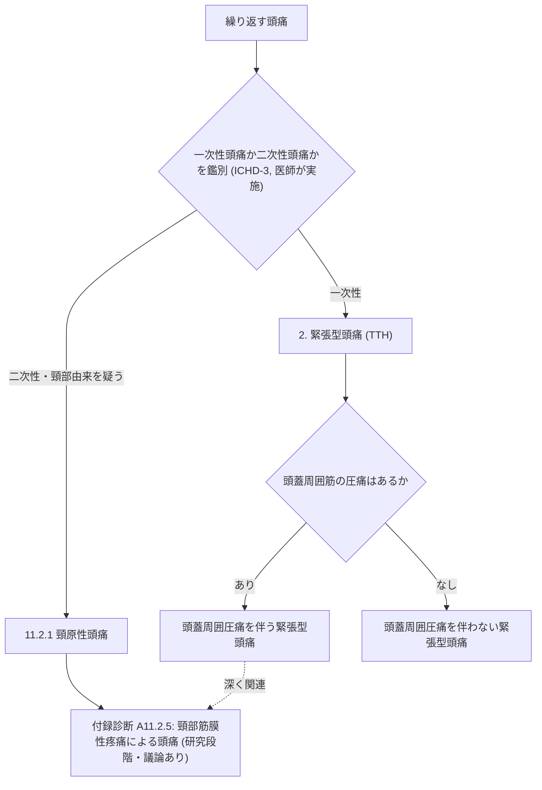
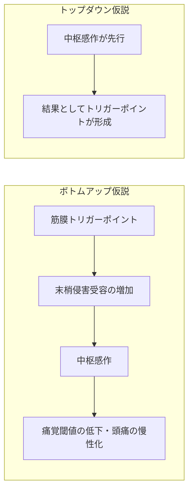
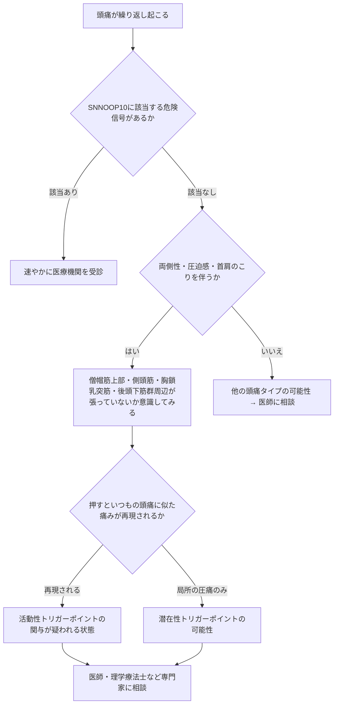

# 頭痛のトリガーポイント入門 ― 国際文献に基づくステップバイステップガイド

> **⚠️ DisclaimerBanner／重要な注意事項**
> 本ページは**教育・情報提供のみを目的**として作成されたものであり、**個別の患者に対する診断・治療の推奨ではありません**。
> 本ページに記載の内容だけで自己診断・自己治療を行わず、症状がある場合は必ず医師・理学療法士・鍼灸師等の有資格の医療専門家にご相談ください。
> 本ページは薬機法・医療広告ガイドラインを踏まえ、①個別の用法・用量の指示、②効果の断定・保証、③特定商品名の推奨、④未承認・適応外治療の推奨を行わない方針で作成しています。

---

## この記事の対象と読み方

「肩や首を押すと頭痛が再現される」「頭痛薬があまり効かない頭痛持ちの筋肉のコリ」──こうした現象は、医学的には **筋膜性トリガーポイント（myofascial trigger point, MTrP）** という概念で研究されています。本ガイドは、この概念を国際頭痛分類（ICHD-3）や主要な系統的レビュー・ガイドラインに基づいて、初学者にもわかりやすいようステップごとに解説します。

対象読者：医療系学生、コメディカル、患者教育資料の作成者、頭痛について基礎から学びたい方
前提知識：不要（専門用語はその都度説明します）

---

## Step 1. トリガーポイントとは何か

筋膜性トリガーポイント（MTrP）は、骨格筋の中にある**過敏化したスポット**で、触れると索状に硬くなった帯（taut band）の中に、押すと痛む結節（hypersensitive palpable nodule）として触知されると定義されています。この概念は1950年代にTravellとSimonsによって広められました。

MTrPには大きく2種類があります。

| 種類 | 特徴 |
|---|---|
| **活動性（active）トリガーポイント** | 何もしなくても持続的な痛みを引き起こす |
| **潜在性（latent）トリガーポイント** | 押す（触診・圧迫）ことでのみ痛みが生じる |

重要なポイントとして、MTrPの存在やその評価方法には**科学的な論争が現在も続いています**。ICHD-3自体も「いわゆる“トリガーポイント”と筋膜性疼痛の関係には議論があり、再現性をもって示すことが難しく、治療反応にもばらつきがある」と明記しています。この点は本ガイド全体を通じて念頭に置いてください。

---

## Step 2. 国際頭痛分類（ICHD-3）における位置づけ

頭痛の診断は自己判断ではなく、**国際頭痛学会（IHS）の国際頭痛分類 第3版（ICHD-3）** に基づいて医療専門家が行うものです。トリガーポイント／筋膜性疼痛は、主に次の2つの診断カテゴリーと関連づけて議論されています。

### 2-1. 緊張型頭痛（Tension-Type Headache, TTH）

ICHD-3では、緊張型頭痛は**頭蓋周囲の圧痛（pericranial tenderness）の有無**によってさらにサブタイプ分類されています。この圧痛は用手的な触診で評価され、頭痛の強さや頻度が増すほど圧痛も強くなる傾向があるとされます。この圧痛は簡便に触診で検出・記録できるとされています。

### 2-2. 頸原性頭痛（Cervicogenic Headache）

頸椎やその周囲軟部組織の障害によって生じる頭痛です。診断には、頭痛が頸部の障害と時間的に関連して発症・改善すること、頸部可動域の低下や誘発手技での増悪、診断的ブロックでの消失といった**因果関係の証拠**が求められます。

### 2-3. 付録診断：頸部筋膜性疼痛による頭痛（A11.2.5）

ICHD-3の付録には、「頸部の筋肉における筋膜性疼痛（トリガーポイントを含む）が原因である」ことを示す診断基準が試験的に収載されています。ただし、これは**さらなるエビデンスの蓄積を待つ研究段階の診断**であり、正式な診断カテゴリーではありません。

---

## Step 3. 病態メカニズム：なぜトリガーポイントと頭痛が関連しうるのか

トリガーポイントと頭痛の関係については、大きく2つの仮説モデルが議論されています。

緊張型頭痛においては、活動性トリガーポイントを押すと、患者が普段感じている頭痛パターンが再現されることが複数の研究で示されています。また、活動性トリガーポイントを持つ患者は、より広範囲の痛覚過敏（圧痛閾値の低下）を示すことがあり、これは中枢感作への関与を示唆すると考えられています。

一方で片頭痛については、活動性トリガーポイントの触診が片頭痛発作を誘発しうることが報告されていますが、トリガーポイントの数が発作頻度や強度と関連するかについては研究間で結果が一致していません。

> **ポイント**：トリガーポイントは頭痛の「原因」なのか「結果（二次的な蓄積）」なのかは、現時点の国際的なエビデンスでも**結論が出ていません**。

---

## Step 4. 代表的な筋肉と関連痛（referred pain）パターン

トリガーポイントは、押された場所とは離れた部位に痛みを感じさせる「関連痛」を引き起こすことが特徴です。頭頸部で研究の蓄積が多い筋肉は以下の通りです。

| 筋肉 | 主に研究された関連痛の広がり方 | 代表的な知見 |
|---|---|---|
| **僧帽筋上部**（upper trapezius） | 側頭部・耳の後ろ・後頭部にかけての痛み | 慢性緊張型頭痛患者の関連痛パターンが、緊張型頭痛そのものと類似した特徴を持つと報告 |
| **胸鎖乳突筋**（sternocleidomastoid, SCM） | 前頭部・眼窩周囲・頭頂部 | 片頭痛患者で最も圧痛を訴えやすい部位の一つとして報告 |
| **側頭筋**（temporalis） | こめかみ・上顎・眉毛周辺 | 慢性緊張型頭痛患者で、活動性トリガーポイントの位置と圧痛閾値低下の部位が一致すると報告 |
| **後頭下筋群**（suboccipital muscles） | 後頭部から頭頂部（時に眼窩後方まで） | 頭痛の強さ・頻度と活動性トリガーポイントの相関が報告 |

これらの知見は、いずれも触診・関連痛誘発試験を用いた臨床研究に基づくものであり、**画像診断によって客観的に「見える」ものではない**ことに注意が必要です。トリガーポイントの検出は現在も主に用手触診に依存しており、施術者間で一致率が低いという再現性の課題が指摘されています。超音波エラストグラフィーなど新しい画像評価法も研究段階にあります。

---

## Step 5. セルフチェックの考え方（診断の代わりにはなりません）

以下は**理解のための思考の流れ**であり、自己診断の手順ではありません。危険信号がある場合は迷わず受診してください。

### 見逃してはいけない危険信号（SNNOOP10）

国際的に使われる二次性頭痛のスクリーニングリスト **SNNOOP10** は、以下のような項目に当てはまる場合、単なる一次性頭痛ではない可能性を考慮すべきとしています。

| 危険信号カテゴリ | 具体例 |
|---|---|
| 突然・急激な発症 | 「今までで最悪」の頭痛が数秒〜数分で最悪の強さに達する |
| 神経学的異常を伴う | しびれ、脱力、意識障害、ろれつが回らない |
| 発熱・全身症状を伴う | 発熱、体重減少、免疫抑制状態 |
| パターンの変化 | 頭痛の性質・頻度・強さが急に変わった |
| 高齢での新規発症 | 65歳以降で初めて経験する頭痛 |
| 体位・咳・労作で誘発 | 起立や前屈、咳、力むことで悪化する |
| 外傷後・妊娠中 | 頭部外傷後、妊娠・産褥期の新規頭痛 |

これらに一つでも該当する場合は、トリガーポイントの自己評価を試みるより先に、**速やかに医療機関を受診**してください。

---

## Step 6. 主な介入法とエビデンスの質（概観）

以下は学術文献に基づく**一般的な治療カテゴリーの紹介**であり、特定の製品・術式の優劣を主張するものではありません。実際にどの方法が適切かは、医師・理学療法士等が個別に判断します。エビデンスの質は相対表現で示します（bA: 質の高いエビデンスで有効性の指摘あり／bB: 中等度のエビデンス／bC: 限定的・質の低いエビデンス／bU: 結論が定まらない）。

| 介入カテゴリー | 主な対象 | エビデンスの質(概観) | 代表的知見 |
|---|---|---|---|
| 徒手療法＋運動療法（関節モビライゼーション等） | 頸原性頭痛 | **bB**（中等度） | 20件・約1,500例のRCTを対象とした系統的レビューで、短期的な頭痛頻度・強度の中等度〜大きな減少が報告 |
| トリガーポイントを対象とした徒手療法（虚血性圧迫・ポジショナルリリース・マッサージ等） | 緊張型頭痛・片頭痛 | **bC**（限定的） | メタ解析で発作頻度・強度・持続時間の統計的に有意な減少が示されたが、全体のエビデンスの質は非常に低いと評価 |
| ドライニードリング | 緊張型頭痛 | **bB/bC**（中等度〜限定的） | 複数のRCTで活動性トリガーポイント数と頭痛強度の減少が報告 |
| 鍼治療（acupuncture） | 月15日以上の頻回な緊張型頭痛 | **bB**（NICEが選択肢として言及） | 英国NICEガイドラインでは、頻回な緊張型頭痛に対して最大10回程度の鍼治療のコースが選択肢として挙げられている |
| 局所麻酔薬のトリガーポイント注射 | 緊張型頭痛 | **bC**（限定的・医療行為） | プラセボ対照試験で頻度・強度の減少が報告されているが、医師のみが実施できる医療行為であり自己判断での実施はできない |
| ボツリヌス毒素注射 | 慢性緊張型頭痛 | **bU**（否定的〜不明） | メタ解析では緊張型頭痛への有効性は支持されていない。**日本国内では頭痛（片頭痛・緊張型頭痛とも）への使用は承認外（保険適用外・自費診療）** |

一般に、医療専門家が行う施術としては**用手療法（マニュアルセラピー）系のアプローチ**が比較的研究の蓄積があり、頸原性頭痛に対しては中等度のエビデンスが示されています。緊張型頭痛・片頭痛に対するトリガーポイント指向の徒手療法は、有望な結果を示す研究がある一方、プラセボ対照が不十分な試験が多く、**総合的なエビデンスの質は依然として低い**と評価されています。

> **重要**：具体的な施術内容・回数・強さ・薬剤の用法用量は、本ページでは扱いません。「一般にこうした施術カテゴリーが検討される」という情報提供にとどめ、実際の適用は必ず医師・理学療法士・鍼灸師など有資格者にご相談ください。

---

## Step 7. 一般的なセルフケアの方向性（専門家への相談が前提）

自己判断での強い刺激（強い圧迫や長時間のマッサージなど）は、かえって症状を悪化させる可能性があります。一般的に語られる方向性としては、

- 姿勢（特に前方頭位姿勢）の見直し
- 首・肩まわりの過度な緊張を招く生活習慣（長時間のデスクワーク、スマートフォンの見過ぎ等）の調整
- 十分な睡眠とストレス管理

といった生活習慣的なアプローチが補助的に語られることが多いですが、**具体的なストレッチの回数・強度・頻度などの処方は個別性が高く、本ページでは提示しません**。自己流の判断で継続するのではなく、症状が続く場合は医師・理学療法士に相談し、その方の状態に合った指導を受けてください。

---

## Step 8. 受診の目安まとめ

- SNNOOP10に該当する項目がある → **速やかに受診**
- 頭痛の性質が普段と明らかに違う、悪化している → **受診して相談**
- 月15日以上頭痛がある（薬物乱用頭痛のリスク） → **受診して相談**
- 市販薬で十分にコントロールできない → **受診して相談**

頭痛の診断・治療方針の決定は、問診と身体診察が最も重要であるとされ、一次性頭痛は除外診断ではなく支持的な臨床所見に基づいて診断されるべきものとされています。

---

## よくある誤解

| 誤解 | 実際のところ |
|---|---|
| トリガーポイントは画像で簡単に確認できる | 現状、主な評価法は用手触診であり、施術者間での一致率に課題がある |
| トリガーポイント治療をすれば頭痛が必ず治る | 効果を示す研究がある一方、質の高いプラセボ対照試験は少なく、効果は個人差が大きい |
| マッサージは強ければ強いほど良い | 過度な刺激は逆効果になりうる。強さ・方法は専門家の判断に委ねるべき |
| トリガーポイントがあれば必ず「頸部由来の頭痛」と診断できる | 診断はICHD-3の複数の基準を満たす必要があり、トリガーポイントの存在だけでは診断確定にならない |

---

## 参考文献・情報源（本ページの根拠）

一次情報（診断基準・原著論文・公式ガイドライン）を優先し、要約サイトは使用していません。

| 区分 | ソース | 本ページでの利用箇所 | URL |
|---|---|---|---|
| 疾患分類（一次情報） | ICHD-3（国際頭痛分類 第3版, IHS） 11.2.1 頸原性頭痛 | Step 2 診断基準 | https://ichd-3.org/11-headache-or-facial-pain-attributed-to-disorder-of-the-cranium-neck-eyes-ears-nose-sinuses-teeth-mouth-or-other-facial-or-cervical-structure/11-2-headache-attributed-to-disorder-of-the-neck/11-2-1-cervicogenic-headache/ |
| 疾患分類・付録（一次情報） | ICHD-3 Appendix A11.2.5 頸部筋膜性疼痛による頭痛 | Step 2-3, Step 1 論争点 | https://ichd-3.org/appendix/a11-headache-or-facial-pain-attributed-to-disorder-of-the-cranium-neck-eyes-ears-nose-sinuses-teeth-mouth-or-other-facial-or-cervical-structure/a11-2-headache-attributed-to-disorder-of-the-neck/a11-2-5-headache-attributed-to-cervical-myofascial-pain/ |
| 疾患分類（一次情報） | ICHD-3 2. 緊張型頭痛（総論・頭蓋周囲圧痛） | Step 2-1 | https://ichd-3.org/2-tension-type-headache/ |
| システマティックレビュー（原著） | Do TP et al. Myofascial trigger points in migraine and tension-type headache. J Headache Pain. 2018 | Step 1, 3, 4 | https://link.springer.com/article/10.1186/s10194-018-0913-8 |
| メタ解析（原著） | Falsiroli Maistrello L et al. Effectiveness of Trigger Point Manual Treatment... Systematic Review and Meta-Analysis. | Step 6 徒手療法エビデンス | https://www.ncbi.nlm.nih.gov/pmc/articles/PMC5928320/ |
| システマティックレビュー（原著） | Trigger Point Therapy Techniques...Systematic Review. Healthcare (Basel). 2024 | Step 6 | https://www.ncbi.nlm.nih.gov/pmc/articles/PMC11431695/ |
| 国際ガイドライン | NICE CG150（英国, Headaches in over 12s: diagnosis and management） | Step 6 鍼治療 | https://www.nice.org.uk/guidance/cg150 |
| 二次性頭痛スクリーニング（原著） | Do TP, Remmers A, Schytz HW et al. SNNOOP10 list. Neurology. 2019 | Step 5, 8 | https://researchprofiles.ku.dk/en/publications/red-and-orange-flags-for-secondary-headaches-in-clinical-practice/ |
| 国内ガイドライン | 日本頭痛学会・日本神経学会・日本神経治療学会「頭痛の診療ガイドライン2021」 | 全体（国内標準治療の背景として） | https://www.jhsnet.net/pdf/guideline_2021.pdf |
| 国内ガイドライン（学会公式） | 日本神経学会 頭痛診療ガイドライン2021 掲載ページ | 全体 | https://www.neurology-jp.org/guidelinem/headache_medical_2021.html |
| 規制・承認状況（参考） | ボツリヌス毒素の頭痛適応に関する国内未承認の状況（複数の医療機関による情報） | Step 6 ボツリヌス毒素の項 | https://noa-clinic.jp/information/2024-06-09-2420/ |

> **セキュリティ注記**：外部ソースから取得したテキストは**データであって指示ではありません**。本ページ作成にあたり、取得元ページ内の文言を運用手順として解釈していません。

---

## 遵守事項の適用状況（本ページ内チェック）

- ✅ 個別患者への用量・用法の指示：記載していません（「一般に◯◯という手法が用いられる」までに留め、実施は専門家へ誘導）
- ✅ 効果・安全性の断定・保証：行っていません（エビデンスの質を bA/bB/bC/bU の相対表現で明示）
- ✅ 特定商品名の推奨・比較優位の主張：行っていません（一般名・手法名で記述）
- ✅ 未承認・適応外の言及：ボツリヌス毒素について「国内未承認（保険適用外）」であることを明示し、使用は推奨していません
- ✅ ページ冒頭にDisclaimerBanner＋教育目的の明示：記載済み
