# 🧠 浅・深頚神経叢ブロック（Cervical Plexus Block）完全ガイド
### 国際エビデンス（StatPearls 2024 / NYSORA / Korean J Anesthesiol / BJA Education 2023）に基づく包括的解説

---

> **⚠️ Academic Disclaimer（学術免責事項）**
>
> 本資料は**学術・教育・研究目的のみ**を対象としています。すべての内容は、資格を持つ医療専門家による臨床適用前のレビューが必要です。本資料は個人的な医療アドバイス、診断、または処方を提供するものではありません。実際の手技は適切な訓練を受けた医療専門家のみが実施すること。

---

## 📋 目次

| # | セクション |
|---|------------|
| 1 | 概論 — 頚神経叢ブロックとは |
| 2 | 解剖学的基礎 — 頚神経叢の構造 |
| 3 | 頸部筋膜の層構造（最重要コンセプト）|
| 4 | ブロックの3分類と局所麻酔薬の注入部位 |
| 5 | 適応症とエビデンスグレード |
| 6 | 禁忌と注意事項 |
| 7 | 必要物品 |
| 8 | 手技①：浅頚神経叢ブロック（ランドマーク法）|
| 9 | 手技②：浅頚神経叢ブロック（超音波ガイド下）|
| 10 | 手技③：中間頚神経叢ブロック（超音波ガイド下）|
| 11 | 手技④：深頚神経叢ブロック（ランドマーク法）|
| 12 | 手技⑤：深頚神経叢ブロック（超音波ガイド下）|
| 13 | 局所麻酔薬の選択と用量 |
| 14 | 合併症と安全管理 |
| 15 | 臨床適応別エビデンスレビュー |
| 16 | アウトカム評価指標 |
| 17 | 参考文献・公式リソース |

---

## 1. 概論 — 頚神経叢ブロックとは

頚神経叢ブロック（Cervical Plexus Block; CPB）は、頸部前外側・耳垂・鎖骨・肩峰鎖骨関節の皮膚および深部組織に麻酔と鎮痛を提供する**区域麻酔技術**です。C2〜C4神経根の分布域に対して密度の高い麻酔・鎮痛効果を生みます。

> 📌 頚神経叢ブロックが麻酔する範囲は「ケープ状領域」と呼ばれ、耳垂の後端・鎖骨外側端・下顎骨内側面・鎖骨下面によって区切られる体表領域です。

### 1-1. 歴史的背景

| 年代 | 出来事 |
|------|--------|
| 1914年 | Heidenheitが外側アプローチを初めて記載 |
| 1920年 | Victor Pauchetが外側アプローチを推奨（後方アプローチより優れると主張） |
| 1975年 | Winnieが単回注射による外側アプローチの簡略化手技を記載 |
| 2004年 | 中間（Intermediate）CPBの概念が導入 |
| 2008年 | GALAトライアル（多施設RCT）が局所麻酔vs全身麻酔の成績を比較 |
| 2010年代〜 | 超音波ガイド下技術の普及により安全性が大幅向上 |
| 2023年 | BJA Education（Jarvis et al.）が浅・中間・深の3層の筋膜標的を体系的に整理 |
| 2025年 | Anesthesiology誌にて術後慢性疼痛への予防効果が初のRCTで報告 |

### 1-2. 全体像の把握

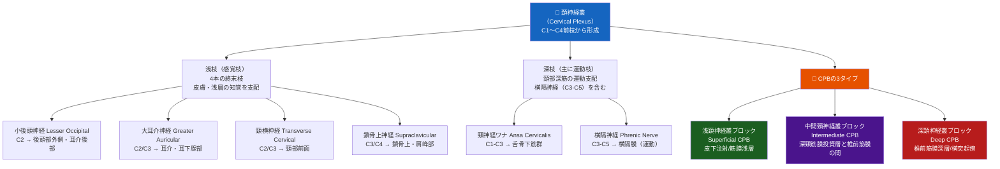

---

## 2. 解剖学的基礎 — 頚神経叢の構造

> 🎯 **初学者へのポイント**：CPBを安全に習得するには、胸鎖乳突筋（SCM）の後縁と頸部筋膜の層構造を体系的に理解することが最重要です。

### 2-1. 頚神経叢の形成

| 構成要素 | 内容 |
|----------|------|
| **起源** | C1〜C4脊髄神経の**腹側一次枝（前枝）** |
| **感覚ブロックの主標的** | **C2〜C4**（浅枝4本）|
| **出現部位** | SCM後縁中点、甲状軟骨切痕レベル |
| **超音波での外観** | 低エコーの卵形構造の集合体（ハニカム様）|

### 2-2. 4本の浅枝（感覚枝）の支配域

| 神経名 | 起源 | 支配域 | 臨床的重要性 |
|--------|------|--------|------------|
| **小後頭神経（Lesser Occipital N.）** | C2腹側枝 | 後頭部外側・耳介後部 | 乳様突起周囲手術 |
| **大耳介神経（Greater Auricular N.）** | C2/C3腹側枝 | 耳介全体・耳下腺部・顎角下方 | 耳介・耳下腺手術 |
| **頸横神経（Transverse Cervical N.）** | C2/C3腹側枝 | 頸部前面の皮膚 | 頸部前面手術 |
| **鎖骨上神経（Supraclavicular N.）** | C3/C4腹側枝 | 鎖骨上・肩峰・上腕近位部皮膚 | 鎖骨手術・肩関節手術補助 |

> ⚠️ これら4本はすべて**SCM後縁の中点**付近から皮下に出現します。この部位がランドマーク法の注射点となります。

### 2-3. 神経の走行

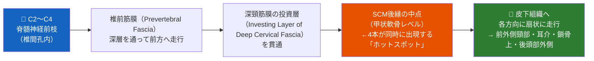

---

## 3. 頸部筋膜の層構造（最重要コンセプト）

> ⚠️ **これが最重要です**：CPBの3タイプ（浅・中間・深）は、それぞれ異なる筋膜層を標的とします。この概念を理解しないと3つのブロックの違いが把握できません。

### 3-1. 頸部筋膜の3層と各ブロックの標的

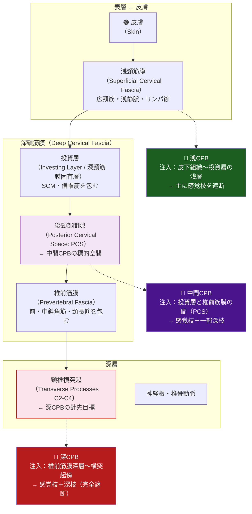

### 3-2. 3タイプの比較一覧

| 比較項目 | 浅CPB（Superficial） | 中間CPB（Intermediate） | 深CPB（Deep） |
|---------|---------------------|----------------------|--------------|
| **注入標的** | 皮下組織〜投資層の外側 | 投資層と椎前筋膜の間 | 椎前筋膜深層（横突起傍） |
| **遮断できる枝** | 感覚枝（4枝）のみ | 感覚枝＋一部深枝 | 感覚枝＋深枝（完全） |
| **運動ブロック** | なし | 最小限 | あり（横隔神経・深枝） |
| **技術的難易度** | 易（★☆☆）| 中（★★☆）| 難（★★★）|
| **合併症リスク** | 低 | 中〜低 | 高 |
| **超音波の必要性** | 推奨（安全性向上）| 強く推奨 | 必須 |
| **CEA麻酔への適用** | 単独では不完全な場合あり | 補助として有効 | 従来から使用 |
| **甲状腺手術への適用** | 両側で有効 ✅ | 単側で有効 ✅ | 通常は不要 |
| **横隔膜麻痺リスク** | 極めて低い | 低〜中（濃度依存）| 高（約50-80%）|

> 📌 **BJA Education 2023（Jarvis et al.）の重要なメッセージ**：中間CPBは浅CPBの鎮痛効果を保ちながら、深CPBのリスク（横隔膜麻痺・反回喉頭神経ブロック・高位脊髄麻酔）を回避できる「折衷案」として、多くの術式で深CPBの代替となり得る。

---

## 4. ブロックの3分類と局所麻酔薬の注入部位

### 4-1. 注入部位の断面イメージ（C4レベル横断面）

| 位置関係 | 構造物 |
|---------|--------|
| 最表層（外側から） | 皮膚 → 皮下組織 → 広頸筋 |
| ① 浅CPBの標的 | SCM後縁付近の皮下組織（投資層の外） |
| SCMの厚さ | 約1〜2 cm |
| ② 中間CPBの標的 | SCMと椎前筋膜の間の後頸部間隙（PCS） |
| 椎前筋膜 | 前斜角筋・頸長筋を包む強靭な筋膜 |
| ③ 深CPBの標的 | 椎前筋膜深層（横突起の前外側）|
| 最深部 | 頸椎横突起・椎骨動脈（横突孔内）|

---

## 5. 適応症とエビデンスグレード

### 5-1. 適応症一覧

| 術式・処置 | 推奨ブロックタイプ | エビデンスグレード |
|-----------|----------------|----------------|
| **頸動脈内膜切除術（CEA）** | 浅CPB＋中間CPB または 浅＋深CPB | **[Grade A]** — GALA Trial（Lancet 2008）|
| **甲状腺・副甲状腺手術** | 両側浅CPBまたは両側中間CPB | **[Grade A]** — SR/MA（BJA 2018; Indian J Anaesth 2023）|
| **頸部リンパ節郭清術** | 浅CPB ± 深CPB | **[Grade B]** — 複数のRCT |
| **鎖骨骨折・鎖骨手術** | 浅CPB ± 鎖骨胸筋筋膜面ブロック | **[Grade B]** — RCT 2023-2025 |
| **後頭下開頭術（慢性術後疼痛予防）** | 浅CPB（術前） | **[Grade A]** — RCT（Anesthesiology 2025; n=292）|
| **頸部表在手術（リンパ節生検等）** | 浅CPB | **[Grade B]** — 観察研究多数 |
| **耳介・外耳道手術** | 浅CPB | **[Grade B]** — 症例シリーズ |
| **肩関節手術（補助）** | 浅CPB ± 斜角筋間ブロック | **[Grade B]** — 観察研究 |
| **内頸静脈CVCカテーテル挿入（救急）** | 浅CPB | **[Grade C]** — 症例シリーズ |
| **顎口腔外科手術** | 浅CPB ± 局所浸潤麻酔 | **[Grade C]** — Frontiers Oncol 2024 |
| **頸原性頭痛（診断・治療）** | 深CPB（診断的ブロック） | **[Grade C]** — 症例シリーズ |

### 5-2. 患者選択フローチャート

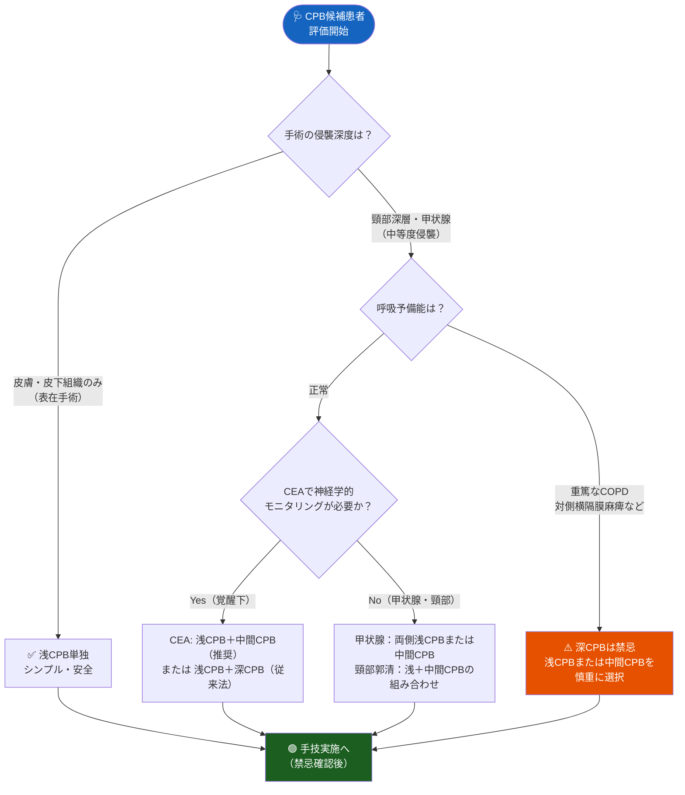

---

## 6. 禁忌と注意事項

### 6-1. 絶対禁忌

| 禁忌事項 | 理由 |
|----------|------|
| **患者の同意が得られない** | 倫理的・法的義務 |
| **注射部位の局所感染** | 感染播種・深部感染のリスク |
| **局所麻酔薬（アミド系・エステル系）アレルギーの既往** | アナフィラキシーショック |
| **対側横隔膜麻痺（深CPBの場合）** | 両側横隔膜麻痺 → 呼吸停止 |

### 6-2. 相対禁忌（特に深CPBで問題となる）

| 条件 | リスク | 対応 |
|------|--------|------|
| 重篤なCOPD（FEV1 < 1.0 L） | 片側横隔膜麻痺でも呼吸不全悪化 | 浅CPBに切り替え、または全身麻酔を選択 |
| 頸部手術既往・頸部放射線照射歴 | 解剖構造の変化により合併症リスク増大 | 超音波ガイド下で慎重に判断 |
| 重篤な凝固障害（INR > 1.5） | 血腫による気道圧迫リスク | 凝固能改善後に実施 |
| 対側声帯麻痺の既往 | 反回喉頭神経ブロックで気道確保困難 | 耳鼻咽喉科評価後に判断 |
| 妊娠（特に第1三半期） | 局所麻酔薬の胎児への影響 | リスクベネフィットを慎重に評価 |
| 未治療の対側気胸 | 同側横隔膜麻痺 → 換気不全 | 気胸治療後に実施 |

> ⚠️ **注意**：最近の前向き研究では、浅CPBでの横隔膜麻痺リスクは従来考えられていたより低いことが示唆されています。ただし、深CPBでは依然としてリスクが有意に高い点に注意してください。

---

## 7. 必要物品

### 7-1. 標準物品チェックリスト

| カテゴリー | 必要物品 | 仕様 |
|-----------|---------|------|
| **穿刺針** | 25G短斜面針（浅CPB）| 長さ 25 mm |
| **穿刺針** | 22G針（深CPB/中間CPB）| 長さ 50〜75 mm |
| **局所麻酔薬** | ロピバカイン0.5%、ブピバカイン0.25〜0.5%、リドカイン1〜2% | 用量は次節参照 |
| **注射器** | 10 mL または 20 mL | ルアーロック型推奨 |
| **超音波機器** | 高周波リニアプローブ（10〜15 MHz）| 浅CPBに最適 |
| **皮膚消毒薬** | クロルヘキシジンアルコール | ポビドンヨードも可 |
| **滅菌手袋・ドレープ** | 標準的無菌操作に準じる | — |
| **緊急薬品** | 20%脂肪乳剤（LAST対応）・エピネフリン | 必須 |
| **モニタリング** | パルスオキシメーター・心電図・血圧計 | 施術前から装着 |

---

## 8. 手技①：浅頚神経叢ブロック（ランドマーク法）

> ⚠️ 以下は教育目的の解説です。実際の施術は専門トレーニングを受けた医師のみが実施できます。

### 8-1. ランドマークの同定と手順

**ステップ 1：ランドマークのマーキング**

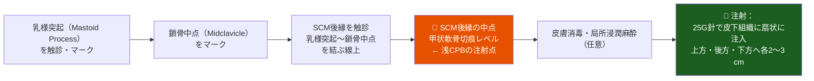

**ステップ 2：「ニードルファニング」技術**

1. 針の刺入点：SCM後縁の中点
2. 皮膚を穿刺後、皮下組織に針先を到達させる
3. 上方（頭側）・後方（背側）・下方（尾側）へ針を扇状に再刺入
4. 各方向に 2〜3 mL ずつ局所麻酔薬を注入（**総量 10〜15 mL**）
5. 注入前に必ず**逆吸引（Aspiration test）**を実施

> 📌 **ポイント**：SCM後縁の皮下組織に「ソーセージ状」に局所麻酔薬が広がるイメージで注入します。

### 8-2. ランドマーク法の注射点（深CPBとの比較）

| 解剖学的指標 | 浅CPB注射点 | 深CPB注射点 |
|------------|------------|------------|
| **乳様突起** | 参照点 | 基準点（上端）|
| **シャセニャック結節（C6前結節）** | 参照点 | 基準点（下端）|
| **C2横突起** | — | 乳様突起から2 cm下 |
| **C3横突起** | — | 乳様突起から4 cm下 |
| **C4横突起** | — | 乳様突起から6 cm下 |
| **注射の深さ** | 皮下（数mm〜1 cm） | 2〜3 cm（横突起に触れるまで）|

---

## 9. 手技②：浅頚神経叢ブロック（超音波ガイド下）

超音波ガイド下法は血管誤穿刺を回避し、薬液の拡散をリアルタイムで確認できるため、ランドマーク法よりも安全で確実です。

### 9-1. 超音波ガイド下浅CPBのステップ

| ステップ | 操作 | ポイント |
|---------|------|---------|
| 1. プローブ設置 | 高周波リニアプローブ（10〜15 MHz）をSCM後縁・C4レベルに横断位で置く | ゲル少量使用 |
| 2. 解剖構造同定 | SCM、肩甲挙筋（Levator Scapulae）、内頸静脈・総頸動脈、頸神経叢（ハニカム状低エコー）を確認 | 神経はSCM後縁深部に見える |
| 3. カラードプラ | 頸動脈・内頸静脈・外頸静脈を確認・回避 | 誤穿刺防止 |
| 4. 針の刺入 | 平面内（in-plane）アプローチで外側から内側へ | 針先を常に可視化 |
| 5. 薬液確認 | 1〜2 mL注入して薬液拡散をリアルタイムで確認（ハイドロダイセクション）| SCMと椎前筋膜の間に広がるか確認 |
| 6. 全量注入 | 10 mLを2 mLずつ分割投与 | 最終的にSCM深面に「ソーセージ状」に広がることを確認 |

### 9-2. 超音波で確認すべき解剖構造（C4レベル横断面）

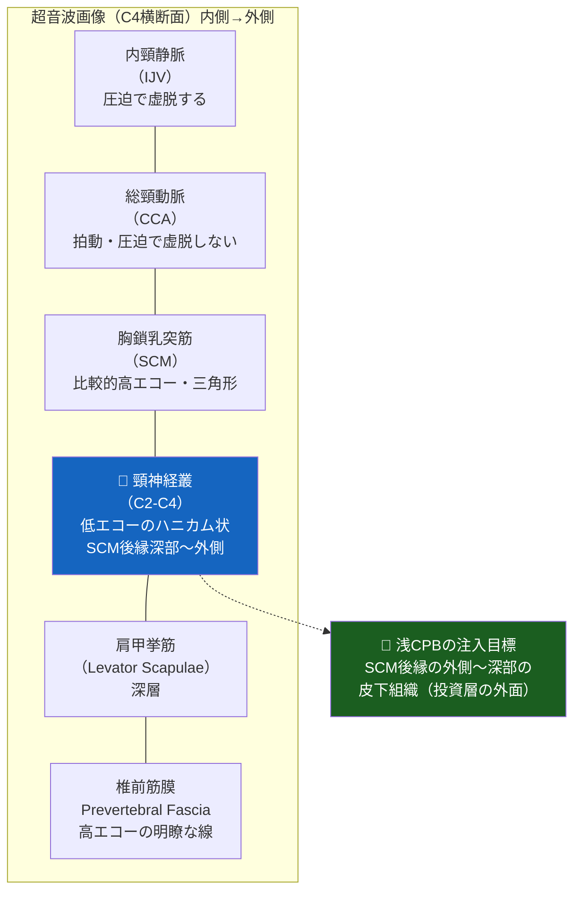

---

## 10. 手技③：中間頚神経叢ブロック（超音波ガイド下）

### 10-1. 概要と位置づけ

中間CPBは、2004年に導入された比較的新しいアプローチです。浅CPBより効果が強く、深CPBより安全で、現在多くの術式（特に甲状腺手術・CEA）で推奨されています。

> 📌 **BJA Education 2023（Jarvis et al.）**は、中間CPBを「多くの適応でリスクとベネフィットの最適なバランスを達成できる手技」として位置づけています。

### 10-2. 手順

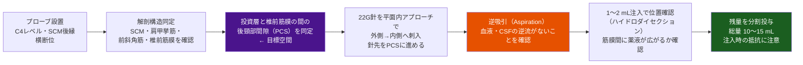

**超音波所見のポイント**：
- 投資層（高エコーの明瞭な筋膜線）とSCMの深面を確認
- 椎前筋膜（前斜角筋の浅面に位置する高エコーの筋膜）を確認
- 薬液が両筋膜の間を「はがす」ように広がれば正しい位置

---

## 11. 手技④：深頚神経叢ブロック（ランドマーク法）

> ⚠️ **重要な安全警告**：深CPBのランドマーク（盲目的）法は、高位脊髄麻酔・椎骨動脈内注入などの重篤な合併症リスクが有意に高い（OR 2.13、Pandit et al., 2007）。**超音波ガイド下法が強く推奨**されます。ランドマーク法は学習目的の理解にとどめることを推奨します。

### 11-1. ランドマークの同定（3点法）

**2点のランドマーク**：
1. **乳様突起（Mastoid Process; MP）**：耳後方の骨性突起
2. **シャセニャック結節（Chassaignac's Tubercle）**：C6前結節、輪状軟骨直下・SCM鎖骨頭の内側で触知可能

**マーキングラインとC2-C4注射点**：

| 注射点 | 位置 | 深さの目安 |
|--------|------|-----------|
| **C2** | 乳様突起から尾側 2 cm（MP-C6ライン上）| 1.5〜3 cm |
| **C3** | 乳様突起から尾側 4 cm | 2〜3 cm |
| **C4** | 乳様突起から尾側 6 cm（シャセニャック結節の近傍）| 2〜3 cm |

### 11-2. 注射手順（各レベル）

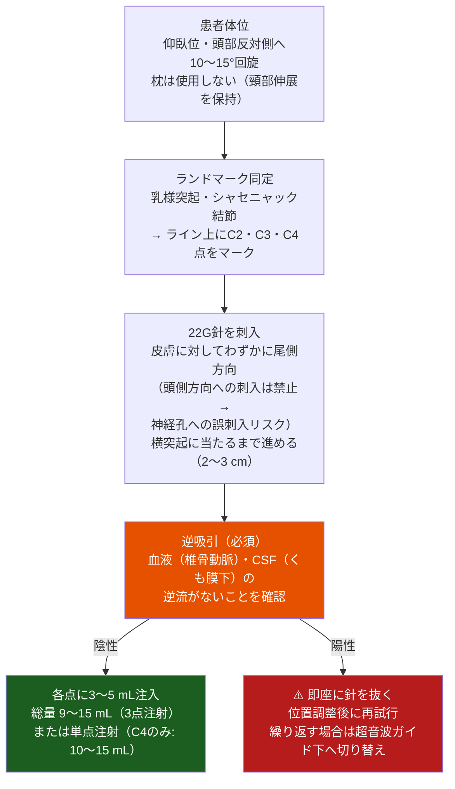

---

## 12. 手技⑤：深頚神経叢ブロック（超音波ガイド下）

超音波ガイド下では、血管・神経・筋膜層をリアルタイムで可視化しながら安全に実施できます。

### 12-1. 超音波下深CPBの特徴

| 確認すべき構造 | 超音波での外観 | 目的 |
|-------------|-------------|------|
| 椎骨動脈（Vertebral Artery） | C6では横突孔内（保護される）；C5以上では横突孔外に出ることがある | **回避**（椎骨動脈内注入→全身痙攣） |
| 総頸動脈 | 拍動性・圧迫で虚脱しない円形高エコー | **回避** |
| 頸椎横突起 | 高エコーの骨性輝点（後方音響陰影） | **目標**（針先を横突起の前外側に置く）|
| 椎前筋膜 | 高エコーの薄い筋膜線 | **目標**（この深層に注入） |
| 頸神経根 | 横突孔内の低エコー構造 | 確認・回避 |

### 12-2. 超音波ガイド下深CPBのステップ

| ステップ | 操作 |
|---------|------|
| 1. プローブ設置 | 高周波リニアプローブをC4レベルに短軸横断位で置く |
| 2. 横突起の同定 | 横突起の前後結節（二又状の高エコー）を確認。C6では前結節が大きく、これがシャセニャック結節 |
| 3. C4レベルの確認 | C4横突起は前結節のみ（後結節なし）が特徴。これを指標に椎体レベルを確認 |
| 4. 針の刺入 | 22G針を平面内（in-plane）アプローチで外側から内側へ。針先を横突起の前結節から外側〜前外側へ進める |
| 5. 注射点の確認 | 椎前筋膜の深面（前長筋/頸長筋の外側面）に針先が位置することを確認 |
| 6. 逆吸引・注入 | 逆吸引陰性確認後、各レベルに3〜5 mLを注入 |

---

## 13. 局所麻酔薬の選択と用量

### 13-1. 薬剤選択の原則

| 薬剤 | 濃度 | 持続時間 | 特徴 | 推奨適応 |
|------|------|---------|------|---------|
| **ロピバカイン（Ropivacaine）** | 0.5% | 4〜8時間 | 運動ブロックが少ない・心毒性が低い | 第一選択（特に浅・中間CPB）|
| **ブピバカイン（Bupivacaine）** | 0.25〜0.5% | 4〜12時間 | 長時間効果 | 長時間手術・術後鎮痛重視の場合 |
| **リドカイン（Lidocaine）** | 1〜2% | 1〜3時間 | 速効性・短時間 | 短時間処置・診断的ブロック |
| **組み合わせ（CEA等）** | 2%リドカイン＋0.5%ブピバカイン混合 | 中間〜長時間 | 速効性と持続性の両立 | 覚醒下CEA |

### 13-2. ブロックタイプ別推奨用量

| ブロックタイプ | 推奨薬剤 | 推奨容量 | 最大容量 |
|-------------|---------|---------|---------|
| 浅CPB（片側） | 0.5%ロピバカイン | 10〜15 mL | 20 mL |
| 浅CPB（両側・甲状腺） | 0.25%ブピバカイン または 0.5%ロピバカイン | 各10 mL | 各15 mL |
| 中間CPB（片側） | 0.5%ロピバカイン | 10〜15 mL | 20 mL |
| 深CPB（3点注射 C2-C4） | 0.5%ブピバカイン | 各3〜5 mL（計9〜15 mL）| 計20 mL |
| 深CPB（単点注射 C4）| 0.5%ロピバカイン | 10〜15 mL | 20 mL |

> ⚠️ **注意**：両側ブロックでは局所麻酔薬の総量が最大許容量を超えないよう必ず計算してください。ロピバカインの最大許容量は**3 mg/kg**（体重60 kgの場合、0.5%ロピバカインで最大36 mL）です。

### 13-3. デクスメデトミジン添加の証拠

> 📌 **RCT（Cairo University 2022〜2024; NCT05814744）**：中間CPBにデクスメデトミジン0.5 μg/kgを添加すると、鎮痛持続時間が延長し、術後オピオイド消費量が有意に減少することが示されています。ただし、低血圧・徐脈に注意が必要です。

---

## 14. 合併症と安全管理

### 14-1. 浅CPBの合併症プロファイル

浅CPBは一般的に安全性が高く、重篤な合併症はまれです。

| 合併症 | 頻度 | 予防策 |
|-------|------|--------|
| 注入部位の疼痛・内出血 | 一般的 | 細針使用・圧迫止血 |
| 迷走神経反射（血管迷走神経性失神） | まれ | 仰臥位で実施・経過観察 |
| 外頸静脈への誤穿刺 | まれ | 超音波ガイドで回避 |
| 局所麻酔薬全身毒性（LAST） | 極めてまれ | 逆吸引・分割投与・総量管理 |

### 14-2. 深CPBの合併症プロファイル（特に注意が必要）

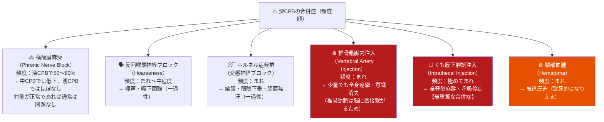

### 14-3. 系統的レビューによる合併症比較（最重要データ）

> 📌 **Pandit et al. (2007, Br J Anaesth)**の系統的レビュー（69論文、7,558件の深/複合ブロック vs 2,533件の浅/中間ブロック）：
>
> **深/複合ブロックは針関連の重篤な合併症率が浅/中間ブロックより有意に高い（OR 2.13, p=0.006）**

| 比較項目 | 深/複合CPB | 浅/中間CPB | p値 |
|---------|------------|------------|-----|
| 針関連重篤合併症 | 高い | 低い | **p=0.006**（OR 2.13）|
| 全身麻酔への変更率 | 低い（REAが良い）| 同等 | NS |
| 術中合併症（脳梗塞・心筋梗塞・死亡）| 有意差なし | 有意差なし | NS |

### 14-4. LASTs（局所麻酔薬全身毒性）への対応

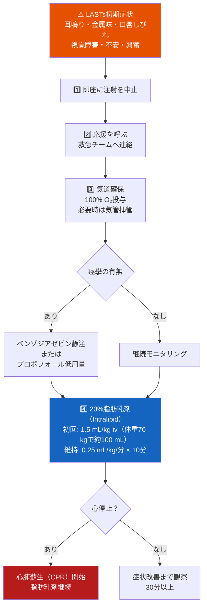

---

## 15. 臨床適応別エビデンスレビュー

### 15-1. 頸動脈内膜切除術（CEA）

CEAはCPBが最も古くから使用されてきた術式です。局所麻酔下の最大の利点は、**覚醒下での脳神経学的モニタリング**が可能な点です。

| 研究 | デザイン | 主な結果 |
|------|---------|---------|
| **GALAトライアル（Lancet 2008）** | 多施設RCT（24カ国95施設、n=3,526）| 全身麻酔 vs 局所麻酔で30日脳卒中・心筋梗塞・死亡率に有意差なし。局所麻酔では**シャント使用率が有意に低下**（14% vs 43%）|
| Pandit et al. (2007, BJA) | SR（69論文、計10,091件）| 深CPBは浅/中間CPBより針関連重篤合併症が高い（OR 2.13, p=0.006）|
| Turhan et al. (BMC Anesthesiol 2025) | RCT（中間 vs 深CPB for CEA）| 中間CPBは深CPBと同等の麻酔効果を提供し、合併症が少ない |
| Jarvis et al. (BJA Educ 2023) | Review | 中間CPBはCEA・甲状腺手術で深CPBの代替として推奨 |

**CEAにおけるブロック選択の推奨**：

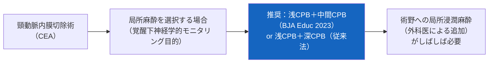

### 15-2. 甲状腺・副甲状腺手術

| 研究 | デザイン | 主な結果 | エビデンスグレード |
|------|---------|---------|----------------|
| **Mayhew et al. (BJA 2018)** | SR/MA | 両側浅CPBにより、術後モルヒネ消費量が有意に減少（加重平均差: -5.1 mg、95%CI: -8.1〜-2.1）| **[Grade A]** |
| **Wilson et al. (Indian J Anaesth 2023)** | SR/MA | 両側浅CPBが甲状腺手術後の急性期痛を有意に軽減（VAS有意改善）| **[Grade A]** |
| Han et al. (J Pain Res 2022) | RCT | 中間CPBにより横隔膜麻痺が認められたが、高濃度ロピバカイン使用時にリスク増加（濃度依存性）| **[Grade B]** |

**甲状腺手術での臨床的推奨**：
- **両側浅CPBまたは両側中間CPB**が推奨
- 術後オピオイド使用量削減・早期回復に有効
- 高リスク患者（高齢・呼吸機能低下）では浅CPBが安全

### 15-3. 後頭下開頭術後慢性疼痛（2025年最新エビデンス）

> 📌 **Anesthesiology 2025（多施設RCT, n=292）**：後頭下開頭術を受ける患者に術前超音波ガイド下浅CPB（0.5%ロピバカイン）を実施すると、**3カ月後の慢性術後疼痛の発生率がプラセボと比較して約1/3に減少**（軽度〜中等度慢性痛の発生率有意低下）。急性期鎮痛効果は小さかったが、慢性疼痛予防効果が明確に示された。これは術前浅CPBによる**術後慢性疼痛の予防（Pre-emptive blockade）**を支持する初の大規模RCT証拠です。

**エビデンスグレード**：**[Grade A]**（2025年更新）

### 15-4. 鎖骨手術

| 研究 | デザイン | 結果 | エビデンスグレード |
|------|---------|------|----------------|
| Xu et al. (J Clin Monit Comput 2023) | RCT | 浅CPB＋鎖骨胸筋筋膜面ブロック vs 浅CPB＋斜角筋間ブロック：前者がより良好な鎮痛と上肢機能保持 | **[Grade B]** |
| Zhuo et al. (Anesth Analg 2022) | RCT | 中間CPB＋鎖骨胸筋筋膜面ブロックが鎖骨骨幹骨折手術の麻酔として有効 | **[Grade B]** |

---

## 16. アウトカム評価指標

### 16-1. 推奨評価ツール

| ツール | 評価内容 | 評価タイミング |
|--------|---------|-------------|
| **VAS / NRS（0〜10）** | 痛みの強度 | 注入前・注入30分後・術後2h・術後24h |
| **ブロック成功の確認** | 麻酔域内の感覚テスト（冷覚テスト等）| 注入15〜30分後 |
| **横隔膜機能評価（深CPBの場合）** | 超音波での横隔膜呼吸移動の確認 | 注入後15〜30分 |
| **HIT-6・MIDAS** | 慢性頭痛評価（頸神経起源頭痛の場合）| 3ヶ月後 |
| **術後オピオイド消費量** | 鎮痛効果の客観的指標 | 術後24〜48時間 |
| **PGIC（患者全般印象変化）** | 患者の主観的改善感（7点尺度）| 術後4〜6週後 |

### 16-2. ブロック成功の確認基準

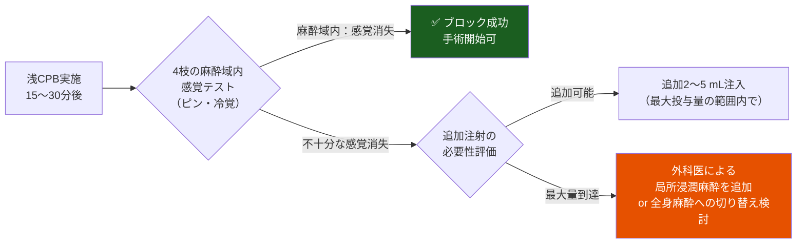

---

## 17. 参考文献・公式リソース

### 17-1. 主要な一次文献

| 著者・年 | タイトル | 雑誌 | URL / DOI |
|---------|---------|------|----------|
| **Hipskind JE et al. (2024)** | Cervical Plexus Block *(StatPearls, Updated Mar 2024)* | StatPearls Publishing | [https://www.ncbi.nlm.nih.gov/books/NBK557382/](https://www.ncbi.nlm.nih.gov/books/NBK557382/) |
| **Kim JS et al. (2018)** | Cervical plexus block *(Korean J Anesthesiol 71(4):274-288)* | Korean J Anesthesiol | [https://pmc.ncbi.nlm.nih.gov/articles/PMC6078883/](https://pmc.ncbi.nlm.nih.gov/articles/PMC6078883/) |
| **Pandit JJ et al. (2007)** | Superficial or deep cervical plexus block for carotid endarterectomy: a systematic review of complications *(BJA 99:159-169)* | Br J Anaesth | [https://pubmed.ncbi.nlm.nih.gov/17576970/](https://pubmed.ncbi.nlm.nih.gov/17576970/) |
| **GALA Collaborative (2008)** | General anaesthesia versus local anaesthesia for carotid surgery (GALA): a multicentre, randomised controlled trial *(Lancet 372:2132-42)* | The Lancet | [https://www.thelancet.com/journals/lancet/article/PIIS0140-6736(08)61699-2/abstract](https://www.thelancet.com/journals/lancet/article/PIIS0140-6736(08)61699-2/abstract) |
| **Mayhew D et al. (2018)** | Analgesic efficacy of bilateral superficial cervical plexus block for thyroid surgery: a meta-analysis and systematic review *(BJA 120:241-251)* | Br J Anaesth | [https://www.bjanaesthesia.org/article/S0007-0912(17)54053-1/fulltext](https://www.bjanaesthesia.org/article/S0007-0912(17)54053-1/fulltext) |
| **Wilson L et al. (2023)** | The analgesic effects of bilateral superficial cervical plexus block in thyroid surgery: A systematic review and Meta-Analysis *(Indian J Anaesth 67:579-89)* | Indian J Anaesth | [https://pmc.ncbi.nlm.nih.gov/articles/PMC10436725/](https://pmc.ncbi.nlm.nih.gov/articles/PMC10436725/) |
| **Jarvis T et al. (2023)** | The cervical plexus *(BJA Education)* | BJA Education | [https://www.bjaed.org/article/S2058-5349(22)00151-2/fulltext](https://www.bjaed.org/article/S2058-5349(22)00151-2/fulltext) |
| **Turhan Ö et al. (2025)** | Ultrasound-guided intermediate versus deep cervical plexus block for carotid endarterectomy: a randomized controlled study *(BMC Anesthesiol 25:581)* | BMC Anesthesiol | [https://link.springer.com/article/10.1186/s12871-024-02674-8](https://link.springer.com/article/10.1186/s12871-024-02674-8) |

### 17-2. 国際ガイドライン・標準テキスト

| 機関・資料 | 内容 | URL |
|-----------|------|-----|
| **NYSORA（New York School of Regional Anesthesia）** | 頚神経叢ブロック：ランドマーク法（詳細手技）| [https://www.nysora.com/techniques/head-and-neck-blocks/cervical/cervical-plexus-block/](https://www.nysora.com/techniques/head-and-neck-blocks/cervical/cervical-plexus-block/) |
| **NYSORA** | 超音波ガイド下頚神経叢ブロック | [https://www.nysora.com/techniques/head-and-neck-blocks/cervical/ultrasound-guided-cervical-plexus-block/](https://www.nysora.com/techniques/head-and-neck-blocks/cervical/ultrasound-guided-cervical-plexus-block/) |
| **NYSORA（日本語版）** | 頚神経叢を理解する：解剖学・ブロック・臨床的関連性 | [https://www.nysora.com/ja/教育ニュース/頚神経叢ブロックのヒント/](https://www.nysora.com/ja/%E6%95%99%E8%82%B2%E3%83%8B%E3%83%A5%E3%83%BC%E3%82%B9/%E9%A0%B8%E7%A5%9E%E7%B5%8C%E5%8F%A2%E3%83%96%E3%83%AD%E3%83%83%E3%82%AF%E3%81%AE%E3%83%92%E3%83%B3%E3%83%88-2/) |
| **ACEP（American College of Emergency Physicians）** | Ultrasound-Guided Superficial Cervical Plexus Block | [https://www.acep.org/emultrasound/newsroom/september-2022/ultrasound-guided-superficial-cervical-plexus-block](https://www.acep.org/emultrasound/newsroom/september-2022/ultrasound-guided-superficial-cervical-plexus-block) |
| **日本区域麻酔学会** | ブロック用語推薦リスト | [https://www.regional-anesth.jp/education/terminology.html](https://www.regional-anesth.jp/education/terminology.html) |
| **日本ペインクリニック学会 指針** | ペインクリニック治療指針（神経ブロック総論）| [https://www.jspc.gr.jp/Contents/public/pdf/shishin/6-7.pdf](https://www.jspc.gr.jp/Contents/public/pdf/shishin/6-7.pdf) |
| **PubMed（頚神経叢ブロックRCT検索）** | 最新RCT・メタ解析検索 | [https://pubmed.ncbi.nlm.nih.gov/?term=cervical+plexus+block&filter=pubt.clinicaltrial](https://pubmed.ncbi.nlm.nih.gov/?term=cervical+plexus+block&filter=pubt.clinicaltrial) |
| **ClinicalTrials.gov** | 進行中・完了試験の確認 | [https://clinicaltrials.gov/search?cond=cervical+plexus+block](https://clinicaltrials.gov/search?cond=cervical+plexus+block) |

---

## 🔑 初学者が押さえるべき10のポイント

| # | ポイント |
|---|---------|
| 1 | CPBには浅・中間・深の**3層**がある。それぞれが異なる筋膜層を標的にしており、効果と合併症リスクが異なる |
| 2 | 浅枝4本（小後頭神経・大耳介神経・頸横神経・鎖骨上神経）は**SCM後縁中点付近**から一斉に皮下に出現する |
| 3 | **浅CPBが最もシンプルで安全**。多くの表在頸部手術・甲状腺手術に十分な鎮痛を提供できる |
| 4 | **中間CPBは深CPBの代替**として多くの場面で有効（BJA Education 2023）。合併症リスクが深CPBより低い |
| 5 | **深CPBは針関連重篤合併症リスクが浅/中間CPBの2倍以上**（OR 2.13, Pandit 2007）。必ず超音波ガイド下で実施 |
| 6 | **逆吸引（Aspiration test）は毎回必須**。特に深CPBでは椎骨動脈・くも膜下腔への誤注入リスクがある |
| 7 | **局所麻酔薬の総量管理**は両側ブロック時に特に重要。最大許容量（ロピバカイン: 3 mg/kg）を計算してから実施 |
| 8 | GALAトライアルが示すように、**CEAにおける局所麻酔 vs 全身麻酔の30日アウトカムに有意差はない**。ただし局所麻酔ではシャント使用率が低下する |
| 9 | 術前の浅CPBは**後頭下開頭術後の慢性疼痛を1/3に減少**させる（Anesthesiology RCT 2025）。術後慢性疼痛予防への応用が期待される |
| 10 | CPBは全身麻酔の**代替**ではなく**補完**（多モーダル鎮痛の一部）として位置づける。必要時の全身麻酔への切り替え準備を常に整えておく |

---

*最終更新: 2025年6月（参考文献: StatPearls 2024年3月版, Kim et al. Korean J Anesthesiol 2018, BJA Education 2023 Jarvis et al., GALA Trial Lancet 2008, Pandit et al. BJA 2007, Anesthesiology 2025 RCT 含む）*

*本文書に含まれるすべての情報は学術目的のみ。臨床応用には必ず担当医師の判断を仰いでください。*
