# 🧠 星状神経節ブロック（Stellate Ganglion Block: SGB）
## 国際エビデンスに基づく包括的解説 — 初学者向けステップバイステップガイド

---

> ## ⚠️ 学術的免責事項（Academic Disclaimer）
>
> 本文書は**学術・教育・研究目的のみ**に作成されています。すべての臨床的判断は、有資格の医療専門家による個別評価のもとで行われなければなりません。本文書は医療診断・処方・個人への医療アドバイスを提供するものではありません。侵襲的処置である星状神経節ブロックは、適切なトレーニングを受けた医師によってのみ実施されるべきです。

---

## 目次

1. [概論：星状神経節ブロックとは](#1-概論)
2. [解剖学的基礎](#2-解剖学的基礎)
3. [作用機序](#3-作用機序)
4. [適応症とエビデンスグレード](#4-適応症とエビデンスグレード)
5. [禁忌と注意事項](#5-禁忌と注意事項)
6. [施術プロトコル：ステップバイステップ](#6-施術プロトコル)
7. [使用薬剤と用量](#7-使用薬剤と用量)
8. [ブロック成功の確認：ホルネル症候群](#8-ブロック成功の確認)
9. [合併症と安全管理](#9-合併症と安全管理)
10. [エビデンスサマリーと最新知見](#10-エビデンスサマリーと最新知見)
11. [参考文献・エビデンスソース](#11-参考文献)

---

## 1. 概論

### 1-1. 星状神経節ブロックとは

**星状神経節ブロック（Stellate Ganglion Block: SGB）** は、頸胸部交感神経節（星状神経節）の近傍に局所麻酔薬を注入することで、同側の交感神経活動を一時的に遮断する**低侵襲的な神経ブロック手技**です。

> 📌 「星状（stellate）」の語源はラテン語の *stella*（星）に由来し、この神経節の外観が星形であることから命名されました。

### 1-2. 歴史的背景

| 年代 | 出来事 |
|------|--------|
| 1920年代 | 交感神経ブロックとして臨床導入 |
| 1930〜1960年代 | 疼痛・血管障害への応用が広がる |
| 1990年代 | ホットフラッシュ（更年期症状）への適応拡大 |
| 2008年〜 | PTSD（心的外傷後ストレス障害）への適応が報告され始める |
| 2010年代 | 超音波ガイド下技術の普及により安全性が大幅向上 |
| 2020年代 | 不整脈（電気的嵐）・周術期合併症予防など新領域へのエビデンス蓄積が進む |

### 1-3. 全体像の把握

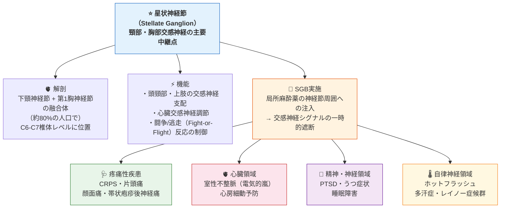

---

## 2. 解剖学的基礎

> 🎯 **初学者へのポイント**：SGBを安全に理解するには、まず星状神経節の位置と周辺構造を確実に把握することが最重要です。

### 2-1. 星状神経節の形成

**星状神経節（SG）** は、以下の2つの神経節が合体して形成されます。

| 構成要素 | 内容 |
|----------|------|
| **下頸神経節**（Inferior cervical ganglion） | 頸部交感神経幹の最下端 |
| **第1胸神経節**（First thoracic ganglion: T1） | 胸部交感神経幹の最上端 |
| **融合率** | 約**80%**の人で両者が融合してSGを形成；残り20%は独立して存在 |
| **大きさ** | 長径 約2.5 cm、幅 約1 cm（個人差大）|

> 📌 **重要な解剖学的注意点**：約20%の人では下頸神経節とT1神経節が融合せず独立して存在します。この場合、「星状神経節」という構造自体が存在せず、解剖学的変異として認識する必要があります。

### 2-2. 位置関係（Topographic Anatomy）

SGは以下の構造に囲まれた、手術的に危険な領域に位置します。

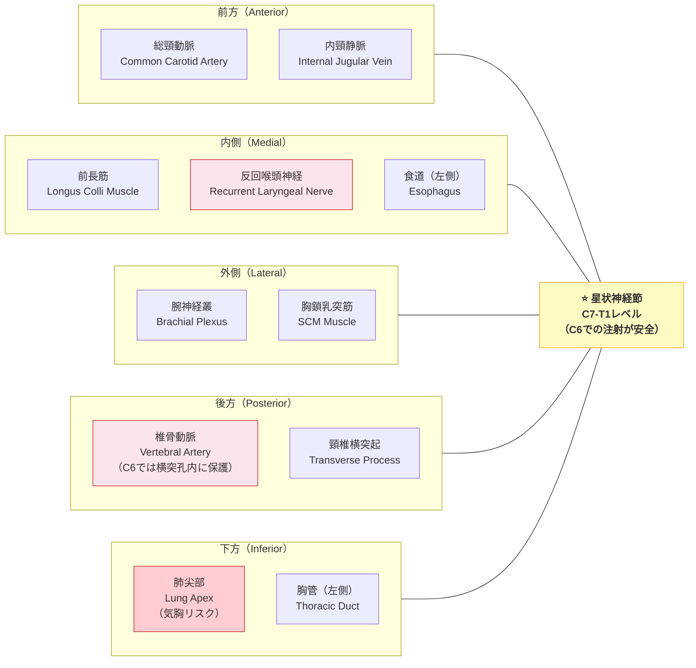

### 2-3. C6 vs C7：注射レベルの選択

| 項目 | **C6（シャセニャック結節）** | **C7レベル** |
|------|--------------------------|------------|
| 解剖学的目印 | 前結節（Chassaignac's tubercle）が触知可能 | 前結節が小さく触知困難 |
| 椎骨動脈 | 横突孔内に収まり保護される ✅ | 横突孔外に出る可能性 ⚠️ |
| 肺尖部との距離 | 比較的離れている ✅ | 近接する ⚠️ |
| 腕神経叢との距離 | 比較的離れている ✅ | 近接する ⚠️ |
| 真のSGへの到達 | 技術的にはSG本体（C7/T1）より上方 | SG本体により近い |
| 臨床的名称 | **頸部交感神経ブロック**（より正確） | 星状神経節ブロック（より直接的） |
| **推奨度** | **臨床上の第一選択** ✅ | 特殊なケースに限定 |

> 📌 **解剖学的補足**：厳密には、C6レベルに存在するのは星状神経節ではなく、そこを通過する交感神経線維（中頸神経節の一部）です。しかし局所麻酔薬の拡散により交感神経遮断効果が得られるため、臨床上「SGB」と呼ばれます。

### 2-4. 組織学的構造

| 構成成分 | 役割 |
|----------|------|
| 節後ニューロン（Postganglionic neurons） | 交感神経シグナルの最終共通経路 |
| 衛星グリア細胞（Satellite glial cells） | ニューロンの代謝サポート・シグナル調節 |
| SIF細胞（Small intensely fluorescent cells） | 神経節内伝達の調節 |
| 混合神経線維 | 節前・節後の軸索が混在 |

---

## 3. 作用機序

### 3-1. 基本的な交感神経遮断機序

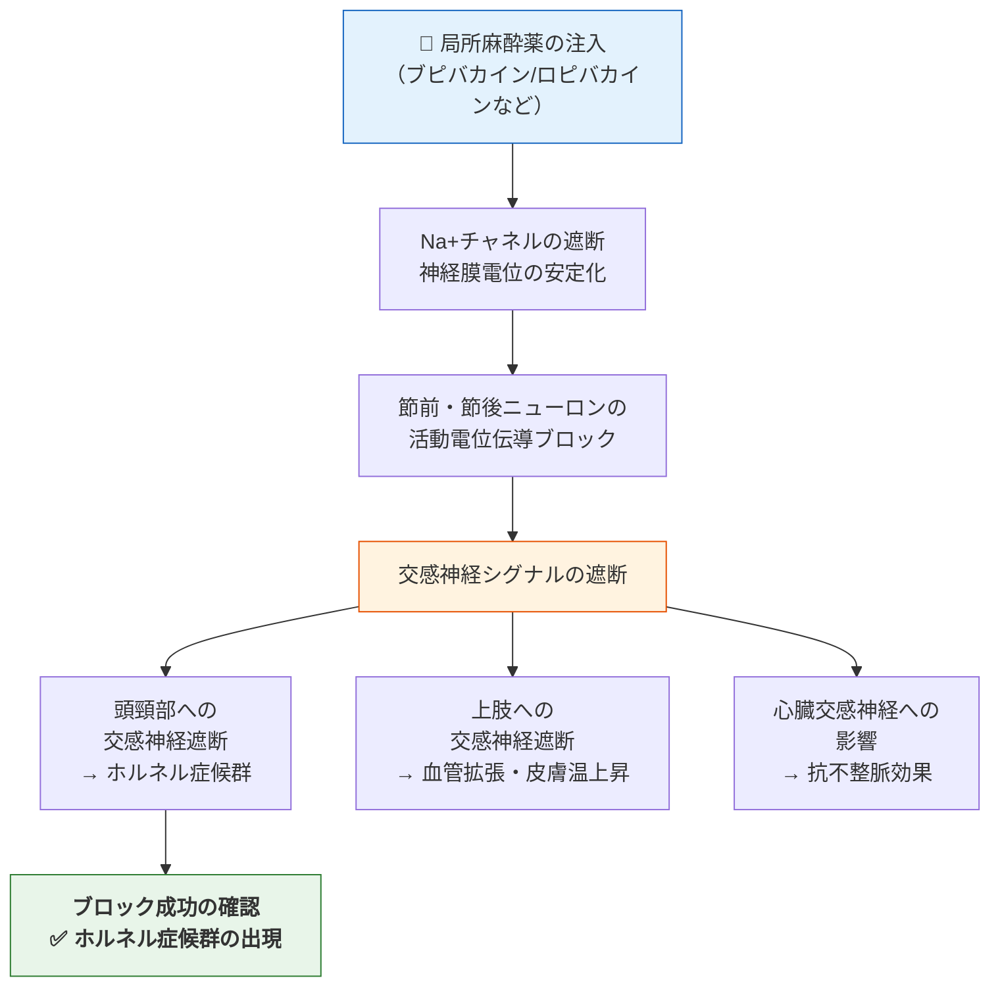

### 3-2. 延長効果の仮説的機序（NGF仮説）

局所麻酔薬の作用時間（数時間）を超えた持続効果を説明するため、以下の機序が提唱されています。

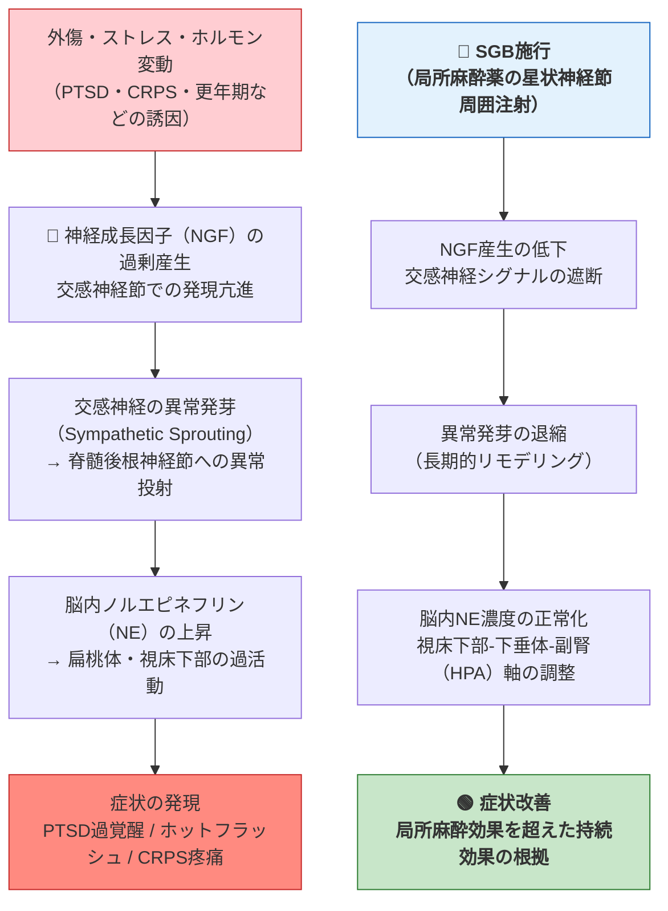

> ⚠️ **重要な注記**：この NGF 仮説は現在研究段階にあり、完全には解明されていません。PTSD への持続効果のメカニズムは「incomplete understanding（不完全な理解）」の状態です。

### 3-3. 心臓への作用機序（不整脈領域）

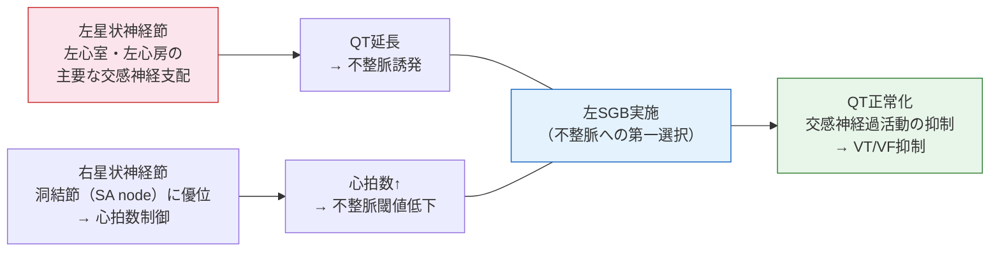

---

## 4. 適応症とエビデンスグレード

### 4-1. 適応症一覧

| 適応症 | エビデンスグレード | 推奨サイド | 主なエビデンス源 |
|--------|-----------------|----------|---------------|
| **複合性局所疼痛症候群（CRPS type I/II）** | Grade B | 患側 | 系統的レビュー複数 |
| **交感神経性維持疼痛** | Grade B | 患側 | RCT/観察研究 |
| **ホットフラッシュ（更年期・乳がん治療後）** | **Grade A** | 右側優先 | 複数RCT（Menopause誌） |
| **多汗症（上肢・頭部）** | Grade B | 患側 | 観察研究・症例集積 |
| **レイノー症候群** | Grade C | 患側 | 症例報告・小規模研究 |
| **帯状疱疹後神経痛（顔面・上肢）** | Grade B | 患側 | 複数RCT |
| **PTSD** | Grade B | 右側優先 | 複数RCT（Anesthesia & Analgesia誌等） |
| **室性不整脈・電気的嵐** | Grade B | 左側優先 | 多施設観察研究・STAR study (ESC) |
| **心房細動（周術期予防）** | Grade C | 左または右 | 単施設RCT複数 |
| **片頭痛・群発頭痛** | Grade C | 患側 | 小規模研究・症例集積 |
| **顔面非定型痛** | Grade C | 患側 | 症例報告・専門家コンセンサス |
| **急性感音性難聴** | Grade C | 患側 | 小規模RCT（日本・韓国） |
| **突発性難聴** | Grade C | 患側 | 症例集積・小規模研究 |
| **Bell麻痺** | Grade C | 患側 | 小規模RCT |
| **脳血管攣縮（くも膜下出血後）** | Grade C | 進行中RCT | NCT04691271（試験中） |

> 📌 **エビデンスグレード凡例**：
> - **Grade A** = 複数の高質なRCTまたはCochrane系統的レビュー
> - **Grade B** = 単数のRCTまたは複数の観察研究
> - **Grade C** = 小規模研究・症例報告・専門家コンセンサス

### 4-2. 適応選択フローチャート

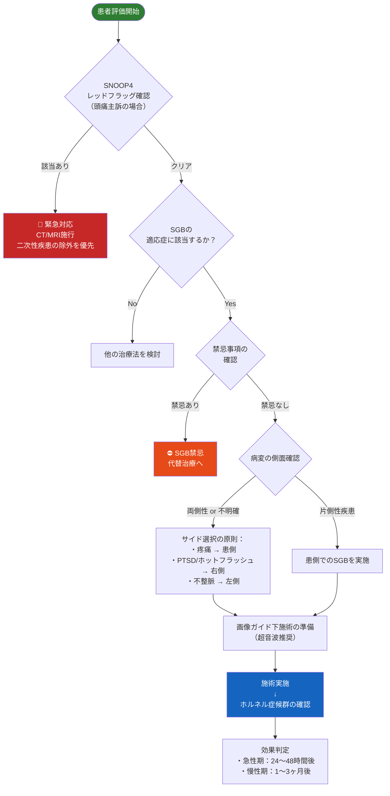

---

## 5. 禁忌と注意事項

### 5-1. 絶対禁忌

| 禁忌事項 | 理由 |
|----------|------|
| **対側SGBからの24時間以内の二度目の実施** | 両側の反回喉頭神経同時ブロック → 気道閉塞のリスク |
| **注射部位の局所感染** | 感染播種・化膿性神経炎のリスク |
| **重篤な出血傾向・抗凝固療法中（コントロール不良）** | 頸部血腫による気道圧迫のリスク |
| **局所麻酔薬アレルギーの既往** | アナフィラキシーショック |
| **患者の同意が得られない場合** | 倫理的・法的義務 |

### 5-2. 相対禁忌・慎重投与

| 条件 | 内容 | 対応 |
|------|------|------|
| 重篤な呼吸機能障害（FEV1 <1.0L） | 片側横隔膜神経ブロックでも呼吸不全悪化リスク | 事前に呼吸機能評価を実施 |
| 重篤な頸椎疾患・頸椎手術後 | 解剖構造の変化により合併症リスク増大 | 画像確認後に慎重に判断 |
| 高度不整脈（徐脈：HR <50 bpm） | 交感神経遮断により悪化の可能性 | 不整脈管理後に実施 |
| 妊娠（特に第1三半期） | 局所麻酔薬の胎児への影響 | リスクベネフィットを慎重に評価 |
| 血液凝固異常（INR >1.5、PT >1.5倍） | 血腫リスク | 凝固改善後に実施 |
| 対側声帯麻痺の既往 | 反回喉頭神経ブロックで気道確保が困難に | 耳鼻咽喉科評価後に判断 |

---

## 6. 施術プロトコル

> ⚠️ 以下は教育目的の概説です。実際の施術は専門的なトレーニングを受けた医師のみが実施できます。

### 6-1. 施術前の準備

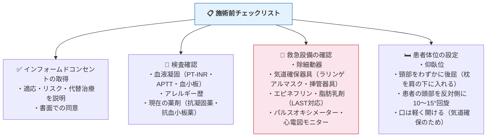

### 6-2. 超音波ガイド下施術の手順（C6レベル）

**ステップ 1：超音波プローブの設置と解剖構造の同定**

| 手順 | 詳細 |
|------|------|
| プローブ | **高周波リニアプローブ**（7〜15 MHz） |
| 設置部位 | 輪状軟骨（甲状腺下方）の高さ、胸鎖乳突筋の内側縁 |
| 確認構造 | 頸動脈（CA）、内頸静脈（IJV）、甲状腺、前長筋（LC）、C6横突起前結節 |
| ターゲット | **前長筋（longus colli）の腹側表面と椎前筋膜の間** |

**ステップ 2：皮膚消毒と局所麻酔**

| 手順 | 詳細 |
|------|------|
| 皮膚消毒 | ポビドンヨードまたはクロルヘキシジンアルコール |
| 局所麻酔 | 皮膚・皮下組織への1〜2% リドカイン 0.5〜1 mL |

**ステップ 3：穿刺と薬液注入**

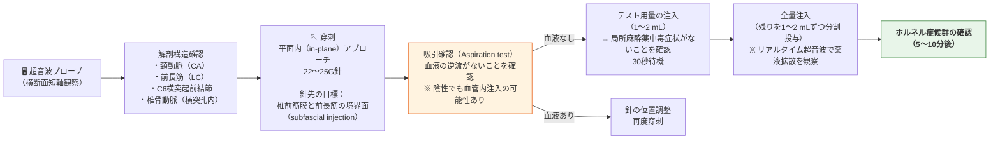

### 6-3. アプローチ法の比較

| アプローチ法 | 概要 | 長所 | 短所 | 推奨度 |
|------------|------|------|------|--------|
| **超音波ガイド下（パラカロティドアプローチ）** | リアルタイム超音波で針先と解剖構造を可視化 | 血管誤穿刺リスク最低；薬液拡散の確認が可能 | 機器と習熟が必要 | **第一選択 ✅** |
| **透視（フルオロスコピー）ガイド下** | X線透視下でのランドマーク確認後に注射 | 骨性目標の可視化に優れる | 放射線被曝；血管は見えない | 代替選択 |
| **CT ガイド下** | CT画像で詳細な位置確認後に注射 | 最高の精度；解剖学的変異への対応 | 放射線量が多い；施術時間が長い；コスト高 | 特殊ケースのみ |
| **体表ランドマーク（盲目的）** | シャセニャック結節の触診のみに依存 | 機器不要；迅速 | 合併症リスクが最も高い | **非推奨 ⛔** |

---

## 7. 使用薬剤と用量

### 7-1. 局所麻酔薬の選択

| 薬剤 | 濃度 | 用量（成人） | 作用発現 | 持続時間 | 特記事項 |
|------|------|------------|---------|---------|---------|
| **ロピバカイン** | 0.2〜0.5% | **4〜10 mL** | 10〜15分 | 4〜12時間 | 心毒性が最も低い；**最も推奨** |
| **ブピバカイン** | 0.25〜0.5% | 4〜10 mL | 10〜15分 | 6〜16時間 | 長時間作用型；心毒性に注意 |
| **リドカイン** | 1〜2% | 4〜8 mL | 3〜5分 | 1〜3時間 | 急性期疼痛・不整脈に有用；短時間作用型 |
| **メピバカイン** | 1〜1.5% | 4〜8 mL | 5〜10分 | 2〜4時間 | 中等度持続型；まれに使用 |

> ⚠️ **LAST（局所麻酔薬全身毒性）対応**：施術室には常に20%脂肪乳剤（Intralipid）と気道確保器具を準備すること。LAST発症時の初期徴候：耳鳴り・口唇しびれ・金属味・興奮状態→痙攣→心停止の順で進行しうる。

### 7-2. PTSD・ホットフラッシュへの標準的な用量

| 適応 | 推奨局所麻酔薬 | 用量 | 施術側 | 反復投与 |
|------|-------------|------|--------|---------|
| PTSD | ロピバカイン 0.5% またはブピバカイン 0.5% | **6〜7 mL** | 右側（第一選択） | 24時間以上あけて対側も検討可 |
| ホットフラッシュ | ロピバカイン 0.5% | 5〜7 mL | 右側 | 1〜3回が一般的（間隔：数週〜数ヶ月）|

### 7-3. 心臓領域（電気的嵐）への標準的な用量

| 項目 | 内容 |
|------|------|
| 第一選択薬 | ブピバカイン（70%以上の使用報告）またはロピバカイン |
| 用量 | **8〜12 mL** |
| 施術側 | **左側優先**（左心室の主要交感神経支配のため） |
| 特殊状況 | 気管挿管中は両側同時施術も検討可 |

### 7-4. ステロイドの追加について

| 項目 | 内容 |
|------|------|
| 使用の可否 | 一部の術者が局所麻酔薬に追加 |
| 推定メリット | 炎症抑制・効果持続の延長 |
| エビデンス | 現時点では明確な上乗せ効果を示すRCTなし |
| 推奨 | ルーティン使用は**推奨されない**（Grade U） |

---

## 8. ブロック成功の確認

### 8-1. ホルネル症候群（Horner's Syndrome）

SGB成功の**最重要確認指標**はホルネル症候群の出現です。

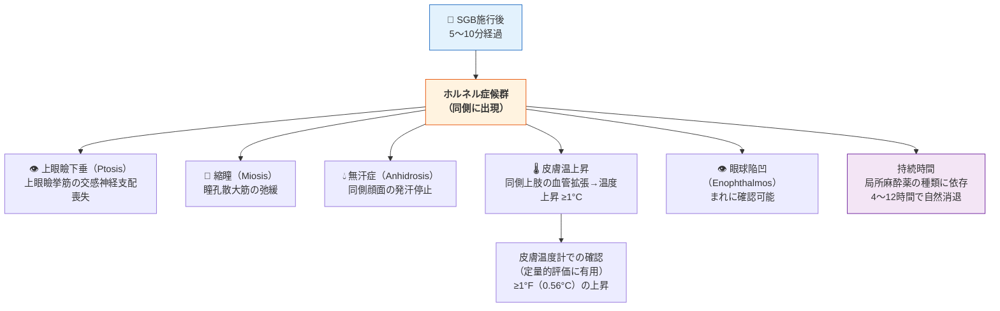

### 8-2. その他の成功確認指標

| 指標 | 内容 | 評価タイミング |
|------|------|-------------|
| 同側上肢皮膚温上昇 | ≥1°F（0.56°C）の温度上昇 | 注射後15〜30分 |
| 同側顔面発赤・温感 | 交感神経遮断による血管拡張 | 注射後5〜15分 |
| 同側鼻粘膜充血 | まれに患者が「鼻が詰まった感じ」を訴える | 注射後5〜20分 |
| 上肢安静時疼痛の即時軽減 | CRPSなどの疼痛疾患では即時の疼痛VAS低下 | 注射後15〜30分 |

---

## 9. 合併症と安全管理

### 9-1. 合併症の分類と頻度

#### 軽微な副作用（ほぼ全例で一時的に出現）

| 副作用 | 発現率 | 原因 | 対応 |
|--------|--------|------|------|
| ホルネル症候群 | **ほぼ100%**（確認指標）| 交感神経遮断 | 自然消退（4〜16時間）|
| 嗄声（Hoarseness）| **最も多い副作用** | 反回喉頭神経の一時的ブロック | 数時間で自然消退；飲水・食事を一時的に制限 |
| 嚥下困難感 | 反回喉頭神経ブロック | 数時間で自然消退 | 誤嚥に注意（食事制限）|
| 横隔膜麻痺 | — | 横隔神経（phrenic nerve）のブロック | 通常1側のみで問題なし；重篤呼吸障害患者は要注意 |

#### 重篤な合併症（頻度は低いが生命を脅かす可能性）

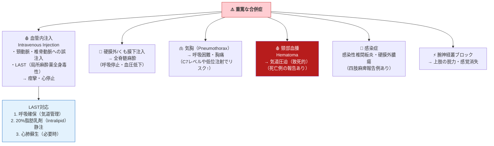

### 9-2. 合併症の系統的レビュー（Eldrige et al., 2019）

260例の有害事象を分析した系統的レビュー（1990〜2018年）の結果：

| 合併症カテゴリー | 割合 | 主な内容 |
|----------------|------|---------|
| 薬剤関連・全身性副作用 | **68.4%** | LAST・血圧変動・アレルギー反応 |
| 手技関連・局所副作用 | **31.5%** | 血腫・気胸・神経損傷 |
| 死亡例 | 1例報告 | 大量血腫による気道閉塞 |
| 四肢麻痺 | 1例報告 | 化膿性頸椎硬膜外膿瘍 |

> 📌 **重要な安全上の結論**：ランドマーク法と画像ガイド法の両方で合併症は報告されており、**超音波ガイド下でも合併症は完全には防止できない**。ただし超音波ガイドにより血管・神経の直接可視化が可能となり、リスクを有意に低減できます。

### 9-3. 安全管理のフローチャート

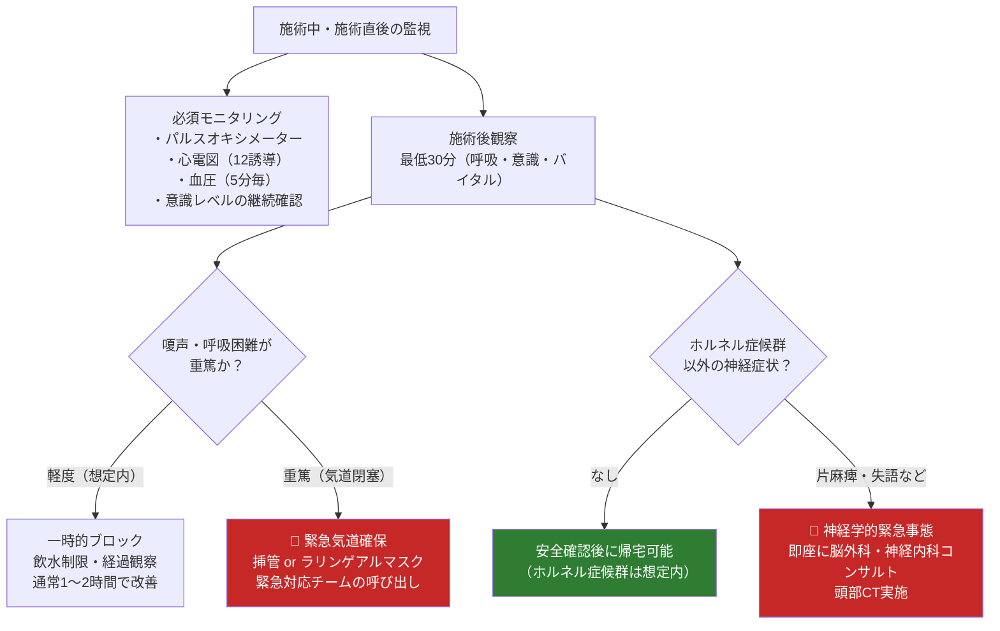

---

## 10. エビデンスサマリーと最新知見

### 10-1. 主要適応症別エビデンス

#### ホットフラッシュ（更年期症状・乳がん治療後）

| 研究 | デザイン | 結果 | エビデンスグレード |
|------|---------|------|-----------------|
| Lipov et al. (2008) | パイロット試験 | ホットフラッシュ頻度50%以上減少 | Grade C |
| Walega et al. (2014) Menopause誌 | RCT | SGB群でホットフラッシュ頻度の有意な減少（p<0.01） | **Grade A** |
| Freedman et al. (2014) | RCT（偽注射対照） | 真のSGBで有意な効果；偽注射対照群より優位 | **Grade A** |
| **結論** | | 乳がん治療後（タモキシフェン等）のホットフラッシュへの最もエビデンスが充実した適応 | **Grade A** |

#### PTSD（心的外傷後ストレス障害）

| 研究 | デザイン | 結果 | エビデンスグレード |
|------|---------|------|-----------------|
| Hollifield et al. (2019) Anesthesia & Analgesia | RCT | PTSD症状スコア（CAPS-5）の有意な改善 | **Grade B** |
| Rae Olmsted et al. (2020) | RCT（軍人対象） | SGB群でPTSD症状の有意な改善（p=0.04） | **Grade B** |
| Blakey et al. (2024) Translational Psychiatry | RCT二次解析 | トラウマの種類によって反応性が異なる | **Grade B** |
| メタ解析（2025年） | 系統的レビュー・メタ解析（PubMed〜Nov 2024） | PTSD全体症状・再体験・回避・過覚醒の改善を支持 | **Grade B** |
| **結論** | | 有望なエビデンスが蓄積中；ただし長期効果・最適反復回数は未確定 | **Grade B** |

#### 室性不整脈・電気的嵐（Electrical Storm）

| 研究 | デザイン | 結果 | エビデンスグレード |
|------|---------|------|-----------------|
| Savastano et al. STAR study (2024) Eur Heart J | 多施設観察研究 | SGB後24時間でVT/VF中央値7.5回→1.0回（p<0.001） | Grade B |
| Motazedian et al. (2024) Sci Rep | 系統的レビュー・メタ解析 | SGB は電気的嵐に対して有意な不整脈抑制効果 | Grade B |
| JACC:CE 多施設研究 (2024) | 多施設観察研究 | 不整脈種別・心筋症原因を問わず改善 | Grade B |
| **GANGSTER Trial** | 進行中RCT（2024年12月まで登録）| 結果待ち | — |
| **結論** | | 難治性電気的嵐への短期的な有効性はGrade B；RCTデータが強く待望される | **Grade B** |

### 10-2. 日本における特殊性

日本ではヨーロッパ・北米と比較して、SGBの適応範囲が広く使用されている歴史があります。

| 特徴 | 内容 |
|------|------|
| 適応の広さ | 免疫機能改善・内分泌疾患・皮膚疾患など「全身疾患」への応用が報告 |
| 施術頻度 | 慢性疾患への定期的な繰り返し施術が欧米より多い傾向 |
| エビデンス状況 | 欧米の国際誌へのRCTデータは限定的；エビデンスの国際的な評価が課題 |
| 現状 | 日本ペインクリニック学会（JSPC）のガイドラインに基づく施術が推奨 |

### 10-3. 新興領域

| 領域 | 現状 | 進行中の主要試験 |
|------|------|----------------|
| 脳血管攣縮（くも膜下出血後） | Grade C（有望な症例報告）| NCT04691271（n=202）・NCT06797752（n=50） |
| 周術期心房細動予防 | Grade C→B（複数の小規模RCT）| NCT06476925（n=100）・NCT05357690（n=220）|
| 長期COVIDに伴う嗅覚消失 | Grade C（症例報告）| 予備的データ蓄積中 |
| 免疫調節作用 | 基礎研究段階 | 自己免疫疾患への応用が研究中 |

### 10-4. 総合エビデンスマップ

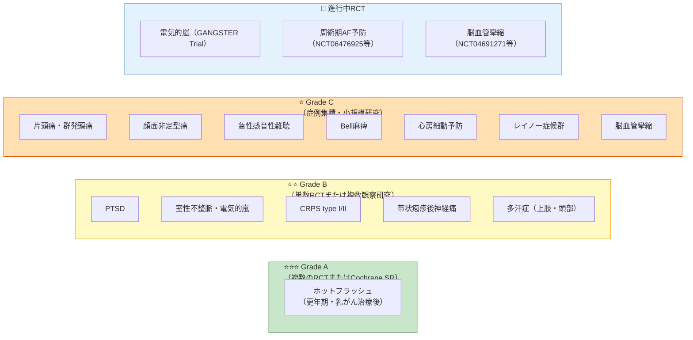

---

## 11. 参考文献

### 解剖学・基礎

| タイトル | ジャーナル/出版社 | URL |
|---------|-----------------|-----|
| Anatomy, Imaging, and Clinical Significance of the Cervicothoracic (Stellate) Ganglion | *Diagnostics* 2025;15(22):2911 (MDPI OA) | https://www.mdpi.com/2075-4418/15/22/2911 |
| Neuroanatomy, Stellate Ganglion — StatPearls | StatPearls Publishing | https://www.ncbi.nlm.nih.gov/books/NBK542193/ |
| Stellate Ganglion Block — OpenAnesthesia | IARS Open Resource | https://www.openanesthesia.org/keywords/stellate-ganglion-block/ |

### 超音波ガイド下技術・手技

| タイトル | ジャーナル/出版社 | URL |
|---------|-----------------|-----|
| Optimal volume of 0.2% ropivacaine for ultrasound-guided SGB | *Korean J Anesthesiol* 2011 (PMC) | https://pmc.ncbi.nlm.nih.gov/articles/PMC3071481/ |
| Novel ultrasound-guided supraclavicular stellate ganglion block | *Pain Pract* 2024;24(5):808–814 | https://pubmed.ncbi.nlm.nih.gov/38251786/ |
| SGB in perioperative practice: a narrative review | *British Journal of Anaesthesia* 2025 | https://www.bjanaesthesia.org/article/S0007-0912(25)00606-3/abstract |

### 合併症・安全性

| タイトル | ジャーナル/出版社 | URL |
|---------|-----------------|-----|
| Complications associated with stellate ganglion nerve block: a systematic review | *Reg Anesth Pain Med* 2019 (PubMed) | https://pubmed.ncbi.nlm.nih.gov/30992414/ |
| SGB: Indications, technique and complications — ScienceDirect Topics | Elsevier | https://www.sciencedirect.com/topics/biochemistry-genetics-and-molecular-biology/stellate-ganglion-block |

### PTSD

| タイトル | ジャーナル/出版社 | URL |
|---------|-----------------|-----|
| Evidence Brief: Effectiveness of SGB for PTSD — VA/DoD | NCBI Bookshelf | https://www.ncbi.nlm.nih.gov/books/NBK442253/ |
| SGB for PTSD: A Systematic Review and Meta-Analysis | *Autonomic Neuroscience* 2025 | https://www.autonomicneuroscience.com/article/S1566-0702(25)00122-5/fulltext |
| SGB for PTSD: Comprehensive Review — Military and Non-Military Patients | *Curr Psychiatry Rep* 2026 | https://link.springer.com/article/10.1007/s11920-026-01666-4 |

### 不整脈・電気的嵐

| タイトル | ジャーナル/出版社 | URL |
|---------|-----------------|-----|
| STAR Study: Electrical Storm Treatment by Percutaneous SGB | *Eur Heart J* 2024;45(10):823–833 | https://academic.oup.com/eurheartj/article/45/10/823/7476499 |
| Efficacy of SGB in Electrical Storm: Systematic Review and Meta-Analysis | *Sci Rep* 2024;14:24719 | https://doi.org/10.1038/s41598-024-76663-9 |
| Multicenter Study of SGB for Refractory Ventricular Arrhythmias | *JACC: Clinical Electrophysiology* 2024 | https://www.jacc.org/doi/10.1016/j.jacep.2023.12.012 |
| SGB for Ventricular Arrhythmias: Mechanisms, Outcomes, Future Directions | PubMed 2025 | https://pubmed.ncbi.nlm.nih.gov/40569055/ |

### ホットフラッシュ・更年期

| タイトル | ジャーナル/出版社 | URL |
|---------|-----------------|-----|
| Unifying theory: SGB for CRPS, hot flashes, and PTSD | *Med Hypotheses* 2009 (ScienceDirect) | https://www.sciencedirect.com/science/article/abs/pii/S0306987709000413 |

### 周術期・麻酔領域

| タイトル | ジャーナル/出版社 | URL |
|---------|-----------------|-----|
| SGB for Electrical Storm — EMCrit Clinical Review (2025) | EMCrit Project | https://emcrit.org/emcrit/stellate-ganglion-block/ |
| Riders on the Storm: SGB for Electrical Storm | ACEP EM Ultrasound | https://www.acep.org/emultrasound/newsroom/march-2025/riders-on-the-storm-stellate-ganglion-block-for-electrical-storm |

### 総合レビュー

| タイトル | ジャーナル/出版社 | URL |
|---------|-----------------|-----|
| A Review of SGB as an Adjunctive Treatment Modality | *Cureus* 2023 (PMC) | https://www.ncbi.nlm.nih.gov/pmc/articles/PMC10029323/ |
| SGB: Angina Pectoris — Systematic Review and Meta-Analysis | PMC | https://www.ncbi.nlm.nih.gov/pmc/articles/PMC11842144/ |

### 進行中の臨床試験

| 試験名 | 内容 | URL |
|--------|------|-----|
| GANGSTER Trial | 電気的嵐に対するSGBのRCT | https://clinicaltrials.gov |
| NCT04691271 | くも膜下出血後脳血管攣縮へのSGB（n=202） | https://clinicaltrials.gov/study/NCT04691271 |
| NCT06476925 | 周術期AF予防（n=100） | https://clinicaltrials.gov/study/NCT06476925 |
| NCT05357690 | 周術期AF予防（n=220） | https://clinicaltrials.gov/study/NCT05357690 |
| NCT05094245 | Bell麻痺へのSGB | https://clinicaltrials.gov/study/NCT05094245 |

---

> ## 📋 最終的な学術的免責事項（Final Academic Disclaimer）
>
> 本文書に記載されたすべての情報は**学術・教育・研究目的のみ**を対象としています。星状神経節ブロックは**侵襲的手技**であり、適切な医学的トレーニング・設備・緊急対応体制なしに実施することは禁止されています。本文書の情報を個人への医療アドバイス・診断・治療に使用しないでください。すべての臨床判断は、有資格医師による個別患者評価のもとで行われなければなりません。
>
> **作成**: 国際エビデンス（2025年12月時点）に基づく学術ガイド  
> **改訂基準**: 重要なRCT結果（GANGSTER Trialなど）の公開時に更新が必要です。
