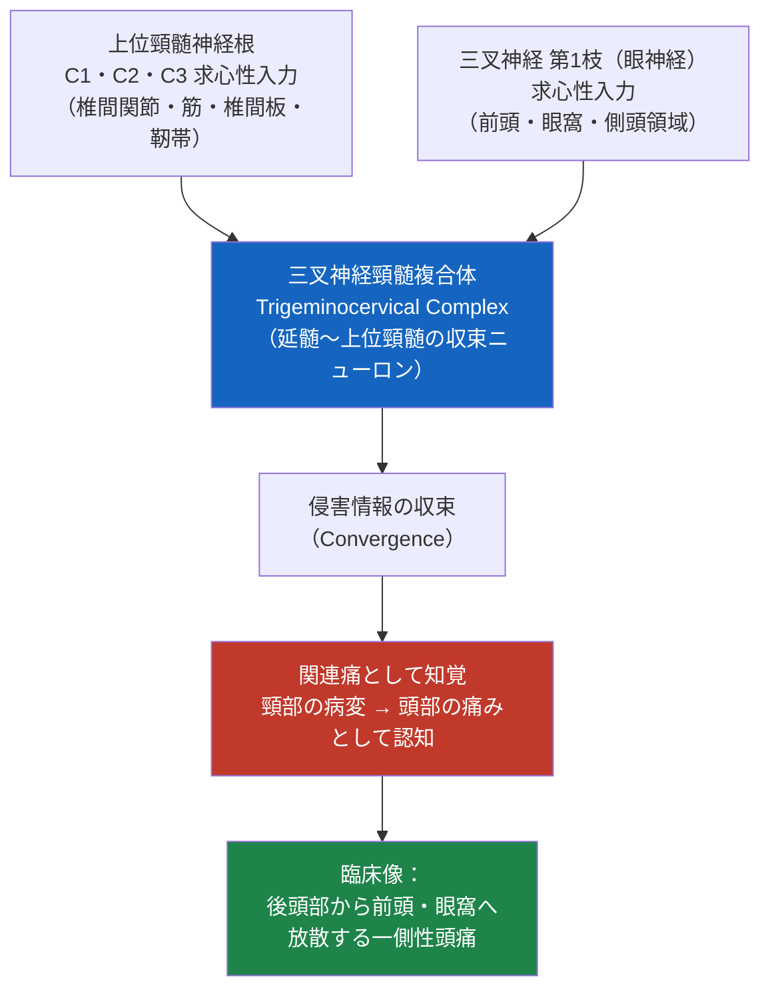
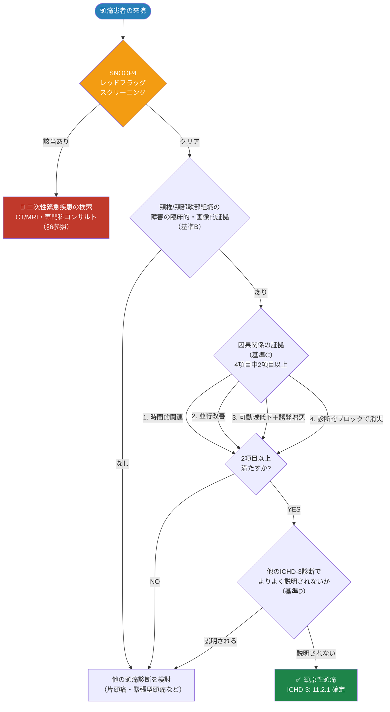
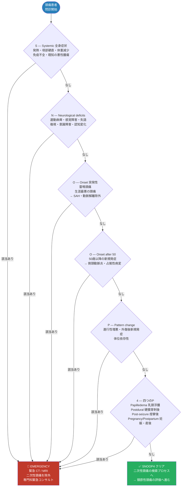
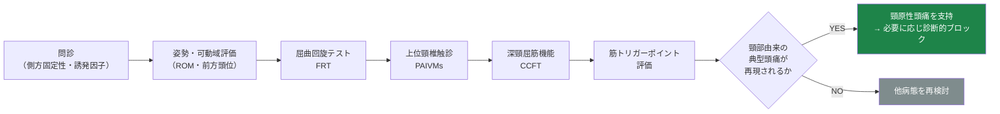
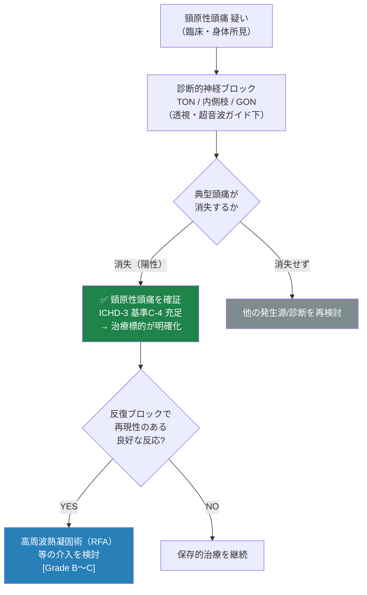
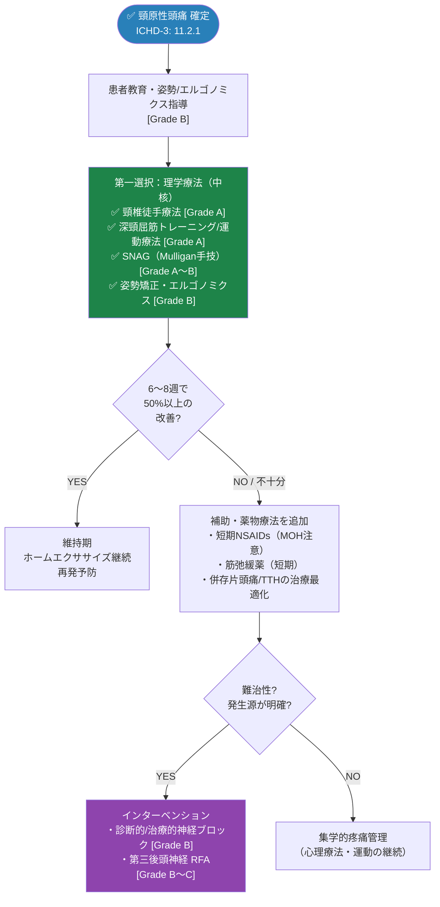

# 頸原性頭痛（Cervicogenic Headache: CEH）完全ガイド
## 初学者から臨床家まで ─ 国際標準エビデンスに基づくステップバイステップ解説

> ### ⚠️ 学術免責事項（MANDATORY ACADEMIC DISCLAIMER）
> 本資料は**学術・教育・研究目的のみ**を対象としています。
> すべての臨床応用は、資格を有する医療専門家による検討・監督のもとで行われなければなりません。
> 本資料は個人的な医療アドバイス、診断、または処方を提供するものではありません。

---

## 目次

1. [疾患概要・定義](#1-疾患概要定義)
2. [疫学](#2-疫学)
3. [関連解剖と病態生理学（三叉神経頸髄複合体）](#3-病態生理学)
4. [ICHD-3 診断分類](#4-ichd-3-診断分類)
5. [診断基準 ステップバイステップ](#5-診断基準-ステップバイステップ)
6. [SNOOP4 レッドフラッグスクリーニング](#6-snoop4-レッドフラッグスクリーニング)
7. [鑑別診断](#7-鑑別診断)
8. [身体所見・誘発テスト](#8-身体所見誘発テスト)
9. [画像・診断的神経ブロック](#9-画像診断的神経ブロック)
10. [評価ツール・アウトカム指標](#10-評価ツールアウトカム指標)
11. [治療戦略（マルチモーダル）](#11-治療戦略)
12. [薬剤過用頭痛（MOH）リスク評価](#12-moh-リスク評価)
13. [特殊集団への対応](#13-特殊集団への対応)
14. [標準化ケーススタディ](#14-標準化ケーススタディ)
15. [エビデンス階層サマリー](#15-エビデンス階層サマリー)
16. [参考文献・URLリソース](#16-参考文献urlリソース)

---

## 1. 疾患概要・定義 {#1-疾患概要定義}

**頸原性頭痛（Cervicogenic Headache: CEH）** とは、**頸椎およびその構成要素（骨・椎間板・軟部組織）の障害によって引き起こされる頭痛**であり、IHS（国際頭痛学会）の **ICHD-3（国際頭痛分類第3版）** において **第11章「頭頸部構造の障害による頭痛」** の **11.2.1** に分類される **二次性頭痛**です。

> **ICHD-3 公式の定義（原文要旨）：**
> *"Headache caused by a disorder of the cervical spine and its component bony, disc and/or soft tissue elements, usually but not invariably accompanied by neck pain."*
> （頸椎およびその構成要素である骨・椎間板・軟部組織の障害によって生じる頭痛で、通常は頸部痛を伴うが、必ずしも伴うとは限らない）
>
> 出典：ICHD-3, 11.2.1 Cervicogenic headache — https://ichd-3.org/11-headache-attributed-to-disorder-of-the-neck/

### 1.1 最重要ポイント（初学者向け）

| 概念 | 解説 |
|------|------|
| **二次性頭痛である** | 片頭痛・緊張型頭痛（一次性頭痛）とは異なり、「原因（頸椎病変）が別に存在する」頭痛 |
| **関連痛（referred pain）** | 痛みの「発生源」は頸部だが、「感じる場所」は頭部。これは三叉神経頸髄複合体の収束による（§3で詳述） |
| **側方固定性（side-locked）** | 多くの場合、痛みは常に同じ側に出現する（左右が入れ替わらない） |
| **頸部由来の証明が必須** | 診断には「頸椎の障害が頭痛の原因である」という因果関係の証明が要求される |

### 1.2 典型的臨床像

| 項目 | 頸原性頭痛の特徴 |
|------|----------------|
| **部位** | 一側性・後頭部から始まり前頭・側頭・眼窩へ波及（後方→前方放散） |
| **性状** | 非拍動性・鈍痛・締め付け感（深部痛） |
| **強度** | 軽度〜中等度（変動あり） |
| **持続時間** | 数時間〜持続性（変動性、寛解と増悪を繰り返す） |
| **誘発・増悪因子** | 頸部の特定姿勢・運動、後頸部への圧迫、長時間のデスクワーク |
| **随伴症状** | 同側の頸部・肩・腕の鈍痛、頸部可動域制限。悪心・光過敏は軽度で出現しうる |

---

## 2. 疫学 {#2-疫学}

| 指標 | データ | 出典 |
|------|--------|------|
| 一般人口での有病率 | 約 **0.4〜2.5%** | Sjaastad & Bakketeig, Vågå study, *Acta Neurol Scand* 2008 |
| 頭痛患者集団での割合 | 約 **15〜20%**（慢性頭痛例で高い） | Knackstedt et al., Akershus study, *Cephalalgia* 2010 |
| むち打ち損傷（whiplash）後 | 高頻度に発症 | 各種コホート研究 |
| 性別 | 女性にやや多い（女性 > 男性） | 疫学研究の集積 |
| 好発年齢 | 中年（30〜60歳）に多いが全年齢で生じうる | — |

> 📌 有病率の推定値は使用する診断基準（ICHD-3 vs. Sjaastad/CHISG 基準）により大きく変動する点に注意。

---

## 3. 関連解剖と病態生理学（三叉神経頸髄複合体）{#3-病態生理学}

頸原性頭痛を理解する鍵は、**「なぜ頸部の障害が"頭"の痛みになるのか」** という関連痛のメカニズムです。

### 3.1 中核機序：三叉神経頸髄複合体（Trigeminocervical Complex: TCC）

上位頸髄（C1〜C3）から入る感覚神経と、顔面・頭部を支配する三叉神経（特に第1枝）の侵害情報が、延髄〜上位頸髄の同一ニューロンプール（**三叉神経頸髄複合体**）に**収束（convergence）** する。この収束により、脳は頸部由来の痛みを「頭部の痛み」として誤認知する。

### 3.2 主要な痛みの発生源（pain generators）

| 構造 | 神経支配 | 臨床的意義 |
|------|---------|-----------|
| **環椎後頭関節（C0-C1）** | C1 | 上部頸椎の回旋・側屈に関与 |
| **環軸関節（C1-C2）** | C2 | 頭部回旋の大部分を担う。障害で回旋時痛 |
| **C2-C3 椎間関節** | 第三後頭神経（TON, C3後枝）| **頸原性頭痛の最重要発生源**。TONブロックが診断・治療に有用 |
| **頸椎椎間板（上位）** | 洞椎骨神経 | 椎間板性疼痛 |
| **後頸部筋群** | 頸神経後枝 | 筋緊張・トリガーポイント（緊張型頭痛との鑑別が課題） |
| **大後頭神経（GON, C2）** | C2 | 後頭神経痛との関連・鑑別 |

> 💡 **臨床のキモ：** C2-C3 椎間関節と、それを支配する**第三後頭神経（TON）** は頸原性頭痛で最も頻度の高い発生源とされ、診断的神経ブロックの主要ターゲットとなる。

> 📌 出典：Bogduk N. *Cervicogenic headache: anatomic basis and pathophysiologic mechanisms.* Curr Pain Headache Rep 2001 — https://pubmed.ncbi.nlm.nih.gov/11403742/

---

## 4. ICHD-3 診断分類 {#4-ichd-3-診断分類}

### 4.1 第11章内の位置づけ

| コード | 診断名 |
|--------|--------|
| 11.2 | 頸部の障害による頭痛（Headache attributed to disorder of the neck） |
| **11.2.1** | **頸原性頭痛（Cervicogenic headache）** ← 本資料の対象 |
| 11.2.2 | 咽後腱炎による頭痛（Retropharyngeal tendonitis） |
| 11.2.3 | 頭頸部ジストニアによる頭痛（Craniocervical dystonia） |
| A11.2.4 | 上位頸椎神経根症による頭痛（付録診断） |
| A11.2.5 | 頸部筋筋膜性疼痛による頭痛（付録診断） |

> 📌 出典：ICHD-3 第11章 — https://ichd-3.org/11-headache-attributed-to-disorder-of-the-neck/

---

## 5. 診断基準 ステップバイステップ {#5-診断基準-ステップバイステップ}

### 5.1 ICHD-3 11.2.1 頸原性頭痛 公式診断基準（原文準拠）

> **A.** 基準C を満たす任意の頭痛
> **B.** 頭痛を引き起こしうることが知られている**頸椎または頸部軟部組織の障害・病変**の臨床的および/または画像的証拠が存在する¹
> **C.** 以下の **少なくとも2項目**により因果関係が証明される：
> 　1. 頭痛が、頸部障害の発症または病変出現と**時間的関連**をもって発症した
> 　2. 頭痛が、頸部障害・病変の改善・消失と**並行して有意に改善または消失**した
> 　3. **頸部可動域が低下**し、誘発手技により頭痛が有意に増悪する
> 　4. 頸部構造またはその神経支配への**診断的ブロックにより頭痛が消失**する
> **D.** 他のICHD-3診断で**よりよく説明されない**²⁻⁵

> **注釈（重要）：**
> ¹ 上位頸椎の画像所見は頭痛のない人にも一般的に見られ、因果関係の**示唆にはなるが確証にはならない**。
> ² 腫瘍・骨折・感染・関節リウマチは正式には検証されていないが、個別症例では基準Bを満たすと容認される。
> ³ 頸部筋筋膜性疼痛が原因の場合は、**むしろ 2. 緊張型頭痛**としてコードすべき場合がある（重複が多い）。
> ⁴ 上位頸椎神経根症による頭痛は付録診断 A11.2.4 として保留中。
> ⁵ **鑑別を助ける特徴：** 側方固定性疼痛、頸部筋への指圧や頭部運動による典型頭痛の誘発、後方→前方への放散。ただしこれらは頸原性頭痛に**特異的ではない**。

> 📌 出典：ICHD-3 11.2.1 — https://ichd-3.org/11-headache-attributed-to-disorder-of-the-neck/

### 5.2 診断フローチャート

### 5.3 Sjaastad / CHISG 基準（補助的）

ICHD-3 とは別に、頸原性頭痛国際研究会（CHISG）による **Sjaastad 基準**が臨床研究で広く用いられてきました。主要項目：

| 主要基準 | 内容 |
|---------|------|
| 頸部からの誘発性 | ①頸部運動・不良姿勢、②後頸部/後頭部への外圧 により典型頭痛が誘発される |
| 頸部可動域制限 | 頸部の可動域が制限される |
| 同側の頸・肩・腕痛 | 非根性の鈍い同側上肢痛 |
| 側方固定性 | 痛みは左右を越えない（側方固定） |
| 局所麻酔ブロックでの消失 | 診断的ブロックによる頭痛消失（確定的所見） |

> 📌 出典：Sjaastad O, et al. *Cervicogenic headache: diagnostic criteria.* Headache 1998 — https://pubmed.ncbi.nlm.nih.gov/9695957/

---

## 6. SNOOP4 レッドフラッグスクリーニング {#6-snoop4-レッドフラッグスクリーニング}

> **⚠️ すべての頭痛患者において、いかなる治療プロトコル開始前にも SNOOP4 基準を確認すること。頸原性頭痛は二次性頭痛であり、「頸部由来」と早合点する前に、より重篤な二次性病変（頸動脈/椎骨動脈解離、頸髄病変、頭蓋頸椎移行部病変など）を必ず除外する。**

### 6.1 頸原性頭痛で特に注意すべき"なりすまし"病態

| 見逃してはならない疾患 | 警告所見 |
|----------------------|---------|
| **頸動脈/椎骨動脈解離** | 突発性の頸部・後頭部痛、Horner徴候、若年・外傷/頸部操作後 |
| **頭蓋頸椎移行部病変**（Chiari奇形・腫瘍） | 咳・労作で増悪、進行性、神経症状 |
| **環軸椎不安定性**（関節リウマチ等） | RA既往、頸部不安定感、四肢のしびれ |
| **脊髄/神経根圧迫** | 進行性の上肢筋力低下・感覚障害 |
| **巨細胞性動脈炎（GCA）** | 50歳以上、側頭部痛、顎跛行、ESR/CRP上昇 |

> ⚠️ **頸部マニピュレーション（高速スラスト手技）施行前には、椎骨脳底動脈循環不全・動脈解離リスクの評価が必須。**

---

## 7. 鑑別診断 {#7-鑑別診断}

頸原性頭痛は、片頭痛・緊張型頭痛・後頭神経痛との鑑別が最も重要かつ困難です。

| 鑑別点 | 頸原性頭痛 | 片頭痛（前兆なし） | 緊張型頭痛 | 後頭神経痛 |
|--------|-----------|-------------------|-----------|-----------|
| **ICHD-3コード** | 11.2.1 | 1.1 | 2.1〜2.3 | 13.1 |
| **部位** | 一側・後頭→前方放散 | 一側性（多い） | 両側性 | GON/LON支配領域 |
| **側方固定性** | あり（典型的） | 通常入れ替わる | 両側 | あり |
| **性状** | 非拍動性・鈍痛 | 拍動性 | 圧迫・締め付け | 電撃痛・刺すような |
| **頸部運動での誘発** | あり（特徴的） | 通常なし | 軽度 | 体位で誘発しうる |
| **頸部可動域制限** | あり | なし | なし/軽度 | なし |
| **悪心/嘔吐** | まれ〜軽度 | あり（多い） | なし | なし |
| **光・音過敏** | 軽度のことあり | あり（両方） | 一方のみ可 | 通常なし |
| **診断的頸部ブロック** | **消失する（確定的）** | 通常無効 | 無効 | GONブロックで消失 |
| **拍動性・体動増悪** | 体動より頸部運動で増悪 | 体動で増悪 | 体動で増悪せず | — |

> 💡 **最重要：** 頸原性頭痛・片頭痛・緊張型頭痛は**共存しうる**。診断的神経ブロックによる頭痛消失（基準C-4）は頸原性頭痛を最も強く支持する所見。

> 📌 ICHD-3 注釈5：悪心・嘔吐・光/音過敏といった片頭痛様症状も頸原性頭痛に伴いうるが、一般に片頭痛より軽度。

---

## 8. 身体所見・誘発テスト {#8-身体所見誘発テスト}

### 8.1 主要な徒手評価テスト

| テスト | 方法 | 陽性所見の意味 |
|--------|------|--------------|
| **屈曲回旋テスト（FRT）** | 頸部最大屈曲位で左右に回旋させ可動域を測定 | C1-C2由来の制限を検出。**頸原性頭痛で感度・特異度が高い**とされる主要テスト |
| **上位頸椎の関節触診（PAIVMs）** | C0-C3椎間関節を後前方向に触診し、典型頭痛を再現 | 障害分節（特にC1-C3）の同定 |
| **頭蓋頸椎屈曲テスト（CCFT）** | バイオフィードバック圧計を用い深頸屈筋の機能を評価 | 深頸屈筋（頸長筋・頭長筋）の機能不全を検出 |
| **頸部伸筋・後頭下筋の触診** | トリガーポイント・圧痛を評価 | 関連痛の再現 |
| **姿勢評価** | 前方頭位（forward head posture）等 | 慢性化の機械的要因 |

> 💡 **屈曲回旋テスト（Flexion-Rotation Test, FRT）** は、C1-C2レベルの機能障害を反映し、頸原性頭痛の臨床評価で最も研究されたテストの一つ。
> 📌 出典：Hall T, et al. *The flexion–rotation test and active cervical mobility.* Man Ther 2004 — https://pubmed.ncbi.nlm.nih.gov/15522642/

### 8.2 評価の流れ

---

## 9. 画像・診断的神経ブロック {#9-画像診断的神経ブロック}

### 9.1 画像検査の位置づけ

| 検査 | 役割 | 注意点 |
|------|------|--------|
| **頸椎単純X線** | 整列・変性・不安定性の評価 | 無症候性変性が多く、因果関係の証拠としては弱い |
| **MRI** | 椎間板・脊髄・神経根・軟部組織の評価 | 二次性病変の除外に重要。所見＝原因とは限らない（ICHD-3 注釈1） |
| **CT** | 骨性病変・頭蓋頸椎移行部 | 骨折・骨破壊の評価 |

> ⚠️ **重要：** 上位頸椎の画像所見は無症候者にも高頻度。画像所見のみで頸原性頭痛を確定してはならない（**因果関係は基準Cで証明する**）。

### 9.2 診断的神経ブロック（基準C-4の要）

診断的ブロックによる頭痛消失は、ICHD-3基準C-4を満たし、**最も確実な因果関係の証拠**となります。透視・超音波ガイド下で施行します。

| ブロック標的 | 対応する痛みの発生源 | 臨床的意義 |
|------------|---------------------|-----------|
| **第三後頭神経（TON）ブロック** | C2-C3椎間関節 | 頸原性頭痛で最も有用。陽性なら高周波熱凝固術（RFA）の適応評価へ |
| **C2-C3・C3-C4 内側枝ブロック** | 上位頸椎椎間関節 | 椎間関節性頸原性頭痛の同定 |
| **大後頭神経（GON）ブロック** | C2神経・後頭神経痛との鑑別 | GON+TON併用で上乗せ効果 |
| **C2/C3 神経根ブロック** | 上位頸椎神経 | 神経根性関与の評価 |

> 📌 第三後頭神経・頸椎内側枝ブロック／RFAのエビデンス：Bogduk N, Govind J. *Cervicogenic headache: assessment of the evidence...* Lancet Neurol 2009 — https://pubmed.ncbi.nlm.nih.gov/19747657/

---

## 10. 評価ツール・アウトカム指標 {#10-評価ツールアウトカム指標}

| ツール | 用途 | 解釈 |
|--------|------|------|
| **HIT-6** | 頭痛による生活影響度 | ≥60 = 重度の障害 |
| **MIDAS** | 頭痛による能力障害 | ≥21 = Grade IV（重度） |
| **NDI（Neck Disability Index）** | **頸部障害度（頸原性頭痛で特に重要）** | 0〜100%。頸部由来の障害を定量化 |
| **VAS / NRS** | 疼痛強度 0〜10 | 発症時・ピーク・治療後2時間で記録 |
| **PGIC** | 患者全般改善度 | 7段階尺度 |
| **頸部可動域（ROM）/ FRT角度** | 機能的改善の客観指標 | 治療前後で比較 |
| **頭痛日誌** | ベースライン・効果判定 | 最低30日間の記録 |

> 💡 頸原性頭痛では一般的な頭痛尺度に加え、**NDI** と **頸部可動域/FRT** を併用することで頸部機能の改善を客観的に追跡できる。

---

## 11. 治療戦略（マルチモーダル）{#11-治療戦略}

頸原性頭痛の治療は **理学療法を中核とした多面的アプローチ**が国際的に推奨されます。単一モダリティではなく、**徒手療法＋運動療法の併用**が最も強いエビデンスをもちます。

### 11.1 治療アルゴリズム

### 11.2 理学療法（中核治療）の詳細

| 介入 | 内容 | エビデンス |
|------|------|-----------|
| **徒手療法（manual therapy）** | 上位頸椎モビライゼーション・マニピュレーション、関節モビライゼーション | **[Grade A]** — Jull G, et al. 2002 RCT（*Spine*） |
| **特定運動療法** | 深頸屈筋（頸長筋・頭長筋）の協調性・持久力訓練、頸肩甲帯安定化 | **[Grade A]** — 同上 |
| **徒手療法＋運動の併用** | 両者の組合せが単独より優れる | **[Grade A]** — Jull 2002では併用で最大効果、長期維持 |
| **SNAG（Sustained Natural Apophyseal Glides, Mulligan）** | 持続的椎間関節滑走手技 | **[Grade A〜B]** — RCTで頭痛軽減 |
| **姿勢・エルゴノミクス** | 前方頭位の是正、デスク環境調整 | **[Grade B]** |
| **後頭下筋リリース** | 後頭下筋群の即時的緊張緩和 | **[Grade C]** — 即時効果の小規模研究 |

> 📌 **最重要エビデンス：** Jull G, et al. *A randomized controlled trial of exercise and manipulative therapy for cervicogenic headache.* Spine 2002 — https://pubmed.ncbi.nlm.nih.gov/12529905/
> → **徒手療法・運動療法の単独および併用がいずれも有効**で、併用群で効果が最大かつ12ヶ月後も維持された。

> 📌 頸椎徒手療法のCochraneレビュー：Gross A, et al. *Manipulation and mobilisation for neck pain.* — https://www.cochranelibrary.com/cdsr/doi/10.1002/14651858.CD004249.pub4

### 11.3 薬物療法・インターベンションの位置づけ

| 治療 | 位置づけ | 注意 |
|------|---------|------|
| 単純鎮痛薬・NSAIDs | 補助的・短期のみ | **MOH リスク評価必須（§12）** |
| 筋弛緩薬 | 短期の筋緊張緩和 | 鎮静・依存に注意 |
| 三環系抗うつ薬（例：アミトリプチリン） | 慢性化例で考慮 | 高齢者は低用量から（§13） |
| 神経ブロック（TON/GON/内側枝） | 診断的かつ治療的 | **[Grade B]** |
| 第三後頭神経 RFA | 難治性で発生源が明確な例 | **[Grade B〜C]**、効果は一定期間で再発しうる |
| 外科的手術 | 明確な構造的原因がある例に限定 | エビデンス限定的、慎重に適応 |

> ⚠️ オピオイドは一次性/二次性頭痛のいずれでも**回避すべき**（MOH・依存リスク）。

---

## 12. 薬剤過用頭痛（MOH）リスク評価 {#12-moh-リスク評価}

頸原性頭痛は慢性経過をとりやすく、鎮痛薬の連用により **薬剤過用頭痛（MOH, ICHD-3: 8.2）** を合併しやすい点に注意します。

| 薬剤分類 | MOH閾値 |
|---------|---------|
| 単純鎮痛薬 / NSAIDs | **>10日/月**（≥3ヶ月） |
| トリプタン / エルゴタミン / オピオイド | **>8日/月**（≥3ヶ月） |
| 複合鎮痛薬 | **>10日/月**（≥3ヶ月） |

> ⚠️ **MOHは頭痛頻度を逆説的に増加させる。** 頸原性頭痛の急性鎮痛薬の使用頻度を必ずモニタリングし、過用を認めたら離脱と予防戦略（理学療法強化）へ移行する。
> 📌 出典：ICHD-3 8.2 Medication-overuse headache — https://ichd-3.org/8-headache-attributed-to-a-substance-or-its-withdrawal/

---

## 13. 特殊集団への対応 {#13-特殊集団への対応}

| 集団 | 留意点 |
|------|--------|
| **小児・思春期** | まず姿勢・学習環境（タブレット/スマホ使用姿勢）の評価。徒手療法は慎重に。薬物は最小限 |
| **妊娠・授乳期** | 薬物は極力回避し、**理学療法・姿勢指導を第一選択**。アセトアミノフェンが比較的安全な急性鎮痛薬 |
| **高齢者（>65歳）** | 頸部マニピュレーション前に椎骨動脈・骨粗鬆症・不安定性を評価。三環系抗うつ薬は低用量から（起立性低血圧・転倒・認知に注意） |
| **むち打ち損傷後** | 頸原性頭痛の高リスク。早期からの運動療法・過度の安静回避が推奨 |
| **関節リウマチ既往** | **環軸椎不安定性**を除外してから徒手療法を検討（高速スラスト手技は原則禁忌） |

> ⚠️ **頸部高速スラストマニピュレーションの相対/絶対禁忌：** 動脈解離リスク、環軸椎不安定性、重度骨粗鬆症、脊髄症、悪性腫瘍、感染。施行前のスクリーニング必須。

---

## 14. 標準化ケーススタディ {#14-標準化ケーススタディ}

> 以下は**教育目的の架空症例**であり、実臨床の判断は専門家の評価に基づくこと。

| 項目 | 内容 |
|------|------|
| **[1] 患者プロフィール** | 42歳・女性・BMI 22・事務職（長時間PC作業）・運動習慣なし |
| **[2] 主訴（PQRST）** | P:右後頸部の不良姿勢で増悪／Q:非拍動性の鈍い締め付け感／R:右後頭部→右側頭・眼窩へ放散／S:NRS 5-6／T:数時間〜終日持続、週4-5日。頻度 約18日/月 |
| **[3] 随伴症状** | 右頸・肩のこわばり、軽度の悪心（時折）、光過敏は軽度。前兆なし |
| **[4] SNOOP4 スクリーニング** | 発熱なし・神経学的欠損なし・突発発症なし・50歳未満・進行性増悪なし・乳頭浮腫なし → **CLEAR** |
| **[5] ICHD-3 分類** | **11.2.1 頸原性頭痛**（基準B：MRIでC2-C3椎間関節変性。基準C：①長時間PC作業開始と時間的関連、③頸部可動域低下＋FRT陽性で頭痛誘発 → 2項目充足。基準D：片頭痛/TTHでよりよく説明されない） |
| **[6] トリガー一覧** | 環境/姿勢：前方頭位・長時間デスクワーク／睡眠：低めの枕／ストレス：締切業務 |
| **[7] 現治療・MOH評価** | 市販NSAIDsを**月14日**服用 → **MOH閾値（>10日/月）を超過 → MOHリスク高、是正対象** |
| **[8] アウトカムスコア** | HIT-6 62（重度）／NDI 38%（中等度頸部障害）／VAS 6 |
| **[9] 治療計画** | **急性期**：NSAIDsを月10日未満に制限（MOH是正）。**中核治療（理学療法）**：上位頸椎徒手療法＋深頸屈筋トレーニング併用 [Grade A]、SNAG手技、姿勢/エルゴノミクス指導 [Grade B]。難治なら診断的TONブロック検討 [Grade B] |
| **[10] エビデンスレーティング** | 徒手療法＋運動併用 [Grade A]、姿勢/エルゴノミクス [Grade B]、神経ブロック [Grade B] |
| **[11] 安全性チェック** | 頸部マニピュレーション前に動脈解離/不安定性スクリーニング。妊娠の有無確認。NSAIDs消化管リスク評価 |
| **[12] フォローアップ指標** | 目標：3ヶ月で頭痛日数50%以上減少、HIT-6/NDI/FRT角度を3ヶ月で再評価。鎮痛薬使用日数の継続記録 |

---

## 15. エビデンス階層サマリー {#15-エビデンス階層サマリー}

### 15.1 推奨グレード定義（AAN/EHF標準）

| グレード | 基準 | 臨床的意義 |
|:---:|------|-----------|
| **Grade A** | ≥2件の一致したClass I RCT / 低異質性Cochrane SR | 強く推奨 |
| **Grade B** | 1件のClass I RCT または ≥2件のClass II研究 | 推奨 |
| **Grade C** | 1件のClass II または ≥2件のClass III研究 | 考慮可能 |
| **Grade U** | 不十分・相反するエビデンス | 推奨不可（判断困難） |
| **Expert Opinion** | RCTなし・コンセンサスのみ | 専門家合意 |

### 15.2 頸原性頭痛 主要治療のエビデンス一覧

| 治療 | グレード | 主要根拠 |
|------|:---:|---------|
| 徒手療法＋運動療法の併用 | **A** | Jull 2002 RCT（Spine） |
| 頸椎徒手療法（単独） | **A** | Jull 2002, Cochrane CD004249 |
| 深頸屈筋トレーニング | **A** | Jull 2002 |
| SNAG（Mulligan手技） | **A〜B** | RCT複数 |
| 姿勢矯正・エルゴノミクス | **B** | 観察・準実験研究 |
| 診断的/治療的神経ブロック（TON/GON） | **B** | 介入研究・専門レビュー |
| 第三後頭神経 RFA | **B〜C** | RCT/症例集積（効果は一定期間） |
| 後頭下筋リリース（即時効果） | **C** | 小規模研究 |
| 外科的治療 | **U** | エビデンス限定的 |

---

## 16. 参考文献・URLリソース {#16-参考文献urlリソース}

### 16.1 国際診断基準

| リソース | URL |
|---------|-----|
| ICHD-3 公式サイト（全文閲覧可） | https://ichd-3.org/ |
| ICHD-3 第11章（頸部障害による頭痛） | https://ichd-3.org/11-headache-attributed-to-disorder-of-the-neck/ |
| ICHD-3 全文PDF（2018年版） | https://ichd-3.org/wp-content/uploads/2018/01/The-International-Classification-of-Headache-Disorders-3rd-Edition-2018.pdf |
| IHS 分類委員会（ICHD-4 最新動向含む） | https://ihs-headache.org/en/about-ihs/standing-committees/classification/ |

### 16.2 臨床ガイドライン

| 機関 | リソース | URL |
|------|---------|-----|
| NICE | 頭痛ガイドライン CG150（英国） | https://www.nice.org.uk/guidance/cg150 |
| AAN | ガイドライン一覧 | https://www.aan.com/guidelines/ |
| IHS | 急性期治療推奨 2024（Cephalalgia誌） | https://journals.sagepub.com/doi/10.1177/03331024241252666 |

### 16.3 Cochrane エビデンスレビュー

| トピック | URL |
|---------|-----|
| 頸椎徒手療法・モビライゼーション（頸痛・関連頭痛） | https://www.cochranelibrary.com/cdsr/doi/10.1002/14651858.CD004249.pub4 |
| 頭痛・片頭痛 全レビュー検索 | https://www.cochranelibrary.com/search?query=cervicogenic+headache&searchBy=3&type=cdsr |

### 16.4 主要原著・レビュー（PubMed / 専門誌）

| 著者・年 | 内容 | URL |
|---------|------|-----|
| Jull G, et al. 2002 | 頸原性頭痛への徒手療法＋運動療法 RCT（*Spine*）— 中核エビデンス | https://pubmed.ncbi.nlm.nih.gov/12529905/ |
| Bogduk N, Govind J. 2009 | 頸原性頭痛のエビデンス評価（*Lancet Neurol*） | https://pubmed.ncbi.nlm.nih.gov/19747657/ |
| Bogduk N. 2001 | 頸原性頭痛の解剖学的基盤と病態生理（*Curr Pain Headache Rep*） | https://pubmed.ncbi.nlm.nih.gov/11403742/ |
| Sjaastad O, et al. 1998 | 頸原性頭痛の診断基準（CHISG, *Headache*） | https://pubmed.ncbi.nlm.nih.gov/9695957/ |
| Antonaci F, et al. 2001 | 原診断基準の評価（*Cephalalgia*） | https://pubmed.ncbi.nlm.nih.gov/11531896/ |
| Hall T, et al. 2004 | 屈曲回旋テスト（FRT）の検証（*Man Ther*） | https://pubmed.ncbi.nlm.nih.gov/15522642/ |
| Knackstedt H, et al. 2010 | 一般人口での有病率（Akershus study, *Cephalalgia*） | https://pubmed.ncbi.nlm.nih.gov/20974598/ |
| Sjaastad O, Bakketeig LS. 2008 | 有病率（Vågå study, *Acta Neurol Scand*） | https://pubmed.ncbi.nlm.nih.gov/18031563/ |

### 16.5 継続リサーチ用データベース

| 名称 | URL |
|------|-----|
| The Journal of Headache and Pain（EHF公式誌・OA） | https://thejournalofheadacheandpain.biomedcentral.com/ |
| Cephalalgia（IHS公式誌） | https://journals.sagepub.com/home/cep |
| PubMed 頸原性頭痛 RCT検索 | https://pubmed.ncbi.nlm.nih.gov/?term=cervicogenic+headache&filter=pubt.clinicaltrial |
| ClinicalTrials.gov | https://clinicaltrials.gov/ |

---

> ### 📋 文書管理情報
> - **対象疾患：** 頸原性頭痛（Cervicogenic Headache）
> - **ICHD-3 コード：** 11.2.1
> - **準拠基準：** ICHD-3（2018）／AAN・EHF エビデンスグレード
> - **対象読者：** 初学者〜臨床家・研究者
> - **最終確認事項：** すべての臨床応用は資格を有する医療専門家の監督下で行うこと

---

*本資料は国際的に認可された情報源（IHS/ICHD-3, NICE, Cochrane, AAN, PubMed収載査読論文）に基づき作成された学術・教育用リファレンスです。*
