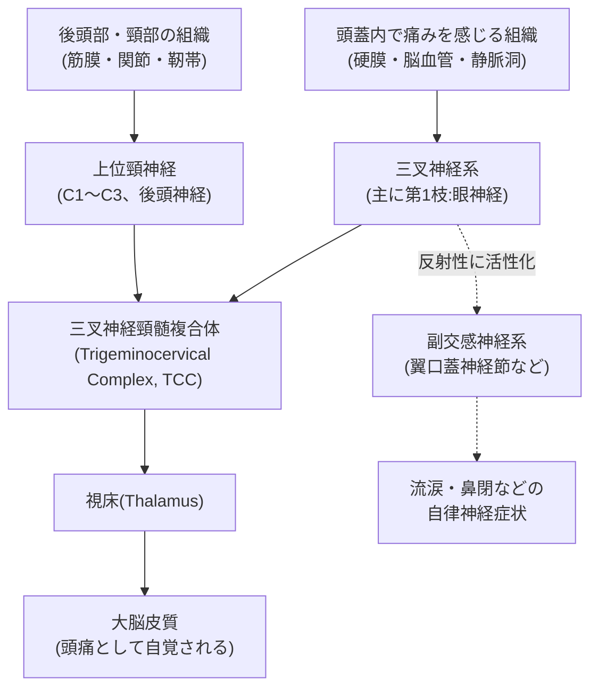
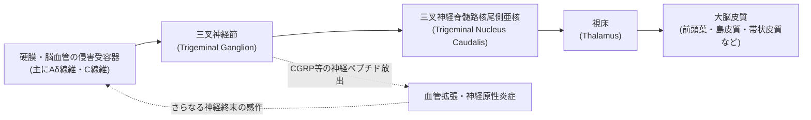
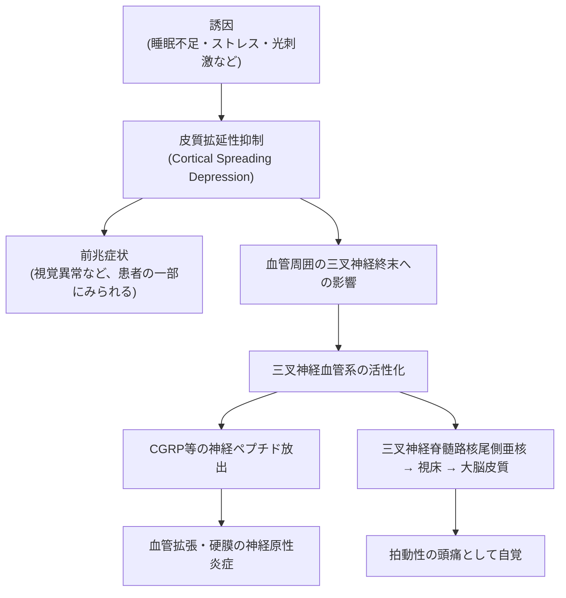
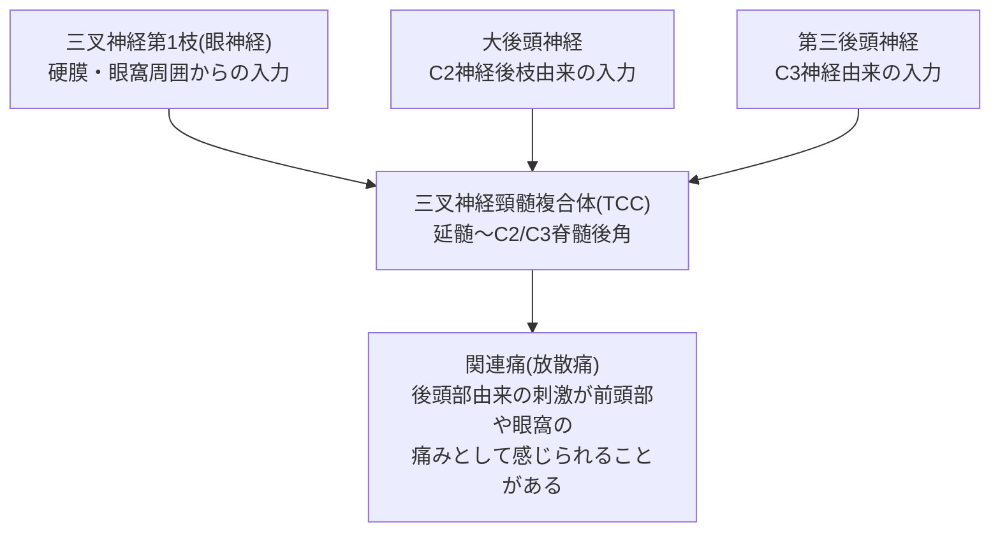
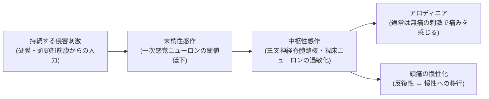
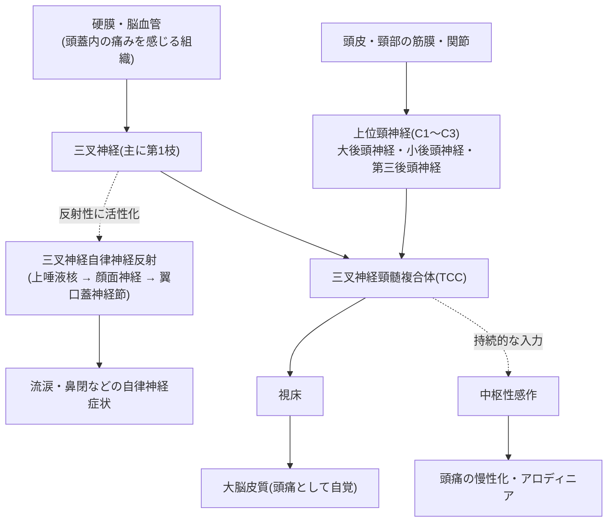

# 頭痛と神経系 ― 国際文献にもとづく入門解説

> 本資料は、国際頭痛学会(International Headache Society: IHS)が策定した
> 「国際頭痛分類 第3版(ICHD-3)」、米国NIH傘下のNINDS(米国立神経疾患・脳卒中研究所)、
> 医学雑誌 *The Lancet Neurology*・*Cephalalgia*・*Headache* などに掲載された査読付き総説論文を
> 主な情報源として、頭痛に関わる神経系の仕組みを**初学者にもわかりやすく**、ステップバイステップで解説したものです。
> 個々の症状の診断や治療方針を示すものではありません。実際の頭痛症状については医療機関を受診してください。

---

## 目次

1. なぜ「頭」が痛むのか ― 脳そのものは痛みを感じない
2. 頭痛に関わる神経ネットワークの全体像
3. 主役①:三叉神経(血管)系(Trigeminovascular System)
4. 主役②:上位頸神経と後頭神経
5. 統合ハブ:三叉神経頸髄複合体(Trigeminocervical Complex, TCC)
6. 自律神経系の関与 ― 群発頭痛はなぜ涙や鼻づまりを伴うのか
7. 中枢性感作 ― 頭痛が「慢性化」する神経メカニズム
8. 代表的な頭痛タイプと神経メカニズムのまとめ表
9. 全体フローチャートのおさらい
10. 参考文献・出典(URL付き)

---

## Step 1:なぜ「頭」が痛むのか ― 脳そのものは痛みを感じない

意外に思われるかもしれませんが、**脳の神経細胞そのものには痛みを感じる受容器(侵害受容器)がありません**。
脳外科手術で開頭したあと、脳を触っても患者は痛みを感じないことが知られています。

では頭痛の「痛み」はどこから来るのでしょうか。国際的な総説では、頭蓋内外で痛みを感じる構造として主に以下が挙げられています。

- 硬膜(脳を包む膜)とその血管
- 脳表の太い動脈・静脈洞
- 頭皮・頸部の筋肉、筋膜、関節
- 副鼻腔・眼・歯などの周辺組織

これらの組織に分布し、痛み情報を脳へ伝えているのが**三叉神経系**と**上位の頸神経(首の神経)**です。米国立神経疾患・脳卒中研究所(NINDS)も、片頭痛・緊張型頭痛・三叉神経自律神経性頭痛(群発頭痛など)といった主要な頭痛が、いずれも神経系の機能異常と深く関わることを説明しています。

---

## Step 2:頭痛に関わる神経ネットワークの全体像

頭痛の神経メカニズムは複雑に見えますが、大きく分けると次の4つの要素の相互作用として理解できます。

- **三叉神経系**(主に第1枝〈眼神経〉):前頭部・眼窩・硬膜前方の感覚を担当
- **上位頸神経(C1〜C3)・後頭神経**:後頭部・頸部の感覚を担当
- **三叉神経頸髄複合体(TCC)**:上記2つの情報が合流する中継地点
- **自律神経系(副交感神経)**:血管拡張や流涙・鼻閉などの症状に関与



この図が、これから説明する内容の「地図」になります。ひとつずつ見ていきましょう。

---

## Step 3:主役①三叉神経(血管)系(Trigeminovascular System)

### 3-1. 三叉神経とは

三叉神経は12対ある脳神経のうち第5番目(第V脳神経)で、顔面の感覚を担う最大の脳神経です。名前のとおり3本の枝に分かれています。

| 枝 | 名称 | 支配領域 | 主に関連する頭痛 |
|---|---|---|---|
| 第1枝(V1) | 眼神経 | 前頭部・眼窩・上眼瞼・**硬膜前方部** | 片頭痛、群発頭痛 |
| 第2枝(V2) | 上顎神経 | 頬部・上顎・鼻 | 三叉神経痛 |
| 第3枝(V3) | 下顎神経 | 下顎・側頭部(感覚+咀嚼筋の運動) | 三叉神経痛 |

頭痛の観点で特に重要なのは**第1枝(眼神経)**です。この枝が硬膜や脳の太い血管(特に前方の血管)を包むように分布しており、これらの組織で生じた侵害刺激(痛みのもとになる刺激)を脳へ伝えます。

### 3-2. 「三叉神経血管系」という考え方

1980年代以降の研究(Moskowitz, Goadsby & Edvinssonらによる一連の研究)により、脳血管とその周囲を取り巻く三叉神経の線維が機能的に一体のシステムとして働くことがわかってきました。これが**三叉神経血管系(Trigeminovascular System)**です。

このシステムが活性化すると、神経終末から**CGRP(カルシトニン遺伝子関連ペプチド)**などの神経ペプチドが放出され、血管拡張や「神経原性炎症」と呼ばれる炎症反応を引き起こします。これがさらに神経終末を刺激し、痛みが増幅される悪循環が生まれると考えられています。CGRPを標的とした薬剤(抗CGRP抗体薬など)が近年の片頭痛治療で使われているのは、この仕組みに基づいています。



### 3-3. 片頭痛における「前兆」との関係

片頭痛の一部の患者にみられる「前兆(閃輝暗点などの視覚異常)」は、**皮質拡延性抑制(Cortical Spreading Depression, CSD)**と呼ばれる、大脳皮質を波のように広がる一過性の神経・グリア活動の変化が関与すると考えられています。CSDが硬膜血管周囲の三叉神経終末を刺激し、頭痛発作の引き金になるという研究報告が国際的な査読誌で発表されています。



---

## Step 4:主役②上位頸神経と後頭神経

後頭部や首の痛みが頭痛と一緒に起こりやすいのは、この部分を支配する神経が理由です。

| 神経名 | 由来 | 支配領域 | 主に関連する頭痛 |
|---|---|---|---|
| 大後頭神経(GON) | 第2頸神経(C2)後枝 | 後頭部の正中寄りの広い範囲 | 後頭神経痛、頸原性頭痛 |
| 小後頭神経(LON) | 頸神経叢(C2・C3由来) | 後頭部外側〜耳介後方 | 後頭神経痛 |
| 第三後頭神経(TON) | 第3頸神経(C3)後枝 | 後頭下部の正中付近 | 頸原性頭痛 |

なかでも大後頭神経(GON)は3つの中で最も太く、後頭下筋群や僧帽筋腱膜を貫いて頭皮に達するという、やや複雑で「屈曲した」走行をとります。この解剖学的な特徴のために、筋緊張や姿勢などによって神経が刺激・圧迫されやすいことが、StatPearls(米国国立医学図書館NCBIが提供する医学文献データベース)の解説で指摘されています。

---

## Step 5:統合ハブ「三叉神経頸髄複合体(TCC)」

ここが本解説のなかで最も重要なポイントです。

三叉神経(特に第1枝)からの情報と、上位頸神経(C1〜C3、後頭神経)からの情報は、脳幹の下部から脊髄上部(延髄〜C2/C3レベル)にかけて存在する神経細胞群で**合流**します。この合流地点は**三叉神経頸髄複合体(Trigeminocervical Complex, TCC)**と呼ばれ、頭部への痛み情報を中継する共通の「駅」のような役割を果たしています。



このTCCでの情報の「合流」があるために、たとえば大後頭神経の圧迫による後頭部の痛み(後頭神経痛)が前頭部や眼の奥の痛みとして感じられたり、逆に片頭痛発作の際に首の痛みを伴ったりすることが説明できます。これは臨床現場でよく見られる「頭痛と首こりの併発」の神経学的な根拠のひとつとされています。

---

## Step 6:自律神経系の関与 ― 群発頭痛はなぜ涙や鼻づまりを伴うのか

群発頭痛や、それに類似した一群の頭痛(三叉神経自律神経性頭痛群、Trigeminal Autonomic Cephalalgias: TACs)では、目の充血・流涙・鼻閉といった自律神経症状を伴うことが特徴です。これは「三叉神経自律神経反射」と呼ばれる仕組みによって説明されています。

流れとしては、三叉神経第1枝が刺激されると、その情報が脳幹に伝わると同時に、反射的に**上唾液核**という部位を経由し、**顔面神経(第7脳神経)**を通って**翼口蓋神経節(蝶口蓋神経節)**という副交感神経節を活性化させます。この神経節からの出力が涙腺や鼻粘膜の血管に作用し、流涙や鼻閉といった症状を引き起こします。

また、群発頭痛は明け方や特定の時間帯に起こりやすいなど、体内時計に関連した周期性がみられることから、**視床下部後部**(体内時計を司る領域)の関与が、機能画像研究などによって指摘されています。

```mermaid
flowchart LR
    A["三叉神経第1枝<br/>(眼窩周囲の侵害刺激)"] --> B["脳幹<br/>(三叉神経脊髄路核)"]
    B --> C["上唾液核<br/>(Superior Salivatory Nucleus)"]
    C -->|顔面神経(第7脳神経)を経由| D["翼口蓋神経節<br/>(蝶口蓋神経節)"]
    D --> E["副交感神経症状<br/>流涙・結膜充血・鼻閉"]
    F["視床下部後部<br/>(概日リズムの調節)"] -.周期性に関与.-> B
```

---

## Step 7:中枢性感作 ― 頭痛が「慢性化」する神経メカニズム

頭痛が繰り返し起こったり、慢性化(たとえば緊張型頭痛が月15日以上続くなど)したりする背景には、**中枢性感作**という神経の可塑的変化が関わると考えられています。

これは、末梢(硬膜や首・頭皮の筋膜など)からの痛み刺激が長期間・繰り返し中枢神経系に送られ続けることで、三叉神経脊髄路核や視床のニューロンが「過敏」になってしまう現象です。感作が進むと、本来は痛みを引き起こさないはずの軽い刺激(髪をとかす、帽子をかぶるなど)でも痛みとして感じる**アロディニア(異痛症)**が生じることがあります。緊張型頭痛の分野では、頭部・頸部の筋膜からの持続的な侵害入力が、この中枢性感作を引き起こす主要な要因のひとつとして、デンマークの研究者Bendtsenらの総説で提唱されています。



---

## Step 8:代表的な頭痛タイプと神経メカニズムのまとめ表

国際頭痛分類第3版(ICHD-3、国際頭痛学会発行、WHOの国際疾病分類にも組み込まれている公式分類)に基づく代表的な頭痛と、ここまで解説した神経メカニズムとの対応をまとめます。

| 頭痛のタイプ | ICHD-3上の位置づけ | 主に関わる神経・構造 | 中心的な神経メカニズム | 特徴的な随伴症状 |
|---|---|---|---|---|
| 片頭痛(Migraine) | 第1部:片頭痛 | 三叉神経第1枝、三叉神経血管系、視床、大脳皮質 | 皮質拡延性抑制 → 三叉神経血管系の活性化とCGRP放出 | 拍動性、悪心・嘔吐、光・音過敏 |
| 緊張型頭痛(Tension-type headache) | 第2部:緊張型頭痛 | 頭頸部筋膜の侵害受容器、三叉神経脊髄路核 | 筋膜からの持続的侵害入力 → 中枢性感作(慢性型) | 締め付けられるような非拍動性の痛み |
| 群発頭痛など三叉神経自律神経性頭痛群(TACs) | 第3部:三叉神経自律神経性頭痛群 | 三叉神経第1枝、翼口蓋神経節、上唾液核、視床下部後部 | 三叉神経自律神経反射の過剰な活性化 | 眼窩周囲の激痛、流涙、鼻閉、概日リズム性 |
| 後頭神経痛(Occipital neuralgia) | 第13部:有痛性脳神経ニューロパチー等 | 大後頭神経・小後頭神経・第三後頭神経(C2・C3) | 神経の絞扼・圧迫による発痛 | 後頭部の電撃様・刺すような痛み |
| 三叉神経痛(Trigeminal neuralgia) | 第13部:有痛性脳神経ニューロパチー等 | 三叉神経本幹(多くは第2・3枝領域) | 血管による神経根の圧迫と脱髄が関与するとされる | 顔面の電撃様の激痛が発作性に生じる |
| 頸原性頭痛(Cervicogenic headache) | 付録・二次性頭痛に関連 | 上位頸神経(C1〜C3)、TCC | 頸椎由来の侵害入力がTCCを介して頭部へ放散 | 頸部可動域制限を伴う片側性の痛み |

---

## Step 9:全体フローチャートのおさらい

最後に、これまでの内容を1枚のフローチャートに統合します。



### まとめ

- 脳そのものには痛覚がなく、頭痛の痛みは主に**硬膜・血管・頭頸部の筋膜**から**三叉神経**と**上位頸神経**を通じて伝えられる。
- 三叉神経系と上位頸神経系は、**三叉神経頸髄複合体(TCC)**で情報が合流するため、後頭部の痛みが前頭部に、あるいはその逆に感じられる「放散痛」が起こりうる。
- 群発頭痛のような自律神経症状を伴う頭痛には、**翼口蓋神経節を介した副交感神経反射**が関わる。
- 慢性的な頭痛の背景には、神経系が過敏になる**中枢性感作**という現象が関与すると考えられている。
- これらの知見は、国際頭痛学会のICHD-3分類や、NIH(NINDS)、*The Lancet Neurology*、*Cephalalgia* などに掲載された国際的な査読研究にもとづいている。

---

## 参考文献・出典

### 国際的な分類・学会(第一級の情報源)

- International Headache Society. *ICHD-3: The International Classification of Headache Disorders, 3rd edition.*
  https://ichd-3.org/
- International Headache Society. ICHD公式リソースページ
  https://ihs-headache.org/en/resources/ichd/
- Olesen J. International Classification of Headache Disorders. *The Lancet Neurology*, 2018.
  https://www.thelancet.com/journals/laneur/article/PIIS1474-4422(18)30085-1/fulltext
- Headache Classification Committee of the International Headache Society (IHS). The International Classification of Headache Disorders, 3rd edition. (PubMed)
  https://pubmed.ncbi.nlm.nih.gov/29368949/

### 米国政府系の医学研究機関(NIH)

- National Institute of Neurological Disorders and Stroke (NINDS). *Headache.*
  https://www.ninds.nih.gov/health-information/disorders/headache
- National Institute of Neurological Disorders and Stroke (NINDS). *Trigeminal Neuralgia.*
  https://www.ninds.nih.gov/health-information/disorders/trigeminal-neuralgia
- National Institute of Dental and Craniofacial Research (NIDCR). *Trigeminal Neuralgia.*
  https://www.nidcr.nih.gov/health-info/trigeminal-neuralgia
- StatPearls (NCBI Bookshelf, NIH). *Occipital Nerve Block.*
  https://www.ncbi.nlm.nih.gov/books/NBK580523/
- StatPearls (NCBI Bookshelf, NIH). *Cervicogenic Headache.*
  https://www.ncbi.nlm.nih.gov/books/NBK507862/
- StatPearls (NCBI Bookshelf, NIH). *Cluster Headache.*
  https://www.ncbi.nlm.nih.gov/books/NBK544241/

### 主要な査読付き総説・原著論文

- May A, Goadsby PJ. The Trigeminovascular System in Humans: Pathophysiologic Implications for Primary Headache Syndromes of the Neural Influences on the Cerebral Circulation. *Journal of Cerebral Blood Flow & Metabolism*, 1999.
  https://journals.sagepub.com/doi/10.1097/00004647-199902000-00001
- Goadsby PJ, Edvinsson L. The Trigeminovascular System and Migraine: Studies Characterizing Cerebrovascular and Neuropeptide Changes Seen in Humans and Cats. *Annals of Neurology*, 1993.
  https://onlinelibrary.wiley.com/doi/abs/10.1002/ana.410330109
- Iyengar S, et al. CGRP and the Trigeminal System in Migraine. *Headache: The Journal of Head and Face Pain*, 2019.
  https://headachejournal.onlinelibrary.wiley.com/doi/10.1111/head.13529
- Goadsby PJ. Pathophysiology of Cluster Headache: A Trigeminal Autonomic Cephalgia. *The Lancet Neurology*, 2002.
  https://www.thelancet.com/journals/laneur/article/PIIS1474-4422(02)00104-7/abstract
- Bendtsen L. Central Sensitization in Tension-Type Headache: Possible Pathophysiologic Mechanisms. *Cephalalgia*, 2000. (PubMed)
  https://pubmed.ncbi.nlm.nih.gov/11037746/
- Bendtsen L, Fernández-de-la-Peñas C. Pathophysiology of Tension-Type Headache. *Current Pain and Headache Reports*, 2005.
  https://link.springer.com/content/pdf/10.1007/s11916-005-0021-8.pdf
- Sanchez-del-Rio M, Reuter U. Migraine Aura: New Information on Underlying Mechanisms. *Current Opinion in Neurology*, 2004. (PubMed)
  https://pubmed.ncbi.nlm.nih.gov/15167063/

---

*本資料はステップバイステップの教育目的で作成された解説であり、上記文献の内容を要約・再構成したものです。個々の記述の詳細や最新の知見については、必ず原著論文・一次情報源をご確認ください。*
