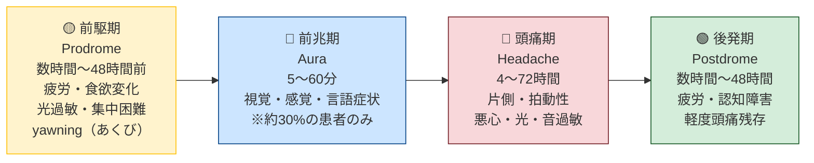
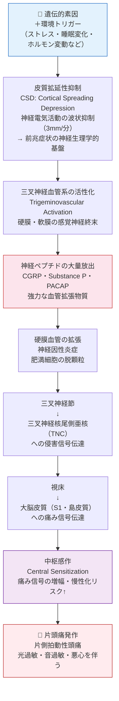
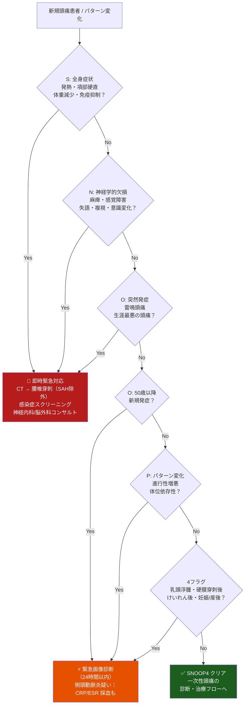
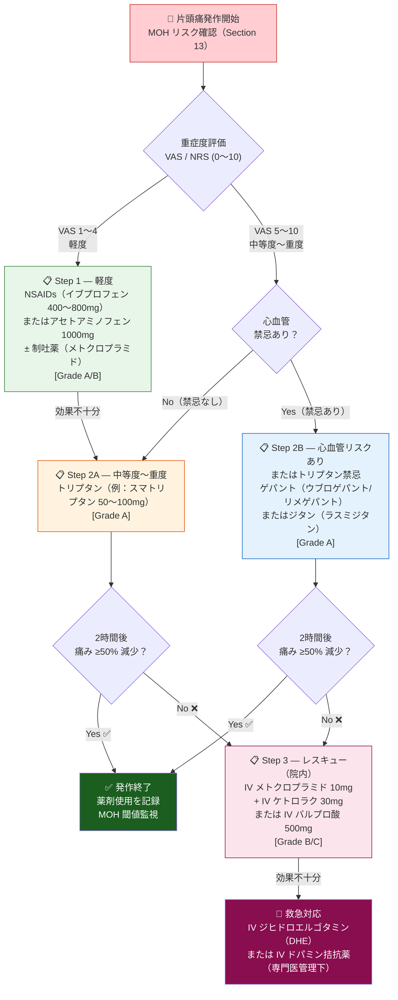
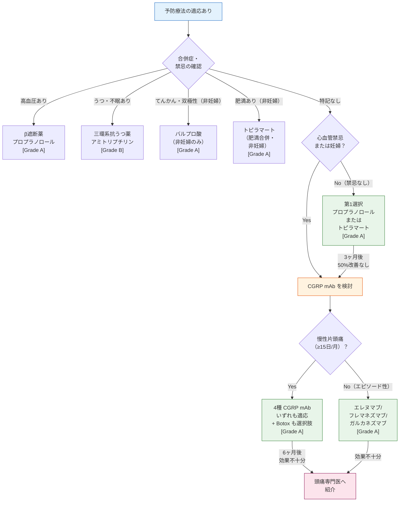
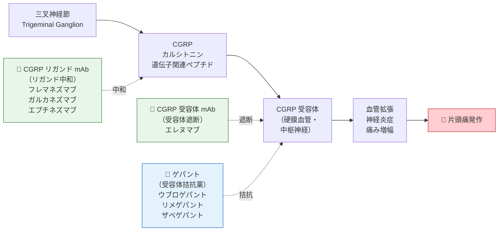
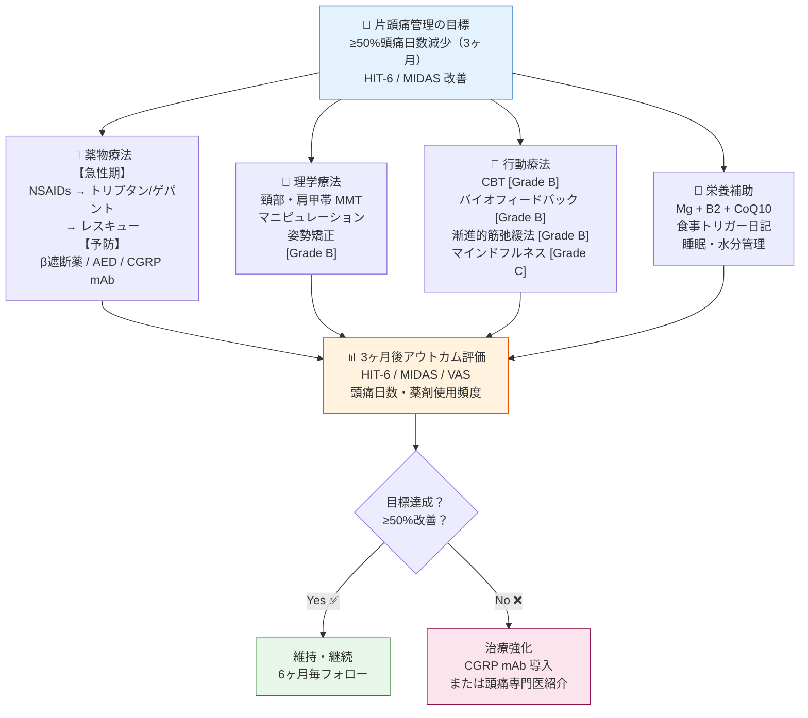
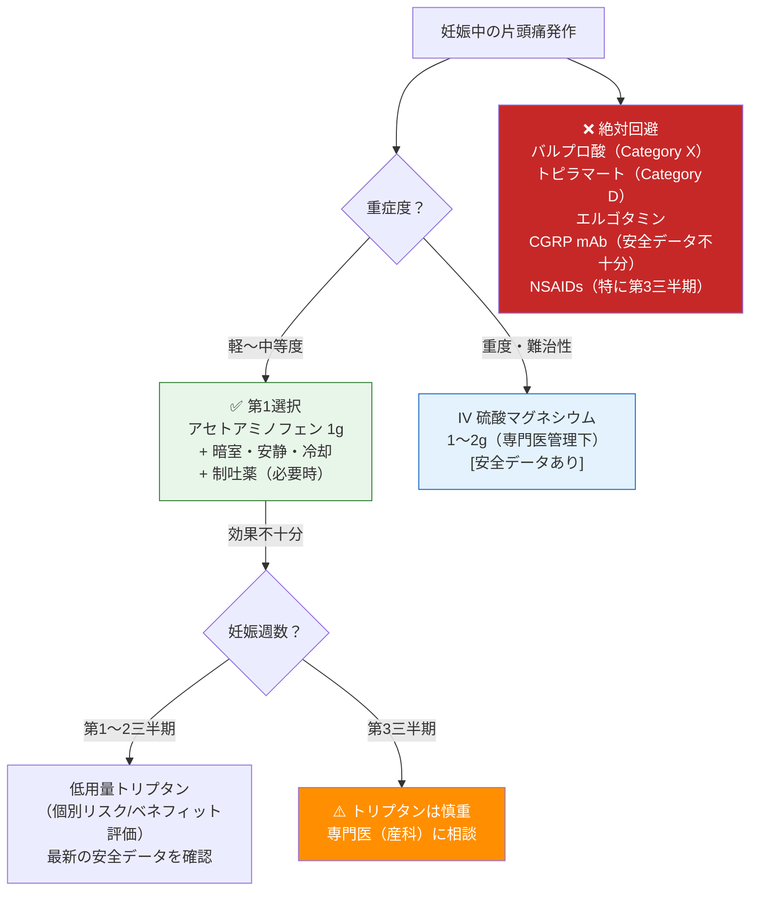
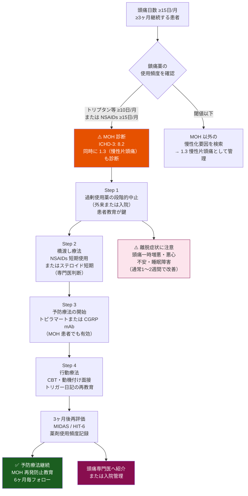

# 🧠 片頭痛（Migraine）完全ガイド

### 国際エビデンス（ICHD-3 / AAN / EHF / IHS 2024）に基づく包括的解説

---

> **⚠️ Academic Disclaimer（学術免責事項）**
>
> 本資料は**学術・教育・研究目的のみ**を対象としています。すべての内容は、資格を持つ医療専門家による臨床適用前のレビューが必要です。本資料は個人的な医療アドバイス、診断、または処方を提供するものではありません。

---

## 📋 目次

| # | セクション |
|---|------------|
| 1 | 片頭痛とは何か — 基礎概念 |
| 2 | 疫学・世界的疾病負荷 |
| 3 | 病態生理学 — なぜ頭痛が起きるのか |
| 4 | ICHD-3 分類・診断基準 |
| 5 | SNOOP4 レッドフラグスクリーニング |
| 6 | 急性期治療 |
| 7 | 予防療法 |
| 8 | CGRP 経路と最新治療薬 |
| 9 | 栄養補助療法（サプリメント） |
| 10 | 多モーダル統合アプローチ |
| 11 | アウトカム評価ツール |
| 12 | 特殊集団への対応 |
| 13 | 薬物乱用頭痛（MOH） |
| 14 | 参考文献・公式リソース |

---

## 1. 片頭痛とは何か — 基礎概念

片頭痛（Migraine）は、単なる「強い頭痛」ではなく、**神経系を中心とする複雑な神経血管疾患**です。世界保健機関（WHO）は片頭痛を**世界で最も障害を引き起こす疾患の上位**（15〜49歳の年齢層では第1位）と位置づけています。

### 1-1. 片頭痛の4つの病期

> ⚠️ **重要**: 前兆（Aura）は**全患者の約30%**にのみ見られます。前兆がない場合でも片頭痛と診断されます。

### 1-2. 前兆（Aura）の種類

| 前兆の種類 | 症状の例 | 持続時間 | 頻度 |
|-----------|---------|---------|------|
| **視覚性前兆**（最多） | ジグザグ光・閃輝暗点・視野欠損 | 5〜60分 | 全Aura患者の>90% |
| **感覚性前兆** | 顔・手のしびれ・ちくちく感 | 5〜60分 | 約30〜40% |
| **言語性前兆** | 言葉が出にくい・失語 | 5〜60分 | 約10〜20% |
| **運動性前兆**（片麻痺性） | 片側の筋力低下（完全可逆性） | 5〜72時間 | 稀 |
| **脳幹性前兆** | めまい・複視・構音障害 | 5〜60分 | 稀 |

---

## 2. 疫学・世界的疾病負荷

### 2-1. 主要な疫学データ

| 指標 | データ |
|------|--------|
| 世界有病率 | 約 **15%**（約11億人） |
| 女性：男性比 | 約 **3:1**（エストロゲンの関与） |
| 好発年齢 | **25〜55歳**（生産年齢層） |
| 慢性片頭痛への移行率 | 年間約 **2.5%** がエピソード性→慢性化 |
| 障害調整生命年（DALY）ランキング | WHO 神経疾患中 **第1位** |
| 年間経済損失（米国） | 約 **360億ドル**（医療費＋生産性損失） |
| 未診断・未治療率 | 先進国でも約 **50%** が適切な治療を受けていない |

> 📌 **ソース**: [GBD 2019 — Lancet Neurology](https://www.thelancet.com/journals/laneur/article/PIIS1474-4422(20)30407-2/fulltext)
> 📌 **WHO**: [Headache Disorders Fact Sheet](https://www.who.int/news-room/fact-sheets/detail/headache-disorders)

### 2-2. 有病率の年齢・性別分布

| 年齢層 | 男性有病率 | 女性有病率 | 特記事項 |
|--------|----------|----------|---------|
| 小児（<12歳） | 約4〜7% | 約4〜7% | 性差なし（思春期前） |
| 青年期（12〜18歳） | 約7〜10% | 約14〜18% | 女性優位が始まる |
| 成人（25〜45歳） | 約6〜8% | 約18〜25% | **ピーク有病率** |
| 中高年（>55歳） | 約4〜5% | 約11〜15% | 閉経後に女性は減少傾向 |

---

## 3. 病態生理学 — なぜ頭痛が起きるのか

### 3-1. 主要な病態生理カスケード

### 3-2. CGRP（カルシトニン遺伝子関連ペプチド）の役割

CGRPは片頭痛研究における**パラダイムシフト**をもたらした神経ペプチドです。

| 特性 | 詳細 |
|------|------|
| **産生部位** | 三叉神経節・脊髄後角・脳幹 |
| **主な作用** | 強力な脳血管拡張、神経炎症促進、痛み感受性亢進 |
| **発作中の血中濃度** | 健常者の **2〜4倍** に上昇 |
| **治療標的①** | 受容体拮抗（ゲパント：gepants） |
| **治療標的②** | リガンド or 受容体中和（モノクローナル抗体：mAbs） |
| **臨床的意義** | **血管収縮作用なし** → 心血管安全性が高い |

> 📌 **ソース**: [EHF CGRP mAbs ガイドライン 2022 (PMC)](https://www.ncbi.nlm.nih.gov/pmc/articles/PMC9188162/)

### 3-3. 皮質拡延性抑制（CSD）とは

CSDは**前兆（Aura）の神経生理学的基盤**であり、以下のメカニズムで生じます。

| ステップ | 内容 |
|---------|------|
| ① 脱分極波 | 神経・グリア細胞の一過性脱分極が皮質を波状に伝播（約3mm/分） |
| ② 電気的沈黙 | 神経活動の一時的抑制（spreading depression） |
| ③ 視覚症状 | 視覚野での CSD → 閃輝暗点・視野欠損 |
| ④ 三叉神経活性化 | CSD が三叉神経を刺激 → 頭痛発作の引き金 |
| ⑤ 回復 | 数分〜60分で正常化（可逆性）|

---

## 4. ICHD-3 分類・診断基準

### 4-1. 主要な分類コード一覧

| ICHD-3 コード | 分類名 | 定義の概要 |
|--------------|--------|-----------|
| **1.1** | 前兆のない片頭痛 | 4〜72時間の頭痛、ICHD-3 A〜E 基準を満たす |
| **1.2** | 前兆のある片頭痛 | 上記 ＋ 可逆的な神経症状（Aura）≥2回 |
| **1.2.1** | 典型的前兆を伴う片頭痛 | 視覚・感覚・言語前兆のいずれか |
| **1.2.2** | 脳幹性前兆を伴う片頭痛 | めまい・複視・構音障害 |
| **1.2.3** | 片麻痺性片頭痛 | 運動性前兆（完全可逆性）|
| **1.3** | 慢性片頭痛 | ≥15日/月 かつ ≥3ヶ月、うち≥8日が片頭痛基準 |
| **2.1** | まれなエピソード性緊張型頭痛 | <1日/月 |
| **2.2** | 頻発性エピソード性緊張型頭痛 | 1〜14日/月 |
| **2.3** | 慢性緊張型頭痛 | ≥15日/月 |
| **3.1** | エピソード性群発頭痛 | 群発期に発生 |
| **3.2** | 慢性群発頭痛 | 1年以上実質的な寛解なし |
| **8.2** | 薬物乱用頭痛（MOH） | 鎮痛薬過剰使用による二次性頭痛 |
| **11.2** | 頸原性頭痛 | 頸部疾患に起因する頭痛 |

> 📌 **ソース**: [ICHD-3 公式サイト](https://ichd-3.org/) | [ICHD-3 全文 PDF](https://ichd-3.org/wp-content/uploads/2018/01/The-International-Classification-of-Headache-Disorders-3rd-Edition-2018.pdf)
>
> ℹ️ **ICHD-4**: 2024年に作業版（Work in Progress）が公開されており、いくつかの診断基準が更新予定。最新動向は [IHS 分類委員会](https://ihs-headache.org/en/about-ihs/standing-committees/classification/) を参照。

### 4-2. 前兆のない片頭痛（ICHD-3: 1.1）正式診断基準

| 基準 | 内容 |
|------|------|
| **A** | 基準 B〜D を満たす発作が **≥5回** |
| **B** | 頭痛持続時間 **4〜72時間**（未治療または治療が無効の場合） |
| **C** | 以下の特徴の **≥2項目**: ①片側性 ②拍動性 ③中等度〜重度 ④日常動作で増悪 |
| **D** | 頭痛中の **≥1項目**: ①悪心/嘔吐 ②光過敏 **かつ** 音過敏 |
| **E** | 他の疾患によって説明されない |

### 4-3. 診断分類フローチャート

```mermaid
flowchart TD
    Start["頭痛患者が来院"]
    S4{"SNOOP4\nレッドフラグ\nスクリーニング\n（Section 5 参照）"}
    Imaging["🚨 緊急画像診断\nCT / MRI\n二次性頭痛を除外\n（要専門医）"]
    Freq{"頭痛日数/月？"}
    Chronic["慢性頭痛カテゴリーへ"]
    Type{"頭痛の特性確認\n（ICHD-3 A〜E基準）"}
    P{"拍動性・片側性\n4〜72時間\n悪心・光過敏\n日常動作で増悪？"}
    AuraQ{"前兆\n（Aura）あり？"}
    M11["ICHD-3 1.1\n前兆のない片頭痛"]
    M12["ICHD-3 1.2\n前兆のある片頭痛"]
    TTH["ICHD-3 2.x\n緊張型頭痛\n（圧迫性・両側性・\n軽〜中等度）"]
    Cluster["ICHD-3 3.x\n群発頭痛\n（一側眼窩周囲・\n激烈・自律症状）"]
    MOH{"MOH評価\n（薬剤過剰使用？）"}
    CM_MOH["ICHD-3 1.3 + 8.2\n慢性片頭痛 + MOH"]
    CM["ICHD-3 1.3\n慢性片頭痛"]

    Start --> S4
    S4 -- "🚨 フラグあり" --> Imaging
    S4 -- "✅ クリア" --> Freq
    Freq -- "≥15日/月 ≥3ヶ月" --> Chronic
    Freq -- "<15日/月" --> Type
    Type --> P
    P -- "≥2項目該当" --> AuraQ
    P -- "圧迫性・両側性" --> TTH
    P -- "群発パターン" --> Cluster
    AuraQ -- "なし" --> M11
    AuraQ -- "あり (≥2回)" --> M12
    Chronic --> MOH
    MOH -- "Yes" --> CM_MOH
    MOH -- "No" --> CM

    style Imaging fill:#c62828,color:#ffffff
    style M11 fill:#e8f5e9,stroke:#2e7d32
    style M12 fill:#e8f5e9,stroke:#2e7d32
    style CM_MOH fill:#fce4ec,stroke:#880e4f
    style TTH fill:#fff9c4,stroke:#f9a825
    style Cluster fill:#fff9c4,stroke:#f9a825
```

---

## 5. SNOOP4 レッドフラグスクリーニング

> ⚠️ **最重要**: 以下のいずれか1つでも存在する場合、一次性頭痛の治療を開始する**前に**緊急神経画像診断（CT/MRI）が**必須**です。命に関わる二次性頭痛を見逃さないための安全網です。

### 5-1. SNOOP4 レッドフラグ詳細

| 記号 | 英語 | 意味 | 具体的な症状・状況 | 疑われる疾患 |
|------|------|------|------------------|-------------|
| **S** | Systemic | 全身症状 | 発熱・項部硬直・体重減少・免疫抑制・悪性腫瘍既往 | 細菌性髄膜炎・脳転移・全身感染症 |
| **N** | Neurological | 神経学的欠損 | 運動麻痺・感覚障害・失語・複視・意識障害・認知変化 | 脳卒中・脳腫瘍・硬膜下血腫 |
| **O** | Onset sudden | 突然発症 | 「生涯最悪の頭痛」・雷鳴頭痛（thunderclap headache） | **くも膜下出血（SAH）** |
| **O** | Over age 50 | 50歳以降 | 50歳以降の新規頭痛発症 | 側頭動脈炎・頭蓋内病変 |
| **P** | Pattern change | パターン変化 | 進行性増悪・外傷後新規発症・体位変化で変動（仰臥位増悪→ICP↑、起立位増悪→低ICP）| 頭蓋内圧亢進・低髄液圧症 |
| **4** | 4つの追加フラグ | 複合フラグ | ①乳頭浮腫 ②硬膜穿刺後 ③けいれん後 ④妊娠/産後 | 緑内障・ICP亢進・脳静脈洞血栓症・PRES |

### 5-2. SNOOP4 スクリーニングフローチャート

---

## 6. 急性期治療

### 6-1. 急性期治療薬の全体比較

| 薬剤クラス | 代表薬（用量） | 主な機序 | エビデンス | MOH リスク | 心血管禁忌 |
|-----------|-------------|---------|-----------|-----------|-----------|
| 単純鎮痛薬 | アセトアミノフェン 1000mg | 中枢性 COX 阻害 | Grade B | ≥15日/月 | なし |
| NSAIDs | イブプロフェン 400〜800mg | COX-1/2 阻害 | **Grade A** | ≥15日/月 | 胃腸障害・腎機能 |
| NSAIDs（急性期） | ナプロキセン 500〜1000mg | COX-1/2 阻害 | Grade A | ≥15日/月 | 同上 |
| トリプタン | スマトリプタン 50〜100mg | 5-HT₁B/₁D 作動 | **Grade A** | ≥10日/月 | ⚠️ CAD・高血圧・脳卒中既往 |
| ゲパント | ウブロゲパント 50〜100mg | CGRP 受容体拮抗 | **Grade A** | 低リスク | ✅ なし |
| ゲパント | リメゲパント 75mg | CGRP 受容体拮抗 | **Grade A** | 低リスク | ✅ なし |
| ゲパント（点鼻） | ザベゲパント 10mg | CGRP 受容体拮抗 | **Grade A** | 低リスク | ✅ なし |
| ジタン | ラスミジタン 50〜200mg | 5-HT₁F 選択的作動 | **Grade A** | 未確定 | ✅ なし |
| 麦角アルカロイド | エルゴタミン | 非選択的血管収縮 | Grade B | ≥10日/月 | ⚠️ 強い禁忌多数 |
| 制吐薬（補助） | メトクロプラミド 10mg | D₂ 受容体拮抗 | Grade B | なし | なし |

> 📌 **ソース**: [IHS 急性期治療推奨 2024（Cephalalgia 全文）](https://journals.sagepub.com/doi/10.1177/03331024241252666)

### 6-2. 急性期治療ステップフローチャート

### 6-3. トリプタン7種の特性比較

| トリプタン | 主な投与経路 | 用量 | T_max | 半減期 | 特徴 |
|-----------|-----------|------|-------|-------|------|
| スマトリプタン | 経口・皮下注・点鼻 | 50〜100mg | 1〜2h | 2h | 最多研究・皮下注が最速 |
| リザトリプタン | 経口（口腔内崩壊錠） | 5〜10mg | 1〜1.5h | 2〜3h | 速効性・口腔内崩壊錠が便利 |
| エレトリプタン | 経口 | 20〜40mg | 1.5〜2h | 4〜5h | 強力・再燃が少ない |
| ナラトリプタン | 経口 | 2.5mg | 2〜3h | 6h | 緩効性・再燃少・副作用少 |
| ゾルミトリプタン | 経口・点鼻 | 2.5〜5mg | 1〜2h | 3h | 点鼻剤は吸収が速い |
| フロバトリプタン | 経口 | 2.5mg | 2〜4h | **26h** | 最長半減期・再燃リスク低 |
| アルモトリプタン | 経口 | 12.5mg | 1〜3h | 3〜4h | 耐容性良好・副作用少 |

### 6-4. トリプタンの主要禁忌・相互作用

> ⚠️ **これらは必ずチェックしてください**

| カテゴリー | 内容 |
|-----------|------|
| **絶対禁忌** | 冠動脈疾患・脳卒中/TIA 既往・コントロール不良高血圧・片麻痺性/脳幹性片頭痛・血管攣縮性狭心症 |
| **MAO-I との併用** | **絶対禁忌**（セロトニン症候群の重篤リスク） |
| **SSRIs/SNRIs との併用** | セロトニン症候群リスク（絶対禁忌ではないが要モニタリング） |
| **エルゴタミンとの同日使用** | 禁忌（24時間以上の間隔が必要） |

---

## 7. 予防療法

### 7-1. 予防療法の適応基準

以下の**いずれか1つ**に該当する場合に予防療法を検討します。

| 適応基準 | 閾値 |
|---------|------|
| 発作頻度 | **≥4回/月** |
| 頭痛日数 | **≥8日/月** |
| 重大な機能障害 | HIT-6 **≥60** または MIDAS **≥21** |
| 急性期治療の失敗 | 2種類以上の急性期治療が無効 |
| 禁忌 | 急性期治療薬すべてに禁忌あり |
| 特別な病型 | 片麻痺性片頭痛・脳幹性前兆・片頭痛性梗塞リスク |

### 7-2. 予防薬の比較（エビデンスグレード付き）

| 薬剤 | 用量/日 | エビデンスグレード | NNT（50%減少） | 主な副作用 | 禁忌 |
|------|--------|-----------------|--------------|----------|------|
| **プロプラノロール** | 40〜240mg | **Grade A** (AAN) | 3.5〜4.5 | 疲労・低血圧・徐脈・うつ | 喘息・COPD・糖尿病（低血糖マスク） |
| **トピラマート** | 50〜200mg | **Grade A** (AAN) | 3.5〜4.0 | 認知障害・腎結石・体重減少・感覚異常 | **妊娠（Category D）** |
| **バルプロ酸** | 500〜1500mg | **Grade A** (AAN) | 3.0〜4.0 | 体重増加・脱毛・振戦・催奇形性 | **妊娠（Category X・REMS）** |
| **アミトリプチリン** | 10〜150mg | **Grade B** (AAN) | 3.5〜5.0 | 眠気・口渇・体重増加・心伝導障害 | 緑内障・不整脈・MAO-I |
| **ベンラファキシン** | 75〜150mg | **Grade B** (AAN) | 4.0〜5.0 | 悪心・血圧上昇・発汗 | MAO-I 使用中 |
| **ボツリヌストキシン A** | 155〜195単位（IM） | **Grade A**（慢性片頭痛のみ） | 4.5〜6.0 | 注射部位痛・頸部脱力・眼瞼下垂 | 筋神経接合部疾患 |
| **エレヌマブ（CGRP mAb）** | 70〜140mg SC 月1回 | **Grade A** | 3.0〜4.5 | 注射部位反応・便秘 | 妊娠/授乳：データ不十分 |
| **フレマネズマブ（CGRP mAb）** | 225mg 月1回 または 675mg 四半期 SC | **Grade A** | 3.0〜4.0 | 注射部位反応 | 同上 |
| **ガルカネズマブ（CGRP mAb）** | 初回240mg → 120mg 月1回 SC | **Grade A** | 3.5〜4.5 | 注射部位反応 | 同上 |
| **エプチネズマブ（CGRP mAb）** | 100〜300mg IV 3ヶ月毎 | **Grade A** | 3.0〜4.0 | 過敏反応（IV）・上気道感染 | 同上 |

> 📌 **ソース**: [AAN/AHS 片頭痛予防ガイドライン](https://www.aan.com/guidelines/home/getguidelinecontent/545) | [AAN 2024 ドラフト](https://www.aan.com/siteassets/home-page/policy-and-guidelines/guidelines/guidelines-and-measures-open-for-public-comment/24-pharmacologic-treatment-for-migraine-prevention-in-adults_draft_08-14-2024.pdf)

### 7-3. 予防療法選択フローチャート

### 7-4. ボツリヌストキシン A（PREEMPT プロトコル）

**適応**: **慢性片頭痛（≥15頭痛日/月）のみ** — エピソード性片頭痛には適応外

| パラメーター | 詳細 |
|------------|------|
| 用量 | 155〜195単位 |
| 注射部位 | 前頭・側頭・後頭・頸部・肩部（31〜39箇所） |
| 投与間隔 | **12週ごと** |
| 効果発現 | 2〜4週 |
| ≥50%改善達成率 | 約60% |
| エビデンスグレード | **Grade A**（慢性片頭痛のみ） |

> 📌 **ソース**: [Cochrane ボツリヌストキシン慢性片頭痛レビュー](https://www.cochranelibrary.com/cdsr/doi/10.1002/14651858.CD011914)

---

## 8. CGRP 経路と最新治療薬

### 8-1. CGRP 経路の全体像と治療介入点

### 8-2. CGRP mAb（モノクローナル抗体）4剤比較

| 薬剤名 | 標的 | 用法用量 | 投与経路 | エピソード性 | 慢性 | 群発頭痛 |
|--------|------|---------|---------|:-----------:|:---:|:-------:|
| エレヌマブ（Aimovig） | CGRP **受容体** | 70〜140mg 月1回 | 皮下注 | ✅ | ✅ | — |
| フレマネズマブ（Ajovy） | CGRP **リガンド** | 225mg 月1回 または 675mg 四半期 | 皮下注 | ✅ | ✅ | — |
| ガルカネズマブ（Emgality） | CGRP **リガンド** | 初回240mg → 120mg 月1回 | 皮下注 | ✅ | ✅ | ✅ |
| エプチネズマブ（Vyepti） | CGRP **リガンド** | 100〜300mg 3ヶ月毎 | **静脈内（IV）** | ✅ | ✅ | — |

> ⚠️ **重要な安全情報**: CGRP mAb は妊娠・授乳中の安全データが不十分なため、推奨されません。免疫抑制剤との相互作用データも限定的です。

### 8-3. ゲパント（Gepants）3剤比較

| 薬剤名 | 用量 | 用途 | 剤形 | 特徴 |
|--------|------|------|------|------|
| ウブロゲパント（Ubrelvy） | 50〜100mg | **急性期のみ** | 錠剤 | 経口・30分で効果発現 |
| リメゲパント（Nurtec ODT） | 75mg | **急性期 + 予防**（隔日） | 口腔内崩壊錠 | 唯一の双方向適応 |
| ザベゲパント（Zavzpret） | 10mg | **急性期のみ** | **点鼻剤** | 最速吸収・消化器症状回避 |

### 8-4. 5-HT₁F アゴニスト（ジタン）

| 薬剤名 | 用量 | 機序 | 心血管禁忌 | 重要な注意点 |
|--------|------|------|-----------|------------|
| ラスミジタン（Reyvow） | 50〜200mg | 5-HT₁F 選択的（血管収縮なし） | なし（心疾患患者にも使用可） | **投与後8時間は運転・機械操作禁止**（CNS 鎮静） |

### 8-5. 従来薬 vs 新規 CGRP 薬の比較

| 比較項目 | トリプタン | ゲパント | ジタン | CGRP mAb（予防） |
|---------|-----------|---------|-------|----------------|
| 主な用途 | 急性期 | 急性期（一部予防） | 急性期 | **予防** |
| 機序 | 5-HT₁B/₁D 作動 | CGRP 受容体拮抗 | 5-HT₁F 作動 | CGRP 中和/受容体遮断 |
| 血管収縮 | **あり** | なし | なし | なし |
| 心血管禁忌 | ⚠️ あり | ✅ なし | ✅ なし | ✅ なし |
| MOH リスク | 高（≥10日/月） | 低（データ蓄積中） | 低（データ蓄積中） | なし |
| 2h 無痛率 | 約25〜40% | 約20〜25% | 約28〜38% | N/A（予防指標） |

> 📌 **ソース**: [EHF CGRP mAbs ガイドライン 2022](https://www.ncbi.nlm.nih.gov/pmc/articles/PMC9188162/) | [IHS 急性期推奨 2024](https://journals.sagepub.com/doi/10.1177/03331024241252666)

---

## 9. 栄養補助療法（サプリメント）

> ⚠️ 本セクションの推奨は国際ガイドラインに基づくエビデンスグレード付き情報です。補充療法は薬物療法の**補完的手段**であり、単独での代替治療ではありません。医療専門家への相談なしに使用しないでください。

### 9-1. エビデンス別サプリメント一覧

| サプリメント | 推奨用量/日 | エビデンスグレード | 推定機序 | 主な注意事項 |
|------------|-----------|-----------------|---------|------------|
| **マグネシウム**（グリシン酸塩/クエン酸塩推奨）| 400〜600mg | **Grade A/B** (AAN/EHF) | ミトコンドリア機能・CSD 抑制・NMDA 受容体調節・血小板機能 | 下痢（用量依存）・腎機能低下患者は慎重；目標血清 Mg ≥0.85 mmol/L |
| **リボフラビン（ビタミン B2）** | 400mg | **Grade A/B** (AAN) | ミトコンドリア ETC Complex I 最適化・エネルギー代謝改善 | 尿が黄変（無害）；長期高用量でも安全報告あり |
| **CoQ10**（ユビキノール推奨）| 300mg | **Grade B** (EHF) | ETC Complex I/III 電子伝達サポート・酸化ストレス軽減 | スタチン服用者は補充推奨（スタチンがCoQ10 を低下）；出血傾向に注意 |
| **メラトニン** | 3mg（就寝前） | **Grade C** | 抗酸化・概日リズム調節・5-HT 合成サポート | 睡眠障害合併例に特に有効；日中の眠気 |
| **α-リポ酸** | 600mg | **Grade C** | 抗酸化・神経保護・ミトコンドリア機能 | 低血糖（糖尿病患者は要注意）；チアミン欠乏に注意 |
| **オメガ3脂肪酸**（EPA+DHA）| 1〜3g | **Grade C** | 抗神経炎症・プロスタグランジン調節 | **>3g で抗凝固薬との出血リスク↑** → INR モニタリング |
| **ジンジャー（ショウガ）エキス** | 250mg | **Grade C** | 急性悪心緩和・軽症発作の補助 | 抗血小板薬との相互作用；術前は中止 |

### 9-2. 注意が必要なサプリメント

| サプリメント | 推奨グレード | 重要な安全情報 |
|------------|------------|-------------|
| **フィーバーフュー**（MIG-99エキス）| Grade C（エビデンス混在） | ワルファリン/抗血小板薬と**出血リスク↑**；術前2週間で中止；肝酵素モニタリング |
| **バターバー**（プコエキス）| Grade C（PA-free 認定品のみ）| **肝毒性リスク**：未精製品（未認定品）は絶対に使用しない；定期的な LFT 測定が必要；Petadolex® 等 PA-free 認定品のみ |
| **ビタミン D** | Grade C（欠乏確認後のみ）| 血清 <30 ng/mL の欠乏が確認された場合のみ補充；過剰補充で高カルシウム血症 |
| **高用量ビタミン B6** | **禁忌** | **>200mg/日で末梢神経障害リスク** — この用量は推奨しない |

### 9-3. 食事性トリガー管理

系統的なトリガー管理には**最低30日間の頭痛日記**の記録が必要です。トリガーは個人差が大きく、全例に共通するわけではありません。

| トリガー種別 | 具体例 | 推奨対策 |
|------------|--------|---------|
| **アミン類** | チラミン（熟成チーズ・発酵食品）・ヒスタミン（赤ワイン・加工肉） | 低アミン食の試行（4〜8週）|
| **食品添加物** | 亜硝酸塩（ハム・ソーセージ）・MSG・アスパルテーム | 成分表示の確認と回避 |
| **カフェイン** | コーヒー・エナジードリンク（**離脱でリバウンド頭痛**）| 段階的減量（急な中断は禁忌）|
| **アルコール** | 特に赤ワイン・ビール | 個人の感受性を日記で確認 |
| **行動的要因** | 食事スキップ・脱水・睡眠不規則（過剰/不足）| 規則的な食事・水分 2L/日・睡眠リズム固定 |
| **ホルモン変動** | 月経前後（エストロゲン低下） | ホルモン日記・産婦人科連携 |
| **感覚刺激** | 強い光・騒音・臭い | 環境調整・サングラス・耳栓 |

---

## 10. 多モーダル統合アプローチ

### 10-1. 統合治療の全体像

### 10-2. 行動・非薬物療法のエビデンスサマリー

| 療法 | エビデンスグレード | 概要効果量 | 最適な対象患者 |
|------|-----------------|----------|-------------|
| **認知行動療法（CBT）** | Grade B (AAN) | 薬物療法と同等 | 不安/うつ合併・MOH 回避が必要な患者 |
| **バイオフィードバック** | Grade B (AAN) | NNT ≈ 4〜5 | ストレス誘発型・薬剤忌避患者 |
| **漸進的筋弛緩法** | Grade B (AAN) | 3ヶ月で40〜50%改善 | 全般的ストレス・緊張型合併 |
| **マインドフルネス（MBSR）** | Grade C | 痛み感受性・破局化思考を低下 | 慢性化・中枢感作が進んだ症例 |
| **理学療法（頸部）** | Grade B | 頸原性要因のある症例に特に有効 | 頸部痛合併型・姿勢不良 |
| **鍼治療** | Grade B (Cochrane SR) | トリプタンに非劣性のエビデンスあり | 薬剤を避けたい患者・妊婦 |

> 📌 **ソース**: [Cochrane 心理療法レビュー](https://www.cochranelibrary.com/cdsr/doi/10.1002/14651858.CD012295.pub2/full)

---

## 11. アウトカム評価ツール

### 11-1. 標準化評価ツール一覧

| ツール | 正式名称 | スコア範囲 | 重症閾値 | 測定内容 | 使用タイミング |
|--------|---------|-----------|---------|---------|-------------|
| **HIT-6** | Headache Impact Test | 36〜78点 | **≥60 = 重度障害** | 日常生活・仕事・社会活動への影響 | 治療前・3ヶ月毎 |
| **MIDAS** | Migraine Disability Assessment | 0〜∞ | **≥21 = Grade IV 重度** | 過去3ヶ月の欠勤/欠席日数 | 治療前・3ヶ月毎 |
| **VAS/NRS** | Visual/Numerical Rating Scale | 0〜10 | 7以上 = 重度 | 発作時の疼痛強度 | 発作毎（発症時・2h後） |
| **PGIC** | Patient Global Impression of Change | 1〜7点 | 6〜7 = 著明改善 | 患者による総合改善度評価 | 3〜6ヶ月後 |
| **MSQ v2.1** | Migraine-Specific Quality of Life | 0〜100点 | 高スコア = 高 QOL | 機能的/制限的/感情的 QOL | 治療前後 |

### 11-2. MIDAS スコアの解釈と対応

| MIDAS スコア | Grade | 障害の程度 | 推奨アクション |
|------------|-------|-----------|-------------|
| 0〜5点 | Grade I | 軽度または障害なし | 急性期治療最適化・生活習慣介入 |
| 6〜10点 | Grade II | 軽度障害 | 急性期治療 + トリガー管理 |
| 11〜20点 | Grade III | 中等度障害 | 予防療法の開始を強く検討 |
| ≥21点 | **Grade IV** | **重度障害** | 予防療法 + 専門医紹介 |

### 11-3. 治療成功の定義

| エンドポイント | 目標値 |
|-------------|-------|
| 頭痛日数の減少（3ヶ月後） | **≥50% 減少** |
| HIT-6 変化 | **5点以上**の改善（MCID） |
| MIDAS Grade | **1段階以上**の改善 |
| 急性期薬使用頻度 | **MOH 閾値以下**を維持（Section 13 参照） |
| 急性期の 2h 無痛率 | **≥30%**（発作時評価） |
| QOL（MSQ） | **10点以上**の改善（MCID）|

---

## 12. 特殊集団への対応

### 12-1. 特殊集団別ガイドライン一覧

| 集団 | 急性期治療 | 予防療法 | 特別注意事項 |
|------|----------|---------|------------|
| **小児（<12歳）** | イブプロフェン 10mg/kg（第1選択）またはアセトアミノフェン 15mg/kg | プロプラノロール・アミトリプチリン（低用量）| トリプタン：12歳未満は点鼻スマトリプタンのみ一部承認；バルプロ酸は体重増加・認知への影響を考慮 |
| **青年期（12〜18歳）** | トリプタン（点鼻を含む）・NSAIDs | 上記 + トピラマート（低用量から）| バルプロ酸：体重増加・**催奇形性**について必ずカウンセリング |
| **妊娠・授乳中** | **第1選択：アセトアミノフェン**；急性重症：IV 硫酸マグネシウム 1〜2g | **可能な限り避ける**；必要な場合は β 遮断薬（低用量）| バルプロ酸/トピラマート/エルゴタミン/CGRP mAb は**禁忌または推奨外**；トリプタンは個別リスクベネフィット評価 |
| **高齢者（>65歳）** | アセトアミノフェン・低用量トリプタン（慎重に）| アミトリプチリン **10mg から開始**；β 遮断薬（起立性低血圧モニタリング）| トピラマート：**認知機能低下リスク↑**；β 遮断薬：転倒リスク・起立性低血圧に注意；SNOOP4 感度を高く保つ（悪性・血管性疾患のリスク↑） |
| **心疾患患者** | **トリプタン・エルゴタミンは禁忌** → ゲパントまたはジタン（ラスミジタン）| CGRP mAb（血管収縮作用なし、心血管的に安全）| 詳細な心血管リスク評価後に処方；NSAIDs も慎重（心不全・腎機能） |
| **生殖年齢女性（バルプロ酸使用時）** | — | **REMS 登録が必須**（米国）；避妊指導の徹底 | 予期しない妊娠に備え、他の予防薬への切り替えを積極的に検討 |

### 12-2. 妊娠中の片頭痛管理フローチャート

---

## 13. 薬物乱用頭痛（MOH）

> **ICHD-3 コード: 8.2 — Medication-Overuse Headache**

### 13-1. MOH とは — 初学者向け解説

薬物乱用頭痛（MOH）は、頭痛を治療するための鎮痛薬を**過剰に使用することで、逆説的に頭痛が増悪・慢性化する**非常に重要な合併症です。

「頭痛があるから薬を飲む → 薬を飲むと一時的に楽になる → また頭痛が来る → また薬を飲む」という**悪循環**が生じます。これは薬物依存性とは異なるメカニズムです（下降性疼痛抑制系の慢性障害）。

### 13-2. MOH リスク閾値（ICHD-3 基準）

| 薬剤クラス | 乱用の定義（使用頻度） | MOH リスクレベル |
|-----------|------------------|---------------|
| トリプタン・エルゴタミン・オピオイド | **≥10日/月 ≥3ヶ月** | 🔴 高リスク |
| 単純鎮痛薬・NSAIDs（単剤） | **≥15日/月 ≥3ヶ月** | 🟡 中リスク |
| 複合鎮痛薬（カフェイン/コデイン含有）| **≥10日/月 ≥3ヶ月** | 🔴 非常に高リスク |
| ゲパント・ジタン | 閾値データ蓄積中 | 🟢 低リスク（現時点） |

> ⚠️ **重要**: 急性期治療計画では、**毎回 MOH リスクを評価・記録**してください。

### 13-3. MOH 診断・管理フローチャート

---

## 14. 参考文献・公式リソース

> ✅ 以下はすべて国際的に認可された公式ソースです。

### 🏛️ 診断基準（ICHD-3 / IHS）

| リソース | URL |
|---------|-----|
| ICHD-3 公式サイト（全文閲覧可） | https://ichd-3.org/ |
| ICHD-3 全文 PDF（2018年版） | https://ichd-3.org/wp-content/uploads/2018/01/The-International-Classification-of-Headache-Disorders-3rd-Edition-2018.pdf |
| IHS 分類委員会（ICHD-4 最新動向含む） | https://ihs-headache.org/en/about-ihs/standing-committees/classification/ |

### 📋 臨床ガイドライン（AAN / EHF / NICE）

| 機関 | リソース | URL |
|------|---------|-----|
| AAN | Guidelines ホーム（全ガイドライン一覧） | https://www.aan.com/guidelines/ |
| AAN/AHS | 片頭痛予防ガイドライン サマリー（PDF） | https://www.aan.com/guidelines/home/getguidelinecontent/545 |
| AAN | 2024 予防療法ドラフト（公開レビュー版） | https://www.aan.com/siteassets/home-page/policy-and-guidelines/guidelines/guidelines-and-measures-open-for-public-comment/24-pharmacologic-treatment-for-migraine-prevention-in-adults_draft_08-14-2024.pdf |
| EHF | CGRP mAbs 予防療法ガイドライン 2022 (PMC 全文) | https://www.ncbi.nlm.nih.gov/pmc/articles/PMC9188162/ |
| EHF | トリプタン治療コンセンサス 2022 (Springer) | https://link.springer.com/article/10.1186/s10194-022-01502-z |
| NICE | 頭痛ガイドライン CG150（英国） | https://www.nice.org.uk/guidance/cg150 |

### 🔬 Cochrane エビデンスレビュー

| トピック | URL |
|---------|-----|
| Cochrane 頭痛レビュー検索ページ | https://www.cochranelibrary.com/search?query=headache+migraine&searchBy=3&type=cdsr |
| マグネシウム補充 片頭痛予防（2025年最新） | https://www.cochranelibrary.com/cdsr/doi/10.1002/14651858.CD016307 |
| 心理療法（CBT/バイオフィードバック） | https://www.cochranelibrary.com/cdsr/doi/10.1002/14651858.CD012295.pub2/full |
| ボツリヌストキシン 慢性片頭痛予防 | https://www.cochranelibrary.com/cdsr/doi/10.1002/14651858.CD011914 |

### 📰 急性期治療ガイドライン（IHS 2024）

| リソース | URL |
|---------|-----|
| IHS 急性期治療推奨 2024（Cephalalgia 全文） | https://journals.sagepub.com/doi/10.1177/03331024241252666 |

### 📚 専門誌・データベース

| 名称 | 用途 | URL |
|------|------|-----|
| Journal of Headache and Pain（EHF 公式誌・OA）| 最新 EHF 研究・ガイドライン | https://thejournalofheadacheandpain.biomedcentral.com/ |
| Cephalalgia（IHS 公式誌） | ICHD 改訂・臨床試験 | https://journals.sagepub.com/home/cep |
| PubMed 頭痛 RCT 専用検索 | 最新 RCT の確認 | https://pubmed.ncbi.nlm.nih.gov/?term=headache+migraine&filter=pubt.clinicaltrials |
| ClinicalTrials.gov | 進行中・完了試験の確認 | https://clinicaltrials.gov/ |

---

## 📌 クイックリファレンス

### エビデンスグレード凡例

| グレード | 定義 | 引用ガイドライン |
|---------|------|--------------|
| **Grade A** | ≥2件の一貫したクラス I RCT / 低異質性 Cochrane SR | AAN / EHF |
| **Grade B** | 1件のクラス I RCT または ≥2件のクラス II 研究 | AAN / EHF |
| **Grade C** | 1件のクラス II または ≥2件のクラス III 研究 | AAN / EHF |
| **Grade U** | 不十分または相反するエビデンス | — |
| **専門家合意** | RCT なし・ガイドライン合意のみ | IHS / EHF |

### MOH 閾値早見表

| 薬剤種別 | 閾値（月あたり使用日数） |
|---------|---------------------|
| トリプタン / エルゴタミン / オピオイド | **≥10日/月** |
| 単純鎮痛薬 / NSAIDs | **≥15日/月** |
| 複合鎮痛薬（カフェイン含有等） | **≥10日/月** |

### 予防療法開始基準早見表

| 条件 | 基準 |
|------|------|
| 発作頻度 | ≥4回/月 |
| 頭痛日数 | ≥8日/月 |
| 機能障害 | HIT-6 ≥60 または MIDAS ≥21 |

---

> 📅 **作成年**: 2025年
>
> 📖 **次回レビュー推奨**: ICHD-4 正式発行時 / AAN・IHS 年次ガイドライン更新時
>
> ⚠️ **免責事項**: 本資料は学術・教育・研究目的のみを対象としています。臨床への適用は必ず資格を持つ医療専門家の監督のもとで行ってください。本資料は個人的な医療アドバイス、診断、または処方を提供するものではありません。
