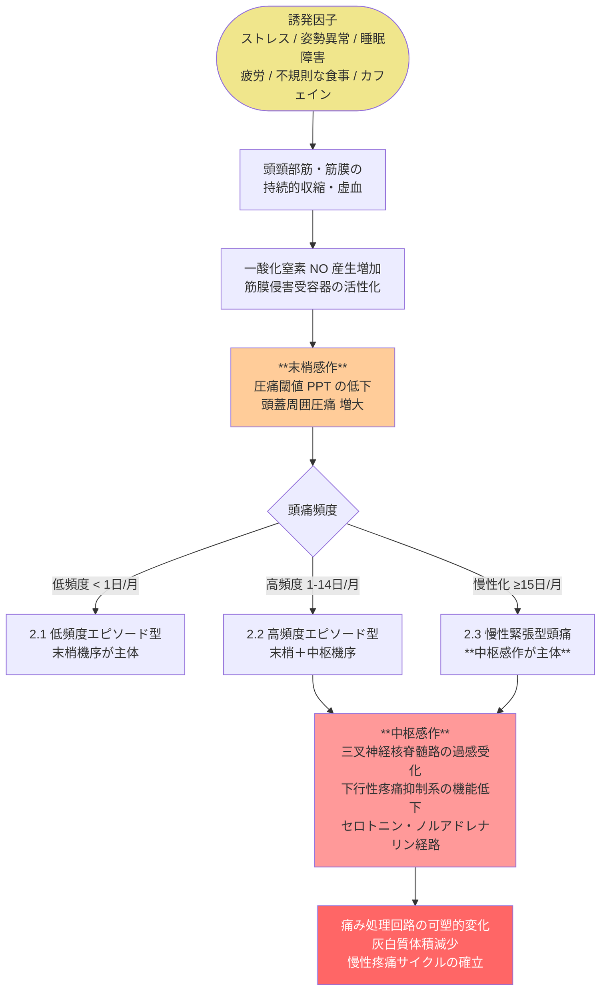
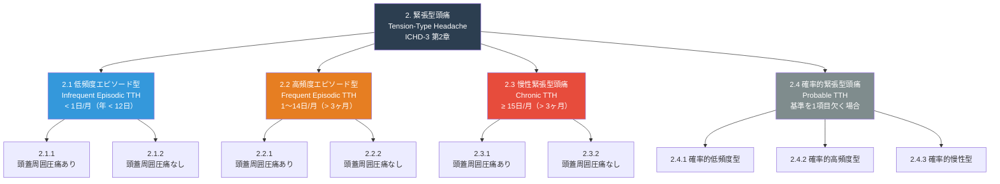
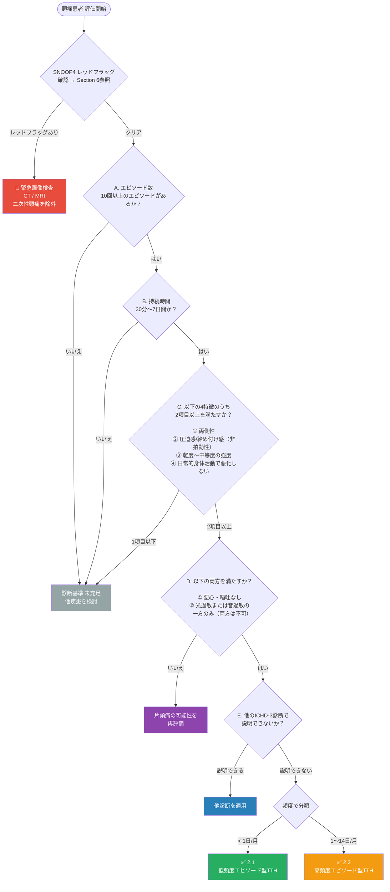
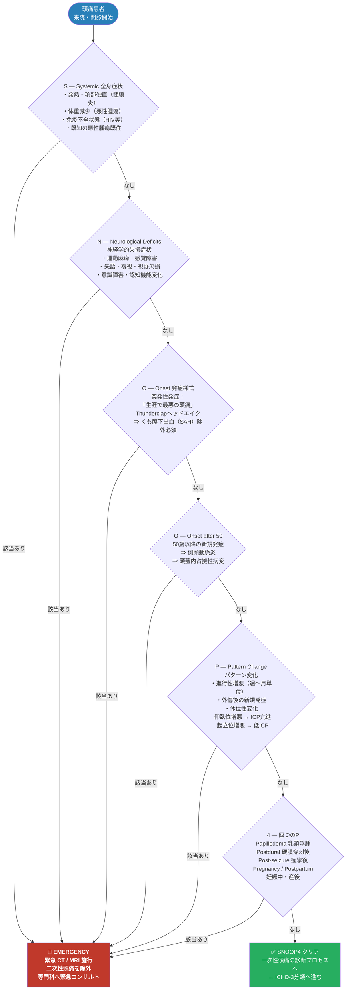
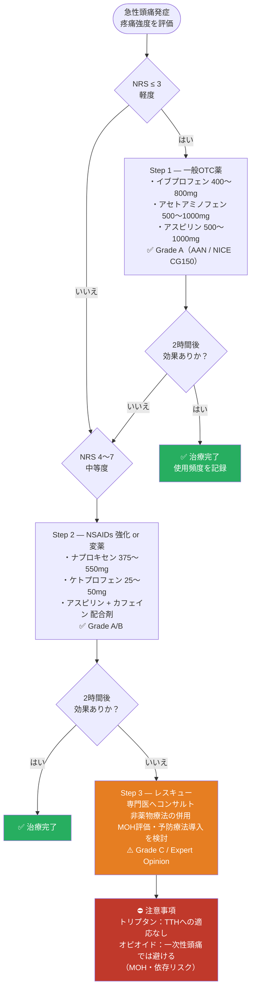
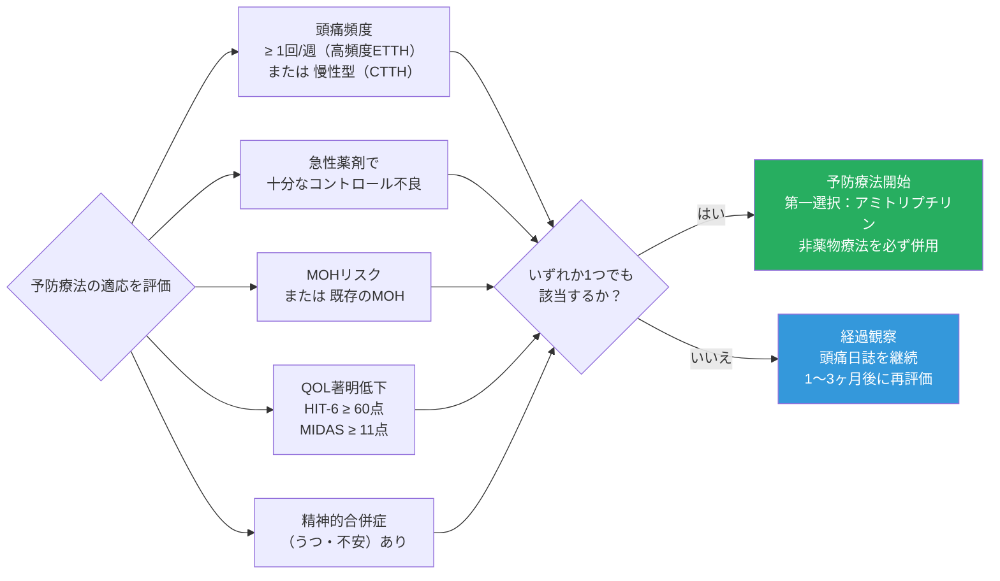
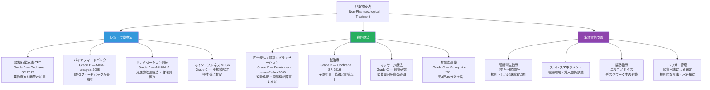
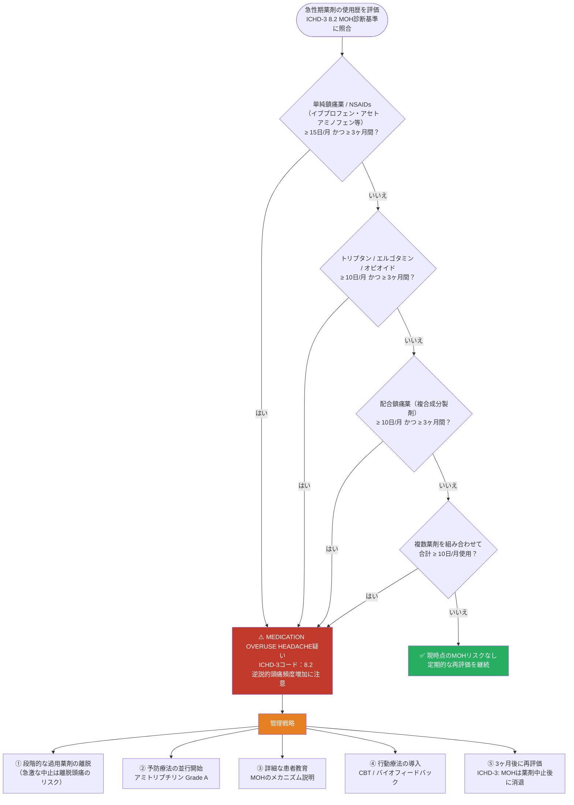

# 緊張型頭痛（Tension-Type Headache: TTH）完全ガイド

## 初学者から臨床家まで ─ 国際標準エビデンスに基づく包括的解説

> ### ⚠️ 学術免責事項（MANDATORY ACADEMIC DISCLAIMER）
> 本資料は**学術・教育・研究目的のみ**を対象としています。  
> すべての臨床応用は、資格を有する医療専門家による検討・監督のもとで行われなければなりません。  
> 本資料は個人的な医療アドバイス、診断、または処方を提供するものではありません。

---

## 目次

1. [疾患概要・定義](#1-疾患概要定義)
2. [疫学](#2-疫学)
3. [病態生理学](#3-病態生理学)
4. [ICHD-3 診断分類](#4-ichd-3-診断分類)
5. [診断基準 ステップバイステップ](#5-診断基準-ステップバイステップ)
6. [SNOOP4 レッドフラッグスクリーニング](#6-snoop4-レッドフラッグスクリーニング)
7. [鑑別診断](#7-鑑別診断)
8. [評価ツール・スコアリング](#8-評価ツールスコアリング)
9. [治療戦略](#9-治療戦略)
10. [栄養補助療法](#10-栄養補助療法)
11. [薬剤過用頭痛 (MOH) リスク評価](#11-薬剤過用頭痛-moh-リスク評価)
12. [特殊集団への対応](#12-特殊集団への対応)
13. [標準化ケーススタディ](#13-標準化ケーススタディ)
14. [エビデンス階層サマリー](#14-エビデンス階層サマリー)
15. [参考文献・URLリソース](#15-参考文献urlリソース)

---

## 1. 疾患概要・定義

緊張型頭痛（Tension-Type Headache: TTH）は、世界で最も有病率の高い一次性頭痛疾患であり、IHS（国際頭痛学会）が発行する**ICHD-3（国際頭痛分類第3版）**において第2章に分類される。

かつては「筋収縮性頭痛」「心因性頭痛」「ストレス頭痛」とも呼ばれていたが、ICHD-3では神経生物学的基盤を持つ疾患として再定義されている。

> **出典：** ICHD-3（Cephalalgia 2018; 38(1): 1–211）  
> *「以前は主に心因性と考えられていたが、ICHD-I 以降の研究は、少なくとも重症型においては神経生物学的基盤の存在を強く示唆している」*

### 特徴的な臨床像

| 項目 | 緊張型頭痛の特徴 |
|------|----------------|
| **部位** | 両側性（前頭部・頭頂部・後頭部） |
| **性状** | 圧迫感・締め付け感（非拍動性） |
| **強度** | 軽度〜中等度 |
| **持続時間** | 30分〜7日間 |
| **体動による変化** | 日常的な身体活動で**悪化しない** |
| **随伴症状** | 悪心・嘔吐**なし**；光過敏または音過敏は一方のみ許容 |

> 💡 **片頭痛との最重要鑑別ポイント：** 「非拍動性」「体動で悪化しない」「悪心なし」の3点

---

## 2. 疫学

### 世界的有病率

| 分類 | 年間有病率 | 生涯有病率 | 世界的順位 |
|------|-----------|-----------|-----------|
| 緊張型頭痛（全体） | **38〜78%** | **〜78%** | 最多の頭痛疾患 |
| 高頻度エピソード型（2.2） | 約 24% | — | — |
| 慢性緊張型頭痛（2.3） | 約 2〜3% | — | 重大な障害原因 |

**主要疫学データソース：**
- Rasmussen BK et al. *J Clin Epidemiol* 1991; 44: 1147–1157
- Stovner LJ, Jensen R. *Lancet Neurol* 2008; 7: 354–361
- Global Burden of Disease 2016: [https://www.thelancet.com/journals/laneur/article/PIIS1474-4422(18)30499-X/fulltext](https://www.thelancet.com/journals/laneur/article/PIIS1474-4422(18)30499-X/fulltext)

### 人口統計学的特徴

| 特徴 | 詳細 |
|------|------|
| **性別比** | 女性 > 男性（比率 約1.4:1） |
| **発症ピーク** | 30〜50歳代 |
| **社会経済的影響** | 慢性型はQOLと労働生産性に甚大な影響；GBD 2016で「世界第2位の障害原因疾患」 |
| **共存疾患** | うつ病・不安障害・睡眠障害との高い共存率 |

---

## 3. 病態生理学

TTHの病態生理は完全には解明されていないが、ICHD-3は「末梢性機序と中枢性機序の両方が関与する」ことを明記している。型によって主要な機序が異なる点が重要である。

### 3.1 病態生理学の統合モデル

### 3.2 主要病態機序の解説

#### ① 末梢感作（Peripheral Sensitization）— 主に 2.1/2.2型

頭蓋周囲の筋膜侵害受容器が持続的な刺激を受け活性化する。

- **一酸化窒素（NO）** の産生増加 → 血管拡張・痛み増強
- **圧痛閾値（Pressure Pain Threshold: PPT）** の低下
- 臨床的に「頭蓋周囲圧痛（pericranial tenderness）」として観察可能
- 前頭筋・側頭筋・咬筋・胸鎖乳突筋・斜方筋などの圧痛

> **根拠文献：** Bendtsen L. *Cephalalgia* 2000; 20: 486–508  
> Ashina M et al. *Lancet* 1999; 353: 287–289

#### ② 中枢感作（Central Sensitization）— 主に 2.3型

反復する末梢刺激により三叉神経系が過感受化し、中枢での痛み処理が変容する。

- 下行性疼痛抑制系（セロトニン・ノルアドレナリン）の機能低下
- 広域性痛覚過敏（generalized hyperalgesia）の出現
- CTTH（慢性型）での灰白質体積減少（Schmidt-Wilcke et al. *Neurology* 2005）

> **根拠文献：** Ashina S et al. *Cephalalgia* 2006; 26: 940–948

#### ③ 心理社会的因子（Psychosocial Factors）

- **ストレス** は最強の誘発因子であり、また慢性化の促進因子でもある
- 不安・抑うつとの**双方向関連性**（うつ病は TTH 発症リスクを増加させ、CTTH はうつ病を促進する）
- **睡眠障害：** 睡眠の質の低下は頭痛頻度と正の相関を示す

> **根拠文献：** Holroyd KA et al. *JAMA* 2001; 285: 2208–2215  
> Janke EA et al. *Pain* 2004; 111: 230–238

---

## 4. ICHD-3 診断分類

ICHD-3（2018年版）における緊張型頭痛の完全な分類体系を以下に示す。

### ICHD-3 各型の臨床的意義

| コード | 分類名 | 頻度基準 | 臨床的重要性 | 主な病態機序 |
|--------|--------|---------|-------------|------------|
| **2.1** | 低頻度エピソード型 | < 1日/月（年 < 12日） | 通常は軽症；医療介入不要なことが多い | 末梢性が主体 |
| **2.2** | 高頻度エピソード型 | 1〜14日/月（> 3ヶ月） | MOHリスク開始；予防療法を考慮 | 末梢 + 中枢 |
| **2.3** | 慢性緊張型頭痛 | ≥ 15日/月（> 3ヶ月） | 最重症；QOL著明低下；予防療法必須 | 中枢感作が主体 |
| **2.4** | 確率的TTH | 基準を1項目欠く | 他の診断除外後に使用 | — |

> **注記：** 頭蓋周囲圧痛の有無による細分類（.1 vs .2）は、主に研究目的のためICHD-3で維持されている。  
> **公式出典：** [https://ichd-3.org/2-tension-type-headache/](https://ichd-3.org/2-tension-type-headache/)

---

## 5. 診断基準 ステップバイステップ

### 5.1 エピソード型TTH（2.1 / 2.2）の診断フロー

### 5.2 慢性緊張型頭痛（2.3）の診断基準

| 基準 | 内容 |
|------|------|
| **A. 頻度** | ≥ 15日/月（> 3ヶ月以上；年 ≥ 180日） |
| **B. 持続時間** | 数時間〜持続性（上限なし） |
| **C. 頭痛の特徴** | エピソード型と同様（4項目中2項目以上） |
| **D. 随伴症状** | ①悪心は軽度なら許容（嘔吐は不可）；②光過敏または音過敏の一方のみ |
| **E. 除外診断** | 他のICHD-3診断で説明できない |

> ⚠️ **重要ポイント：** 慢性型（2.3）では「軽度の悪心」が許容されるが、エピソード型（2.1/2.2）では悪心は一切許容されない。

### 5.3 頭蓋周囲圧痛の評価方法

| 手順 | 詳細 |
|------|------|
| **検査手技** | 示指・中指による回転加圧（ペルパトメーターが推奨） |
| **評価筋** | 前頭筋・側頭筋・咬筋・外側翼突筋・胸鎖乳突筋・板状筋・僧帽筋 |
| **スコアリング** | 各筋 0〜3点（計 Total Tenderness Score: TTS） |
| **臨床意義** | 治療効果の指標；患者への説明補助に有用 |

---

## 6. SNOOP4 レッドフラッグスクリーニング

> **⚠️ すべての頭痛患者において、いかなる治療プロトコル開始前にも SNOOP4 基準を確認すること。一項目でも該当すれば神経学的緊急症として対処する。**

### SNOOP4 各項目のポイント解説

| 項目 | キーワード | 緊急度 | 想定される二次性頭痛 |
|------|-----------|--------|-------------------|
| **S** | 発熱 + 項部硬直 | 最高 | 細菌性髄膜炎・脳炎 |
| **S** | 体重減少 + 免疫不全 | 高 | 脳腫瘍・CNSリンパ腫・結核性髄膜炎 |
| **N** | 片麻痺・失語 | 最高 | 脳卒中・TIA・脳腫瘍 |
| **O（突発性）** | 雷鳴頭痛 | 最高 | くも膜下出血（致死率高）|
| **O（50歳↑）** | 側頭部疼痛 + ESR上昇 | 高 | 側頭動脈炎（失明リスク）|
| **P（体位性）** | 仰臥位悪化 | 高 | ICP亢進（脳腫瘍・水頭症）|
| **P（体位性）** | 起立位悪化 | 高 | 低髄液圧症候群 |
| **4（乳頭浮腫）** | 眼底所見 | 高 | ICP亢進疾患全般 |

---

## 7. 鑑別診断

### 主要頭痛疾患との比較

| 鑑別点 | 緊張型頭痛 | 片頭痛（前兆なし） | 群発頭痛 | 頸原性頭痛 |
|--------|-----------|-------------------|---------|-----------|
| **ICHD-3コード** | 2.1〜2.3 | 1.1 | 3.1〜3.2 | 11.2 |
| **部位** | 両側性 | 片側性（多い）| 片側眼窩周囲 | 後頭部〜頸部〜片側 |
| **性状** | 圧迫・締め付け | 拍動性 | 激烈・穿孔性 | 頸部動作で変化 |
| **強度** | 軽〜中等度 | 中〜重度 | 最重度 | 軽〜中等度 |
| **持続時間** | 30分〜7日 | 4〜72時間 | 15〜180分 | 数時間〜持続 |
| **悪心/嘔吐** | なし（CTTHは軽度可）| あり（多い）| なし | まれ |
| **光過敏** | なし/一方のみ | あり | なし | なし |
| **音過敏** | なし/一方のみ | あり | なし | なし |
| **自律神経症状** | なし | なし | 流涙・鼻漏・縮瞳 | なし |
| **体動悪化** | なし | あり（特徴的）| なし | あり（頸部）|
| **誘発因子** | ストレス・疲労・姿勢 | 多彩（ホルモン等）| アルコール・季節性 | 頸椎病変 |
| **好発年齢** | 30〜50歳代 | 15〜55歳 | 20〜40歳代（男性多）| 全年齢 |

> 💡 **最重要鑑別：** TTH と片頭痛は**共存することが多い**（同一患者に両方の診断が成立し得る）。頭痛日誌による区別が不可欠。

---

## 8. 評価ツール・スコアリング

### 8.1 バリデーション済み評価ツール一覧

| ツール | 評価対象 | スコア解釈 | URL |
|-------|---------|----------|-----|
| **HIT-6** | 頭痛の生活影響度 | ≥ 60点：重篤な障害；36〜49：軽微 | [headachejournal.onlinelibrary.wiley.com](https://headachejournal.onlinelibrary.wiley.com/) |
| **MIDAS** | 片頭痛障害評価（日数換算） | ≥ 21点：Grade IV重度；1〜5：Grade I軽度 | [migraineresearch.org](https://www.migraineresearch.org/) |
| **VAS / NRS** | 疼痛強度 | 0〜10（0=なし；10=最悪の痛み） | 標準的臨床ツール |
| **PGIC** | 全般的改善度（患者主観）| 7点尺度（1=著明悪化〜7=著明改善）| [pubmed.ncbi.nlm.nih.gov/12185096](https://pubmed.ncbi.nlm.nih.gov/12185096/) |
| **PHQ-9** | うつ症状スクリーニング | ≥ 10：中等度うつ疑い | [phqscreeners.com](https://www.phqscreeners.com/) |
| **GAD-7** | 不安症状スクリーニング | ≥ 10：中等度不安疑い | [phqscreeners.com](https://www.phqscreeners.com/) |

### 8.2 頭痛日誌の活用

> **治療開始前に最低30日間のベースライン記録を取得することを推奨する（ICHD-3準拠）。**

頭痛日誌に記録すべき情報：

| カテゴリ | 記録項目 |
|---------|---------|
| **頭痛情報** | 発症日時・持続時間・NRS強度（発症時・ピーク時・2時間後）|
| **性質** | 部位・性状・拍動性の有無 |
| **随伴症状** | 悪心・光過敏・音過敏の有無 |
| **誘発因子** | ストレス・睡眠時間・食事・天候・月経周期 |
| **薬剤使用** | 使用薬剤名・用量・効果・使用日数（MOH評価のため必須）|

---

## 9. 治療戦略

### 9.1 急性期治療

> **⚠️ 急性期治療においては常にMOHリスク（Section 11参照）を評価すること。**

#### 急性期薬剤エビデンスサマリー

| 薬剤 | 推奨用量 | Grade | 主な根拠 |
|------|---------|-------|---------|
| **イブプロフェン** | 200〜800mg | **Grade A** | Cochrane SR; NICE CG150 |
| **アスピリン** | 500〜1000mg | **Grade A** | AAN/AHS; Cochrane |
| **アセトアミノフェン** | 500〜1000mg | **Grade A** | NICE CG150; 複数RCT |
| **ナプロキセン** | 375〜550mg | **Grade A** | Cochrane SR |
| **ケトプロフェン** | 25〜50mg | **Grade B** | Lange et al. *Cephalalgia* 2004 |
| **アスピリン+カフェイン配合** | 500+65mg | **Grade B** | Diener et al. *Cephalalgia* 2005 |

> **カフェインの注意点：** 鎮痛増強効果がある一方で、過剰摂取または離脱により頭痛を引き起こすリスクがある。

---

### 9.2 予防療法

#### 予防療法の適応判断フロー

#### 予防薬剤エビデンステーブル

| 薬剤 | 用量 | Grade | 副作用 | 禁忌 / 特記事項 |
|------|------|-------|-------|----------------|
| **アミトリプチリン（TCA）** | 10〜75mg/夜 | **Grade A** | 口渇・眠気・体重増加・便秘 | 緑内障・QT延長・MAOIs併用禁忌 |
| **ノルトリプチリン** | 25〜75mg/夜 | **Grade B** | TCAより副作用軽微 | アミトリプチリン不耐の場合の代替 |
| **ミルタザピン** | 15〜30mg/夜 | **Grade B** | 眠気・体重増加 | うつ合併例で特に有効（Bendtsen 2004）|
| **ベンラファキシン** | 75〜150mg/日 | **Grade C** | 嘔気・血圧上昇・発汗 | 不安・うつ合併例に考慮 |
| **バルプロ酸** | 500〜1000mg/日 | **Grade C** | 体重増加・振戦・肝障害 | **妊娠絶対禁忌（Category X）**；REMS登録 |
| **トピラマート** | 25〜100mg/日 | **Grade C** | 認知障害・尿路結石・体重減少 | **妊娠要注意（Category D）** |

> **エビデンスの最重要ポイント：** アミトリプチリンは 40年以上の使用歴と多数のRCTに裏付けられた **唯一のGrade A予防薬** である。  
> **根拠：** Bendtsen L & Jensen R. *Cephalalgia* 2000; Holroyd KA et al. *JAMA* 2001

---

### 9.3 非薬物療法（ノンファーマコロジカル治療）

TTHにおいて非薬物療法は薬物療法と**同等以上**のエビデンスを示すことがあり、統合的アプローチとして積極的に推奨される。

#### 非薬物療法エビデンステーブル

| 療法 | Grade | 主な根拠 | 効果の推定 |
|------|-------|---------|-----------|
| **認知行動療法（CBT）** | Grade B | [Cochrane 2017 SR](https://www.cochranelibrary.com/cdsr/doi/10.1002/14651858.CD012295.pub2) | 頭痛頻度 30〜50%低下 |
| **バイオフィードバック（EMG）** | Grade B | Nestoriuc Y et al. *J Consult Clin Psychol* 2008 | 効果量 d = 0.73 |
| **リラクゼーション訓練** | Grade B | AAN Practice Guideline | 長期持続効果あり |
| **理学療法（頸部）** | Grade B | Fernández-de-las-Peñas et al. *Headache* 2007 | 頸部機能障害合併例で特に有効 |
| **鍼治療（予防）** | Grade B | [Linde K et al. Cochrane 2016](https://www.cochranelibrary.com/cdsr/doi/10.1002/14651858.CD007587.pub2) | 偽鍼より有意な頻度低下 |
| **CBT + アミトリプチリン 併用** | **Grade A** | Holroyd KA et al. *JAMA* 2001 | 単独療法より優れた効果 |
| **有酸素運動** | Grade C | Varkey E et al. *Cephalalgia* 2011 | 頻度・強度低下 |

> **統合療法の特筆事項：** Holroyd et al.（JAMA 2001）のRCTは、**アミトリプチリン + ストレス管理療法の併用**が各単独療法より優れることを示した唯一のGrade A RCTである。

---

## 10. 栄養補助療法

> ⚠️ **注意：** 以下はすべて補助的位置づけである。単独では一次治療として推奨できない。TTHに特化したエビデンスは片頭痛と比較して限定的である。

| サプリメント | 推奨用量 | Grade | TTH特異的エビデンス | 注意事項 |
|------------|---------|-------|------------------|---------|
| **マグネシウム**（グリシン酸/クエン酸塩）| 400〜600mg/日 | **Grade B** | 限定的（片頭痛のエビデンスを外挿）| 腎不全では禁忌；下痢リスク |
| **リボフラビン（B2）** | 400mg/日 | Grade C | TTHへのデータ不十分 | 無害；尿が黄色くなる |
| **CoQ10（ユビキノール）** | 300mg/日 | Grade C | 主に片頭痛データ | 一般的に安全 |
| **オメガ3脂肪酸（EPA+DHA）** | 1〜3g/日 | Grade C | 抗炎症作用：間接的根拠 | 抗凝固薬との相互作用に注意 |
| **メラトニン** | 3mg/夜 | Grade C | 睡眠障害合併例で考慮 | 自動車運転に注意 |

#### 重要な薬物・サプリメント相互作用

| 組み合わせ | リスク | 対応 |
|-----------|-------|------|
| フィーバーフュー + ワルファリン | 出血リスク増大 | 併用回避 |
| オメガ3 高用量（>3g）+ 抗凝固薬 | INR変動 | INRモニタリング |
| バターバー（未認定品）| 肝毒性（ピロリジジンアルカロイド）| **PA-free認定品のみ使用** |
| 高用量B6（>200mg/日）| 末梢神経障害 | 当量以下に制限 |

---

## 11. 薬剤過用頭痛 (MOH) リスク評価

### MOH の病態メカニズム（簡易解説）

| ステップ | メカニズム |
|---------|-----------|
| 急性薬剤の頻用 | 鎮痛薬受容体の脱感作・下行性疼痛抑制系の機能低下 |
| 逆説的効果 | 薬剤によって「薬剤誘発性頭痛」のサイクルが形成される |
| 慢性化 | 頭痛頻度がさらに増加し、薬剤使用量も増加する悪循環 |
| 回復 | 過用薬剤の離脱後、多くは2〜4週で改善（ICHD-3準拠）|

> **ICHD-3 コード 8.2 参照：** [https://ichd-3.org/8-headache-attributed-to-a-substance-or-its-withdrawal/8-2-medication-overuse-headache-moh/](https://ichd-3.org/8-headache-attributed-to-a-substance-or-its-withdrawal/8-2-medication-overuse-headache-moh/)

---

## 12. 特殊集団への対応

### 12.1 集団別の TTH 管理指針

| 集団 | 急性期治療 | 予防療法 | 重要な注意点 |
|------|-----------|---------|------------|
| **小児（<12歳）** | イブプロフェン 10mg/kg；アセトアミノフェン第一選択 | 非薬物療法を優先（バイオフィードバック・CBT有効）| トリプタンは適応外（TTH）|
| **思春期（12〜18歳）** | NSAID；アセトアミノフェン | アミトリプチリン低用量（5〜10mg）| バルプロ酸：催奇形性・体重増加を十分説明 |
| **妊娠中** | **アセトアミノフェン第一選択** | アミトリプチリン低用量（慎重投与）| バルプロ酸・トピラマート・エルゴタミン：**絶対禁忌** |
| **授乳中** | アセトアミノフェン；イブプロフェン（短期）| アミトリプチリン少量（移行量少ない）| 薬剤選択は授乳科と連携 |
| **高齢者（>65歳）** | アセトアミノフェン推奨；NSAIDは腎機能考慮 | アミトリプチリン10mg/夜から開始 | 起立性低血圧・転倒・認知機能（トピラマート）に注意 |
| **腎機能障害** | アセトアミノフェン；NSAIDは避ける | — | マグネシウム蓄積リスク |
| **肝機能障害** | アセトアミノフェン用量調整 | バルプロ酸**禁忌** | TCA代謝遅延に注意 |

### 12.2 生殖可能年齢の女性（バルプロ酸使用時）

> **バルプロ酸を生殖可能年齢の女性に処方する場合：**
> - 米国では **REMS（Risk Evaluation and Mitigation Strategy）登録必須**
> - 確実な避妊の確認
> - 計画外妊娠時の対応方針を事前に説明
> - TTHへの Grade C エビデンスしかなく、リスクベネフィット比を慎重に検討すること

---

## 13. 標準化ケーススタディ

> **⚠️ 教育目的の架空症例です。実際の患者診療には適用しないこと。**

---

### ケース：42歳女性 / ITエンジニア / 高頻度エピソード型TTH

---

#### [1] 患者プロファイル

| 項目 | 内容 |
|------|------|
| 年齢 / 性別 | 42歳 / 女性 |
| BMI | 22.8 |
| 職業 | ITプロジェクトマネージャー（長時間デスクワーク） |
| 生活習慣 | 睡眠6時間/日（不規則）；運動習慣なし；コーヒー4杯/日；水分摂取不足 |
| 既往歴 | 特記事項なし；アレルギーなし |
| 服薬歴 | OTCイブプロフェン自己使用（月 ≥ 15日、継続 ≥ 3ヶ月）|

#### [2] 主訴（PQRST法）

| P（Provocation/Palliation）| 職場ストレス・長時間作業・睡眠不足で増悪；休息で軽減 |
|---|---|
| **Q（Quality）** | 圧迫感・締め付け感（「頭を締め付けられるような感覚」）|
| **R（Region/Radiation）** | 両側前頭部〜側頭部〜後頭部；放散なし |
| **S（Severity）** | NRS 5〜6 / 10（平均）|
| **T（Timing）** | 週3〜4回；1エピソード 4〜6時間；月12〜16日 |

#### [3] 随伴症状

| 症状 | 有無 |
|------|------|
| 悪心 / 嘔吐 | なし |
| 光過敏 | なし |
| 音過敏 | 軽度あり（会議中に悪化）|
| 視覚前兆 | なし |
| 体動による悪化 | なし（歩行しても不変）|

#### [4] SNOOP4 レッドフラッグスクリーニング

| 項目 | 評価 |
|------|------|
| S — 全身症状 | ✅ なし |
| N — 神経学的欠損 | ✅ なし |
| O — 突発性発症 | ✅ なし（徐々に悪化するパターン）|
| O — 50歳以降 | ✅ なし（42歳）|
| P — パターン変化 | ✅ 急変なし（2年間同様のパターン）|
| 4 — 4つのP | ✅ なし（乳頭浮腫・硬膜穿刺後・痙攣後・妊産婦 すべてなし）|

> ✅ **SNOOP4 クリア → ICHD-3 一次性頭痛の診断へ進行可**

#### [5] ICHD-3 分類

| 診断 | ICHD-3 コード |
|------|--------------|
| **高頻度エピソード型緊張型頭痛** | **2.2.1**（頭蓋周囲圧痛あり）|
| 補足診断 | **8.2**（薬剤過用頭痛：MOH → 同時診断）|

> **診断根拠：** 月12〜16日の頻度は2.2（1〜14日/月）と2.3（≥15日/月）の境界域にある。3ヶ月の経過観察と頭痛日誌で再分類する。

#### [6] トリガーインベントリ

| カテゴリ | 同定されたトリガー |
|---------|-----------------|
| 職業・環境 | 長時間モニター作業；蛍光灯；騒音のある開放型オフィス |
| 食事 | カフェイン過剰摂取（4杯/日）；食事の欠食（昼を抜くことあり）|
| 心理社会的 | 期末締め切りプレッシャー；上司との対人ストレス |
| 睡眠 | 慢性的睡眠不足（6時間）；深夜作業後の不規則な就寝 |
| 姿勢・筋骨格 | 前傾姿勢；頸部筋緊張（総圧痛スコア: TTS 18点）|
| ホルモン | 月経前後に頻度わずかに増加 |

#### [7] 現行治療 & MOH 評価

| 項目 | 評価 |
|------|------|
| 使用薬剤 | OTCイブプロフェン 400mg |
| 月使用日数 | ≥ 15日/月、継続期間 ≥ 3ヶ月 |
| MOH基準判定 | ⚠️ **単純鎮痛薬・NSAIDsの閾値（≥ 15日/月 かつ ≥ 3ヶ月）に該当 → ICHD-3 8.2.3.2 診断が成立** |

#### [8] スコアリング

| ツール | スコア | 解釈 |
|-------|------|------|
| **HIT-6** | 62点 | 重篤な障害 |
| **MIDAS** | 18点 | Grade III（重度）|
| **VAS（平均）** | 5.5 / 10 | 中等度 |
| **PHQ-9** | 8点 | 軽度うつ疑い |
| **TTS（頭蓋周囲圧痛スコア）** | 18点 | 異常高値 |

#### [9] 提案治療計画

**急性期治療（Step-down戦略）：**

1. イブプロフェン使用を月 **9日以下**に制限（MOH回避の閾値）
2. アセトアミノフェンとの交互使用を指導（同一薬剤への依存回避）
3. 非薬物療法を優先し、薬剤使用頻度を積極的に低減する

**予防療法：** `[Grade A]`

- **アミトリプチリン 10mg/夜から開始** → 4週ごとに10mg増量 → 目標25〜50mg
- 効果判定：3ヶ月後に頭痛日数50%以上の減少を目標

**理学療法：** `[Grade B]`

- 頸部モビライゼーション 週2回
- 姿勢矯正プログラム（デスクワーク姿勢の評価・指導）
- 肩甲帯ストレッチ・等尺性運動 セルフケア指導

**心理・行動療法：** `[Grade B]`

- CBT（認知行動療法）+ バイオフィードバック（EMG）6週間プログラム
- 睡眠衛生指導（目標：7〜8時間、規則的就寝）
- ストレスマネジメント：職場環境のエルゴノミクス評価

**栄養プロトコル：** `[Grade B]`

- マグネシウム グリシン酸塩 400mg/日（Grade B）
- カフェイン摂取量を週1杯ずつ漸減（離脱頭痛予防のため段階的に）
- 1日1.5〜2Lの水分摂取励行

#### [10] エビデンスグレード一覧

| 推奨 | Grade | 根拠 |
|------|-------|------|
| アミトリプチリン予防 | **Grade A** | Holroyd et al. *JAMA* 2001; Bendtsen et al. |
| CBT + アミトリプチリン | **Grade A** | Holroyd KA et al. *JAMA* 2001 |
| バイオフィードバック（EMG）| Grade B | Nestoriuc Y et al. 2008 Meta-analysis |
| 理学療法（頸部）| Grade B | Fernández-de-las-Peñas et al. 2006 |
| マグネシウム補充 | Grade B | AAN / EHF Guideline |
| 睡眠衛生指導 | Grade C | 専門家コンセンサス |
| カフェイン漸減 | Expert Opinion | ICHD-3 MOH管理原則 |

#### [11] 安全性チェック

| 項目 | 評価 |
|------|------|
| アミトリプチリン禁忌 | 心疾患なし・緑内障なし・尿閉なし → **適応あり** |
| MAOIs相互作用 | 服用なし → 問題なし |
| 妊娠リスク | 現在妊娠なし；TCA低用量は許容範囲内 |
| MOH管理 | 患者教育（MOHメカニズム説明書の提供）必須 |
| うつ症状 | PHQ-9 = 8点：注意深く経過観察；精神科紹介の閾値を明確にしておく |

#### [12] フォローアップ指標

| 時期 | 評価項目 | 目標 |
|------|---------|-----|
| **4週後** | 頭痛日誌レビュー；副作用確認 | MOH回避（使用 ≤ 9日/月）|
| **8週後** | HIT-6 / VAS；アミトリプチリン用量調整 | HIT-6 ≥ 5点改善 |
| **3ヶ月後** | HIT-6 / MIDAS / TTS / NRS | **≥ 50%の頭痛日数減少** |
| **6ヶ月後** | QOL評価（MSQ v2.1）；予防薬継続判断 | MIDAS Grade改善；HIT-6 < 60 |

---

## 14. エビデンス階層サマリー

### TTH管理における推奨グレード早見表

| 推奨 | Grade | 根拠ガイドライン |
|------|-------|----------------|
| **急性期：イブプロフェン** | **Grade A** | AAN / NICE CG150 / Cochrane SR |
| **急性期：アスピリン** | **Grade A** | AAN / NICE CG150 |
| **急性期：アセトアミノフェン** | **Grade A** | NICE CG150 / 複数RCT |
| **急性期：ナプロキセン** | **Grade A** | Cochrane SR |
| **予防：アミトリプチリン** | **Grade A** | EHF / AAN / Holroyd 2001 |
| **予防：アミトリプチリン + CBT** | **Grade A** | Holroyd *JAMA* 2001 |
| バイオフィードバック | Grade B | AAN / Nestoriuc 2008 |
| CBT | Grade B | AAN / Cochrane 2017 |
| リラクゼーション訓練 | Grade B | AAN |
| 理学療法（頸部）| Grade B | EHF / Fernández-de-las-Peñas |
| 鍼治療（予防）| Grade B | Cochrane SR 2016 |
| ノルトリプチリン | Grade B | EFNS Guideline |
| ミルタザピン | Grade B | Bendtsen 2004 RCT |
| マグネシウム | Grade B | AAN / EHF |
| 有酸素運動 | Grade C | Varkey 2011 |
| ベンラファキシン | Grade C | 1 Class II研究 |
| バルプロ酸 | Grade C | 複数Class III研究 |
| マインドフルネス MBSR | Grade C | 小規模RCT |
| **CGRP経路薬（TTH適応）** | **Grade U** | **未承認；エビデンス不十分** |

> **エビデンス階層の定義：**
> - **Grade A：** ≥ 2本の一貫したClass I RCT / Cochrane SR（低heterogeneity）
> - **Grade B：** 1本のClass I RCT または ≥ 2本のClass II研究
> - **Grade C：** 1本のClass II または ≥ 2本のClass III研究
> - **Grade U：** 不十分または相反するエビデンス

---

## 15. 参考文献・URLリソース

### 15.1 診断基準（最重要一次資料）

| リソース | URL |
|---------|-----|
| **ICHD-3 公式サイト（全文閲覧可）** | [https://ichd-3.org/](https://ichd-3.org/) |
| **ICHD-3 第2章 緊張型頭痛** | [https://ichd-3.org/2-tension-type-headache/](https://ichd-3.org/2-tension-type-headache/) |
| **ICHD-3 全文PDF（Cephalalgia 2018）** | [https://ichd-3.org/wp-content/uploads/2018/01/The-International-Classification-of-Headache-Disorders-3rd-Edition-2018.pdf](https://ichd-3.org/wp-content/uploads/2018/01/The-International-Classification-of-Headache-Disorders-3rd-Edition-2018.pdf) |
| **IHS 分類委員会（ICHD-4最新動向）** | [https://ihs-headache.org/en/about-ihs/standing-committees/classification/](https://ihs-headache.org/en/about-ihs/standing-committees/classification/) |
| **MOH（薬剤過用頭痛）ICHD-3 8.2** | [https://ichd-3.org/8-headache-attributed-to-a-substance-or-its-withdrawal/8-2-medication-overuse-headache-moh/](https://ichd-3.org/8-headache-attributed-to-a-substance-or-its-withdrawal/8-2-medication-overuse-headache-moh/) |

### 15.2 臨床ガイドライン

| 機関 | リソース | URL |
|------|---------|-----|
| **AAN** | Guidelinesホーム（頭痛全ガイドライン一覧）| [https://www.aan.com/guidelines/](https://www.aan.com/guidelines/) |
| **AAN/AHS** | 片頭痛予防薬物療法ガイドライン 2024 ドラフト | [https://www.aan.com/siteassets/home-page/policy-and-guidelines/guidelines/guidelines-and-measures-open-for-public-comment/24-pharmacologic-treatment-for-migraine-prevention-in-adults_draft_08-14-2024.pdf](https://www.aan.com/siteassets/home-page/policy-and-guidelines/guidelines/guidelines-and-measures-open-for-public-comment/24-pharmacologic-treatment-for-migraine-prevention-in-adults_draft_08-14-2024.pdf) |
| **EHF** | TTH治療ガイドライン（EFNS Task Force 2010）| [https://onlinelibrary.wiley.com/doi/10.1111/j.1468-1331.2010.03070.x](https://onlinelibrary.wiley.com/doi/10.1111/j.1468-1331.2010.03070.x) |
| **NICE** | 頭痛ガイドライン CG150（英国）| [https://www.nice.org.uk/guidance/cg150](https://www.nice.org.uk/guidance/cg150) |
| **IHS** | 急性期治療推奨 2024（Cephalalgia全文）| [https://journals.sagepub.com/doi/10.1177/03331024241252666](https://journals.sagepub.com/doi/10.1177/03331024241252666) |

### 15.3 Cochrane エビデンスレビュー

| トピック | URL |
|---------|-----|
| Cochrane Library 頭痛・片頭痛レビュー一覧 | [https://www.cochranelibrary.com/search?query=headache+migraine&searchBy=3&type=cdsr](https://www.cochranelibrary.com/search?query=headache+migraine&searchBy=3&type=cdsr) |
| **鍼治療 緊張型頭痛予防** | [https://www.cochranelibrary.com/cdsr/doi/10.1002/14651858.CD007587.pub2](https://www.cochranelibrary.com/cdsr/doi/10.1002/14651858.CD007587.pub2) |
| **CBT / バイオフィードバック 頭痛予防** | [https://www.cochranelibrary.com/cdsr/doi/10.1002/14651858.CD012295.pub2](https://www.cochranelibrary.com/cdsr/doi/10.1002/14651858.CD012295.pub2) |
| **抗うつ薬 TTH予防（Banzi 2015）** | [https://www.cochranelibrary.com/cdsr/doi/10.1002/14651858.CD004533.pub3](https://www.cochranelibrary.com/cdsr/doi/10.1002/14651858.CD004533.pub3) |
| **マグネシウム 頭痛予防（2025年最新）** | [https://www.cochranelibrary.com/cdsr/doi/10.1002/14651858.CD016307](https://www.cochranelibrary.com/cdsr/doi/10.1002/14651858.CD016307) |

### 15.4 主要学術誌

| 誌名 | 役割 | URL |
|------|------|-----|
| **Journal of Headache and Pain**（EHF公式・OA）| EHF研究・ガイドライン更新 | [https://thejournalofheadacheandpain.biomedcentral.com/](https://thejournalofheadacheandpain.biomedcentral.com/) |
| **Cephalalgia**（IHS公式誌）| ICHD改訂・主要臨床試験 | [https://journals.sagepub.com/home/cep](https://journals.sagepub.com/home/cep) |
| PubMed — TTH 臨床試験専用検索 | 個別薬剤・補完療法の最新RCT | [https://pubmed.ncbi.nlm.nih.gov/?term=tension+type+headache&filter=pubt.clinicaltrial](https://pubmed.ncbi.nlm.nih.gov/?term=tension+type+headache&filter=pubt.clinicaltrial) |
| ClinicalTrials.gov — TTH | 進行中・完了試験の確認 | [https://clinicaltrials.gov/search?cond=tension+type+headache](https://clinicaltrials.gov/search?cond=tension+type+headache) |

### 15.5 重要引用文献（アルファベット順）

| 著者・年 | タイトル | 誌名 | URL |
|---------|---------|------|-----|
| Bendtsen L. 2000 | Central sensitization in TTH — Possible pathophysiological mechanisms | *Cephalalgia* 20: 486–508 | [https://journals.sagepub.com/doi/10.1046/j.1468-2982.2000.00053.x](https://journals.sagepub.com/doi/10.1046/j.1468-2982.2000.00053.x) |
| Bendtsen L & Jensen R. 2004 | Mirtazapine is effective in the prophylactic treatment of CTTH | *Neurology* 62: 1706–1711 | [https://pubmed.ncbi.nlm.nih.gov/15159484/](https://pubmed.ncbi.nlm.nih.gov/15159484/) |
| Bendtsen L et al. 2010 | EFNS guideline on the treatment of tension-type headache | *Eur J Neurol* 17: 1318–1325 | [https://onlinelibrary.wiley.com/doi/10.1111/j.1468-1331.2010.03070.x](https://onlinelibrary.wiley.com/doi/10.1111/j.1468-1331.2010.03070.x) |
| Fernández-de-las-Peñas et al. 2007 | Myofascial trigger points and sensitization: Updated pain model for TTH | *Cephalalgia* 27: 383–393 | [https://pubmed.ncbi.nlm.nih.gov/17359516/](https://pubmed.ncbi.nlm.nih.gov/17359516/) |
| Holroyd KA et al. 2001 | Management of CTTH with TCA, stress management, and combination: A RCT | *JAMA* 285: 2208–2215 | [https://pubmed.ncbi.nlm.nih.gov/11325323/](https://pubmed.ncbi.nlm.nih.gov/11325323/) |
| Jensen R & Stovner LJ. 2008 | Epidemiology and comorbidity of headache | *Lancet Neurol* 7: 354–361 | [https://www.thelancet.com/journals/laneur/article/PIIS1474-4422(08)70062-0/abstract](https://www.thelancet.com/journals/laneur/article/PIIS1474-4422(08)70062-0/abstract) |
| Linde K et al. 2016 | Acupuncture for the prevention of tension-type headache | *Cochrane Database* | [https://www.cochranelibrary.com/cdsr/doi/10.1002/14651858.CD007587.pub2](https://www.cochranelibrary.com/cdsr/doi/10.1002/14651858.CD007587.pub2) |
| Nestoriuc Y et al. 2008 | Meta-analysis of biofeedback for tension-type headache | *J Consult Clin Psychol* 76: 379–396 | [https://pubmed.ncbi.nlm.nih.gov/18426234/](https://pubmed.ncbi.nlm.nih.gov/18426234/) |
| Rasmussen BK et al. 1991 | Epidemiology of headache in a general population | *J Clin Epidemiol* 44: 1147–1157 | [https://pubmed.ncbi.nlm.nih.gov/1941010/](https://pubmed.ncbi.nlm.nih.gov/1941010/) |
| Stovner LJ et al. 2022 | Global, regional, and national burden of migraine and TTH | *Cephalalgia* 42: 1160–1196 | [https://journals.sagepub.com/doi/10.1177/03331024221097313](https://journals.sagepub.com/doi/10.1177/03331024221097313) |

---

> ### 📌 更新情報
> - **本資料の準拠基準：** ICHD-3（2018）/ EFNS TTH治療ガイドライン 2010 / AAN 2024ドラフト / Cochrane SR 最新版
> - **ICHD-4 動向：** 2024年に作業進行版が一部公開。TTH分類への大幅変更は現時点では報告されていないが、診断閾値の精緻化が継続検討中。定期的に [IHS分類委員会サイト](https://ihs-headache.org/en/about-ihs/standing-committees/classification/) を参照すること。
> - **免責事項：** 本資料に含まれる薬剤情報は各国の承認状況・薬価・保険適用が異なる。臨床応用前に各国の規制機関（日本：PMDA、米国：FDA、欧州：EMA）の最新承認情報を確認すること。
