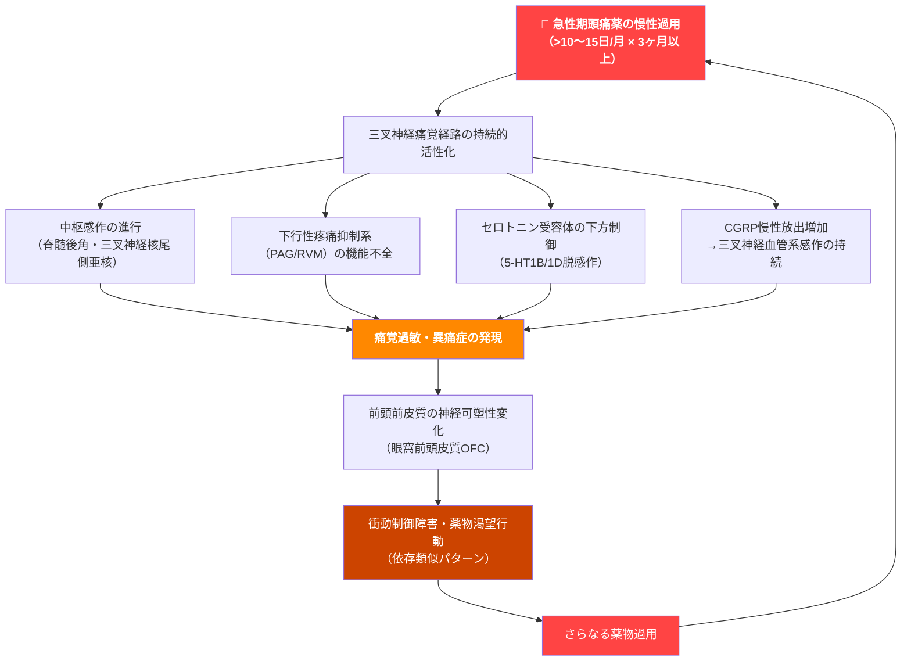
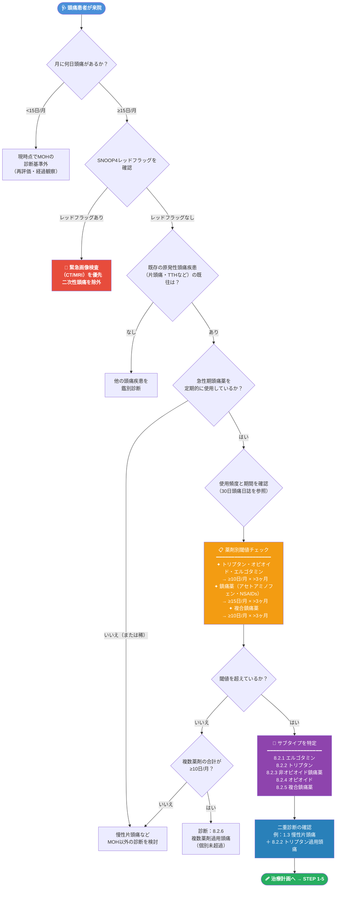
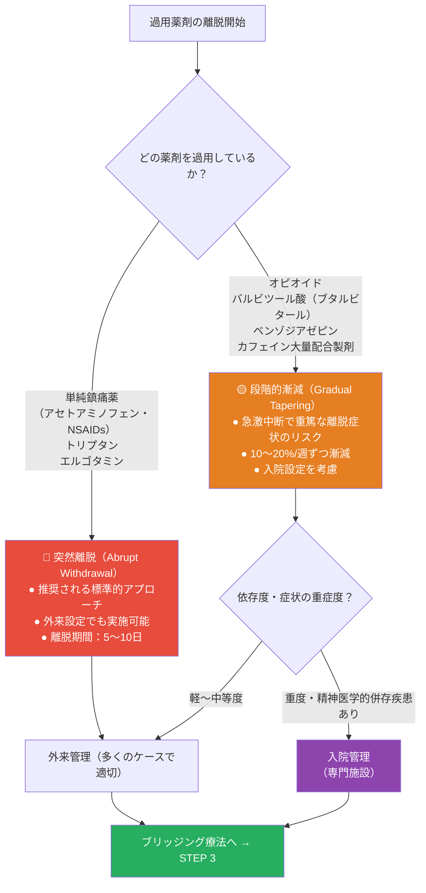
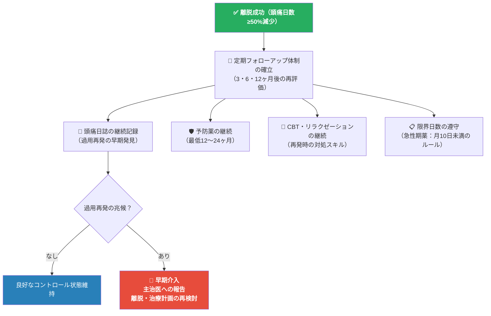

# 薬剤過用頭痛（MOH）完全ガイド
### ICHD-3 / IHS 国際基準準拠 | 初学者向けステップバイステップ解説

---

> ⚠️ **学術的免責事項**
> 本ガイドは学術・教育・研究目的のみを対象としています。臨床応用の前に必ず資格を持つ医療専門家によるレビューを受けてください。個別の医療アドバイス・診断・処方の提供は行いません。

---

## 目次

1. [MOHとは何か — 基本概念の理解](#1-mohとは何か--基本概念の理解)
2. [疫学 — どれくらい多い疾患か](#2-疫学--どれくらい多い疾患か)
3. [病態生理 — なぜ薬で頭痛が悪化するのか](#3-病態生理--なぜ薬で頭痛が悪化するのか)
4. [ICHD-3 診断基準](#4-ichd-3-診断基準)
5. [原因薬剤と過用閾値](#5-原因薬剤と過用閾値)
6. [リスクファクター](#6-リスクファクター)
7. [診断アルゴリズム](#7-診断アルゴリズム)
8. [治療戦略の全体像](#8-治療戦略の全体像)
9. [STEP 1 — 患者教育と動機付け](#9-step-1--患者教育と動機付け)
10. [STEP 2 — 過用薬剤の離脱（Detoxification）](#10-step-2--過用薬剤の離脱detoxification)
11. [STEP 3 — ブリッジング療法](#11-step-3--ブリッジング療法)
12. [STEP 4 — 予防薬療法](#12-step-4--予防薬療法)
13. [STEP 5 — 非薬物療法・行動介入](#13-step-5--非薬物療法行動介入)
14. [特殊集団への対応](#14-特殊集団への対応)
15. [予後・再発予防](#15-予後再発予防)
16. [アウトカム評価ツール](#16-アウトカム評価ツール)
17. [エビデンスサマリー](#17-エビデンスサマリー)
18. [参考文献・ソースURL](#18-参考文献ソースurl)

---

## 1. MOHとは何か — 基本概念の理解

### 1.1 定義

**薬剤過用頭痛（Medication-Overuse Headache; MOH）** とは、元々頭痛持ちであった患者が急性期頭痛薬を長期間・過剰に使用することで逆に頭痛が慢性化・悪化するという、「薬が頭痛を招く」という逆説的な疾患です。

> 「頭痛を治そうと飲んだ薬が、さらに多くの頭痛を作り出す」

**ICHD-3コード: 8.2**（国際頭痛分類第3版）

### 1.2 旧称・別名

| 旧名称 | 現在の推奨名称 |
|---|---|
| 鎮痛薬誘発性頭痛（Analgesic-induced headache） | 薬剤過用頭痛（MOH） |
| 薬物乱用頭痛（Drug-induced headache） | MOH |
| 反跳性頭痛（Rebound headache） | MOH |
| 薬物誤用頭痛（Medication-misuse headache） | MOH |

ICHD-3は「乱用（abuse）」や「誤用（misuse）」という表現を避け、患者へのスティグマを軽減するために「過用（overuse）」という中立的表現を採用しています。

---

## 2. 疫学 — どれくらい多い疾患か

### 2.1 有病率

| 対象集団 | 有病率 | 備考 |
|---|---|---|
| 一般成人人口 | **1〜2%** | 世界的コンセンサス推計 |
| 慢性連日頭痛（≥15日/月）患者 | **50〜60%** | 最重要統計 — 半数以上がMOH |
| 頭痛専門外来患者 | **30〜50%** | 専門施設での高い割合 |

### 2.2 人口統計学的特徴

| 項目 | データ |
|---|---|
| 性差 | 女性に多い（女性：男性 ≒ **3:1**） |
| 好発年齢 | **30〜50歳**（ただし全年齢に発症しうる） |
| 好発基礎疾患 | 片頭痛（最多）、緊張型頭痛、群発頭痛 |
| 職業的傾向 | ストレス過多、不規則勤務（看護師、シフト労働者）に多い |
| 地域差 | 世界全地域に分布。低中所得国では市販鎮痛薬過用が特に問題 |

---

## 3. 病態生理 — なぜ薬で頭痛が悪化するのか

急性期頭痛薬の慢性的過用が頭痛を悪化させるメカニズムは、複数の神経生物学的変化が複合的に絡み合っています。以下にステップごとに解説します。

### 3.1 病態のステップ

**Step 1 — 急性期薬の慢性過用**

繰り返す頭痛に対して急性期薬（鎮痛薬・トリプタンなど）を頻繁に使用する状態が続きます。

**Step 2 — 中枢感作（Central Sensitization）の進行**

三叉神経痛覚経路の閾値が低下し、本来頭痛を引き起こさない程度の刺激でも頭痛が誘発されるようになります。これは脊髄後角ニューロンおよび三叉神経核尾側亜核（Trigeminal nucleus caudalis）の興奮性亢進によるものです。

**Step 3 — 下行性疼痛調節系の機能不全**

脳幹（中脳水道周囲灰白質：PAG、吻側延髄腹内側部：RVM）からの下行性疼痛抑制系が機能低下し、痛みのゲートが常に「開いた」状態になります。

**Step 4 — 神経可塑性変化（Neuroplasticity）**

長期過用により前頭前皮質（特に眼窩前頭皮質：OFC）に構造・機能変化が生じ、衝動制御や薬物渇望行動（薬物依存と類似したパターン）が現れます。SDS（依存重症度スケール）スコアは過用の有意な予測因子です。

**Step 5 — セロトニン系の脱感作**

トリプタンなどの5-HT1B/1D受容体作動薬の過用により、セロトニン受容体が下方制御（ダウンレギュレーション）し、セロトニンによる内因性疼痛抑制が低下します。

**Step 6 — CGRPの上昇とトリプタン効果の減弱**

CGRP（カルシトニン遺伝子関連ペプチド）の放出が慢性的に増加し、三叉神経血管系の感作が維持されます。同時にトリプタンへの反応性も低下する可能性があります。

### 3.2 病態生理の総括図

---

## 4. ICHD-3 診断基準

### 4.1 MOH（8.2）総括診断基準

**A.** 既存の頭痛疾患を持つ患者において、**月15日以上**の頭痛が出現している

**B.** 頭痛の急性期・対症療法に用いられうる1種類以上の薬剤を、**3ヶ月を超えて定期的に過用**している

**C.** 他のICHD-3診断ではより適切に説明されない

> 📌 **臨床的重要注意点（ICHD-3より）**
> MOHと診断された患者の多くは、過用薬物中止後に改善を示します。また予防療法への反応性も回復します。プライマリケアでも原因と結果についての簡潔な説明（パンフレット提供など）だけで過用を防止・中止できる場合があります。

### 4.2 サブタイプ別診断基準

| ICHD-3コード | サブタイプ | 過用閾値（月あたり） | 注釈 |
|---|---|---|---|
| **8.2.1** | エルゴタミン過用頭痛 | ≥10日 | 生物学的利用能が変動するため最低用量は定義不可 |
| **8.2.2** | トリプタン過用頭痛 | ≥10日 | 全剤形・全種類を合算 |
| **8.2.3** | 非オピオイド鎮痛薬過用頭痛 | ≥15日 | 下記サブフォーム参照 |
| **8.2.3.1** | アセトアミノフェン過用頭痛 | ≥15日 | 最も汎用される市販薬 |
| **8.2.3.2** | NSAID過用頭痛（アスピリン除く） | ≥15日 | イブプロフェン・ナプロキセンなど |
| **8.2.3.2.1** | アスピリン過用頭痛 | ≥15日 | NSAIDだが独自活性のため独立コード |
| **8.2.4** | オピオイド過用頭痛 | ≥10日 | 最高再発率 — 特に注意 |
| **8.2.5** | 複合鎮痛薬過用頭痛 | ≥10日 | 最多使用の組合せ：非オピオイド＋オピオイド＋カフェイン±バルビツール酸 |
| **8.2.6** | 複数薬剤クラス過用（個別未超過） | ≥10日（合計） | 単剤では閾値未達だが合計で過用 |
| **8.2.7** | 複数薬剤・未特定/未確認過用 | ≥10日（合計） | 詳細不明 — 日記記録後に再分類 |
| **8.2.8** | その他薬剤過用頭痛 | ≥10日 | 上記以外の薬剤 |

> 📌 **重要な二重診断ルール**
> 1.3 慢性片頭痛と 8.2 MOH の両診断基準を満たす場合は**両診断コードを付与**します。例：「1.3 慢性片頭痛 + 8.2.2 トリプタン過用頭痛」

---

## 5. 原因薬剤と過用閾値

### 5.1 閾値一覧表（重要度別色分け）

| 薬剤カテゴリー | 代表薬 | 過用閾値 | MOH誘発リスク | 離脱困難度 |
|---|---|---|---|---|
| **オピオイド** | コデイン、トラマドール、モルヒネ | **≥10日/月** | 🔴 最高 | 🔴 高（漸減必須） |
| **複合鎮痛薬** | カフェイン配合、バルビツール配合製剤 | **≥10日/月** | 🔴 高 | 🔴 高（漸減推奨） |
| **エルゴタミン** | エルゴタミン酒石酸塩 | **≥10日/月** | 🔴 高 | 🟠 中〜高 |
| **トリプタン** | スマトリプタン、ゾルミトリプタン等 | **≥10日/月** | 🟠 中〜高 | 🟡 中（比較的迅速） |
| **アセトアミノフェン** | パラセタモール（カロナール等） | **≥15日/月** | 🟡 中 | 🟡 中 |
| **NSAIDs（アスピリン含む）** | イブプロフェン、ナプロキセン等 | **≥15日/月** | 🟡 中 | 🟡 中 |
| **CGRP gepants** | リメゲパント、ウブロゲパント | **現時点では低い** | 🟢 低（動物実験データ） | 🟢 低 |

> ⚠️ **臨床的注意**  
> オピオイド系は最高再発率を示す（ICHD-3 Comment参照）。gepantsはMOHを誘発しない可能性が示唆されているが、長期的エビデンスは現時点では限られています。

---

## 6. リスクファクター

### 6.1 患者側因子

| リスクカテゴリー | 具体的因子 |
|---|---|
| **素因的頭痛疾患** | 片頭痛（最大リスク）、緊張型頭痛、群発頭痛 |
| **精神医学的併存疾患** | うつ病、不安障害、PTSD、強迫性障害 |
| **依存・嗜癖傾向** | アルコール依存、喫煙、物質使用障害の既往 |
| **心理社会的因子** | 慢性ストレス、睡眠障害、離婚・失業などの生活困難 |
| **遺伝的因子** | 家族歴、特定遺伝子多型（SLC6A4、COMT等 — 研究段階） |
| **性別** | 女性（特に生殖年齢）にリスク高 |

### 6.2 薬剤側因子

| リスクカテゴリー | 具体的因子 |
|---|---|
| **過用しやすい薬剤プロファイル** | 市販薬（OTC）として容易に入手可能、即効性が高い |
| **医療アクセス不良** | 頭痛専門医不在、予防療法の未受診・未処方 |
| **患者教育不足** | MOHリスクについての説明がない |

---

## 7. 診断アルゴリズム

---

## 8. 治療戦略の全体像

MOHの治療は**5つのステップ**からなる多モダリティアプローチが推奨されます。

---

## 9. STEP 1 — 患者教育と動機付け

### 9.1 なぜ教育が最重要なのか

ICHD-3は「原因と結果についての簡潔な説明は本質的な管理の一部であり、パンフレット提供のみでも過用を防止・中止できる場合がある」と明記しています。教育なしの薬物離脱は再発リスクが高く、また患者の協力なしには離脱自体が困難です。

### 9.2 患者への説明ポイント（初学者向け伝達スクリプト）

**ポイント①** 「薬を飲めば飲むほど、脳が次の頭痛を作り出そうとします」  
— 中枢感作のメカニズムを平易に説明

**ポイント②** 「今使っている薬を一定期間やめると、最初は頭痛が一時的に悪くなりますが、それを乗り越えると改善します」  
— 離脱症状への事前準備

**ポイント③** 「頭痛薬は月10〜15日（薬の種類による）を超えて使うと危険です」  
— 具体的な閾値の提示

**ポイント④** 「一人で我慢する必要はありません。一緒に計画を立てましょう」  
— 治療同盟の構築

### 9.3 動機付けツール

- 30日間頭痛日誌（Headache diary）の記録開始 — **治療前ベースライン確立に必須**
- SDS（依存重症度スケール）を用いた依存傾向の評価
- HIT-6・MIDAS を用いた障害度の可視化（数値化することで患者の実感を促す）

---

## 10. STEP 2 — 過用薬剤の離脱（Detoxification）

### 10.1 離脱方法の選択

### 10.2 離脱症状の予測と対処

離脱開始後、多くの患者で一時的に頭痛が悪化します（**離脱頭痛**）。この段階を乗り越えることが重要です。

| 離脱症状 | 発現時期 | 持続期間 |
|---|---|---|
| 頭痛の一時的悪化 | 離脱後2〜10日 | トリプタン：短め（2〜4日）/ 鎮痛薬：やや長め（5〜7日）/ オピオイド：最も長い |
| 悪心・嘔吐 | 2〜5日 | 数日間 |
| 不眠 | 全期間 | 2週間程度 |
| 不安・易刺激性 | 2〜5日 | 数日間 |
| 血圧変動 | 特にオピオイド離脱時 | 数日間 |

---

## 11. STEP 3 — ブリッジング療法

過用薬剤を中断した後の離脱症状を緩和するための「橋渡し」薬物療法です。

### 11.1 外来ブリッジング

| 薬剤 | 用量・用法 | エビデンス | 注意事項 |
|---|---|---|---|
| **ナプロキセン** | 500mg 1日2回 × 10〜14日 | **[Grade B]** | NSAIDs離脱の場合は使用不可 |
| **プレドニゾロン** | 40〜60mg/日 × 5〜7日（漸減） | **[Grade C]** | 効果はメタ解析で混在 — 短期のみ使用 |
| **メトクロプラミド（制吐剤）** | 10mg 頓用または1日3回 | **[Grade B]** | 悪心・嘔吐管理に有効 |
| **オンダンセトロン** | 4〜8mg 頓用 | **[Grade C]** | 嘔吐が強い場合 |
| **クロルプロマジン（経口）** | 25〜50mg | **[Expert Opinion]** | 難治例、鎮静作用あり — 転倒注意 |

### 11.2 入院ブリッジング（重症例）

| 薬剤 | 用量 | エビデンス | 特記 |
|---|---|---|---|
| **IV ジヒドロエルゴタミン（DHE）** | 0.5〜1mg IV q8h × 2〜3日 | **[Grade A]** | ラスムッセン・プロトコル — 専門施設限定 |
| **IV マグネシウム硫酸塩** | 1〜2g IV 緩徐投与 | **[Grade B]** | 妊婦の重症急性発作にも使用可 |
| **IV メトクロプラミド** | 10mg IV | **[Grade B]** | 制吐・鎮痛補助 |
| **IV バルプロ酸** | 500〜1000mg IV | **[Grade C]** | 難治性 — 妊婦禁忌 |

---

## 12. STEP 4 — 予防薬療法

MOHにおける予防薬の目的は①頭痛頻度の減少、②過用薬剤への依存軽減、③長期的な頭痛コントロールの確立です。

### 12.1 一般原則

> 予防薬はMOHと慢性片頭痛の双方を標的とします。過去は「まず離脱してから予防薬開始」が通説でしたが、近年のエビデンスは**離脱と同時並行での開始**も有効であることを示しています（特にCGRP製剤）。

### 12.2 予防薬一覧（エビデンス順）

#### A. 従来型予防薬

| 薬剤 | 用量 | MOHでのエビデンス | 主な副作用・禁忌 |
|---|---|---|---|
| **トピラマート** | 50〜100mg/日（2回分割） | **[Grade A]** MOHで特に有効 | 認知障害（ぼんやり感）、腎結石、体重減少、**妊婦禁忌（Category D）** |
| **アミトリプチリン** | 10〜75mg/日（就寝前） | **[Grade B]** | 口渇・眠気・体重増加、QT延長、**高齢者は10mgから開始** |
| **プロプラノロール** | 40〜120mg/日（2回分割） | **[Grade A]** | 気管支喘息禁忌、起立性低血圧、**糖尿病患者は低血糖マスク注意** |
| **バルプロ酸** | 500〜1500mg/日 | **[Grade A]** | **妊婦絶対禁忌（Category X — REMS必要）**、肝障害、体重増加 |
| **フルナリジン（日本未承認）** | 5〜10mg/日（就寝前） | **[Grade A]** (EHF) | 錐体外路症状、うつ |

#### B. ボツリヌストキシン（オナボツリヌストキシンA）

| 項目 | 内容 |
|---|---|
| 対象 | **慢性片頭痛 + MOH**（PREEMPT プロトコル） |
| 用量 | 155〜195単位、31〜39箇所への頭頸部筋肉内注射 |
| 投与間隔 | 12週ごと |
| エビデンス | **[Grade A]** — PREEMPT 1/2 試験（n=1384）で有効性確立 |
| 特徴 | MOHがある慢性片頭痛でも有効。過用薬剤なしでも使用可 |

#### C. CGRP 関連製剤（最新・最重要）

**CGRP製剤はMOH合併例でも有効性が示されている革新的薬剤群です。**

**予防的モノクローナル抗体（mAbs）**

| 薬剤 | 標的 | 用量・投与 | MOH特有エビデンス | 備考 |
|---|---|---|---|---|
| **エレヌマブ（Aimovig）** | CGRPr（受容体）| 70〜140mg SC 月1回 | **[Grade A]** REGAIN試験でMOH合併CM改善 | 便秘・注射部位反応 |
| **フレマネズマブ（Ajovy）** | CGRP（リガンド） | 225mg SC 月1回 または 675mg SC 3ヶ月1回 | **[Grade A]** MOH合併でも有効 | 注射部位反応 |
| **ガルカネズマブ（Emgality）** | CGRP（リガンド） | 240mgローディング後 120mg SC 月1回 | **[Grade A]** | 注射部位反応 |
| **エプチネズマブ（Vyepti）** | CGRP（リガンド） | 100〜300mg IV 3ヶ月1回 | **[Grade A]** | IV投与 — 即効性 |

**急性期CGRP gepants（二刀流薬剤あり）**

| 薬剤 | 承認 | 用量 | MOH誘発リスク | 特徴 |
|---|---|---|---|---|
| **リメゲパント（Nurtec ODT）** | 急性期＋予防（米国） | 75mg ODT 隔日（予防）/ 頓用（急性） | 🟢 低（動物実験データ） | **唯一の急性＋予防デュアル承認薬** |
| **ウブロゲパント（Ubrelvy）** | 急性期 | 50〜100mg 頓用 | 🟢 低 | 心血管安全性が高い |
| **ザベゲパント（Zavzpret）** | 急性期 | 10mg 鼻腔内 | 🟢 低 | 最速発現（鼻腔内） |

---

## 13. STEP 5 — 非薬物療法・行動介入

### 13.1 根拠のある非薬物療法

| 介入 | エビデンスグレード | 概要 |
|---|---|---|
| **認知行動療法（CBT）** | **[Grade B]** (AAN/EHF) | 頭痛に関連した破局化思考・回避行動の修正、薬物渇望への対処スキル構築。再発予防に特に有効 |
| **バイオフィードバック** | **[Grade B]** (AAN) | 筋電図（EMG）または皮膚温フィードバックによる自律神経調節訓練。薬剤単独よりも組合せで相乗効果 |
| **リラクゼーション訓練** | **[Grade B]** (AAN) | 漸進的筋弛緩法、横隔膜呼吸、自律訓練法。自宅で継続可能 |
| **マインドフルネス瞑想（MBSR）** | **[Grade C]** | 痛みへの注意制御、感情反応の調節。うつ・不安の併存にも有益 |
| **理学療法（頸椎アプローチ）** | **[Grade B]** | 特に頸原性要因が関与する場合。手技療法＋運動療法の組合せ |
| **有酸素運動** | **[Grade B]** | 週3〜5回 × 30〜40分の中強度有酸素運動。内因性エンドルフィン・セロトニン分泌促進 |

### 13.2 栄養・サプリメント療法

| サプリメント | 用量 | エビデンス | MOHへの意義 |
|---|---|---|---|
| **マグネシウム（グリシン酸/クエン酸塩）** | 400〜600mg/日 | **[Grade A/B]** | 中枢感作の軽減、三叉神経興奮閾値の上昇 |
| **リボフラビン（ビタミンB2）** | 400mg/日 | **[Grade A/B]** | ミトコンドリア機能改善（電子伝達系Complex I） |
| **CoQ10（ユビキノール）** | 300mg/日 | **[Grade B]** | ミトコンドリアComplex I/III支持 |
| **メラトニン** | 3mg（就寝前） | **[Grade C]** | 睡眠障害関連頭痛、特に群発頭痛との共存時 |

---

## 14. 特殊集団への対応

### 14.1 妊娠中・授乳中

| 薬剤カテゴリー | 推奨 |
|---|---|
| バルプロ酸 | 🔴 **絶対禁忌（Category X）** — 胎児の重大催奇形性リスク |
| トピラマート | 🔴 **禁忌（Category D）** |
| エルゴタミン | 🔴 **禁忌** |
| トリプタン | 🟡 **注意使用**（スマトリプタン妊娠レジストリあり、リスク検討の上で使用） |
| CGRP mAbs | 🟡 **データ不十分** — 原則回避推奨 |
| アセトアミノフェン | 🟢 **急性期第一選択**（最も安全性データ充実） |
| IV マグネシウム硫酸塩 | 🟢 **重症急性発作で使用可** |
| 非薬物療法（CBT・バイオフィードバック） | 🟢 **積極的に活用** |

### 14.2 高齢者（65歳以上）

| 考慮点 | 推奨事項 |
|---|---|
| 三環系抗うつ薬（アミトリプチリン） | **10mgから開始**（起立性低血圧・転倒リスク） |
| トピラマート | 認知機能への影響を注意深くモニタリング |
| β遮断薬 | 徐脈・起立性低血圧・転倒に注意 |
| オピオイド | **可能な限り回避**（転倒・せん妄リスク） |

### 14.3 小児・思春期（12〜18歳）

| 薬剤 | 推奨 |
|---|---|
| イブプロフェン 10mg/kg | 急性期第一選択 |
| アセトアミノフェン 15mg/kg | 急性期第一選択 |
| スマトリプタン鼻腔内スプレー | **12歳以上で承認**（最も普及） |
| バルプロ酸（思春期女性） | 体重増加・催奇形性についての十分なカウンセリングが必須 |
| CGRP mAbs（思春期） | データ蓄積中 — 個別判断 |

---

## 15. 予後・再発予防

### 15.1 予後データ

| 評価時期 | 改善率 | 再発率 | データソース |
|---|---|---|---|
| 離脱後3ヶ月 | **60〜70%** | — | Diener et al., 1989; 複数コホート研究 |
| 離脱後1年 | **50〜70%** | **25〜30%** | Schnider et al., 1996; Aaseth et al., 2011 |
| 離脱後5年 | — | **40〜45%** | Schnider et al., 1996 |

### 15.2 予後不良予測因子

| 予後不良因子 | 備考 |
|---|---|
| オピオイド・複合鎮痛薬の過用 | 単純鎮痛薬・トリプタンよりも再発率が高い |
| MOH罹患期間が長い | 5年以上の慢性化 |
| SDS（依存重症度スケール）スコア高値 | スコア高値は予後不良の有意な予測因子 |
| うつ病・不安障害の未治療 | 精神医学的併存疾患への介入が必須 |
| 社会的サポートの欠如 | 再発時の受け皿が薬物頼りになりやすい |
| 複数薬剤の同時過用（8.2.6/8.2.7） | 単一薬剤過用より複雑 |

### 15.3 再発予防のための長期戦略

---

## 16. アウトカム評価ツール

### 16.1 必須評価ツール一覧

| ツール名 | 測定内容 | カットオフ / 判定 | 評価タイミング |
|---|---|---|---|
| **HIT-6** (Headache Impact Test) | 頭痛による日常生活への影響 | **≥60点 = 重度障害** | 治療前・3ヶ月後・6ヶ月後 |
| **MIDAS** (Migraine Disability Assessment) | 過去3ヶ月の日常活動消失日数 | **≥21日 = Grade IV（最重度）** | 治療前・3ヶ月後 |
| **VAS / NRS** | 疼痛強度 0〜10 | 2点以上の改善 = 臨床的有意差 | 発作ごと（発作時・ピーク時・治療後2h） |
| **PGIC** (Patient Global Impression of Change) | 患者自身の包括的改善感 | 7段階評価（1=最大改善 〜 7=最大悪化） | 3・6ヶ月後 |
| **SDS** (Severity of Dependence Scale) | 薬物依存重症度 | スコア高値→予後不良因子 | 治療前 |
| **頭痛日誌** | 頭痛日数・使用薬剤・疼痛強度・誘発因子 | 治療前30日間のベースライン必須 | 継続的（最低30日ベースライン → 維持期） |

### 16.2 治療成功の定義（目標値）

| 目標 | 数値 |
|---|---|
| 頭痛日数の減少 | **≥50%の減少**（ベースラインから3ヶ月後） |
| HIT-6スコア | **56点未満**（重度障害からの離脱） |
| 月間急性期薬使用日数 | **<15日/月**（NSAID/アセトアミノフェン）または**<10日/月**（トリプタン） |

---

## 17. エビデンスサマリー

| 介入 | エビデンスグレード | 推奨出典 |
|---|---|---|
| オナボツリヌストキシンA（慢性片頭痛+MOH） | **[Grade A]** | AAN/AHS 2016, NICE CG150 |
| トピラマート（MOH合併予防） | **[Grade A]** | AAN, EHF |
| CGRP mAbs（MOH合併CM） | **[Grade A]** | EHF 2022 Guideline (PMC9188162) |
| プロプラノロール | **[Grade A]** | AAN |
| バルプロ酸 | **[Grade A]** | AAN（妊婦禁忌） |
| アミトリプチリン | **[Grade B]** | AAN, EHF |
| CBT | **[Grade B]** | AAN, Cochrane |
| バイオフィードバック | **[Grade B]** | AAN, Cochrane |
| マグネシウム（予防） | **[Grade A/B]** | AAN, EHF, Cochrane 2025 |
| リボフラビン400mg | **[Grade A/B]** | AAN, EHF |
| CoQ10 300mg | **[Grade B]** | EHF |
| 短期プレドニゾロン（ブリッジング） | **[Grade C]** | EHF（混在したメタ解析結果） |
| IV DHE（入院ブリッジング） | **[Grade A]** | AAN（専門施設限定） |
| 患者教育・Brief intervention（プライマリケア） | **[Grade A]** | BIMOH試験（BMJ 2015, Neurology 2016） |

---

## 18. 参考文献・ソースURL

すべてのソースは国際的に認可された機関・ジャーナルからのものです。

### A. 診断基準（ICHD-3）

| 資料 | URL |
|---|---|
| ICHD-3 公式サイト（全文閲覧可） | https://ichd-3.org/ |
| ICHD-3 全文PDF（Cephalalgia 2018） | https://ichd-3.org/wp-content/uploads/2018/01/The-International-Classification-of-Headache-Disorders-3rd-Edition-2018.pdf |
| IHS 分類委員会（ICHD-4最新動向） | https://ihs-headache.org/en/about-ihs/standing-committees/classification/ |

### B. 臨床ガイドライン

| 機関・資料 | URL |
|---|---|
| AAN 頭痛ガイドライン一覧 | https://www.aan.com/guidelines/ |
| AAN/AHS 片頭痛予防ガイドライン（PDF） | https://www.aan.com/guidelines/home/getguidelinecontent/545 |
| AAN 2024年予防療法ドラフト（公開レビュー用） | https://www.aan.com/siteassets/home-page/policy-and-guidelines/guidelines/guidelines-and-measures-open-for-public-comment/24-pharmacologic-treatment-for-migraine-prevention-in-adults_draft_08-14-2024.pdf |
| EHF CGRP mAbs 予防療法ガイドライン 2022（PMC全文） | https://www.ncbi.nlm.nih.gov/pmc/articles/PMC9188162/ |
| EHF トリプタン治療コンセンサス 2022 | https://link.springer.com/article/10.1186/s10194-022-01502-z |
| NICE 頭痛ガイドライン CG150（英国） | https://www.nice.org.uk/guidance/cg150 |
| IHS 急性期治療推奨 2024（Cephalalgia誌全文） | https://journals.sagepub.com/doi/10.1177/03331024241252666 |

### C. Cochrane エビデンスレビュー

| レビュータイトル | URL |
|---|---|
| Cochrane 頭痛・片頭痛レビュー検索 | https://www.cochranelibrary.com/search?query=headache+migraine&searchBy=3&type=cdsr |
| マグネシウム補充 片頭痛予防（2025年最新） | https://www.cochranelibrary.com/cdsr/doi/10.1002/14651858.CD016307 |
| 心理療法（CBT/バイオフィードバック）片頭痛予防 | https://www.cochranelibrary.com/cdsr/doi/10.1002/14651858.CD012295.pub2/full |
| ボツリヌストキシン 慢性片頭痛予防 | https://www.cochranelibrary.com/cdsr/doi/10.1002/14651858.CD011914 |

### D. 主要専門誌・データベース

| 名称 | URL |
|---|---|
| Journal of Headache and Pain（EHF公式誌・OA） | https://thejournalofheadacheandpain.biomedcentral.com/ |
| Cephalalgia（IHS公式誌） | https://journals.sagepub.com/home/cep |
| PubMed 頭痛 RCT 専用検索 | https://pubmed.ncbi.nlm.nih.gov/?term=medication+overuse+headache&filter=pubt.clinicaltrials |
| ClinicalTrials.gov（MOH関連試験） | https://clinicaltrials.gov/search?cond=Medication+Overuse+Headache |

### E. 主要一次文献（精選）

| 著者・年 | タイトル（要旨） | 掲載誌 |
|---|---|---|
| Diener HC et al., 1989 | 鎮痛薬誘発性頭痛：離脱療法の長期結果 | *J Neurol* 236: 9–14 |
| Schnider P et al., 1996 | 入院離脱後5年フォローアップ | *Cephalalgia* 16: 481–485 |
| Kristoffersen ES et al., 2015 (BIMOH) | プライマリケアでの簡潔介入RCT | *J Neurol Neurosurg Psychiatry* 86: 505–512 |
| Kristoffersen ES et al., 2016 | BIMOH研究6ヶ月フォローアップ | *J Neurol* 263: 344–353 |
| Aaseth K et al., 2011 | 二次性慢性頭痛の3年フォローアップ（Akershus研究） | *Eur J Pain* 15: 186–192 |
| Limmroth V et al., 2002 | 異なる急性期薬過用後のMOH特徴 | *Neurology* 59: 1011–1014 |
| Grande RB et al., 2009 | SDSスコアとMOH検出（Akershus研究） | *J Neurol Neurosurg Psychiatry* 80: 784–789 |

---

*本ガイドは ICHD-3（IHS, 2018）、AAN/AHS ガイドライン、EHF 2022ガイドライン、NICE CG150、Cochrane Library の内容に基づき作成されました。*  
*最終更新参照基準日：2025年8月（Claude知識カットオフ）*  
*個別臨床判断は必ず専門医との相談の上で行ってください。*
