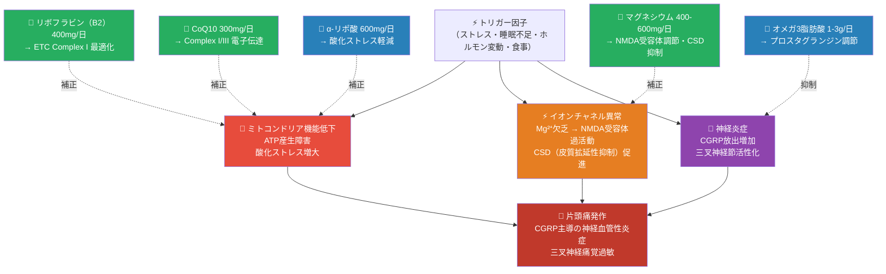
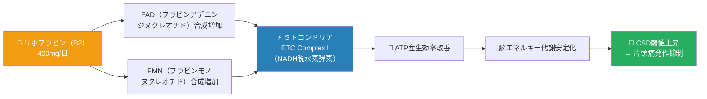
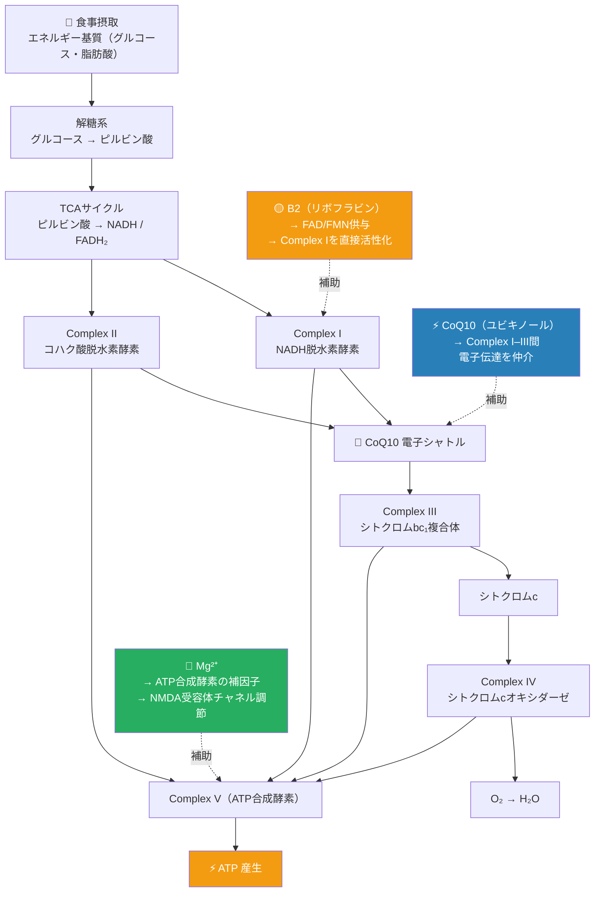
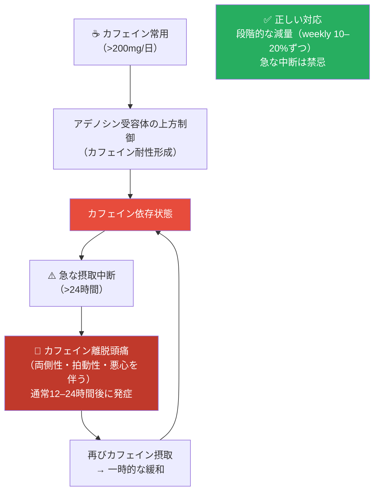
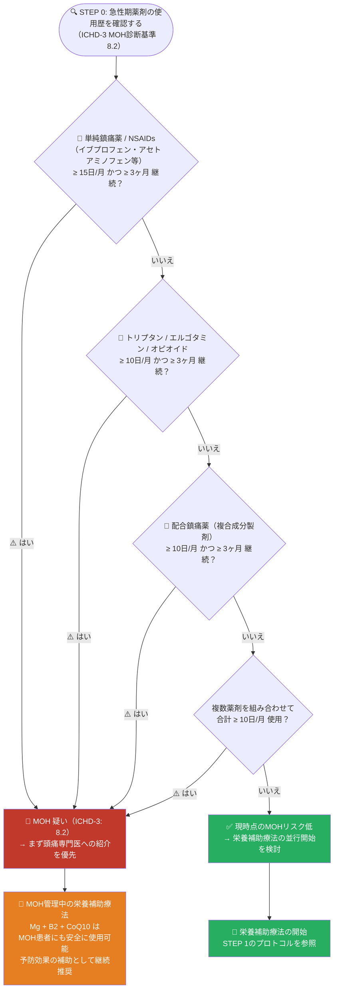
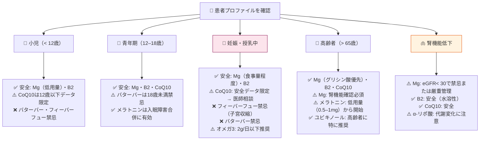
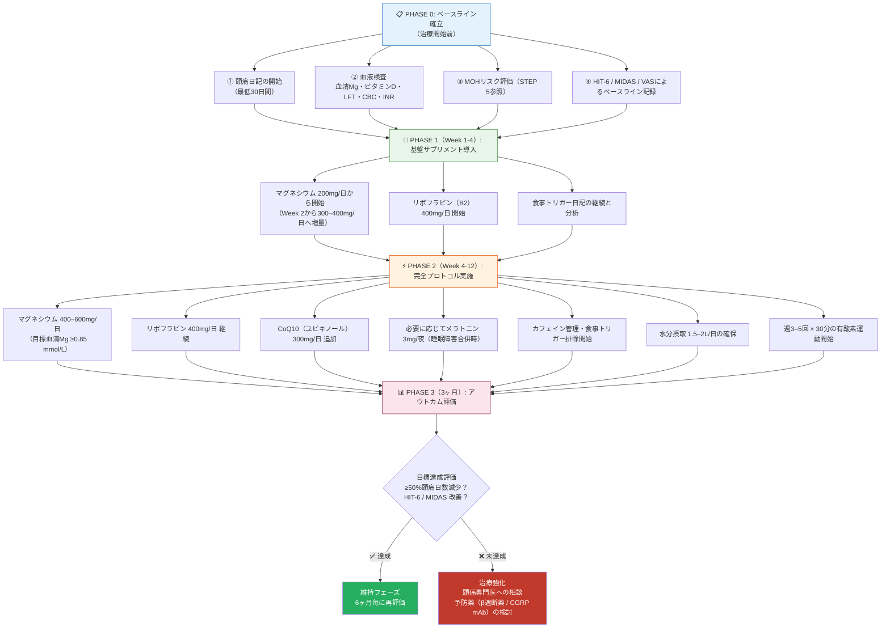

# 頭痛と栄養・サプリメント療法

## 国際エビデンスに基づく包括的解説

### 初学者から臨床家まで — ステップバイステップガイド

---

> ⚠️ **学術的免責事項 / Academic Disclaimer**
>
> 本文書は**学術・教育・研究目的**のためのみに作成されています。すべての情報は国際的に認定された文献・ガイドラインに基づいていますが、個人の医療診断・処方・治療の代替とはなりません。臨床応用の前に必ず資格を持つ医療専門家（神経内科・頭痛専門医）にご相談ください。
>
> **参照基準**: ICHD-3 | AAN | EHF | IHS 2024 | NICE CG150 | Cochrane Library | WHO | PubMed

---

## 目次

1. [はじめに — なぜ栄養が頭痛に影響するのか？](#1)
2. [エビデンスの読み方 — グレーディングシステム](#2)
3. [STEP 1 — 高エビデンスサプリメント（Grade A/B）](#3)
4. [STEP 2 — 中等度エビデンスサプリメント（Grade C）](#4)
5. [STEP 3 — 要注意サプリメント — 使い方を誤ると危険](#5)
6. [STEP 4 — 食事性トリガー管理](#6)
7. [STEP 5 — MOHリスク評価との統合](#7)
8. [STEP 6 — 薬物・サプリメント相互作用チェックリスト](#8)
9. [STEP 7 — 特別集団への配慮](#9)
10. [STEP 8 — 統合プロトコル（段階的実践ガイド）](#10)
11. [STEP 9 — アウトカム評価と効果測定](#11)
12. [参考文献・ソースURL](#12)

---

## 1. はじめに — なぜ栄養が頭痛に影響するのか？ {#1}

### 1-1. 片頭痛の病態生理学と栄養の接点

片頭痛（Migraine）は単なる「頭の痛み」ではなく、**脳の神経代謝障害・三叉神経血管系の活性化・中枢感作**が複雑に絡み合う慢性神経疾患です。栄養素は、これらの病態メカニズムの複数の段階に介入できます。



### 1-2. なぜサプリメントが「補助的」位置づけなのか

栄養補助療法は強力な補完手段ですが、以下の理由から**薬物療法の代替にはなりません**：

| 観点 | 薬物療法 | 栄養補助療法 |
|------|---------|------------|
| 作用の速度 | 急速（急性期：30〜120分） | 緩徐（予防的：4〜12週） |
| エビデンスの質 | RCT多数、Grade A多 | RCT限定的、Grade C多 |
| 即効性 | 高い | 低い（蓄積効果） |
| 副作用プロファイル | 明確（禁忌あり） | 一般的に良好 |
| 最適な役割 | 急性期 + 予防 | **予防補助 + ライフスタイル基盤** |

> 📌 **結論**: 栄養補助療法は「薬物療法の効果を最大化するための土台づくり」として位置づける。

---

## 2. エビデンスの読み方 — グレーディングシステム {#2}

本ガイドでは、**AAN（米国神経学会）/ EHF（欧州頭痛連盟）**の標準的なエビデンスグレーディングを使用します。

### 2-1. グレーディング基準

| グレード | 定義 | 実際の意味 |
|---------|------|-----------|
| **[Grade A]** | 2つ以上の一貫したClass I RCT または Cochrane SRで低ヘテロジェニティ | 使用を強く支持する — 最も信頼できる |
| **[Grade B]** | 1つのClass I RCT または 2つ以上のClass II研究 | 使用を支持する — 相当の根拠あり |
| **[Grade C]** | 1つのClass II または 2つ以上のClass III研究 | 使用を考慮できる — 限定的根拠 |
| **[Grade U]** | 不十分または相反するエビデンス | 推奨不可（中立） |
| **[Expert Opinion]** | RCTなし、ガイドラインコンセンサスのみ | 専門家の意見として参考 |

### 2-2. 栄養補助療法の全体エビデンスマップ

```mermaid
flowchart LR
    subgraph A["🟢 Grade A / B（AAN/EHF承認）"]
        direction TB
        Mg2["🧲 マグネシウム\n400–600mg/日\nGrade A/B"]
        B22["🟡 リボフラビン（B2）\n400mg/日\nGrade A/B"]
        CoQ["⚡ CoQ10（ユビキノール）\n300mg/日\nGrade B"]
    end

    subgraph B["🟡 Grade C（補助的使用可）"]
        direction TB
        Mel["🌙 メラトニン\n3mg/夜\nGrade C"]
        ALA2["🔶 α-リポ酸\n600mg/日\nGrade C"]
        Om["🐟 オメガ3脂肪酸\n1–3g/日\nGrade C"]
        Gin["🌿 ショウガエキス\n250mg（急性補助）\nGrade C"]
    end

    subgraph C["⚠️ 要注意（慎重使用）"]
        direction TB
        FV["🌼 フィーバーフュー\n(MIG-99)\nGrade C＋要監視"]
        BB["🌱 バターバー\nPA-free品のみ\nGrade C＋肝毒性注意"]
        VD["☀️ ビタミンD\n欠乏確認後のみ\nGrade C"]
    end

    subgraph D["🔴 禁忌"]
        direction TB
        B6["❌ 高用量B6\n>200mg/日\n末梢神経障害リスク"]
    end

    A --> B --> C --> D
```



---

## 3. STEP 1 — 高エビデンスサプリメント（Grade A/B）{#3}

> **初学者へのガイド**: Grade A/Bのサプリメントは国際ガイドライン（AAN・EHF）で正式に推奨されているものです。予防療法の補助として最初に検討すべき選択肢です。

### 3-1. マグネシウム（Magnesium）

**片頭痛における「最も基盤的な」栄養素**

#### なぜ重要か？（病態生理）

片頭痛患者では健常者と比較して**血清マグネシウム濃度が有意に低い**ことが多くの研究で確認されています。マグネシウムは以下の複数の機序を通じて片頭痛病態に関与します：

| 機序 | 説明 |
|------|------|
| **NMDA受容体調節** | Mg²⁺はNMDA受容体チャネルを閉鎖し過剰な神経興奮を防ぐ（欠乏→ 中枢感作促進）|
| **CSD（皮質拡延性抑制）抑制** | 低Mg状態でCSD閾値が低下し、前兆発生リスクが上昇 |
| **血小板凝集抑制** | Mg²⁺欠乏でセロトニン放出を伴う血小板凝集が亢進 |
| **ミトコンドリア機能** | ATP合成に必須の補因子として作用 |
| **血管拡張調節** | 血管平滑筋の調節に直接関与 |

#### 製剤の選択と推奨用量

| 剤形 | 吸収率 | 推奨度 | 特記事項 |
|------|--------|--------|---------|
| **グリシン酸マグネシウム** | ⭐⭐⭐⭐⭐（最高） | 第一選択 | 胃腸副作用が最小 |
| **クエン酸マグネシウム** | ⭐⭐⭐⭐ | 代替選択 | 水に溶けやすい |
| **マグネシウムL-スレオネート** | ⭐⭐⭐⭐ | 血液脳関門通過性良好 | 神経系への移行性が高い可能性 |
| 酸化マグネシウム | ⭐⭐（低）| **推奨しない** | 便秘薬として一般的だが吸収率が低い |

```
推奨プロトコル（予防的補充）:
  用量: 400–600 mg/日（2–3回に分割）
  目標血清Mg濃度: ≥ 0.85 mmol/L
  開始用量: 200mg/日（消化器症状軽減のため漸増）
  評価時期: 3ヶ月後に頭痛頻度を再評価

急性期（重症発作・来院時）:
  IV マグネシウム硫酸塩: 1–2g を20分で点滴（病院内のみ）
  妊娠中の重症発作でも使用可（要専門医管理）
```

#### エビデンスサマリー

| 研究 | 結果 | グレード |
|------|------|---------|
| Peikert A, et al. *Cephalalgia* 1996 | 高用量Mg（600mg/日）で発作頻度41.6%減少 | Grade A |
| Teigen L & Boes CJ. *J Headache Pain* 2015 | 予防的Mg補充の系統的レビュー — 発作頻度低下を確認 | Grade A/B |
| Cochrane SR 2025（マグネシウム補充・最新版） | [Grade A/B]として推奨、発作頻度・重症度ともに改善 | Grade A/B |

> 📌 **ソース**:
> - [Cochrane マグネシウム補充 片頭痛予防 2025](https://www.cochranelibrary.com/cdsr/doi/10.1002/14651858.CD016307)
> - [AAN/AHS 片頭痛予防ガイドライン 2024（草案）](https://www.aan.com/siteassets/home-page/policy-and-guidelines/guidelines/guidelines-and-measures-open-for-public-comment/24-pharmacologic-treatment-for-migraine-prevention-in-adults_draft_08-14-2024.pdf)
> - [PubMed: Peikert A, et al. Cephalalgia 1996](https://pubmed.ncbi.nlm.nih.gov/8734727/)

#### 安全情報

| 項目 | 内容 |
|------|------|
| 主な副作用 | 軟便・下痢（用量依存性）→ 漸増で軽減 |
| 禁忌 | 重篤な腎機能低下（eGFR <30）→ 慎重投与・定期モニタリング |
| 薬物相互作用 | カルシウムチャネル拮抗薬との相乗的降圧作用に注意 |
| 妊娠時 | IV硫酸マグネシウムは専門医管理下で使用可 |

---

### 3-2. リボフラビン（ビタミンB2 / Riboflavin）

**ミトコンドリアのエネルギー産生を根本から改善する**

#### なぜ重要か？（病態生理）

片頭痛患者の脳では、発作間欠期においても**ミトコンドリア電子伝達系（ETC）のComplex Iの機能低下**が観察されます。リボフラビン（B2）は以下の経路を通じてこの問題を修正します：



#### 推奨プロトコル

```
用量: 400 mg/日（単回または2分割）
開始時期: 4週間は効果発現しない（蓄積期間）
評価: 3ヶ月後に頭痛頻度を再評価
特記事項: 尿が黄色〜オレンジ色に変色 — 無害・正常反応（フラビンの尿中排泄）
```

#### エビデンスサマリー

| 研究 | 結果 | グレード |
|------|------|---------|
| Schoenen J, et al. *Neurology* 1998 | 400mg/日で頭痛頻度59%減少（vs プラセボ15%）: n=55 RCT | **Grade A** |
| Boehnke C, et al. *Eur J Neurol* 2004 | 長期（6ヶ月）有効性・安全性の確認 | Grade B |
| MacLennan SC, et al. *J Child Neurol* 2008 | 小児（12歳以上）での有効性示唆（Grade C — 成人より弱いエビデンス）| Grade C |

> 📌 **ソース**:
> - [Schoenen J, et al. Neurology 1998 — PubMed](https://pubmed.ncbi.nlm.nih.gov/9484373/)
> - [AAN 片頭痛予防ガイドライン（全リスト）](https://www.aan.com/guidelines/)
> - [EHF 片頭痛予防ガイドライン 2022 (PMC全文)](https://www.ncbi.nlm.nih.gov/pmc/articles/PMC9188162/)

#### 安全情報

| 項目 | 内容 |
|------|------|
| 副作用 | 極めてまれ；高用量長期でも安全報告多数 |
| 禁忌 | 実質的なし（水溶性ビタミン、過剰分は尿中排泄） |
| 薬物相互作用 | 三環系抗うつ薬（TCA）がリボフラビン吸収を軽度低下させる可能性（要注意、CI非） |

---

### 3-3. コエンザイムQ10（CoQ10 / Ubiquinol）

**ミトコンドリア電子伝達の「電子シャトル」**

#### なぜ重要か？（病態生理）

CoQ10（ユビキノン/ユビキノール）はミトコンドリアのETC Complex I〜IIIの間で電子を受け渡す**不可欠な補酵素**です。片頭痛患者のCoQ10欠乏（血漿レベル低下）が複数の研究で確認されています。

| 機序 | 説明 |
|------|------|
| **ETC Complex I/III サポート** | 電子伝達の効率化 → ATP産生量改善 |
| **抗酸化作用** | 活性酸素（ROS）を直接中和 → 神経炎症軽減 |
| **膜安定化** | 細胞膜とミトコンドリア膜の脂質過酸化を抑制 |

#### 製剤の選択

| 剤形 | 特徴 | 推奨度 |
|------|------|--------|
| **ユビキノール（還元型CoQ10）** | 吸収率が高い（特に高齢者・吸収障害例） | 第一選択 ⭐⭐⭐⭐⭐ |
| ユビキノン（酸化型CoQ10）| 標準剤形、RCTデータはこちらで多い | 代替 ⭐⭐⭐⭐ |

```
推奨プロトコル:
  用量: 300 mg/日（100mgを3回に分割 — 脂溶性のため食後推奨）
  または 300mg単回（ユビキノール製剤なら吸収効率良好）
  評価: 3ヶ月後に頭痛頻度を再評価
  スタチン服用者: CoQ10が枯渇しやすいため補充を特に推奨
```

#### エビデンスサマリー

| 研究 | 結果 | グレード |
|------|------|---------|
| Sándor PS, et al. *Neurology* 2005 | 300mg/日で頭痛頻度47.6%改善（vs プラセボ14.4%）: n=42 RCT | **Grade B** |
| Hershey AD, et al. *Headache* 2007 | 小児・青年の片頭痛でCoQ10欠乏と頭痛頻度の相関 | Grade C |
| Shoeibi A, et al. *Nutr Neurosci* 2017 | トピラマートとCoQ10の比較RCT — 非劣性示唆 | Grade B |

> 📌 **ソース**:
> - [Sándor PS, et al. Neurology 2005 — PubMed](https://pubmed.ncbi.nlm.nih.gov/15728298/)
> - [EHF CGRP mAbsガイドライン（サプリセクション）2022](https://www.ncbi.nlm.nih.gov/pmc/articles/PMC9188162/)
> - [Journal of Headache and Pain](https://thejournalofheadacheandpain.biomedcentral.com/)

#### 安全情報

| 項目 | 内容 |
|------|------|
| 副作用 | まれ；軽度の消化器症状（食後摂取で軽減） |
| スタチン服用者 | スタチンはCoQ10産生を抑制 → 補充を特に推奨 |
| 抗凝固薬 | ワルファリンとの相互作用報告あり（INRモニタリング） |
| 妊娠 | 安全データ限定的 — 妊娠中は担当医に相談 |

---

### 3-4. マグネシウム + B2 + CoQ10 三剤併用プロトコル

この3剤はミトコンドリア代謝の**異なる段階に作用する相補的な組み合わせ**です。



#### 三剤の標準的な1日プロトコル例

| 時間帯 | 服用 | 用量 | 備考 |
|--------|------|------|------|
| 朝食後 | リボフラビン（B2）| 200mg | 水溶性 — 食後推奨 |
| 昼食後 | CoQ10（ユビキノール）| 100mg | 脂溶性 — 必ず食後 |
| 夕食後 | CoQ10（ユビキノール）| 100mg | 脂溶性 — 必ず食後 |
| 夕食後 | CoQ10（ユビキノール）| 100mg（合計300mg）| 分割で吸収効率改善 |
| 就寝前 | リボフラビン（B2）| 200mg（合計400mg）| 夜間代謝をサポート |
| 朝夜に分割 | マグネシウム（グリシン酸塩）| 各200–300mg（合計400–600mg）| 食後推奨、消化器副作用↓ |

> ⚠️ **重要**: この組み合わせは一般的に安全ですが、他の薬剤を服用している場合は必ず医師・薬剤師に相談してください。

---

## 4. STEP 2 — 中等度エビデンスサプリメント（Grade C）{#4}

### 4-1. メラトニン（Melatonin）

| 項目 | 詳細 |
|------|------|
| **推奨用量** | 3mg（就寝30〜60分前） |
| **エビデンスグレード** | [Grade C] |
| **主な機序** | 抗酸化作用 / 概日リズム調節 / 5-HT合成サポート / 内因性鎮痛 |
| **最適な対象** | 睡眠障害を合併する片頭痛患者 / 群発頭痛との共存例 |
| **特記事項** | プロプラノロールと同等の予防効果を示したRCTあり（Gonçalves et al. 2016）|
| **副作用** | 日中の眠気 / 起床困難 → 就寝直前に服用 |
| **禁忌** | 自己免疫疾患（潜在的免疫調節作用）/ 重篤な肝障害 |

> 📌 **ソース**: [Gonçalves AL, et al. *J Neurol* 2016 — PubMed](https://pubmed.ncbi.nlm.nih.gov/26898255/)

---

### 4-2. α-リポ酸（Alpha-Lipoic Acid / ALA）

| 項目 | 詳細 |
|------|------|
| **推奨用量** | 600mg/日（単回または分割） |
| **エビデンスグレード** | [Grade C] |
| **主な機序** | 強力な抗酸化作用（水溶性・脂溶性双方）/ 神経保護 / ミトコンドリア機能改善 |
| **主な副作用** | 低血糖リスク（特に糖尿病患者）/ チアミン欠乏の潜在的リスク |
| **禁忌** | インスリン・血糖降下薬との相互作用（血糖モニタリング必須）|
| **チアミン注意** | 高用量長期使用でビタミンB1欠乏を引き起こす可能性（B1補充を考慮）|

> 📌 **ソース**: [Magis D, et al. *Eur J Neurol* 2007 — PubMed](https://pubmed.ncbi.nlm.nih.gov/17355549/)

---

### 4-3. オメガ3脂肪酸（EPA + DHA）

| 項目 | 詳細 |
|------|------|
| **推奨用量** | 1〜3g/日（EPA + DHAの合計）|
| **エビデンスグレード** | [Grade C] |
| **主な機序** | プロスタグランジンE₂（炎症性）からEPAを経たエイコサノイドへのシフト / 神経炎症を抑制 |
| **最適な対象** | 食事でのオメガ3摂取が少ない患者 / 心血管リスクを持つ患者 |
| **重要な相互作用** | **>3g/日 + 抗凝固薬（ワルファリン等）→ 出血リスク↑ / INRモニタリング必須** |
| **副作用** | 魚のげっぷ（腸溶性製剤で軽減）/ 胃腸不快感 |

> ⚠️ **MOH注意**: オメガ3は急性鎮痛目的の薬剤ではないため、使用頻度制限の問題はありません。

> 📌 **ソース**: [Ramsden CE, et al. *BMJ* 2021 — PubMed](https://pubmed.ncbi.nlm.nih.gov/34112693/)

---

### 4-4. ショウガエキス（Ginger Extract）

| 項目 | 詳細 |
|------|------|
| **推奨用量** | 250mg（急性発作の補助 / 制吐目的）|
| **エビデンスグレード** | [Grade C] |
| **主な機序** | 5-HT₃拮抗作用（制吐）/ プロスタグランジン合成阻害 |
| **最適な対象** | 吐き気・嘔吐が前景症状の軽症〜中等症発作 |
| **禁忌注意** | 抗血小板薬 / ワルファリンとの出血リスク / 術前2週間は中止 |

> 📌 **ソース**: [Maghbooli M, et al. *Phytother Res* 2014 — PubMed](https://pubmed.ncbi.nlm.nih.gov/24254706/)

---

## 5. STEP 3 — 要注意サプリメント — 正しく使わないと危険 {#5}

> ⚠️ **このセクションは特に重要です。** 以下のサプリメントは「自然由来＝安全」ではなく、**適切なモニタリングと管理なしには重篤な副作用を引き起こす可能性があります。**

### 5-1. フィーバーフュー（Feverfew / タナセタム・パルテニウム）

#### 概要と注意点

| 項目 | 詳細 |
|------|------|
| **有効成分** | パルテノライド（セスキテルペンラクトン） |
| **推奨製剤** | MIG-99 標準化エキス（パルテノライド含量0.2%以上）|
| **エビデンスグレード** | [Grade C]（RCT結果が混在 — Cochrane SRで不一致）|
| **推奨用量** | 50–100mg/日（MIG-99換算）|

#### 重要な安全情報

| リスク | 詳細 |
|--------|------|
| **⚠️ 出血リスク** | **ワルファリン・抗血小板薬（アスピリン等）と併用 → 出血リスク大幅増加** |
| **術前中止** | 手術2週間前には必ず中止 |
| **肝毒性** | 長期使用で肝酵素上昇の報告 → 定期的なLFT（肝機能検査）推奨 |
| **突然中止禁忌** | "Feverfew Syndrome"（頭痛反跳・筋硬直・関節痛）→ 漸減すること |
| **妊婦禁忌** | 子宮収縮促進作用の懸念 |
| **アレルギー** | キク科アレルギー（カモミール・デイジー）との交差反応 |

> 📌 **ソース**: [Pittler MH, et al. Cochrane Review 2004 — Cochrane Library](https://www.cochranelibrary.com/search?query=feverfew+migraine&searchBy=3&type=cdsr)

---

### 5-2. バターバー（Butterbur / Petasites hybridus）

#### 概要

| 項目 | 詳細 |
|------|------|
| **有効成分** | ペタシン / イソペタシン |
| **推奨製剤** | **PA-free（ピロリジジンアルカロイド除去）認定品のみ** — 例: Petadolex® |
| **エビデンスグレード** | [Grade C]（過去Grade Bから格下げ — 安全懸念のため）|
| **推奨用量** | 75mg 1日2回（PA-free製品使用時）|

#### 🚨 最重要警告

> **⛔ 非認定品（PA含有）バターバーは絶対に使用してはならない。**
>
> ピロリジジンアルカロイド（PA）は**肝静脈閉塞症（VOD）や肝細胞障害**を引き起こす可能性がある。複数の重篤肝障害症例が報告されており、欧州医薬品庁（EMA）はPA含有バターバー製品の販売禁止措置を複数国で実施している。

| リスク | 詳細 |
|--------|------|
| **🔴 肝毒性（最重要）** | PA含有製品 → 肝静脈閉塞症 / 肝炎 / 肝不全リスク |
| **⚠️ PA-free品でも** | 定期的LFT（肝機能検査）モニタリングを推奨（3ヶ月毎）|
| **妊婦禁忌** | 妊娠・授乳中は絶対禁忌 |
| **小児禁忌** | 18歳未満への安全性データ不十分 |
| **免疫抑制剤** | 相互作用データ限定的 → 使用禁忌 |

> 📌 **ソース**:
> - [EMA バターバー安全評価レポート](https://www.ema.europa.eu/en/medicines/herbal)
> - [Lipton RB, et al. *Neurology* 2004 — PubMed](https://pubmed.ncbi.nlm.nih.gov/15148345/)

---

### 5-3. ビタミンD

| 項目 | 詳細 |
|------|------|
| **推奨条件** | **血清ビタミンD濃度 < 30 ng/mL（欠乏）の確認後のみ補充を考慮** |
| **エビデンスグレード** | [Grade C] — 頭痛への直接効果のエビデンスは限定的 |
| **なぜ関連するか** | VDRが三叉神経・脊髄後角に発現 / 免疫調節 / 神経保護 |
| **補充用量** | 欠乏時: 1,000〜2,000 IU/日（医師の判断で高用量使用可）|
| **注意事項** | 過剰補充 → **高カルシウム血症**（腎障害・血管石灰化）|
| **禁忌** | 高カルシウム血症 / 原発性副甲状腺機能亢進症 |

---

### 5-4. 🚫 高用量ビタミンB6（>200mg/日）— 禁忌

> **⛔ この用量は絶対に推奨しない。**

| 項目 | 内容 |
|------|------|
| **リスク** | 用量依存性の**末梢神経障害（感覚神経優位の多発神経障害）** |
| **閾値** | 一般的に >200mg/日で発症リスク上昇（100mg/日でも長期連用は要注意）|
| **症状** | 四肢の痺れ・感覚鈍麻・歩行障害 |
| **回復** | 中止後に改善するが、重篤例では不可逆 |
| **適切な用量** | B6の頭痛効果のエビデンスは乏しい — 標準食事摂取量（1.3–1.7mg/日）で十分 |

> 📌 **ソース**: [WHO ビタミンB6安全性評価](https://www.who.int/)

---

## 6. STEP 4 — 食事性トリガー管理 {#6}

### 6-1. 主要な食事性トリガーの分類

> **重要な前提**: 食事性トリガーは高度に個人差があります。特定食品を無闇に排除するのではなく、**30日以上の頭痛日記**でご自身のパターンを確認してから対応することが最も科学的です。

| トリガー種別 | 主な食品 | 推定機序 | 証拠の質 |
|------------|---------|---------|---------|
| **チラミン（Tyramine）** | 熟成チーズ（パルメザン等）・ワイン・発酵食品・味噌・醤油 | MAO阻害下でのカテコールアミン放出 | 中程度 |
| **ヒスタミン（Histamine）** | 赤ワイン・サバ等青魚・加工肉・缶詰 | 血管拡張・神経ペプチド放出 | 中程度 |
| **亜硝酸塩（Nitrates/Nitrites）** | ハム・ベーコン・ソーセージ・加工肉一般 | 一酸化窒素（NO）産生 → 血管拡張 | 中程度 |
| **カフェイン（Caffeine）** | コーヒー・紅茶・エナジードリンク・一部鎮痛薬 | **離脱時のリバウンド頭痛** が最大の問題 | 高い |
| **アスパルテーム（Aspartame）** | ダイエット飲料・人工甘味料使用食品 | フェニルアラニン / アスパラギン酸の神経興奮性 | 限定的 |
| **MSG（グルタミン酸ナトリウム）** | 加工食品・インスタント麺・中華料理 | 一過性の神経興奮作用 | 限定的 |
| **アルコール一般** | 特に赤ワイン・ビール | ヒスタミン・チラミン・血管拡張 | 高い |
| **スキップミール** | 食事抜き・絶食 | 低血糖 → 交感神経系活性化 | 高い |
| **脱水** | 水分不足（< 1.5L/日）| 脳容積減少 → 硬膜伸張 | 高い |

### 6-2. カフェイン管理の重要性



**推奨カフェイン管理**:
- 目標摂取量: **< 200mg/日**（コーヒー1〜2杯相当）
- 漸減ペース: 1〜2週ごとに現在量の10〜20%を減量
- 中断禁忌: 急激な中断は離脱頭痛を誘発

### 6-3. 頭痛トリガー日記（標準フォーマット）

| 記録日時 | 発症時刻 | 強度(VAS 0-10) | 直前12時間の食事 | 水分量 | 睡眠時間 | 推定トリガー | 使用薬剤・効果 |
|---------|---------|---------------|----------------|--------|---------|------------|-------------|
| 〇月〇日 | 〇時〇分 | / 10 | （具体的に記録）| L | 時間 | | |
| 〇月〇日 | 〇時〇分 | / 10 | | L | 時間 | | |

> **推奨記録期間**: 最低30日間（治療開始前のベースライン確立）

---

## 7. STEP 5 — MOHリスク評価との統合 {#7}

### 7-1. MOHとは何か

**薬物乱用頭痛（MOH: Medication-Overuse Headache）** は、急性期鎮痛薬の過剰使用により逆説的に頭痛が増加するという、頭痛医学における最も重要な落とし穴の一つです（ICHD-3コード: 8.2）。

> ⚠️ **栄養補助療法とMOHの関係**: サプリメントはMOHを引き起こしません。しかし、MOHが存在する場合、サプリメントの効果も制限される可能性があります。必ずMOHリスクを先に評価してください。



> 📌 **ソース**: [ICHD-3 MOH（薬物乱用頭痛）診断基準 8.2](https://ichd-3.org/8-headache-attributed-to-a-substance-or-its-withdrawal/8-2-medication-overuse-headache-moh/)

---

## 8. STEP 6 — 薬物・サプリメント相互作用チェックリスト {#8}

> ⚠️ **このチェックリストは毎回のサプリメント開始前に必ず確認してください。**

### 8-1. 重大な相互作用（使用禁忌または厳重管理）

| サプリメント | 相互作用薬 | リスク | 対応 |
|------------|---------|--------|------|
| **フィーバーフュー** | ワルファリン / 抗血小板薬 | 出血リスク大幅増加 | **⛔ 併用回避** |
| **フィーバーフュー** | 術前 | 出血リスク | **手術2週間前に中止** |
| **オメガ3 >3g/日** | 抗凝固薬（ワルファリン）| INR変動・出血リスク | **INRモニタリング必須** |
| **バターバー（PA含有品）** | — | 肝静脈閉塞症 | **⛔ 絶対使用禁止** |
| **バターバー（PA-free品）** | 免疫抑制剤 | 相互作用不明 | **⛔ 使用禁忌** |
| **高用量B6 >200mg/日** | — | 末梢神経障害 | **⛔ この用量禁忌** |
| **ショウガエキス** | 抗血小板薬 / ワルファリン | 出血リスク | 注意・モニタリング |
| **α-リポ酸** | インスリン / 血糖降下薬 | 低血糖 | 血糖モニタリング強化 |
| **CoQ10** | ワルファリン | INR変動 | INRモニタリング推奨 |
| **マグネシウム** | Caチャネル拮抗薬 | 相乗的降圧作用 | 血圧モニタリング |
| **高用量オメガ3** | アスピリン | 出血リスク強化 | モニタリング |
| **バターバー（PA-free）** | 定期LFT | 肝保護目的 | 3ヶ月毎に肝機能検査 |

### 8-2. 片頭痛の主要薬物との相互作用（サプリ視点）

| 主要薬 | 関連サプリ | 注意事項 |
|--------|---------|---------|
| **トリプタン** | — | サプリとの直接的な重大相互作用は少ない |
| **SSRIs/SNRIs** | 5-HTPサプリ（本ガイド範囲外）| セロトニン症候群リスク |
| **MAO阻害薬** | チラミン高含有食品 | 高血圧クリーゼリスク（本ガイド記載の食事トリガー参照）|
| **バルプロ酸** | CoQ10 | バルプロ酸がCoQ10産生を阻害 → 補充を考慮 |
| **スタチン** | CoQ10 | スタチンがCoQ10産生を阻害 → **補充を積極的に推奨** |
| **利尿薬** | マグネシウム | 利尿薬がMg排泄を増加 → 補充を考慮 |

---

## 9. STEP 7 — 特別集団への配慮 {#9}

### 9-1. 集団別サプリメント安全ガイド



### 9-2. 集団別推奨サマリー表

| サプリメント | 小児 | 青年期 | 妊娠中 | 授乳中 | 高齢者 | 腎機能低下 |
|------------|:----:|:-----:|:-----:|:-----:|:-----:|:--------:|
| マグネシウム | ✅ | ✅ | ✅ | ✅ | ✅⚠️ | ⚠️（eGFR確認）|
| リボフラビン（B2）| ✅ | ✅ | ✅ | ✅ | ✅ | ✅ |
| CoQ10 | ⚠️ | ✅ | ⚠️ | ⚠️ | ✅ | ✅ |
| メラトニン | ⚠️ | ✅ | ❌ | ❌ | ✅（低用量）| ⚠️ |
| オメガ3 | ✅（低用量）| ✅ | ✅（≤2g）| ✅ | ✅ | ✅ |
| α-リポ酸 | ❌ | ⚠️ | ❌ | ❌ | ⚠️ | ⚠️ |
| フィーバーフュー | ❌ | ⚠️ | ❌ | ❌ | ⚠️ | ⚠️ |
| バターバー | ❌ | ❌（<18歳）| ❌ | ❌ | ⚠️（PA-free）| ⚠️ |
| ビタミンD | ✅（欠乏時）| ✅ | ✅（欠乏時）| ✅ | ✅ | ⚠️ |
| 高用量B6（>200mg）| ❌ | ❌ | ❌ | ❌ | ❌ | ❌ |

凡例: ✅ = 使用可 | ⚠️ = 注意・医師確認 | ❌ = 禁忌・推奨しない

---

## 10. STEP 8 — 統合プロトコル（段階的実践ガイド）{#10}

### 10-1. 全体的なアプローチの流れ



### 10-2. 薬物療法との統合アプローチ

| 治療カテゴリ | 具体的介入 | エビデンスグレード | 栄養療法との相乗効果 |
|------------|---------|-----------------|------------------|
| **急性期薬物** | NSAIDs / トリプタン / ゲパント | Grade A | なし（直接的相乗なし）|
| **予防薬物** | プロプラノロール / トピラマート | Grade A | Mg補充でトピラマートの腎結石リスク↓（ただしCIに炭酸脱水酵素阻害薬）|
| **CGRP mAbs** | エレヌマブ / フレマネズマブ等 | Grade A | Mg + B2 + CoQ10はミトコンドリアレベルから相補 |
| **ボツリヌストキシン** | PREEMPT プロトコル | Grade A | 栄養療法は独立した補助的役割 |
| **CBT / バイオフィードバック** | 認知行動療法 / EMGフィードバック | Grade B | 食事トリガー管理 + 心理療法で相乗効果 |
| **有酸素運動** | 週3–5回 × 30–40分 | Grade B | CoQ10 / Mg補充でミトコンドリアの運動適応を促進 |
| **栄養補助（本ガイド）** | Mg + B2 + CoQ10（コアトリオ）| Grade A/B | 全モダリティの土台 |

---

## 11. STEP 9 — アウトカム評価と効果測定 {#11}

### 11-1. 主要評価ツール

| ツール | 評価内容 | 重症度スコア | 測定タイミング |
|-------|---------|------------|-------------|
| **HIT-6** | 頭痛による日常生活への影響 | ≥60: 重篤 / 50–59: 実質的 / <50: 中等度以下 | 開始時・3ヶ月毎 |
| **MIDAS** | 仕事・家事・社会活動の損失日数（90日） | ≥21: Grade IV / 11–20: III / 6–10: II / 0–5: I | 開始時・3ヶ月毎 |
| **VAS/NRS** | 疼痛強度 | 0–10（発症時・ピーク・2時間後） | 毎回記録 |
| **PGIC** | 患者全体的改善印象 | 7段階スケール | 8週後・治療終了時 |
| **頭痛日誌** | 頻度・強度・トリガー・薬剤使用 | 月次で集計 | 毎日継続 |

### 11-2. 治療成功基準（エビデンスベース）

| 評価指標 | 最低成功基準（MCID）| 優良基準 |
|---------|:-----------:|:------:|
| 頭痛日数/月 | **≥ 50% 減少** | ≥ 75% 減少 |
| HIT-6スコア | ≥ 6点改善 | < 50点（正常域）|
| MIDASスコア | 1グレード以上の改善 | Grade I または II |
| 急性期薬使用日数 | MOH閾値以下（NSAIDs < 15日/月・トリプタン等 < 10日/月）| ≤ 4日/月 |
| VASピーク強度 | ≥ 30% 低下 | ≥ 50% 低下 |

> 📌 **ソース（HIT-6 MCID）**: [Kosinski M, et al. *Qual Life Res* 2003 — PubMed](https://pubmed.ncbi.nlm.nih.gov/12789668/)

---

## 12. 参考文献・ソースURL {#12}

> **注意**: すべてのソースは国際的に認可された機関・査読済みジャーナルのものです。

### A. 診断基準（ICHD-3 / IHS）

| 資料 | URL |
|-----|-----|
| ICHD-3 公式サイト（全文閲覧可）| https://ichd-3.org/ |
| ICHD-3 全文PDF（Cephalalgia 2018）| https://ichd-3.org/wp-content/uploads/2018/01/The-International-Classification-of-Headache-Disorders-3rd-Edition-2018.pdf |
| IHS 分類委員会（ICHD-4最新動向）| https://ihs-headache.org/en/about-ihs/standing-committees/classification/ |
| MOH 診断基準 8.2（ICHD-3）| https://ichd-3.org/8-headache-attributed-to-a-substance-or-its-withdrawal/8-2-medication-overuse-headache-moh/ |

### B. 臨床ガイドライン（AAN / EHF / NICE）

| 機関 | 資料 | URL |
|------|------|-----|
| AAN | Guidelines ホーム（全頭痛ガイドライン一覧）| https://www.aan.com/guidelines/ |
| AAN/AHS | 片頭痛予防ガイドライン 2024草案 | https://www.aan.com/siteassets/home-page/policy-and-guidelines/guidelines/guidelines-and-measures-open-for-public-comment/24-pharmacologic-treatment-for-migraine-prevention-in-adults_draft_08-14-2024.pdf |
| EHF | CGRP mAbs予防療法ガイドライン 2022 | https://www.ncbi.nlm.nih.gov/pmc/articles/PMC9188162/ |
| EHF | トリプタン治療コンセンサス 2022 | https://link.springer.com/article/10.1186/s10194-022-01502-z |
| IHS | 急性期治療推奨 2024（Cephalalgia誌）| https://journals.sagepub.com/doi/10.1177/03331024241252666 |
| NICE | 頭痛ガイドライン CG150 | https://www.nice.org.uk/guidance/cg150 |

### C. Cochrane エビデンスレビュー

| レビュートピック | URL |
|--------------|-----|
| マグネシウム補充・片頭痛予防（2025年最新）| https://www.cochranelibrary.com/cdsr/doi/10.1002/14651858.CD016307 |
| 心理療法（CBT/バイオフィードバック）片頭痛予防 | https://www.cochranelibrary.com/cdsr/doi/10.1002/14651858.CD012295.pub2/full |
| ボツリヌストキシン・慢性片頭痛予防 | https://www.cochranelibrary.com/cdsr/doi/10.1002/14651858.CD011914 |
| Cochrane Library 頭痛レビュー検索ページ | https://www.cochranelibrary.com/search?query=headache+migraine&searchBy=3&type=cdsr |

### D. 主要個別研究（PubMed）

| 著者・年 | タイトル | PubMed URL |
|--------|---------|-----------|
| Peikert A, et al. 1996 | Magnesium 600mg/day for migraine prevention | https://pubmed.ncbi.nlm.nih.gov/8734727/ |
| Schoenen J, et al. 1998 | Riboflavin 400mg/day RCT | https://pubmed.ncbi.nlm.nih.gov/9484373/ |
| Sándor PS, et al. 2005 | CoQ10 300mg/day RCT | https://pubmed.ncbi.nlm.nih.gov/15728298/ |
| Gonçalves AL, et al. 2016 | Melatonin vs Propranolol RCT | https://pubmed.ncbi.nlm.nih.gov/26898255/ |
| Ramsden CE, et al. 2021 | Omega-3 fatty acids and migraine (BMJ) | https://pubmed.ncbi.nlm.nih.gov/34112693/ |
| Maghbooli M, et al. 2014 | Ginger for acute migraine | https://pubmed.ncbi.nlm.nih.gov/24254706/ |
| Lipton RB, et al. 2004 | Butterbur (Petadolex) RCT | https://pubmed.ncbi.nlm.nih.gov/15148345/ |
| Holroyd KA, et al. 2001 | CBT + Amitriptyline combination (JAMA) | https://pubmed.ncbi.nlm.nih.gov/11325323/ |
| Kosinski M, et al. 2003 | HIT-6 MCID (Qual Life Res) | https://pubmed.ncbi.nlm.nih.gov/12789668/ |

### E. 専門誌・継続リサーチ用リソース

| 資料 | URL |
|-----|-----|
| Journal of Headache and Pain（EHF公式誌・OA）| https://thejournalofheadacheandpain.biomedcentral.com/ |
| Cephalalgia（IHS公式誌）| https://journals.sagepub.com/home/cep |
| PubMed 頭痛 RCT 専用検索 | https://pubmed.ncbi.nlm.nih.gov/?term=headache+migraine&filter=pubt.clinicaltrial |
| ClinicalTrials.gov 頭痛試験 | https://clinicaltrials.gov/search?term=migraine+headache |

---

*本ガイドは2024–2025年度の最新国際ガイドラインに基づき作成されています。*
*学術・教育・研究目的のみ。臨床応用には必ず医療専門家の監督のもとで行ってください。*

---
**作成基準**: ICHD-3 | AAN/AHS 2024 | EHF 2022 | IHS 2024 | NICE CG150 | Cochrane Library  
**エビデンスグレーディング**: AAN/EHF標準基準（Grade A/B/C/U）  
**対象読者**: 医学生・研修医・神経内科研修者・頭痛患者教育担当者
