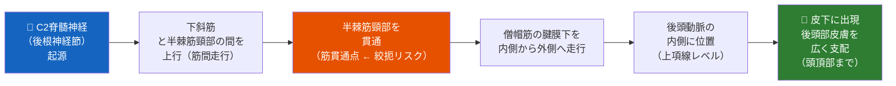
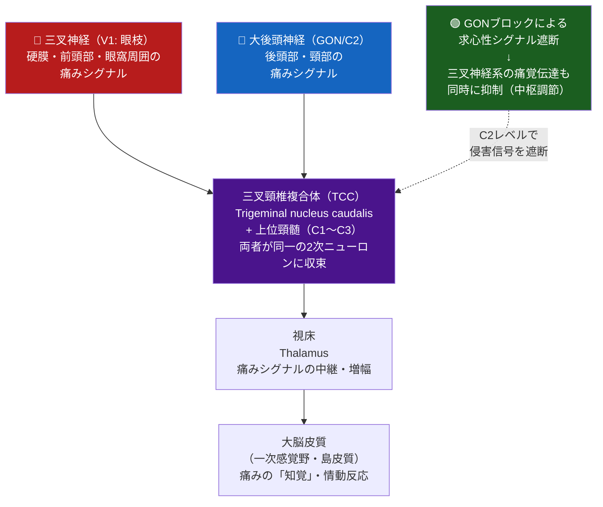
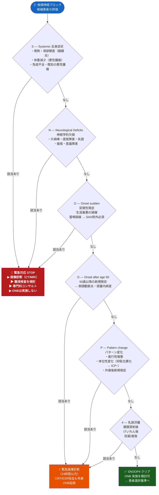
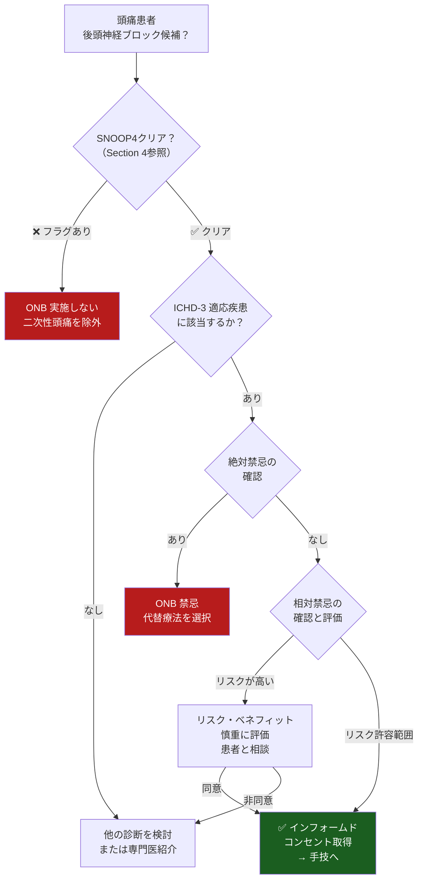
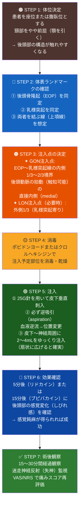
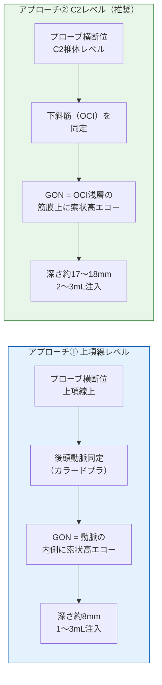
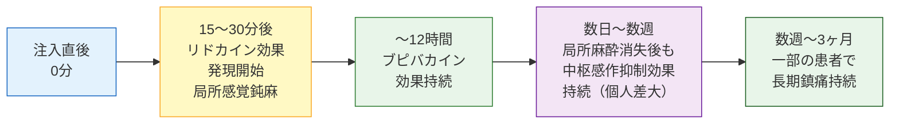
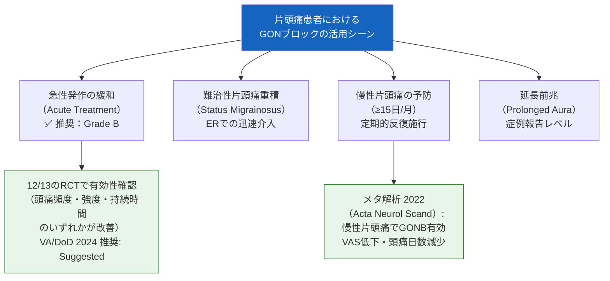
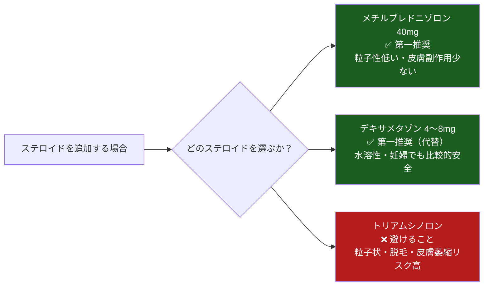
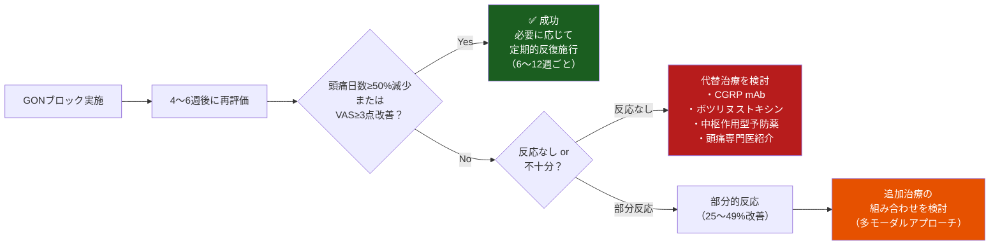

# 🧠 後頭神経ブロック（Occipital Nerve Block）完全ガイド
### 国際エビデンス（ICHD-3 / AAN / IHS / StatPearls 2025）に基づく包括的解説

---

> **⚠️ Academic Disclaimer（学術免責事項）**
>
> 本資料は**学術・教育・研究目的のみ**を対象としています。すべての内容は、資格を持つ医療専門家による臨床適用前のレビューが必要です。本資料は個人的な医療アドバイス、診断、または処方を提供するものではありません。実際の手技は適切な訓練を受けた医療専門家のみが実施すること。

---

## 📋 目次

| # | セクション |
|---|------------|
| 1 | 後頭神経ブロックとは — 基礎概念 |
| 2 | 解剖学 — 後頭部の神経構造 |
| 3 | 作用機序 — 三叉頸椎複合体（TCC）との接続 |
| 4 | SNOOP4 レッドフラグスクリーニング |
| 5 | ICHD-3 適応疾患 |
| 6 | 患者選択基準と禁忌 |
| 7 | 必要物品・使用薬剤 |
| 8 | 手技 ① — ランドマーク法（体表指標法）|
| 9 | 手技 ② — エコーガイド下法（超音波ガイド法）|
| 10 | 術後ケアと効果の評価 |
| 11 | 適応疾患別エビデンスレビュー |
| 12 | ステロイド併用 vs. 局所麻酔薬単独 |
| 13 | 合併症・安全プロファイル |
| 14 | アウトカム評価指標 |
| 15 | 多モーダル統合アプローチ |
| 16 | 参考文献・公式リソース |

---

## 1. 後頭神経ブロックとは — 基礎概念

後頭神経ブロック（Occipital Nerve Block; ONB）は、後頭部に分布する神経（主に**大後頭神経 GON**）の周囲に局所麻酔薬やステロイドを注入することで、後頭部を起源とする様々な頭痛を治療する手技です。

### 1-1. なぜ後頭神経ブロックが頭痛に効くのか（概要）

一言で言えば、**頸部の神経と頭部の神経（三叉神経）が脳幹レベルで収束している**ためです。後頭神経の痛みシグナルを遮断することで、三叉神経系の痛みまで抑制できます（詳細はセクション3参照）。

### 1-2. GON ブロックの双対的役割

| 役割 | 内容 |
|------|------|
| **診断的役割** | 局所麻酔薬の注入後に頭痛が消失→後頭神経起源の頭痛と確認できる |
| **治療的役割** | 急性発作の緩和・予防的抑制の双方に使用できる |

### 1-3. 効果の持続時間

> 局所麻酔薬の効果（数時間）よりも**はるかに長い**鎮痛効果（数週間〜数ヶ月）が得られることがあります。
> これは末梢から中枢への「中枢感作の抑制」が起きているためと考えられています。

---

## 2. 解剖学 — 後頭部の神経構造

後頭部には3つの神経が分布しており、それぞれが異なる部位を支配しています。

### 2-1. 後頭部の3神経

| 神経名 | 英語名 | 起源 | 支配領域 | ブロックの主対象 |
|--------|--------|------|---------|---------------|
| **大後頭神経** | Greater Occipital Nerve (GON) | C2後枝（背側一次枝）の感覚枝 | 後頭部の大部分〜頭頂部 | ✅ 最重要（主標的） |
| **小後頭神経** | Lesser Occipital Nerve (LON) | C2/C3腹側一次枝 | 後頭部外側〜耳介後部 | ⚪ 補助的に使用 |
| **第三後頭神経** | Third Occipital Nerve (TON) | C3後枝の表在内側枝 | 上頸部〜後頭骨隆起下方 | ⚪ 頸原性頭痛に重要 |

### 2-2. 大後頭神経（GON）の走行 — ステップごとに理解する

> ⚠️ **絞扼点（Entrapment Sites）**: GONは下斜筋・半棘筋・僧帽筋の3箇所で物理的に絞扼されやすい。これが後頭神経痛の原因となる。

### 2-3. 体表ランドマークとブロック注入点の関係

後頭部ランドマーク法では以下の2点が基準となります。

| ランドマーク | 説明 |
|------------|------|
| **後頭骨隆起（External Occipital Protuberance; EOP）** | 後頭部正中の骨の突起（「イニオン」とも呼ばれる）。触れてわかる。 |
| **乳様突起（Mastoid Process）** | 耳の後方にある骨の突起。 |

**GON注入点の位置**：

- EOPと乳様突起を結ぶ線上の**内側2/3の位置**（EOPから約1/3）
- **後頭動脈の拍動の内側**（動脈の内側に神経が走行）
- 上項線（Superior Nuchal Line）レベル
- EOPから**約2cm外側・2cm下方**を目安とすることも多い

**LON注入点の位置**：

- EOPと乳様突起を結ぶ線上の**外側1/3の位置**（乳様突起寄り）

### 2-4. 三叉頸椎複合体との解剖学的接続（次セクションへの橋渡し）

GONはC2レベルで三叉頸椎複合体（TCC）に入り、三叉神経第1枝（V1）からの求心性線維と**同一の2次ニューロンに収束**します。これがGONブロックが片頭痛・群発頭痛にも効く解剖学的根拠です。

---

## 3. 作用機序 — 三叉頸椎複合体（TCC）

GONブロックの効果が局所麻酔薬の作用時間を超えて持続するのは、単なる神経の「麻酔」ではなく、中枢レベルの痛覚調節が起きているためと考えられています。

### 3-1. 三叉頸椎複合体（Trigeminocervical Complex, TCC）とは

### 3-2. 作用機序の仮説（現在の理解）

現在提唱されているメカニズムを段階的に説明します。

**Step 1 — 求心性シグナルの遮断**

局所麻酔薬がGONに作用し、後頭部からC2経由で脊髄へ向かう痛みの求心性シグナルを一時的に遮断します。

**Step 2 — TCC レベルでの中枢感作抑制**

GONのシグナル遮断により、TCCにおける三叉神経痛覚ニューロンの興奮性が低下します。これが局所麻酔の効果が消えた後も持続する鎮痛の主要メカニズムと考えられています。

**Step 3 — 下行性疼痛調節系の賦活**

中脳水道周囲灰白質（PAG）からの下行性抑制系が賦活され、脳幹レベルで痛みの「ゲート」が閉じられると推測されています。

**Step 4 — ステロイドによる神経炎症の鎮静**

コルチコステロイドを併用した場合、GON周囲の神経炎症（浮腫・炎症性メディエーター）が抑制され、より長期間の効果が期待できます。

> 📌 **根拠**: Hoffmann J et al. GON block modulates nociceptive signals within the trigeminocervical complex. *J Neurol Neurosurg Psychiatry*, 2021. doi:[10.1136/jnnp-2021-326433](https://jnnp.bmj.com/content/92/10/1046)

---

## 4. SNOOP4 レッドフラグスクリーニング

> ⚠️ **最重要原則**: GONブロックはあくまで**一次性頭痛**に対する治療です。二次性頭痛（脳腫瘍、くも膜下出血、髄膜炎など）を見逃してはなりません。すべての患者で手技実施前にSNOOP4を確認してください。

> ⚠️ **産後・妊娠中の注意**: 硬膜穿刺後頭痛（PDPH）はONBが有効な特殊状況のひとつ（FOUR フラグ）です。ただしSNOOP4の「産後」に該当する場合でも、脳静脈洞血栓症（CVST）を除外したうえでONBを検討します。

---

## 5. ICHD-3 適応疾患

GONブロックが有効とされる主要な頭痛疾患と、対応するICHD-3コードを以下に示します。

| ICHD-3 コード | 疾患名 | GONブロックの位置づけ | エビデンスグレード |
|--------------|--------|---------------------|----------------|
| **13.1** | **後頭神経痛** | ✅ 第一選択・診断的ブロック | **Grade A/B**（ガイドライン推奨） |
| **1.1 / 1.2** | **前兆あり/なし片頭痛（急性期）** | ✅ 急性期・難治性発作に | **Grade B**（AAN/VA-DoD 2024） |
| **1.3** | **慢性片頭痛（≥15日/月）** | ✅ 予防的ブロック（繰り返し施行） | **Grade B**（メタ解析支持） |
| **3.1 / 3.2** | **エピソード性/慢性群発頭痛** | ✅ 移行療法・救済療法として | **Grade B**（2つのRCT支持） |
| **11.2** | **頸原性頭痛** | ✅ 第三後頭神経ブロックも考慮 | **Grade B**（1つのRCT） |
| **7.2.1** | **硬膜穿刺後頭痛（PDPH）** | ✅ ブラッドパッチへの橋渡し療法 | **Grade C**（症例報告・観察研究） |
| **1.3（重積）** | **片頭痛重積（Status Migrainosus）** | ⚪ 補助的使用（ER設定） | **Grade C** |
| **13.x** | **後頭神経絞扼症候群** | ✅ 診断・治療的ブロック | **[Expert Opinion]** |

> 📌 **ソース**: [ICHD-3 公式サイト](https://ichd-3.org/) | [VA/DoD 頭痛ガイドライン 2024](https://www.nursingcenter.com/getattachment/clinical-resources/Guideline-Summaries/Headache/Guideline-Summary_Headache_August-2024.pdf.aspx)

---

## 6. 患者選択基準と禁忌

### 6-1. ONBが特に有効な患者プロファイル

以下のいずれかに当てはまる患者は、GONブロックで特に良好な反応が期待できます。

| 特徴 | 臨床的意義 |
|------|-----------|
| **GON圧迫点で再現性のある圧痛** | 診断的意義が高く、ブロック反応の最良の予測因子 |
| **頭皮の異痛症（Allodynia）** | 中枢感作の存在を示し、末梢遮断が有効な場合が多い |
| **後頭部〜頭頂部の放散痛** | GON支配領域に一致した症状 |
| **他の治療が無効・禁忌** | 妊婦・高齢者など薬物療法に制限がある場合 |
| **片頭痛の急性期・重積状態** | ER/外来での迅速な介入として |
| **群発頭痛の発作期** | 予防薬が効果発現するまでの「橋渡し療法」 |

### 6-2. 患者選択フローチャート

### 6-3. 禁忌一覧

#### 絶対禁忌（Absolute Contraindications）

| 禁忌 | 理由 |
|------|------|
| 患者の拒否 | インフォームドコンセントなしに手技は行えない |
| 局所麻酔薬へのアレルギー | アナフィラキシーリスク |
| 注入部位の感染・皮膚病変 | 感染の深部播種リスク |
| 開頭術後の解剖学的欠損部位 | 頭蓋内浸入リスク |

#### 相対禁忌（Relative Contraindications）

| 禁忌 | 理由 |
|------|------|
| 凝固障害（血液凝固異常・抗凝固療法中） | 血腫形成リスク（慎重に評価） |
| アーノルド・キアリ奇形の既往 | 解剖学的変異による合併症リスク |
| 長時間の腹臥位/座位困難 | 手技の安全な実施に必要な体位がとれない |

> 📌 **ソース**: [StatPearls — Occipital Nerve Block (NCBI Bookshelf, 2025年7月更新)](https://www.ncbi.nlm.nih.gov/books/NBK580523/)

---

## 7. 必要物品・使用薬剤

### 7-1. 標準的な必要物品リスト

| カテゴリー | 品目 | 規格・備考 |
|-----------|------|-----------|
| 注射器 | シリンジ | 5mL（片側）×必要本数 |
| 針 | 注射針 | **25G × 25mm**（標準）— 細針推奨 |
| 消毒 | ポビドンヨードまたはクロルヘキシジン | 注入部位の皮膚消毒 |
| ドレープ | 滅菌ドレープ | 任意（外来では省略可） |
| エコー（任意） | 超音波装置 | 線形プローブ（高周波）推奨 |

### 7-2. 使用薬剤一覧と特性比較

#### 局所麻酔薬（必須）

| 薬剤 | 濃度 | 量 | 作用発現 | 持続時間 | 特徴 |
|------|------|---|---------|---------|------|
| **リドカイン（Lidocaine）** | 1〜2% | 1〜2mL | 5〜10分 | 1〜3時間 | 速効性・確認用に最適 |
| **ブピバカイン（Bupivacaine）** | 0.25〜0.5% | 1〜2mL | 15〜20分 | 6〜12時間 | 長時間作用・予防的ブロックに適 |
| **混合（1:1〜1:3）** | 上記組合せ | 計2〜4mL | 速効+長持続 | — | **最も一般的** — リドカイン即効、ブピバカイン持続 |

> ⚠️ **総注入量**: 片側あたり **最大4mL** を超えないこと。

#### コルチコステロイド（任意・疾患により使い分け）

| 薬剤 | 量 | 溶解性 | 皮膚副作用リスク | 推奨状況 |
|------|---|-------|---------------|---------|
| **メチルプレドニゾロン（Methylprednisolone）** | 40mg/mL × 1〜2mL | 中〜高 | 低め（推奨） | 群発頭痛・頸原性頭痛 |
| **デキサメタゾン（Dexamethasone）** | 2〜4mg × 1mL | 高 | 最低 | 妊婦での使用も比較的安全 |
| **トリアムシノロン（Triamcinolone）** | — | **低（粒子状）** | ⚠️ **最高** | **推奨しない** — 脱毛・皮膚萎縮リスクが高い |

> ⚠️ **重要**: トリアムシノロンは局所皮膚萎縮・後頭部脱毛（円形脱毛症様）の報告が多い。**メチルプレドニゾロンまたはデキサメタゾンが推奨される**。
>
> 📌 **ソース**: Lambru G et al. *Headache* 2012: "Cutaneous Atrophy and Alopecia After Greater Occipital Nerve Injection Using Triamcinolone." doi:[10.1111/j.1526-4610.2012.02270.x](https://headachejournal.onlinelibrary.wiley.com/doi/abs/10.1111/j.1526-4610.2012.02270.x)

### 7-3. 片頭痛 vs. 群発頭痛でのステロイド使用の判断

| 疾患 | ステロイド追加 | 根拠 |
|------|--------------|------|
| 片頭痛 | ❌ 追加効果なし | ステロイドありとなしで短期・長期ともに有意差なし（RCT複数） |
| 群発頭痛 | ✅ 推奨 | 後頭下ステロイド注射が群発期を短縮（2つのRCTで有効性確認） |
| 頸原性頭痛 | ✅ 推奨 | 神経周囲炎症の鎮静に有効 |
| 後頭神経痛 | ✅ 推奨 | 神経絞扼部位の炎症抑制 |
| 硬膜穿刺後頭痛 | ⚪ 状況次第 | 局所麻酔薬のみで十分なことが多い |

> 📌 **ソース**: [StatPearls — Occipital Nerve Block (NCBI, 2025)](https://www.ncbi.nlm.nih.gov/books/NBK580523/) — "Studies suggest no difference in short and long-term migraine pain control when anesthetic is injected alone or in combination with steroid."

---

## 8. 手技 ① — ランドマーク法（体表指標法）

ランドマーク法は体表の骨指標と動脈の拍動を用いて注入点を決定する方法です。外来・救急での迅速な実施に適しています。

### 8-1. ランドマーク法のステップ

### 8-2. 逆吸引（Aspiration）が特に重要な理由

後頭動脈はGON注入点の直近を走行しています。誤って動脈内に注入すると局所麻酔薬全身毒性（LAST）または逆行性塞栓による**脳梗塞**のリスクがあります。必ず注入前に吸引してください。

| 吸引結果 | 対応 |
|---------|------|
| 血液の逆流なし | そのまま注入可 |
| 血液が逆流 | 針を抜いて位置を変更、再試行 |

---

## 9. 手技 ② — エコーガイド下法（超音波ガイド法）

超音波ガイド下法はより標的特異的で、解剖学的変異がある症例や「ランドマーク法が失敗した症例」に特に有用です。

### 9-1. ランドマーク法 vs. エコーガイド下法の比較

| 比較点 | ランドマーク法 | エコーガイド下法 |
|-------|-------------|---------------|
| 設定の容易さ | ✅ 簡便・迅速 | ⚠️ エコー機器が必要 |
| 標的特異性 | ❌ 隣接神経も麻酔されやすい | ✅ 高い特異性 |
| 解剖変異への対応 | ❌ 困難 | ✅ 良好 |
| 診断的精度 | 低い | 高い（神経の直接可視化） |
| 合併症リスク | 5〜10%の懸念 | 低下（動脈損傷回避） |
| 学習曲線 | 浅い | 必要あり |
| エビデンス | 長い使用歴 | 増加中 |

> 📌 **ソース**: Greher M et al. "Sonographic visualization and ultrasound-guided blockade of the greater occipital nerve." *Br J Anaesth* 2010;104:637-42. doi:[10.1093/bja/aeq052](https://academic.oup.com/bja/article/104/5/637/261124)

### 9-2. エコーガイド下法の2つのアプローチ

**アプローチ①：上項線レベル（古典的部位）**

- 線形プローブを上項線に沿って横断位に置く
- カラードプラで後頭動脈を同定
- GONは後頭動脈の**内側**に高エコーの索状構造として見える
- 深さ（皮膚から）：約8mm（皮下の浅い位置）
- 特徴：比較的浅いが、GONがすでに分岐している場合があり確実性がやや低い

**アプローチ②：C2レベル（新しい推奨部位）**

- プローブをC2椎体レベルで後頸部に置く
- 下斜筋（Obliquus Capitis Inferior: OCI）の浅層にGONを同定
- GONは筋膜上に、深さ約17〜18mmに位置する
- **注入の確実性: 20/20（100%）**（vs. 古典的部位: 16/20（80%）— 解剖学的検証より）
- 特徴：標的特異性が高く、診断的ブロックとしても推奨

### 9-3. エコーガイド下法のステップ（上項線レベル）

| ステップ | 操作 | ポイント |
|---------|------|---------|
| 1. プローブ設置 | 線形プローブ（高周波 13〜15MHz）を上項線に横断位 | ゲル少量使用 |
| 2. 後頭動脈同定 | カラードプラON → 拍動する血流信号を探す | EOPの1〜2cm外側に出現 |
| 3. GON同定 | 動脈内側の白い索状構造（高エコー）をGONと特定 | 直径約4mm × 1.4mm |
| 4. 針の刺入 | 平面内アプローチ（in-plane）で針先を追跡 | 神経束内への直接注入を避ける |
| 5. 逆吸引 | 血液の逆流がないことを確認 | 動脈内注入予防 |
| 6. 注入 | 神経の**周囲**（epineural）に薬液を注入（ハイドロダイセクション） | 薬液がGONを「包む」のを確認 |

---

## 10. 術後ケアと効果の評価

### 10-1. 術後即時管理

| 時間 | 対応 |
|------|------|
| 注入直後 | 注入部位を軽く圧迫（出血・血腫予防） |
| 5分後 | リドカイン使用時は感覚変化（しびれ・温感）を確認 |
| 15〜30分後 | VAS/NRS で頭痛スコア再評価、迷走神経反射症状の確認 |
| 30分後 | 歩行・帰宅可能かチェック（失神リスクが消えた後） |

### 10-2. 効果の時間軸

### 10-3. 再投与の基準

- 効果が良好で持続期間が短い場合：**6週〜3ヶ月ごと**の繰り返し施行を検討
- **6ヶ月以内に3回以上**のブロックが必要な場合：代替・追加治療の探索を強く推奨

---

## 11. 適応疾患別エビデンスレビュー

### 11-1. 後頭神経痛（Occipital Neuralgia, ICHD-3: 13.1）

後頭神経ブロックが**最も強い適応**を持つ疾患です。

| 項目 | 内容 |
|------|------|
| 疾患の定義 | GON・LON・TONの支配領域を走る片側性または両側性の発作性疼痛 |
| 診断的ブロックの意義 | 「診断的GONブロックで痛みが消失すること」がICHD-3診断基準に含まれる |
| 治療的ブロックの位置づけ | 第一選択療法（ステロイド併用を推奨） |
| 期待される効果 | 数日〜数ヶ月の疼痛緩和 |
| 反復施行 | 必要に応じて繰り返し可 |
| エビデンスグレード | **[Grade B]** — 観察研究・症例シリーズが中心 |

### 11-2. 片頭痛（Migraine）

**片頭痛のGONブロックにおける重要エビデンス**

| 研究 | デザイン | 主な結果 |
|------|---------|---------|
| 12のRCTメタ解析 | SR/MA | 12/13のRCTで有効性あり（Headache 頻度・強度・持続時間改善） |
| VA/DoD 2024ガイドライン | 推奨 | "急性期片頭痛治療としてGONBが示唆される" |
| Velásquez-Rimachi 2022 | SR/MA（Acta Neurol Scand） | 慢性片頭痛でVAS・頭痛日数有意改善 |

### 11-3. 群発頭痛（Cluster Headache, ICHD-3: 3.1/3.2）

| 項目 | 内容 |
|------|------|
| 使用タイミング | 群発期開始時の「移行療法（Transitional Therapy）」として。予防薬（ベラパミル等）が効果発現するまでの橋渡し。 |
| 注入薬剤 | **ステロイドの追加が必須**（局所麻酔薬のみでは不十分） |
| メタ解析のまとめ | 1ヶ月時点の無痛率: **50%**（95%CI 24〜76%）。RCT 2件でプラセボ比の相対リスク比: **4.86**（95%CI 1.35〜17.55）|
| エビデンスグレード | **[Grade B]**（2つのRCT） |

> 📌 **ソース**: González-García N et al. "Efficacy and safety of greater occipital nerve block for the treatment of cluster headache: a systematic review and meta-analysis." *Cephalalgia* 2020. PMID: [32781922](https://pubmed.ncbi.nlm.nih.gov/32781922/)

### 11-4. 頸原性頭痛（Cervicogenic Headache, ICHD-3: 11.2）

| 特徴 | 詳細 |
|------|------|
| 第三後頭神経（TON）ブロックの意義 | C2-3椎間関節由来の頸原性頭痛にはTONブロックが特に有効 |
| GONブロックの役割 | GON + TONの同時ブロックが推奨（単独より上乗せ効果あり） |
| ステロイド追加 | 推奨（神経周囲炎症の鎮静） |
| エビデンスグレード | **[Grade B]** — 1つのRCT |
| 注意点 | 理学療法との組み合わせで相乗効果 |

### 11-5. 硬膜穿刺後頭痛（PDPH）

| 特徴 | 詳細 |
|------|------|
| 使用タイミング | ブラッドパッチ（血液パッチ）実施前の橋渡し、またはブラッドパッチ拒否時 |
| 推定機序 | 低髄液圧による三叉神経・後頭神経の感作を抑制 |
| エビデンスグレード | **[Grade C]** — 観察研究・症例報告中心 |
| 妊婦への使用 | 比較的安全（局所麻酔薬のみ推奨、ステロイドは慎重に） |

---

## 12. ステロイド併用 vs. 局所麻酔薬単独

最も臨床的に重要な問いのひとつは「ステロイドを加えるべきか？」です。現時点の最良のエビデンスをまとめます。

| 疾患 | ステロイド追加の推奨 | 根拠 |
|------|------------------|------|
| **片頭痛** | ❌ 追加効果なし | 複数のRCTで局所麻酔単独と有意差なし |
| **群発頭痛** | ✅ 強く推奨 | 後頭下ステロイド注射でRCT 2件が有効性確認 |
| **後頭神経痛** | ✅ 推奨（長期効果） | 神経周囲炎症の鎮静に有効 |
| **頸原性頭痛** | ✅ 推奨 | 神経根周囲炎症の鎮静 |
| **PDPH** | ⚪ 局所麻酔のみで十分なことが多い | エビデンス限定的 |

**ステロイド選択のアルゴリズム（使用する場合）**：

> 📌 **ソース**: Shields KG et al. "Alopecia and cutaneous atrophy after greater occipital nerve infiltration with corticosteroid." *Neurology* 2004;63:2193–4. | Lambru G et al. *Headache* 2012.

---

## 13. 合併症・安全プロファイル

GONブロックは一般的に安全性が高く、重篤な合併症はまれです。

### 13-1. 合併症の全体像

| カテゴリー | 合併症 | 頻度 | 予防策 |
|-----------|--------|------|--------|
| **局所・一時的** | 注入部位の疼痛・内出血 | 一般的 | 細針使用・圧迫止血 |
| **局所・一時的** | 迷走神経反射（血管迷走神経性失神） | まれ〜時々 | 仰臥位で経過観察 |
| **ステロイド関連** | 皮膚萎縮（Cutaneous Atrophy） | <1% | メチルプレドニゾロン推奨・深部注入 |
| **ステロイド関連** | 後頭部脱毛（Alopecia） | まれ | トリアムシノロン回避 |
| **ステロイド関連** | 毛嚢炎（Folliculitis） | まれ | 無菌操作の徹底 |
| **血管関連** | 動脈内注入（後頭動脈） | まれ | 必ず逆吸引確認 |
| **重篤（極めてまれ）** | 局所麻酔薬全身毒性（LAST） | 極めてまれ | 逆吸引・低用量・分割注入 |
| **重篤（極めてまれ）** | くも膜下腔誤注入 → 脳幹麻酔 | 極めてまれ | 深度管理・エコーガイド |
| **重篤（極めてまれ）** | 急性小脳症候群 | 症例報告レベル | — |

### 13-2. 特に注意が必要な合併症：脱毛と皮膚萎縮

後頭部の脱毛（円形脱毛症様の外見）と皮膚萎縮は、**トリアムシノロン**を使用した際に報告が集中しています。

**発症メカニズム**：

- トリアムシノロンは水に溶けにくい**粒子状**ステロイドで、皮下に結晶が沈着する
- 周囲血管の収縮 → 皮膚・毛根への血流低下 → 皮膚萎縮・脱毛
- 皮膚萎縮の皮下組織での好発部位であるGON注入点（皮膚が薄い後頭部）は特にリスクが高い

> ✅ **回避策**: メチルプレドニゾロンまたはデキサメタゾンを使用し、皮内への浅い注入を避けること。

### 13-3. 局所麻酔薬全身毒性（LAST）への対応の準備

GONブロックを実施する場所には、LASの初期症状（耳鳴り・金属味・痙攣）を認識し対応できるスタッフと、**イントラリポス（脂肪乳剤）**の準備があることが望ましいです。

---

## 14. アウトカム評価指標

以下の標準化ツールを用いてGONブロックの効果を定量的に評価します。

### 14-1. 推奨評価ツール一覧

| ツール | 評価内容 | 判断基準 | 評価タイミング |
|--------|---------|---------|-------------|
| **VAS / NRS (0〜10)** | 痛みの強度 | 3以上の低下を有意とする | 注入前・注入30分後・1週後 |
| **HIT-6（頭痛影響テスト）** | 日常生活への影響 | ≥60点 = 重度障害 | 3ヶ月ごと |
| **MIDAS** | 偏頭痛による生活機能障害 | ≥21点 = Grade IV 重度 | 3ヶ月ごと |
| **頭痛日数/月** | 頻度の客観的指標 | **≥50%減少**を治療成功の目標とする | 毎月 |
| **PGIC（患者全般印象変化）** | 患者の主観的改善感 | 7段階（1=全く改善なし〜7=著明改善） | 注入4〜6週後 |

### 14-2. 治療成功の定義と再評価

---

## 15. 多モーダル統合アプローチ

GONブロックは単独治療として使用することもできますが、最善の効果は**他の治療法との組み合わせ**によって得られます。

### 15-1. 疾患別推奨統合プロトコル

#### 慢性片頭痛（ICHD-3: 1.3）

| 治療モダリティ | 内容 | エビデンス |
|-------------|------|-----------|
| GONブロック | 6〜12週ごと定期施行（急性増悪時にも） | **[Grade B]** |
| CGRP mAb | エレヌマブ/フレマネズマブ/ガルカネズマブ月1回 | **[Grade A]** |
| ボツリヌストキシン | PREEMPTプロトコル 12週毎（155〜195単位） | **[Grade A]** |
| 認知行動療法 | 薬物療法との組み合わせで相乗効果 | **[Grade B]** |
| マグネシウム補充 | 400〜600mg/日（グリシン酸/クエン酸） | **[Grade A/B]** |

#### 群発頭痛（ICHD-3: 3.1/3.2）の群発期管理

| 治療モダリティ | 内容 | エビデンス |
|-------------|------|-----------|
| GONブロック（ステロイド込み） | 群発期開始時に即施行（移行療法） | **[Grade B]** |
| ベラパミル（予防） | 240〜480mg/日（主要予防薬） | **[Grade A]** |
| スマトリプタン皮下注射（急性期） | 6mg 皮下注、各発作に | **[Grade A]** |
| 高流量酸素吸入（急性期） | 100% O₂ 12〜15L/分 × 15〜20分 | **[Grade A]** |

#### 後頭神経痛の難治性症例

| 治療ステップ | 内容 |
|------------|------|
| **Step 1** | GONブロック（局所麻酔薬＋ステロイド） × 繰り返し施行 |
| **Step 2** | 薬物療法：アミトリプチリン/ガバペンチン/カルバマゼピン |
| **Step 3** | パルス高周波（PRF）療法 / 後頭神経刺激（ONS） |
| **Step 4** | 脊髄刺激療法（SCS）— 難治例 |

### 15-2. GONブロックと他治療の相互作用

GONブロックは薬物療法を**代替**するのではなく**補完**するものです。特に以下の組み合わせが有用です。

| 組み合わせ | 相乗効果の根拠 |
|-----------|-------------|
| GONブロック ＋ CGRP mAb | 末梢（GONブロック）＋中枢（CGRP）の異なる標的に作用 |
| GONブロック ＋ 理学療法 | 頸椎由来の頭痛（頸原性頭痛）において特に有効 |
| GONブロック ＋ 認知行動療法 | 痛みの恐怖・回避行動の修正と身体的介入の統合 |
| GONブロック ＋ 生活習慣改善 | トリガー管理＋神経系のリセットを同時に図る |

---

## 16. 参考文献・公式リソース

### 16-1. 最重要一次文献・ガイドライン

| カテゴリー | 文献・リソース | URL |
|-----------|-------------|-----|
| **解剖・手技（最重要）** | StatPearls — Occipital Nerve Block (2025年7月更新) | [https://www.ncbi.nlm.nih.gov/books/NBK580523/](https://www.ncbi.nlm.nih.gov/books/NBK580523/) |
| **ICHD-3 診断基準** | ICHD-3 公式サイト（全文閲覧可） | [https://ichd-3.org/](https://ichd-3.org/) |
| **ICHD-3 全文PDF** | ICHD-3 2018年版 | [https://ichd-3.org/wp-content/uploads/2018/01/The-International-Classification-of-Headache-Disorders-3rd-Edition-2018.pdf](https://ichd-3.org/wp-content/uploads/2018/01/The-International-Classification-of-Headache-Disorders-3rd-Edition-2018.pdf) |
| **VA/DoD ガイドライン 2024** | 頭痛の総合診療ガイドライン（GONブロック推奨含む） | [https://www.nursingcenter.com/getattachment/clinical-resources/Guideline-Summaries/Headache/Guideline-Summary_Headache_August-2024.pdf.aspx](https://www.nursingcenter.com/getattachment/clinical-resources/Guideline-Summaries/Headache/Guideline-Summary_Headache_August-2024.pdf.aspx) |
| **IHS 急性期治療 2024** | IHS Acute Treatment Recommendations (Cephalalgia) | [https://journals.sagepub.com/doi/10.1177/03331024241252666](https://journals.sagepub.com/doi/10.1177/03331024241252666) |
| **AAN ガイドライン** | AAN Headache Guidelines ホームページ | [https://www.aan.com/guidelines/](https://www.aan.com/guidelines/) |
| **EHF CGRP mAb ガイドライン 2022** | CGRP製剤予防療法ガイドライン（PMC全文） | [https://www.ncbi.nlm.nih.gov/pmc/articles/PMC9188162/](https://www.ncbi.nlm.nih.gov/pmc/articles/PMC9188162/) |

### 16-2. GONブロック専門文献（PubMed）

| 文献 | 内容 | URL/PMID |
|------|------|---------|
| Castillo-Álvarez F et al. *Med Clin (Barc)* 2023 | GONブロックのエビデンスレビュー（最新系統的レビュー） | [https://www.sciencedirect.com/science/article/abs/pii/S2387020623002905](https://www.sciencedirect.com/science/article/abs/pii/S2387020623002905) |
| González-García N et al. *Cephalalgia* 2020 | 群発頭痛へのGONB：SR/MA | PMID: [32781922](https://pubmed.ncbi.nlm.nih.gov/32781922/) |
| Shekoohi S et al. *J Pain Headache* 2024 | GONブロックのナラティブレビュー（2024年2月） | [https://www.jofph.com/articles/10.22514/jofph.2024.010](https://www.jofph.com/articles/10.22514/jofph.2024.010) |
| Greher M et al. *Br J Anaesth* 2010 | エコーガイド下GONBの解剖学的検証（C2法 vs. 古典法） | [https://academic.oup.com/bja/article/104/5/637/261124](https://academic.oup.com/bja/article/104/5/637/261124) |
| Afridi SK et al. *Cephalalgia* 2006 | GONBのPubMedレビュー（PMID: 17504651） | PMID: [17504651](https://pubmed.ncbi.nlm.nih.gov/17504651/) |
| Lambru G et al. *Headache* 2012 | トリアムシノロンによる脱毛・皮膚萎縮 | [https://headachejournal.onlinelibrary.wiley.com/doi/abs/10.1111/j.1526-4610.2012.02270.x](https://headachejournal.onlinelibrary.wiley.com/doi/abs/10.1111/j.1526-4610.2012.02270.x) |
| Velásquez-Rimachi V et al. *Acta Neurol Scand* 2022 | 慢性片頭痛へのGONB：MA | [https://pubmed.ncbi.nlm.nih.gov/35538756/](https://pubmed.ncbi.nlm.nih.gov/35538756/) |
| Hoffmann J et al. *JNNP* 2021 | GONBの三叉頸椎複合体への作用（fMRI研究） | doi:[10.1136/jnnp-2021-326433](https://jnnp.bmj.com/content/92/10/1046) |

### 16-3. エコーガイド下法・解剖学リソース

| リソース | URL |
|---------|-----|
| NYSORA — Ultrasound-Guided GON Block | [https://www.nysora.com/pain-management/ultrasound-guided-greater-occipital-nerve-block/](https://www.nysora.com/pain-management/ultrasound-guided-greater-occipital-nerve-block/) |
| USRA — Greater Occipital Nerve Block | [https://usra.ca/pain-medicine/specific-blocks/head-neck/gon.php](https://usra.ca/pain-medicine/specific-blocks/head-neck/gon.php) |
| Emory — Ultrasound-Guided ONB Procedure | [https://med.emory.edu/departments/emergency-medicine/sections/ultrasound/case-of-the-month/procedures/occipital-nerve-block.html](https://med.emory.edu/departments/emergency-medicine/sections/ultrasound/case-of-the-month/procedures/occipital-nerve-block.html) |
| ALIEM — GON Block in the ED | [https://www.aliem.com/greater-occipital-nerve-block-emergency-department/](https://www.aliem.com/greater-occipital-nerve-block-emergency-department/) |

### 16-4. 継続的情報更新リソース

| 名称 | 用途 | URL |
|------|------|-----|
| PubMed（GON Block検索） | 最新RCT・MA検索 | [https://pubmed.ncbi.nlm.nih.gov/?term=greater+occipital+nerve+block+headache&filter=pubt.clinicaltrial](https://pubmed.ncbi.nlm.nih.gov/?term=greater+occipital+nerve+block+headache&filter=pubt.clinicaltrial) |
| Cochrane Library | 系統的レビュー検索 | [https://www.cochranelibrary.com/search?query=occipital+nerve+block&searchBy=3](https://www.cochranelibrary.com/search?query=occipital+nerve+block&searchBy=3) |
| Journal of Headache and Pain | EHF公式誌（OA） | [https://thejournalofheadacheandpain.biomedcentral.com/](https://thejournalofheadacheandpain.biomedcentral.com/) |
| ClinicalTrials.gov | 進行中・完了試験 | [https://clinicaltrials.gov/search?cond=occipital+nerve+block](https://clinicaltrials.gov/search?cond=occipital+nerve+block) |

---

## 🔑 まとめ — 初学者が押さえるべき10のポイント

| # | ポイント |
|---|---------|
| 1 | GONブロックは「局所麻酔」だが、効果は中枢（三叉頸椎複合体）レベルの調節によって局所麻酔薬の効果持続より長く続く |
| 2 | **SNOOP4を必ず確認**してから実施する。二次性頭痛の見逃しは致命的になりえる |
| 3 | GON注入点は「後頭動脈の拍動の**直接内側**」が目安 |
| 4 | 注入前の**逆吸引（aspiration）は必須** — 動脈内注入回避 |
| 5 | 片頭痛ではステロイド追加の上乗せ効果はない。群発頭痛・後頭神経痛では追加推奨 |
| 6 | **トリアムシノロンは使用しない**（脱毛・皮膚萎縮リスク）。メチルプレドニゾロンまたはデキサメタゾンを選ぶ |
| 7 | 注入総量は片側**最大4mL**。両側ブロックでも過剰にならないよう注意 |
| 8 | エコーガイド下法（C2レベル）は100%の標的特異性を持ち、難治例・解剖変異例に推奨 |
| 9 | **6ヶ月以内に3回以上**必要な場合は代替・追加治療を強く検討 |
| 10 | GONブロックは単独治療ではなく、薬物療法・CGRP製剤・理学療法などとの**多モーダル統合の一部**として位置づける |

---

*最終更新: 2025年6月（参考文献: StatPearls 2025年7月版、VA/DoD 2024、ICHD-3、EHF 2022含む）*
*本文書に含まれるすべての情報は学術目的のみ。臨床応用には必ず担当医師の判断を仰いでください。*
