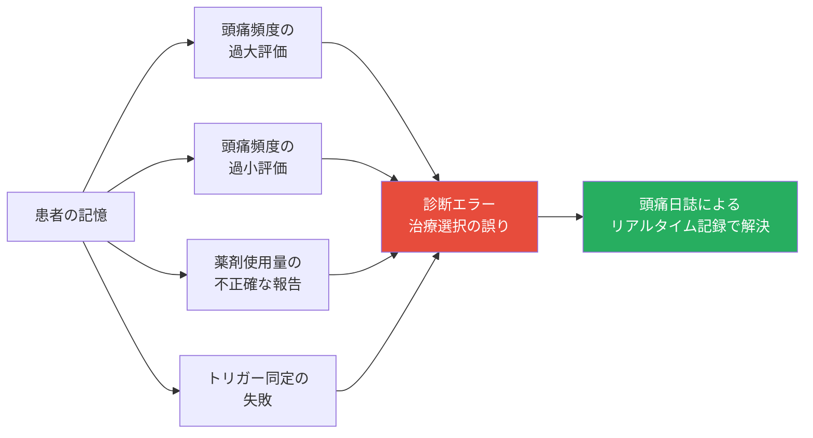
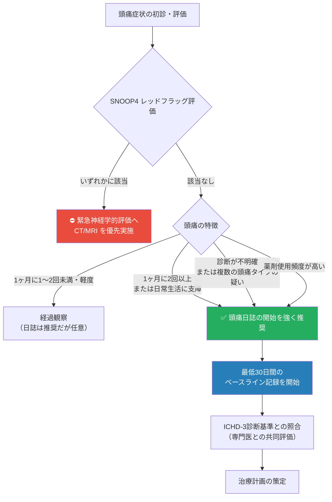
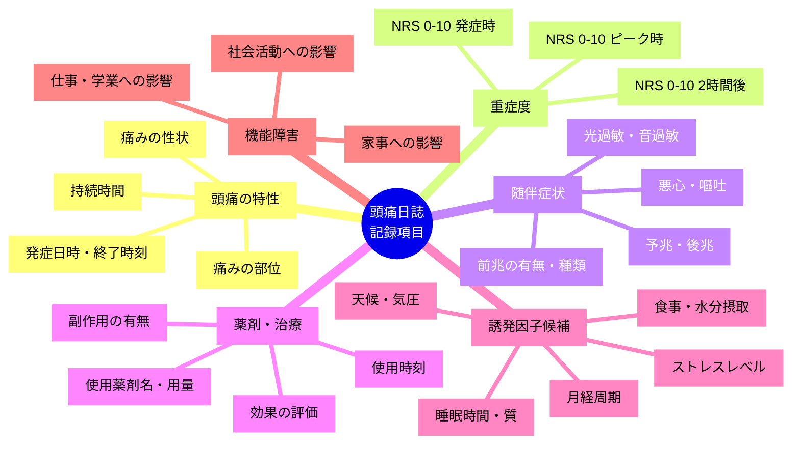
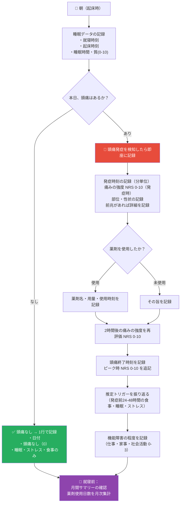
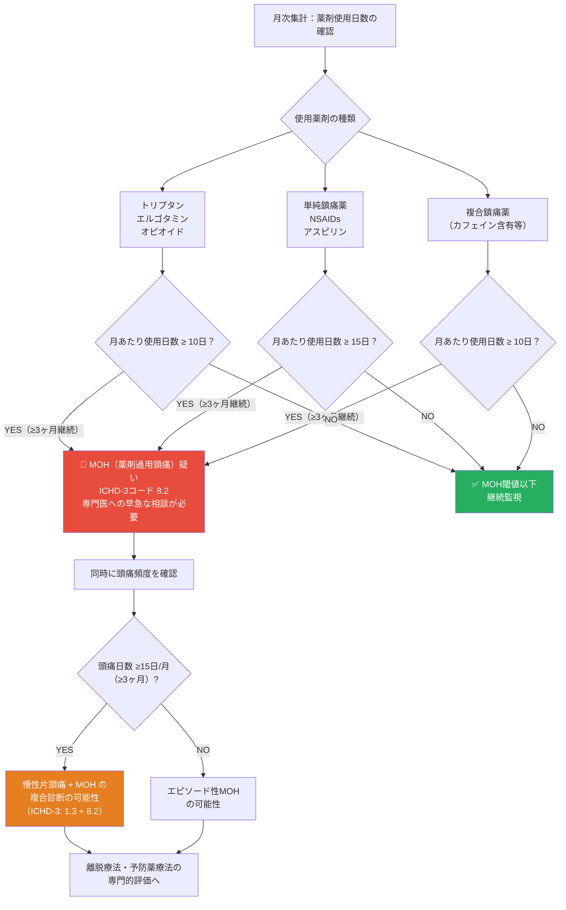
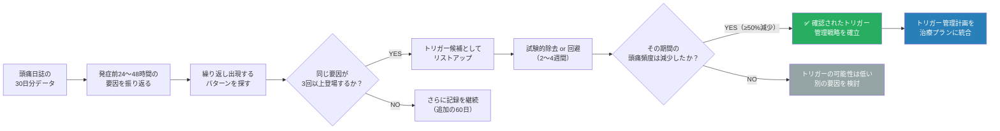
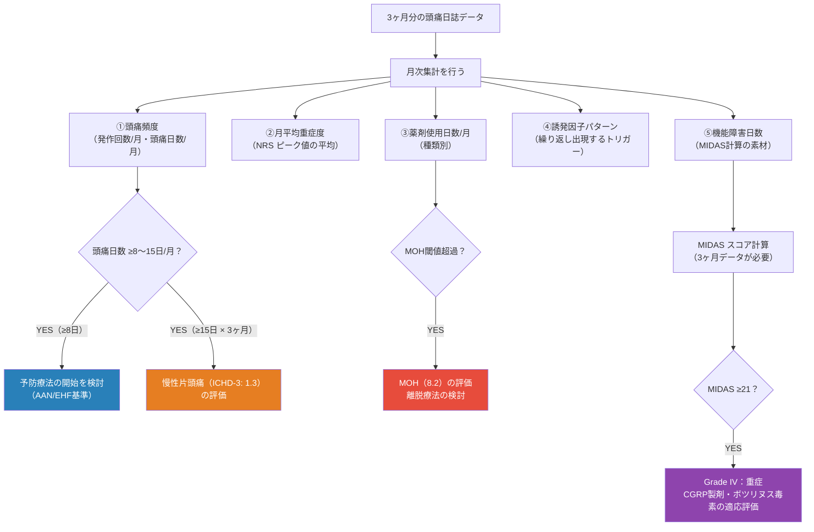
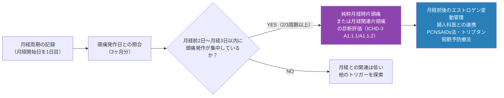
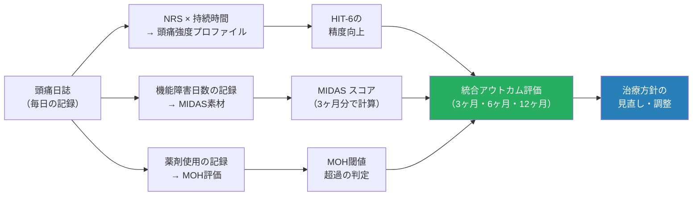

# 頭痛日誌（Headache Diary）完全ガイド

## 初学者向けステップバイステップ解説 — 国際エビデンス準拠

---

> **⚠️ 学術免責事項（Academic Disclaimer）**
>
> 本文書は**学術的・教育的・研究目的のみ**を対象として作成されています。  
> 記載されたすべての情報は、資格を有する医療専門家による査読・判断を経たうえで臨床に適用される必要があります。  
> 本文書は個人への医療アドバイス・診断・処方の代替となるものではありません。

---

## 目次

1. [SNOOP4 レッドフラッグスクリーニング（最優先事項）](#1-snoop4)
2. [頭痛日誌とは何か — 定義と意義](#2-定義)
3. [なぜ頭痛日誌が必要なのか — エビデンスの全体像](#3-エビデンス)
4. [STEP 1：記録の準備](#4-step1)
5. [STEP 2：記録項目の全体理解](#5-step2)
6. [STEP 3：日々の記録手順](#6-step3)
7. [STEP 4：MOHリスクの継続的監視](#7-step4)
8. [STEP 5：トリガー（誘発因子）の同定と管理](#8-step5)
9. [STEP 6：データ解析とパターン認識](#9-step6)
10. [STEP 7：医師との効果的な情報共有](#10-step7)
11. [紙日誌 vs. デジタル日誌 — 比較と選択基準](#11-比較)
12. [推奨デジタルツールとアプリ](#12-アプリ)
13. [特殊集団への配慮](#13-特殊集団)
14. [アウトカム測定との統合（HIT-6 / MIDAS / VAS）](#14-アウトカム)
15. [12週間モニタリングプロトコル](#15-プロトコル)
16. [参考文献・ソースURL一覧](#16-参考文献)

---

## 1. SNOOP4 レッドフラッグスクリーニング（最優先評価） {#1-snoop4}

> **⛔ 以下の兆候がある場合は、頭痛日誌の開始より前に緊急医療評価（CT/MRI）が必要です。**  
> 頭痛日誌はあくまでも一次性頭痛の管理ツールであり、二次性頭痛の除外は医師が行います。

| 記号 | 意味 | 具体的な警戒徴候 | 鑑別すべき緊急疾患 |
|-----|------|----------------|-----------------|
| **S** | Systemic symptoms | 発熱・項部硬直・体重減少・免疫不全・悪性腫瘍既往 | 細菌性髄膜炎・脳炎・悪性腫瘍 |
| **N** | Neurological deficits | 麻痺・感覚障害・失語・複視・意識障害・認知変化 | 脳卒中・脳腫瘍・硬膜下血腫 |
| **O** | Onset sudden | 「人生最悪の頭痛」・雷鳴頭痛（thunderclap headache） | くも膜下出血（SAH）|
| **O** | Onset after age 50 | 50歳以降の新規頭痛 | 側頭動脈炎・頭蓋内病変 |
| **P** | Pattern change | 進行性の悪化・外傷後・体位依存性（臥位悪化→ICP↑、立位悪化→ICP↓） | 頭蓋内圧亢進症・低髄液圧症 |
| **4** | 4つのP | Papilledema（乳頭浮腫）/ Postdural（硬膜穿刺後）/ Post-seizure（痙攣後）/ Pregnancy/Postpartum（妊娠・産後） | 各病態に応じた緊急評価 |

> 📌 **ソース**：ICHD-3 How to Use the Classification — [ichd-3.org](https://ichd-3.org/how-to-use-the-classification/)

---

## 2. 頭痛日誌とは何か — 定義と意義 {#2-定義}

### 2.1 定義

**頭痛日誌（Headache Diary）** とは、患者が頭痛発作ごとに症状・随伴症状・薬剤使用・誘発因子・日常機能への影響を体系的に記録するプロスペクティブ（前向き）な自己記録ツールです。

ICHD-3（国際頭痛分類第3版）は、複数の頭痛タイプが疑われる患者に対して、診断精度の向上と薬剤消費量の正確な把握のために頭痛日誌の使用を**明示的に推奨**しています。

> *「患者が2種類以上の頭痛タイプまたはサブタイプを有すると疑われる場合、各頭痛エピソードの重要な特徴を記録した診断的頭痛日誌を記載することを強く推奨する。頭痛日誌が診断精度を向上させ、薬剤消費量のより正確な評価を可能にすることが示されている」*
>
> — ICHD-3 How to Use the Classification, ichd-3.org

### 2.2 頭痛日誌の5つの核心的役割

| 役割 | 具体的機能 | 対応するエビデンス |
|------|-----------|----------------|
| **①診断精度の向上** | 主観的症状を客観的データに変換 → ICHD-3診断基準との照合 | 感度92%（片頭痛）、87%（MOH）[PubMed: 18624804] |
| **②薬剤過用頭痛（MOH）の早期検出** | 月あたり使用日数のリアルタイム監視 → 8〜10日/月の閾値超過を可視化 | ICHD-3 コード 8.2 準拠 |
| **③トリガーの同定** | 発症前24〜48時間の環境・食事・睡眠・ホルモン変化との相関分析 | N1-Headache App: 個人特有トリガー同定 [ClinicalTrials NCT05979285] |
| **④治療効果の定量化** | ベースライン比較による50%改善基準の客観的評価 | IHS臨床試験ガイドライン準拠 |
| **⑤医師との情報共有** | 記憶依存バイアスの排除 → 診察時の正確なデータ提示 | VA/DoD CPG 2023 |

---

## 3. なぜ頭痛日誌が必要なのか — エビデンスの全体像 {#3-エビデンス}

### 3.1 診断精度の向上

| 研究 | 対象 | 主な知見 | エビデンスレベル |
|-----|------|---------|---------------|
| Valade D et al., 2008 (*Cephalalgia*) | 頭痛センター初診患者 n=76 | 片頭痛感度92%・TTH感度75%・MOH感度75%（臨床面接との比較）；コンプライアンス71% | **Grade B** |
| Vandenbussche N et al., 2025 (*Neurol Int*) | 27名・90日間スマートフォン日誌 | 「確実な片頭痛」の新規ICHD-3症状を患者の97%以上で追加検出 | **Grade B** |
| Peng KP et al., 2024 (*J Headache Pain*) | AI診断モデル 59名（多施設前向き）| 最低1ヶ月の頭痛日誌が正解診断のゴールドスタンダードとして機能 | **Grade B** |

### 3.2 診断における「記憶バイアス」の問題

後ろ向き（回顧的）なデータ収集は、以下の理由で不正確です。

### 3.3 MOH検出における決定的役割

**薬剤過用頭痛（MOH, ICHD-3コード8.2）** の診断は、月あたりの薬剤使用日数の客観的記録なしには確定できません。

| 薬剤種別 | MOH閾値 | 日誌なしの検出率 | 日誌ありの検出率 |
|---------|---------|---------------|---------------|
| トリプタン・エルゴタミン・オピオイド | **≥10日/月** × 3ヶ月 | 低い（患者自身も気づいていないことが多い） | スクリーニング感度95.2%（ICHD基準の自己報告版）[PubMed: PMC3850931] |
| 単純鎮痛薬・NSAIDs | **≥15日/月** × 3ヶ月 | 低い | 高い |
| 複合鎮痛薬 | **≥10日/月** × 3ヶ月 | 低い | 高い |

### 3.4 IHS臨床試験ガイドラインにおける中心的役割

国際頭痛学会（IHS）の臨床試験ガイドライン（第4版, *Cephalalgia* 2024）は、すべての片頭痛予防・急性期治療試験において**電子頭痛日誌（e-diary）を標準的な主要エンドポイント収集ツール**として指定しています。

> 📌 **ソース**：IHS Guidelines — [ihs-headache.org/en/resources/guidelines/](https://ihs-headache.org/en/resources/guidelines/)

---

## 4. STEP 1：記録の準備 {#4-step1}

### 4.1 日誌開始の適応フローチャート

### 4.2 必要なもの（紙版の場合）

| アイテム | 推奨仕様 |
|---------|---------|
| **記録ノートまたは印刷用紙** | A4またはA5；月ごとの一覧表形式が望ましい |
| **ペン** | 素早く記入できる油性ボールペン |
| **定規・カレンダー** | 月・日の確認用 |
| **NRSカード** | 0〜10の数値評価スケールのリファレンスカード（オプション） |

> 📌 **推奨テンプレート（PDF・無料）**：  
> - VA/DoD 7日間頭痛日誌（2024年最新版）：[healthquality.va.gov](https://www.healthquality.va.gov/guidelines/pain/headache/HA-Diary-7-Day-Diary-Final-11Jan2024.pdf)  
> - VA/DoD 3ヶ月頭痛日誌（2024年最新版）：[healthquality.va.gov](https://www.healthquality.va.gov/guidelines/Pain/headache/)  
> - IHS患者リソース：[ihs-headache.org](https://ihs-headache.org/en/resources/patient-resources/)  
> - Migraine Trust 日誌リソース：[migrainetrust.org](https://migrainetrust.org/live-with-migraine/self-management/keeping-a-migraine-diary/)

---

## 5. STEP 2：記録項目の全体理解 {#5-step2}

### 5.1 記録項目マップ（全体像）

### 5.2 必須記録項目の詳細一覧

| カテゴリー | 記録項目 | 記録の頻度 | なぜ重要か |
|-----------|---------|-----------|-----------|
| **頭痛の時間的特徴** | 発症日時・終了時刻・持続時間 | 発作のたびに | ICHD-3診断基準（片頭痛：4〜72h、TTH：30min〜7日）の判定に必須 |
| **痛みの強度（NRS）** | 0〜10の数値（発症時・ピーク・2時間後の3点） | 発作のたびに | 治療効果の定量評価；IHS臨床試験標準エンドポイント |
| **痛みの部位** | 片側/両側・前頭/側頭/後頭/眼窩周囲 | 発作のたびに | ICHD-3分類の判定（片頭痛：通常片側、TTH：通常両側）|
| **痛みの性状** | 拍動性/圧迫性/締め付け感/刺すような | 発作のたびに | ICHD-3診断基準の直接項目 |
| **随伴症状** | 悪心・嘔吐・光過敏・音過敏・臭い過敏 | 発作のたびに | ICHD-3片頭痛基準の必須項目（悪心または光+音過敏）|
| **前兆（Aura）** | 視覚性（閃輝暗点・暗点）・感覚性・言語性；持続時間 | 発作のたびに | ICHD-3コード1.2（前兆ありの片頭痛）の診断 |
| **予兆（Prodrome）** | 情動変化・欠伸・頸部こわばり・倦怠感（発症前数時間〜数日） | 毎日 | 早期介入のタイミング特定 |
| **後兆（Postdrome）** | 集中力低下・倦怠感・頸部痛（発作後24h） | 発作後 | 真の頭痛持続時間の把握 |
| **薬剤使用** | 薬剤名・用量・使用時刻・効果（NRS変化）・副作用 | 使用のたびに | **MOH検出の核心**；トリプタン≥10日/月、鎮痛薬≥15日/月が閾値 |
| **睡眠** | 就寝時刻・起床時刻・睡眠時間・睡眠の質（0〜10） | 毎日 | 睡眠変動は強力なトリガー（週末の寝坊→「週末片頭痛」）|
| **食事・水分** | 食事時刻・水分摂取量・アルコール・カフェイン量 | 毎日 | 食事スキップ・脱水・カフェイン離脱はトリガー |
| **月経周期（女性）** | 月経開始日を1日目として記録 | 毎日 | 月経前後のエストロゲン急落は強力なトリガー |
| **ストレス** | ストレスレベル（NRS 0〜10） | 毎日 | 慢性ストレスおよびストレス解放後頭痛の同定 |
| **天候・気圧** | 気圧・気温・天気（気象アプリと照合） | 毎日（任意） | 気象感受性の評価（約40%の片頭痛患者が気候変化に感受性あり）|
| **日常機能障害** | 仕事・家事・社会活動への支障（0〜3段階） | 発作のたびに | MIDAS計算の根拠データとなる |

---

## 6. STEP 3：日々の記録手順 {#6-step3}

### 6.1 1日の記録フロー（初学者向け）

### 6.2 痛みの強度スケール（NRS）の使い方

| NRS スコア | 痛みの表現 | 日常生活への影響 | 典型的な対応 |
|-----------|-----------|---------------|------------|
| **0** | 痛みなし | なし | 記録のみ |
| **1〜3** | 軽度の痛み | 通常の活動が可能 | 安静・水分補給・必要なら鎮痛薬 |
| **4〜6** | 中等度の痛み | 活動に支障、無理をすれば可能 | 急性期薬剤（第1選択）の使用を検討 |
| **7〜9** | 高度の痛み | 通常の活動が困難 | 急性期薬剤（トリプタンなど）の使用 |
| **10** | 最大限の痛み（これ以上はない） | 活動不能・暗室安静が必要 | 救急受診を検討；SNOOP4の再評価 |

> ⚠️ **NRS 10の突発性頭痛（雷鳴頭痛）は直ちにSNOOP4スクリーニングを行い、SAH（くも膜下出血）を除外してください。**

### 6.3 前兆（Aura）の記録方法

前兆は多様な形で出現するため、以下のカテゴリー別に記録することが推奨されます。

| 前兆の種類 | 具体的症状 | 典型的持続時間 | ICHD-3コード |
|-----------|---------|-------------|------------|
| **視覚性（最多）** | 閃輝暗点（キラキラ・ジグザグ光）・視野欠損（暗点）・光の線・視野全体の曇り | 5〜60分 | 1.2.1 |
| **感覚性** | 手・腕・顔のチクチク感や麻痺感（ゆっくり進展する） | 5〜60分 | 1.2.2 |
| **言語性** | 言葉が出にくい・聞き取りにくい・構音障害 | 5〜60分 | 1.2.3 |
| **運動性** | 筋力低下（片側）→ 片麻痺性片頭痛 | 5〜72時間 | 1.3 |
| **脳幹性** | 複視・耳鳴り・めまい・意識変容 | 5〜60分 | 1.2.6 |
| **網膜性** | 単眼の視覚症状（片目のみ） | 5〜60分 | 1.2.7 |

> ⚠️ **運動性前兆・脳幹性前兆・単眼視覚症状は、神経内科専門医への早急な相談が必要です。トリプタン投与は禁忌の可能性があります。**

---

## 7. STEP 4：MOH（薬剤過用頭痛）リスクの継続的監視 {#7-step4}

### 7.1 MOH監視フローチャート

### 7.2 月次薬剤使用記録シート（日誌への転記例）

頭痛日誌の月末に、以下のサマリーを作成することを推奨します。

| 月 | トリプタン使用日数 | NSAIDs使用日数 | 複合鎮痛薬使用日数 | 頭痛発作日数 | MOHリスク判定 |
|----|-----------------|--------------|-----------------|------------|------------|
| 例：4月 | 6日 | 4日 | 0日 | 9日 | ✅ 閾値以下 |
| 例：5月 | 9日 | 5日 | 0日 | 12日 | 🚨 トリプタン閾値超過 |

---

## 8. STEP 5：トリガー（誘発因子）の同定と管理 {#8-step5}

### 8.1 トリガー同定のプロセス

### 8.2 主要トリガー一覧と記録・管理戦略

| トリガーカテゴリー | 具体的な要因 | 日誌への記録方法 | 管理戦略 |
|--------------|-----------|--------------|---------|
| **食事性トリガー** | チラミン（熟成チーズ・赤ワイン・発酵食品）・亜硝酸塩（加工肉）・MSG・アスパルテーム・ヒスタミン（発酵食品・ワイン） | 食事内容を具体的に記録 | 日誌で個人特有のトリガーを3週間以上確認後、試験的除去（2〜4週間）→ 再摂取テスト |
| **睡眠変動** | 睡眠不足・過剰睡眠・就寝時刻の乱れ・週末の寝坊（>2時間）| 就寝・起床時刻と睡眠時間を毎日記録 | 平日・休日ともに就寝・起床時刻の変動を±30分以内に制限 |
| **カフェイン** | 摂取量の急増・急減（離脱頭痛は最終摂取の12〜24時間後に出現）| カフェイン摂取量（mg/日）を記録 | 漸減（週1〜2杯削減）；目標200mg/日未満；急激な断絶は避ける |
| **脱水・食事スキップ** | 水分不足（1日1.5L未満）・食事間隔>4〜5時間の空腹 | 水分摂取量・食事時刻を記録 | 1日1.5〜2Lの水分摂取；規則的な食事時間（欠食なし） |
| **ホルモン変動（女性）** | 月経前後のエストロゲン急落；経口避妊薬の服用タイミング | 月経周期日（開始日を1日目）を毎日記録 | 月経周期と頭痛日誌を照合；月経片頭痛は婦人科医との連携 |
| **感覚環境トリガー** | 強い光・チカチカする光・騒音・強い香り・揮発性有機化合物 | 発症前の環境をメモ欄に記録 | 偏光レンズ（FL-41フィルター）の使用；静音空間の確保；換気 |
| **天候・気圧変動** | 急な気圧変化（特に低気圧通過）・強風・温度変化 | 気象アプリのデータと照合（任意） | 気象予報の確認；変化前日からの予防的マグネシウム補充（専門医相談後）|
| **ストレス** | 急性ストレス・慢性ストレス蓄積；「ストレス解放後頭痛」（週末・休暇初日）| ストレスレベル（NRS 0〜10）を毎日記録 | CBT（認知行動療法）・バイオフィードバック・マインドフルネス |
| **運動** | 重激な運動（特に準備なしの高強度）；一方で有酸素運動は予防的 | 運動種類・強度・時間を記録 | 急激な高強度運動を避ける；中等度の有酸素運動を週3回 [Grade B] |
| **睡眠時無呼吸** | 睡眠中の呼吸停止・いびき・朝の頭痛（特に後頭部） | 朝の頭痛パターンと睡眠の質を記録 | 睡眠時無呼吸の専門的評価（STOP-BANG質問票など） |

> ⚠️ **重要：トリガー同定には個人差が大きく、ある人のトリガーが別の人には無関係なこともあります。日誌を通じた「自分のトリガープロファイル」の確立が必要です。また、「トリガー回避」が不安行動や回避行動の強化につながることもあるため、CBTなど行動療法との組み合わせを推奨します。**

---

## 9. STEP 6：データ解析とパターン認識 {#9-step6}

### 9.1 3ヶ月分の日誌から何がわかるか

30〜90日分の記録が蓄積されたら、以下の観点から整理します。

### 9.2 治療開始の判断基準と頭痛日誌データの対応

| 治療変更の根拠 | 頭痛日誌での確認事項 | 参照ガイドライン |
|-------------|-------------------|---------------|
| **急性期治療の強化** | 1回の発作でNRS ≥7が2時間以上持続・既存の急性期薬が無効（NRS改善<30%）| AAN/AHS 急性期治療ガイドライン |
| **予防療法の開始** | 発作回数 ≥4回/月、または頭痛日数 ≥8日/月、または機能障害が高度（MIDAS ≥11） | AAN/EHF 予防療法ガイドライン 2024ドラフト |
| **CGRP製剤への切り替え** | 従来予防薬が2種類以上で無効（発作頻度50%減少なし）；MOH合併 | AHS Position Statement 2024; EHF CGRP mAbs ガイドライン 2022 |
| **MOH治療の開始** | 薬剤使用日数が閾値超過 × 3ヶ月 | ICHD-3 コード 8.2；NICE CG150 |
| **ボツリヌス毒素の適応** | 慢性片頭痛（≥15日/月 × 3ヶ月）かつ薬物療法が不十分 | AAN Grade A；NICE CG150 |

---

## 10. STEP 7：医師との効果的な情報共有 {#10-step7}

### 10.1 診察前準備チェックリスト

診察の1週間前に以下をまとめておくことで、診察時間を最大限に活用できます。

| 準備内容 | 具体的に用意するもの |
|---------|------------------|
| **頭痛日誌の原本・印刷物** | 最低3ヶ月分；デジタルアプリの場合はPDFレポートを印刷 |
| **月次サマリーシート** | 頭痛日数/月・薬剤使用日数/月・平均NRS・主要トリガーをA4 1枚に要約 |
| **HIT-6スコア** | 事前に記入して持参（≥60で重症）|
| **MIDAS スコア** | 直近3ヶ月のデータから計算（≥21でGrade IV重症）|
| **薬剤リスト** | 現在使用中の全薬剤（処方薬・OTC・サプリメント）の名称・用量・頻度 |
| **質問リスト** | 診察で聞きたい項目を箇条書きで準備 |

### 10.2 医師への伝達の優先順位

1. **頭痛日数/月の変化**（増加・減少・安定のトレンド）
2. **薬剤使用日数/月**（MOH閾値との比較）
3. **最も日常生活を障害した頭痛のエピソード**
4. **新たに同定したトリガー**
5. **これまでの治療に対する反応**（NRS変化、副作用）

---

## 11. 紙日誌 vs. デジタル日誌 — 比較と選択基準 {#11-比較}

### 11.1 紙 vs. 電子（e-diary）の比較

| 評価項目 | 紙の頭痛日誌 | 電子日誌（スマートフォンアプリ） | 根拠 |
|---------|-----------|----------------------|------|
| **コンプライアンス率** | 71〜77.5%（適切な指導を受けた場合）| 94〜96.4%（vs. 紙の11%という報告も）| Stone et al.; van der Donckt et al. 2021 [PMC] |
| **リアルタイム記録** | 記録が後回しになりやすい；ゲーミング（後からまとめて入力）の問題 | 発作時に即座に入力可能；タイムスタンプで入力時刻が確認可能 | JMIR mHealth 2014 |
| **データ分析** | 手動集計が必要 | 自動グラフ化・PDFレポート生成 | 複数のアプリレビュー研究 |
| **医師との共有** | 紙を持参するか口頭で伝える | アプリ内レポートをメールやPDFで送信 | ClinicalTrials NCT06532357 |
| **アクセシビリティ** | ✅ スマートフォン不要；ネット不要；高齢者でも使用可能 | スマートフォン・インターネット環境が必要；高齢者には操作習得が必要 | - |
| **プライバシー** | データは自己管理 | ⚠️ アプリ会社へのデータ共有に注意；プライバシーポリシーの確認が必要 | Minen MT et al., *Headache* 2019 [PMC6347475] |
| **コスト** | ✅ 無料（VA/DoD テンプレートを印刷）| 多くは無料（有料プレミアム版あり）| - |
| **IHS臨床試験における使用** | 研究者主導試験での使用を許可 | 推奨される標準的手法 | IHS 臨床試験ガイドライン第4版 2024 |

> 📌 **推奨原則：臨床の現場では、患者の年齢・デジタルリテラシー・アクセス環境に応じて柔軟に選択することが重要です。**

### 11.2 電子日誌選択時のチェックポイント

| 確認項目 | 詳細 |
|---------|------|
| **ICHD-3準拠の記録項目** | 部位・性状・随伴症状（悪心・光過敏・音過敏）・前兆が記録できるか |
| **薬剤使用の記録** | 薬剤名・用量・時刻の記録とMOH閾値の警告機能 |
| **レポート出力機能** | 医師に共有できるPDF/グラフレポートの生成機能 |
| **プライバシーポリシー** | データの第三者提供・売買に関する明記 |
| **補助機能** | トリガー分析・月経周期記録・気象データ連携 |
| **医師との連携** | ヘルスケアプロバイダーとのデータ共有機能 |

---

## 12. 推奨デジタルツールとアプリ {#12-アプリ}

### 12.1 主要アプリの比較

| アプリ名 | 開発元 | 主な特徴 | エビデンス・根拠 | プラットフォーム |
|---------|-------|---------|----------------|--------------|
| **Migraine Buddy** | Healint（シンガポール）| ICHD-3準拠の記録；トリガー分析；医師共有レポート；世界190ヶ国370万以上のダウンロード | AAN 2024発表（HeAD-US研究）；Pfizer社Nurtec試験で利用（NCT06532357）| iOS / Android |
| **N1-Headache（Curelator）** | Curelator Inc. | 機械学習による個人特有トリガー・プロテクター同定 | MEDUSA試験（NCT05979285）；英国NHSプライマリケア試験（PubMed 35364371）| iOS / Android |
| **M-sense Migraine** | EarlySense（ドイツ）| ICHD-3準拠自動分類；気象データ連携；90日アドヒアランス解析に使用 | Klan M et al., *JMIR mHealth* 2021；自動分類アルゴリズムの検証 kappa 0.74 [PubMed PMC7291668] | iOS / Android |
| **VA Headache Coach** | 米国退役軍人省（VA）| 頭痛日誌＋非薬物療法ツール（CBT・リラクゼーション）統合；VA医療サービスと連携 | VA/DoD CPG 2023；VA News 2025 | iOS / Android |
| **RELAXaHEAD** | NYU Langone | 頭痛日誌＋漸進的筋弛緩法（PMR）の統合；ユーザビリティ検証済み | Minen MT et al. *Front Neurol* 2019 [PMC6374137] | iOS |

> 📌 **注意**：アプリのプライバシーポリシーを事前に確認してください。ユーザーデータが第三者（広告主・製薬企業）と共有される可能性があります。  
> 参考：Minen MT et al. "Privacy Issues in Smartphone Applications" *Headache* 2019 — [PMC6347475](https://pmc.ncbi.nlm.nih.gov/articles/PMC6347475/)

### 12.2 公式紙テンプレートリソース

| 資料 | 発行機関 | URL |
|-----|---------|-----|
| 7日間頭痛日誌（2024年最新・PDF） | VA/DoD | [healthquality.va.gov](https://www.healthquality.va.gov/guidelines/pain/headache/HA-Diary-7-Day-Diary-Final-11Jan2024.pdf) |
| 3ヶ月頭痛日誌（2024年最新・PDF） | VA/DoD | [healthquality.va.gov](https://www.healthquality.va.gov/guidelines/Pain/headache/) |
| 患者向けリソース（日誌テンプレート含む）| IHS | [ihs-headache.org](https://ihs-headache.org/en/resources/patient-resources/) |
| 頭痛日誌セルフケアガイド | Migraine Trust | [migrainetrust.org](https://migrainetrust.org/live-with-migraine/self-management/keeping-a-migraine-diary/) |

---

## 13. 特殊集団への配慮 {#13-特殊集団}

### 13.1 小児・青年期（12歳未満 / 12〜18歳）

| 配慮事項 | 推奨事項 | エビデンス |
|---------|---------|---------|
| **日誌の記録様式** | 絵や顔スケール（フェイシャルスケール）を組み合わせた簡略版 | IHS小児臨床試験ガイドライン 2023（*Cephalalgia*）|
| **保護者との連携** | 小学生以下は保護者が代理記録；思春期は本人が主体で保護者が補助 | — |
| **学校欠席の記録** | 欠席日数の記録は PedMIDAS のスコアリングに直結 | Hershey AD et al., *Headache* 2004 |
| **睡眠記録の重要性** | 小児期は睡眠変動が強力なトリガー；就寝・起床時刻の記録を優先 | — |
| **薬剤使用の閾値** | MOH閾値は成人と同じ基準が適用されるが、小児では特に慎重に監視 | ICHD-3 |

### 13.2 妊娠・授乳中

| 配慮事項 | 推奨事項 |
|---------|---------|
| **薬剤使用の記録** | 使用薬剤の安全性クラスを明記；すべての薬剤使用を産科医・神経内科医に報告 |
| **安全な急性期薬** | アセトアミノフェン（第1選択）；IV硫酸マグネシウム1〜2g（重症例）|
| **避けるべき薬剤** | エルゴタミン（禁忌）・トリプタン（慎重使用）・バルプロ酸（禁忌）・トピラマート（禁忌）|
| **頭痛パターンの変化** | 妊娠中（特に妊娠中期）に片頭痛が改善することがある → 日誌でモニター |
| **SNOOP4の強化** | 妊娠・産後は4番目の「P（Pregnancy/Postpartum）」に相当 → 子癇前症・RCVS・CVSTを常に念頭に |

### 13.3 高齢者（65歳以上）

| 配慮事項 | 推奨事項 |
|---------|---------|
| **記録様式の簡略化** | 記録項目を最低限（頭痛の有無・NRS・薬剤使用）に絞ることも許容 |
| **薬剤相互作用の監視** | 多剤服用が多い → 日誌に全服薬情報を記載して医師と共有 |
| **転倒リスク** | 頭痛発作中の歩行困難・姿勢障害の記録 → 転倒予防計画に活用 |
| **新規頭痛の評価** | 65歳以降の新規頭痛はSNOOP4の「O（Onset after age 50）」に相当 → 必ず専門医評価 |
| **認知機能への配慮** | デジタルアプリより紙の日誌が使いやすいケースが多い |

### 13.4 月経関連片頭痛（Menstrual Migraine）

月経周期と頭痛発作の関連を評価するためには、少なくとも3ヶ月分の日誌が必要です。

---

## 14. アウトカム測定との統合（HIT-6 / MIDAS / VAS） {#14-アウトカム}

### 14.1 頭痛日誌と主要アウトカム指標の関係

頭痛日誌のデータは、標準化されたアウトカム指標の算出に直結します。

| アウトカム指標 | 算出に必要な日誌データ | 評価頻度 | 治療成功の閾値 |
|-------------|-------------------|---------|-------------|
| **HIT-6（Headache Impact Test）** | 頭痛の強度・頻度・機能障害・日常活動への影響の記録 | 4週間ごと（想起期間4週）| 5〜6点の改善（MCID）；目標<50点（正常域）|
| **MIDAS（Migraine Disability Assessment）** | 職業的・家事的・社会的活動の障害日数（3ヶ月分）| 3ヶ月ごと（想起期間90日）| ≥50%スコア減少；グレードI/IIへの移行 |
| **NRS / VAS** | 毎回の発作時に記録（発症時・ピーク・2時間後）| 毎発作 | ≥50%の強度低下（2時間後）|
| **頭痛日数/月の変化** | 月次集計 | 毎月 | ≥50%減少（主要エンドポイント：IHS基準）|
| **PGIC（患者全般印象変化）** | 治療前後の総合的改善評価（7点尺度）| 3〜6ヶ月ごと | 「改善（5点）」以上 |
| **50%レスポンダー率** | 治療前後の頭痛日数比較 | 3ヶ月後 | ≥50%の患者が50%以上減少を達成 |

### 14.2 日誌データからHIT-6・MIDASを補完する

---

## 15. 12週間モニタリングプロトコル {#15-プロトコル}

### 15.1 頭痛日誌を核とした12週間フレームワーク

| 時点 | 頭痛日誌の役割 | 医師との評価内容 | 判断基準 |
|-----|-------------|--------------|---------|
| **ベースライン（0週）** | 最低30日間の記録収集；ICHD-3診断の根拠データ | SNOOP4評価・ICHD-3分類・HIT-6・MIDAS初回評価；MOH閾値確認 | 診断確定・治療計画策定 |
| **4週（1ヶ月後）** | 薬剤使用日数・頭痛日数の集計；トリガー候補の同定 | HIT-6再評価（4週間想起期間に対応）；副作用確認 | 初期反応確認；治療アドヒアランス評価 |
| **8週（2ヶ月後）** | トリガー回避戦略の効果確認；MOHリスクのモニター | HIT-6再評価；副作用・耐容性評価 | 中間評価；用量調整の判断 |
| **12週（3ヶ月後）** | 3ヶ月分データ完成；トリガープロファイル確立 | MIDAS再評価・HIT-6・NRS変化・50%レスポンダー判定 | 正式アウトカム評価；治療継続/変更の根拠 |
| **6ヶ月** | 継続記録 | MIDAS・HIT-6・日誌データの包括的レビュー | 長期維持の確認；CGRP mAbsの継続可否 |
| **12ヶ月** | 年間記録のサマリー | 年次評価；QOL評価（MSQ v2.1） | 年間評価；予防薬漸減・中止の検討 |

### 15.2 治療成功の複合基準（頭痛日誌データに基づく）

| 指標 | 最小成功基準（MCID）| 優秀な反応 | 評価のタイムポイント |
|-----|----------------|---------|----------------|
| **頭痛日数/月** | ≥50%減少 | ≥75%減少 | 12週以降 |
| **HIT-6スコア** | ≥5〜6点改善 | <50点（正常域）への移行 | 4週ごと |
| **MIDASスコア** | ≥50%減少 | Grade Iへの移行 | 12週ごと |
| **急性期薬使用日数** | MOH閾値以下 | ≤4日/月 | 毎月 |
| **NRS ピーク強度** | ≥30%低下 | ≥50%低下 | 毎発作 |
| **機能障害日数（MIDAS素材）** | 50%以上減少 | Grade I（0〜5日）| 3ヶ月ごと |

---

## 16. 参考文献・ソースURL一覧 {#16-参考文献}

### A. ICHD-3診断基準（最重要ソース）

| 資料 | URL |
|-----|-----|
| ICHD-3 公式サイト（全文閲覧可・日本語あり） | https://ichd-3.org/ |
| ICHD-3 How to Use the Classification（頭痛日誌の推奨根拠） | https://ichd-3.org/how-to-use-the-classification/ |
| ICHD-3 全文PDF（Cephalalgia 2018） | https://ichd-3.org/wp-content/uploads/2018/01/The-International-Classification-of-Headache-Disorders-3rd-Edition-2018.pdf |
| IHS 分類委員会（ICHD-4最新動向） | https://ihs-headache.org/en/about-ihs/standing-committees/classification/ |

### B. 臨床ガイドライン

| 機関・資料 | URL |
|----------|-----|
| AAN 頭痛ガイドライン一覧 | https://www.aan.com/guidelines/ |
| AAN/AHS 片頭痛予防ガイドライン（PDF） | https://www.aan.com/guidelines/home/getguidelinecontent/545 |
| AAN 2024年予防療法ドラフト（公開レビュー用） | https://www.aan.com/siteassets/home-page/policy-and-guidelines/guidelines/guidelines-and-measures-open-for-public-comment/24-pharmacologic-treatment-for-migraine-prevention-in-adults_draft_08-14-2024.pdf |
| AHS CGRP第一選択化 Position Statement 2024 | https://americanheadachesociety.org/ |
| EHF CGRP mAbs 予防療法ガイドライン 2022（PMC全文） | https://www.ncbi.nlm.nih.gov/pmc/articles/PMC9188162/ |
| EHF トリプタン治療コンセンサス 2022 | https://link.springer.com/article/10.1186/s10194-022-01502-z |
| NICE 頭痛ガイドライン CG150（英国） | https://www.nice.org.uk/guidance/cg150 |
| IHS 急性期治療推奨 2024（Cephalalgia全文） | https://journals.sagepub.com/doi/10.1177/03331024241252666 |
| IHS ガイドライン総覧（2024〜2025）| https://ihs-headache.org/en/resources/guidelines/ |
| VA/DoD 頭痛管理 CPG 2023 | https://www.healthquality.va.gov/guidelines/Pain/headache/ |

### C. 頭痛日誌の診断・評価エビデンス（一次文献）

| 著者・年 | 主な知見 | 掲載誌・URL |
|---------|---------|-----------|
| Valade D et al., 2008 | 頭痛日誌の診断感度92%（片頭痛）・75%（TTH・MOH）；コンプライアンス71% | *Cephalalgia* — [PubMed: 18624804](https://pubmed.ncbi.nlm.nih.gov/18624804/) |
| Vandenbussche N et al., 2025 | 90日間スマートフォン日誌 vs. 臨床面接の比較；ICHD-3症状の新規同定 | *Neurol Int* — [PMC11944553](https://www.ncbi.nlm.nih.gov/pmc/articles/PMC11944553/) |
| Klan M et al., 2021 | M-sense アプリの自動分類アルゴリズム；神経内科医との一致度 kappa 0.74 | *JMIR mHealth* — [PMC7291668](https://www.ncbi.nlm.nih.gov/pmc/articles/PMC7291668/) |
| Stone AA et al., 2002 | 電子日誌コンプライアンス94% vs. 紙日誌11%（ゲーミング問題） | *BMJ* — 紙 vs. 電子比較 |
| van der Donckt J et al., 2021 | 電子日誌コンプライアンス96.4%；医師満足度スコア8/10 | ResearchGate — [E-diary prospective study](https://www.researchgate.net/publication/351331349) |

### D. デジタルアプリの検証研究

| 研究・ソース | URL |
|-----------|-----|
| JMIR mHealth — 商業ヘッドエイクアプリの系統的レビュー 2014 | https://mhealth.jmir.org/2014/3/e36/ |
| MEDUSA Study — N1-Headache App（ClinicalTrials） | https://clinicaltrials.gov/study/NCT05979285 |
| HeAD-US Study — Migraine Buddy（AAN 2024）| https://migrainebuddy.com/ |
| Minen MT et al. — アプリのプライバシー問題（PMC）| https://pmc.ncbi.nlm.nih.gov/articles/PMC6347475/ |
| Minen MT et al. — RELAXaHEAD アプリ（PMC）| https://pmc.ncbi.nlm.nih.gov/articles/PMC6374137/ |
| NPP Digital Psychiatry — N1-Headacheアドヒアランス研究 | https://www.nature.com/articles/s44277-024-00021-w |

### E. IHS臨床試験ガイドライン（日誌の標準的役割）

| 資料 | URL |
|-----|-----|
| IHS 臨床試験ガイドライン（急性期治療・第4版）| https://journals.sagepub.com/doi/10.1177/03331024241252666 |
| IHS 小児片頭痛予防臨床試験ガイドライン更新 2023 | https://journals.sagepub.com/doi/full/10.1177/03331024231178239 |
| IHS 頭痛・群発頭痛のリアルワールドエビデンス試験ガイドライン 2025 | https://ihs-headache.org/en/resources/guidelines/ |

### F. 専門誌・データベース（継続リサーチ用）

| 名称 | 用途 | URL |
|-----|------|-----|
| Journal of Headache and Pain（EHF公式誌・OA）| 最新EHF研究・ガイドライン更新 | https://thejournalofheadacheandpain.biomedcentral.com/ |
| Cephalalgia（IHS公式誌）| ICHD改訂・臨床試験 | https://journals.sagepub.com/home/cep |
| PubMed 頭痛日誌関連研究 | 最新エビデンスの確認 | https://pubmed.ncbi.nlm.nih.gov/?term=headache+diary+validation |
| Cochrane Library — 頭痛レビュー | 系統的レビュー | https://www.cochranelibrary.com/search?query=headache+migraine&searchBy=3&type=cdsr |

### G. 患者向け日誌テンプレート（無料ダウンロード）

| 資料 | 提供機関 | URL |
|-----|---------|-----|
| 7日間頭痛日誌（2024年・PDF）| VA/DoD | https://www.healthquality.va.gov/guidelines/pain/headache/HA-Diary-7-Day-Diary-Final-11Jan2024.pdf |
| 3ヶ月頭痛日誌（2024年）| VA/DoD | https://www.healthquality.va.gov/guidelines/Pain/headache/ |
| IHS患者リソース（日誌含む）| IHS | https://ihs-headache.org/en/resources/patient-resources/ |
| Migraine Trust 日誌ガイド | Migraine Trust（英国）| https://migrainetrust.org/live-with-migraine/self-management/keeping-a-migraine-diary/ |

---

> 📅 **作成年**：2026年  
> 📖 **次回レビュー推奨**：ICHD-4 正式発行時 / AAN・IHS 年次ガイドライン更新時  
> ⚠️ **免責事項**：本資料は学術・教育・研究目的のみを対象としています。臨床への適用は必ず資格を持つ医療専門家の監督のもとで行ってください。本資料は個人への医療アドバイス・診断・処方を提供するものではありません。
