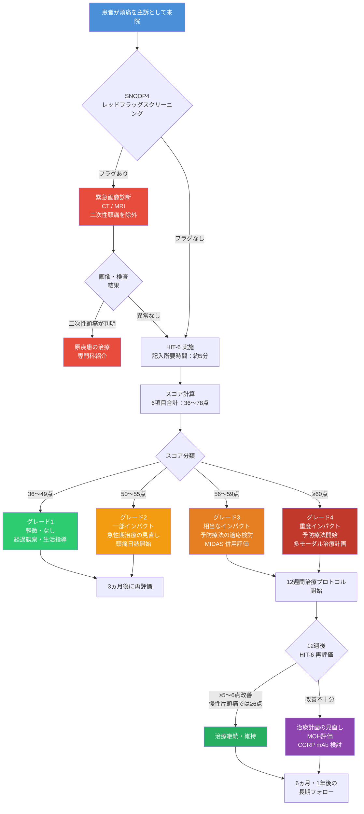

# HIT-6（Headache Impact Test）完全リファレンスガイド

## 初学者から臨床家まで対応する段階的解説

---

> **⚠️ 学術免責事項（Academic Disclaimer）**
>
> 本文書は**学術的・教育的・研究目的のみ**を対象として作成されています。  
> 記載されたすべての情報は、資格を有する医療専門家による査読・判断を経たうえで臨床に適用される必要があります。  
> 本文書は個人への医療アドバイス・診断・処方の代替となるものではありません。  
> © HIT-6™ 2001, 2015 QualityMetric Incorporated（本文書は同ツールの学術的解説であり、商業的利用ではありません）

---

## 目次

1. [HIT-6とは何か——開発の背景と意義](#1-hit-6とは何か)
2. [SNOOP4 レッドフラッグスクリーニング（必須先行評価）](#2-snoop4-レッドフラッグスクリーニング)
3. [HIT-6の構造——6つの質問項目を理解する](#3-hit-6の構造)
4. [スコアリング方法——計算の仕方を段階的に学ぶ](#4-スコアリング方法)
5. [スコア解釈——4段階グレード分類](#5-スコア解釈)
6. [心理測定特性（Psychometric Properties）](#6-心理測定特性)
7. [最小臨床重要差（MCID）の理解と応用](#7-mcid-最小臨床重要差)
8. [頭痛タイプ別参照スコアと臨床的意味](#8-頭痛タイプ別参照スコア)
9. [HIT-6 と MIDAS の比較・補完的使用](#9-hit-6-と-midas-の比較)
10. [臨床使用フローチャート](#10-臨床使用フロー)
11. [特殊集団への適用](#11-特殊集団への適用)
12. [臨床応用の限界と注意点](#12-臨床応用の限界)
13. [統合モニタリングプロトコル（12週間フレームワーク）](#13-統合モニタリングプロトコル)
14. [エビデンス要約と参考文献](#14-エビデンス要約と参考文献)

---

## 1. HIT-6とは何か

### 1.1 開発の背景

**HIT-6（Headache Impact Test）** は、2003年に Kosinski ら（QualityMetric Incorporated）によって開発された、頭痛が患者の日常生活に与える影響（インパクト）を定量的に評価するための **6項目自己記入式短縮調査票（Short-Form Self-Administered Questionnaire）** です。

開発の目的は明確でした——従来の頭痛評価は頭痛の**頻度（frequency）** や **持続時間（duration）** のみに焦点を当てていましたが、片頭痛患者の実際の苦しみは **「頭痛のない時間も含めた生活全体への影響」** にあります。HIT-6 はこの視点から設計されました。

### 1.2 開発プロセス

| ステップ | 内容 |
|---|---|
| **候補項目プール** | 既存インパクト項目54問 ＋ 臨床家推薦35問 = **計89項目** |
| **選別基準** | 内容妥当性・IRT情報量関数・項目内部一貫性・スコア分布・臨床妥当性・言語分析 |
| **検証サンプル** | インターネット調査・頭痛患者 n = 1,103（America Online会員）、14日後に n = 540 が追跡調査 |
| **最終形式** | **6項目**、5段階リッカートスケール、記入所要時間 **約5分** |

> **出典:** Kosinski M, et al. *Qual Life Res* 2003;12(8):963–974.  
> [https://pubmed.ncbi.nlm.nih.gov/14651415/](https://pubmed.ncbi.nlm.nih.gov/14651415/)

### 1.3 HIT-6が測定する6つのドメイン

HIT-6 は単なる「痛みの強さ」ではなく、頭痛が生活に与える **多次元的インパクト（Multidimensional Impact）** を測定します。

| ドメイン（Domain） | 内容 |
|---|---|
| **1. 疼痛強度（Pain Severity）** | 激しい頭痛が起こる頻度 |
| **2. 役割機能（Role Functioning）** | 仕事・学業・家事・社会活動の制限頻度 |
| **3. 活力（Vitality）** | 疲労感のため日常活動ができない頻度 |
| **4. 認知機能（Cognitive Functioning）** | 集中力や思考力の低下頻度 |
| **5. 心理的苦痛（Psychological Distress）** | 苛立ちや不快感の頻度 |
| **6. 重症度感（Symptom Severity）** | 横になりたいほどの頭痛の頻度 |

> **臨床的ポイント：** これらのドメインは ICHD-3（国際頭痛分類第3版）の機能障害基準と対応しており、診断から治療効果判定まで一貫して使用できます。

---

## 2. SNOOP4 レッドフラッグスクリーニング

> **⚠️ 重要：HIT-6 を使用する前に SNOOP4 スクリーニングを必ず完了すること。**  
> 二次性頭痛（Secondary Headache）が疑われる場合、先に CT/MRI 等の画像診断を行い、原疾患を除外した後にのみ HIT-6 によるインパクト評価を実施する。

| 記号 | 英語 | 内容 | 対応 |
|---|---|---|---|
| **S** | Systemic symptoms | 発熱・髄膜刺激症状・体重減少・免疫抑制状態・悪性腫瘍既往 | 緊急画像診断 |
| **N** | Neurological deficits | 運動麻痺・感覚障害・失語・複視・意識変容・認知変化 | 緊急神経学的精査 |
| **O** | Onset sudden | 雷鳴頭痛（Thunderclap）：「生涯最悪の頭痛」→ くも膜下出血除外 | 緊急CT |
| **O** | Onset after 50 | 50歳以降の新規頭痛 → 側頭動脈炎・頭蓋内病変除外 | 緊急画像診断 |
| **P** | Pattern change | 増悪傾向・外傷後新規発症・体位依存性（仰臥位悪化→ICP↑、立位悪化→ICP↓） | 画像診断 |
| **4** | 4つの追加基準 | 乳頭浮腫 / 硬膜穿刺後 / 痙攣後 / 妊娠・産後 | それぞれ専門的評価 |

---

## 3. HIT-6の構造

### 3.1 6つの質問項目（構成と評価ドメイン）

以下の各質問に対し、過去**4週間（前項目3は除く）** の状況を5段階で回答します。
質問文そのものは QualityMetric 社が権利を有する著作物のため本資料には掲載せず、各項目が測定するドメインのみを示します。
質問票の全文は [QualityMetric（公式配布元）](https://www.qualitymetric.com/health-surveys/the-headache-impact-test-hit-6/) から入手してください。

| 項目番号 | 質問文 | 評価ドメイン | 想起期間 |
|---|---|---|---|
| **Q1** | 非掲載（公式配布元を参照） | 疼痛強度 | 現在の状態 |
| **Q2** | 非掲載（公式配布元を参照） | 役割機能 | 現在の状態 |
| **Q3** | 非掲載（公式配布元を参照） | 重症度感 | 現在の状態 |
| **Q4** | 非掲載（公式配布元を参照） | 活力 | 過去4週間 |
| **Q5** | 非掲載（公式配布元を参照） | 心理的苦痛 | 過去4週間 |
| **Q6** | 非掲載（公式配布元を参照） | 認知機能 | 過去4週間 |

> **記憶帰還期間（Recall Period）：**
> - Q1〜Q3：特定の想起期間なし（現在の状態を反映）
> - Q4〜Q6：**過去4週間（28日間）**

---

## 4. スコアリング方法

### 4.1 回答と点数の対応

各質問への回答は、以下の点数に変換されます。この **非線形スコアリング（Non-linear Scoring）** は、項目反応理論（IRT: Item Response Theory）に基づいて設計されており、重篤な影響を示す回答により高い重みを持たせています。

| 回答選択肢 | 英語 | 点数 |
|---|---|---|
| まったくない | Never | **6点** |
| めったにない | Rarely | **8点** |
| ときどき | Sometimes | **10点** |
| 非常によく | Very Often | **11点** |
| いつも | Always | **13点** |

### 4.2 合計スコアの計算

```
HIT-6 合計スコア = Q1 + Q2 + Q3 + Q4 + Q5 + Q6

最小スコア: 6 × 6 = 36点（全項目「まったくない」）
最大スコア: 6 × 13 = 78点（全項目「いつも」）
```

### 4.3 段階的計算例（初学者向け）

**例：ある患者の回答**

| 質問 | 回答 | 点数 |
|---|---|---|
| Q1 | 非常によく | 11 |
| Q2 | いつも | 13 |
| Q3 | 非常によく | 11 |
| Q4 | ときどき | 10 |
| Q5 | いつも | 13 |
| Q6 | 非常によく | 11 |
| **合計** | | **69点** |

→ **グレード: 重度インパクト（Severe Impact）**

---

## 5. スコア解釈

### 5.1 4段階グレード分類

| HIT-6スコア | グレード | 英語 | 臨床的意味 |
|---|---|---|---|
| **36〜49点** | **グレード1** | Little or No Impact | 頭痛による生活への影響は軽微または皆無 |
| **50〜55点** | **グレード2** | Some Impact | 日常活動にある程度の影響あり |
| **56〜59点** | **グレード3** | Substantial Impact | 相当な機能障害；予防療法の適応を検討 |
| **≥60点** | **グレード4** | Severe Impact | 重度の機能障害；積極的な治療介入が必要 |

### 5.2 スコアの視覚的イメージ

```
36────────49│50─────55│56──59│60────────78
   軽微/なし  │ 一部  │相当 │   重度
```

> **臨床的判断基準：**
> - **HIT-6 ≥ 56点** → 頭痛が日常生活に有意なインパクトを与えていることを示す臨床的閾値
> - **HIT-6 ≥ 60点** → 重度インパクト：片頭痛の予防療法開始基準（月4回以上の発作または著明な機能障害）と重複評価を推奨
> - **HIT-6 < 50点** → 過剰治療・過剰診断のリスクを考慮

---

## 6. 心理測定特性

### 6.1 信頼性（Reliability）

**信頼性**とは「同じ状態の患者を測定した場合、毎回同じ結果が得られるか」を示す指標です。

| 指標 | 値 | 解釈基準 | 出典 |
|---|---|---|---|
| **内的一貫性（Cronbach's α）** | 0.82〜0.92 | α ≥ 0.70 = 良好 | Yang et al. 2011; Rendas-Baum et al. 2014 |
| **検査再検査信頼性（Test-retest ICC）** | 0.77〜0.89 | ICC ≥ 0.70 = 良好 | Kosinski et al. 2003; 原版 ICC = 0.80 |
| **代替形式信頼性（Alternate Forms）** | 0.90 | — | Kosinski et al. 2003 |

> **初学者向け解説：**  
> **Cronbach's α（クロンバックのアルファ）** は「6つの質問が同じ概念（頭痛インパクト）を測っているか」の一貫性指標です。0.82〜0.92という値は **「非常に良好」** を意味します。  
> **ICC（級内相関係数）** は「2週間後に同じ患者に再測定しても結果が安定しているか」を示します。0.77〜0.89は **「良好〜優秀」** の範囲です。

### 6.2 妥当性（Validity）

**妥当性**とは「測りたいものを正しく測れているか」を示す概念です。

| 妥当性の種類 | 結果 | 詳細 |
|---|---|---|
| **構成概念妥当性（Construct Validity）** | 確認 | 確認的因子分析（CFA）で1因子構造が支持 |
| **収束妥当性（Convergent Validity）** | r = 0.52（MIDAS と有意相関、p < 0.001） | Sauro et al. 2010（CHORD研究、n = 798） |
| **弁別妥当性（Discriminant Validity）** | F = 488.02, p < 0.0001 | 慢性片頭痛・発作性片頭痛・非片頭痛間で有意差 |
| **内容妥当性（Content Validity）** | 確認 | 患者インタビューと専門家レビューによる Houts et al. 2020 |
| **反応性（Responsiveness）** | 確認 | 予防療法介入前後で有意な変化を検出 |
| **異文化間等価性（Cross-cultural Equivalence）** | 確認（27言語） | Martin et al. 2004; DIF分析で支持 |

### 6.3 多言語・多集団での検証

| 検証集団・言語 | 主な結果 | 出典 |
|---|---|---|
| **発作性・慢性片頭痛（英語圏）** | 良好な信頼性・妥当性（n = 2,049） | Yang et al. 2011（*Cephalalgia*） |
| **慢性片頭痛（PREEMPT試験）** | 良好な心理測定特性（n = 1,384） | Rendas-Baum et al. 2014（*HQLO*） |
| **慢性片頭痛（PROMISE-2試験）** | IRT解析で単次元性確認（n = 1,072） | Houts et al. 2021（*Qual Life Res*） |
| **9言語（多言語検証）** | 等価性確認 | Martin et al. 2004（*J Clin Epidemiol*） |
| **27言語（翻訳プロジェクト）** | 概念的・言語的等価性を確認 | Gandek et al. 2003（*Qual Life Res*） |
| **日本語版（邦文）** | 信頼性・妥当性を確認（日本国内） | Sakai et al. 2004（*Rinsho Iyaku*） |

> **臨床的意義：** HIT-6 は日本語版が正式に検証されており（Sakai et al. 2004）、また Eli Lilly Japan によって日本語使用が公式に認可されています。日本人患者への適用は科学的に裏付けられています。

---

## 7. MCID（最小臨床重要差）

### 7.1 MCID とは何か

**MCID（Minimally Clinically Important Difference）** または **MIC（Minimally Important Change）** とは、「統計的に有意な変化」ではなく「患者が実際に感じ取れる最小の変化量」を指します。

> **例：** HIT-6 が 65点 → 63点 に変化した場合（2点減少）、統計的には改善を示すかもしれませんが、患者の実感として「良くなった」と感じる閾値に達しているかどうかを判断するのが MCID です。

### 7.2 HIT-6 の MCID 推定値（文献別）

| 研究 | 対象集団 | 推定MCID | 推定方法 | 出典 |
|---|---|---|---|---|
| Smelt et al. 2014 | 発作性片頭痛（プライマリケア、n = 490） | **−2.5〜−6点**（範囲） | Mean change法 / ROC曲線法 | *Cephalalgia* 34(1):29–36 |
| Coeytaux et al. 2005 | 頭痛専門外来患者 | **−1.5〜−2.3点** | アンカーベース法 | *Headache* 45:638–643 |
| Houts et al. 2020 | 慢性片頭痛（PROMISE-2） | **≥6点減少** | 多段階統計法 | *Headache* 60(9):2003–2013 |

### 7.3 臨床推奨 MCID の解釈

```
【発作性片頭痛（Episodic Migraine）における目安】
  HIT-6 ≥ 2〜3点の減少 → 個人レベルでの最小改善
  HIT-6 ≥ 5点の減少   → 臨床的に意味のある改善

【慢性片頭痛（Chronic Migraine）における目安】
  HIT-6 ≥ 6点の減少   → 臨床的に意味のある改善（推奨閾値）
  （Houts et al. 2020; PROMISE-2 研究に基づく）
```

> **注意：** MCID はグループ間比較（between-group MID）と個人内変化（within-person MIC）では異なる値を取ります。臨床試験では前者、個別患者評価では後者を参照することが一般的です。

### 7.4 CGRP モノクローナル抗体試験での HIT-6 変化例（参照値）

| 薬剤・試験 | 治療群変化（月3時点） | プラセボ群変化 |
|---|---|---|
| **エレヌマブ 140 mg**（発作性片頭痛） | −9.34点（p < 0.001） | −6.62点 |
| **エレヌマブ 70 mg** | −8.39点（p = 0.004） | −6.62点 |
| **日本人発作性片頭痛（Sakai et al. 2019）** | ベースライン 57.4〜58.9点 | — |

---

## 8. 頭痛タイプ別参照スコア

### 8.1 疾患別 HIT-6 平均スコア

| 頭痛タイプ（ICHD-3） | 平均 HIT-6（±SD） | 臨床的解釈 | 出典 |
|---|---|---|---|
| **慢性片頭痛（≥15日/月）** | 62.5 ± 7.8 | 重度インパクト（Severe） | Yang et al. 2011 |
| **発作性片頭痛（<15日/月）** | 60.2 ± 6.8 | 重度インパクト（Severe） | Yang et al. 2011 |
| **非片頭痛頭痛** | 49.1 ± 8.7 | 一部インパクト（Some） | Yang et al. 2011 |
| **日本人・発作性片頭痛** | 57.4〜58.9 | 相当〜重度インパクト | Sakai et al. 2019 |
| **日本人・慢性片頭痛** | 62.7〜63.3 | 重度インパクト | Lipton et al. 2019 |
| **治療抵抗性慢性片頭痛** | 67.6 | 重度インパクト（最重症域） | Lambru et al. 2020 |
| **睡眠時無呼吸症候群関連頭痛** | 55.0 | 中等度インパクト（Some） | Nakayama et al. 2023 |

> **疾患重症度の鑑別指標として：** HIT-6 スコアが頭痛タイプの鑑別に補助的に使用できます。片頭痛患者（発作性・慢性）は典型的に 60 点以上を示すのに対し、非片頭痛頭痛では 50 点を下回る傾向があります（Yang et al. 2011, n = 2,049）。

### 8.2 ICHD-3 分類との対応

| ICHD-3 コード | 診断名 | 典型的 HIT-6 範囲 |
|---|---|---|
| 1.1 | 前兆なし片頭痛 | 56〜65点 |
| 1.2 | 前兆あり片頭痛 | 56〜65点 |
| 1.3 | 慢性片頭痛 | 60〜78点 |
| 2.1 | 低頻度発作性緊張型頭痛 | 36〜49点 |
| 2.2 | 高頻度発作性緊張型頭痛 | 50〜56点 |
| 2.3 | 慢性緊張型頭痛 | 55〜65点 |
| 3.1/3.2 | 群発頭痛 | 60〜75点（発作期） |
| 8.2 | 薬剤乱用頭痛（MOH） | 60〜75点（乱用期） |

---

## 9. HIT-6 と MIDAS の比較

### 9.1 比較概要

HIT-6 と MIDAS（Migraine Disability Assessment Scale）は、いずれも国際的に広く使用される頭痛インパクト評価ツールですが、**測定する概念・時間軸・感受性**に重要な違いがあります。

| 比較項目 | **HIT-6** | **MIDAS** |
|---|---|---|
| **開発年** | 2003年 | 2000年 |
| **質問数** | 6項目 | 5項目（＋補足2項目） |
| **回答形式** | 5段階リッカートスケール | 実損失日数（日数カウント） |
| **想起期間** | 4週間（28日） | 3ヵ月（90日） |
| **スコア範囲** | 36〜78点 | 0〜∞点 |
| **主な感受性** | **頭痛強度・質**の変化を捉えやすい | **頭痛頻度**の変化を捉えやすい |
| **記入時間** | 約5分 | 約5分 |
| **MIDAS との相関** | r = 0.52（有意、p < 0.001） | — |
| **言語対応** | 27言語以上 | 複数言語 |
| **日本語版** | あり（検証済） | あり（検証済） |
| **臨床試験での採用** | 多数の CGRP mAb 試験 | 多数の試験 |

### 9.2 使い分けの指針

**HIT-6 が優れる状況：**

- 頭痛の**質（クオリティ）** や **強度（インテンシティ）** が問題の中心である場合
- **短期間（1ヵ月単位）** の治療効果モニタリング
- 患者の**主観的生活質（QoL）** を多面的に評価したい場合
- 頭痛種別に関わらず全般的インパクトを捉えたい場合

**MIDAS が優れる状況：**

- **頭痛頻度・日数**の変化が主要アウトカムの場合
- **生産性損失・経済的コスト** の定量化
- **3ヵ月単位**の長期的障害評価
- 社会保障・労務管理的観点での評価

> **推奨：** Sauro et al.（2010、n = 798）のカナダ頭痛外来データベース（CHORD）研究は、**HIT-6 と MIDAS を併用することで患者の頭痛障害をより正確に評価できる** と結論づけています。単独使用より補完的な使用が推奨されます。

> **重要な注意（REFORM 研究、2026年）：** HIT-6 および MIDAS は治療反応性評価において重要な側面を反映するものの、エレヌマブの治療反応を評価する際に前向き頭痛日誌を代替するには十分な精度を持たないことが示されました（Danish Headache Center）。これらは**補完的なツール**であり、頭痛日誌と組み合わせての使用が推奨されます。

---

## 10. 臨床使用フロー



---

## 11. 特殊集団への適用

### 11.1 小児・青年期（Pediatric & Adolescent Population）

| 項目 | 内容 |
|---|---|
| **対象年齢** | 標準的 HIT-6 は成人向けに開発・検証。12歳以上での使用が一般的 |
| **小児適応の課題** | 抽象的な概念（「集中力」「気分の落ち込み」）の理解に年齢依存性あり |
| **代替ツール** | PedMIDAS（小児用 MIDAS）との併用を検討 |
| **臨床的閾値** | 成人と同じ閾値の適用は慎重に行うこと |

### 11.2 妊娠・授乳期（Pregnancy & Lactation）

| 項目 | 内容 |
|---|---|
| **ツールの使用** | HIT-6 評価自体は問題なく使用可能 |
| **注意点** | スコアが高い場合でも、薬剤選択は妊娠安全性に基づいて行うこと |
| **禁忌薬** | バルプロ酸（Category X）・トピラマート（Category D）・エルゴタミン系 → 使用禁忌 |
| **安全な選択** | アセトアミノフェン（急性期第一選択）・硫酸マグネシウム IV（重篤発作時） |

### 11.3 高齢者（Geriatric Population：65歳以上）

| 項目 | 内容 |
|---|---|
| **認知機能低下** | 質問の理解・記憶への影響を考慮。補助者によるサポートが必要な場合あり |
| **スコア解釈** | 高齢者では身体機能低下が HIT-6 スコアを過大評価させる可能性あり（多重疾患の影響） |
| **薬剤注意点** | TCA（アミトリプチリン）は低用量（10mg）から開始。β遮断薬による起立性低血圧・転倒リスク、トピラマートによる認知機能への影響に注意 |

### 11.4 薬剤乱用頭痛（MOH：ICHD-3 コード 8.2）

> **⚠️ MOH 評価は HIT-6 使用前に必須チェック項目**

- 単純鎮痛薬・NSAIDs：**月15日以上** × 3ヵ月以上 → MOH リスク
- トリプタン・エルゴタミン・オピオイド：**月10日以上** × 3ヵ月以上 → MOH リスク
- MOH 患者では HIT-6 スコアが **60〜75点** と高値を示すことが多い
- **離脱療法後のスコア改善**を治療目標の指標として活用可能

---

## 12. 臨床応用の限界

### 12.1 HIT-6 の制限事項

| 限界点 | 詳細 |
|---|---|
| **頭痛頻度の直接測定不可** | HIT-6 は頻度ではなくインパクトを測定。頭痛日誌との組み合わせが必要 |
| **頭痛タイプの区別不可** | 単一スコアは複数の頭痛タイプを混合して評価するため、タイプ別診断に使用不可 |
| **想起バイアス** | 4週間の回顧的評価であり、記憶の歪みが生じる可能性あり |
| **フロア・シーリング効果** | 極めて軽症（36点付近）または最重症（78点付近）では変化の検出が困難 |
| **頭痛以外の要因の影響** | 抑うつ・睡眠障害・他疾患が HIT-6 スコアを独立して上昇させる可能性 |
| **治療反応の単独代替不可** | REFORM 研究（2026）：治療反応評価において頭痛日誌の代替として使用不可 |
| **ライセンス管理** | HIT-6™ は QualityMetric Incorporated の商標。臨床試験での使用にはライセンス取得が必要な場合あり（EMAが適合性を認定） |

### 12.2 HIT-6 単独使用が不十分な場面

```
✗ 新規頭痛の初期診断（ICHD-3 診断基準を使用すること）
✗ 薬剤選択の根拠としての単独使用（MIDAS・臨床評価を組み合わせること）
✗ CGRP mAb 治療反応の唯一の評価指標（頭痛日誌との組み合わせが必要）
✗ 緊急性の判断（SNOOP4 を使用すること）
```

---

## 13. 統合モニタリングプロトコル

### 13.1 12週間フレームワーク（Integrated 12-Week Monitoring Protocol）

HIT-6 は治療の「スナップショット」ではなく、**継続的なモニタリングツール** として機能します。以下は CGRP mAb ガイドライン・AAN 予防療法ガイドライン・EHF 推奨に基づいたプロトコルです。

| 時点 | HIT-6 実施 | MIDAS 実施 | 頭痛日誌 | 目標 |
|---|---|---|---|---|
| **ベースライン（0週）** | ✅ 必須 | ✅ 必須 | 最低30日間 | 治療前評価の確立 |
| **4週（1ヵ月後）** | ✅ 実施 | — | 継続 | 初期反応確認 |
| **8週（2ヵ月後）** | ✅ 実施 | — | 継続 | 中間評価 |
| **12週（3ヵ月後）** | ✅ 必須 | ✅ 必須 | 継続 | 正式アウトカム評価 |
| **6ヵ月** | ✅ 必須 | ✅ 必須 | 継続 | 長期維持の判断 |
| **12ヵ月** | ✅ 必須 | ✅ 必須 | 継続 | 年間評価 |

### 13.2 治療成功基準（複合アウトカム）

| 指標 | 成功の目安 |
|---|---|
| **HIT-6 改善** | ベースラインから ≥5〜6点減少（慢性片頭痛では ≥6点） |
| **HIT-6 グレード改善** | 例：グレード4（≥60点）→ グレード3（56〜59点）以下への移行 |
| **頭痛日数減少** | ≥50%減少（月間頭痛日数 responder definition） |
| **MIDAS 改善** | ベースラインから ≥50%減少 |
| **PGIC** | 7点尺度で「かなり改善」または「非常に改善」（5〜7点） |

### 13.3 治療プラン別 HIT-6 改善の期待値

| 治療介入 | 期待される HIT-6 改善幅 | エビデンスレベル |
|---|---|---|
| エレヌマブ 140 mg/月（発作性片頭痛） | −9.34点（プラセボ比有意） | Grade A |
| エレヌマブ 70 mg/月 | −8.39点 | Grade A |
| オナボツリヌムトキシンA（慢性片頭痛） | 有意な改善（PREEMPT試験） | Grade A |
| フレマネズマブ（予防） | 有意な改善 | Grade A |
| バイオフィードバック（Biofeedback） | 臨床的意義のある改善 | Grade B |
| 認知行動療法（CBT） | 臨床的意義のある改善 | Grade B |
| マグネシウム補充（400〜600 mg/日） | 補助的効果 | Grade B |

---

## 14. エビデンス要約と参考文献

### 14.1 エビデンス要約

| カテゴリ | 評価 | 根拠 |
|---|---|---|
| **信頼性** | Grade A（優秀） | 複数の大規模 RCT・コホート研究で一貫して α > 0.80、ICC > 0.77 |
| **妥当性** | Grade A（優秀） | 構成概念・収束・弁別妥当性がすべて確認済み |
| **反応性** | Grade A（良好） | PREEMPT・PROMISE-2・CGRP mAb 複数試験で治療変化を検出 |
| **異文化間等価性** | Grade A（優秀） | 27言語で等価性確認、DIF 分析で支持 |
| **MCID の明確性** | Grade B（良好） | 複数の方法で推定値が示されているが、集団・疾患タイプにより幅あり |
| **頭痛日誌代替可能性** | 否定的（Grade C） | REFORM 研究（2026）で単独使用の限界が示された |

### 14.2 主要参考文献・URL

#### 開発・バリデーション（原著）

| 著者 | タイトル | 雑誌・年 | URL |
|---|---|---|---|
| Kosinski M, et al. | A six-item short-form survey for measuring headache impact: The HIT-6™ | *Qual Life Res* 2003;12(8):963–974 | [PubMed: 14651415](https://pubmed.ncbi.nlm.nih.gov/14651415/) |
| Bjorner JB, et al. | Calibration of an item pool for assessing the burden of headaches: An application of IRT to the HIT™ | *Qual Life Res* 2003;12:913–933 | [SpringerLink](https://link.springer.com/article/10.1023/A:1026119331193) |
| Martin M, et al. | The short-form HIT-6 was psychometrically equivalent in nine languages | *J Clin Epidemiol* 2004;57:1271–1278 | [PubMed: 15617954](https://pubmed.ncbi.nlm.nih.gov/15617954/) |

#### 心理測定特性・バリデーション（追加研究）

| 著者 | タイトル | 雑誌・年 | URL |
|---|---|---|---|
| Yang M, et al. | Validation of the HIT-6™ across episodic and chronic migraine | *Cephalalgia* 2011;31(4):357–367 | [PMC3057423](https://www.ncbi.nlm.nih.gov/pmc/articles/PMC3057423/) |
| Rendas-Baum R, et al. | Validation of the HIT-6 in patients with chronic migraine | *HQLO* 2014;12:117 | [PMC4243819](https://pmc.ncbi.nlm.nih.gov/articles/PMC4243819/) |
| Houts CR, et al. | Reliability and validity of the HIT-6 in chronic migraine from the PROMISE-2 study | *Qual Life Res* 2021;30:931–943 | [SpringerLink](https://link.springer.com/article/10.1007/s11136-020-02668-2) |
| Houts CR, et al. | Content validity of HIT-6 as a measure of headache impact in people with migraine | *Headache* 2020;60(1):28–39 | [Wiley](https://headachejournal.onlinelibrary.wiley.com/doi/full/10.1111/head.13701) |
| Kawata AK, et al. | Psychometric properties of the HIT-6 among patients in a headache-specialty practice | *Headache* 2005;45:638–643 | [PubMed](https://pubmed.ncbi.nlm.nih.gov/15953286/) |

#### MCID・スコア解釈

| 著者 | タイトル | 雑誌・年 | URL |
|---|---|---|---|
| Smelt AF, et al. | What is a clinically relevant change on the HIT-6? | *Cephalalgia* 2014;34(1):29–36 | [PubMed: 23843470](https://pubmed.ncbi.nlm.nih.gov/23843470/) |
| Houts CR, et al. | Determining Thresholds for Meaningful Change for the HIT-6 in Chronic Migraine | *Headache* 2020;60(9):2003–2013 | [PubMed: 32862469](https://pubmed.ncbi.nlm.nih.gov/32862469/) |

#### HIT-6 vs MIDAS 比較

| 著者 | タイトル | 雑誌・年 | URL |
|---|---|---|---|
| Sauro KM, et al. | HIT-6 and MIDAS as Measures of Headache Disability in a Headache Referral Population | *Headache* 2010;50:383–395 | [PubMed: 19817883](https://pubmed.ncbi.nlm.nih.gov/19817883/) |
| Thuraiaiyah J, et al. | MIDAS and HIT-6 Questionnaires Versus Headache Diaries for Monitoring Treatment Response to Erenumab in Migraine: A REFORM Study | *Eur J Neurol* 2026;33(4):e70542 | [PubMed: 41902353](https://pubmed.ncbi.nlm.nih.gov/41902353/) |

#### 日本語版・日本人データ

| 著者 | タイトル | 雑誌・年 | URL |
|---|---|---|---|
| Sakai F, et al. | Evaluation of the reliability of the Japanese version of the HIT-6 | *Rinsho Iyaku* 2004;20:1045–1054 | （日本語文献） |
| Nakayama H, et al. | Clinical application of HIT-6 and ESS for sleep apnea headache | *Sleep Sci Pract* 2023 | [BioMedCentral](https://sleep.biomedcentral.com/articles/10.1186/s41606-023-00084-2) |

#### 国際ガイドライン・分類基準

| 機関 | リソース | URL |
|---|---|---|
| **IHS / ICHD-3** | 国際頭痛分類第3版（全文） | [ichd-3.org](https://ichd-3.org/) |
| **IHS / ICHD-3 PDF** | ICHD-3 全文 PDF（2018年版） | [ichd-3.org/PDF](https://ichd-3.org/wp-content/uploads/2018/01/The-International-Classification-of-Headache-Disorders-3rd-Edition-2018.pdf) |
| **AAN** | 片頭痛予防ガイドライン（AAN/AHS） | [aan.com/guidelines](https://www.aan.com/guidelines/) |
| **EHF** | CGRP mAbs 予防療法ガイドライン 2022 | [PMC9188162](https://www.ncbi.nlm.nih.gov/pmc/articles/PMC9188162/) |
| **Cephalalgia** | IHS 急性期治療推奨 2024 | [journals.sagepub.com](https://journals.sagepub.com/doi/10.1177/03331024241252666) |
| **Cochrane Library** | 頭痛・片頭痛レビュー総覧 | [cochranelibrary.com](https://www.cochranelibrary.com/search?query=headache+migraine&searchBy=3&type=cdsr) |
| **Physiopedia** | HIT-6 臨床解説（英語） | [physio-pedia.com](https://www.physio-pedia.com/Headache_Impact_Test_(HIT-6)) |

---

## 付録：HIT-6 クイックリファレンスカード

| 項目 | 内容 |
|---|---|
| **ツール名** | Headache Impact Test-6 (HIT-6™) |
| **著作権** | © 2001, 2015 QualityMetric Incorporated |
| **開発年** | 2003年（Kosinski M, et al.） |
| **質問数** | 6項目 |
| **回答形式** | 5段階（6 / 8 / 10 / 11 / 13 点） |
| **スコア範囲** | 36〜78点 |
| **想起期間** | Q1〜Q3：なし / Q4〜Q6：過去4週間 |
| **記入時間** | 約5分 |
| **グレード分類** | ≤49：軽微 / 50〜55：一部 / 56〜59：相当 / ≥60：重度 |
| **MCID（発作性）** | ≥2.5〜5点の改善 |
| **MCID（慢性）** | ≥6点の改善（Houts et al. 2020推奨） |
| **臨床試験認定** | EMA（欧州医薬品庁）が適合性を認定 |
| **言語対応** | 27言語以上（日本語版検証済） |

---

*本文書は2026年6月時点の国際的学術文献に基づいて作成されています。  
ICHD-4 作業版（2024年）の改訂動向を含む最新ガイドラインの更新については、IHS 分類委員会（[https://ihs-headache.org/en/about-ihs/standing-committees/classification/](https://ihs-headache.org/en/about-ihs/standing-committees/classification/)）を定期的に参照してください。*
