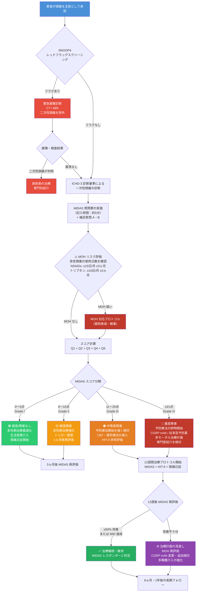
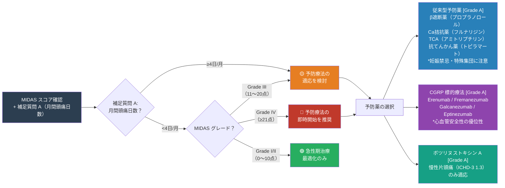
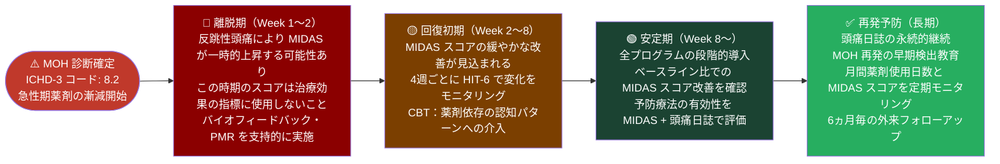

# MIDAS（片頭痛障害評価スコア）完全リファレンスガイド

## 初学者から臨床家まで対応する段階的解説

---

> **⚠️ 学術免責事項（Academic Disclaimer）**
>
> 本文書は**学術的・教育的・研究目的のみ**を対象として作成されています。  
> 記載されたすべての情報は、資格を有する医療専門家による査読・判断を経たうえで臨床に適用される必要があります。  
> 本文書は個人への医療アドバイス・診断・処方の代替となるものではありません。

---

## 目次

1. [MIDAS とは何か — 開発の背景と意義](#1-midas-とは何か)
2. [SNOOP4 レッドフラッグスクリーニング（必須先行評価）](#2-snoop4-レッドフラッグスクリーニング)
3. [MIDAS 質問票の構造 — 5問＋補足2問を理解する](#3-midas-質問票の構造)
4. [スコアリング方法 — 計算の仕方を段階的に学ぶ](#4-スコアリング方法)
5. [スコア解釈 — 4段階グレード分類（＋Grade IV-A/B 細分化）](#5-スコア解釈)
6. [心理測定特性（Psychometric Properties）](#6-心理測定特性)
7. [最小臨床重要差（MIC / MCID）](#7-最小臨床重要差)
8. [日本語版 MIDAS の検証](#8-日本語版-midas-の検証)
9. [頭痛タイプ別参照スコアと ICHD-3 対応](#9-頭痛タイプ別参照スコア)
10. [MIDAS と HIT-6 の比較・補完的使用](#10-midas-と-hit-6-の比較)
11. [臨床使用フローチャート](#11-臨床使用フローチャート)
12. [特殊集団への適用（PedMIDAS 含む）](#12-特殊集団への適用)
13. [臨床応用の限界と注意点](#13-臨床応用の限界)
14. [統合モニタリングプロトコル（12週間フレームワーク）](#14-統合モニタリングプロトコル)
15. [エビデンス要約と参考文献](#15-エビデンス要約と参考文献)

---

## 1. MIDAS とは何か

### 1.1 開発の背景

**MIDAS（Migraine Disability Assessment / 片頭痛障害評価スコア）** は、2000年に Walter F. Stewart（疫学者）、Richard B. Lipton（神経科医）、Andrew J. Dowson、James Sawyer らの国際研究グループによって開発された、**頭痛が患者の社会的・職業的機能に与える障害（Disability）を3ヵ月単位で定量化する自己記入式調査票**です。

開発の核心的動機は、当時の頭痛診療における深刻な認識ギャップにありました。片頭痛は「痛みの強さ」だけでなく、仕事・家事・社会活動への影響という「機能的コスト」を通じて患者と社会に甚大な負担を与えていましたが、医師と患者の間でこの障害度の認識には著しいギャップが存在していました。MIDAS はこのコミュニケーションギャップを埋め、**治療の必要性と優先度を客観的に評価・共有するための共通言語**として設計されました。

> **臨床的意義の核心：** 頭痛の「痛みの強さ」ではなく「機能損失の実績値（日数）」を計測することで、医師と患者が共有できる客観的指標を提供し、片頭痛の疾病負担（burden of disease）の定量化と社会経済的コスト評価に直結します。

### 1.2 開発プロセス

| ステップ | 内容 |
|---|---|
| **概念設計** | 「頭痛による機能損失日数」を活動ドメイン別に計測するアプローチを採用 |
| **予備検証（1999年）** | 頭痛専門医49名が多様な片頭痛症例の重症度と治療必要性を独立評価；MIDAS スコアとの相関を確認 |
| **妥当性検証（2000年）** | n = 144名の診断済み片頭痛患者を対象に90日間の頭痛日誌と比較；Spearman 相関係数 r = 0.63 を確認 |
| **信頼性検証（2001年）** | 検査再検査信頼性：Pearson 相関係数 r ≈ 0.80（Stewart et al.）|
| **臨床実装** | CGRP mAbs を含む世界中の主要頭痛臨床試験の標準的患者報告アウトカム（PRO）として採用 |

> **主要出典:**
> - Stewart WF, et al. "Validity of the Migraine Disability Assessment (MIDAS) Score in comparison to a diary-based measure in a population sample of migraine sufferers." *Pain* 2000;88(1):41–52. [PubMed: 11033369](https://pubmed.ncbi.nlm.nih.gov/11033369/)
> - Stewart WF, et al. "Development and testing of the Migraine Disability Assessment (MIDAS) Questionnaire to assess headache-related disability." *Neurology* 2001;56(Suppl 1):S20–S28. [DOI: 10.1212/wnl.56.suppl_1.s20](https://www.neurology.org/doi/abs/10.1212/wnl.56.suppl_1.s20)

### 1.3 MIDAS が測定する3つの活動ドメイン

MIDAS の設計思想の核心は、**「日常生活の3領域（職業的・家事的・社会的）にわたる機能損失日数を客観的に計測する」**点にあります。

| ドメイン（Domain） | 英語 | 測定内容（Q番号） |
|---|---|---|
| **職業的活動（Occupational）** | Paid work / School | 仕事または学業の欠勤・欠席日数（Q1）および生産性50%以上低下日数（Q2） |
| **家事活動（Household）** | Household work | 家事の欠損日数（Q3）および生産性50%以上低下日数（Q4） |
| **社会的活動（Social）** | Non-work / Social activities | 家族イベント・余暇・レジャーの欠損日数（Q5） |

---

## 2. SNOOP4 レッドフラッグスクリーニング

> **⚠️ 重要：MIDAS を使用する前に必ず SNOOP4 スクリーニングを完了すること。**  
> 二次性頭痛（Secondary Headache）が疑われる場合は、先に CT / MRI 等の画像診断を行い、原疾患を除外した後にのみ MIDAS による障害評価を実施する。

| 記号 | 英語 | 内容 | 必要な対応 |
|---|---|---|---|
| **S** | Systemic symptoms | 発熱・髄膜刺激症状・体重減少・免疫抑制状態・悪性腫瘍既往 | 緊急画像診断 |
| **N** | Neurological deficits | 運動麻痺・感覚障害・失語・複視・意識変容・認知変化 | 緊急神経学的精査 |
| **O** | Onset sudden | 雷鳴頭痛（Thunderclap）：「生涯最悪の頭痛」→ くも膜下出血除外 | 緊急 CT |
| **O** | Onset after 50 | 50歳以降の新規頭痛 → 側頭動脈炎・頭蓋内病変除外 | 緊急画像診断 |
| **P** | Pattern change | 増悪傾向・外傷後新規発症・体位依存性（仰臥位悪化→ICP↑、立位悪化→ICP↓）| 画像診断 |
| **4** | 4つの追加基準 | 乳頭浮腫 / 硬膜穿刺後 / 痙攣後 / 妊娠・産後 | それぞれ専門的評価 |

---

## 3. MIDAS 質問票の構造

### 3.1 質問票の全体像

MIDAS 質問票は、**スコア計算に使用する5問（Q1〜Q5）** と、**スコアには含まれないが臨床的に重要な情報を提供する2問の補足質問（A・B）** から構成されます。記入にかかる時間は約5分です。

### 3.2 スコア計算に使用する5問（Q1〜Q5）

各質問への回答は「過去3ヵ月（90日間）のうち、頭痛により該当する活動が制限された日数」を 0〜90 の整数で記入します。

| 質問番号 | 英語原文（要旨） | 日本語概訳 | 活動ドメイン |
|---|---|---|---|
| **Q1** | On how many days in the last 3 months did you miss work or school because of your headaches? | 過去3ヵ月間に、頭痛のために仕事または学校を**休んだ**日は何日ありましたか？ | 職業的活動：欠勤・欠席 |
| **Q2** | How many days in the last 3 months was your productivity at work or school reduced by half or more because of your headaches? | 過去3ヵ月間に、頭痛のために仕事または学校での**生産性が半分以下になった**日は何日ありましたか？ | 職業的活動：生産性低下（≥50%） |
| **Q3** | How many days in the last 3 months did you not do household work because of your headaches? | 過去3ヵ月間に、頭痛のために**家事ができなかった**日は何日ありましたか？ | 家事活動：欠損 |
| **Q4** | How many days in the last 3 months was your productivity in household work reduced by half or more because of your headaches? | 過去3ヵ月間に、頭痛のために**家事の生産性が半分以下になった**日は何日ありましたか？ | 家事活動：生産性低下（≥50%） |
| **Q5** | On how many days in the last 3 months did you miss family, social, or leisure activities because of your headaches? | 過去3ヵ月間に、頭痛のために**家族・社会・余暇活動を欠席または取りやめた**日は何日ありましたか？ | 社会的活動：欠損 |

> **「生産性半分以下」の定義：** Q2・Q4 は、仕事や家事に出たものの頭痛のために普段の半分以下しか機能できなかった日数を計測します。出勤・家事継続の有無に関わらず機能障害の実態を捉えるための重要な設問です。

### 3.3 補足質問（A・B）— スコアには含まれない

| 質問番号 | 内容 | 記入形式 | 臨床的意義 |
|---|---|---|---|
| **A** | 過去3ヵ月間に頭痛があった日の総日数 | 0〜90の整数 | 月間頭痛日数（MHD）の推定；発作性（<15日/月）vs 慢性（≥15日/月）の判断；予防療法適応の根拠 |
| **B** | 頭痛の平均痛み強度 | 0〜10 の NRS スケール | 急性期治療の選択・強度評価；Step-care 療法の判断 |

> **初学者向け解説：**
> 補足質問 A（月間頭痛日数）は ICHD-3 の慢性片頭痛診断（ICHD-3 コード 1.3：月15日以上の頭痛が3ヵ月以上継続）や予防療法の適応判断に不可欠です。MIDAS 合計スコアには加算されませんが、臨床判断において本体スコアと同等以上の重要性を持ちます。

---

## 4. スコアリング方法

### 4.1 合計スコアの計算式

```
MIDAS 合計スコア = Q1 + Q2 + Q3 + Q4 + Q5

各質問の回答範囲：0〜90日（過去3ヵ月の上限）
理論的スコア上限：270点（職業ドメイン最大90 ＋ 家事ドメイン最大90 ＋ 社会ドメイン最大90）
```

> **スコア上限が 270 点である理由：**  
> Q1＋Q2（仕事・学業）の合計は1人が過ごせる仕事日数の上限（約90日）を超えられません。同様に Q3＋Q4（家事）も上限90日、Q5（社会）も上限90日です。各ドメインの活動日数は重複するため、3ドメイン × 90日 = 270日が実質的な上限となります（Blumenfeld et al. 2011）。

### 4.2 計算の仕組み（ステップ解説）

**ステップ1:** 各質問（Q1〜Q5）に過去3ヵ月の該当日数を記入する  
**ステップ2:** 5つの日数を合算する（補足質問 A・B はスコアに含めない）  
**ステップ3:** 合計点を下表のグレード表に照合する

### 4.3 スコア計算例（初学者向け）

**例：38歳女性 会社員、片頭痛患者**

| 質問 | 内容（簡略） | 回答（日数） |
|---|---|---|
| Q1 | 仕事を休んだ日数 | 4日 |
| Q2 | 仕事の生産性が半分以下だった日数 | 8日 |
| Q3 | 家事ができなかった日数 | 5日 |
| Q4 | 家事の生産性が半分以下だった日数 | 6日 |
| Q5 | 社会活動を取りやめた日数 | 3日 |
| **MIDAS 合計** | | **26点** |

→ **Grade IV（重度障害）** → 予防療法の即時開始を強く推奨

| 補足 | 内容 | 記入値 |
|---|---|---|
| A | 頭痛があった総日数（3ヵ月） | 18日（≒6日/月）|
| B | 平均痛み強度（NRS） | 7/10 |

→ A より月間頭痛日数は6日/月（発作性）→ 予防療法適応を支持

---

## 5. スコア解釈 — グレード分類

### 5.1 標準4段階グレード分類（Stewart et al. 2001）

| MIDAS スコア | グレード | 英語 | 障害の程度 | 推奨される臨床対応 |
|---|---|---|---|---|
| **0〜5点** | **Grade I** | Little or No Disability | 軽度または障害なし | 急性期治療最適化・生活習慣介入・頭痛日誌の開始 |
| **6〜10点** | **Grade II** | Mild Disability | 軽度障害 | 急性期治療の強化＋トリガー管理；1ヵ月後に再評価 |
| **11〜20点** | **Grade III** | Moderate Disability | 中等度障害 | 予防療法の開始を強く検討；CBT・理学療法の導入；MOH リスク評価 |
| **≥21点** | **Grade IV** | Severe Disability | 重度障害 | 予防療法の即時開始；CGRP mAb を含む多モーダル治療計画；専門医紹介を検討 |

### 5.2 Grade IV の細分化（Blumenfeld et al. 2011）

慢性片頭痛患者の大多数が Grade IV に集中するため、Blumenfeld ら（2011）はより精緻な臨床評価のために Grade IV を以下のように細分化しました。

| サブグレード | スコア範囲 | 呼称 | 臨床的意義 |
|---|---|---|---|
| **Grade IV-A** | 21〜40点 | Severe | 重度障害；CGRP mAb を含む積極的予防療法の適応 |
| **Grade IV-B** | 41〜270点 | Very Severe | 最重度障害；慢性片頭痛（ICHD-3 1.3）との重複評価を推奨；包括的多職種介入が必要 |

> **出典:** Blumenfeld AM, et al. "Disability, HRQoL and resource use among chronic and episodic migraineurs: Results from the International Burden of Migraine Study (IBMS)." *Cephalalgia* 2011;31(3):301–315. [PubMed: 20868393](https://pubmed.ncbi.nlm.nih.gov/20868393/)

> **臨床的ポイント（AAN/EHF）：** AAN/EHF のガイドラインでは、MIDAS **Grade III〜IV（≥11点）**、または月間頭痛日数 ≥4日/月、または HIT-6 ≥56点が予防療法開始の主要な患者報告アウトカム（PRO）閾値として採用されています。

### 5.3 スコアの視覚的理解

```
0──────5│6────10│11────────20│21────────40│41──────────270
 Grade I │Grade II│  Grade III │ Grade IV-A │  Grade IV-B
 軽度/なし│軽度障害│  中等度障害 │   重度障害  │  最重度障害
```

---

## 6. 心理測定特性（Psychometric Properties）

### 6.1 信頼性（Reliability）

| 指標 | 値 | 解釈基準 | 出典 |
|---|---|---|---|
| **検査再検査信頼性（Test-retest）** | Pearson r ≈ **0.80** | r ≥ 0.70 = 良好 | Stewart et al. 2001（*Neurology*） |
| **検査再検査（日本語版）** | Spearman r = **0.59〜0.80**（すべて p < 0.0001）| r ≥ 0.60 = 良好〜優秀 | Iigaya et al. 2003（*Headache*） |
| **内的一貫性（Cronbach's α）** | 良好（報告あり） | α ≥ 0.70 = 良好 | Stewart et al. 2001 |

> **初学者向け解説：**  
> **検査再検査信頼性（r ≈ 0.80）** とは、「同じ患者を数週間後に再び評価しても、ほぼ同じスコアが得られる安定性」を示します。r = 0.80 は「優秀」の範囲であり、時間的安定性が高いことを意味します。

### 6.2 妥当性（Validity）

| 妥当性の種類 | 結果 | 詳細 |
|---|---|---|
| **基準関連妥当性（Criterion Validity）** | Spearman r = **0.63**（頭痛日誌との比較） | Stewart et al. 2000（*Pain*）；n = 144 |
| **臨床的妥当性（Clinical Validity）** | 専門医の重症度評価と有意相関 | 49名の頭痛専門医による独立評価（Stewart et al. 1999）|
| **判別妥当性（Discriminant Validity）** | 片頭痛患者 vs 非片頭痛患者で有意差 | 片頭痛患者のほうが有意に高スコアを示す |
| **治療反応への感受性（Responsiveness）** | CGRP mAb 主要 RCT で有意な変化を検出 | Erenumab / Fremanezumab / Galcanezumab 各試験 |

### 6.3 多言語検証状況

| 言語 | 主な結果 | 代表文献 |
|---|---|---|
| **英語（原版）** | 信頼性・妥当性確立（n = 144）| Stewart et al. 2000（*Pain*） |
| **日本語版** | 英語版と同等の信頼性・妥当性確認（n = 101）| Iigaya M, et al. 2003（*Headache*） |
| **イタリア語版** | 検証済 | D'Amico et al. 複数文献 |
| **その他多言語** | 多数の言語で翻訳・検証済 | 各国頭痛学会 |

---

## 7. 最小臨床重要差（MIC / MCID）

### 7.1 MIC とは何か

**MIC（Minimal Important Change）** または **MCID（Minimally Clinically Important Difference）** とは、「統計的有意性」ではなく **「患者が実際に『良くなった』と感じ取れる最小の変化量」** を指します。

> **例：** MIDAS が 28点 → 23点（5点減少）は統計的に有意かもしれませんが、患者にとって実感できる改善かどうかは MIC によって判断します。MIC を下回る変化は、統計的に有意であっても「臨床的に意味のある改善」とはみなされません。

### 7.2 MIC 推定値（文献別）

| 研究 | 対象集団 | 推定 MIC | 推定方法 | 出典 |
|---|---|---|---|---|
| Carvalho et al. 2021 | 頭痛患者（n = 103；非薬物療法 RCT） | **-4.5点**（1ヵ月想起版を使用；3ヵ月版では約 -13.5点に相当）| アンカーベース法（PGIC 基準）| [J Headache Pain 2021;22:126](https://www.ncbi.nlm.nih.gov/pmc/articles/PMC8529733/) |
| Ruscheweyh et al. 2024 | 三次頭痛外来（DMKG レジストリ；n = 1,218） | **Grade IV（MIDAS >20）：-30% 減少** / **Grade II-III（6-20）：-4点** | アンカーベース法＋ROC 曲線法（PGIC 基準） | [Cephalalgia 2024;44(7)](https://pubmed.ncbi.nlm.nih.gov/39033424/) |

### 7.3 臨床推奨 MIC の解釈

```
【Grade II-III（MIDAS 6〜20点）における目安（Ruscheweyh 2024）】
  MIDAS -4点以上の減少 → 臨床的に意味のある改善

【Grade IV（MIDAS ≥21点）における目安（Ruscheweyh 2024）】
  MIDAS -30%以上の減少 → 臨床的に意味のある改善
  例：ベースライン 40点 → 28点（-30%）= MID 達成

【臨床試験標準レスポンダー定義（IHS / CGRP mAb 試験）】
  MIDAS ≥50% の減少 → "MIDAS Responder" として定義
```

> **注意：** MIC は集団統計から導出された値であり、個々の患者への適用では臨床的文脈（治療の種類・副作用・生活状況）を総合判断に組み込むことが重要です。

### 7.4 CGRP mAb 試験における MIDAS レスポンダー基準と実績

| 薬剤 | 試験名 | MIDAS ベースライン（平均） | 判定基準 |
|---|---|---|---|
| Erenumab（エレヌマブ） | STRIVE（発作性片頭痛） | 約18〜20点（Grade III〜IV）| ≥50% 改善 |
| Fremanezumab（フレマネズマブ） | HALO（発作性片頭痛） | 約22〜24点（Grade IV）| ≥50% 改善 |
| Galcanezumab（ガルカネズマブ） | EVOLVE-1/2（発作性片頭痛） | 約20〜22点（Grade IV）| ≥50% 改善 |
| Eptinezumab（エプティネズマブ） | PROMISE-1（発作性片頭痛） | 約19〜21点（Grade III〜IV）| ≥50% 改善 |

---

## 8. 日本語版 MIDAS の検証

### 8.1 日本語版検証研究（Iigaya et al. 2003）

| 項目 | 内容 |
|---|---|
| **著者** | Iigaya M, Sakai F, Kolodner KB, Lipton RB, Stewart WF |
| **機関** | 北里大学神経内科（Kitasato University）および関連クリニック |
| **雑誌・年** | *Headache* 2003;43(3):225–233 |
| **PubMed** | [PMID: 12656705](https://pubmed.ncbi.nlm.nih.gov/12656705/) |
| **対象患者数** | n = 101名（女性80名・男性21名；年齢21〜77歳） |
| **組み入れ基準** | 年間6回以上の一次性頭痛を有する患者 |
| **検査再検査相関（Spearman r）** | Q1〜B の各質問：**0.59〜0.80**（すべて p < 0.0001） |
| **日誌との比較** | 90日間頭痛日誌由来の等価指標と有意な相関を確認 |
| **グレード別患者分布** | Grade I/II：46.5% / Grade III：22.2% / Grade IV：31.3% |
| **結論** | 英語版と同等の信頼性・妥当性が確認され、日本語版の臨床使用が支持された |

> **臨床的意義：** 日本語版 MIDAS は正式に検証されており、日本人頭痛患者への適用は科学的に裏付けられています。日本人サンプルでのグレード分布（Grade IV：31.3%）は、多くの患者が重度障害を抱えていることを示しており、予防療法の積極的な適応が示唆されます。

---

## 9. 頭痛タイプ別参照スコアと ICHD-3 対応

### 9.1 疾患別 MIDAS 典型スコア

| 頭痛タイプ（ICHD-3） | 典型的 MIDAS 範囲 | Grade | 主な参考文献 |
|---|---|---|---|
| 低頻度発作性片頭痛（<4回/月） | 3〜10点 | I〜II | Stewart et al. 1999 |
| 高頻度発作性片頭痛（4〜14日/月） | 11〜30点 | III〜IV | Stewart et al. 2001 |
| 慢性片頭痛（≥15日/月；ICHD-3 1.3） | 30〜100点以上 | IV（多くはIV-B） | Blumenfeld et al. 2011 |
| 薬剤乱用頭痛（MOH；ICHD-3 8.2） | 40〜80点 | IV-B | 臨床データ・専門家コンセンサス |
| 低頻度発作性緊張型頭痛（ETTH）| 0〜5点 | I | Stewart et al. 1999 |
| 慢性緊張型頭痛（CTTH；ICHD-3 2.3）| 5〜20点 | I〜III | Stewart et al. 1999 |
| 群発頭痛（発作期；ICHD-3 3.1/3.2）| 15〜40点 | III〜IV-A | 専門家意見 |

### 9.2 ICHD-3 診断コードとの対応

| ICHD-3 コード | 診断名 | MIDAS スコアとの関係 |
|---|---|---|
| 1.1 | 前兆なし片頭痛 | 発作頻度・重症度に比例してスコア上昇；Grade I〜IV まで幅広い |
| 1.2 | 前兆あり片頭痛 | 同上；前兆期の機能障害もスコアに反映される |
| 1.3 | 慢性片頭痛 | Grade IV（多くはIV-B）が典型的；MOH の合併を必ず評価 |
| 2.1 | 低頻度発作性緊張型頭痛 | Grade I が多い；頭痛日誌による頻度確認が重要 |
| 2.3 | 慢性緊張型頭痛 | Grade II〜III；MOH リスク評価が必須 |
| 3.1/3.2 | 群発頭痛 | 発作期は Grade III〜IV-A；間欠期は大幅に改善 |
| 8.2 | 薬剤乱用頭痛（MOH） | Grade IV が一般的；離脱・解毒後に段階的に改善 |

---

## 10. MIDAS と HIT-6 の比較・補完的使用

### 10.1 比較概要

| 比較項目 | **MIDAS** | **HIT-6** |
|---|---|---|
| **開発年** | 2000年 | 2003年 |
| **質問数** | 5問（＋補足2問） | 6問 |
| **回答形式** | 実損失日数（日数カウント）| 5段階リッカートスケール |
| **想起期間** | **3ヵ月（90日間）** | 4週間（28日間）|
| **スコア範囲** | 0〜270点 | 36〜78点 |
| **主な感受性** | **頭痛頻度・日数**の変化を捉えやすい | **頭痛強度・質**の変化を捉えやすい |
| **記入時間** | 約5分 | 約5分 |
| **相互相関** | r = 0.52（有意、p < 0.001；Sauro et al. 2010）| — |
| **日本語版検証** | あり（Iigaya et al. 2003；北里大学）| あり（Sakai et al. 2004）|
| **臨床試験採用** | CGRP mAb 主要 RCT の標準 PRO | 多数の CGRP mAb 試験で採用 |
| **再評価頻度** | 3ヵ月ごと（想起期間に一致）| 毎月可能 |
| **経済的コスト評価** | ✅ 生産性損失を直接定量化 | ✗ 定量化不可 |

### 10.2 使い分けの指針

**MIDAS が優れる場面：**

- **頭痛頻度・日数**の変化が主要アウトカムの場合
- **生産性損失・社会経済的コスト**の定量化が必要な場合
- **3ヵ月単位**の長期的障害評価（予防療法の12週評価など）
- 社会保障・労務管理・障害認定的観点での評価
- **補足質問 A** を活用した月間頭痛日数の把握（予防療法適応判断）

**HIT-6 が優れる場面：**

- 頭痛の**質（Quality）や強度（Intensity）**が問題の中心である場合
- **短期間（1ヵ月単位）** の治療効果モニタリング（月次フォロー）
- 患者の**主観的 QoL** を多面的に評価したい場合
- 頭痛種別に関わらず全般的インパクトを捉えたい場合

### 10.3 補完的使用の推奨

> **推奨（Grade B；Sauro et al. 2010, CHORD 研究 n = 798）：** HIT-6 と MIDAS を**併用**することで、頭痛障害をより正確・多角的に評価できる。単独使用より補完的使用が推奨される。

> **⚠️ REFORM 研究（2026年、Danish Headache Center）：** HIT-6 および MIDAS はエレヌマブの治療反応評価において、前向き頭痛日誌を代替するには精度が不十分であることが示された。**頭痛日誌との組み合わせが必須**。

---

## 11. 臨床使用フローチャート

### 11.1 MIDAS 臨床使用フロー（初診〜治療決定まで）



### 11.2 MIDAS グレードと予防療法選択フロー



### 11.3 MOH 回復期における MIDAS モニタリングフロー



---

## 12. 特殊集団への適用

### 12.1 小児・青年期：PedMIDAS

小児の頭痛関連障害評価には、成人用 MIDAS を直接適用することは推奨されません。4〜18歳には専用の **PedMIDAS（Pediatric Migraine Disability Assessment）** を使用します。

| 比較項目 | **PedMIDAS** | **成人 MIDAS** |
|---|---|---|
| **対象年齢** | 4〜18歳（検証済） | 成人（18歳以上）|
| **開発者** | Hershey AD, et al. 2001 | Stewart WF, et al. 2000 |
| **活動ドメイン** | 学校欠席・学校での機能低下・家庭内活動・社会活動 | 仕事・家事・社会活動 |
| **スコア解釈** | 0〜10：軽微 / 11〜30：軽度 / 31〜50：中等度 / >50：重度 | Grade I〜IV |
| **想起期間** | 3ヵ月（同一） | 3ヵ月 |
| **注意点** | 3ヵ月の記憶に基づくため、特に幼児では信頼性に限界あり；保護者も補助 | — |

> **急性期治療の注意（小児）:**
> - 第1選択：イブプロフェン **10 mg/kg** またはアセトアミノフェン **15 mg/kg**
> - スマトリプタン点鼻スプレー：**12歳以上**で一部承認
> - **バルプロ酸：** 体重増加・認知への影響を考慮；生殖年齢の女性には催奇形性についての必須説明

> **出典:** Hershey AD, et al. "PedMIDAS: Development of a questionnaire to assess disability of migraines in children." *Neurology* 2001;57(11):2034–2039. [PubMed: 11739827](https://pubmed.ncbi.nlm.nih.gov/11739827/)

### 12.2 妊娠・授乳期

| 項目 | 内容 |
|---|---|
| **ツールの使用** | MIDAS 評価自体は問題なく使用可能 |
| **スコアが高い場合** | Grade III〜IV であっても、薬剤選択は妊娠安全性に基づいて行うこと |
| **急性期第1選択** | **アセトアミノフェン**；重症時：IV 硫酸マグネシウム 1〜2g（専門医管理下）|
| **禁忌薬** | バルプロ酸（Category X）・トピラマート（Category D）・エルゴタミン・CGRP mAb（安全データ不十分）・NSAIDs（第3三半期）|
| **非薬物療法（優先）** | **バイオフィードバック・CBT** が妊娠中の第一選択非薬物療法として特に推奨 |

### 12.3 高齢者（≥65歳）

| 項目 | 内容 |
|---|---|
| **ツール使用の注意** | 認知機能低下により質問の理解・記憶への影響を考慮；補助者によるサポートが有益 |
| **スコア解釈の注意** | 多疾患（comorbidity）・身体機能低下が MIDAS スコアを複合的に上昇させる可能性あり |
| **優先薬剤** | TCA（アミトリプチリン）は **10 mg** から開始；β遮断薬は転倒・起立性低血圧リスクを考慮 |
| **SNOOP4 感度** | 50歳以上の頭痛には側頭動脈炎・悪性・血管性疾患のリスクが高い；SNOOP4 を高感度に保つ |
| **認知機能への薬剤影響** | トピラマートは認知機能低下リスクが上昇；高齢者では代替薬を優先検討 |

### 12.4 薬剤乱用頭痛（MOH）回復期（ICHD-3 8.2）

> **⚠️ MIDAS スコアが高い患者では必ず MOH リスクを評価すること:**
> - 単純鎮痛薬・NSAIDs：月15日以上 × 3ヵ月以上 → MOH 診断基準
> - トリプタン・エルゴタミン・オピオイド：月10日以上 × 3ヵ月以上 → MOH 診断基準

| 回復段階 | MIDAS の位置づけ |
|---|---|
| **離脱期（Week 1〜2）** | 反跳性頭痛により一時的スコア上昇を来す；この時期のスコアを治療効果指標に使用しないこと |
| **回復初期（Week 2〜8）** | スコアの緩やかな改善；4週ごとに HIT-6 で補完的にモニタリング |
| **安定期（Week 8〜）** | ベースライン比での MIDAS スコア改善が治療成功の指標；予防療法の有効性評価 |
| **長期フォロー** | MOH 再発防止のため月間薬剤使用日数と MIDAS スコアを定期モニタリング |

---

## 13. 臨床応用の限界と注意点

### 13.1 MIDAS の制限事項

| 限界点 | 詳細 |
|---|---|
| **回顧バイアス（Recall Bias）** | 3ヵ月（90日間）という長い想起期間は記憶の歪みを生じさせやすい |
| **活動の異質性** | 専業主婦・無職・退職者では「仕事欠勤（Q1・Q2）」が0となり、職業的障害を過小評価する可能性がある |
| **感受性の限界** | Carvalho et al. 2021 で「限定的な感受性」が指摘されており、短期間での治療変化を捉えにくい |
| **頭痛強度を直接測定しない** | MIDAS は日数のみを計測するため、補足質問 B（NRS）および HIT-6 との組み合わせが必要 |
| **フロア効果** | Grade I（0〜5点）の患者では変化の検出が困難 |
| **就労形態の影響** | 学生・パート・フリーランスなど多様な就労形態によりスコアの解釈が異なる |
| **治療反応の単独代替不可** | REFORM 研究（2026）：頭痛日誌を代替できない；日誌との組み合わせが必須 |

### 13.2 MIDAS 単独使用が不十分な場面

- 新規頭痛の初期診断 → **ICHD-3 診断基準を使用すること**
- 頭痛強度の評価 → **NRS / VAS および HIT-6 と組み合わせること**
- 緊急性の判断 → **SNOOP4 を使用すること**
- 小児の頭痛評価 → **PedMIDAS を使用すること**
- CGRP mAb 治療反応の唯一の評価 → **頭痛日誌との組み合わせが必須**

---

## 14. 統合モニタリングプロトコル（12週間フレームワーク）

### 14.1 12週間フレームワーク

| 時点 | MIDAS | HIT-6 | 頭痛日誌 | 評価目標 |
|---|---|---|---|---|
| **ベースライン（0週）** | ✅ 必須 | ✅ 必須 | 最低30日間 | 治療前評価の確立；グレード確定 |
| **4週（1ヵ月後）** | — | ✅ 実施 | 継続 | 初期反応確認（HIT-6 で毎月評価可能）|
| **8週（2ヵ月後）** | — | ✅ 実施 | 継続 | 中間評価 |
| **12週（3ヵ月後）** | ✅ **必須** | ✅ **必須** | 継続 | 正式アウトカム評価；グレード変化の確認 |
| **6ヵ月** | ✅ 必須 | ✅ 必須 | 継続 | 長期維持の判断；治療継続の根拠 |
| **12ヵ月** | ✅ 必須 | ✅ 必須 | 継続 | 年間評価；CGRP mAb の継続可否判断 |

> **なぜ MIDAS は3ヵ月ごとか？**
> MIDAS の想起期間が3ヵ月（90日）であるため、3ヵ月未満での再測定は想起期間の重複が生じ、正確な評価が困難になります。一方、HIT-6 の想起期間は4週間のため毎月の測定が可能です。この特性を活かした役割分担が最適なモニタリングを実現します。

### 14.2 治療成功基準（複合アウトカム）

| 指標 | 最小成功基準（MCID）| 優良基準 |
|---|---|---|
| **MIDAS スコア** | ≥50% 減少（MIDAS レスポンダー）| Grade I または II への移行 |
| **MIDAS Grade** | 1グレード以上の改善 | Grade I への移行 |
| **頭痛日数/月** | ≥50% 減少 | ≥75% 減少 |
| **HIT-6 スコア** | ≥5〜6点の改善（MCID）| <50点（正常域）|
| **急性期薬使用日数** | MOH 閾値以下（NSAIDs <15日/月、トリプタン <10日/月）| ≤4日/月 |
| **VAS ピーク強度** | ≥30% 低下 | ≥50% 低下 |
| **PGIC** | 7点尺度で「改善（5点）」以上 | 「著明改善（7点）」|

### 14.3 治療プラン別 MIDAS 改善の期待値

| 治療介入 | 期待される MIDAS 改善 | エビデンスレベル |
|---|---|---|
| Erenumab（CGRP 受容体拮抗 mAb）| MIDAS スコアの有意な減少；≥50% レスポンダー率の増加 | **Grade A** |
| Fremanezumab（CGRP 標的 mAb）| MIDAS スコアの有意な減少 | **Grade A** |
| Galcanezumab（CGRP 標的 mAb）| MIDAS スコアの有意な減少 | **Grade A** |
| Eptinezumab（CGRP 標的 mAb；IV）| MIDAS スコアの有意な減少 | **Grade A** |
| オナボツリヌムトキシン A | MIDAS の有意な改善（慢性片頭痛のみ）| **Grade A** |
| バイオフィードバック | 臨床的意義のある改善 | **Grade B** |
| 有酸素運動（中等度）| 補助的改善 | **Grade B** |
| CBT | 補助的改善；再発防止に有効 | **Grade B** |
| マグネシウム 400〜600 mg/日 | 補助的効果 | **Grade B（AAN/EHF）** |

---

## 15. エビデンス要約と参考文献

### 15.1 MIDAS 開発・検証 — コア文献

| 著者 | タイトル | 雑誌・年 | URL |
|---|---|---|---|
| Stewart WF, et al. | Validity of the MIDAS Score in comparison to a diary-based measure in a population sample of migraine sufferers | *Pain* 2000;88(1):41–52 | [PubMed: 11033369](https://pubmed.ncbi.nlm.nih.gov/11033369/) |
| Stewart WF, et al. | Development and testing of the MIDAS Questionnaire to assess headache-related disability | *Neurology* 2001;56(Suppl 1):S20–S28 | [DOI: 10.1212/wnl.56.suppl_1.s20](https://www.neurology.org/doi/abs/10.1212/wnl.56.suppl_1.s20) |
| Lipton RB, et al. | Clinical utility of a new instrument assessing migraine disability: the MIDAS questionnaire | *Cephalalgia* 2000;20(suppl 1):6–10 | [PubMed: 10796563](https://pubmed.ncbi.nlm.nih.gov/10796563/) |
| Blumenfeld AM, et al. | Disability, HRQoL and resource use among chronic and episodic migraineurs: Results from the IBMS | *Cephalalgia* 2011;31(3):301–315 | [PubMed: 20868393](https://pubmed.ncbi.nlm.nih.gov/20868393/) |

### 15.2 MIC / MCID に関する文献

| 著者 | タイトル | 雑誌・年 | URL |
|---|---|---|---|
| Carvalho GF, et al. | Minimal important change and responsiveness of the MIDAS questionnaire | *J Headache Pain* 2021;22:126 | [PMC8529733](https://www.ncbi.nlm.nih.gov/pmc/articles/PMC8529733/) |
| Ruscheweyh R, et al. | Minimal important difference of the MIDAS: Longitudinal data from the DMKG Headache Registry | *Cephalalgia* 2024;44(7):3331024241261077 | [PubMed: 39033424](https://pubmed.ncbi.nlm.nih.gov/39033424/) |

### 15.3 日本語版検証

| 著者 | タイトル | 雑誌・年 | URL |
|---|---|---|---|
| Iigaya M, Sakai F, Kolodner KB, Lipton RB, Stewart WF | Reliability and validity of the Japanese Migraine Disability Assessment (MIDAS) Questionnaire | *Headache* 2003;43(3):225–233 | [PubMed: 12656705](https://pubmed.ncbi.nlm.nih.gov/12656705/) |

### 15.4 PedMIDAS（小児版）

| 著者 | タイトル | 雑誌・年 | URL |
|---|---|---|---|
| Hershey AD, et al. | PedMIDAS: Development of a questionnaire to assess disability of migraines in children | *Neurology* 2001;57(11):2034–2039 | [PubMed: 11739827](https://pubmed.ncbi.nlm.nih.gov/11739827/) |

### 15.5 HIT-6 との比較

| 著者 | タイトル | 雑誌・年 | URL |
|---|---|---|---|
| Sauro KM, et al. | HIT-6 and MIDAS as Measures of Headache Disability in a Headache Referral Population | *Headache* 2010;50(3):383–395 | [PubMed: 19817883](https://pubmed.ncbi.nlm.nih.gov/19817883/) |
| Thuraiaiyah J, et al. | MIDAS and HIT-6 Questionnaires Versus Headache Diaries for Monitoring Treatment Response to Erenumab in Migraine: A REFORM Study | *Eur J Neurol* 2026;33(4):e70542 | [PubMed: 41902353](https://pubmed.ncbi.nlm.nih.gov/41902353/) |

### 15.6 国際ガイドライン・分類基準

| 機関 | リソース | URL |
|---|---|---|
| **IHS / ICHD-3** | 国際頭痛分類第3版（全文） | [ichd-3.org](https://ichd-3.org/) |
| **ICHD-3 全文 PDF** | ICHD-3 2018年版 | [ichd-3.org/PDF](https://ichd-3.org/wp-content/uploads/2018/01/The-International-Classification-of-Headache-Disorders-3rd-Edition-2018.pdf) |
| **IHS 分類委員会** | ICHD-4 最新動向 | [ihs-headache.org](https://ihs-headache.org/en/about-ihs/standing-committees/classification/) |
| **AAN** | 片頭痛予防ガイドライン（AAN/AHS）| [aan.com/guidelines](https://www.aan.com/guidelines/) |
| **EHF** | CGRP mAbs 予防療法ガイドライン 2022 | [PMC9188162](https://www.ncbi.nlm.nih.gov/pmc/articles/PMC9188162/) |
| **IHS 急性期推奨 2024** | Cephalalgia 2024 | [journals.sagepub.com](https://journals.sagepub.com/doi/10.1177/03331024241252666) |
| **Cochrane Library** | 頭痛・片頭痛レビュー総覧 | [cochranelibrary.com](https://www.cochranelibrary.com/search?query=headache+migraine&searchBy=3&type=cdsr) |

---

## 付録：MIDAS クイックリファレンスカード

| 項目 | 内容 |
|---|---|
| **ツール名** | Migraine Disability Assessment (MIDAS) |
| **開発年** | 2000年（Stewart WF, Lipton RB, et al.）|
| **質問数** | 5問（スコア計算）＋ 2問（補足：A = 頭痛日数、B = 痛み強度）|
| **回答形式** | 過去3ヵ月間の損失日数（0〜90の整数）|
| **スコア範囲** | 0〜270点 |
| **想起期間** | 3ヵ月（90日間）|
| **記入時間** | 約5分 |
| **グレード分類** | Grade I（0〜5）/ Grade II（6〜10）/ Grade III（11〜20）/ Grade IV（≥21）|
| **Grade IV 細分化** | Grade IV-A（21〜40）/ Grade IV-B（41〜270）（Blumenfeld et al. 2011）|
| **MIC 推定値** | -4点（Grade II-III）/ -30%（Grade IV；Ruscheweyh et al. 2024）|
| **レスポンダー定義** | ≥50% 改善（CGRP mAb 臨床試験の標準）|
| **日本語版検証** | 済（Iigaya et al. 2003；北里大学；n = 101）|
| **小児用バージョン** | PedMIDAS（4〜18歳；Hershey et al. 2001）|
| **臨床試験採用** | CGRP mAb 主要 RCT（Erenumab / Fremanezumab / Galcanezumab / Eptinezumab）の標準 PRO |
| **予防療法適応閾値** | Grade III〜IV（≥11点）または月間頭痛日数 ≥4日/月（AAN/EHF）|

---

*本文書は2026年6月時点の国際的学術文献に基づいて作成されています。  
ICHD-4 作業版（2024年）の改訂動向を含む最新ガイドラインの更新については、IHS 分類委員会（[https://ihs-headache.org/en/about-ihs/standing-committees/classification/](https://ihs-headache.org/en/about-ihs/standing-committees/classification/)）を定期的に参照してください。*
