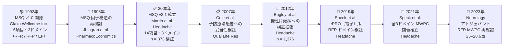
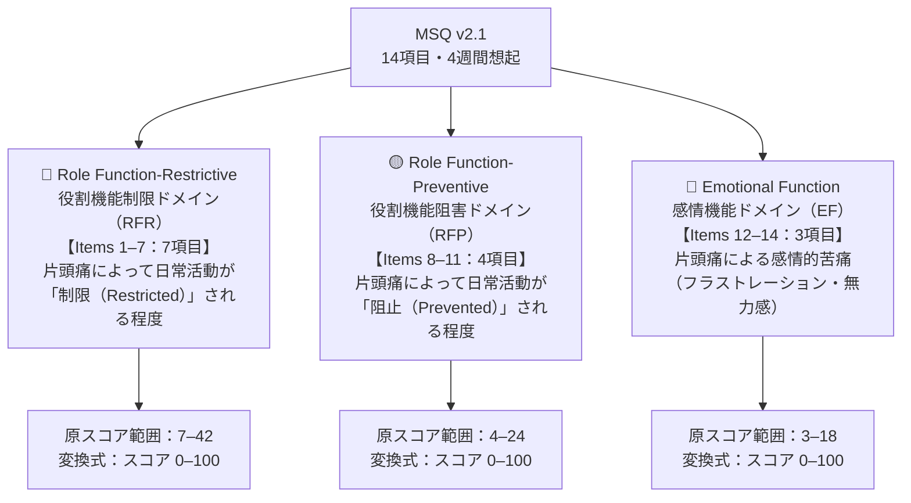
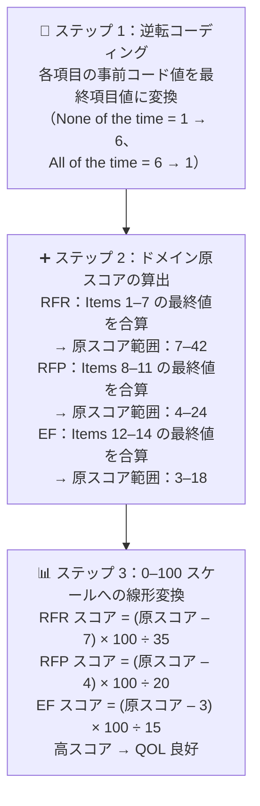
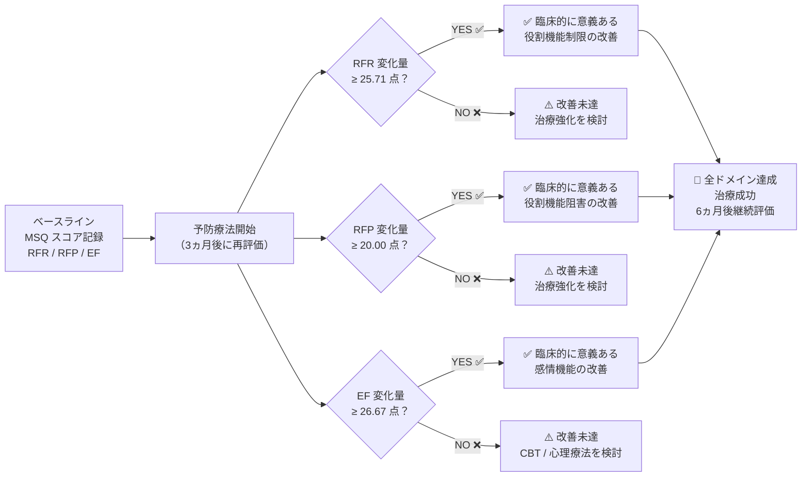
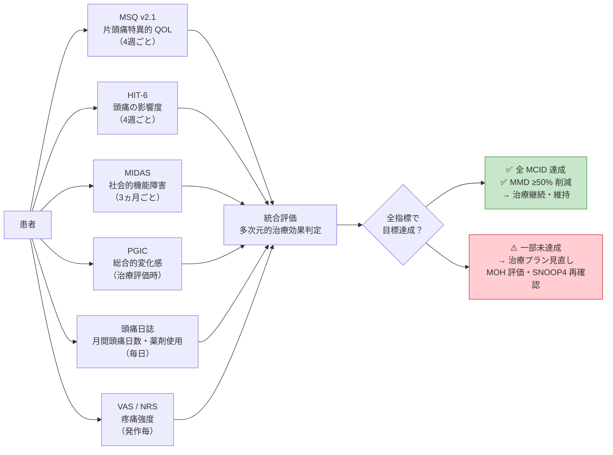
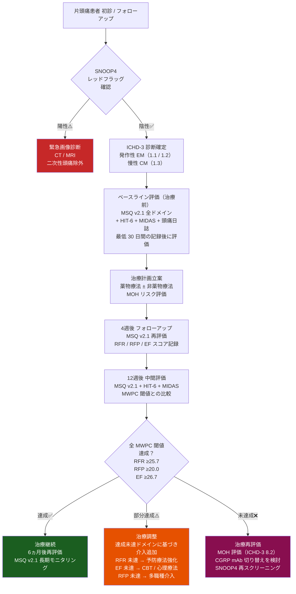

# MSQ v2.1（片頭痛特異的 QOL 質問票）完全リファレンスガイド

## Migraine-Specific Quality of Life Questionnaire Version 2.1

### 初学者から臨床研究者まで対応する段階的解説

---

> **⚠️ 学術免責事項（Academic Disclaimer）**
>
> 本文書は**学術的・教育的・研究目的のみ**を対象として作成されています。  
> 記載されたすべての情報は、資格を有する医療専門家による査読・判断を経たうえで臨床に適用される必要があります。  
> 本文書は個人への医療アドバイス・診断・処方の代替となるものではありません。

---

## 目次

1. [MSQ v2.1 とは何か — 開発背景と意義](#1-msq-v21-とは何か)
2. [SNOOP4 レッドフラッグスクリーニング（必須先行評価）](#2-snoop4-レッドフラッグスクリーニング)
3. [開発の歴史 — v1.0 から v2.1 への進化](#3-開発の歴史)
4. [質問票の構造 — 3ドメイン・14項目を理解する](#4-質問票の構造)
5. [各ドメインの内容と測定概念](#5-各ドメインの詳細)
6. [スコアリング方法 — 3ステップで理解する](#6-スコアリング方法)
7. [スコア解釈と治療反応の評価](#7-スコア解釈)
8. [心理測定特性（Psychometric Properties）](#8-心理測定特性)
9. [最小臨床重要差 — MWPC / MCID の理解](#9-最小臨床重要差)
10. [CGRP 治療臨床試験における MSQ v2.1 の活用](#10-cgrp-臨床試験での活用)
11. [他の頭痛 PRO との比較・補完的使用](#11-他の頭痛-pro-との比較)
12. [臨床使用フローチャート](#12-臨床使用フローチャート)
13. [特殊集団への適用](#13-特殊集団への適用)
14. [統合モニタリングプロトコル（12週間フレームワーク）](#14-統合モニタリングプロトコル)
15. [エビデンス要約と参考文献](#15-参考文献)

---

## 1. MSQ v2.1 とは何か — 開発背景と意義 {#1-msq-v21-とは何か}

### 1.1 定義と位置づけ

**MSQ v2.1（Migraine-Specific Quality of Life Questionnaire Version 2.1）** は、片頭痛が患者の**健康関連 QOL（Health-Related Quality of Life: HRQoL）** に与える影響を、疾患特異的に定量化するための**自己記入式患者報告アウトカム（Patient-Reported Outcome: PRO）** 測定ツールです。

> **「疾患特異的（disease-specific）」であることの意義：**  
> 一般的な QOL 尺度（SF-36、EQ-5D など）は多疾患に広く使用されますが、片頭痛固有の機能障害パターン（発作中・発作後の機能制限、感情的苦痛）を捉えるには精度が不十分です。MSQ v2.1 は片頭痛患者の主観的体験に最適化された設計により、臨床試験や実臨床での微細な変化を鋭敏に検出します。

### 1.2 MSQ v2.1 の核心的役割

| 役割 | 具体的内容 |
|------|-----------|
| **臨床試験の主要 / 副次的エンドポイント** | CGRP mAb（ガルカネズマブ、エレヌマブ、フレマネズマブ、エプチネズマブ）、ゲパント（アトジェパント、ウブロゲパント）などの Phase 3 試験の標準 PRO として採用 |
| **治療反応の患者視点評価** | 頭痛日数（頻度指標）だけでは捉えられない、患者の日常生活・感情への影響を定量化 |
| **薬事申請データの支持的証拠** | FDA・EMA への承認申請において HRQoL エビデンスとして提出 |
| **実臨床でのフォローアップ指標** | 予防療法の有効性評価・治療変更の判断基準 |

> **初学者向け補足：**  
> 「月間頭痛日数が 4日→2日に減少した」という数値データだけでなく、「患者が仕事・家族・感情の面で実際にどれだけ改善を実感しているか」を定量化するのが MSQ v2.1 の本質的価値です。

### 1.3 MSQ v2.1 の基本仕様

| 項目 | 内容 |
|------|------|
| **項目数** | 14 項目（Items 1–14） |
| **ドメイン数** | 3（RFR / RFP / EF） |
| **回想期間（Recall Period）** | 過去 **4週間** |
| **回答選択肢** | 6 段階（Likert スケール） |
| **スコア範囲** | 各ドメイン 0–100 点 |
| **スコア方向性** | **高スコア = QOL 良好**（改善を反映） |
| **所要時間** | 約 5–7 分 |
| **配布・利用許諾** | Mapi Research Trust（https://eprovide.mapi-trust.org/） |

---

## 2. SNOOP4 レッドフラッグスクリーニング（必須先行評価） {#2-snoop4-レッドフラッグスクリーニング}

> **⚠️ 重要：MSQ v2.1 を使用する前に必ず SNOOP4 スクリーニングを完了すること。**  
> 二次性頭痛が疑われる場合は、先に CT / MRI 等の画像診断を行い、原疾患を除外したうえで QOL 評価を実施する。

| 記号 | 英語 | 内容 | 必要な対応 |
|------|------|------|-----------|
| **S** | Systemic symptoms | 発熱・髄膜刺激症状・体重減少・免疫抑制・悪性腫瘍既往 | 緊急画像診断 |
| **N** | Neurological deficits | 運動麻痺・感覚障害・失語・複視・意識変容 | 緊急神経学的精査 |
| **O** | Onset sudden | 雷鳴頭痛（Thunderclap）：「生涯最悪の頭痛」→ くも膜下出血除外 | 緊急 CT |
| **O** | Onset after 50 | 50歳以降の新規頭痛 → 側頭動脈炎・頭蓋内病変除外 | 緊急画像診断 |
| **P** | Pattern change | 増悪傾向・外傷後新規発症・体位依存性頭痛 | 画像診断 |
| **4** | 4 追加基準 | 乳頭浮腫 / 硬膜穿刺後 / 痙攣後 / 妊娠・産後 | 専門的評価 |

---

## 3. 開発の歴史 — v1.0 から v2.1 への進化 {#3-開発の歴史}

### 3.1 MSQ の開発系譜

MSQ の開発は 1992 年に Glaxo Wellcome Inc. が主導した片頭痛 QOL 研究に端を発します。文献レビュー、片頭痛専門医との協議、および一対一の患者インタビューを組み合わせた質的研究により、初版（v1.0）が構築されました。

> **v1.0（16項目）→ v2.1（14項目）への変更点：**  
> 因子分析および心理測定的精緻化の結果、2項目が削除・再構成されました。また回答スコアの方向性（スコアリング方向）が整理され、「高スコア = 良好な QOL」という直感的解釈が確立されました。

### 3.2 主要開発・検証文献

| 著者・年 | 主な内容 | 掲載誌 |
|---------|---------|--------|
| Jhingran P, et al. 1998 | MSQ 因子構造の再検討（v1.0 → v2.0）| *PharmacoEconomics* 13: 707–717 |
| Martin BC, et al. 2000 | MSQ v2.1 妥当性・信頼性の確立（n = 373）| *Headache* 40: 112–121 |
| Cole JC, et al. 2007 | 予防療法患者における妥当性検証 | *Qual Life Res* 16: 1231–1237 |
| Bagley CL, et al. 2012 | 発作性・慢性片頭痛での妥当性拡張（n = 1,376）| *Headache* 52: 409–421 |
| Speck RM, et al. 2019 | ePRO（電子版）RFR ドメイン心理測定検証 | *Headache* 59: 506–521 |
| Speck RM, et al. 2021 | 全3ドメイン ePRO MWPC 閾値確立 | *Headache* 61: 38–48 |

---

## 4. 質問票の構造 — 3ドメイン・14項目を理解する {#4-質問票の構造}

### 4.1 ドメイン構成の全体像

MSQ v2.1 の 14 項目は以下の 3 つのドメインに分類されます。

### 4.2 ドメイン別項目数と測定概念の比較

| ドメイン | 略称 | 項目番号 | 項目数 | 測定概念 | 原スコア範囲 |
|---------|------|---------|--------|---------|------------|
| **役割機能制限** | RFR（Role Function-Restrictive） | Items 1–7 | 7 項目 | 片頭痛が日常活動・社会的・職業的活動の「遂行能力」を**制限（Limit）** する程度 | 7–42 |
| **役割機能阻害** | RFP（Role Function-Preventive） | Items 8–11 | 4 項目 | 片頭痛が日常活動・社会的・職業的活動の「遂行」を**完全に妨げる（Prevent）** 程度 | 4–24 |
| **感情機能** | EF（Emotional Function） | Items 12–14 | 3 項目 | 片頭痛がもたらす**感情的苦痛**（フラストレーション・無力感・バーデン感） | 3–18 |

> **RFR と RFP の違い（初学者向け解説）：**  
> - **RFR（制限）：** 「活動はできているが、頭痛のためにパフォーマンスが低下している」状態を測定します。例：家族と会話しているが、頭痛で十分に集中できない。  
> - **RFP（阻害）：** 「活動そのものを行えなかった・取りやめた」完全な機能喪失を測定します。例：頭痛のために外出を完全にキャンセルした。

### 4.3 各ドメインの測定項目（英語原版 要旨）

#### RFR ドメイン — Items 1–7（役割機能制限）

過去 4 週間に、片頭痛のためにどのくらいの頻度で以下の制限が生じましたか？

| 項目番号 | 英語原版（要旨） | 測定内容 |
|---------|----------------|---------|
| **Item 1** | Interfered with how well you dealt with family, friends, and others | 家族・友人・他者との関わりへの支障 |
| **Item 2** | Limited your ability to do household chores | 家事遂行能力の制限 |
| **Item 3** | Left you unable to do work outside the home or attend school for the entire day | 終日の職業活動・通学の全面的な不能 |
| **Item 4** | Limited your ability to work outside the home or attend school | 職業活動・通学能力の制限 |
| **Item 5** | Left you unable to perform your household chores for the entire day | 終日の家事遂行の全面的な不能 |
| **Item 6** | Limited your ability to concentrate | 集中力の制限 |
| **Item 7** | Limited your enjoyment of social activities | 社会的活動の楽しみへの制限 |

#### RFP ドメイン — Items 8–11（役割機能阻害）

過去 4 週間に、片頭痛のためにどのくらいの頻度で以下の活動が妨げられましたか？

| 項目番号 | 英語原版（要旨） | 測定内容 |
|---------|----------------|---------|
| **Item 8** | Prevented you from doing things outside the home | 外出活動の阻止 |
| **Item 9** | Prevented you from going to family events, social activities | 家族イベント・社会活動への参加阻止 |
| **Item 10** | Prevented you from doing work outside the home or attending school | 職業活動・通学の阻止 |
| **Item 11** | Prevented you from doing your household chores | 家事の阻止 |

#### EF ドメイン — Items 12–14（感情機能）

過去 4 週間に、片頭痛のためにどのくらいの頻度で以下の感情を経験しましたか？

| 項目番号 | 英語原版（要旨） | 測定内容 |
|---------|----------------|---------|
| **Item 12** | Feel helpless（無力感）| 頭痛に対する無力感・コントロール不能感 |
| **Item 13** | Feel frustrated（フラストレーション）| 日常生活が妨げられることへの苛立ち |
| **Item 14** | Feel like you are a burden（バーデン感）| 他者への負担感・申し訳なさ |

> **📌 利用許諾について：**  
> MSQ v2.1 の質問票全文（原版および各言語訳）は **Mapi Research Trust** が管理しています。研究・臨床使用の際には必ず事前許諾を取得してください。  
> ライセンス申請: https://eprovide.mapi-trust.org/instruments/migraine-specific-quality-of-life-questionnaire

---

## 5. 各ドメインの詳細と臨床的意義 {#5-各ドメインの詳細}

### 5.1 RFR ドメイン — 役割機能制限（Role Function-Restrictive）

RFR ドメインは、片頭痛研究において最も高い証拠基盤を持ち、**主要エンドポイント**として採用される頻度が最も高いドメインです。

**臨床的意義：**
- 片頭痛患者は「発作中も活動を継続しながらも（Working through）、パフォーマンスが著しく低下している」状態（Presenteeism）が多いため、RFR は他ドメインより広い患者層で高い感受性を示します。
- 職場・家庭・社会的文脈にわたる7項目の包括性により、生活全体への影響を多角的に捉えます。
- CGRP mAb 臨床試験（EVOLVE-1、EVOLVE-2、REGAIN）において、一次・二次エンドポイントとして使用されました。

**疫学的特徴：**
- 発作性片頭痛（EM）より慢性片頭痛（CM）患者でベースラインスコアが有意に低い（QOL 障害が大きい）ことが多数の研究で確認されています。
- 日本人 EM 患者では欧米患者と比較して、ベースライン RFR スコアが高い（比較的良好な QOL）傾向が報告されています（Dovepress 2020、ガルカネズマブ日本 Phase 2 試験）。

### 5.2 RFP ドメイン — 役割機能阻害（Role Function-Preventive）

RFP ドメインは、活動の「完全な中断・放棄」を測定するため、**重症患者・慢性片頭痛患者**のアウトカム評価に特に有用です。

**臨床的意義：**
- 4項目のコンパクトな構成ながら、「活動に出ることさえできなかった」という機能喪失の深刻度を捉えます。
- 慢性片頭痛における社会的孤立・就労不能の評価に適します。
- MWPC 閾値は 20.00 点（0–100 スケール）で、RFR より低い閾値は、このドメインが変化に対して感度が高いことを示します。

### 5.3 EF ドメイン — 感情機能（Emotional Function）

EF ドメインは、片頭痛の心理的・感情的側面を直接評価する唯一のドメインです。

**臨床的意義：**
- 3項目（無力感・フラストレーション・バーデン感）は、CBT や心理療法の治療目標に直結します。
- 不安・抑うつの二次評価（PHQ-9、GAD-7）との相補的使用により、片頭痛患者の精神健康を多面的に評価できます。
- CGRP mAb による感情機能の改善は、薬理学的効果が心理的側面にも波及することを示す重要なエビデンスです。
- MWPC 閾値は 26.67 点（3ドメイン中最も高い）。

---

## 6. スコアリング方法 — 3ステップで理解する {#6-スコアリング方法}

### 6.1 回答スケールの構造

各 14 項目に対し、患者は過去 4 週間の経験頻度を以下の 6 段階で回答します。

| 回答選択肢 | 事前コード値（Precoded Value）| 最終項目値（Final Item Value）|
|-----------|:---:|:---:|
| None of the time（まったくない）| 1 | **6** |
| A little bit of the time（ほとんどない）| 2 | **5** |
| Some of the time（ときどきある）| 3 | **4** |
| A good bit of the time（かなりある）| 4 | **3** |
| Most of the time（ほとんどいつもある）| 5 | **2** |
| All of the time（いつもある）| 6 | **1** |

> **⚠️ スコアリングの重要ポイント — 逆転コーディング（Reverse Recoding）：**  
> MSQ v2.1 は、頻度が高いほど QOL が悪化することを反映して、**事前コード値を逆転させた最終項目値を使用します。**  
> 例：「まったくない（1）」→ 最終値 6（最良）、「いつもある（6）」→ 最終値 1（最悪）  
> この逆転処理により、**最終スコアが高いほど QOL が良好**という直感的解釈が成立します。

### 6.2 スコアリング 3ステップ

### 6.3 変換式と理論値（詳細）

| ドメイン | 項目数 | 原スコア最小 | 原スコア最大 | 変換式 | 変換後最小 | 変換後最大 |
|---------|:---:|:---:|:---:|:---:|:---:|:---:|
| **RFR** | 7 | 7（全項目=1）| 42（全項目=6）| `(Σ – 7) × 100 ÷ 35` | **0** | **100** |
| **RFP** | 4 | 4（全項目=1）| 24（全項目=6）| `(Σ – 4) × 100 ÷ 20` | **0** | **100** |
| **EF** | 3 | 3（全項目=1）| 18（全項目=6）| `(Σ – 3) × 100 ÷ 15` | **0** | **100** |

> **変換式の解読（初学者向け）：**  
> `(原スコア – 最小値) × 100 ÷ (最大値 – 最小値)` という線形変換です。  
> 例：RFR 原スコア = 21 の場合 → (21 – 7) × 100 ÷ 35 = 14 × 100 ÷ 35 = **40.0 点**

### 6.4 欠損データの取扱い

- ドメイン内の項目の **半数以上（過半数以上）** に回答がある場合、欠損項目を「当該ドメインの完了項目の平均値」で代入できます。
- 具体的には、RFR（7項目）は 4 項目以上、RFP（4項目）は 2 項目以上、EF（3項目）は 2 項目以上の回答があれば計算可能です。
- 欠損が多い場合はドメインスコアを欠損（Missing）とします。

### 6.5 スコアリング計算例（ステップ解説）

**症例：40歳女性、発作性片頭痛患者、予防療法開始前**

**ステップ 1 & 2：逆転後の回答値と RFR 原スコア算出**

| 項目 | 回答（患者記入）| 事前コード | 逆転後（最終値）|
|------|:---:|:---:|:---:|
| Item 1 | Most of the time（ほとんど）| 5 | **2** |
| Item 2 | Some of the time（ときどき）| 3 | **4** |
| Item 3 | A good bit of the time（かなり）| 4 | **3** |
| Item 4 | A good bit of the time（かなり）| 4 | **3** |
| Item 5 | Some of the time（ときどき）| 3 | **4** |
| Item 6 | Most of the time（ほとんど）| 5 | **2** |
| Item 7 | A good bit of the time（かなり）| 4 | **3** |
| **RFR 原スコア合計** | — | — | **21** |

**ステップ 3：RFR 変換スコア = (21 – 7) × 100 ÷ 35 = 40.0 点**

同様に RFP・EF スコアを算出し、3ドメインスコアをプロファイルとして記録します。

---

## 7. スコア解釈と治療反応の評価 {#7-スコア解釈}

### 7.1 スコアの一般的解釈

MSQ v2.1 には HIT-6 や MIDAS のような公式カットオフ値（重症度グレード分類）は存在しませんが、以下の参照値が臨床研究で広く使用されます。

| スコア帯（0–100） | 解釈の目安 | 臨床的示唆 |
|:-:|---------|-----------|
| **0–40 点** | 重篤な QOL 障害 | 積極的な予防療法・多職種介入を強く示唆 |
| **40–60 点** | 中等度の QOL 障害 | 予防療法の最適化・補完療法の追加を検討 |
| **60–80 点** | 軽度〜中等度の QOL 障害 | 急性期治療の改善・生活習慣介入を継続 |
| **80–100 点** | 軽度または QOL 良好 | 現行治療の維持・定期フォローアップ |

> **注意：** 上記は参照値であり、個人差・片頭痛サブタイプ（発作性 vs 慢性）・人種・文化的背景によりベースラインスコアに差異が生じます。絶対値よりも**ベースラインからの変化量**が治療評価の主軸となります。

### 7.2 頭痛タイプ別の参照ベースラインスコア

| 片頭痛タイプ（ICHD-3）| RFR 典型値 | RFP 典型値 | EF 典型値 | 参照 |
|-------------------:|:-:|:-:|:-:|------|
| 発作性片頭痛（EM）| 約 50–60 | 約 55–65 | 約 50–60 | EVOLVE-1/-2 試験（n = 1,773）|
| 慢性片頭痛（CM）| 約 35–45 | 約 45–55 | 約 40–55 | REGAIN 試験（n = 1,113）|
| 日本人 EM 患者 | 約 60–70 | 約 65–75 | — | ガルカネズマブ日本 Phase 2 試験 |

> 日本人患者のベースラインスコアが欧米患者より高い傾向について、文化的・社会的背景（例：発作中も活動を継続する傾向）が影響している可能性が指摘されています。

### 7.3 治療反応の評価フレームワーク

**治療前後のスコア変化の解釈：**

| 変化量（Change Score） | 解釈 |
|:---:|------|
| **MWPC 閾値未満の増加** | 統計的改善は見られるが、患者が実感できる臨床的意義には達していない |
| **MWPC 閾値以上の増加** | **臨床的に意義ある QOL 改善**（患者が実感できる変化） |
| **スコア低下** | QOL 悪化 → 治療再評価・MOH 評価・SNOOP4 再スクリーニング |

---

## 8. 心理測定特性（Psychometric Properties） {#8-心理測定特性}

### 8.1 信頼性（Reliability）

**内的一貫性（Internal Consistency）：Cronbach's α**

| 研究 | ドメイン | Cronbach's α | 対象集団 |
|------|---------|:-:|---------|
| Martin et al. 2000 | 全ドメイン | **0.86–0.96** | 発作性片頭痛（n = 373）|
| Bagley et al. 2012 | 全ドメイン | **0.93** | 慢性片頭痛（n = 1,376）|
| Speck et al. 2021（ePRO）| RFR | **0.93–0.95** | EM / CM（n = 1,606）|
| Greek validation（2024）| 全ドメイン | **0.93** | ギリシャ語版（n = 291）|

> α ≥ 0.80 は「良好〜優秀」な内的一貫性を示します。MSQ v2.1 はすべての主要研究で基準を大きく上回っており、各ドメイン内の項目が一貫した概念を測定していることが確認されています。

**検査再検査信頼性（Test-Retest Reliability）：ICC**

| 研究 | ICC 範囲 | 安定期間 | 解釈 |
|------|:---:|:---:|------|
| Martin et al. 2000 | 0.57–0.63 | 2–4 週 | 許容できる再現性 |
| Chinese version（PMC 2019）| ≥ 0.69 | 1 週 | 良好な再現性 |
| Speck et al. 2021（ePRO）| **0.79–0.80** | 4 週 | 優秀な再現性（安定群） |

### 8.2 妥当性（Validity）

**収束的妥当性（Convergent Validity）**

| 相関指標 | 相関係数 | 方向性 | 解釈 |
|---------|:---:|:---:|------|
| MIDAS との相関 | r = **−0.71** | 負（期待通り）| MIDAS 高値（機能障害大）→ MSQ スコア低値 |
| HIT-6 との相関（RFR）| r = **0.70–0.78** | 強い正の相関 | 強い構成概念の収束 |
| 月間片頭痛日数（MMD）| r = **−0.40** | 負 | 頭痛頻度増加 → MSQ スコア低下 |
| SF-36（身体的機能）| r = **0.54** | 正 | 一般 QOL との適度な収束 |

> **収束的妥当性とは（初学者向け）：**  
> 「同じ概念を測定していると思われる他の指標と、理論通りの方向性で相関する」かどうかを検証するものです。MIDAS（障害大＝高スコア）と MSQ（QOL 良好＝高スコア）が強い負の相関（r = −0.71）を示すことは、両者が同じ概念（片頭痛の影響）の異なる側面を測定していることを確認します。

**既知グループ妥当性（Known-Group Validity）**

- 慢性片頭痛（CM）患者は発作性片頭痛（EM）患者に比べて有意に低い MSQ スコアを示し、疾患重症度の違いを正確に反映することが確認されています。
- Patient Global Impression of Severity（PGI-S）の重症度グループ間で MSQ スコアが有意に異なります（p < 0.0001）。

### 8.3 反応性（Responsiveness）

MSQ v2.1 は治療による変化を鋭敏に捉える反応性が高く、以下の主要臨床試験で治療効果の検出に使用されています。

| 試験名 | 薬剤 | RFR 変化量（LS Mean）|
|-------|------|:---:|
| EVOLVE-1 | ガルカネズマブ 120 mg | +12.7 点（プラセボ +6.1 点） |
| EVOLVE-2 | ガルカネズマブ 120 mg | +11.7 点（プラセボ +5.8 点） |
| REGAIN（CM）| ガルカネズマブ 120 mg | +11.5 点（プラセボ +6.9 点） |
| アトジェパント 60 mg QD（52週）| アトジェパント 60 mg | +34.70 点（52週時点） |

### 8.4 多言語版の検証状況

| 言語版 | 検証状況 | 代表文献 |
|-------|---------|---------|
| 英語（原版） | ✅ 確立（n = 373 / n = 1,376）| Martin 2000; Bagley 2012 |
| 中国語（繁体字・簡体字）| ✅ 検証済（n = 174）| PMC: PMC6591995 |
| ペルシャ語 | ✅ 検証済（n = 106）| PMC: PMC3771439 |
| ギリシャ語 | ✅ 検証済（n = 291）| PMC: PMC11250746 |
| アラビア語 | ✅ 検証済（2025）| *Headache* 2025;65:770–778 |
| 日本語 | ✅ 日本 Phase 2/3 試験で使用・報告あり | ガルカネズマブ国内試験（NCT02959190）|

---

## 9. 最小臨床重要差 — MWPC / MCID の理解 {#9-最小臨床重要差}

### 9.1 MWPC / MCID とは何か

**MWPC（Meaningful Within-Patient Change）** または **MCID（Minimal Clinically Important Difference）** は、「統計的有意性」ではなく**「患者が実際に改善を実感できる最小の変化量」**を示します。

> **具体例：**  
> RFR スコアが 40.0 点 → 50.0 点（+10.0 点）に上昇したとします。これは統計的に有意かもしれませんが、MWPC 閾値（約 25.7 点）を下回るため、患者が「生活の質が良くなった」と実感できる水準には達していません。  
> → **臨床的意義のある改善には 25.7 点以上の上昇が必要**です。

### 9.2 ドメイン別 MWPC 閾値（確立値）

| ドメイン | MWPC 閾値 | 推定方法 | 主要出典 |
|---------|:---------:|---------|---------|
| **RFR** | **25.71 点** | アンカーベース法（PGIC 基準）| Speck et al. 2021 *Headache* |
| **RFP** | **20.00 点** | アンカーベース法（PGIC 基準）| Speck et al. 2021 *Headache* |
| **EF** | **26.67 点** | アンカーベース法（PGIC 基準）| Speck et al. 2021 *Headache* |
| **RFR（追加確認）** | **25.0–28.6 点** | アンカーベース法（PGI-S/PGIC 基準）| Neurology 2023（アトジェパント試験）|

> **MWPC 閾値の理解を深める：**  
> - EF（26.67 点）の閾値が最も高いことは、感情機能の改善を患者が実感するには相対的に大きな変化が必要であることを意味します。EF ドメインは発作の頻度・強度の変化よりも、感情的な適応・受容に関連するため、感受性が RFR・RFP より異なります。
> - RFP（20.00 点）の閾値が最も低いことは、「完全な活動阻止」という重篤な機能損失が改善した場合、より小さな変化でも患者が実感しやすいことを示します。

### 9.3 MWPC 達成の臨床的意義

---

## 10. CGRP 治療臨床試験における MSQ v2.1 の活用 {#10-cgrp-臨床試験での活用}

### 10.1 主要 CGRP 試験での使用状況

MSQ v2.1 は、現代の抗 CGRP 療法すべての主要臨床試験において標準 PRO として採用されており、薬事承認の HRQoL エビデンスとして規制当局に提出されています。

| 試験名 | 薬剤 | MSQ v2.1 の位置づけ |
|-------|------|-------------------|
| **EVOLVE-1** | ガルカネズマブ（Emgality）| 副次的エンドポイント（RFR）|
| **EVOLVE-2** | ガルカネズマブ | 副次的エンドポイント（RFR）|
| **REGAIN**（CM）| ガルカネズマブ | 副次的エンドポイント（RFR）|
| **ARISE** | エレヌマブ（Aimovig）| 副次的エンドポイント（全ドメイン）|
| **HALO EM/CM** | フレマネズマブ（Ajovy）| 副次的エンドポイント（全ドメイン）|
| **PROMISE-1/-2** | エプチネズマブ（Vyepti）| 副次的エンドポイント（全ドメイン）|
| **ADVANCE / ELEVATE** | アトジェパント（Qulipta）| 主要 / 副次的エンドポイント（全ドメイン）|
| **CENTURION** | リメゲパント（Nurtec ODT）| 副次的エンドポイント |
| **RESOLUTION**（MOH）| エプチネズマブ | 副次的エンドポイント |

### 10.2 CGRP mAb 試験での MSQ v2.1 RFR 変化量（代表値）

| 薬剤 | 投与量 | RFR 変化量（LS Mean）| プラセボ変化量 | p値 |
|------|--------|:---:|:---:|:---:|
| ガルカネズマブ | 120 mg/月 | +11.7–12.7 | +5.8–6.1 | < 0.001 |
| ガルカネズマブ | 240 mg/月 | +11.8–14.0 | +5.8–6.1 | < 0.001 |
| アトジェパント | 60 mg QD（52週）| +34.70（52週）| — | — |
| エレヌマブ | 70 mg/月 | 約 +10–12 | 約 +5–6 | < 0.001 |

> **注：** 治療間の直接比較は行われていないため、数値は各試験のベースライン・患者特性の違いに影響されます。

### 10.3 MOH（薬物過用性頭痛）患者における MSQ v2.1

MOH 患者では、ベースライン MSQ スコアが一般の片頭痛患者よりも低く（QOL 障害が大きい）、急性期薬剤の漸減に伴う離脱期に一時的なスコア悪化が生じることがあります。

> **RESOLUTION 試験（エプチネズマブ + 簡易教育介入 vs MOH）** において、MSQ v2.1 が副次的エンドポイントとして採用されており、MOH 治療における PRO 評価の標準化が進んでいます。  
> 参照: NCT05452239（ClinicalTrials.gov）

---

## 11. 他の頭痛 PRO との比較・補完的使用 {#11-他の頭痛-pro-との比較}

### 11.1 主要頭痛 PRO の比較マトリクス

| 尺度 | 測定概念 | 想起期間 | 項目数 | MCID | MSQ v2.1 との相補性 |
|------|---------|:---:|:---:|:---:|---|
| **MSQ v2.1** | 片頭痛特異的 QOL（RFR / RFP / EF）| 4 週 | 14 | RFR: 25.7 / RFP: 20.0 / EF: 26.7 | — 基準 — |
| **HIT-6** | 頭痛の日常生活への影響度 | 4 週 | 6 | 2.3–5 点 | 強相関（r = 0.70–0.78）；短く実施が容易 |
| **MIDAS** | 社会的機能障害（損失日数）| 3 ヵ月 | 5 | −4.5〜−13.5 点 | 負相関（r = −0.71）；機能損失の客観的定量化 |
| **PGIC** | 患者全般改善印象（総合的変化）| 治療前後 | 1 | スコア ≥ 5 | MSQ 変化量のアンカー指標として機能 |
| **VAS / NRS** | 疼痛強度 | 発作毎 | 1 | NRS −2 点 | 疼痛強度を補完（MSQ は機能的影響に特化）|
| **SF-36** | 一般 HRQoL（8ドメイン）| 4 週 | 36 | — | MSQ との正の収束妥当性（r = 0.54）|
| **EQ-5D** | 一般的健康効用値 | 当日 | 5 | — | 医療経済分析との組み合わせに有用 |

### 11.2 MSQ v2.1 が他ツールより優れる点

| 比較対象 | MSQ v2.1 の優位性 |
|---------|-----------------|
| **HIT-6** との比較 | 3ドメイン構成により、QOL 障害の「どの側面が改善したか」を層別評価できる |
| **MIDAS** との比較 | 4 週間想起（MIDAS は 3 ヵ月）で、月次の治療評価に適している；感情的側面（EF）を捉えられる |
| **一般 QOL 尺度** との比較 | 片頭痛特異的設計により、臨床試験の主要エンドポイントとしての感受性・特異性が高い |

### 11.3 推奨される多軸評価プロトコル

---

## 12. 臨床使用フローチャート {#12-臨床使用フローチャート}

### 12.1 MSQ v2.1 実施の全体フロー

### 12.2 ドメイン別の治療選択指針

| 未達成ドメイン | 示唆される追加介入 | エビデンスグレード |
|-------------|-----------------|:---:|
| **RFR のみ** | 予防療法の最適化（CGRP mAb へのステップアップ）、有酸素運動の追加 | Grade A/B |
| **RFP のみ** | 多職種介入（作業療法含む）、急性期治療の早期投与教育 | Grade B |
| **EF のみ** | CBT（認知行動療法）、MBSR、バイオフィードバック | Grade B |
| **RFR + EF** | CGRP mAb ± CBT 統合プログラム | Grade A（薬物）/ Grade B（行動）|
| **全ドメイン** | 包括的多職種介入 / 慢性片頭痛への診断再評価 | Grade A/B |

---

## 13. 特殊集団への適用 {#13-特殊集団への適用}

### 13.1 特殊集団別の適用注意事項

| 集団 | MSQ v2.1 適用 | 代替・補完ツール | 注意事項 |
|------|:---:|---------|---------|
| **小児（< 12歳）** | ❌ 適用外 | PedMIDAS / 小児版 VAS（FPS-R）| 成人版は認知的成熟を前提とする設計のため不適 |
| **青年期（12–17歳）** | ⚠️ 限定的（個別評価）| PedMIDAS + MSQ（14歳以上で検討）| 読解力・認知発達レベルを個別確認すること |
| **妊娠・授乳中** | ✅ 使用可（非侵襲的）| 同上（通常通り）| 質問票自体は安全；薬物療法の制限（バルプロ酸・CGRP mAb 禁忌）に留意 |
| **高齢者（> 65歳）** | ✅ 使用可（修正不要）| 同上 | 視覚的補助（大きめフォント）を用意；ICCの低下可能性に注意 |
| **MOH 回復期** | ✅ 特に重要 | HIT-6 + 薬剤使用日誌 | 離脱期（Week 1–2）はスコアが一時的に悪化する可能性；急性期薬剤の漸減開始と同時に記録開始 |
| **認知機能障害** | ⚠️ 要評価 | VRS（言語評価スケール）| 中等度以上の認知障害では介護者の補助が必要 |

### 13.2 ICHD-3 コード別適用指針

| ICHD-3 診断コード | 片頭痛タイプ | MSQ v2.1 推奨度 | 主な評価ドメイン |
|:-:|---------|:---:|---------|
| **1.1** | 前兆なし片頭痛 | ✅ 標準使用 | RFR（主要）+ RFP + EF |
| **1.2** | 前兆あり片頭痛 | ✅ 標準使用 | RFR + RFP（前兆による活動阻害）|
| **1.3** | 慢性片頭痛（≥ 15日/月）| ✅ 最重要 | 全ドメイン均等（特に RFP・EF）|
| **8.2** | 薬物過用性頭痛（MOH）| ✅ 治療反応モニタリングに重要 | EF（感情的苦痛）+ RFR |
| **2.2 / 2.3** | 頻発性・慢性緊張型頭痛 | ⚠️ 片頭痛合併時に使用 | 片頭痛合併例での使用を推奨 |

---

## 14. 統合モニタリングプロトコル（12週間フレームワーク） {#14-統合モニタリングプロトコル}

### 14.1 12週間 MSQ v2.1 モニタリングスケジュール

| 時点 | 実施ツール | 目的 | 基準値 |
|------|---------|------|-------|
| **Week 0（治療前）** | MSQ v2.1 全ドメイン + HIT-6 + MIDAS + 頭痛日誌開始 | ベースライン確立 | — |
| **Week 4** | MSQ v2.1 全ドメイン + 頭痛日誌集計 | 早期反応評価・アドヒアランス確認 | ベースライン比 |
| **Week 8** | MSQ v2.1 全ドメイン + HIT-6 | 治療効果の中間評価 | 変化量 > 0 を確認 |
| **Week 12** | MSQ v2.1 全ドメイン + HIT-6 + MIDAS + PGIC | 主要評価・MWPC 判定 | **RFR ≥ 25.7 / RFP ≥ 20.0 / EF ≥ 26.7** |
| **Month 6** | MSQ v2.1 + HIT-6 + MIDAS | 長期有効性・持続性評価 | 12週後スコアの維持または改善 |
| **Month 12** | MSQ v2.1 全ドメイン + 全 PRO 一式 | 年次総合評価・治療継続判断 | — |

### 14.2 治療成功の総合的定義

**3ヵ月（12週）時点での治療成功基準（国際標準）：**

| 評価指標 | 最低成功基準（MCID）| 優良基準 |
|---------|:-----------:|:-----:|
| **MSQ RFR** | **≥ 25.71 点の改善** | ≥ 40 点の改善 |
| **MSQ RFP** | **≥ 20.00 点の改善** | ≥ 35 点の改善 |
| **MSQ EF** | **≥ 26.67 点の改善** | ≥ 40 点の改善 |
| 月間頭痛日数（MMD）| ≥ 50% 削減 | ≥ 75% 削減 |
| HIT-6 | ≥ 2.3〜5 点の改善 | < 50 点（正常域）|
| MIDAS Grade | 1 段階以上の改善 | Grade I または II |
| 急性期薬剤使用日数 | MOH 閾値以下（< 8〜10 日/月）| ≤ 4 日/月 |

### 14.3 薬物過用頭痛（MOH）との関連でのモニタリング

> **⚠️ MOH リスク閾値（ICHD-3 コード 8.2）を必ず並行評価すること：**
>
> - 単純鎮痛薬・NSAIDs：月 10 日以上かつ 3 ヵ月以上 → MOH
> - トリプタン・エルゴタミン・オピオイド：月 8 日以上かつ 3 ヵ月以上 → MOH
> - 組み合わせ鎮痛薬：月 10 日以上かつ 3 ヵ月以上 → MOH
>
> MSQ v2.1 スコアが低下傾向を示す場合、MOH への移行を鑑別することが重要です。

---

## 15. エビデンス要約と参考文献 {#15-参考文献}

### 15.1 エビデンスグレード要約

| MSQ v2.1 の属性 | エビデンスグレード | 根拠 |
|----------------|:---:|------|
| 内的一貫性（Cronbach's α ≥ 0.86）| **Grade A** | 複数 RCT / 大規模検証研究 |
| 発作性片頭痛での妥当性 | **Grade A** | Martin 2000（n=373）; Cole 2007 |
| 慢性片頭痛での妥当性 | **Grade A** | Bagley 2012（n=1,376）; 複数 CM 試験 |
| ePRO 版の妥当性 | **Grade A** | Speck 2019, 2021（EVOLVE / REGAIN）|
| MWPC 閾値の確立 | **Grade A** | Speck 2021; Neurology 2023 |
| 多言語版妥当性 | **Grade B** | 中国語・ペルシャ語・ギリシャ語・アラビア語版 |
| MOH 患者での使用 | **Grade B** | RESOLUTION 試験（進行中）|
| 小児への使用 | **Grade U** | 検証研究が存在しない |

### 15.2 開発・検証文献（一次出典）

| 著者・年 | タイトル | 掲載誌 | URL |
|---------|---------|-------|-----|
| Martin BC, et al. 2000 | Validity and reliability of the Migraine-Specific Quality of Life Questionnaire (MSQ Version 2.1) | *Headache* 40: 112–121 | [PubMed: 10759926](https://pubmed.ncbi.nlm.nih.gov/10759926/) |
| Cole JC, et al. 2007 | Validation of the Migraine-Specific Quality of Life Questionnaire version 2.1 (MSQ v.2.1) for patients undergoing prophylactic migraine treatment | *Qual Life Res* 16: 1231–1237 | [PubMed: 17487559](https://pubmed.ncbi.nlm.nih.gov/17487559/) |
| Bagley CL, et al. 2012 | Validating Migraine-Specific Quality of Life Questionnaire v2.1 in Episodic and Chronic Migraine | *Headache* 52: 409–421 | [PubMed: 21929662](https://pubmed.ncbi.nlm.nih.gov/21929662/) |
| Speck RM, et al. 2019 | Psychometric Validation of the Role Function Restrictive Domain of the MSQ v2.1 ePRO | *Headache* 59: 506–521 | [PMC: 6593730](https://pmc.ncbi.nlm.nih.gov/articles/PMC6593730/) |
| Speck RM, et al. 2021 | Psychometric validation and MWPC of the MSQ v2.1 ePRO in EM and CM | *Headache* 61: 38–48 | [DOI: 10.1111/head.14031](https://headachejournal.onlinelibrary.wiley.com/doi/10.1111/head.14031) |
| Neurology 2023（AAN）| Psychometric Evaluation of MSQ v2.1 RFR Using Atogepant Phase 3 Trial Data | *Neurology* 2023 | [DOI: 10.1212/WNL.0000000000203543](https://www.neurology.org/doi/10.1212/WNL.0000000000203543) |

### 15.3 多言語版検証文献

| 言語版 | 著者・年 | URL |
|-------|---------|-----|
| 中国語版 | Lo HHM, et al. 2019 | [PMC: 6591995](https://www.ncbi.nlm.nih.gov/pmc/articles/PMC6591995/) |
| ペルシャ語版 | Sadeghi M, et al. 2013 | [PMC: 3771439](https://www.ncbi.nlm.nih.gov/pmc/articles/PMC3771439/) |
| ギリシャ語版 | Deligianni CI, et al. 2024 | [PMC: 11250746](https://www.ncbi.nlm.nih.gov/pmc/articles/PMC11250746/) |
| アラビア語版 | Hussein M, et al. 2025 | [PubMed: 39601107](https://pubmed.ncbi.nlm.nih.gov/39601107/) |
| 日本語使用（臨床試験）| Lilly Japan（ガルカネズマブ Phase 2）| [ClinicalTrials.gov NCT02959190](https://clinicaltrials.gov/study/NCT02959190) |

### 15.4 CGRP 臨床試験（MSQ v2.1 使用試験）

| 試験名 / 試験番号 | 薬剤 | URL |
|----------------|------|-----|
| EVOLVE-1（NCT02614183）| ガルカネズマブ 120/240 mg | [ClinicalTrials.gov](https://clinicaltrials.gov/study/NCT02614183) |
| EVOLVE-2（NCT02614196）| ガルカネズマブ 120/240 mg | [ClinicalTrials.gov](https://clinicaltrials.gov/study/NCT02614196) |
| REGAIN（NCT02614261）| ガルカネズマブ（慢性片頭痛）| [ClinicalTrials.gov](https://clinicaltrials.gov/study/NCT02614261) |
| ADVANCE（NCT03777059）| アトジェパント（EM）| [ClinicalTrials.gov](https://clinicaltrials.gov/study/NCT03777059) |
| ELEVATE（NCT03855137）| アトジェパント（CM）| [ClinicalTrials.gov](https://clinicaltrials.gov/study/NCT03855137) |
| RESOLUTION（NCT05452239）| エプチネズマブ + MOH | [ClinicalTrials.gov](https://clinicaltrials.gov/study/NCT05452239) |

### 15.5 国際ガイドライン・規制基準

| 機関 | タイトル | URL |
|------|---------|-----|
| **IHS / ICHD-3** | 国際頭痛分類第 3 版（公式サイト）| https://ichd-3.org/ |
| **IHS / Cephalalgia 2024** | IHS 片頭痛急性期治療推奨 2024 | https://journals.sagepub.com/doi/10.1177/03331024241252666 |
| **AAN** | ガイドライン一覧（片頭痛予防含む）| https://www.aan.com/guidelines/ |
| **EHF** | CGRP mAb 予防療法ガイドライン 2022（PMC）| https://www.ncbi.nlm.nih.gov/pmc/articles/PMC9188162/ |
| **FDA** | Guidance for Industry: Migraine Preventive Treatment（2023）| https://www.fda.gov/media/168871/download |
| **Mapi Research Trust** | MSQ v2.1 利用申請（ePROVIDE）| https://eprovide.mapi-trust.org/instruments/migraine-specific-quality-of-life-questionnaire |
| **Cochrane Library** | 頭痛レビュー一覧 | https://www.cochranelibrary.com/search?query=headache+migraine&searchBy=3&type=cdsr |

---

*本ドキュメントは、IHS/ICHD-3・AAN・EHF・FDA、および査読済み学術文献（Headache, Cephalalgia, Neurology, Qual Life Res）に基づいて作成されました。*  
*最終更新：2026年6月*
