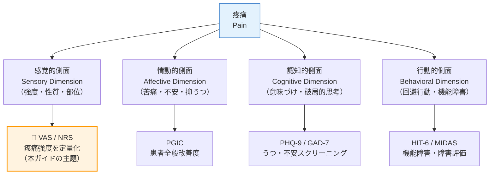
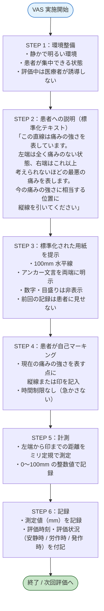
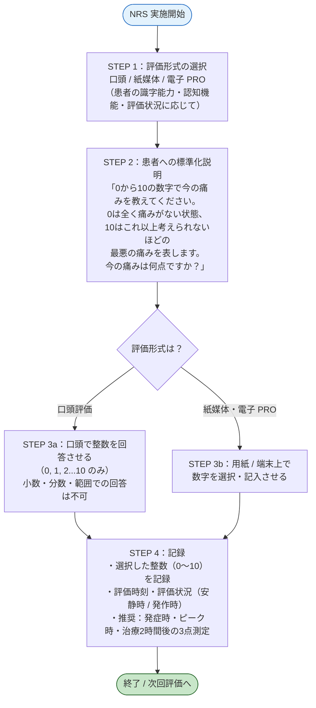
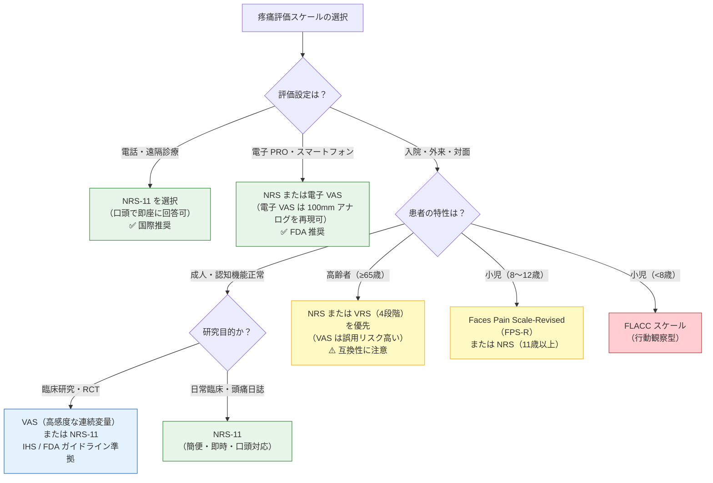
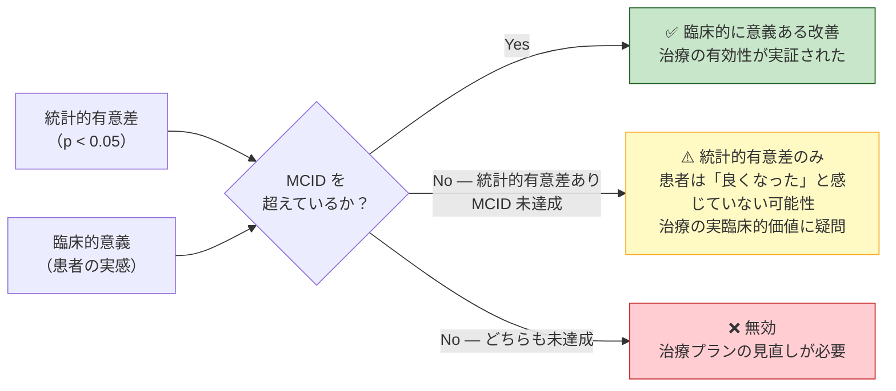
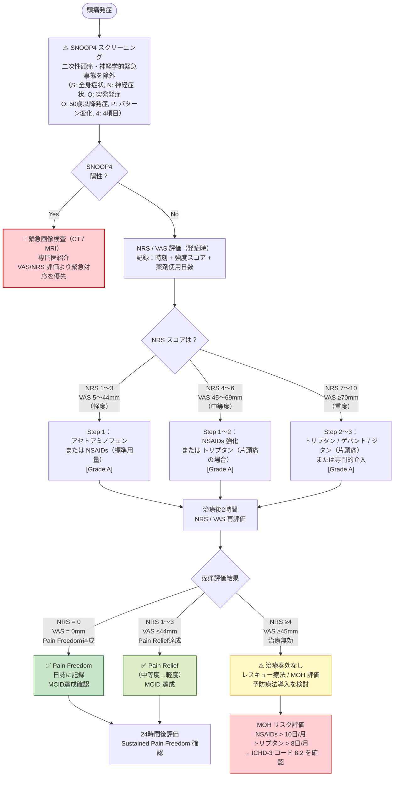
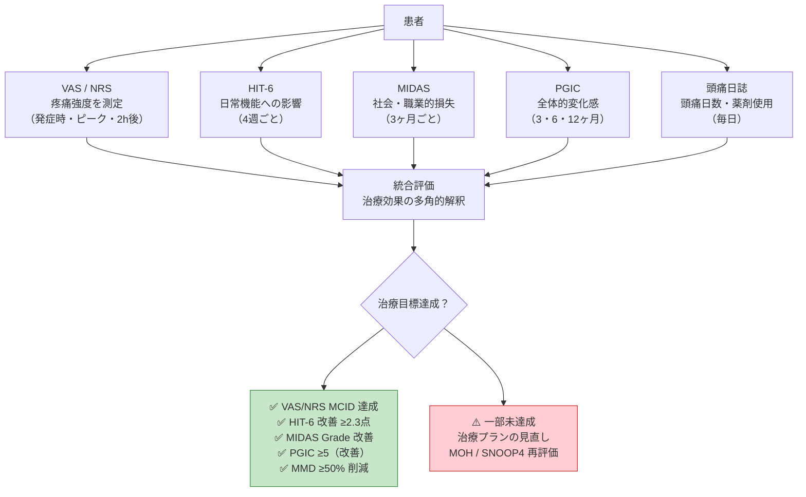
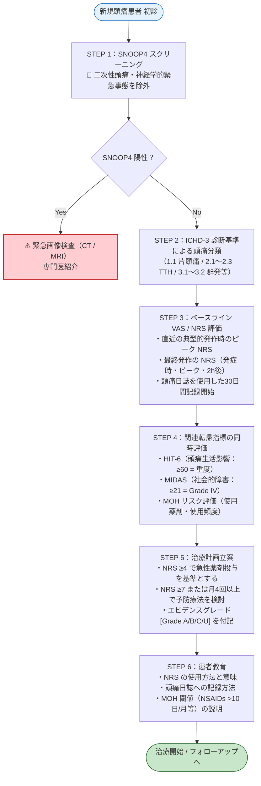

# VAS / NRS（視覚的アナログスケール / 数値評価スケール）

## 疼痛強度評価の理論・実践・頭痛医学への応用
**完全リファレンスガイド（初学者対応・ステップバイステップ解説）**

---

> **⚠️ 学術的免責事項（Academic Disclaimer）**
> 本ドキュメントは**学術・教育・研究目的のみ**を対象とした参考資料です。
> 臨床的判断・診断・処方への適用は、必ず資格を有する医療専門家によるレビューを経たうえで実施してください。
> Claude は個別の医療アドバイス・診断・処方を提供しません。

---

## 📋 目次

1. [はじめに — なぜ疼痛を「測定」するのか](#1-はじめに--なぜ疼痛を測定するのか)
2. [歴史的背景](#2-歴史的背景)
3. [VAS — 視覚的アナログスケール（Visual Analogue Scale）](#3-vas--視覚的アナログスケールvisual-analogue-scale)
4. [NRS — 数値評価スケール（Numerical Rating Scale）](#4-nrs--数値評価スケールnumerical-rating-scale)
5. [VRS — 言語評価スケール（Verbal Rating Scale）との比較](#5-vrs--言語評価スケールverbal-rating-scaleとの比較)
6. [VAS vs NRS — 直接比較と使い分け](#6-vas-vs-nrs--直接比較と使い分け)
7. [心理測定学的特性](#7-心理測定学的特性)
8. [最小臨床的重要差（MCID）](#8-最小臨床的重要差mcid)
9. [頭痛医学における VAS / NRS の応用](#9-頭痛医学における-vas--nrs-の応用)
10. [FDA PRO ガイダンスにおける位置づけ](#10-fda-pro-ガイダンスにおける位置づけ)
11. [特別集団への配慮](#11-特別集団への配慮)
12. [他の転帰指標との統合的活用](#12-他の転帰指標との統合的活用)
13. [臨床実施ワークフロー（12週間フレームワーク）](#13-臨床実施ワークフロー12週間フレームワーク)
14. [よくある誤りと注意点](#14-よくある誤りと注意点)
15. [参考文献・ソース一覧](#15-参考文献ソース一覧)

---

## 1. はじめに — なぜ疼痛を「測定」するのか

### 1.1 疼痛評価の意義

疼痛（Pain）は、**国際疼痛学会（IASP: International Association for the Study of Pain）** が2020年に改訂した定義によれば：

> **「実際のまたは潜在的な組織損傷に伴う、またはそれに類似した、不快な感覚的・情動的経験」**
> — Raja SN, et al. *Pain*. 2020;161(9):1976–1982.

この定義が示すように、疼痛は本質的に**主観的（subjective）**かつ多次元的な現象です。「痛みは測定できない」という直感的な疑念を超えて、疼痛を定量化することは Evidence-Based Medicine（EBM）の礎石であり、以下の目的のために不可欠です。

| 目的 | 内容 |
|------|------|
| **診断支援** | 疼痛特性の客観的記録（ICHD-3 診断基準への組み込み）|
| **治療効果判定** | ベースラインとの比較による奏効評価（MCID の達成確認）|
| **臨床試験エンドポイント** | FDA・EMA が求める PRO（患者報告アウトカム）の根幹 |
| **多施設間比較** | 標準化されたスケールによる国際的データ比較 |
| **MOH リスク監視** | 急性期薬剤の使用頻度と疼痛強度の経時的記録 |
| **治療継続の根拠形成** | CGRP mAb 等の高額治療の継続適応評価 |

### 1.2 疼痛の多次元性と測定スケールの役割

VAS / NRS が測定する「疼痛強度（pain intensity）」はあくまで疼痛の一側面に過ぎません。疼痛の多次元的構造と各評価指標の対応関係を以下に示します。

---

## 2. 歴史的背景

### 2.1 VAS の起源 — Huskisson (1974)

疼痛評価への VAS の体系的導入は、英国のリウマチ科医 **E.C. Huskisson** が 1974年 *The Lancet* に発表した論文に端を発します。

> **Huskisson EC. Measurement of pain. *The Lancet*. 1974;2(7889):1127–1131.**
> DOI: [10.1016/S0140-6736(74)90884-8](https://doi.org/10.1016/S0140-6736(74)90884-8)

この論文でHuskissonは、当時の疼痛測定法（言語評価・行動観察等）と比較して、VASが**最も感度の高い（most sensitive）**疼痛測定法であると結論づけました。なお、線的アナログスケールの概念自体はさらに遡り、**Aitken（1969）**による気分評価研究や **Clarke & Spear（1964）**らの精神医学的研究にその源流があります。

### 2.2 NRS の確立 — Jensen, Karoly & Braver (1986)

NRS の有用性を6種の疼痛測定法と比較した比較研究の基盤：

> **Jensen MP, Karoly P, Braver S. The measurement of clinical pain intensity: a comparison of six methods. *Pain*. 1986;27(1):117–126.**
> DOI: [10.1016/0304-3959(86)90228-9](https://doi.org/10.1016/0304-3959(86)90228-9)

慢性疼痛患者75名を対象に6種のスケールを比較し、**101点 NRS（0〜100）が最も実用的な指標**であることを示しました。

### 2.3 VAS の比率尺度特性の検証 — Price et al. (1983)

> **Price DD, McGrath PA, Rafii A, Buckingham B. The validation of visual analogue scales as ratio scale measures for chronic and experimental pain. *Pain*. 1983;17(1):45–56.**
> DOI: [10.1016/0304-3959(83)90126-4](https://doi.org/10.1016/0304-3959(83)90126-4)

VAS が比率尺度（ratio scale）としての特性を有することを実証した基礎文献。

### 2.4 慢性疼痛 MCID の里程碑 — Farrar et al. (2001)

NRS の臨床的意義の定量化における最も引用される研究（引用数 > 5,000）：

> **Farrar JT, Young JP Jr, LaMoreaux L, Werth JL, Poole RM. Clinical importance of changes in chronic pain intensity measured on an 11-point numerical pain rating scale. *Pain*. 2001;94(2):149–158.**
> PubMed: [11690728](https://pubmed.ncbi.nlm.nih.gov/11690728/)

10のプレガバリン臨床試験データ（計2,724例）を統合解析し、NRS における**MCID（最小臨床的重要差）**を定量化したこの研究は、現在も慢性疼痛・頭痛研究の基盤となっています。

### 2.5 VAS MCID の急性疼痛での検証 — Gallagher et al. (2001)

> **Gallagher EJ, Liebman M, Bijur PE. Prospective validation of clinically important changes in pain severity measured on a visual analog scale. *Ann Emerg Med*. 2001;38(6):633–638.**
> PMID: [11719741](https://pubmed.ncbi.nlm.nih.gov/11719741/)

救急外来での急性疼痛における VAS MCID を確立した重要研究。

---

## 3. VAS — 視覚的アナログスケール（Visual Analogue Scale）

### 3.1 定義と構造

**VAS（Visual Analogue Scale / 視覚的アナログスケール）** は、両端にアンカー（錨点）が記された**通常100mm（10cm）の連続した水平または垂直の線分**を用いて、患者が自らの疼痛強度を直感的に表現するスケールです。

#### 標準的な VAS 構造

| 要素 | 仕様 |
|------|------|
| **形式** | 100mm 連続線分（水平方向が国際標準；垂直型も使用可）|
| **左端アンカー（0mm）** | 「全く痛みなし（No pain at all）」|
| **右端アンカー（100mm）** | 「想像しうる最悪の痛み（Worst pain imaginable）」|
| **中間目盛り** | 原則として**表示なし**（連続スケールの特性を保つため）|
| **採点** | 患者のマーク位置から左端までの距離を mm で計測 |
| **計測ツール** | ミリ定規（紙媒体）/ デジタルスコアリングシステム（電子版）|

> **⚠️ 重要：** 中間に目盛りや数字を加えると連続スケールの特性が失われ、事実上 NRS に変容します。IHS ガイドラインに準拠した研究では、**数字・目盛りなしの100mm線**のみを使用してください。

### 3.2 VAS の実施手順（ステップバイステップ）

### 3.3 VAS スコアの解釈指針

| VAS スコア（mm）| 疼痛カテゴリー | 臨床的意義 |
|:---:|:---:|---|
| **0–4 mm** | 無痛（None）| 疼痛なし |
| **5–44 mm** | 軽度（Mild）| 日常活動にほぼ支障なし |
| **45–74 mm** | 中等度（Moderate）| 日常活動に支障あり |
| **75–100 mm** | 重度（Severe）| 活動不能 / 安静が必要 |

> **頭痛研究における標準的カットオフ：** VAS ≥45mm（中等度以上）で治療薬を投与することが IHS の急性期試験ガイドラインの標準とされています。

### 3.4 VAS の利点と限界

| 利点 | 限界 |
|------|------|
| 連続変量として高い統計解析感度 | 定規・計測器が必要（現場での煩雑さ）|
| 言語的バリアが少ない | 高齢者・認知機能低下患者には難しい |
| 変化の検出感度（反応性）が高い | 電話・音声によるリモート評価が困難 |
| 比率尺度特性を持つ（Price 1983）| 理解不足によるアンカーへの集中（エンドスタッキング）|
| 豊富な歴史的使用実績（1974年〜）| 採点の手間（mm 測定）|
| 単語・数字不要で多言語対応 | 前回スコアの記憶による偏り（アンカリング効果）|

---

## 4. NRS — 数値評価スケール（Numerical Rating Scale）

### 4.1 定義と構造

**NRS（Numerical Rating Scale / 数値評価スケール）** は、患者が自らの疼痛強度を**0〜10（または0〜100）の整数値**で口頭または記述で表現するスケールです。臨床・研究の国際標準形は **NRS-11（0〜10の11点尺度）** です。

#### 標準的な NRS-11 構造

| 要素 | 仕様 |
|------|------|
| **形式** | 0〜10 の 11 段階順序尺度（整数のみ）|
| **0 の意味** | 「痛みなし（No pain）」|
| **10 の意味** | 「想像しうる最悪の痛み（Worst possible pain）」|
| **採点** | 患者が選択した整数値をそのまま記録 |
| **実施方法** | 口頭・紙媒体・電子 PRO（ePRO）・電話すべてに対応 |

### 4.2 NRS の実施手順（ステップバイステップ）

### 4.3 NRS スコアの解釈指針

| NRS スコア（0〜10）| 疼痛カテゴリー | 臨床的意義 |
|:---:|:---:|---|
| **0** | 無痛（None）| 疼痛なし |
| **1–3** | 軽度（Mild）| 日常活動にほぼ支障なし |
| **4–6** | 中等度（Moderate）| 日常活動に支障あり |
| **7–10** | 重度（Severe）| 活動不能 / 安静が必要 |

> **IHS 頭痛臨床試験標準：**
> NRS ≥4（中等度以上）の頭痛を対象として治療薬を投与することが IHS の急性期試験ガイドラインの基準です。NRS スコアの4段階 VRS（0〜3）との対応は「軽度（NRS 1〜3）= VRS 1、中等度（NRS 4〜6）= VRS 2、重度（NRS 7〜10）= VRS 3」と近似されます。

### 4.4 NRS の利点と限界

| 利点 | 限界 |
|------|------|
| 口頭・電話・電子 PRO への高い汎用性 | 離散値（整数のみ）のため統計感度は VAS より若干劣る |
| 計測器不要で即時に記録可能 | 比率尺度特性が VAS より弱い（零点の解釈が不明確）|
| 高齢者・認知機能低下患者にも適用しやすい | 低疼痛域でスコアが人為的に高めになる傾向（エンドスタッキング）|
| 遠隔診療・電話評価での使用可 | 文化・言語によって数値の解釈が異なる可能性 |
| 患者コンプライアンスが高い | 「最悪の痛み（10点）」の概念が文化的に異なりうる |
| 多数の臨床試験エビデンス蓄積 | 整数のみ → 微細な変化の検出が VAS に比べ困難 |

---

## 5. VRS — 言語評価スケール（Verbal Rating Scale）との比較

**VRS（Verbal Rating Scale / 言語評価スケール）** は、疼痛を言語カテゴリーで表現するスケールです。

### 5.1 代表的な VRS フォーマット

| VRS 形式 | カテゴリー |
|---------|---------|
| **4段階 VRS（IHS 標準・旧来型）** | 0 = なし / 1 = 軽度 / 2 = 中等度 / 3 = 重度 |
| **5段階 VRS** | なし / 軽度 / 中等度 / 重度 / 激烈 |
| **6段階 VRS** | なし / ごく軽度 / 軽度 / 中等度 / 重度 / 激烈 |

> **頭痛医学での特記事項：**
> IHS の旧来のガイドライン（第1〜3版）では、片頭痛急性期試験において**4段階 VRS（0〜3）**が主要エンドポイントの標準として使用されてきた歴史があります（初期トリプタン試験の全てで使用）。現在の IHS ガイドライン（2024年版）では VRS・VAS・NRS のいずれかの使用が認められており、NRS-11 の採用が増加しています。

### 5.2 3スケールの特性比較

| 特性 | VAS（100mm）| NRS（0〜10）| VRS（4段階）|
|------|:---:|:---:|:---:|
| **尺度水準** | 比率尺度（支持される証拠あり）| 順序〜区間尺度 | 順序尺度 |
| **変化検出感度** | ◎ 最高 | ○ 高い | △ 限定的 |
| **遠隔評価適性** | × 困難 | ◎ 最高 | ○ 適切 |
| **高齢者への適用** | △ やや困難 | ○ 適切 | ◎ 最も簡便 |
| **臨床試験実績** | ◎ 豊富 | ◎ 豊富 | ◎ 最も豊富（頭痛領域）|
| **患者コンプライアンス** | △ やや低い | ◎ 最高 | ◎ 高い |
| **統計解析の柔軟性** | ◎ 連続変量 | ○ 連続変量に近似 | △ カテゴリカル |
| **言語依存性** | 低い | 低い | 高い |

---

## 6. VAS vs NRS — 直接比較と使い分け

### 6.1 系統的レビューのエビデンス

**Hjermstad MJ, et al. (2011)** による系統的レビュー（*Journal of Pain and Symptom Management*, 41(6):1073–1093）は VAS・NRS・VRS を直接比較した複数の研究を包括的に分析し、以下の結論を提示しました：

- **NRS-11** は3スケールの中で患者コンプライアンス・識別能・再現性の観点から**最も推奨される**
- VAS・NRS・VRS のスコア間には高い相関があるが、**高齢者（≥65歳）では両スケールは互換的でない**（後述）
- NRS-11 は電話・電子 PRO・対面すべての評価形式に対応でき、最も汎用性が高い

### 6.2 頭痛特異的エビデンス

**Loder & Burch (2012)** (*Cephalalgia*, 32(7):593–597) は、頭痛研究における疼痛測定の課題を詳細に分析しました：

- 初期トリプタン試験（1990年代）が確立した4段階 VRS の伝統とその利点・限界
- VAS は紙媒体での実施・計測の煩雑さから、頭痛日誌への組み込みに実務的課題がある
- **NRS-11 の採用がゲパント・ジタン時代の試験で増加**しており、IHS も現在は容認

### 6.3 使い分けの実践的指針

---

## 7. 心理測定学的特性

### 7.1 信頼性（Reliability）

信頼性とは「同じ状況で同じ測定を繰り返したときに一貫した結果を得られるか」を示す指標です。

| 信頼性の種類 | VAS の実績 | NRS の実績 |
|-------------|-----------|-----------|
| **再テスト信頼性** | r = 0.80〜0.99（病態安定時）| r = 0.67〜0.96（病態安定時）|
| **検者間信頼性** | 高い（患者自己記入のため影響小）| 高い（患者自己記入のため影響小）|
| **内的一貫性** | 単一項目のため非該当 | 単一項目のため非該当 |

> **注意：** 再テスト信頼性は「病態が変化していない期間」の測定を前提とします。頭痛研究では**片頭痛発作間欠期と発作期**を明確に区別して記録することが必須です。

### 7.2 妥当性（Validity）

**構成概念妥当性（Construct Validity）：**
- VAS 疼痛スコアは、5段階言語スケールおよび NRS と高い相関を示す（r = 0.62〜0.91）
- NRS は4段階 VRS・VAS との相関が確認されており、同一の疼痛構成概念を測定していると考えられる
- 鎮痛薬投与・神経ブロック前後でのスコア低下が代理基準関連妥当性の根拠となる

**基準関連妥当性（Criterion Validity）：**
疼痛の「ゴールドスタンダード」は存在しないため（痛みは主観的現象）、厳密な基準関連妥当性は原理的に評価不能です。これは VAS/NRS の限界ではなく、疼痛という現象の本質的特性です。

**反応性（Responsiveness / 変化検出能）：**
- VAS・NRS ともに治療前後の変化を検出する感度は十分に高い
- NRS は離散値（整数のみ）のため、VAS よりわずかに検出感度が低い可能性があるが、臨床的影響は限定的

### 7.3 COSMIN フレームワークによる評価

**COSMIN（COnsensus-based Standards for the selection of health Measurement INstruments）** に基づく系統的評価（Wertli et al., *Pain*, 2018）では：

- NRS の測定誤差に関する高品質エビデンス：**「不十分」** ——「不十分」の意味は「測定誤差が小さい」ではなく「測定誤差の研究が不十分」であることに注意
- VAS の全測定特性：低〜超低品質のエビデンス（研究設計の問題）
- **どちらが優れているかを明確に示すエビデンスは現時点では不十分**

> **実践的結論：** COSMIN レビューの指摘にもかかわらず、VAS/NRS は数十年の臨床使用実績・規制当局の承認・IHS ガイドラインへの組み込みから、**疼痛強度の国際標準的測定法として確立**されています。

---

## 8. 最小臨床的重要差（MCID）

### 8.1 MCID とは何か

**MCID（Minimal Clinically Important Difference / 最小臨床的重要差）** は、患者が「本当に良くなった（または悪くなった）」と感じる最小限の変化量を定量化した値です。

統計的有意差（p < 0.05）が示されても、MCID を超えなければその変化は患者にとって意味がない可能性があります。

### 8.2 NRS における主要 MCID 参照値

| 研究 / 条件 | MCID（絶対値）| MCID（% 変化）| アンカー指標 | 文献 |
|------------|:---:|:---:|:---:|---|
| **Farrar et al. 2001（慢性疼痛）** | −2.0点 | −33% | PGIC「大幅改善（Much Improved）」| [PubMed 11690728](https://pubmed.ncbi.nlm.nih.gov/11690728/) |
| **Farrar et al. 2001（最小改善）** | −1.0〜−1.5点 | −15〜−20% | PGIC「わずかに改善（Slightly Better）」| [PubMed 11690728](https://pubmed.ncbi.nlm.nih.gov/11690728/) |
| **Salaffi et al. 2004（慢性筋骨格痛）** | −1.74点 | 約30% | PGIC「最小改善」| [Eur J Pain 2004](https://www.sciencedirect.com/science/article/abs/pii/S1090380103001289) |
| **頭痛神経ブロック研究（臨床基準）** | −2.0点 | — | 臨床的意義基準 | ClinicalTrials.gov |

### 8.3 VAS における主要 MCID 参照値

| 研究 / 条件 | MCID（絶対値 mm）| MCID（% 変化）| アンカー指標 | 文献 |
|------------|:---:|:---:|:---:|---|
| **Gallagher et al. 2001（急性疼痛）** | **−13mm** | — | 臨床判断 | [PMID 11719741](https://pubmed.ncbi.nlm.nih.gov/11719741/) |
| **慢性疼痛一般（複数研究）** | −10〜−15mm | −15〜−30% | PGIC「改善」| 複数研究 |
| **頭痛急性期試験（Pain Freedom 基準）** | −45mm（例：VAS 60 → 15）| ≥50%以上 | 「なし/軽度」への移行 | IHS ガイドライン |

### 8.4 疼痛削減率の臨床的意義

| 削減率 | 意義 | 頭痛医学での位置づけ |
|--------|------|---------------------|
| **≥15% 削減** | 最小限改善（MCID 下限）| — |
| **≥30% 削減** | 意味のある改善（standard responder）| NRS −2点前後に相当 |
| **≥50% 削減** | 優れた治療反応（50% レスポンダー）| CGRP mAb 試験の主要エンドポイント基準 |
| **100% 削減（NRS/VAS = 0）** | 完全疼痛消失（Pain Freedom）| 片頭痛急性期試験の重要エンドポイント |

### 8.5 NRS と VAS の近似換算

> **注意：** NRS × 10mm ≈ VAS mm という近似式が文献で用いられますが、これは**近似値**に過ぎず、特に高齢者集団では両スケールの互換性が低いため、個々の患者において一方のスケールから他方のスケールへの直接換算は推奨されません。

| NRS（0〜10）| VAS 近似値（mm）| 疼痛カテゴリー |
|:---:|:---:|:---:|
| 0 | 0 mm | 無痛 |
| 1〜3 | 10〜30 mm | 軽度 |
| 4〜6 | 40〜60 mm | 中等度 |
| 7〜10 | 70〜100 mm | 重度 |

---

## 9. 頭痛医学における VAS / NRS の応用

### 9.1 IHS 臨床試験ガイドラインにおける位置づけ

**IHS（International Headache Society）** の片頭痛急性期臨床試験ガイドライン（第4版）では：

> **「頭痛強度は4段階 VRS、100mm VAS、または11段階 NRS で測定すること」**
> — IHS Clinical Trials Standing Committee, *Cephalalgia*, 2024
> URL: [journals.sagepub.com/doi/10.1177/03331024241252666](https://journals.sagepub.com/doi/10.1177/03331024241252666)

このガイドラインに基づき、片頭痛急性期試験では以下のエンドポイントが標準化されています。

| エンドポイント | 定義 | 評価時点 | エビデンス |
|------------|------|---------|-----------|
| **Pain Freedom（疼痛消失）** | NRS / VRS = 0（頭痛なし）| 治療後2時間 | [Grade A] FDA / IHS 主要エンドポイント |
| **Pain Relief（疼痛軽減）** | 中等度/重度 → なし/軽度への移行 | 治療後2時間 | [Grade A] 副次エンドポイント |
| **Sustained Pain Freedom** | 2時間後の疼痛消失が24時間持続 | 2〜24時間 | [Grade A] 副次エンドポイント |
| **Time to Pain Freedom** | 疼痛消失までの時間（生存分析）| 連続測定 | [Grade B] 副次エンドポイント |

### 9.2 頭痛日誌への VAS / NRS 組み込み

**治療開始前に最低30日間のベースライン記録を取得すること（ICHD-3 準拠）。**

#### 頭痛日誌での標準的 NRS 記録タイミング

| 記録タイミング | 目的 | IHS 推奨 |
|------------|------|:-------:|
| **発症時（Onset）** | ベースライン疼痛強度の確認；治療投与の判断（NRS ≥4 推奨）| ✅ |
| **ピーク時（Peak）** | 最大疼痛強度の記録 | ✅ |
| **治療投与30分後** | 早期効果の確認（急性神経ブロック評価に重要）| オプション |
| **治療投与2時間後** | IHS 標準主要評価時点（Pain Freedom / Pain Relief の判定）| ✅ 必須 |
| **治療投与24時間後** | 再燃・Sustained Pain Freedom の評価 | ✅ |
| **頭痛消失時** | 発作持続時間の記録 | ✅ |

### 9.3 急性期治療評価フロー（VAS / NRS 組み込み版）

### 9.4 MOH（薬物乱用頭痛）リスクとの連携

NRS / VAS の記録は **MOH 予防の重要な監視ツール**です。

> **⚠️ MOH（ICHD-3 コード 8.2）の閾値：**
> - 単純鎮痛薬 / NSAIDs / 組み合わせ鎮痛薬：月10日以上 × 3ヶ月継続
> - トリプタン / エルゴタミン / オピオイド：月8日以上 × 3ヶ月継続

| NRS 記録の役割 | MOH 管理への貢献 |
|------------|---------------|
| **発症時 NRS 記録** | 急性薬剤使用の閾値管理（NRS ≥4 で投与が標準）|
| **月間使用日数カウント** | MOH 診断基準（日数）の正確な把握 |
| **NRS 経時変化の追跡** | 「薬剤が効いても直ちに頭痛が戻る」パターンの検出 |
| **トレンド分析** | NRS の月間ピーク値の増加傾向 = MOH 早期兆候 |

---

## 10. FDA PRO ガイダンスにおける位置づけ

### 10.1 FDA の患者報告アウトカム（PRO）ガイダンス

米国食品医薬品局（FDA）は2009年に **PRO（Patient-Reported Outcome Measures）ガイダンス**を発表し、疼痛スケールを含む患者報告アウトカムの医薬品承認への活用基準を示しました。

> **FDA Guidance for Industry: Patient-Reported Outcome Measures: Use in Medical Product Development to Support Labeling Claims. 2009.**
> URL: [https://www.fda.gov/media/77832/download](https://www.fda.gov/media/77832/download)

このガイダンスにおいて VAS / NRS は「疼痛強度（pain intensity）」の **PRO エンドポイント**として明示的に認定されており、以下が推奨されています。

| FDA 推奨事項 | VAS / NRS への適用 |
|------------|----------------|
| コンテンツ妥当性の確認 | 疼痛強度の単一次元評価として確立済み |
| 認知的デブリーフィング | 患者が0と10（両端）の意味を正しく理解することを確認 |
| テスト再テスト信頼性 | 病態安定時の繰り返し信頼性の文書化 |
| ePRO（電子 PRO）での実施 | 紙媒体と同等に許容（デジタル VAS も承認） |

### 10.2 片頭痛臨床試験における FDA 標準エンドポイント

| エンドポイント分類 | 評価指標 | 採用スケール |
|---------------|---------|---------|
| **主要エンドポイント（急性期）** | 治療後2時間 Pain Freedom | 4段階 VRS（0=なし）または NRS（0=なし）|
| **主要エンドポイント（予防）** | 月間片頭痛日数（MMD）の変化量 | 頭痛日誌 + NRS / VRS |
| **重要副次エンドポイント** | 最も困難な随伴症状の消失 | VRS / NRS |
| **副次エンドポイント** | Sustained Pain Freedom（2〜24時間）| NRS / VRS |

> **参考：** FDA 片頭痛急性期治療薬ガイダンス（2018）および予防療法ガイダンス（2023）  
> 急性期: [https://www.fda.gov/media/89829/download](https://www.fda.gov/media/89829/download)  
> 予防療法: [https://www.fda.gov/media/168871/download](https://www.fda.gov/media/168871/download)

---

## 11. 特別集団への配慮

### 11.1 小児・青年期（< 18歳）

| 年齢層 | 推奨スケール | 備考 |
|------|------------|------|
| **< 4歳** | FLACC スケール（Face, Legs, Activity, Cry, Consolability）| 自己報告不可；行動観察型 |
| **4〜7歳** | Faces Pain Scale-Revised（FPS-R）| 視覚的・直感的；言語不要 |
| **8〜11歳** | FPS-R または NRS（訓練が必要）| IHS の小児頭痛ガイドライン準拠 |
| **12歳以上** | NRS-11（成人と同等）| 十分な認知的成熟が確認できれば適用可 |

> **PedMIDAS（小児版 MIDAS）との併用推奨：** NRS 単独では小児の頭痛障害を捉えきれないため、機能的影響の評価を同時に行うことが推奨されます。

### 11.2 高齢者（≥ 65歳）

**重要エビデンス：** Rognstad et al. (2023) の前向き研究（77歳平均，37名）では、VAS と NRS の間に平均2.0点（95% LoA: −1.7〜5.7）の有意な偏差が認められ（p < 0.001）、**高齢者において VAS と NRS は互換的に使用すべきでない**ことが示されました。

| 問題点 | 推奨対応 |
|-------|-------|
| VAS の抽象的概念の理解困難 | NRS または VRS（4段階）を優先使用 |
| VAS と NRS の互換性低下 | 同一患者には**1種類のスケールを一貫使用** |
| 聴覚障害のある患者 | 紙媒体または電子 PRO を選択 |
| 認知機能低下（MCI / 認知症）| PACSLAC / PAINAD（行動観察型）を検討 |

### 11.3 妊娠中・授乳中

| 考慮点 | 対応 |
|-------|-----|
| VAS / NRS 自体の安全性 | 問題なし（非侵襲的評価ツール）|
| 急性薬物療法の選択 | アセトアミノフェン第一選択；NRS ≥7 の重症発作では IV 硫酸マグネシウム（1〜2g）を考慮 |
| 絶対禁忌薬の確認 | バルプロ酸（Category X）・トピラマート（Category D）・エルゴタミン → NRS に関わらず禁忌 |
| MOH リスク管理 | NRS による薬剤使用頻度と疼痛強度の厳密な記録が特に重要 |
| 緊急評価基準 | NRS ≥8 に加え SNOOP4 陽性症状（子癇前症・硬膜外血腫等）に即時対応 |

### 11.4 認知機能障害患者

| 認知機能低下の程度 | 推奨スケール |
|------------|------------|
| **MCI（軽度認知機能障害）** | NRS（ゆっくり明確に説明）または VRS |
| **中等度認知症** | FPS-R（顔画像スケール）または VRS |
| **重度認知症** | PAINAD（Pain Assessment in Advanced Dementia）等の行動観察型 |

---

## 12. 他の転帰指標との統合的活用

### 12.1 頭痛医学標準転帰指標との相補的関係

| 尺度 | 評価次元 | MCID | VAS / NRS との関係 |
|------|---------|:---:|----------------|
| **VAS / NRS** | 疼痛強度のみ | NRS −2点 / VAS −13mm | 基盤的測定 — 他指標の補完が必須 |
| **PGIC** | 患者全般改善度（包括）| スコア ≥5 | NRS 変化量のアンカー指標として機能 |
| **HIT-6** | 頭痛の生活影響度 | −2.3〜−5点 | NRS 強度 + HIT-6 で多角評価 |
| **MIDAS** | 社会的障害（90日間）| ≥50% 削減 | NRS 強度だけでは機能障害を捉えられない |
| **MSQ v2.1** | 頭痛特異的 QOL | ドメイン別 | NRS と補完的 |
| **月間片頭痛日数（MMD）** | 頭痛頻度 | ≥50% 削減 | NRS は強度を測定；MMD は頻度を測定 |

### 12.2 多軸評価マトリクス

### 12.3 VAS / NRS の限界を補完する評価の組み合わせ

| VAS / NRS 単独での限界 | 補完指標 |
|---------------------|---------|
| 疼痛「強度」のみ — 頻度・持続時間は非評価 | 頭痛日誌（月間頭痛日数、発作持続時間）|
| 機能障害・社会的影響を捉えない | MIDAS / HIT-6 |
| QOL（生活の質）の変化を反映しない | MSQ v2.1 |
| 患者の全体的回復感を反映しない | PGIC |
| 感情的側面（不安・抑うつ）を評価しない | PHQ-9 / GAD-7 |
| 前兆・随伴症状の変化を記録しない | 頭痛日誌（詳細版）|

---

## 13. 臨床実施ワークフロー（12週間フレームワーク）

### 13.1 初診時 — ベースライン評価フロー

### 13.2 12週間フォローアップフレームワーク

| 時点 | NRS / VAS 評価 | 関連指標 | 評価目標 |
|------|:---:|:---:|------|
| **ベースライン（0週）** | ✅ 必須 | HIT-6, MIDAS, 頭痛日誌開始 | 治療前の基準値確立 |
| **4週（1ヶ月後）** | ✅ 実施 | HIT-6, 日誌確認, 副作用チェック | 初期反応確認 |
| **8週（2ヶ月後）** | ✅ 実施 | HIT-6, 急性薬使用日数モニタリング | 中間評価 |
| **12週（3ヶ月後）** | ✅ **必須** | HIT-6, MIDAS, PGIC | 主要転帰評価；MCID 達成確認 |
| **6ヶ月** | ✅ 必須 | 全指標 | 長期維持判断 |
| **12ヶ月** | ✅ 必須 | 全指標 | 年間評価；CGRP mAb 継続可否 |

### 13.3 治療成功基準（複合アウトカム）

| 指標 | 最小成功基準（MCID）| 優良基準 |
|------|:---:|:---:|
| **NRS ピーク強度** | ≥2点改善（≥30% 削減）| ≥5点改善（≥50% 削減）|
| **VAS ピーク強度** | ≥13mm 改善（≥30% 削減）| ≥30mm 改善（≥50% 削減）|
| **Pain Freedom 率** | 増加傾向 | ≥30% の発作で2時間後 Pain Freedom |
| **HIT-6 スコア** | ≥2.3点改善 | <50点（正常域）|
| **MIDAS Grade** | 1グレード以上改善 | Grade I への移行 |
| **月間頭痛日数（MMD）** | 減少傾向 | ≥50% 削減（CGRP mAb 基準）|
| **PGIC** | スコア ≥5（改善）| スコア ≥6（著明改善）|

---

## 14. よくある誤りと注意点

### 14.1 VAS 使用時の典型的誤り

| 誤り | 影響 | 正しい対応 |
|------|------|-----------|
| VAS 線上に目盛り・数字を追加 | 連続スケールの特性が失われ、事実上 NRS に変容 | 数字・目盛りなしの100mm線のみを使用 |
| 100mm 以外の長さを使用 | スコアの国際互換性が失われる | **必ず100mm** を使用 |
| mm ではなく cm で記録 | MCID 計算に誤差が生じる（10倍の誤り）| mm で記録（0〜100mm）|
| 複数回の測定で前回スコアを患者に見せる | アンカリング効果による偏り | 毎回新しい用紙を使用；前回値を見せない |
| VAS が理解できない患者に強行 | 無効な測定データの蓄積 | 理解確認後に実施；困難な場合は NRS に切り替え |

### 14.2 NRS 使用時の典型的誤り

| 誤り | 影響 | 正しい対応 |
|------|------|-----------|
| 評価時点を明示せずに聞く | 発症時・ピーク・2時間後の区別が不明確 | 「今この瞬間の痛みは何点？」または「ピーク時の痛みは何点でしたか？」と明示 |
| 小数値（「7.5点」）を許容する | NRS の尺度特性が失われる | **整数のみ**を回答させる |
| アンカーを説明せずに評価 | 患者によって解釈が異なる（10点 ≠ 最悪の痛み）| 毎回「0は痛みなし、10は最悪の痛み」を説明 |
| VAS と NRS を混在使用 | スコアの比較不能；MCIDの計算が困難 | 同一患者には**同一スケールを一貫使用** |
| 「いつもの痛みは何点？」と聞く | 「平均」と「ピーク」の混在 | 目的に応じて「今の痛み」「ピーク時の痛み」「平均の痛み」を明確に区別 |

### 14.3 頭痛特異的注意事項

| 注意事項 | 詳細 |
|---------|------|
| **発作間欠期と発作期の区別** | 「現在の頭痛強度」（発作期）と「典型的な発作時のピーク強度」を明確に区別して記録 |
| **SNOOP4 との連携** | NRS ≥8 + 突発的発症（秒〜分単位で最悪に達する）→ 雷鳴頭痛疑い → 直ちに SAH 除外のため CT/MRI |
| **トリプタン使用タイミング** | NRS ≥4（中等度）での投与が標準；軽度（NRS 1〜3）での早期投与は再燃リスクを減らす可能性がある（個別判断）|
| **MOH 監視** | NRS 記録は薬剤使用日数カウントと連動させる；NRS の上昇傾向 + 使用頻度増加 = MOH 早期兆候 |
| **予防療法の効果判定** | NRS は発作強度の変化を反映；発作頻度の変化は MMD（月間片頭痛日数）で評価。両指標の改善が確認できれば治療成功 |
| **群発頭痛での VAS 注意** | 群発頭痛は NRS 9〜10 が標準的であり、スコアのみで重症度を判断しない；発作頻度と持続時間を重視 |

---

## 15. 参考文献・ソース一覧

> **ソース使用原則：** 本ドキュメントに記載されたすべての情報は、国際的に認可された学術誌・規制当局・IHS / IASP 公式機関を出典としています。

---

### 📚 VAS / NRS 原典・基礎文献

| 著者・機関 | タイトル | 掲載誌・機関 | URL |
|-----------|----------|-------------|-----|
| **Huskisson EC (1974)** | Measurement of pain — VAS の臨床疼痛評価への体系的導入の原典 | *The Lancet*, 2(7889):1127–1131 | [DOI: 10.1016/S0140-6736(74)90884-8](https://doi.org/10.1016/S0140-6736(74)90884-8) |
| **Jensen MP, et al. (1986)** | The measurement of clinical pain intensity: a comparison of six methods — NRS を含む6手法の直接比較 | *Pain*, 27(1):117–126 | [DOI: 10.1016/0304-3959(86)90228-9](https://doi.org/10.1016/0304-3959(86)90228-9) |
| **Price DD, et al. (1983)** | The validation of visual analogue scales as ratio scale measures for chronic and experimental pain — VAS 比率尺度特性の検証 | *Pain*, 17(1):45–56 | [DOI: 10.1016/0304-3959(83)90126-4](https://doi.org/10.1016/0304-3959(83)90126-4) |
| **Farrar JT, et al. (2001)** | Clinical importance of changes in chronic pain intensity measured on an 11-point numerical pain rating scale — NRS MCID の最重要文献 | *Pain*, 94(2):149–158 | [PubMed: 11690728](https://pubmed.ncbi.nlm.nih.gov/11690728/) |
| **Salaffi F, et al. (2004)** | Minimal clinically important changes in chronic musculoskeletal pain intensity measured on a NRS — MCID 1.74点の根拠 | *European Journal of Pain*, 8(4):283–291 | [ScienceDirect](https://www.sciencedirect.com/science/article/abs/pii/S1090380103001289) |
| **Gallagher EJ, et al. (2001)** | Prospective validation of clinically important changes in pain severity measured on a visual analog scale — VAS MCID 約13mm の根拠 | *Ann Emerg Med*, 38(6):633–638 | [PubMed: 11719741](https://pubmed.ncbi.nlm.nih.gov/11719741/) |

---

### 📋 系統的レビュー・心理測定学

| 著者・機関 | タイトル | 掲載誌・機関 | URL |
|-----------|----------|-------------|-----|
| **Hjermstad MJ, et al. (2011)** | Studies Comparing NRS, VRS, and VAS for Assessment of Pain Intensity in Adults: A Systematic Literature Review | *J Pain Symptom Manage*, 41(6):1073–1093 | [JPSM](https://www.jpsmjournal.com/article/s0885-3924(11)00014-5/fulltext) |
| **Wertli MM, et al. (2018)** | Measurement Properties of VAS, NRS, and BPI-PS in Low Back Pain: A Systematic Review（COSMIN 評価）| *J Pain* | [PubMed: 30099210](https://pubmed.ncbi.nlm.nih.gov/30099210/) |
| **Price DD, et al. (1994)** | The validation of visual analogue scales as ratio scale measures for chronic and experimental pain | *Pain* | [PubMed: 7936709](https://pubmed.ncbi.nlm.nih.gov/7936709/) |

---

### 🧠 頭痛医学における VAS / NRS

| 著者・機関 | タイトル | 掲載誌・機関 | URL |
|-----------|----------|-------------|-----|
| **Loder E, Burch R (2012)** | Measuring pain intensity in headache trials: which scale to use?（頭痛試験でのスケール選択の体系的考察）| *Cephalalgia*, 32(7):593–597 | [Cephalalgia](https://journals.sagepub.com/doi/10.1177/0333102411434812) |
| **Aicher B, et al. (2012)** | Pain measurement: VAS and VRS in clinical trials with OTC analgesics in headache | *Cephalalgia* | [Cephalalgia](https://journals.sagepub.com/doi/10.1177/03331024111430856) |
| **Gunasekera L, et al. (2025)** | Prioritising patient involvement in PROMs — a PROMising way to improve headache care（2025年最新 PROMs レビュー）| *J Headache Pain*, 2025 | [PMC: 11983965](https://www.ncbi.nlm.nih.gov/pmc/articles/PMC11983965/) |
| **IHS Clinical Trials Standing Committee (2024)** | IHS 片頭痛急性期治療臨床試験ガイドライン（VAS / NRS の使用推奨を含む）| *Cephalalgia* | [DOI: 10.1177/03331024241252666](https://journals.sagepub.com/doi/10.1177/03331024241252666) |

---

### 🏛️ 規制当局・国際機関ガイダンス

| 機関 | タイトル | URL |
|------|----------|-----|
| **FDA (2009)** | Guidance for Industry: Patient-Reported Outcome Measures（PRO / NRS / VAS の規制上の位置づけ）| [https://www.fda.gov/media/77832/download](https://www.fda.gov/media/77832/download) |
| **FDA (2018)** | Guidance for Industry: Migraine — Developing Drugs for Acute Treatment | [https://www.fda.gov/media/89829/download](https://www.fda.gov/media/89829/download) |
| **FDA (2023)** | Guidance for Industry: Migraine — Developing Drugs for Preventive Treatment | [https://www.fda.gov/media/168871/download](https://www.fda.gov/media/168871/download) |
| **IASP** | Pain Management Center Toolkit — Chapter 4（NRS の IASP 推奨）| [https://www.iasp-pain.org/resources/toolkits/pain-management-center/chapter4/](https://www.iasp-pain.org/resources/toolkits/pain-management-center/chapter4/) |
| **IHS / ICHD-3** | International Classification of Headache Disorders 3rd Edition | [https://ichd-3.org/](https://ichd-3.org/) |
| **IHS / Cephalalgia** | IHS Guidelines for Controlled Trials of Drugs in Migraine（最新版）| [https://journals.sagepub.com/doi/10.1177/03331024241252666](https://journals.sagepub.com/doi/10.1177/03331024241252666) |

---

### 🔬 特別集団

| 著者・機関 | タイトル | 掲載誌・機関 | URL |
|-----------|----------|-------------|-----|
| **Rognstad S, et al. (2023)** | Measuring pain intensity in older adults — Can VAS and NRS be used interchangeably?（高齢者での VAS・NRS 非互換性の実証）| *Comprehensive Psychiatry* | [ScienceDirect](https://www.sciencedirect.com/science/article/pii/S0278584623002117) |
| **Raja SN, et al. (2020)** | The Revised IASP definition of pain — 疼痛の現代的定義 | *Pain*, 161(9):1976–1982 | [PubMed: 32694387](https://pubmed.ncbi.nlm.nih.gov/32694387/) |

---

*本ドキュメントは、ICHD-3・IHS・AAN・EHF・FDA・IASP の国際的ガイドラインおよび査読済み学術文献に基づいて作成されました。*
*最終更新：2026年6月*
