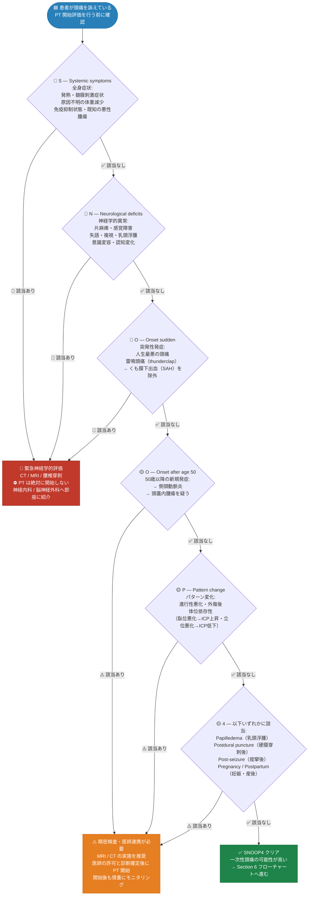
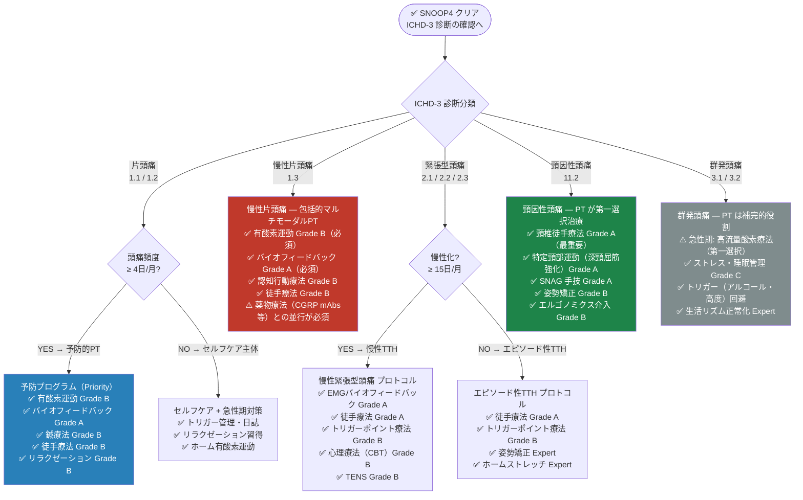
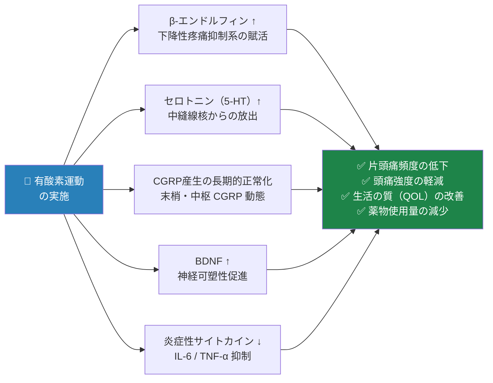
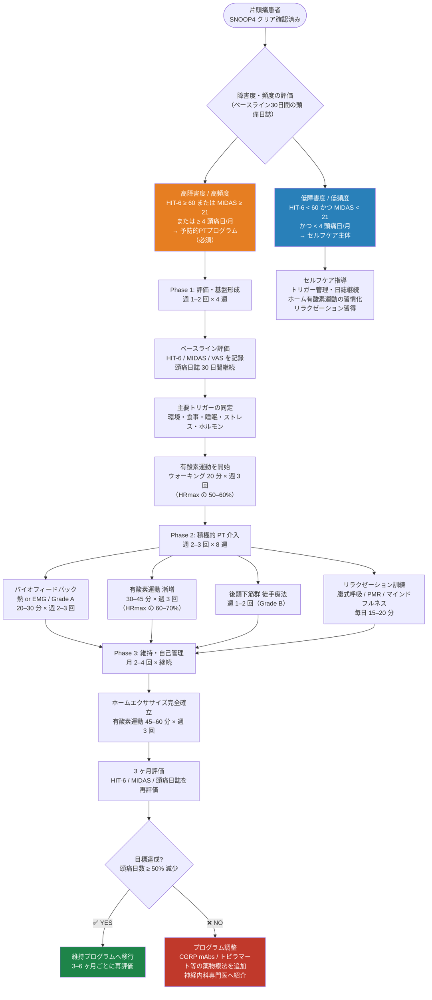
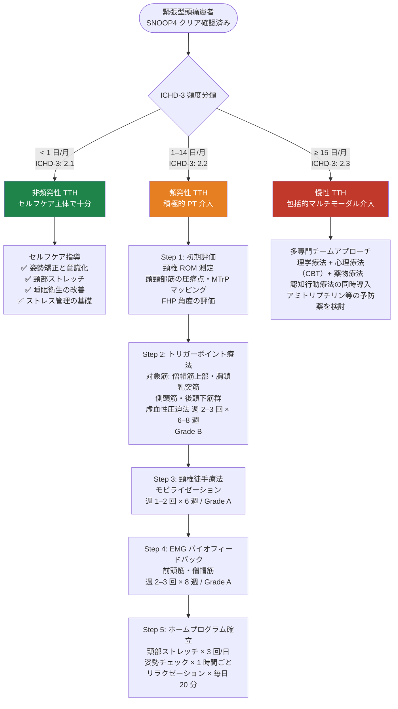
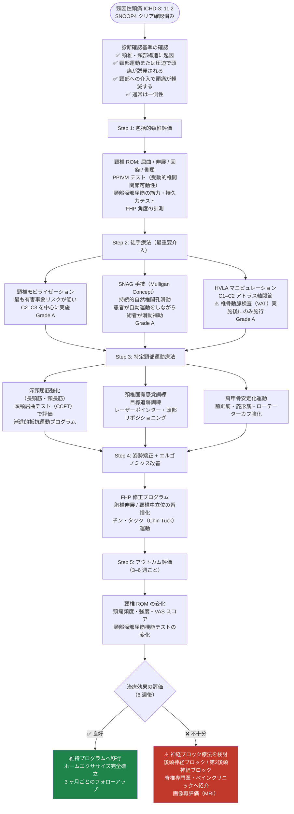
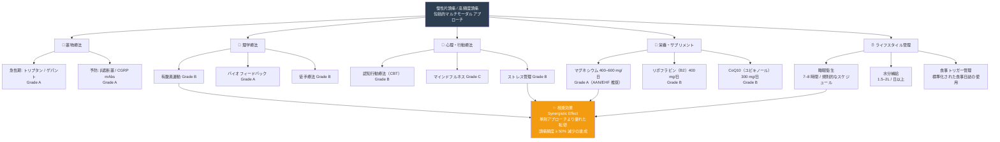

# 頭痛に対する理学療法

## エビデンスに基づく包括的臨床ガイド

### Evidence-Based Comprehensive Guide to Physical Therapy for Headache

**作成観点:** World-Class Medical Researcher & Neuroscientist Perspective  
**対象:** 医療従事者・理学療法士・医学生・研究者  
**エビデンス基準:** AAN / EHF / IHS 2024 / NICE CG150 / Cochrane Library  
**参照診断基準:** ICHD-3（IHS 2018）/ ICHD-4 Work in Progress 2024  
**言語:** 日本語（医学英語注記付き）

---

> ⚠️ **Academic Disclaimer — 学術免責事項（必読）**
>
> 本資料は **学術・教育・研究目的のみ** に作成されています。  
> すべての臨床的判断・治療介入は **資格を有する医療専門家** による評価・監督のもとで実施してください。  
> 本資料は個人への医療アドバイス・診断・処方を提供するものでは **ありません**。  
> 個人の症状に関するご相談は、必ず専門医にご相談ください。

---

## 📋 目次

| # | セクション |
|---|------------|
| 1 | はじめに — なぜ頭痛に理学療法が必要か |
| 2 | 頭痛の分類と理学療法の適応（ICHD-3） |
| 3 | 病態生理学的根拠 — なぜ理学療法は効くのか |
| 4 | 赤旗症状スクリーニング（SNOOP4）— 最優先確認事項 |
| 5 | エビデンス評価システム（AAN/EHF 標準） |
| 6 | 頭痛タイプ別 理学療法 適応フローチャート |
| 7 | 主要理学療法モダリティ 詳細解説 |
| 8 | ステップバイステップ 臨床プロトコル（頭痛タイプ別） |
| 9 | 全モダリティ エビデンスサマリー比較表 |
| 10 | 特殊集団への適用 |
| 11 | マルチモーダル統合アプローチ |
| 12 | アウトカム評価ツール |
| 13 | 患者教育・セルフケアプログラム |
| 14 | 禁忌・注意事項・安全管理 |
| 15 | 参考文献・エビデンスソース一覧 |

---

## 1. はじめに — なぜ頭痛に理学療法が必要か

### 1.1 頭痛の世界的疾病負担

頭痛は世界で最も有病率の高い神経疾患の一つです。

| 疫学指標 | データ | 出典 |
|---------|--------|------|
| 成人の頭痛有病率（過去1年） | 約52% | WHO Global Burden |
| 片頭痛の生涯有病率 | 約14–16%（女性：男性 = 3:1）| GBD 2019 |
| 慢性頭痛（≥15日/月）の有病率 | 成人の約1.7–4% | Stovner et al., 2007 |
| 疾病負担ランキング（世界・YLD） | **第2位**（生活機能障害年数）| GBD 2019 |
| 経済的損失（米国のみ） | 年間約360億ドル（労働損失）| Lipton et al. |

> 📌 **出典:** WHO Headache Disorders Fact Sheet  
> https://www.who.int/news-room/fact-sheets/detail/headache-disorders

### 1.2 薬物療法だけでは不十分な理由

現代の頭痛管理において、薬物単独アプローチには以下の構造的限界があります。

| 限界 | 内容 |
|------|------|
| 薬物過用性頭痛（MOH）リスク | 急性期薬を月8–10日以上使用で慢性化（ICHD-3: 8.2）|
| 副作用・禁忌 | 妊娠・心血管疾患・腎疾患で薬物選択が制限 |
| 奏効率の上限 | トリプタンでも2時間以内の頭痛消失は約60–70% |
| 慢性化予防の限界 | 薬物のみでは神経感作（central sensitization）に十分に対処できない |
| QOL包括的改善の困難 | 睡眠・ストレス・姿勢・体力など生活習慣全体への介入が薬物では不可能 |

理学療法は、これらの限界を補完する **非薬物療法の中核** として国際的に位置づけられています。

### 1.3 本ガイドの読み進め方

```
🔴 Step 1 → Section 4（SNOOP4）で神経学的緊急事態を最初に除外
🟡 Step 2 → Section 2 でICHD-3 頭痛タイプを分類
🟢 Step 3 → Section 6 のフローチャートで理学療法の適応を判断
🔵 Step 4 → Section 7–8 で具体的プロトコルを選択・実施
⚪ Step 5 → Section 12 で定期的なアウトカム評価を実施（3ヶ月ごと）
```

---

## 2. 頭痛の分類と理学療法の適応（ICHD-3）

### 2.1 ICHD-3 主要分類と理学療法適応性

| ICHD-3 コード | 頭痛タイプ | PT 適応度 | 推奨グレード | 備考 |
|:---:|-----------|:---:|:---:|------|
| 1.1 | 片頭痛（前兆なし）| ✅ 高 | Grade B | 予防的PT が中核 |
| 1.2 | 片頭痛（前兆あり）| ✅ 高 | Grade B | 前兆中の強度運動は禁忌 |
| 1.3 | 慢性片頭痛 | ✅ 最高 | Grade A/B | 薬物療法との並行が必須 |
| 2.1 | 非頻発性緊張型頭痛 | ✅ 高 | Grade A | セルフケアが主 |
| 2.2 | 頻発性緊張型頭痛 | ✅ 非常に高 | Grade A | 積極的PT 介入 |
| 2.3 | 慢性緊張型頭痛 | ✅ 非常に高 | Grade A | マルチモーダル必須 |
| 3.1 | 群発頭痛（エピソード型）| ⚠️ 補完的 | Grade C | 急性期は高流量O₂が第一 |
| 11.2 | 頸因性頭痛 | ✅ 最優先 | **Grade A** | PT が第一選択治療 |
| 8.2 | 薬物過用性頭痛（MOH）| ✅ 中断支援 | Grade B | 過用中断の補助として |

> 📌 **出典:** ICHD-3 公式サイト（全文閲覧可）  
> https://ichd-3.org/  
> ICHD-3 全文 PDF（2018年版）  
> https://ichd-3.org/wp-content/uploads/2018/01/The-International-Classification-of-Headache-Disorders-3rd-Edition-2018.pdf

### 2.2 一次性頭痛 vs 二次性頭痛の鑑別

理学療法開始前に、 **一次性頭痛**（脳器質的病変なし）か **二次性頭痛**（基礎疾患起因）かを必ず鑑別してください。

| 区分 | 代表疾患 | 理学療法の役割 |
|------|---------|--------------|
| **一次性頭痛** | 片頭痛・緊張型頭痛・群発頭痛 | **主要治療手段**として積極的に活用 |
| **二次性頭痛** | くも膜下出血・脳腫瘍・感染症・静脈洞血栓症 | ⛔ 原因疾患の治療が最優先；PT は補完的かつ医師指示下のみ |

---

## 3. 病態生理学的根拠 — なぜ理学療法は効くのか

### 3.1 三叉神経頸部複合体（Trigeminocervical Complex: TCC）

頭痛と頸部は密接に神経学的につながっています。これが理学療法の最も重要な科学的根拠です。

**Key Concept: 三叉神経頸部複合体とは？**

上位頸髄（C1–C3）後角ニューロンと三叉神経脊髄路核（Nucleus caudalis）は **解剖学的・機能的に収束（convergence）** しています。

この収束メカニズムにより：
- 頸椎・頸部筋・関節の痛み信号が脳によって「頭痛」として認識される（→ 頸因性頭痛の発生機序）
- 片頭痛発作中に頸部硬直・圧痛が生じる（頸部 ↔ 三叉神経系の双方向性）
- 頸部への理学療法が三叉神経系を介して頭痛を軽減できる

### 3.2 中枢感作と末梢感作

慢性頭痛・慢性片頭痛では、神経系が過敏化（感作）した状態にあり、これが理学療法の介入標的となります。

| 感作レベル | 病態 | 理学療法の介入ポイント |
|-----------|------|---------------------|
| **中枢感作** | 疼痛閾値の低下・アロディニア・時間的加重 | バイオフィードバック / 有酸素運動（内因性オピオイド放出）/ CBT |
| **末梢感作** | 硬膜・頭頸部筋のCGRP放出・神経原性炎症 | 徒手療法 / トリガーポイント療法 |
| **筋筋膜トリガーポイント** | 頭頸部筋の局所過緊張帯（Hyperirritable spot）| トリガーポイント療法 / ドライニードリング |
| **自律神経失調** | 交感神経過活動・副交感神経機能低下 | 呼吸法 / HRVバイオフィードバック / リラクゼーション |

> 📌 **出典:** Bendtsen L. "Central sensitization in tension-type headache: possible pathophysiological mechanisms." *Cephalalgia*, 2000; 20: 486–508.  
> https://journals.sagepub.com/doi/10.1046/j.1468-2982.2000.00053.x

### 3.3 内因性疼痛抑制系の活性化

理学療法（特に有酸素運動）は、脳内の **内因性疼痛抑制メカニズム** を活性化します。

| 神経生物学的変化 | メカニズム | 頭痛への効果 |
|----------------|-----------|-----------|
| β-エンドルフィン↑ | 下降性疼痛抑制系（PAG → 延髄）の賦活 | 鎮痛閾値の上昇 |
| セロトニン（5-HT）↑ | 中縫線核からの放出促進 | 片頭痛の発作頻度低下 |
| BDNF（脳由来神経栄養因子）↑ | 神経可塑性の促進・慢性痛回路の再編 | 中枢感作の軽減 |
| CGRP産生の長期的調節 | 運動による末梢・中枢CGRP動態の正常化 | 片頭痛頻度・強度の低下 |
| 炎症性サイトカイン↓ | IL-6・TNF-α の産生抑制 | 神経炎症の軽減 |

---

## 4. 赤旗症状スクリーニング（SNOOP4）— 最優先確認事項

> **⛔ 絶対原則:** 理学療法を開始する前に、必ず SNOOP4 基準を確認してください。  
> 赤旗症状が陽性の場合は、**緊急神経学的評価**（CT/MRI/腰椎穿刺）を優先し、PT の開始を延期します。



> 📌 **出典:** Dodick DW. "Pearls: Headache." *Seminars in Neurology*, 2010.  
> NICE Headache Guidelines CG150: https://www.nice.org.uk/guidance/cg150  
> AAN Headache Guidelines: https://www.aan.com/guidelines/

---

## 5. エビデンス評価システム（AAN/EHF 標準）

本ガイドのすべての推奨は、以下の国際標準グレードで分類されています。

### 推奨グレード

| グレード | 基準 | 臨床的意義 |
|:---:|------|-----------|
| **Grade A** | ≥2件の一致した Class I RCT / 低異質性Cochrane SR | **強く推奨** — 実施すべきエビデンスが確立 |
| **Grade B** | 1件の Class I RCT または ≥2件の Class II 研究 | **推奨** — 有効である可能性が高い |
| **Grade C** | 1件の Class II または ≥2件の Class III 研究 | **考慮可能** — 有効である可能性がある |
| **Grade U** | 不十分・相反するエビデンス | **推奨不可** — 現時点では判断困難 |
| **Expert Opinion** | RCTなし・ガイドラインコンセンサスのみ | **専門家合意** — 臨床経験に基づく |

### 研究クラス定義

| クラス | 定義 |
|:---:|------|
| Class I | 適切にマスクされた（盲検化された）高質なRCT |
| Class II | コホート研究・非盲検RCT・症例対照研究（質の高いもの）|
| Class III | ケースコントロール・症例シリーズ |
| Class IV | 専門家意見・ケースレポート・生理学的研究 |

> 📌 **出典:** AAN Clinical Practice Guideline Process Manual  
> https://www.aan.com/Guidelines/Home/Development

---

## 6. 頭痛タイプ別 理学療法 適応フローチャート



---

## 7. 主要理学療法モダリティ 詳細解説

### 7-1. 徒手療法（Manual Therapy）

#### 概要と作用機序

徒手療法は、理学療法士・整骨医が手技によって頸椎・頭蓋周囲構造・軟組織に直接介入する方法です。

**主要手技の種類と特性:**

| 手技名 | 対象部位 | 作用機序 | 主な適応頭痛 | エビデンスグレード |
|--------|---------|---------|-----------|:---:|
| 頸椎モビライゼーション（Mobilization） | C1–C7 関節 | 関節受容器賦活・疼痛抑制 | 頸因性・TTH・片頭痛 | Grade A/B |
| 高速低振幅テクニック（HVLA） | C1/C2 環軸関節 | 急速伸張による筋緊張緩和・オピオイド放出 | 頸因性頭痛 | Grade A |
| 後頭下筋群抑制手技 | 後頭骨–環椎（C0–C1）| 副交感神経賦活・局所虚血解除 | 片頭痛・TTH | Grade B |
| SNAG（持続的自然椎間孔滑動） | 頸椎各レベル | 動的関節内圧変化・疼痛抑制 | 頸因性頭痛 | Grade A |
| 筋エネルギー技法（MET） | 頸椎・胸椎 | 交互抑制・相互抑制による筋緊張低下 | TTH・頸因性 | Grade C |
| 頭蓋仙骨療法（CST） | 頭蓋縫合・仙骨 | ⚠️ 機序未確立 | 一部症例 | **Grade U** |

#### ステップバイステップ: 後頭下筋群抑制手技（Suboccipital Inhibition）

```
初学者向け手順解説:

Step 1: 患者を仰臥位（仰向け）に配置 / リラックスした状態を確認
Step 2: 術者は患者の頭側に座り、両手第2–4指を後頭骨下縁に配置
Step 3: C1–C2 後弓に向けて指の腹で垂直方向に軽く圧迫（5–8N 程度）
Step 4: 「組織が緩むのを待つ」感覚で 4–8 分間保持（強制しない）
Step 5: 徐々に圧力を解放し、患者の頸部 ROM と圧痛を再評価
Step 6: 週 1–2 回 × 6–8 週のコースで実施
```

> 📌 **主要エビデンス:** Fernández-de-Las-Peñas C, et al. "The immediate effect of ischemic compression technique and transverse friction massage on tenderness of active and latent myofascial trigger points." *J Bodyw Mov Ther*, 2006.  
> https://pubmed.ncbi.nlm.nih.gov/16533614/  
>
> **Cochrane Review（頸椎徒手療法）:** Gross A, et al. *Cochrane Database Syst Rev*, 2015.  
> https://www.cochranelibrary.com/cdsr/doi/10.1002/14651858.CD004249.pub4

---

### 7-2. 有酸素運動療法（Aerobic Exercise Therapy）

#### なぜ有酸素運動が頭痛に効くのか — 神経生物学的機序



#### 国際標準 推奨プロトコル（AAN/EHF 準拠）

| パラメータ | 推奨値 | 根拠 |
|-----------|-------|------|
| 頻度 | 週 3 回 | Varkey et al., 2011 RCT |
| 強度 | 最大心拍数（HRmax）の 60–80%（中等度）| 低強度では効果不十分 |
| 時間 | 45–60 分/セッション（有酸素フェーズ最低 30 分）| Cochrane SR |
| 種類 | 自転車エルゴメータ・ウォーキング・水泳を優先 | 頭部への振動が少ない種目 |
| 継続期間 | **最低 12 週間**（効果発現に 8–12 週を要する）| Varkey et al., 2011 |
| 開始前 | 安静時心電図・内科的リスク評価 | AHA 運動ガイドライン |

#### 最大心拍数（HRmax）の計算

```
HRmax（推定）= 220 − 年齢（歳）

例: 35 歳の場合
HRmax = 220 − 35 = 185 bpm
60% zone : 111 bpm  ← 開始期（適応）
70% zone : 130 bpm  ← 維持期（標準）
80% zone : 148 bpm  ← 上限（慣れた患者）
```

#### 12 週間段階的プログラム

| フェーズ | 週数 | 内容 | 目標 HRmax |
|:---:|------|------|:---:|
| **適応期** | 1–3 週 | ウォーキング 20 分 × 週 3 回 | 50–60% |
| **漸増期** | 4–8 週 | 有酸素運動 30–45 分 × 週 3 回 | 60–70% |
| **維持期** | 9–12 週以降 | 有酸素運動 45–60 分 × 週 3 回 | 70–80% |

> 📌 **主要 RCT:** Varkey E, et al. "Exercise as migraine prophylaxis: a randomized study using relaxation and topiramate as controls." *Cephalalgia*, 2011.  
> https://journals.sagepub.com/doi/10.1177/0333102411412385  
>
> Darabaneanu S, et al. "Aerobic exercise as a therapy option for migraine." *Int J Sports Med*, 2011.  
> https://pubmed.ncbi.nlm.nih.gov/21328195/

---

### 7-3. バイオフィードバック（Biofeedback）

#### バイオフィードバックとは？（初学者向け）

バイオフィードバックとは、通常意識できない体の生理的信号をリアルタイムで視覚化・聴覚化し、それを意識的にコントロールする訓練法です。

```
体の生理信号（筋電図・皮膚温・心拍変動）
         ↓ センサーで計測
  モニター / 音でリアルタイム表示
         ↓ 患者が意識的に調整
 自律神経・筋緊張の自己制御能力が向上
         ↓ 繰り返し訓練
  ストレス反応・筋緊張・血管収縮の低下 → 頭痛軽減
```

#### 主要な種類と適応

| 種類 | 計測パラメータ | 主な適応 | エビデンスグレード |
|------|-------------|---------|:---:|
| **EMG バイオフィードバック** | 前頭筋・僧帽筋の筋電図 | 緊張型頭痛（第一選択）| **Grade A** |
| **熱（皮膚温）バイオフィードバック** | 指先皮膚温（自律神経機能）| 片頭痛 | **Grade A** |
| **HRV バイオフィードバック** | 心拍変動（迷走神経機能）| 慢性頭痛・片頭痛 | **Grade B** |
| **EEG ニューロフィードバック** | α/θ 波パターン | 慢性頭痛（一部）| **Grade C** |

#### ステップバイステップ: EMG バイオフィードバック セッション手順

```
Step 1: 評価
        電極を前頭筋（Fp1-Fp2）または僧帽筋上部に装着
        安静時のベースライン筋電図を 3 分間記録（μV 単位）

Step 2: フィードバック開始
        音または数値としてリアルタイム提示
        目標: 音が低くなる（= 筋緊張が下がる）方向へ自発的に調整

Step 3: 技法の組み合わせ
        腹式呼吸（4-7-8 法）と同時に実施
        視覚化（暖かく穏やかな場面を想像）を組み合わせる

Step 4: セッション管理
        1 セッション: 20–30 分
        頻度: 週 2–3 回 × 8–12 週

Step 5: ホームプラクティスへの移行
        携帯型 EMG デバイス（Muse, MyoWave 等）を使用
        毎日 15–20 分の自主練習を推奨
```

> 📌 **主要メタ解析:** Nestoriuc Y & Martin A. "Efficacy of biofeedback for migraine: a meta-analysis." *Pain*, 2007.  
> https://pubmed.ncbi.nlm.nih.gov/17097218/  
>
> Nestoriuc Y, Rief W & Martin A. "Meta-analysis of biofeedback for tension-type headache." *J Consult Clin Psychol*, 2008; 76: 379–396.  
> https://pubmed.ncbi.nlm.nih.gov/18426234/  
>
> **AAN 2012 ガイドライン（行動・理学療法）:**  
> https://www.aan.com/guidelines/home/getguidelinecontent/383  
>
> **Cochrane Review（CBT/バイオフィードバック — 片頭痛）:**  
> https://www.cochranelibrary.com/cdsr/doi/10.1002/14651858.CD012295.pub2

---

### 7-4. 経皮的電気神経刺激（TENS / Cefaly Device）

#### TENS の作用機序

| 機序 | 内容 |
|------|------|
| **ゲートコントロール理論** | Aβ繊維の刺激が脊髄後角で痛み信号（Aδ/C 繊維）の伝達をブロック |
| **内因性オピオイド放出** | 長時間刺激でβ-エンドルフィン・エンケファリンの産生増加 |
| **三叉神経調節（Cefaly）** | 眼窩上神経（V1）の経皮的脱感作 → 三叉神経系の過活動を抑制 |

#### Cefaly Device（眼窩上 TENS / FDA 承認デバイス）

| 項目 | 内容 |
|------|------|
| FDA 承認年 | 2014年（急性期治療）/ 2020年（予防）|
| 電極位置 | 前額部中央（眼窩上神経 / 三叉神経第1枝）|
| 急性期使用 | 60 分/回（発作時）|
| 予防的使用 | 20 分/日（毎日）|
| エビデンス | **Grade B**（予防）/ **Grade B**（急性）|
| 利点 | 副作用なし・在宅使用可能・MOH リスクゼロ |
| 費用 | 一般的な予防薬と比較して費用対効果が高い場合あり |

> 📌 **主要 RCT:** Schoenen J, et al. "Migraine prevention with a supraorbital transcutaneous stimulator: a randomized controlled trial." *Neurology*, 2013.  
> https://pubmed.ncbi.nlm.nih.gov/23401045/  
>
> FDA 医療機器データベース: https://www.fda.gov/medical-devices

---

### 7-5. 鍼療法（Acupuncture）

#### 神経生物学的作用機序

鍼療法は東洋医学の枠を超えた科学的機序が解明されています。

| 作用レベル | 機序 |
|-----------|------|
| 局所 | 筋膜刺激 → ATP/アデノシン放出 → 局所 A1 受容体賦活 → 鎮痛 |
| 脊髄 | エンケファリン・ダイノルフィン放出 → ゲートコントロール |
| 脳幹 | PAG（中脳水道周囲灰白質）の下降性疼痛抑制系賦活 |
| 視床下部 | セロトニン・β-エンドルフィン放出 → 全身性鎮痛 |

#### Cochrane エビデンスと推奨

Cochrane Library の最新レビュー（Linde et al., 2016）では以下が報告されています：

- 鍼療法は片頭痛の予防において、予防薬（プロプラノロールまたはトピラマート）と **同等以上の効果** を示した
- 真の鍼療法は「偽鍼」より有意に優れていた

| 対象頭痛 | エビデンスグレード | NNT | 主要研究 |
|---------|:---:|:---:|---------|
| 片頭痛（予防） | **Grade B** | 約5 | Linde et al., Cochrane 2016 |
| 緊張型頭痛（予防） | **Grade B** | 約6 | Linde et al., Cochrane 2016 |
| 慢性頭痛（統合解析） | **Grade B** | — | Acupuncture Trialists' Collaboration, 2017 |

#### 標準的プロトコル（片頭痛予防）

| パラメータ | 推奨値 |
|-----------|-------|
| 頻度 | 週 1–2 回（急性コース）/ 月 1–2 回（維持期）|
| セッション数 | 急性コース: 合計 10–12 セッション |
| 主要ツボ（例） | GB20（風池）/ GV20（百会）/ ST36（足三里）/ LI4（合谷）|

> 📌 **Cochrane Review:** Linde K, et al. "Acupuncture for the prevention of episodic migraine." *Cochrane Database Syst Rev*, 2016.  
> https://www.cochranelibrary.com/cdsr/doi/10.1002/14651858.CD001218.pub3  
>
> Linde K, et al. "Acupuncture for the prevention of tension-type headache." *Cochrane Database Syst Rev*, 2016.  
> https://www.cochranelibrary.com/cdsr/doi/10.1002/14651858.CD007587.pub2

---

### 7-6. 筋筋膜トリガーポイント療法（Myofascial Trigger Point Therapy）

#### トリガーポイントとは？

**筋筋膜トリガーポイント（MTrP: Myofascial Trigger Point）** とは、骨格筋の筋束内に存在する過敏な局所収縮帯（hyperirritable spot）です。  
頭痛患者では特定の頭頸部筋に活性型 MTrP が集中します（Fernández-de-Las-Peñas et al., 2007）。

#### 頭痛に関与する主要筋肉と関連痛パターン

| 筋肉 | 関連する頭痛タイプ | 典型的な関連痛パターン |
|------|-----------|-------------------|
| 僧帽筋上部（Upper Trapezius） | TTH・片頭痛 | こめかみ・側頭部 |
| 胸鎖乳突筋（SCM）| TTH・頸因性 | 前頭部・眼窩周囲・耳後 |
| 後頭下筋群（Suboccipital Group） | 片頭痛・頸因性 | 後頭部→頭頂部→前頭部 |
| 咬筋（Masseter）| TTH（顎関節関連）| 頬骨弓・こめかみ |
| 側頭筋（Temporalis）| TTH | 側頭部・歯痛様 |
| 斜角筋群（Scaleni） | 頸因性 | 後頭部・肩甲骨間 |

#### 治療手技の種類と特性

| 手技 | 内容 | エビデンスグレード |
|------|------|:---:|
| 虚血性圧迫法（Ischemic Compression） | 指でトリガーポイントを30–90秒間持続圧迫 | **Grade B** |
| 横断的摩擦マッサージ | 筋繊維に直交する方向で摩擦刺激 | **Grade C** |
| ドライニードリング（Dry Needling） | 鍼でトリガーポイントを刺激（局所攣縮反応 LTR の誘発）| **Grade B** |
| スプレー＆ストレッチ | 寒冷スプレー（エチルクロライド）後に筋肉を伸張 | **Grade C** |

> 📌 **主要出典:** Fernández-de-Las-Peñas C, et al. "Myofascial trigger points and their relationship to headache clinical parameters in chronic tension-type headache." *Headache*, 2006; 46: 1264–1272.  
> https://pubmed.ncbi.nlm.nih.gov/16942467/  
>
> Fernández-de-Las-Peñas C, et al. "Myofascial trigger points and sensitization: An updated pain model for tension-type headache." *Cephalalgia*, 2007; 27: 383–393.  
> https://pubmed.ncbi.nlm.nih.gov/17359516/

---

### 7-7. 姿勢矯正・エルゴノミクス（Postural Correction & Ergonomics）

#### 前方頭位姿勢（Forward Head Posture: FHP）と頭痛

FHP は頭痛の重要な修飾因子です。

```
頭部が 1 cm 前方にずれるごとに
 → 頸椎にかかる有効負荷が約 2.2 kg 増加

通常の頭部重量 ≒ 5 kg
スマートフォンを見る際（45° 前屈）の有効負荷 ≒ 22 kg(!)
```

この慢性的な過負荷が後頭下筋・僧帽筋の筋緊張亢進・頸椎関節のストレス・TCC 感作促進を引き起こし、頭痛の頻度・強度を増悪させます。

#### ワークステーション評価チェックリスト

| 評価項目 | 推奨設定 |
|---------|---------|
| モニター高さ | 視線より僅かに下（視線 5–15° 下向き）|
| モニター距離 | 50–70 cm（腕を伸ばした距離）|
| 椅子の高さ | 膝 90°・大腿が水平・足底が床に接地 |
| キーボード位置 | 肘が 90–110° に屈曲する高さ |
| 頸部中立位 | 耳孔が肩峰の直上になるよう |
| スマートフォン | 視線の高さに近づける（うつむき姿勢を回避）|
| 定期的な休憩 | 30–60 分ごとに立位・頸部ストレッチ |

---

### 7-8. 温熱・寒冷療法（Thermal Therapy）

| 種類 | 適応 | 方法 | エビデンスグレード |
|------|------|------|:---:|
| **温熱（Thermotherapy）** | 筋緊張性頭痛・TTH | 頸部後面に温湿布 15–20 分 | **Grade C** / Expert |
| **寒冷（Cryotherapy）** | 片頭痛急性期 | 側頭部・頸部に ice pack 10–15 分 | **Grade C** |
| **温冷交互浴** | 頸部循環改善 | 3 分温 → 1 分冷 × 3 サイクル | Expert |

> ⚠️ **注意:** 急性炎症期・皮膚感覚障害・末梢循環障害がある場合は禁忌

---

## 8. ステップバイステップ 臨床プロトコル（頭痛タイプ別）

### 8-1. 片頭痛（ICHD-3: 1.1 / 1.2）理学療法プロトコル



**片頭痛 PT プログラム 週次スケジュール例（Phase 2）:**

| 曜日 | 内容 | 時間（目安）|
|------|------|:---:|
| 月 | 有酸素運動（自転車エルゴメータまたはウォーキング）| 45 分 |
| 火 | バイオフィードバック（クリニック）+ 頸部徒手療法 | 60 分 |
| 水 | 有酸素運動 | 45 分 |
| 木 | リラクゼーション訓練（腹式呼吸・漸進的筋弛緩法）| 20 分 |
| 金 | バイオフィードバック（クリニックまたはホームデバイス）| 30 分 |
| 土 | 有酸素運動（やや長め）| 60 分 |
| 日 | 休息 + 頭痛日誌の記録・振り返り | — |

---

### 8-2. 緊張型頭痛（ICHD-3: 2.1–2.3）理学療法プロトコル



**緊張型頭痛 ホームストレッチプログラム（毎日実施）:**

| ストレッチ名 | 対象筋 | 方法 | 回数/日 |
|-----------|-------|------|:---:|
| 頸部側屈ストレッチ | 胸鎖乳突筋・斜角筋 | 耳を肩に近づけ 20 秒保持 | 3 回 × 3 セット |
| 頸部前屈ストレッチ | 後頭下筋群 | 顎を胸に近づけ 20 秒保持 | 3 回 × 3 セット |
| 肩甲骨後退運動 | 僧帽筋中部・菱形筋 | 肩甲骨を中央に引き寄せ 10 秒 | 10 回 × 3 セット |
| 胸椎伸展（タオルロール） | 脊柱起立筋・大胸筋 | 胸椎下にタオルを置き仰向けで伸展 | 5 分 |

---

### 8-3. 頸因性頭痛（ICHD-3: 11.2）理学療法プロトコル

> **💡 重要:** 頸因性頭痛において、理学療法は薬物療法と同等以上の主要治療手段です（Jull et al., 2002）。



> 📌 **主要 RCT:** Jull G, et al. "A randomized controlled trial of exercise and manipulative therapy for cervicogenic headache." *Spine*, 2002; 27: 1835–1843.  
> https://pubmed.ncbi.nlm.nih.gov/12529905/

---

## 9. 全モダリティ エビデンスサマリー比較表

| 理学療法モダリティ | 片頭痛 | 緊張型頭痛 | 頸因性頭痛 | 慢性頭痛 | 主要ガイドライン |
|:---|:---:|:---:|:---:|:---:|:---|
| 徒手療法（モビライゼーション）| B | **A** | **A** | B | AAN / EHF / NICE |
| 頸椎マニピュレーション（HVLA）| C | B | **A** | C | Cochrane |
| 有酸素運動療法 | B | B | B | B | AAN 2012 |
| EMG バイオフィードバック | B | **A** | C | B | AAN 2012 |
| 熱バイオフィードバック | **A** | C | U | B | AAN 2012 |
| リラクゼーション療法 | B | B | C | B | AAN 2012 |
| 認知行動療法（CBT）| B | B | C | B | Cochrane |
| 鍼療法 | B | B | C | B | Cochrane |
| TENS（Cefaly 眼窩上）| B | B | U | C | FDA / Schoenen 2013 |
| トリガーポイント療法 | C | B | B | C | PubMed SR |
| ドライニードリング | C | B | B | C | EHF |
| 温熱・寒冷療法 | C | C | C | U | Expert |
| 姿勢矯正・エルゴノミクス | Expert | C | B | Expert | Expert |

> 📌 **一次出典:**  
> AAN 2012: https://www.aan.com/guidelines/  
> EHF ガイドライン: https://www.ncbi.nlm.nih.gov/pmc/articles/PMC9188162/  
> NICE CG150: https://www.nice.org.uk/guidance/cg150  
> Cochrane Library: https://www.cochranelibrary.com/

---

## 10. 特殊集団への適用

### 10.1 小児・思春期（< 18 歳）

| モダリティ | 推奨・注意事項 |
|-----------|-------------|
| 有酸素運動 | ✅ 強く推奨 / 年齢・発達段階に応じて強度・時間を調整 |
| バイオフィードバック | ✅ 非常に有効（Grade A）/ 薬物の代替として優先（10歳以上）|
| 徒手療法 | ⚠️ HVLA は慎重に / モビライゼーションを優先 |
| TENS | ⚠️ 12 歳未満: 安全性データ限定的 / 医師判断のもとで使用 |
| スクリーンタイム管理 | ✅ 重要なトリガー介入（1日2時間以内を推奨）|
| 睡眠衛生 | ✅ 特に重要 / 規則的な就寝・起床時間の確立 |

### 10.2 妊娠・授乳期

| モダリティ | 推奨・注意事項 |
|-----------|-------------|
| 有酸素運動 | ✅ 軽–中等度（ウォーキング・水中運動）/ 産科医と連携のうえ実施 |
| バイオフィードバック | ✅ **第一選択の非薬物療法**として最優先 |
| 徒手療法 | ⚠️ 仰臥位での子宮圧迫を避ける / 腰椎への圧迫は注意 |
| 鍼療法 | ⚠️ 禁忌ツボ（LI4合谷・SP6三陰交）を厳守 / 妊娠経験のある鍼師に依頼 |
| 温熱療法 | ⚠️ 体温上昇（> 38.9°C）を回避 / 全身温浴・サウナは禁忌 |

### 10.3 高齢者（> 65 歳）

| モダリティ | 推奨・注意事項 |
|-----------|-------------|
| 有酸素運動 | ✅ 低強度（HRmax 50–60%）から開始 / 転倒リスク評価を先行実施 |
| 徒手療法 | ⚠️ 骨粗鬆症の評価が必須 / HVLA は原則回避 |
| TENS | ✅ 比較的安全 / ペースメーカー・植込み型医療機器装着者は絶対禁忌 |
| バランス訓練 | ✅ 前庭機能・固有感覚トレーニングを追加 |
| 認知機能評価 | ✅ MoCA 等で評価後にプログラム設定 |

### 10.4 薬物過用性頭痛（MOH: ICHD-3 8.2）からの回復期

| 段階 | PT の役割 | 注意点 |
|------|----------|-------|
| 過用薬物中断期（1–2 週）| ⚠️ 離脱症状（反跳性頭痛）のモニタリング / 支持的ケアのみ | 急性痛の増悪が一時的に起こりうる |
| 回復初期（2–8 週）| ✅ バイオフィードバック・リラクゼーション優先 | 薬物への依存衝動に対する行動支援 |
| 安定期（8 週–）| ✅ 有酸素運動・徒手療法・完全な PT プログラム | 全モダリティの段階的導入 |
| 再発予防（長期）| ✅ 薬物使用日数の継続モニタリング教育 | 頭痛日誌を永続的に継続 |

---

## 11. マルチモーダル統合アプローチ



### 統合アプローチのエビデンス

| 比較 | 効果 | エビデンスグレード |
|------|------|:---:|
| 薬物 + PT vs 薬物単独 | 頭痛頻度 30–40% の追加減少 | Grade B |
| バイオフィードバック + 薬物 vs 薬物単独 | 薬物使用量の有意な減少 | Grade A |
| 有酸素運動 + トピラマート vs 単独 | 同等以上の予防効果・副作用減少 | Grade B |
| CBT + 薬物 vs 薬物単独 | 再発防止・QOL 改善 | Grade B |

> 📌 **出典:** Holroyd KA, et al. "Management of chronic tension-type headache with tricyclic antidepressant medication, stress management therapy, and their combination: A randomized controlled trial." *JAMA*, 2001; 285: 2208–2215.  
> https://pubmed.ncbi.nlm.nih.gov/11325323/

---

## 12. アウトカム評価ツール

### 12.1 主要評価ツール一覧

| ツール | 評価内容 | スコア解釈 | 実施タイミング |
|-------|---------|-----------|-------------|
| **HIT-6**（Headache Impact Test）| 頭痛による日常生活への影響 | ≥ 60: 重篤な障害 / 50–59: 実質的 / 36–49: 中等度 / < 36: 軽微 | 開始時 / 3 ヶ月ごと |
| **MIDAS**（Migraine Disability Assessment）| 仕事・家事・社会活動の損失日数（3ヶ月）| ≥ 21: Grade IV 重篤 / 11–20: Grade III / 6–10: Grade II / 0–5: Grade I | 開始時 / 3 ヶ月ごと |
| **VAS / NRS** | 疼痛強度（0–10）| 0: 無痛 / 1–3: 軽度 / 4–6: 中等度 / 7–10: 重篤 | 毎回の治療前後 |
| **PGIC**（Patient Global Impression of Change）| 患者の全体的改善印象 | 7段階（著明改善 → 著明悪化）| 8 週後 / 治療終了時 |
| **MSQ v2.1**（Migraine-Specific Quality of Life）| 片頭痛特異的 QOL（4 ドメイン）| スコア 0–100（高値 = 良好）| 開始時 / 3 ヶ月ごと |
| **頭痛日誌** | 頻度・強度・持続時間・トリガー・薬物使用 | 月次で集計・グラフ化 | 毎日継続 |

### 12.2 Evidence-Based 治療目標

| 評価指標 | 最低成功基準（MCID）| 優良基準 |
|---------|:-----------:|:-----:|
| 頭痛日数/月 | **≥ 50% 減少** | ≥ 75% 減少 |
| HIT-6 スコア | ≥ 6 点改善（MCID）| < 50 点（正常域）|
| MIDAS スコア | グレード 1 段階以上の改善 | Grade I または II への移行 |
| 薬物使用日数 | MOH 閾値以下（< 8–10 日/月）| ≤ 4 日/月 |
| VAS ピーク強度 | ≥ 30% 低下 | ≥ 50% 低下 |

> 📌 **出典（HIT-6 MCID）:** Kosinski M, et al. *Qual Life Res*, 2003.  
> https://pubmed.ncbi.nlm.nih.gov/12789668/

---

## 13. 患者教育・セルフケアプログラム

### 13.1 頭痛日誌の使い方（ステップガイド）

**なぜ頭痛日誌が重要か:**
- 治療介入前の **30 日間ベースライン** の客観的確立
- 自己申告バイアスを排除した **トリガーパターンの同定**
- 薬物使用日数のリアルタイムモニタリング（**MOH の早期発見**）

**記録すべき情報（1 回の発作あたり）:**

| 記録項目 | 記録内容 |
|---------|---------|
| 発症日時 | 発症時刻・終了時刻・持続時間 |
| 痛みの強度 | VAS / NRS 0–10（発症時・ピーク・2時間後）|
| 痛みの部位 | 左/右/両側/前頭/後頭/こめかみ |
| 痛みの性質 | 拍動性 / 圧迫感 / 刺すような |
| 随伴症状 | 悪心・嘔吐・光過敏・音過敏・前兆（種類と持続）|
| 推定トリガー | 食事・睡眠変化・ストレス・天気・月経 |
| 使用薬物 | 薬剤名・用量・使用時刻・効果（0–10）|
| 日常活動への影響 | 仕事・家事・社会活動の支障度 |

**推奨デジタルツール:**  
- **Migraine Buddy** — 頭痛専用 iOS/Android アプリ  
- **N1-Headache** — 機械学習によるトリガー分析

### 13.2 腹式呼吸法（副交感神経賦活）— 基本手順

腹式呼吸は、迷走神経（副交感神経）を賦活し、頭痛の誘発因子となる交感神経過活動を直接抑制します。

```
【4-7-8 呼吸法】

Step 1: 仰臥位または椅座位でリラックスした姿勢をとる
Step 2: 鼻から 4 秒かけてゆっくり息を吸う（腹部を膨らませる）
Step 3: 息を止めて 7 秒間保持する
Step 4: 口から 8 秒かけてゆっくり息を吐く（腹部をへこませる）
Step 5: これを 1 サイクルとして 4 サイクル繰り返す

推奨: 1 日 2 回（朝 + 就寝前）/ 毎日継続
```

### 13.3 段階的セルフケア（患者向け 5 ステップ）

```
Step 1: 頭痛日誌を開始（最低 30 日間のベースライン収集）
   ↓
Step 2: 主要トリガーを 2–3 個同定し、排除または管理戦略を立てる
   ↓
Step 3: 規則的な睡眠・食事（欠食なし）・水分補給（1.5–2L/日）を確立
   ↓
Step 4: 週 3 回の有酸素運動習慣を構築（ウォーキング 20 分から開始）
   ↓
Step 5: 腹式呼吸・漸進的筋弛緩法（PMR）を毎日 15–20 分実践
```

---

## 14. 禁忌・注意事項・安全管理

### 14.1 頸椎徒手療法（特に HVLA マニピュレーション）の禁忌

| カテゴリ | 具体的禁忌 |
|---------|---------|
| **絶対禁忌** ⛔ | 椎骨動脈解離（VAD）の疑いまたは確定診断 |
| **絶対禁忌** ⛔ | 脊髄症（myelopathy）/ 頸椎骨折・脱臼 |
| **絶対禁忌** ⛔ | 頸椎腫瘍（原発性・転移性）|
| **絶対禁忌** ⛔ | 頸椎手術後早期（術後 3–6 ヶ月 / 医師の許可まで）|
| **相対禁忌** ⚠️ | 重度骨粗鬆症（T スコア < −2.5）|
| **相対禁忌** ⚠️ | リウマチ性関節炎（C1–C2 不安定性）|
| **相対禁忌** ⚠️ | 大量抗凝固薬使用 / 凝固障害 |
| **要確認** | 椎骨動脈検査（VAT）を HVLA 前に必ず実施 |

> ⚠️ **頸椎マニピュレーションと脳卒中リスク:**  
> HVLA 後の椎骨動脈解離（VAD）は稀ですが報告されています（推定頻度: 1/100万回）。  
> リスク最小化のため HVLA 前に必ず **椎骨動脈スクリーニングテスト** を実施してください。

### 14.2 有酸素運動の禁忌・注意事項

| 状態 | 対応 |
|------|------|
| 急性片頭痛発作中 | ⚠️ 激しい運動は症状悪化の可能性 / 軽歩行は許容 |
| 未治療・管理不十分な心血管疾患 | ⛔ 循環器内科の評価・許可を得てから開始 |
| 重篤な貧血（Hb < 8 g/dL）| ⚠️ 貧血自体が頭痛の原因となりうる / 補正後に開始 |
| 重篤な起立性低血圧 | ⚠️ 段階的な強度増加・監視下での実施 |

### 14.3 TENS の禁忌

| 禁忌 | 内容 |
|------|------|
| 心臓ペースメーカー装着 | 電気干渉による誤作動リスク |
| 妊娠（腹部・腰部への使用）| 子宮収縮誘発の懸念 |
| 皮膚感覚障害部位への貼付 | 熱傷・電気損傷リスク |
| 活動性皮膚炎・皮膚病変部 | 電極貼付不可 |
| てんかん（頭部近傍への使用）| 発作誘発リスク |

---

## 15. 参考文献・エビデンスソース一覧

### 15.1 国際診断基準

| リソース | URL |
|---------|-----|
| ICHD-3 公式サイト（全文閲覧可）| https://ichd-3.org/ |
| ICHD-3 全文 PDF（2018年版）| https://ichd-3.org/wp-content/uploads/2018/01/The-International-Classification-of-Headache-Disorders-3rd-Edition-2018.pdf |
| IHS 分類委員会（ICHD-4 最新動向含む）| https://ihs-headache.org/en/about-ihs/standing-committees/classification/ |

### 15.2 臨床ガイドライン

| 機関 | リソース | URL |
|------|---------|-----|
| AAN | ガイドライン一覧（頭痛）| https://www.aan.com/guidelines/ |
| AAN | 片頭痛予防ガイドライン（PDF）| https://www.aan.com/guidelines/home/getguidelinecontent/545 |
| AAN | 行動・理学療法ガイドライン（2012）| https://www.aan.com/guidelines/home/getguidelinecontent/383 |
| AAN | 2024 予防療法ドラフト（最新公開版）| https://www.aan.com/siteassets/home-page/policy-and-guidelines/guidelines/guidelines-and-measures-open-for-public-comment/24-pharmacologic-treatment-for-migraine-prevention-in-adults_draft_08-14-2024.pdf |
| EHF | CGRP mAbs 予防療法ガイドライン 2022 | https://www.ncbi.nlm.nih.gov/pmc/articles/PMC9188162/ |
| EHF | トリプタン治療コンセンサス 2022 | https://link.springer.com/article/10.1186/s10194-022-01502-z |
| NICE | 頭痛ガイドライン CG150（英国）| https://www.nice.org.uk/guidance/cg150 |
| IHS | 急性期治療推奨 2024（Cephalalgia 誌）| https://journals.sagepub.com/doi/10.1177/03331024241252666 |

### 15.3 Cochrane エビデンスレビュー

| トピック | URL |
|---------|-----|
| 鍼療法 — 片頭痛予防（Linde et al., 2016）| https://www.cochranelibrary.com/cdsr/doi/10.1002/14651858.CD001218.pub3 |
| 鍼療法 — 緊張型頭痛予防（Linde et al., 2016）| https://www.cochranelibrary.com/cdsr/doi/10.1002/14651858.CD007587.pub2 |
| 心理療法（CBT/バイオフィードバック）— 片頭痛予防 | https://www.cochranelibrary.com/cdsr/doi/10.1002/14651858.CD012295.pub2 |
| マグネシウム補充 — 片頭痛予防（2025 年最新）| https://www.cochranelibrary.com/cdsr/doi/10.1002/14651858.CD016307 |
| ボツリヌストキシン — 慢性片頭痛予防 | https://www.cochranelibrary.com/cdsr/doi/10.1002/14651858.CD011914 |
| 頸椎徒手療法 — 頸痛・関連頭痛（Gross et al.）| https://www.cochranelibrary.com/cdsr/doi/10.1002/14651858.CD004249.pub4 |
| 頭痛・片頭痛 全レビュー検索 | https://www.cochranelibrary.com/search?query=headache+migraine&searchBy=3&type=cdsr |

### 15.4 主要原著論文（PubMed）

| 著者・年 | タイトル要旨 | URL |
|---------|-----------|-----|
| Jull G, et al. 2002 | 頸因性頭痛への徒手療法 + 運動療法 RCT（*Spine*）| https://pubmed.ncbi.nlm.nih.gov/12529905/ |
| Varkey E, et al. 2011 | 有酸素運動 vs トピラマート vs リラクゼーション RCT（*Cephalalgia*）| https://journals.sagepub.com/doi/10.1177/0333102411412385 |
| Nestoriuc Y & Martin A, 2007 | バイオフィードバック — 片頭痛メタ解析（*Pain*）| https://pubmed.ncbi.nlm.nih.gov/17097218/ |
| Nestoriuc Y, Rief W & Martin A, 2008 | バイオフィードバック — 緊張型頭痛メタ解析（*J Consult Clin Psychol*）| https://pubmed.ncbi.nlm.nih.gov/18426234/ |
| Darabaneanu S, et al. 2011 | 有酸素運動と片頭痛（*Int J Sports Med*）| https://pubmed.ncbi.nlm.nih.gov/21328195/ |
| Schoenen J, et al. 2013 | Cefaly TENS — 片頭痛予防 RCT（*Neurology*）| https://pubmed.ncbi.nlm.nih.gov/23401045/ |
| Fernández-de-Las-Peñas C, et al. 2006 | 後頭下筋群手技の即時効果（*J Bodyw Mov Ther*）| https://pubmed.ncbi.nlm.nih.gov/16533614/ |
| Fernández-de-Las-Peñas C, et al. 2007 | MTrP と中枢感作 — TTH の統合疼痛モデル（*Cephalalgia*）| https://pubmed.ncbi.nlm.nih.gov/17359516/ |
| Bendtsen L, 2000 | 慢性 TTH における中枢感作（*Cephalalgia*）| https://journals.sagepub.com/doi/10.1046/j.1468-2982.2000.00053.x |
| Holroyd KA, et al. 2001 | 慢性 TTH — 三環系 + ストレス管理 + 組み合わせ RCT（*JAMA*）| https://pubmed.ncbi.nlm.nih.gov/11325323/ |
| Kosinski M, et al. 2003 | HIT-6 の MCID 検証（*Qual Life Res*）| https://pubmed.ncbi.nlm.nih.gov/12789668/ |

### 15.5 継続リサーチ用データベース

| 名称 | 用途 | URL |
|------|------|-----|
| Journal of Headache and Pain（EHF 公式誌・OA）| 最新 EHF 研究・ガイドライン更新 | https://thejournalofheadacheandpain.biomedcentral.com/ |
| Cephalalgia（IHS 公式誌）| ICHD 改訂・主要臨床試験 | https://journals.sagepub.com/home/cep |
| PubMed 頭痛 RCT 専用検索 | 個別療法の最新エビデンス確認 | https://pubmed.ncbi.nlm.nih.gov/?term=headache+migraine&filter=pubt.clinicaltrial |
| ClinicalTrials.gov 頭痛試験 | 進行中・完了試験の確認 | https://clinicaltrials.gov/search?term=headache+migraine |

---

*本資料は学術・教育・研究目的のみに作成されています。*  
*臨床応用に際しては、必ず資格を有する医療専門家の監督のもとで実施してください。*  
*エビデンス情報は 2024 年版ガイドラインに基づいています。*

---

**Document Version:** 2.0  
**Evidence Base:** AAN / EHF / IHS 2024 / NICE CG150 / Cochrane Library  
**Diagnostic Standard:** ICHD-3（IHS 2018）/ ICHD-4 Work in Progress 2024  
**Language:** Japanese with Medical English annotations  
**Format:** Markdown with Mermaid.js flowcharts
