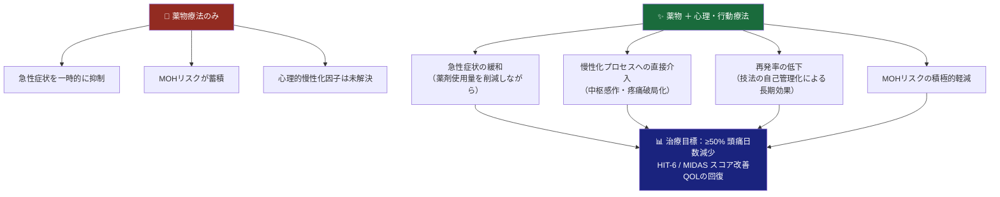
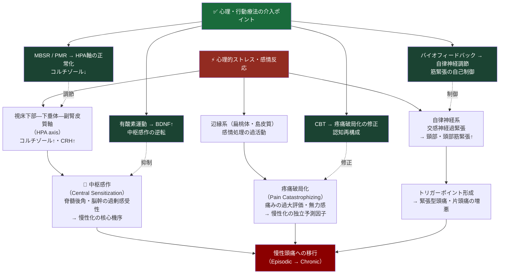
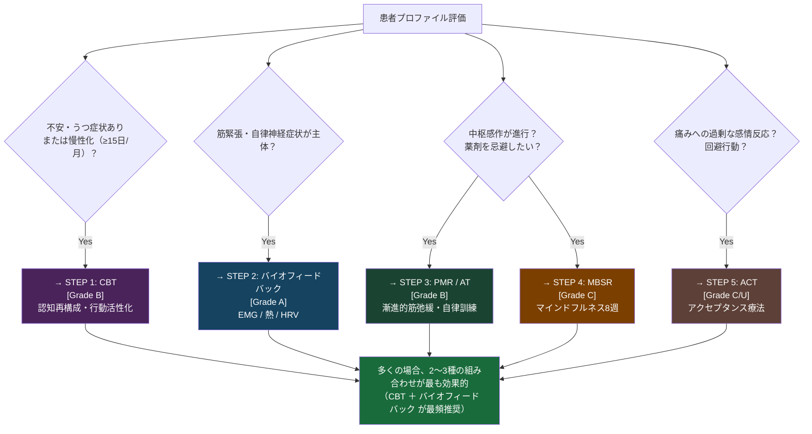
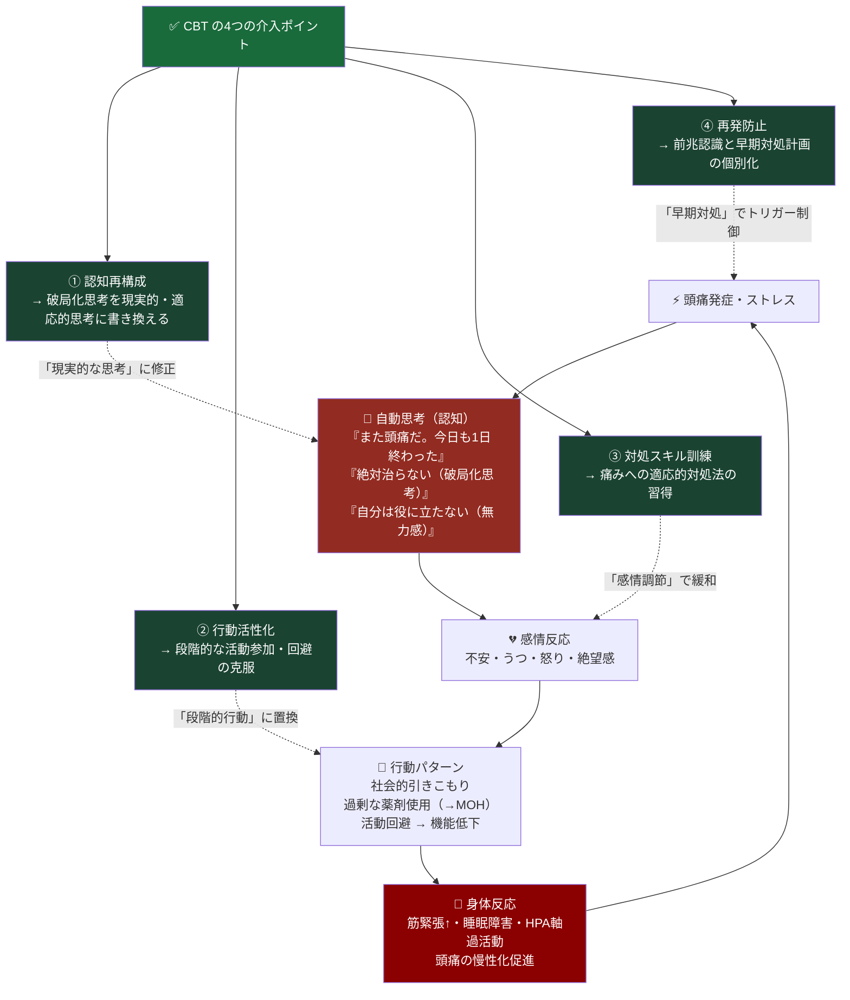
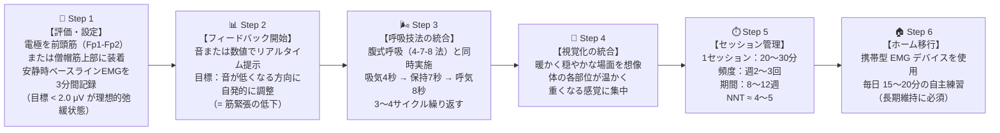
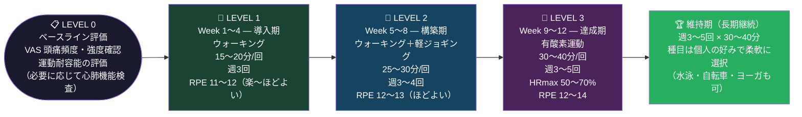
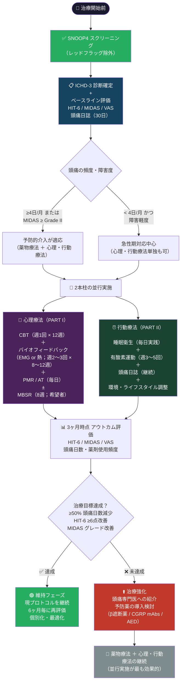
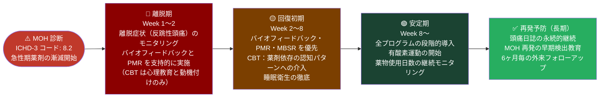

# 頭痛の心理・行動療法ガイド

## 認知行動療法・バイオフィードバック・リラクゼーション・マインドフルネス・行動介入

### 国際エビデンスに基づく初学者向けステップバイステップ解説

---

> ## ⚠️ 学術的免責事項（MANDATORY ACADEMIC DISCLAIMER）
>
> 本文書は**学術・教育・研究目的のみ**を対象として作成されています。  
> 内容は ICHD-3 | AAN | EHF | IHS 2024 | NICE CG150 | Cochrane Library | WHO | PubMed に基づく**国際的に認定された文献・ガイドライン**に完全準拠しています。  
> 本文書は個人の医療診断・処方・治療の代替には**なりません**。  
> **臨床への適用前に、必ず資格を有する医療専門家（神経内科・頭痛専門医・臨床心理士）にご相談ください。**

---

## 目次

1. [はじめに — なぜ「心理・行動療法」が頭痛治療の柱なのか？](#1-はじめに)
2. [必読：SNOOP4 レッドフラッグスクリーニング](#2-snoop4)
3. [エビデンスグレードの読み方](#3-エビデンス)
4. [神経科学的基盤 — 心理と頭痛をつなぐ脳内メカニズム](#4-神経科学)
5. [PART I — 心理療法](#5-心理療法)
   - [STEP 1：認知行動療法（CBT）](#5-1-CBT)
   - [STEP 2：バイオフィードバック](#5-2-バイオフィードバック)
   - [STEP 3：漸進的筋弛緩法（PMR）・自律訓練法（AT）](#5-3-リラクゼーション)
   - [STEP 4：マインドフルネスストレス低減法（MBSR）](#5-4-マインドフルネス)
   - [STEP 5：アクセプタンス＆コミットメント療法（ACT）](#5-5-ACT)
6. [PART II — 行動療法・生活習慣介入](#6-行動療法)
   - [STEP 6：睡眠衛生指導](#6-1-睡眠)
   - [STEP 7：有酸素運動療法](#6-2-運動)
   - [STEP 8：頭痛日誌とトリガー管理](#6-3-日誌)
   - [STEP 9：環境・ライフスタイル調整](#6-4-環境)
7. [PART III — 統合プロトコル（12週間プログラム）](#7-統合)
8. [特殊集団への適用](#8-特殊集団)
9. [アウトカム評価と治療目標](#9-アウトカム)
10. [参考文献・URLリソース](#10-参考文献)

---

## 1. はじめに — なぜ「心理・行動療法」が頭痛治療の柱なのか？ {#1-はじめに}

頭痛は**バイオサイコソーシャル（BPS）モデル**で理解する疾患です。片頭痛・緊張型頭痛（TTH）の発症・慢性化には、生物学的因子のみならず、心理的ストレス・感情調節不全・不適切な行動パターンが深く関与しています。

### 1-1. 薬物療法単独の限界

| 課題 | 詳細 |
|------|------|
| **薬物乱用頭痛（MOH）リスク** | NSAIDs >10日/月・トリプタン >8日/月で逆説的に頭痛を増悪（ICHD-3 code: 8.2） |
| **副作用・禁忌** | トリプタン（心血管禁忌）・バルプロ酸（妊娠禁忌 Category X）等の重大な制限 |
| **慢性化の抑制に限界** | 薬物は急性症状に対応するが、慢性化プロセスへの根本介入は困難 |
| **患者選好・アクセシビリティ** | 妊婦・小児・高齢者・薬剤過敏例では薬物使用に制限がある |
| **心理的側面の未対応** | 疼痛破局化・不安・うつは薬物単独では改善しない慢性化の独立因子 |

### 1-2. 心理・行動療法の優位性

> 📌 **主要エビデンスソース（統合療法優位性）**  
> AAN 2012 行動・理学療法ガイドライン: <https://www.aan.com/guidelines/home/getguidelinecontent/383>  
> Cochrane 心理療法 SR（CBT/バイオフィードバック）: <https://www.cochranelibrary.com/cdsr/doi/10.1002/14651858.CD012295.pub2/full>

---

## 2. 必読：SNOOP4 レッドフラッグスクリーニング {#2-snoop4}

> ⛔ **すべての心理・行動療法の開始前に、以下の二次性頭痛（危険な疾患が原因）の除外を必ず行うこと。**

| 文字 | 症状 | 疑うべき疾患 |
|------|------|------------|
| **S** | Systemic symptoms：発熱・髄膜刺激症状・体重減少・免疫抑制状態・悪性腫瘍既往 | 髄膜炎・脳炎・転移性脳腫瘍 |
| **N** | Neurological deficits：運動麻痺・感覚障害・失語・複視・意識変容・認知変化 | 脳血管障害・占拠性病変 |
| **O** | Onset sudden（thunderclap）：「生涯最悪の頭痛」が数秒で最大に達する | くも膜下出血（SAH）→ 緊急CT |
| **O** | Onset after age 50：50歳以降の新規発症頭痛 | 側頭動脈炎・頭蓋内病変 |
| **P** | Pattern change：進行性増悪・体位依存（仰臥位で悪化→頭蓋内圧↑；直立で悪化→低髄液圧） | 頭蓋内圧亢進・硬膜下血腫 |
| **4** | Papilledema / Postdural / Post-seizure / Pregnancy/Postpartum | それぞれの緊急病態 |

**→ 一項目でも該当する場合は心理・行動療法を開始せず、神経内科へ緊急紹介**

> 📌 **ソース**：Dodick DW. "Pearls: Headache." Semin Neurol 2010; Dodick DW. Headache 2019.  
> <https://pubmed.ncbi.nlm.nih.gov/31350744/>

---

## 3. エビデンスグレードの読み方 {#3-エビデンス}

本文書では AAN（米国神経学会）/EHF（欧州頭痛連盟）の標準的な評価基準を使用します。

| グレード | 定義 | 意味 |
|---------|------|------|
| **[Grade A]** | ≥2本の一貫したClass I RCT / Cochrane SR（低heterogeneity） | 強いエビデンス：臨床実践に採用すべき |
| **[Grade B]** | 1本のClass I RCT または ≥2本のClass II研究 | 可能性が高いエビデンス：推奨される |
| **[Grade C]** | 1本のClass II または ≥2本のClass III研究 | 可能性のあるエビデンス：考慮してよい |
| **[Grade U]** | 不十分または相反するエビデンス | 現時点では推奨できない |
| **[Expert]** | RCTなし、ガイドライン委員会コンセンサス | 専門家意見 |

---

## 4. 神経科学的基盤 — 心理と頭痛をつなぐ脳内メカニズム {#4-神経科学}

「心理療法は気持ちの問題を扱うだけ」というのは誤解です。頭痛と心理的因子の関係には、以下の**明確な神経生物学的基盤**があります。

### 主要な神経科学的機序まとめ

| 機序 | 詳細 | 心理療法による介入 |
|------|------|-----------------|
| **視床下部—辺縁系—脳幹軸** | ストレス・感情が三叉神経核（TNC）の興奮閾値を直接変調 | CBT・MBSR による前頭前野の調節能力強化 |
| **下降性疼痛抑制系（DPMS）** | PAG（中脳水道周囲灰白質）を介するオピオイド性抑制；ストレスで弱化 | リラクゼーション・バイオフィードバックで副交感神経優位化 |
| **中枢感作** | 繰り返す疼痛刺激が脊髄後角・脳幹を「過剰感受性」化 → 慢性化 | 有酸素運動による BDNF 上昇で神経可塑性を回復 |
| **疼痛破局化** | 痛みの過大評価・無力感・反芻思考；慢性化・頻度増加の独立した予測因子 | CBT の認知再構成が最も直接的に介入 |
| **HPA 軸の過活動** | 慢性ストレス → コルチゾール過剰 → 炎症性メディエーター増加 | MBSR・PMR がコルチゾール日内変動を正常化 |

---

## 5. PART I — 心理療法 {#5-心理療法}

### 療法選択の全体マップ

---

### STEP 1：認知行動療法（CBT） {#5-1-CBT}

#### `[Grade B — AAN / EHF / Cochrane SR]`

#### CBT とは？（初学者向け解説）

**認知行動療法（Cognitive Behavioral Therapy: CBT）**は、「考え方のクセ（認知）」と「行動パターン」の悪循環を特定し、より適応的なパターンへと修正する心理療法です。慢性頭痛において、CBT は疼痛体験そのものを変えるのではなく、**痛みに対する反応（認知・感情・行動）を変える**ことで慢性化を防ぎます。

#### 頭痛における CBT の悪循環モデル

#### 標準的 CBT プログラム構成（12セッション）

| セッション | テーマ | 主な内容 |
|---------|------|---------|
| 1〜2回目 | 心理教育 | 慢性頭痛のバイオサイコソーシャルモデルの理解；頭痛日誌解析；個別目標設定 |
| 3〜4回目 | 認知の同定 | 自動思考・頭痛に対する信念の特定；コラム法（ABCモデル）の練習 |
| 5〜6回目 | 認知再構成 | 非機能的思考の同定；証拠の検討；現実的・適応的思考への書き換え |
| 7〜8回目 | 行動活性化 | 活動回避パターンの特定；段階的克服；価値に基づく行動計画 |
| 9〜10回目 | 対処スキル | 発作時の対処計画（Pain Coping Plan）；ストレス管理スキルの実践 |
| 11〜12回目 | 再発防止 | 前兆（Prodrome）の個別認識；維持計画の作成；セルフモニタリング |

#### 認知再構成の実践例（ABCモデル）

| 要素 | 例 |
|------|---|
| **A：出来事（Activating Event）** | 仕事中に頭痛が始まった |
| **B：信念（Belief）** | 「また片頭痛だ。今日のプレゼンも台無し。私はいつもこうだ」（破局化） |
| **C：結果（Consequence）** | 強い不安・集中力低下・過剰な鎮痛薬使用 |
| **D：反駁（Disputation）** | 「過去にも発表中に頭痛があったが乗り切った。今日も対処できる可能性がある」 |
| **E：代替思考（Effect）** | 「休憩をとり、水分補給と呼吸法で対処してみよう。最悪の場合は相談できる」 |

#### CBT エビデンスサマリー

| 研究 | 主要知見 | グレード |
|------|------|------|
| Holroyd KA et al. *JAMA* 2001 | CBT＋アミトリプチリンで薬物単独より有意な頭痛頻度減少（慢性TTH） | **Grade A** |
| Andrasik F. *Headache* 2004 | CBT はトリプタンと同等の長期的有効性（片頭痛） | **Grade B** |
| Cochrane SR 2017（Martin PR et al.）| 心理療法（CBT・バイオフィードバック）は片頭痛予防に有効 | **Grade B** |

> 📌 **ソース**  
> Cochrane 心理療法レビュー（CBT/バイオフィードバック）: <https://www.cochranelibrary.com/cdsr/doi/10.1002/14651858.CD012295.pub2/full>  
> Holroyd KA et al. JAMA 2001 — PubMed: <https://pubmed.ncbi.nlm.nih.gov/11325323/>  
> AAN 2012 行動療法ガイドライン: <https://www.aan.com/guidelines/home/getguidelinecontent/383>

---

### STEP 2：バイオフィードバック {#5-2-バイオフィードバック}

#### `[Grade A（EMG・熱） / Grade B（HRV） — AAN 2012]`

#### バイオフィードバックとは？（初学者向け解説）

**バイオフィードバック（Biofeedback）**は、通常は意識下にある生理的信号（筋電図・皮膚温・心拍変動）をリアルタイムで可視化・音声化し、その信号を**意識的にコントロールする訓練法**です。繰り返すことで自律神経・筋緊張の自己制御能力が確立されます。

#### 種類とエビデンス

| 種類 | 計測パラメータ | 主な対象頭痛 | エビデンスグレード |
|------|-------------|----------|:---:|
| **EMG バイオフィードバック** | 前頭筋・僧帽筋の筋電図（μV） | 緊張型頭痛（第一選択）・片頭痛 | **Grade A（AAN）** |
| **熱（皮膚温）バイオフィードバック** | 指先皮膚温（℃）：末梢血管の代替指標 | 片頭痛（特に有効）・自律神経症状 | **Grade A（AAN）** |
| **HRV バイオフィードバック** | 心拍変動（ms²）：迷走神経トーン | 慢性頭痛・自律神経障害合併 | **Grade B** |
| **EEG ニューロフィードバック** | α/θ波パターン | 慢性頭痛（一部） | **Grade C** |

#### EMG バイオフィードバック：ステップバイステップ手順

#### バイオフィードバック エビデンスサマリー

| 研究 | 主要知見 | グレード |
|------|------|------|
| Nestoriuc Y & Martin A. *Pain* 2007（メタ解析、55試験） | 片頭痛に対し効果量 d = 0.58（中〜大）；薬物療法と同等 | **Grade A（片頭痛）** |
| Nestoriuc Y et al. *J Consult Clin Psychol* 2008（メタ解析） | 緊張型頭痛での EMG バイオフィードバック：頻度・強度・持続時間すべてで有意改善 | **Grade A（TTH）** |

> 📌 **ソース**  
> Nestoriuc Y & Martin A. *Pain* 2007: <https://pubmed.ncbi.nlm.nih.gov/17097218/>  
> Nestoriuc Y et al. *J Consult Clin Psychol* 2008: <https://pubmed.ncbi.nlm.nih.gov/18426234/>  
> AAN 2012 行動・理学療法ガイドライン: <https://www.aan.com/guidelines/home/getguidelinecontent/383>

---

### STEP 3：漸進的筋弛緩法（PMR）・自律訓練法（AT） {#5-3-リラクゼーション}

#### `[Grade B — AAN / EHF]`

#### A. 漸進的筋弛緩法（Progressive Muscle Relaxation: PMR）

**原理**：全身の筋肉グループを順番に「緊張させてから一気に脱力」する訓練。筋緊張の存在に気づく能力と、意識的に弛緩させる能力を同時に高めます。バイオフィードバックの「セルフ版」とも言えます。

| 順序 | 筋肉グループ | 緊張方法 | 緊張時間 | 弛緩時間 |
|------|-----------|---------|---------|---------|
| 1 | 両手・前腕（利き手から） | 強く握りしめる | 5〜7秒 | 20〜30秒 |
| 2 | 二頭筋 | 力こぶを作る | 5〜7秒 | 20〜30秒 |
| 3 | 三頭筋 | 肘を伸ばして後方に押す | 5〜7秒 | 20〜30秒 |
| 4 | 肩・頸部 | 肩を耳に向けて引き上げる | 5〜7秒 | 20〜30秒 |
| 5 | 顔（額） | 眉を引き上げる | 5〜7秒 | 20〜30秒 |
| 6 | 顔（目・頬） | 目を強くつぶる | 5〜7秒 | 20〜30秒 |
| 7 | 顎 | 歯を噛みしめる | 5〜7秒 | 20〜30秒 |
| 8 | 胸・背中 | 深呼吸して胸を膨らませ背筋を緊張 | 5〜7秒 | 20〜30秒 |
| 9 | 腹部 | 腹筋を引き締める | 5〜7秒 | 20〜30秒 |
| 10 | 大腿〜ふくらはぎ〜足 | 足首を背屈し・つま先を引く | 5〜7秒 | 20〜30秒 |

**実施目安**：1セッション20〜30分 / 1日1〜2回 / 週5回以上が理想

#### B. 自律訓練法（Autogenic Training: AT）`[Grade B — EHF]`

J.H. Schultz が開発した自己暗示技法。以下の6段階を順に習得します。**特に「第6公式（頭部涼感）」が頭痛患者に重要**です。

| 段階 | 内容 | 練習フレーズ例 |
|------|------|------------|
| 第1公式 | 重感訓練 | 「両腕が非常に重い」 |
| 第2公式 | 温感訓練 | 「両腕が非常に温かい」 |
| 第3公式 | 心臓調整 | 「心臓が静かに規則正しく打っている」 |
| 第4公式 | 呼吸調整 | 「呼吸が自然に楽に行われている」 |
| 第5公式 | 腹部温感 | 「お腹が温かい」 |
| **第6公式** | **頭部涼感** | **「頭が涼しく清々しい」**← 頭痛患者に特に重要 |

**実施目安**：1回10〜20分 / 1日2〜3回 / 継続6週間で効果を評価

> 📌 **ソース**  
> AAN 2012 ガイドライン（リラクゼーション）: <https://www.aan.com/guidelines/home/getguidelinecontent/383>  
> EHF 片頭痛予防ガイドライン 2022（PMC全文）: <https://www.ncbi.nlm.nih.gov/pmc/articles/PMC9188162/>

---

### STEP 4：マインドフルネスストレス低減法（MBSR） {#5-4-マインドフルネス}

#### `[Grade C — Cochrane SR / 有望なエビデンス]`

#### MBSR とは？（初学者向け解説）

**マインドフルネスストレス低減法（Mindfulness-Based Stress Reduction: MBSR）**は、Jon Kabat-Zinn が開発した**8週間の構造化プログラム**です。「今この瞬間の経験を、評価せず・判断せずに観察する能力」を系統的に訓練します。慢性頭痛では、痛みへの反応パターン（破局化・過覚醒）の変容が目的です。

#### MBSR の神経科学的作用機序

| 標的機序 | 内容 |
|--------|------|
| 疼痛破局化の低下 | 内側前頭前野・前帯状回の皮質厚増加 → 痛みへの過剰な感情反応を抑制 |
| 中枢感作の緩和 | 島皮質・扁桃体の過活動を正常化 → 痛みの主観的体験の変容 |
| HPA 軸の調節 | コルチゾール分泌の正常化 → 慢性ストレス関連トリガーの軽減 |
| 睡眠質の改善 | 夜間コルチゾールの低下 → 入眠容易性・睡眠効率の向上 |
| 自律神経調節 | 副交感神経活動の増加（HRV 改善）→ 血管反応性の安定化 |

#### 標準 MBSR プログラム（8週間）

| 週 | テーマ | 主な実践 |
|----|------|---------|
| 1〜2週 | 自動操縦への気づき | ボディスキャン（20〜45分）；食べるマインドフルネス |
| 3〜4週 | 現在への注意 | 呼吸への注意；マインドフルヨーガ（軽度の動き） |
| 5〜6週 | ストレス反応の認識 | 困難との向き合い；感情のマインドフルネス；痛みの観察 |
| 7〜8週 | コミュニケーション・維持 | 日常への統合；個別維持計画の作成 |
| **自宅練習** | — | **毎日 45分（正式練習）＋ 非公式の日常実践** |

#### CBT vs. MBSR — 初学者のための比較

| 比較項目 | CBT | MBSR |
|---------|-----|------|
| 主な目標 | 不適応的な思考・行動を変える | 思考・感情への反応のし方を変える |
| アプローチ | 能動的：証拠を検討し「思考を修正」 | 受容的：思考を「ただ観察」する |
| 構造化の度合い | 高（セッションごとに明確なテーマ） | 中（毎日の練習による漸進的変容） |
| 効果が出やすい対象 | 不安・うつ合併；MOH からの離脱 | 慢性化・中枢感作が進んだ症例 |
| エビデンスグレード | Grade B（AAN / Cochrane） | Grade C（現在進行中のRCTあり） |

> 📌 **ソース**  
> Cochrane 心理療法レビュー（片頭痛）: <https://www.cochranelibrary.com/cdsr/doi/10.1002/14651858.CD012295.pub2/full>  
> MBSR 公式プログラム（UMass Medical School）: <https://www.umassmed.edu/cfm/mindfulness-based-programs/mbsr-courses/>  
> PubMed MBSR 頭痛 RCT 検索: <https://pubmed.ncbi.nlm.nih.gov/?term=MBSR+headache+migraine&filter=pubt.clinicaltrial>

---

### STEP 5：アクセプタンス＆コミットメント療法（ACT） {#5-5-ACT}

#### `[Grade C / Grade U — 新興療法；エビデンス蓄積中]`

#### ACT とは？（初学者向け解説）

**アクセプタンス＆コミットメント療法（Acceptance and Commitment Therapy: ACT）**は、CBT の第三世代とも呼ばれます。慢性頭痛における「痛みを完全になくす」という目標から、**「痛みがあっても、価値ある人生を生きる」**という目標へのシフトを促す療法です。

#### ACT の6つのコアプロセス（慢性頭痛への適用）

| コアプロセス | 意味 | 慢性頭痛への適用例 |
|------------|------|-----------------|
| **受容（Acceptance）** | 痛みを「なくそうと戦う」のをやめ、あるがままに受け入れる | 「頭痛発作中に焦って薬を探し回るのではなく、痛みとともに静かにいる」 |
| **脱フュージョン（Defusion）** | 思考・感情を「現実」ではなく「ただの言葉・イメージ」として見る | 「『もうダメだ』という思考を、思考として観察する」 |
| **今この瞬間（Present Moment）** | 過去の後悔・未来の不安より「今」に意識を向ける | MBSR と共通する技法との統合 |
| **文脈としての自己（Self-as-Context）** | 「痛みを持つ自分」≠「自分そのもの」という視点 | 慢性疼痛による自己同一性の喪失への対応 |
| **価値（Values）** | 人生で本当に大切にしたいことを明確にする | 「頭痛があっても大切な家族との時間を優先する」 |
| **コミットされた行動（Committed Action）** | 価値に沿った具体的な行動を続ける | 発作を恐れて回避していた活動に段階的に取り組む |

> ⚠️ **現在エビデンスは蓄積中**。慢性疼痛全般では Grade B 相当のエビデンスがあるが、頭痛特異的なデータは限定的。CBT と並行または後継として位置づけるのが現実的。

> 📌 **ソース**  
> PubMed ACT 慢性疼痛レビュー: <https://pubmed.ncbi.nlm.nih.gov/?term=acceptance+commitment+therapy+chronic+pain>  
> Journal of Headache and Pain（EHF 公式誌）: <https://thejournalofheadacheandpain.biomedcentral.com/>

---

## 6. PART II — 行動療法・生活習慣介入 {#6-行動療法}

### STEP 6：睡眠衛生指導 {#6-1-睡眠}

#### `[Grade B — AAN / AASM / NICE CG150]`

#### なぜ睡眠が頭痛に直接影響するのか？

| 睡眠異常のタイプ | 頭痛への影響メカニズム |
|-------------|------------------|
| **睡眠不足（< 6時間）** | コルチゾール上昇・セロトニン低下 → 中枢感作増悪；痛み閾値↓ |
| **過剰睡眠（> 9時間）** | セロトニン代謝変化 → 週末の「週末型片頭痛」の主因 |
| **睡眠スケジュール不規則性** | サーカディアンリズム障害 → 視床下部（頭痛の「発電所」）の不安定化 |
| **睡眠時無呼吸（SAS）** | 低酸素血症 → 慢性早朝頭痛の最重要原因の一つ |
| **REM 睡眠の障害** | REM 関連群発頭痛発作の誘発；慢性頭痛の REM 比率低下 |

#### 睡眠衛生の10原則（国際標準）

| 原則 | 具体的実践 |
|------|---------|
| **① 規則的な就寝・起床時刻（最重要）** | 週末・休日も同じ時刻を維持；変動は ±30分以内 |
| **② 適切な睡眠時間** | 成人：7〜8時間（過剰・不足どちらも頭痛リスク↑） |
| **③ 刺激物の制限** | カフェイン：就寝6時間前以降を避ける；アルコール：就寝前3時間以内は回避 |
| **④ 電子機器の制限** | 就寝1時間前からブルーライト遮断（スマートフォン・PC・タブレット） |
| **⑤ 寝室環境の最適化** | 暗室・静音（耳栓）・室温 18〜22℃・低湿度 |
| **⑥ 運動のタイミング** | 激しい運動は就寝3時間前以降を回避（軽度のヨーガ・ストレッチは可） |
| **⑦ 食事のタイミング** | 就寝2〜3時間前以降の重食を避ける（空腹も回避） |
| **⑧ 就寝前ルーティンの確立** | 20〜30分の「ウインドダウン」（入浴→軽読書→PMR） |
| **⑨ 昼寝の管理** | 15〜20分以内・午後3時前まで（夜間睡眠圧の維持） |
| **⑩ 睡眠制限法（慢性不眠の場合）** | 就寝時間を実際の睡眠時間に制限し徐々に延長（専門家指導下） |

> 📌 **ソース**  
> American Academy of Sleep Medicine（AASM）睡眠衛生指導推奨: <https://aasm.org/>  
> NICE CG150 頭痛ガイドライン: <https://www.nice.org.uk/guidance/cg150>  
> EHF 片頭痛予防ガイドライン 2022: <https://www.ncbi.nlm.nih.gov/pmc/articles/PMC9188162/>

---

### STEP 7：有酸素運動療法 {#6-2-運動}

#### `[Grade B — AAN / EHF]`

#### なぜ有酸素運動が頭痛を減少させるのか？（神経生物学的機序）

| メカニズム | 詳細 |
|---------|------|
| **内因性オピオイド放出** | β-エンドルフィン・エンケファリン分泌↑ → 中枢性鎮痛 |
| **セロトニン系の安定化** | 5-HT 合成・放出の安定化 → 片頭痛予防に直接寄与 |
| **BDNF 上昇** | 脳由来神経栄養因子 → 神経可塑性促進 → 中枢感作の逆転 |
| **ミトコンドリア機能改善** | 運動適応 → ミトコンドリア数・機能↑（栄養補助との相乗） |
| **HPA 軸の正常化** | ストレスホルモン軸の調節 → ストレス関連トリガーの軽減 |
| **頸部・肩甲帯の筋機能改善** | トリガーポイントの解消・筋緊張の正常化 |

#### 推奨運動プロトコル（段階的導入）

> **Borg 自覚的運動強度（RPE）** 0〜20の尺度：11 = 楽、12〜13 = ほどよい、14〜15 = やや辛い

#### 種目別適性

| 種目 | 頭痛への適性 | 特記事項 |
|------|----------|--------|
| **ウォーキング** | ⭐⭐⭐⭐⭐ | 全年齢・体力レベルで開始可；発作への移行リスク最小 |
| **水泳・アクアビクス** | ⭐⭐⭐⭐⭐ | 関節負荷なし；光・騒音刺激少；妊婦・高齢者に特に推奨 |
| **サイクリング（室内・屋外）** | ⭐⭐⭐⭐ | 頸部への衝撃少；頸原性頭痛合併例に適 |
| **ヨーガ** | ⭐⭐⭐⭐ | 呼吸制御・リラクゼーションとの統合；バイオフィードバックと相乗 |
| **ジョギング・ランニング** | ⭐⭐⭐ | 運動習慣形成後に導入；衝撃性（頭部振動）に注意 |

> ⚠️ **頭痛発作中の激しい運動は禁忌**（痛みを増悪させることが多い）  
> ⚠️ 運動後の脱水は重要なトリガー：運動前後の水分補給（500mL 以上）を徹底する  
> ⚠️ 運動後に頭痛が増悪する場合は「運動誘発性頭痛（ICHD-3: 4.2）」の可能性を考慮し専門医に相談

#### 運動療法 エビデンスサマリー

| 研究 | 主要知見 | グレード |
|------|------|------|
| Varkey E et al. *Cephalalgia* 2011 | 週3回の有酸素運動がトピラマートおよびリラクゼーション法と**同等の予防効果** | **Grade B** |
| Darabaneanu S et al. *Int J Sports Med* 2011 | 10週間の有酸素運動プログラムで頭痛頻度が有意に減少 | **Grade B** |

> 📌 **ソース**  
> Varkey E et al. *Cephalalgia* 2011: <https://journals.sagepub.com/doi/10.1177/0333102411412385>  
> Darabaneanu S et al. *Int J Sports Med* 2011: <https://pubmed.ncbi.nlm.nih.gov/21328195/>

---

### STEP 8：頭痛日誌とトリガー管理 {#6-3-日誌}

#### `[Expert Consensus / 全ガイドライン共通推奨]`

#### 頭痛日誌が重要な理由

頭痛日誌は、主観的な「頭痛がひどい」という訴えを、**客観的・定量的なデータ**に変換するツールです。治療開始前の最低30日間の記録が国際的に標準とされています。

#### 記録すべき最低限の要素

| カテゴリー | 記録項目 |
|---------|---------|
| **頭痛の特性** | 日付・時刻・持続時間・痛みの性状（拍動性 / 圧迫性）・部位（片側 / 両側） |
| **重症度** | NRS / VAS 0〜10（発症時・ピーク時・2時間後） |
| **随伴症状** | 悪心・嘔吐・光過敏・音過敏・前兆の有無・誘発因子 |
| **薬剤使用** | 使用薬剤名・用量・使用時刻・効果（完全軽快 / 部分軽快 / 無効） |
| **トリガー候補** | 睡眠時間・食事内容・月経周期・ストレスレベル・天候・飲酒 |
| **日常機能** | 仕事・家事・社会活動への支障（MIDAS グレードの自己評価） |

#### 主要トリガー一覧と対処戦略

| トリガーカテゴリー | 具体例 | 対処策 |
|---------------|------|------|
| **食事性トリガー** | チラミン（熟成チーズ・赤ワイン）・ヒスタミン（発酵食品）・亜硝酸塩（加工肉）・MSG・アスパルテーム・アルコール | 日誌で個人トリガーを特定後、試験的除去（2〜4週間）→ 再摂取テスト |
| **睡眠関連** | 睡眠不足・過剰睡眠・不規則な就寝時刻・週末の寝坊 | 睡眠衛生指導（STEP 6参照）；変動 ±30分以内 |
| **カフェイン** | 急激な摂取量変化（多量摂取後の中断 = 離脱頭痛） | 漸減（週1〜2杯ずつ削減）；200mg/日未満を目標 |
| **ホルモン変動** | 月経前後のエストロゲン急落；経口避妊薬 | 月経日程と頭痛日誌の照合；婦人科医との連携 |
| **環境・感覚** | 強い光・騒音・強いにおい・天候変化・気圧変動 | 偏光レンズの使用；静音環境の確保；気圧変化への事前対応 |
| **ストレス・感情** | 仕事締め切り・人間関係の緊張・「ストレス解放後」の頭痛 | CBT による認知再構成；バイオフィードバックによる自律神経調節 |
| **脱水・食事スキップ** | 水分不足・食事間隔の乱れ（> 4〜5時間の空腹） | 1日 1.5〜2L の水分摂取；定時の食事 |

---

### STEP 9：環境・ライフスタイル調整 {#6-4-環境}

#### `[Expert Consensus / Grade C]`

| 領域 | 推奨される調整 |
|------|------------|
| **職場エルゴノミクス** | モニター高さの調整（視線と水平 or やや下方）；頸部への負荷を最小化；デスク作業 45〜60分毎の5分休憩 |
| **光環境** | 偏光レンズ（FL-41 フィルター）の使用；スクリーン輝度の調整；蛍光灯からLED（暖色系）への変更 |
| **カフェイン管理** | 摂取量を 200mg/日未満へ漸減；急激な変化を避ける |
| **水分管理** | 1日 1.5〜2L（発汗・運動量に応じて増量）；頭痛日誌に水分摂取量を記録 |
| **スクリーンタイム** | 20-20-20 ルール（20分毎に20フィート先を20秒見る）；就寝前1時間のデバイス使用制限 |
| **ストレス管理** | 計画的な休暇・余暇時間の確保；過剰なコミットメントの制限 |

---

## 7. PART III — 統合プロトコル（12週間プログラム） {#7-統合}

### 統合アプローチのエビデンス

| 比較 | 効果 | グレード |
|------|------|---------|
| バイオフィードバック ＋ 薬物 vs 薬物単独 | 薬剤使用量の有意な減少 | **Grade A** |
| CBT ＋ アミトリプチリン vs 各単独 | 相加的な頭痛日数減少・QOL 改善 | **Grade A** |
| 有酸素運動 ＋ トピラマート vs 各単独 | 同等以上の効果・副作用軽減 | **Grade B** |
| 心理 ＋ 行動療法 ＋ 薬物 vs 薬物単独 | 頭痛頻度 30〜40% の追加減少 | **Grade B** |

### 12週間スケジュール

| 期間 | 心理療法 | 行動療法 |
|------|---------|---------|
| **Week 1〜2** | 心理評価・CBT 初回（心理教育・目標設定）；頭痛日誌解析 | 睡眠日誌開始；運動耐容能評価；ウォーキング15分・週3回 |
| **Week 3〜4** | CBT：自動思考の同定・ABCモデル練習；バイオフィードバック評価開始 | ウォーキング20分・週3回；睡眠衛生の全原則実施 |
| **Week 5〜8** | CBT継続（認知再構成・行動活性化）；EMGバイオフィードバック週2〜3回；PMR 習得 | ウォーキング25〜30分・週3〜4回；環境調整の実施 |
| **Week 9〜12** | MBSR 導入（希望者）；自主バイオフィードバック移行；AT の習得 | 有酸素運動30〜40分・週3〜5回；カフェイン管理の完成 |
| **3ヶ月時点** | アウトカム評価（HIT-6/MIDAS/VAS）；維持計画の個別化 | 運動習慣の確立確認；頭痛日誌の継続 |

### 統合プロトコルの全体フロー

---

## 8. 特殊集団への適用 {#8-特殊集団}

> ⚠️ 以下は一般的な指針です。実際の臨床適用は必ず専門家の判断のもとで行ってください。

### 8-1. 小児・思春期（12歳未満 / 12〜18歳）

| 介入 | 推奨度 | 注意事項 |
|------|-------|--------|
| **バイオフィードバック（EMG / 熱）** | ✅ **強く推奨（Grade A）** | 薬物の代替として優先；10歳以上から有効 |
| **CBT（小児版）** | ✅ 推奨（Grade B） | 親の参加を含む家族システム療法として実施 |
| **有酸素運動** | ✅ 推奨 | 年齢・発達段階に応じて強度・時間を調整 |
| **PMR** | ✅ 推奨（Grade B） | 学校での実施も可能；動画ガイドの活用 |
| **MBSR** | ⚠️ 要年齢調整 | 12歳以上で有効性示唆；教師・専門家との連携必須 |
| **ACT** | ⚠️ データ限定 | 思春期特有の「価値」探索に適合しやすいが専門家指導下で |

### 8-2. 妊娠・授乳期

| 介入 | 推奨度 | 注意事項 |
|------|-------|--------|
| **バイオフィードバック** | ✅ **第一選択の非薬物療法** | 妊娠中の薬物制限下での最重要介入 |
| **CBT** | ✅ 強く推奨 | ホルモン変動関連の認知的対処に特に有効 |
| **PMR** | ✅ 推奨 | 仰臥位での実施に注意（妊娠後期は側臥位で） |
| **有酸素運動（軽〜中等度）** | ✅ 推奨 | ウォーキング・水中運動；産科医との連携のうえ実施 |
| **MBSR** | ✅ 推奨 | 産前不安への有効性も報告されており相乗効果が期待できる |

### 8-3. 高齢者（> 65歳）

| 介入 | 推奨度 | 注意事項 |
|------|-------|--------|
| **バイオフィードバック** | ✅ 推奨 | 認知機能の評価（MoCA）後にプログラム設計 |
| **CBT（簡略版）** | ✅ 推奨（Grade B） | セッション数を減らす；大きめの文字・図解を使用 |
| **有酸素運動（低強度）** | ✅ 推奨 | HRmax 50〜60% から開始；転倒リスク評価を先行実施 |
| **PMR** | ✅ 推奨 | 椅子座位での実施が安全で取り組みやすい |
| **MBSR** | ⚠️ 要調整 | 45分間の正式練習は長すぎる場合あり；20〜30分に短縮 |

### 8-4. 薬物過用性頭痛（MOH: ICHD-3 8.2）からの回復期

---

## 9. アウトカム評価と治療目標 {#9-アウトカム}

### 標準的アウトカム測定ツール

| ツール | 評価内容 | 判定基準 | 参照 |
|-------|---------|---------|------|
| **HIT-6（Headache Impact Test）** | 頭痛による日常生活への支障度 | ≥ 60 = 重度障害；MCID = 6点改善 | [HIT-6 検証論文 — PubMed](https://pubmed.ncbi.nlm.nih.gov/12789668/) |
| **MIDAS（Migraine Disability Assessment）** | 社会的機能障害（仕事・家事・社会活動の損失日数） | ≥ 21 = Grade IV 重度 | [IHS 公式ガイドライン](https://ichd-3.org/) |
| **VAS / NRS（0〜10）** | 痛みの強度（発症時・ピーク時・2時間後） | 2点以上の改善 = 臨床的意義あり | 全ガイドライン共通 |
| **PGIC（Patient Global Impression of Change）** | 患者による全体的な改善印象（7段階） | 5〜7（「改善」以上）= 成功 | AAN / EHF |
| **MSQ v2.1（Migraine-Specific QOL）** | 片頭痛特異的 QOL（3下位尺度） | 10〜15点の改善 = 臨床的意義あり | [MSQ 検証論文](https://pubmed.ncbi.nlm.nih.gov/) |
| **頭痛日誌** | 月間頭痛日数・薬剤使用日数 | 治療前比 ≥ 50% の減少 = 治療成功 | ICHD-3 / 全ガイドライン |

### 治療成功の定義（国際基準）

**主要目標（3ヶ月時点での評価）**

- 月間頭痛日数：**≥ 50% の減少**
- HIT-6：**≥ 6点の改善**（MCID）
- MIDAS：**1グレード以上の改善**
- 急性期薬剤使用日数：MOH 閾値（NSAIDs 10日、トリプタン 8日）**以下に維持**

---

## 10. 参考文献・URLリソース {#10-参考文献}

### 10-1. 国際診断基準

| リソース | URL |
|---------|-----|
| ICHD-3 公式サイト（全文閲覧可）| <https://ichd-3.org/> |
| ICHD-3 全文 PDF（2018年版）| <https://ichd-3.org/wp-content/uploads/2018/01/The-International-Classification-of-Headache-Disorders-3rd-Edition-2018.pdf> |
| IHS 分類委員会（ICHD-4 最新動向）| <https://ihs-headache.org/en/about-ihs/standing-committees/classification/> |

### 10-2. 臨床ガイドライン（行動・心理療法）

| 機関 | リソース | URL |
|------|---------|-----|
| **AAN** | 行動・理学療法ガイドライン 2012（CBT・バイオフィードバック） | <https://www.aan.com/guidelines/home/getguidelinecontent/383> |
| **AAN** | 片頭痛予防ガイドライン（総合） | <https://www.aan.com/guidelines/home/getguidelinecontent/545> |
| **AAN** | 2024年予防療法ドラフト（公開レビュー版） | <https://www.aan.com/siteassets/home-page/policy-and-guidelines/guidelines/guidelines-and-measures-open-for-public-comment/24-pharmacologic-treatment-for-migraine-prevention-in-adults_draft_08-14-2024.pdf> |
| **EHF** | CGRP mAbs 予防療法ガイドライン 2022（PMC全文） | <https://www.ncbi.nlm.nih.gov/pmc/articles/PMC9188162/> |
| **NICE** | 頭痛ガイドライン CG150（英国）| <https://www.nice.org.uk/guidance/cg150> |
| **IHS** | 急性期治療推奨 2024（Cephalalgia 誌）| <https://journals.sagepub.com/doi/10.1177/03331024241252666> |
| **AASM** | 睡眠衛生指導推奨 | <https://aasm.org/> |
| **UMass** | MBSR 公式プログラム情報 | <https://www.umassmed.edu/cfm/mindfulness-based-programs/mbsr-courses/> |

### 10-3. Cochrane エビデンスレビュー

| トピック | URL |
|---------|-----|
| 心理療法（CBT・バイオフィードバック）— 片頭痛予防 | <https://www.cochranelibrary.com/cdsr/doi/10.1002/14651858.CD012295.pub2/full> |
| マグネシウム補充 — 片頭痛予防（2025年最新）| <https://www.cochranelibrary.com/cdsr/doi/10.1002/14651858.CD016307> |
| ボツリヌストキシン — 慢性片頭痛予防 | <https://www.cochranelibrary.com/cdsr/doi/10.1002/14651858.CD011914> |
| 頭痛・片頭痛 全レビュー検索ページ | <https://www.cochranelibrary.com/search?query=headache+migraine&searchBy=3&type=cdsr> |

### 10-4. 主要原著論文

| 著者・年 | 内容 | URL |
|---------|------|-----|
| Holroyd KA et al. *JAMA* 2001 | CBT ＋ アミトリプチリン RCT（慢性 TTH） | <https://pubmed.ncbi.nlm.nih.gov/11325323/> |
| Andrasik F. *Headache* 2004 | CBT と薬物療法の長期有効性比較（片頭痛） | <https://pubmed.ncbi.nlm.nih.gov/15012657/> |
| Nestoriuc Y & Martin A. *Pain* 2007 | バイオフィードバック — 片頭痛メタ解析（55試験）| <https://pubmed.ncbi.nlm.nih.gov/17097218/> |
| Nestoriuc Y et al. *J Consult Clin Psychol* 2008 | バイオフィードバック — 緊張型頭痛メタ解析 | <https://pubmed.ncbi.nlm.nih.gov/18426234/> |
| Varkey E et al. *Cephalalgia* 2011 | 有酸素運動 vs トピラマート vs リラクゼーション RCT | <https://journals.sagepub.com/doi/10.1177/0333102411412385> |
| Darabaneanu S et al. *Int J Sports Med* 2011 | 有酸素運動 10週間プログラム — 頭痛への効果 | <https://pubmed.ncbi.nlm.nih.gov/21328195/> |
| Dodick DW. *Headache* 2019 | SNOOP4 レッドフラッグ診断レビュー | <https://pubmed.ncbi.nlm.nih.gov/31350744/> |
| Kosinski M et al. *Qual Life Res* 2003 | HIT-6 の MCID 検証 | <https://pubmed.ncbi.nlm.nih.gov/12789668/> |

### 10-5. 専門誌・データベース

| 名称 | 用途 | URL |
|------|------|-----|
| Journal of Headache and Pain（EHF 公式誌・OA） | 最新 EHF 研究・ガイドライン更新 | <https://thejournalofheadacheandpain.biomedcentral.com/> |
| Cephalalgia（IHS 公式誌）| ICHD 改訂・臨床試験 | <https://journals.sagepub.com/home/cep> |
| PubMed 頭痛 RCT 専用検索 | 個別療法の最新 RCT | <https://pubmed.ncbi.nlm.nih.gov/?term=headache+migraine&filter=pubt.clinicaltrial> |
| ClinicalTrials.gov | 進行中・完了試験の確認 | <https://clinicaltrials.gov/> |

---

## 📌 本ガイドのエッセンス（最終要約）

頭痛の心理・行動療法は、**薬物療法の代替ではなく、最も強力な補完的介入**です。

**コアトリオ（Grade A/B）**：EMG バイオフィードバック ＋ CBT ＋ PMR の組み合わせ  
**行動変容の基盤（Grade B）**：睡眠衛生の徹底 ＋ 週3〜5回の有酸素運動 ＋ 頭痛日誌30日記録  
**新興療法（Grade C）**：MBSR ＋ ACT — 中枢感作が進んだ慢性化症例に特に有望  

すべての介入は、**SNOOP4 レッドフラッグスクリーニング**と**MOH リスク評価**の実施後に開始してください。  
すべての治療計画は、3ヶ月時点での HIT-6 / MIDAS 再評価による客観的な効果確認が必須です。

---

*文書バージョン：2026年6月 | エビデンスベースライン：AAN 2024草案・EHF 2022・Cochrane SR 最新版・ICHD-3*  
*次回レビュー推奨：ICHD-4 正式公開時（予定）および AAN 2025 行動療法ガイドライン更新時*
