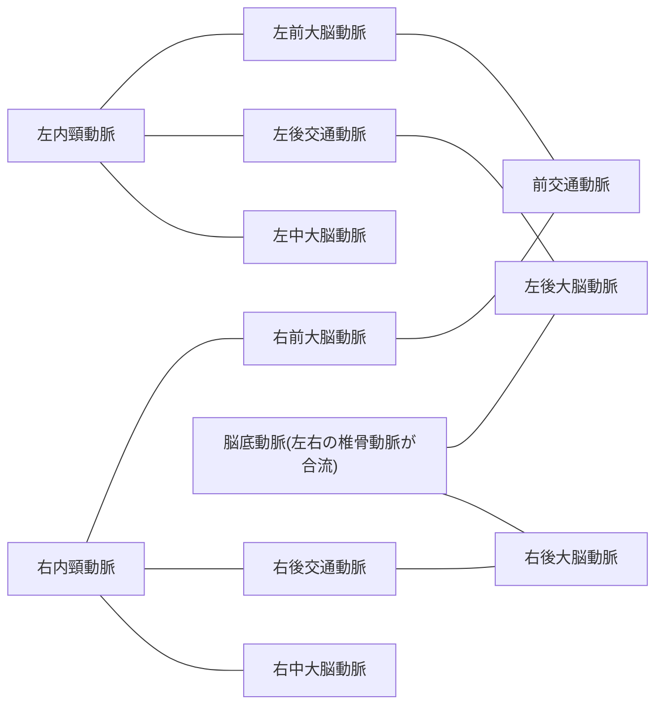
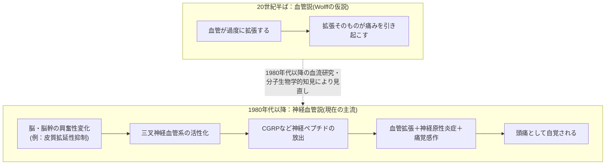
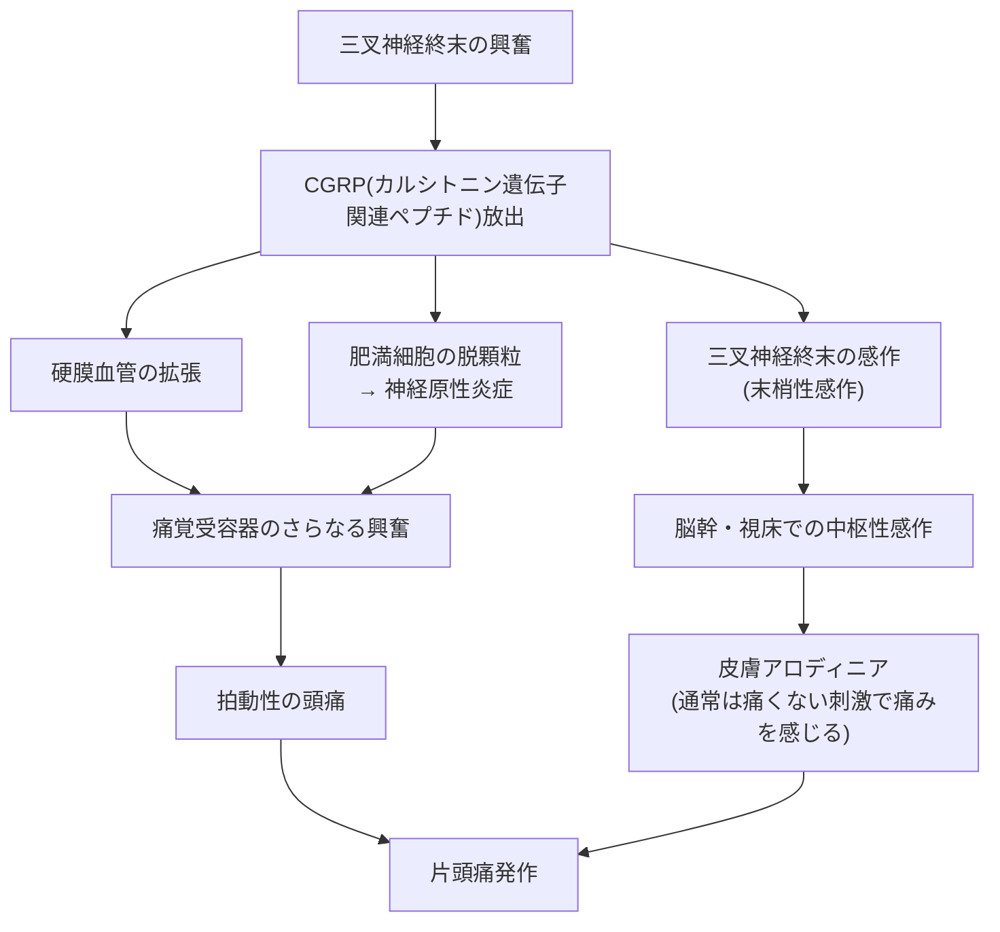
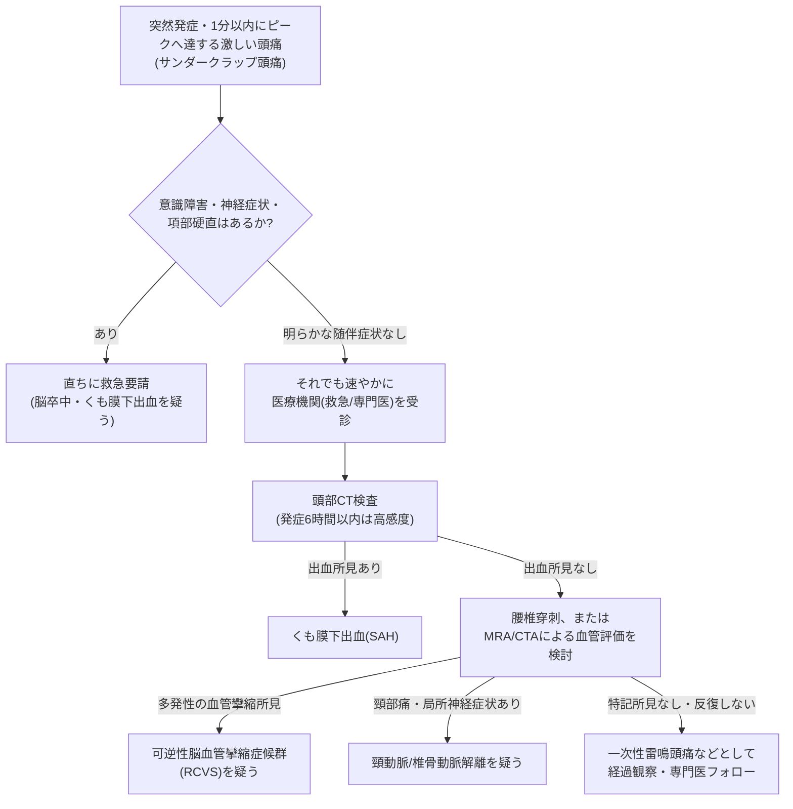

# 頭痛と血管の科学 ― 国際文献にもとづく入門解説

> 本資料は、国際頭痛学会(International Headache Society: IHS)の国際頭痛分類第3版(ICHD-3)、世界保健機関(WHO)、米国心臓協会/米国脳卒中学会(AHA/ASA)、米国リウマチ学会(ACR)、および査読付き医学雑誌(Neurology, Annals of Neurology, Cephalalgia, Headache, Journal of Cerebral Blood Flow and Metabolism など)に掲載された論文をもとに、頭痛と血管の関係を初学者向けに整理したものです。医学的判断や診断の代わりになるものではありません。**突然の激しい頭痛や神経症状を伴う頭痛がある場合は、直ちに医療機関を受診してください。**

---

## 目次

1. [なぜ頭痛と血管が関係するのか](#1-なぜ頭痛と血管が関係するのか)
2. [頭蓋内の血管ネットワークの基礎知識](#2-頭蓋内の血管ネットワークの基礎知識)
3. [痛みを感じる仕組み：三叉神経血管系](#3-痛みを感じる仕組み三叉神経血管系)
4. [歴史の転換点：「血管説」から「神経血管説」へ](#4-歴史の転換点血管説から神経血管説へ)
5. [片頭痛とCGRP：現在の中心的な理解](#5-片頭痛とcgrp現在の中心的な理解)
6. [前兆と血流変化：皮質拡延性抑制(CSD)](#6-前兆と血流変化皮質拡延性抑制csd)
7. [血管が関わる主な頭痛疾患](#7-血管が関わる主な頭痛疾患)
8. [疾患比較表](#8-疾患比較表)
9. [危険信号(レッドフラッグ)と初期対応](#9-危険信号レッドフラッグと初期対応)
10. [国際頭痛分類(ICHD-3)における位置づけ](#10-国際頭痛分類ichd-3における位置づけ)
11. [まとめ](#11-まとめ)
12. [参考文献・情報源](#12-参考文献情報源)

---

## 1. なぜ頭痛と血管が関係するのか

脳そのものには痛みを感じる神経終末がほとんどありません。では、なぜ「頭が痛い」と感じるのでしょうか。

実は、痛みを感じる(侵害受容性の)神経終末が豊富に分布しているのは、脳の実質ではなく、**頭蓋内外の血管、硬膜(脳を包む膜)、およびその周囲の組織**です。血管の壁やそれを取り巻く膜が、拡張・炎症・牽引・攣縮といった刺激を受けると、そこに分布する神経が興奮し、痛みの信号が脳に伝わります。

この「血管(および血管周囲の神経)が痛みの発生源になりうる」という基本原理が、片頭痛から群発頭痛、さらにはくも膜下出血のような緊急疾患まで、多くの頭痛の理解の土台になっています。国際頭痛学会(IHS)は、片頭痛・群発頭痛のような一次性頭痛と、脳血管障害による二次性頭痛の双方を、この神経と血管の相互作用(neurovascular)という共通の枠組みで捉えています。

---

## 2. 頭蓋内の血管ネットワークの基礎知識

頭痛を理解するうえで重要な血管には、大きく分けて次の2種類があります。

- **脳実質を養う動脈(脳動脈)**: 内頸動脈・椎骨動脈から始まり、脳の深部で輪状のネットワーク「Willis動脈輪(circle of Willis)」を形成したのち、前・中・後大脳動脈として脳表面に分布します。
- **硬膜を養う動脈(硬膜動脈)**: 代表格は**中硬膜動脈(middle meningeal artery)**で、外頸動脈の枝である顎動脈から分かれ、頭蓋骨の棘孔(foramen spinosum)を通って頭蓋内に入り、硬膜に血液を供給します。硬膜は痛みに敏感な組織であり、中硬膜動脈は三叉神経(主に第2枝・第3枝)から豊富な神経支配を受けています。

### Willis動脈輪の模式図(mermaid)

この動脈輪は、片側の血流が減少しても他方から代償できる「安全装置」として機能しますが、ここに動脈瘤ができて破裂すると、後述する**くも膜下出血**という重篤な事態を引き起こします。

---

## 3. 痛みを感じる仕組み：三叉神経血管系

頭蓋内の血管(特に硬膜動脈や大きな脳動脈・静脈洞)は、主に**三叉神経**(脳神経の中で最大の神経で、特に第1枝である眼神経)によって知覚されています。この「血管+それを支配する三叉神経」のセットを**三叉神経血管系(trigeminovascular system)**と呼びます。

この概念は、1990年代にArne MayとPeter Goadsbyらによってまとめられ、以後の頭痛研究の基盤となりました。三叉神経血管系が活性化すると、痛みの信号は次のような経路で脳に伝わります。

### 三叉神経血管系の痛覚伝導路(mermaid)

群発頭痛でみられる同側の涙・鼻づまり・結膜充血といった自律神経症状は、この三叉神経と副交感神経の反射経路(trigeminoparasympathetic reflex)で説明されます。

---

## 4. 歴史の転換点：「血管説」から「神経血管説」へ

かつて片頭痛は、20世紀半ばのHarold Wolffらの研究にもとづき、**「血管が過度に拡張すること自体が痛みの原因である」という単純な血管説**で説明されていました。この考え方は長らく「血管性頭痛(vascular headache)」という呼び名にも反映されていました。

しかし1980年代以降の脳血流測定・機能画像研究により、この単純な図式は修正されました。現在の理解では、**血管の拡張は結果の一つに過ぎず、その根本には脳・脳幹の神経活動の変化がある**とされています。

### パラダイムの変遷(mermaid)

May & Goadsby(1999, Journal of Cerebral Blood Flow and Metabolism)は、片頭痛や群発頭痛は「血管性頭痛」というより、神経と血管の相互作用を強調する**「神経血管性頭痛(neurovascular headache)」**と呼ぶべきだと論じています。

---

## 5. 片頭痛とCGRP：現在の中心的な理解

現在の片頭痛研究の中心にあるのが、**CGRP(カルシトニン遺伝子関連ペプチド)**という神経ペプチドです。CGRPは三叉神経の神経終末に豊富に存在し、神経が興奮すると血管周囲に放出されます。

### CGRPを中心とした頭痛発生メカニズム(mermaid)

1990年代のGoadsby & Edvinssonの研究では、片頭痛発作中に頸静脈血中のCGRP濃度が上昇し、有効な急性期治療薬(スマトリプタンなど)によってCGRP濃度と頭痛の両方が改善することが示されました。この知見が、その後の**抗CGRPモノクローナル抗体薬**(エレヌマブ、フレマネズマブ、ガルカネズマブ、エプチネズマブ)や経口CGRP受容体拮抗薬(ゲパント系薬剤)という、片頭痛特異的な予防・治療薬の開発につながりました。これらの薬剤は、CGRPそのもの、またはCGRP受容体を標的とすることで、血管拡張や神経原性炎症、感作の連鎖を断ち切ることを狙っています。

---

## 6. 前兆と血流変化：皮質拡延性抑制(CSD)

片頭痛の約3割の患者にみられる「前兆(aura)」――視野のギザギザした光(閃輝暗点)やしびれなど――は、**皮質拡延性抑制(cortical spreading depression: CSD)**という現象と関連づけられています。

CSDは、大脳皮質のニューロンとグリア細胞が波状に脱分極し、それがゆっくり(1分間に数mm)皮質表面を伝播していく現象です。この波が伝わるとき、脳血流も一過性の増加(充血)の後に、長時間の減少(乏血)を示すことが、Martin LauritzenやJes Olesenらのキセノン133吸入法やPET・機能的MRIを用いた研究によって示されています。この血流変化のパターンは、片頭痛の前兆症状が広がる速度や部位とよく対応することがわかっています。

つまり、血流の変化は「原因」ではなく、脳の神経活動の変化に伴って**二次的に生じる現象**として理解されており、これも血管説から神経血管説への転換を支える重要な証拠となりました。

---

## 7. 血管が関わる主な頭痛疾患

ここでは、血管が中心的な役割を果たす代表的な頭痛疾患を、良性のものから緊急性の高いものまで紹介します。

### 7.1 片頭痛(Migraine)
上述の三叉神経血管系とCGRPを中心としたメカニズムで説明される、片側性・拍動性の頭痛です。WHOは、片頭痛が世界の疾病負担(DALY)において脳卒中・新生児脳症に次いで3番目に大きいと報告しています。

### 7.2 群発頭痛(Cluster Headache)
三叉神経自律神経性頭痛(trigeminal autonomic cephalalgias)の代表格で、片側の眼窩・側頭部に極めて激しい痛みが15分〜3時間程度出現し、同側の流涙・結膜充血・鼻閉などの自律神経症状を伴います。三叉神経血管系に加えて視床下部の関与が示唆されています。

### 7.3 巨細胞性動脈炎(Giant Cell Arteritis, 側頭動脈炎)
中〜大型の血管、特に浅側頭動脈に炎症(血管炎)が生じる自己免疫疾患です。50歳以上に新規発症する、こめかみの頭痛や側頭動脈の圧痛・拍動低下が特徴で、顎跛行(咀嚼で顎が痛む)を伴うこともあります。**治療が遅れると失明のリスクがある救急疾患**であり、米国リウマチ学会(ACR)は疑い例への迅速なステロイド治療を推奨しています。

### 7.4 くも膜下出血(Subarachnoid Hemorrhage, SAH)
多くは脳動脈瘤の破裂によって、くも膜下腔(くも膜と軟膜の間)に出血が生じるものです。「人生最悪の頭痛」「雷に打たれたような頭痛」と表現される、**発症から1分以内にピークに達する突然の激しい頭痛(サンダークラップ頭痛)**が特徴的です。意識障害や項部硬直を伴うことが多く、生命に関わる神経救急疾患です。

### 7.5 可逆性脳血管攣縮症候群(Reversible Cerebral Vasoconstriction Syndrome, RCVS)
頭蓋内の複数の動脈が数日〜数週間にわたり可逆的に攣縮(スパズム)する疾患で、反復する雷鳴頭痛が特徴です。産褥期や特定の薬剤(血管収縮薬、一部の抗うつ薬など)が誘因となることがあり、脳血管撮影では動脈が数珠状にくびれる「sausage on a string」所見がみられます。多くは3か月以内に自然軽快しますが、脳梗塞や脳出血を合併することがあります。

### 7.6 頸動脈・椎骨動脈解離(Cervical Artery Dissection)
頸部の内頸動脈や椎骨動脈の血管壁が裂けることで生じ、新規の頭痛や頸部痛が初発症状となることが多い疾患です。若年〜中年の脳卒中の重要な原因であり、米国心臓協会/米国脳卒中学会(AHA/ASA)は、頭痛・顔面痛(約65%)、頸部痛(約50%)がしばしば脳虚血症状に先行すると報告しています。

---

## 8. 疾患比較表

| 疾患名 | 主に関わる血管・機序 | 頭痛の特徴 | 代表的な随伴症状 | 緊急度 |
|---|---|---|---|---|
| 片頭痛 | 硬膜血管・三叉神経血管系・CGRP | 片側性・拍動性、中等度〜重度、4〜72時間持続 | 悪心・嘔吐、光/音過敏、前兆(閃輝暗点など) | 通常は良性(ただし反復・生活への影響大) |
| 群発頭痛 | 三叉神経血管系・視床下部 | 片側の眼窩/側頭部、極めて激烈、15分〜3時間、群発する | 同側の流涙、結膜充血、鼻閉、眼瞼下垂 | 良性だが痛みは極めて強い |
| 巨細胞性動脈炎 | 浅側頭動脈などの血管炎 | 新規発症のこめかみの頭痛、動脈の圧痛 | 顎跛行、視力障害、全身倦怠感、50歳以上 | 緊急(失明リスク) |
| くも膜下出血 | 脳動脈瘤破裂など | 「人生最悪の頭痛」、秒〜分でピークに達する雷鳴頭痛 | 意識障害、項部硬直、嘔吐 | 生命に関わる救急 |
| 可逆性脳血管攣縮症候群 | 頭蓋内動脈の可逆的攣縮 | 反復する雷鳴頭痛(数日〜数週間) | 局所神経症状、けいれん | 準緊急(脳梗塞・脳出血のリスク) |
| 頸動脈・椎骨動脈解離 | 頸部動脈壁の裂け | 新規の頭痛+頸部痛、片側性 | Horner徴候、脳虚血症状(脱力・しびれ・言語障害) | 緊急(脳卒中リスク) |

---

## 9. 危険信号(レッドフラッグ)と初期対応

頭痛のほとんどは良性(一次性)ですが、一部には血管障害などの重篤な原因(二次性頭痛)が隠れていることがあります。国際頭痛学会の二次性頭痛特別研究班による**SNNOOP10リスト**(Do TP, et al. *Neurology* 2019)は、二次性頭痛を疑うべき危険信号を体系的にまとめたものです。主な項目には以下が含まれます。

- 全身症状(発熱など)、悪性腫瘍の既往
- 神経学的異常所見(意識障害を含む)
- **突然発症・雷鳴様の頭痛**
- 65歳以降の新規発症
- 頭痛パターンの変化・新規発症
- 体位によって変化する頭痛
- 咳・くしゃみ・運動で誘発される頭痛
- 乳頭浮腫
- 妊娠・産褥期
- 眼の痛み+自律神経症状
- 頭部外傷後の発症
- 免疫不全状態
- 鎮痛薬の使いすぎ、新規薬剤開始後の発症

### 突然発症の激しい頭痛への初期対応フロー(mermaid)

**注意:** 上記はあくまで一般的な考え方の整理であり、実際の診断・検査方針は医療機関での評価にもとづいて決定されます。突然の激しい頭痛を経験した場合は、自己判断せず速やかに医療機関(緊急時は救急)を受診してください。

---

## 10. 国際頭痛分類(ICHD-3)における位置づけ

国際頭痛学会(IHS)が策定する**国際頭痛分類第3版(ICHD-3, 2018年発行)**は、世界保健機関(WHO)の疾病分類(ICD)にも組み込まれている、頭痛診断の国際標準です。血管に関連する頭痛は、この分類の中で次のように位置づけられています。

| 区分 | 内容 | 血管に関連する代表例 |
|---|---|---|
| Part 1: 一次性頭痛 | 基礎疾患のない、神経・血管系機能の変化による頭痛 | 片頭痛(第1章)、群発頭痛を含む三叉神経自律神経性頭痛(第3章) |
| Part 2: 二次性頭痛 | 他の疾患に起因する頭痛 | 「頭蓋または頸部血管障害による頭痛」(第6章):くも膜下出血、RCVS、動脈解離、巨細胞性動脈炎など |
| Part 3: 有痛性脳神経ニューロパチー・その他の顔面痛・その他の頭痛 | 神経障害性の痛みなど | 三叉神経痛など |

このように、ICHD-3は「一次性頭痛の多くも血管系の関与を伴う機能的な変化である」という理解と、「血管そのものの器質的な病変(出血・攣縮・炎症・解離)による二次性頭痛」という理解を、明確に区別しながら体系立てています。

---

## 11. まとめ

- 脳実質には痛覚がほとんどなく、**痛みを感じるのは主に血管とその周囲の膜・神経**です。
- 血管と、それを支配する三叉神経のセットを**三叉神経血管系**と呼び、片頭痛や群発頭痛など多くの頭痛の共通基盤となっています。
- かつての単純な「血管拡張=痛み」という**血管説**は、1980年代以降の研究によって**神経血管説**へと発展し、CGRPなどの神経ペプチドを介した神経原性炎症・感作という考え方が中心になっています。
- 片頭痛の前兆は、**皮質拡延性抑制(CSD)**という神経活動の波とそれに伴う血流変化で説明されます。
- 巨細胞性動脈炎・くも膜下出血・RCVS・動脈解離のように、**血管そのものの器質的異常が直接の原因となる二次性頭痛**も存在し、中には生命に関わる緊急疾患が含まれます。
- **突然発症する激しい頭痛(雷鳴頭痛)や神経症状を伴う頭痛は、危険信号(レッドフラッグ)として速やかな医療機関受診が必要**です。

---

## 12. 参考文献・情報源

以下はすべて国際的に認知された学術団体・専門誌・公的機関によるものです。

| 分類 | 出典 | URL |
|---|---|---|
| 国際頭痛分類の公式サイト | ICHD-3, International Headache Society | https://ichd-3.org/ |
| 国際頭痛学会 ICHD関連ページ | International Headache Society | https://ihs-headache.org/en/resources/ichd/ |
| ICHD-3ポケット版(PDF) | International Headache Society | https://ihs-headache.org/wp-content/uploads/2020/05/ICHD-3-Pocket-version.pdf |
| 頭痛疾患ファクトシート | World Health Organization (WHO) | https://www.who.int/news-room/fact-sheets/detail/headache-disorders |
| 三叉神経血管系の総説 | May A, Goadsby PJ. *J Cereb Blood Flow Metab* 1999 | https://journals.sagepub.com/doi/10.1097/00004647-199902000-00001 |
| 三叉神経血管系とCGRP・治療薬の研究 | Goadsby PJ, Edvinsson L. *Ann Neurol* 1993 | https://onlinelibrary.wiley.com/doi/abs/10.1002/ana.410330109 |
| CGRPと三叉神経血管系(総説) | Iyengar S, et al. *Headache* 2019 | https://headachejournal.onlinelibrary.wiley.com/doi/10.1111/head.13529 |
| 皮質拡延性抑制と片頭痛(総説) | Lauritzen M. *Cephalalgia* 2001 | https://journals.sagepub.com/doi/full/10.1111/j.1468-2982.2001.00244.x |
| 硬膜の神経支配(中硬膜動脈周囲) | Lee SH, et al. *Front Neuroanat* 2017 | https://www.ncbi.nlm.nih.gov/pmc/articles/PMC5742225/ |
| 中硬膜動脈の解剖(StatPearls) | NCBI Bookshelf | https://www.ncbi.nlm.nih.gov/books/NBK519545/ |
| 可逆性脳血管攣縮症候群(StatPearls) | NCBI Bookshelf | https://www.ncbi.nlm.nih.gov/books/NBK551723/ |
| 巨細胞性動脈炎(StatPearls) | NCBI Bookshelf | https://www.ncbi.nlm.nih.gov/books/NBK459376/ |
| 巨細胞性動脈炎 患者向け解説 | American College of Rheumatology | https://rheumatology.org/patients/giant-cell-arteritis |
| くも膜下出血診療ガイドライン関連 | American Heart Association / American Stroke Association, *Stroke* | https://www.ahajournals.org/doi/10.1161/STROKEAHA.123.044560 |
| 頸動脈・椎骨動脈解離 科学的声明 | American Heart Association / American Stroke Association, *Stroke* | https://www.ahajournals.org/doi/10.1161/STR.0000000000000457 |
| 二次性頭痛の危険信号(SNNOOP10) | Do TP, et al. *Neurology* (American Academy of Neurology) 2019 | https://www.neurology.org/doi/10.1212/WNL.0000000000006697 |
| くも膜下出血の臨床解説 | MSD Manual Professional Edition | https://www.msdmanuals.com/professional/neurologic-disorders/stroke/subarachnoid-hemorrhage |

---

*本資料は教育・学習目的で作成されたものであり、個別の診断や治療方針を示すものではありません。症状に不安がある場合は、必ず医師などの専門家にご相談ください。*
