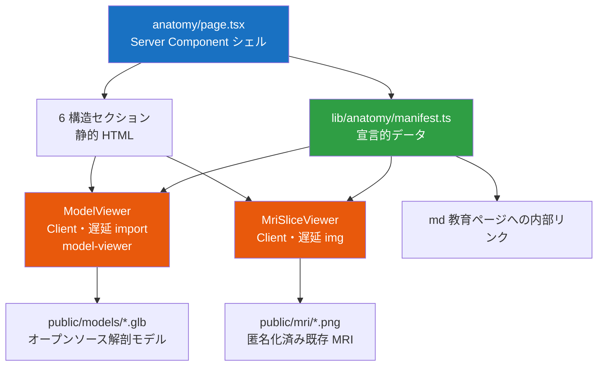
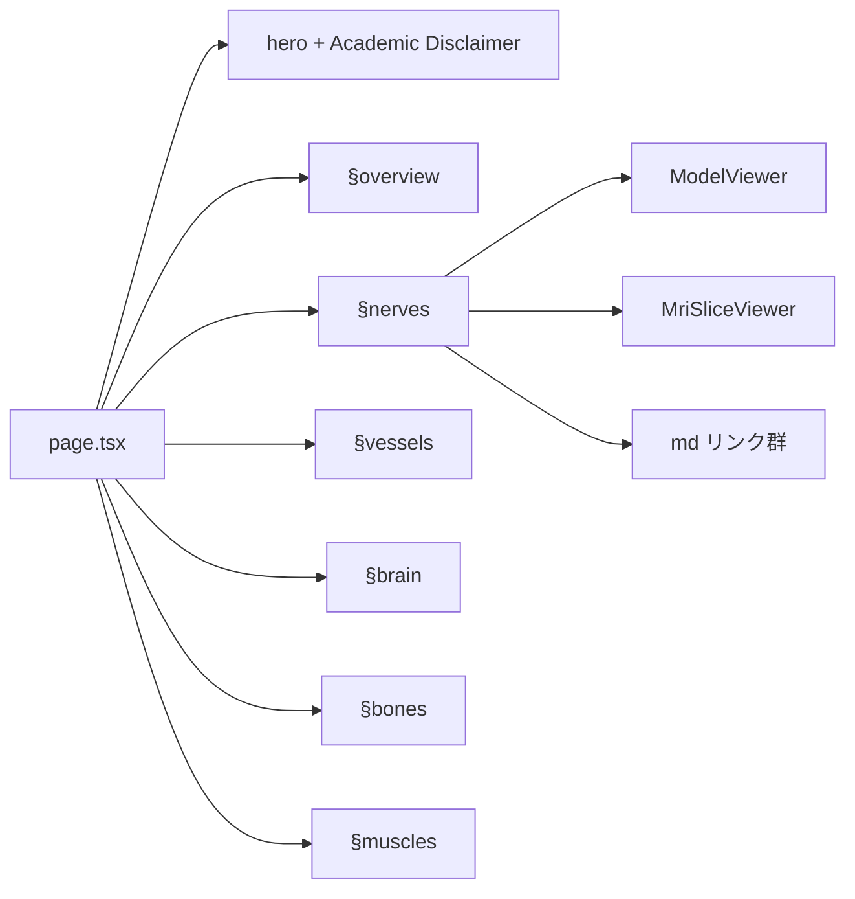

# 頭痛 3D 解剖アトラス（v1.3）── 教育コンテンツ可視化 設計書

> **文書種別**: 詳細設計書（Design Document）
> **対象機能**: web-next `/anatomy` ── `Types-of-headache/md-files/` の解剖内容を 3D + MRI で説明する教育画面
> **位置づけ**: `docs/pre-architecture.md`（v1.2 原設計）への批判レビューが課した宿題 **v1.3** への解答
> **更新日**: 2026-06-26
> **スコープ区分**: 教育専用（Patient/Student Education）／診断補助なし／薬機法 SaMD 非該当

---

## 0. エグゼクティブサマリー ── リスコープ宣言

v1.2 原設計（`pre-architecture.md`）は「医師と患者の会話を支援する臨床 OS」であり、
患者固有 DICOM のリアルタイム読込・MPR・5 ステップ固定 Workflow を中核に据えていた。
これに対する批判レビュー（旧 `architecture.md`）は 3 件の P0 ブロッカーを指摘し、
解決策として **「ユースケース B：教育用 Atlas モード」** を推奨していた。

本 v1.3 はその推奨を正式採用し、**対象を「診察室の臨床 OS」から「公開学習アプリ
web-next 内の教育用 3D 解剖アトラス」へ意図的にリスコープ**する。これにより、
本機能は `Types-of-headache/md-files/` が解説する**神経・血管・脳/脳幹・骨/頚椎・筋肉**を
3D モデルと既存 MRI 画像で立体的に説明し、該当する教育ページへ誘導する。

| レビュー P0 指摘 | v1.3 での解消 |
|---|---|
| P0-1: PNG vs DICOM のユースケース未確定 | 教育用 Atlas（オープンソース glTF）＋静的 MRI PNG を正式採用。DICOM パイプライン廃止 |
| P0-2: バンドル 300KB の物理的不可能性 | 既存 Next.js 16 上で 3D/2D ビューアを**遅延ロードの独立チャンク**化。初期チャンクは小 |
| P0-3: 薬機法 SaMD 該当性の欠落 | 教育専用・診断補助なし・患者固有 Registration なし＝**非該当ブランチ**に明確化 |

---

## 1. 背景・目的・スコープ

### 1.1 背景

`Types-of-headache/md-files/` 配下の教育コンテンツは、頭痛に関わる解剖構造を
テキストと Mermaid 図で詳細に解説している。しかし学習者（医学生・研修医・患者）が
**構造同士の立体的な位置関係**を把握する手段がない。後頭神経（GON）と C2、椎骨動脈と
頚椎、三叉頚椎複合体（TCC）の脳幹収束などは、平面図では直感的理解が難しい。

### 1.2 目的

既存 web-next アプリに `/anatomy` 画面を追加し、以下を実現する。

- 解剖構造を**オープンソース 3D モデル（glTF/GLB）**で回転・拡大・注釈表示する。
- 既存 **MRI PNG** を 2D スライス・スクラバとして併設し、実画像と対応づける。
- 各構造から該当する **md 教育ページ**へ誘導する。
- 臨床用語を**やさしい言い換え**で注釈する（v1.2 Translation Engine の転用）。

### 1.3 スコープ

| 区分 | 項目 |
|---|---|
| **In（本設計の対象）** | 3D 解剖アトラス（glTF）、2D MRI スライスビューア（静的 PNG）、構造↔md 誘導、用語やさしい言い換え注釈、ホットスポット |
| **Out（恒久的に非対象）** | DICOM 読込、患者固有 3D 再構築・Registration、MPR、AI 診断・病変検出、医療レポート生成、永続化（localStorage 等） |

---

## 2. ユーザーストーリー

- **医学生**として、頭痛の原因となる神経・血管・筋の立体配置を回転させて学び、
  対応する MRI スライスと教育記事へ即座に飛びたい。
- **研修医**として、後頭神経ブロックの解剖学的根拠（GON / C2 / TCC）を 3D で確認し、
  `Occipital-Nerve-Block.md` の該当節へ移動したい。
- **患者**として、専門用語を恐れず、やさしい言い換えと立体図で自分の頭痛の仕組みを理解したい。

---

## 3. コンテンツ・マッピング（本設計の核）

解剖構造を 6 カテゴリに整理し、3D レイヤー・MRI・md ソースへ宣言的に紐付ける。

| 構造 | 代表要素 | 3D レイヤー | MRI 対応 | 主な md ソース |
|---|---|---|---|---|
| 神経 | 大後頭神経(GON/C2)・三叉神経・頚神経叢 | `nerves` | 頚椎・頭部 | `Blocks/Occipital-Nerve-Block.md`, `Blocks/Cervical-Plexus-Block.md`, `Headaches/Cervicogenic-Headache.md` |
| 血管 | 椎骨動脈・Willis 環・星状神経節周囲 | `vessels` | 頭部 | `Blocks/Stellate-Ganglion-Block.md`, `Headaches/Migraine.md` |
| 脳・脳幹 | 三叉頚椎複合体(TCC)・脳幹収束 | `brain` | 脳 | `Headaches/Migraine.md`, `Blocks/Occipital-Nerve-Block.md` |
| 骨・頚椎 | C1-C2・後頭骨・椎間関節 | `bones` | 頚椎 | `Headaches/Cervicogenic-Headache.md`, `Blocks/Cervical-Plexus-Block.md` |
| 筋 | 後頭下筋群・僧帽筋・胸鎖乳突筋 | `muscles` | 頚椎 | `Headaches/Tension-Type-Headache.md`, `Physical-Therapy/Physical Therapy-for-Headache.md` |
| 総覧 | 頭頚部全体（導入・俯瞰） | `overview` | 脳・頚椎 | （ハブ導入セクション） |

---

## 4. アーキテクチャ概要

`/anatomy` は **Server Component シェル**（静的・SEO 可）に、**Client アイランド**として
3D ビューアと 2D MRI ビューアを遅延ロードで埋め込む。重いライブラリは初期バンドルに含めず、
マウント時に動的 `import()` する（既存 `components/MermaidDiagram.tsx` と同型）。



設計判断:

- **描画ライブラリ**: 第一候補は `@google/model-viewer`（カメラ操作・ホットスポット注釈・AR が
  Web Component として組込み済みで、遅延ロード統合が最小）。高度なインタラクションが必要に
  なった場合の代替は React Three Fiber + drei。ビューア部品はライブラリ差し替え可能な抽象とする。
- **データ駆動**: 構造・モデルパス・MRI・md リンク・注釈は `manifest.ts` に集約し、
  ページ・ビューアは manifest を読むだけにする（v1.2 のハードコード座標を排除）。

---

## 5. データ / アセット設計

### 5.1 manifest 型（`lib/anatomy/types.ts`）

```text
AnatomyStructure {
  id: 'nerves' | 'vessels' | 'brain' | 'bones' | 'muscles' | 'overview'
  title: string                  // 表示名（日本語）
  summary: string                // 1〜2 文の概要
  modelSrc: string | null        // public/models 配下 glTF（未投入時 null）
  hotspots: Hotspot[]            // 3D 注釈
  mri: MriSeries | null          // 対応 MRI シリーズ（任意）
  links: MdLink[]                // 該当 md 教育ページ
}
Hotspot { id, label, plain, position }   // plain=やさしい言い換え, position='x y z'
MriSeries { id, bodyPart, slices: string[], note? }
MdLink { label, href }                    // href は内部 # or 既存ページルート
```

検証関数 `validateManifest(data: unknown): AnatomyStructure[]` を提供し、
`any` を使わず型ガードで絞り込む（不正データは起動時に例外）。

### 5.2 3D モデル（オープンソース・合法）

- **候補ソース**: BodyParts3D / Anatomography（DBCLS, CC-BY-SA 2.1 JP・日本語解剖モデル）、
  Z-Anatomy（CC-BY-SA 4.0・全身）、Sketchfab の CC-BY モデル。
- glTF/GLB へ変換し `web-next/public/models/<id>.glb` に配置。
- `web-next/public/models/LICENSES.md` に**出典・ライセンス・改変有無**を記録（帰属表示義務）。
- **ShareAlike 注意**: 改変モデルを再配布する場合、同一ライセンスでの公開義務が生じうる。

### 5.3 MRI（既存 PNG）

- 現状は repo ルート `images/brain/`（8 シリーズ）・`images/cervucal_vertebrae/images/`（113 枚）。
  Next.js は `public/` のみ配信するため、**代表シリーズの少数枚を curate** して
  `web-next/public/mri/<series>/` へ配置し、`manifest.json` でスライス順・所見を宣言する。
- 全量（数百枚）の同梱は禁止（バンドル肥大・転送コスト）。

#### MRI 匿名化チェックリスト（公開アセット化の前提・必須）

- [x] ファイル名に患者識別子・撮影日・施設名を含まない。（中立連番 `01.png`…へ改名）
- [x] ピクセル焼込みテキスト（氏名・ID・日付）が無い。（curate 対象スライスを目視確認）
- [x] 付随メタデータ（PNG tEXt 等）に PHI が無い。（`sanitizePng` で ancillary チャンク除去）
- [x] 顔貌の 3D 再構築が不可能な 2D スライスに限定する。（等間隔の単発スライスのみ採用）

---

## 6. 画面 / コンポーネント設計



各構造セクション = 見出し ＋ 概要 ＋ `ModelViewer`（該当モデル・ホットスポット）
＋ `MriSliceViewer`（対応スライスのスクラブ）＋ md 教育ページへのリンク。

- `ModelViewer.tsx`（`"use client"`）: マウント時に model-viewer を動的 import。
  失敗時もページは機能（ビューアのみ欠落、`MermaidDiagram` と同じ降格戦略）。
- `MriSliceViewer.tsx`（`"use client"`）: manifest のスライス配列を
  `` でスクラブ表示（スライダー / 前後ボタン）。

---

## 7. パフォーマンス予算（レビュー §5.3 修正版を継承）

| 指標 | 目標 | 手段 |
|---|---|---|
| 初期チャンク（Critical Path） | 小（シェル＋manifest のみ） | 3D/2D を Client アイランドで遅延ロード |
| 3D ライブラリ | 独立遅延チャンク | マウント時 `import()`、初期 JS に含めない |
| glTF アセット | レイヤー別に段階ロード | Draco/Meshopt 圧縮、LOD、構造単位で分割 |
| MRI 画像 | 遅延・必要分のみ | `loading="lazy"`、curate した少数枚 |
| 再描画 | 16ms 以内 | Server Component 主体、Client 範囲を最小化 |

---

## 8. ライセンス・法規制

### 8.1 教育専用ディスクレーマー

既存ページ（例: `Occipital-Nerve-Block`）の **Academic Disclaimer** を踏襲し、
「学術・教育・研究目的のみ。診断・処方ではない」旨を hero 直下に明示する。

### 8.2 薬機法 SaMD 非該当の論拠

本機能は (1) **教育用の代表モデル/画像のみ**を扱い、(2) 患者固有データのリアルタイム
読込・解析を行わず、(3) 診断・病変検出・治療方針の自動提示を行わない。レビュー §1.3 の
該当性フローにおける **「患者教育のみ＝非該当の可能性あり」**ブランチに留まる。診断補助機能を
将来追加する場合は、その時点で薬事照会を必須とする（本スコープでは行わない）。

### 8.3 3D モデル / MRI のライセンス

- 3D モデルは CC-BY-SA 系を `LICENSES.md` で帰属表示。ShareAlike 条件を遵守。
- MRI は §5.3 の匿名化チェックリスト完了を公開条件とする。

---

## 9. テスト戦略

| 種別 | 対象 | ツール | 方針 |
|---|---|---|---|
| 単体 | `validateManifest` / 構造マッピング | Vitest | 正常系＋異常系（不正データ例外）。純粋関数として先行テスト |
| 契約 | `app/anatomy/page.tsx` | Vitest + RTL | hero・6 セクション・ディスクレーマー・md リンク・外部リンク属性。重いビューアは `vi.mock` |
| 視覚 | `/anatomy` 全体 | 手動（開発サーバで起動し目視） | 3D 回転・MRI スクラブ・リンク遷移を目視 |

既存 `app/blocks/occipital-nerve-block/page.test.tsx` の契約テスト様式に準拠する。

---

## 10. 段階的ロードマップ

| Phase | 内容 | 状態 |
|---|---|---|
| 0 | 雛形（ページシェル・manifest コア・遅延ビューア骨格・public 雛形） | ✅ 完了 |
| 1 | 2D MRI スライスビューアの実画像投入（匿名化済み curate） | ✅ 完了（脳/頚椎 各8枚・読影風ビューア） |
| 2 | 3D 解剖モデル（オープンソース glTF）の投入・ホットスポット注釈 | ⏳ 未着手 |
| 3 | 各構造から md 教育ページへの誘導・やさしい言い換えの作り込み | ⏳ 未着手 |
| 4 | 仕上げ（パフォーマンス計測・アクセシビリティ・テスト拡充） | ⏳ 未着手 |

---

## 11. 技術スタック（現行 web-next に整合）

| カテゴリ | 採用 | 備考 |
|---|---|---|
| フレームワーク | Next.js 16 / React 19.2.4 | 既存（レビュー §2.1「React 安定版固定」を自動充足） |
| 言語 | TypeScript 5.x（strict） | `any` 禁止・`unknown`＋型ガード |
| 3D | `@google/model-viewer`（遅延） | 代替 R3F + drei |
| 2D MRI | `` + スクラバ | 静的 PNG |
| スタイル | scoped CSS（`.anatomy-*`）+ globals | Migraine.html 由来の CSS 変数継承 |
| テスト | Vitest + Testing Library | 既存規約準拠 |
| Lint | Biome | `anatomy.css` を `includes` 許可リストへ追記 |

---

## 付録 A: 旧レビュー指摘の反映表（トレーサビリティ）

| 指摘 | 重大度 | v1.3 での扱い |
|---|---|---|
| PNG vs DICOM ユースケース未確定 | P0 | 教育用 PNG/Atlas を正式採用、DICOM 廃止 |
| バンドル 300KB 不可能 | P0 | 3D/2D を遅延独立チャンク化 |
| 薬機法 SaMD 未審査 | P0 | 教育専用・非該当ブランチに明確化 |
| React 20 の RC 採用 | P1 | Next 16 / React 19.2.4 で解消 |
| メモリ予算過小 | P1 | DICOM/全スライス一括ロード廃止により大幅縮小 |
| 60 秒強制タイムアウト | P1 | 廃止（学習者は自由探索） |
| Translation Engine ハードコード | P1 | manifest 外部データ化＋型検証 |
| lesionCoordinate ハードコード | P2 | 患者固有座標廃止。構造固定ホットスポット注釈に置換 |
| テスト戦略欠落 | P2 | §9 で策定（単体・契約・視覚） |
| エラー状態欠落 | P2 | ビューア失敗時の降格表示を規定 |

---

## 付録 B: v1.2 資産の継承 / 廃止

| v1.2 コンポーネント | v1.3 での扱い |
|---|---|
| 教科書 Atlas PiP（glTF 3D 解剖モデル） | ★主役へ昇格（オープンソース glTF を全画面ビューアに） |
| Translation Engine（専門用語→平易文） | 転用（ホットスポット注釈のやさしい言い換え） |
| 5 ステップ Workflow | 簡素転用（任意のガイドツアー / セクション送り） |
| Zero Persistence / セキュリティ | 簡素継承（PHI 非保持は維持、キャッシュ拒否は緩和） |
| DICOM パイプライン / MPR / Lazy Slice | 廃止（静的 PNG の 2D スライスに置換） |
| 操作ロック・60 秒タイムアウト | 廃止 |
| 患者固有 lesionCoordinate | 廃止（構造固定ホットスポットに置換） |
| React 20 / Vite 6 / Cloudflare | 置換（Next 16 / React 19 / bun・既存 web-next） |
