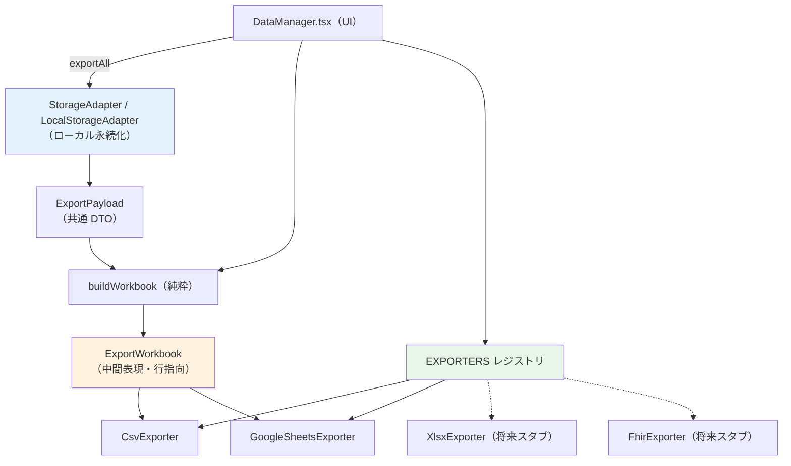
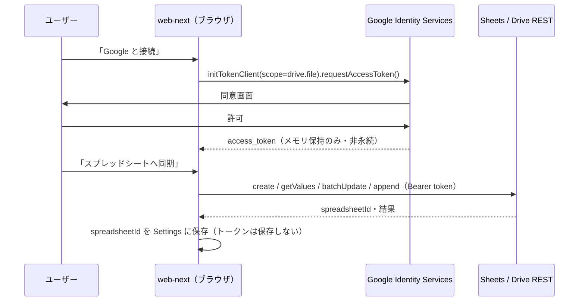

# Google スプレッドシート同期（v1）── PROM / 頭痛日誌 外部連携 設計書

> **文書種別**: 詳細設計書（実装指示書を兼ねる）
> **対象機能**: 頭痛日誌・PROM スコアの外部エクスポート／同期（Google スプレッドシート・CSV）
> **位置づけ**: `docs/prom-patient-checker-design.md` 第 8.3 章（差し替え可能な永続化アダプタ）／第 9 章（将来のアカウント・同期）の続編
> **更新日**: 2026-07-02
> **スコープ区分**: 教育・自己記録支援ツール。**薬機法上の医療機器（SaMD）に非該当**。診断・治療の意思決定には用いない
> **実装者向け注記**: 本書は Sonnet 等のエージェントが単独で実装できる粒度で記述する。第 12 章のフェーズ順・コミット単位・第 13 章のスキル/ルール呼び出しを厳守すること

---

## 0. エグゼクティブサマリー

`web-next` の PROM チェッカーは、頭痛日誌と 4 種の PROM スコア（HIT-6 / MIDAS / MSQ v2.1 / PGIC）および疼痛スケール（NRS / VAS）を localStorage のみに保持し、外部連携は JSON エクスポート／インポートと印刷に限られる。本設計は、これらの**具体的な記録値を Google スプレッドシートへ手動・一方向で同期**し、あわせて **CSV エクスポート**を提供する。さらに Excel（xlsx）や医療機関で用いられる標準形式（FHIR 等）への将来拡張に耐える抽象化を導入する。

確定した設計判断は次のとおり（すべてユーザー確認済み）。

| 論点 | 決定 | 根拠 |
|------|------|------|
| 認証方式 | クライアント側 GIS（Google Identity Services トークンモデル） | Client ID のみで秘密情報が不要。データはユーザー自身の Google アカウントへ直送され、静的デプロイを維持でき、第 9 章のゼロ知識原則に整合する |
| 同期の向き・契機 | 手動・一方向 upsert（app → Sheets、id キーで追加＋既存行更新） | 実装が単純で競合が起きにくい。アプリを正の源泉とする |
| v1 実装範囲 | Google Sheets ＋ CSV を実装、xlsx / FHIR は設計スタブ | 共通の Workbook モデルを再利用。CSV は Excel 対応の布石であり外部依存の追加が不要 |

**設計の核**は、`ExportPayload`（既存 DTO）→ `ExportWorkbook`（純粋な中間表現）→ `ReportExporter`（複数実装）という三層分離である。これにより Google Sheets・CSV・将来の xlsx / FHIR が同一の純粋変換コアを再利用できる。

---

## 1. 背景・目的・スコープ

### 1.1 背景

現行の永続化は `web-next/lib/prom/storage.ts` の `LocalStorageAdapter`（`StorageAdapter` 実装）に閉じており、外部出力は `web-next/components/prom/views/DataManager.tsx` の JSON ダウンロードと `web-next/components/prom/views/ReportView.tsx` の印刷のみ。医療者との共有や表計算ソフトでの二次利用には、行指向の表形式での書き出しと、継続記録に適した同期先が求められている。

`StorageAdapter` インターフェース（`web-next/lib/prom/types.ts` 第 260 行付近）と `exportAll()` が返す `ExportPayload` は、当初から「同期先への差し替え」を想定して設計されている。本書はその想定を具体化する。

### 1.2 目的

- 頭痛日誌・PROM スコアの**具体値**を、ユーザー自身の Google スプレッドシートへ手動同期できるようにする。
- 同じデータを CSV としてもダウンロードでき、Excel 等で開けるようにする。
- 永続化（`StorageAdapter`）と外部エクスポート（`ReportExporter`）を**別抽象として分離**し、将来の出力先追加を「レジストリ登録のみ」で可能にする。
- 秘密情報を持たず、機微データをログ・外部サーバに残さない実装とする（第 9 章）。

### 1.3 スコープ

| 区分 | 項目 |
|------|------|
| In（v1 実装） | Google Sheets 同期（作成・手動 upsert）／ CSV エクスポート ／ 中間表現 `ExportWorkbook` ／ `ReportExporter` 抽象とレジストリ ／ `DataManager` への UI 追加 ／ `spreadsheetId` の設定保存 |
| In（設計のみ・スタブ） | xlsx 直接生成（SheetJS 等）／ FHIR `QuestionnaireResponse` 出力 ／ 双方向同期・自動同期 |
| Out（本設計の対象外） | サーバサイド OAuth・トークン永続化 ／ 複数端末リアルタイム同期 ／ 医療機関 EHR への直接連携 ／ 認証済みユーザーアカウント基盤 |

---

## 2. ユーザーストーリー

- **US-1**: 患者として、頭痛日誌の各記録（日付・NRS・服薬・誘因など）を自分の Google スプレッドシートに蓄積し、受診時に医師へ共有したい。
- **US-2**: 患者として、PROM スコア（HIT-6 合計やバンド、MSQ ドメイン得点など）を時系列でスプレッドシートに残し、経過を自分でも眺めたい。
- **US-3**: 患者として、オフラインでも CSV をダウンロードし、Excel で開いて印刷・保管したい。
- **US-4**: 開発者として、将来 Excel 直接出力や医療標準形式（FHIR）を追加するときに、既存の変換ロジックを壊さず**新しいエクスポータを 1 つ足すだけ**で対応したい。
- **US-5**: 患者として、同期は自分が押したときだけ行われ、送信前に何が送られるか確認できる安心感が欲しい。

---

## 3. アーキテクチャ概要

永続化と外部エクスポートを**明確に別レイヤ**とする。両者の共通入力は `store.exportAll()` が返す `ExportPayload` である。Google Sheets を `StorageAdapter` に押し込めない（永続化契約と同期契約は責務が異なる）。



レイヤ責務は次のとおり。

| レイヤ | 場所（新規/既存） | 純粋性 | 責務 |
|--------|-------------------|--------|------|
| 永続化 | `lib/prom/storage.ts`（既存） | I/O あり | localStorage への保存・`exportAll()` |
| 中間表現ビルダー | `lib/export/workbook.ts`・`flatten.ts`（新規） | **純粋** | `ExportPayload` → `ExportWorkbook` 変換・平坦化 |
| エクスポータ契約 | `lib/export/types.ts`・`registry.ts`（新規） | 型・宣言 | `ReportExporter` インターフェースと一覧 |
| CSV | `lib/export/csv.ts`（新規） | 生成は純粋 / DL は I/O | `toCsv` ＋ `CsvExporter` |
| Google 連携 | `lib/export/google/*`（新規） | I/O（注入可能） | GIS 認証・REST・upsert |
| UI | `components/prom/views/DataManager.tsx`（既存拡張） | React | 接続・同意・同期・DL |

---

## 4. 中間表現とエクスポータ抽象（本設計の核）

### 4.1 なぜ中間表現を挟むのか

出力先ごとに `DiaryEntry` / `ScoreRecord` を直接触ると、フィールドの平坦化ロジック（ネストした `nrs` / `sleep` / `drugs[]`、チップ配列、`domains` / `context`）が各エクスポータへ重複する。**行指向の中間表現 `ExportWorkbook` を 1 箇所で組み立て**、各エクスポータはそれを消費するだけにすることで、平坦化ロジックを単一責務・単一テスト対象に集約できる（拡張時の変更コストを最小化する。ルール 10 の「なぜ」＝重複と乖離の排除）。

### 4.2 型定義（新規 `web-next/lib/export/types.ts`）

`Result<T>` は既存 `web-next/lib/prom/types.ts` の定義を再利用する（`{ ok: true; value: T } | { ok: false; error: string }`）。

```ts
import type { Result } from "@/lib/prom/types";

/** セル値。医療値は数値・文字列・真偽・空のみ（オブジェクトは平坦化済み前提）。 */
export type Cell = string | number | boolean | null;

/** 列定義。key は安定した機械キー、header は日本語表示見出し。 */
export interface ColumnDef {
  key: string;
  header: string;
}

/** 1 タブ分の表。rows は columns と同順。keyColumnKey が upsert のキー列。 */
export interface SheetTable {
  name: string;
  columns: ColumnDef[];
  rows: Cell[][];
  keyColumnKey: string;
}

/** 出力先非依存のワークブック（中間表現）。 */
export interface ExportWorkbook {
  meta: { schemaVersion: string; builtAt: string };
  tables: SheetTable[];
}

export type ExporterId = "google-sheets" | "csv" | "xlsx" | "fhir";

/** エクスポート結果（人間可読メッセージと成果物 URL・行数）。 */
export interface ExportOutcome {
  target: ExporterId;
  detail: string;
  resourceUrl?: string;
  syncedAt: string;
  rowCounts: Record<string, number>;
}

/** I/O を注入する実行コンテキスト（テスト容易性と純粋境界の確保）。 */
export interface ExportContext {
  now: () => Date;
  fetchImpl?: typeof fetch;
  google?: {
    accessToken: string;
    spreadsheetId?: string;
    /** 新規作成した spreadsheetId を設定へ保存するコールバック。 */
    onSpreadsheetCreated?: (id: string) => Promise<void>;
  };
}

/** すべての出力先が満たす契約。 */
export interface ReportExporter {
  readonly id: ExporterId;
  readonly label: string;
  /** 実行環境で利用可能か（例: window/GIS の有無）。false ならボタンを無効化。 */
  readonly available: boolean;
  export(workbook: ExportWorkbook, ctx: ExportContext): Promise<Result<ExportOutcome>>;
}
```

### 4.3 レジストリ（新規 `web-next/lib/export/registry.ts`）

PROM の宣言的レジストリ（`web-next/lib/prom/registry.ts`）に倣い、宣言のみで一覧化する。将来のエクスポータは配列に 1 要素追加するだけで UI に現れる。

```ts
import { CsvExporter } from "./csv";
import { GoogleSheetsExporter } from "./google/googleSheetsExporter";
import type { ReportExporter } from "./types";

/** 表示順に並べる。将来 xlsx / fhir をここへ追加する。 */
export function buildExporters(): ReportExporter[] {
  return [new GoogleSheetsExporter(), new CsvExporter()];
}
```

### 4.4 純粋ビルダー（新規 `web-next/lib/export/workbook.ts`）

```ts
import type { ExportPayload } from "@/lib/prom/types";
import { diaryColumns, diaryRow, scoreColumns, scoreRow } from "./flatten";
import { SCHEMA_VERSION } from "@/lib/prom/storage";
import type { ExportWorkbook } from "./types";

export function buildWorkbook(
  payload: ExportPayload,
  opts?: { now?: () => Date }
): ExportWorkbook {
  const now = opts?.now ?? (() => new Date());
  return {
    meta: { schemaVersion: SCHEMA_VERSION, builtAt: now().toISOString() },
    tables: [
      {
        name: "頭痛日誌",
        columns: diaryColumns,
        rows: payload.diary.map(diaryRow),
        keyColumnKey: "id",
      },
      {
        name: "PROMスコア",
        columns: scoreColumns,
        rows: payload.promScores.map(scoreRow),
        keyColumnKey: "recordKey",
      },
    ],
  };
}
```

平坦化（新規 `web-next/lib/export/flatten.ts`）は純粋関数群として実装する。列定義（`ColumnDef[]`）と行生成（`Cell[]`）を対で持ち、順序を決定論的にする。第 5 章のマッピング表に従う。

---

## 5. データマッピング

> **重要**: 頭痛日誌タブの列順・見出しは、ユーザー提供の共有シート例を正とする。実装前に必ず**付録 A の照合手順**を実施し、本章の暫定列と差異があれば `flatten.ts` の `diaryColumns` を共有シート例に合わせて調整すること。

### 5.1 頭痛日誌タブ（`DiaryEntry` 由来）

`DiaryEntry`（`web-next/lib/prom/types.ts`）を 1 行へ平坦化する。チップ配列は `"・"` 結合、服薬は 1 セルへ整形。

| key | header | 由来 | 変換 |
|-----|--------|------|------|
| `date` | 日付 | `date` | そのまま（YYYY-MM-DD） |
| `startTime` | 開始 | `startTime` | HH:MM |
| `endTime` | 終了 | `endTime` | HH:MM |
| `durationMin` | 継続（分） | `startTime`/`endTime` | `timeDiffMins()`（`components/prom/state.ts`）で算出 |
| `sides` | 部位（左右） | `sides[]` | `joinChips` |
| `locations` | 部位 | `locations[]` | `joinChips` |
| `quality` | 性状 | `quality[]` | `joinChips` |
| `nrsOnset` | NRS発症 | `nrs.onset` | number / 空 |
| `nrsPeak` | NRSピーク | `nrs.peak` | number / 空 |
| `nrsPost2h` | NRS2h後 | `nrs.post2h` | number / 空 |
| `symptoms` | 随伴症状 | `symptoms[]` | `joinChips` |
| `aura` | 前兆 | `aura[]` | `joinChips` |
| `prodrome` | 予兆 | `prodrome[]` | `joinChips` |
| `drugs` | 服薬 | `drugs[]` | `formatDrugs`（下記） |
| `triggers` | 誘因 | `triggers[]` | `joinChips` |
| `bedtime` | 就床 | `sleep.bedtime` | HH:MM |
| `waketime` | 起床 | `sleep.waketime` | HH:MM |
| `sleepQuality` | 睡眠質 | `sleep.quality` | number / 空 |
| `stress` | ストレス | `sleep.stress` | number / 空 |
| `impact` | 生活影響 | `impact` | `impactLabel()`（`components/prom/state.ts`） |
| `createdAt` | 記録時刻 | `createdAt` | ISO |
| `id` | 記録ID（キー） | `id` | **upsert キー列** |

服薬整形（純粋）:

```ts
export function formatDrugs(drugs: DiaryDrug[]): string {
  // 例: "ロキソプロフェン(simple-nsaid)/60mg/08:30/効果4; スマトリプタン(...)/..."
  return drugs
    .map((d) => `${d.name}(${d.class})/${d.dose}/${d.time}/効果${d.effectNrs2h ?? "-"}`)
    .join("; ");
}
```

### 5.2 PROM スコアタブ（`ScoreRecord` 由来）

`ScoreRecord`（`web-next/lib/prom/types.ts`）を 1 行へ。方式によって使う列が異なるため、全列を用意し欠損は空にする。

| key | header | 由来 | 備考 |
|-----|--------|------|------|
| `date` | 記録日 | `date` | YYYY-MM-DD |
| `instrumentId` | 指標 | `instrumentId` | hit6 / midas / msq-v2.1 / pgic / nrs / vas |
| `instrumentVersion` | 版 | `instrumentVersion` | |
| `total` | 合計 | `total` | sum / ordinal |
| `band` | バンド | 導出 | `bandFor()`（`lib/prom/scoring.ts`）の `label`。sum 指標のみ |
| `domainRfr` | MSQ_RFR | `domains.rfr` | 0–100 |
| `domainRfp` | MSQ_RFP | `domains.rfp` | 0–100 |
| `domainEf` | MSQ_EF | `domains.ef` | 0–100 |
| `contextA` | MIDAS_総頭痛日数 | `context.A` | 補助項目 |
| `contextB` | MIDAS_平均NRS | `context.B` | 補助項目 |
| `value` | 疼痛値 | `value` | NRS / VAS |
| `interpretation` | 解釈 | `interpretation` | favorable 等 |
| `createdAt` | 記録時刻 | `createdAt` | ISO |
| `recordKey` | レコードID（キー） | 導出 | `` `${instrumentId}_${createdAt}` `` を **upsert キー列**とする |

### 5.3 upsert キーの原則

- 頭痛日誌: `DiaryEntry.id`（`diary_${Date.now()}`）は端末内で一意。これをキー列にすると編集は同一行更新・新規は追加になる。
- PROM スコア: `id` を持たないため `${instrumentId}_${createdAt}` を合成キーとする。`createdAt` は保存時刻で実質一意。

---

## 6. Google Sheets 同期詳細

### 6.1 認証フロー（GIS トークンモデル）



### 6.2 スコープと最小権限

- スコープは `https://www.googleapis.com/auth/drive.file` のみ。**アプリが作成したファイルだけ**にアクセスでき、ユーザーの既存 Drive 全体は読めない（データ最小化・第 9 章）。
- アプリが自らスプレッドシートを新規作成し、以後はその `spreadsheetId` を再利用する。ユーザーの任意シートには書き込まない（ユーザー提供の共有シート例は**レイアウトの参考**であり、書き込み先ではない）。
- Client ID は `NEXT_PUBLIC_GOOGLE_CLIENT_ID`（公開値・秘密ではない）。`.env` はコミットせず `.env.example` のみを置く。

### 6.3 GIS ラッパー（新規 `web-next/lib/export/google/gis.ts`）

- `https://accounts.google.com/gsi/client` を動的読み込み（`<script>` 注入、多重防止）。
- `initTokenClient` をラップし、`requestAccessToken()` を `Promise<Result<{ accessToken: string }>>` として提供。
- トークンは**メモリ（呼び出し元の React state）にのみ**保持し、localStorage へ書かない。`window.google` 型は `web-next/types/` に最小 `.d.ts` を追加（`any` 禁止・`unknown` からの型ガード）。

### 6.4 REST クライアント（新規 `web-next/lib/export/google/sheetsClient.ts`）

`fetch` を注入可能にし（`ExportContext.fetchImpl`）、レスポンスは型ガードで検証する（外部入力バリデーション）。

| メソッド | エンドポイント | 用途 |
|----------|----------------|------|
| `createSpreadsheet(title, tabs)` | `POST /v4/spreadsheets` | タブ付きシート新規作成 → `spreadsheetId` |
| `getValues(id, range)` | `GET /v4/spreadsheets/{id}/values/{range}` | キー列読み出し |
| `batchUpdateValues(id, data)` | `POST /v4/spreadsheets/{id}/values:batchUpdate` | 既存行の更新 |
| `appendValues(id, range, values)` | `POST /v4/spreadsheets/{id}/values/{range}:append` | 新規行の追加 |

すべて `Authorization: Bearer {accessToken}`、`valueInputOption=RAW`。各メソッドは `Result` を返し、HTTP 非 2xx は `{ ok: false, error }` に変換（エラーを握りつぶさない）。

### 6.5 upsert アルゴリズム（純粋 `computeUpsert`）

差分計算は純粋関数として `googleSheetsExporter.ts` から分離し、単体テストする。

```ts
export interface UpsertPlan {
  updates: { dataRowIndex: number; values: Cell[] }[]; // 0-based（ヘッダ除く）
  appends: Cell[][];
}

/** existingKeys: シートの現在のキー列（ヘッダ除く上→下）。keyColIndex: rows 内のキー列位置。 */
export function computeUpsert(
  existingKeys: string[],
  rows: Cell[][],
  keyColIndex: number
): UpsertPlan {
  const indexByKey = new Map<string, number>();
  existingKeys.forEach((k, i) => indexByKey.set(k, i));
  const updates: UpsertPlan["updates"] = [];
  const appends: Cell[][] = [];
  for (const row of rows) {
    const key = String(row[keyColIndex]);
    const found = indexByKey.get(key);
    if (found === undefined) {
      appends.push(row);
      continue; // 早期継続でネスト削減
    }
    updates.push({ dataRowIndex: found, values: row });
  }
  return { updates, appends };
}
```

`GoogleSheetsExporter.export()` の手順（タブごと）:

1. `spreadsheetId` 未保持なら `createSpreadsheet` で作成し、ヘッダ行を書き込み、`onSpreadsheetCreated` で設定へ保存。
2. `getValues(id, "'{tab}'!A2:A")` でキー列を取得 → `existingKeys`。
3. `computeUpsert` で `updates` / `appends` を算出。
4. `updates` を `batchUpdateValues`（各 `dataRowIndex` → `A{n+2}:{lastCol}{n+2}` レンジ）でまとめて更新。
5. `appends` を `appendValues("'{tab}'!A:A", ...)` で追加。
6. `ExportOutcome`（`resourceUrl = https://docs.google.com/spreadsheets/d/{id}`、`rowCounts`）を返す。

### 6.6 エラー・リトライ・レート

- 401（トークン失効）: `Result` エラーとして UI に返し、再接続を促す（自動再取得はしない。単純さ優先）。
- 429 / 5xx: v1 は 1 回のみ短い指数バックオフ再試行、それ以外は失敗として返す。
- ネットワーク不通: `Result` エラー。CSV 退避を案内。

---

## 7. CSV エクスポート詳細

- 新規 `web-next/lib/export/csv.ts` に純粋関数 `toCsv(table: SheetTable): string`（RFC 4180 準拠。`"` を `""` にエスケープし、`,` / 改行 / `"` を含むセルは全体を `"` で囲む）。
- Excel の日本語文字化け回避のため、ダウンロード時に **UTF-8 BOM**（``）を先頭付与する。
- `CsvExporter implements ReportExporter`: `export()` はブラウザで各タブを個別 CSV としてダウンロード（`DataManager.onExport()` の Blob ／ `URL.createObjectURL` パターンを流用）。ファイル名は `` `headache-${table.name}-${todayISO()}.csv` ``（`todayISO()` は `components/prom/state.ts`）。
- `available` は `typeof window !== "undefined"`。

---

## 8. UI / コンポーネント設計

`web-next/components/prom/views/DataManager.tsx` に「外部連携・同期」カードを追加する（既存の JSON/設定カードは不変）。

- **エクスポータ供給**: 新規フック `web-next/components/prom/useExporters.ts` が `buildExporters()` を返す。
- **CSV**: 「頭痛日誌 CSV」「PROM スコア CSV」ボタン。押下で `store.exportAll()` → `buildWorkbook` → `CsvExporter.export`。
- **Google 接続**: 「Google と接続」ボタン → `gis.requestAccessToken()` → 取得トークンをコンポーネント state（メモリ）へ。接続済みバッジを表示。
- **同意**: 初回同期の前に同意ダイアログ（送信項目＝日誌・スコアの一覧、送信先＝自分の Google Drive、送信されない物＝生の識別情報がない旨）。既存 `web-next/components/prom/UrgentDialog.tsx` のダイアログ様式を流用（または同等の確認 UI）。
- **同期**: 「スプレッドシートへ同期」ボタン → `GoogleSheetsExporter.export(workbook, ctx)`。`ctx.google.spreadsheetId` は `settings.syncTargets?.googleSheets?.spreadsheetId`、`onSpreadsheetCreated` は `commit()` で設定へ保存。完了後に `resourceUrl` をリンク表示し `lastSyncedAt` を保存。
- **状態表示**: 最終同期日時（`settings.syncTargets.googleSheets.lastSyncedAt`）。エラー時は `toast()` に `Result.error` を表示。

Settings 拡張（追加のみ・`web-next/lib/prom/types.ts`）:

```ts
export interface Settings {
  // 既存フィールドは不変。
  syncTargets?: {
    googleSheets?: { spreadsheetId: string; lastSyncedAt: string };
  };
}
```

`web-next/components/prom/state.ts` の `loadData()` 正規化で `syncTargets` を安全に読み込む（未定義許容）。**アクセストークンは保存しない**。

---

## 9. セキュリティ・プライバシー・法規制

`docs/prom-patient-checker-design.md` 第 9 章の原則を継承・具体化する。

- **オプトイン**: 既定は端末内保存のまま。同期はユーザーが接続・押下したときだけ実行する。
- **トークン非永続**: アクセストークンはメモリのみ。localStorage・Cookie・ログに残さない。保存するのは非機微の `spreadsheetId` と `lastSyncedAt` のみ。
- **秘密情報ゼロ**: OAuth Client Secret を使わない設計。Client ID は公開値で `NEXT_PUBLIC_GOOGLE_CLIENT_ID`（env）。`.env` はコミット禁止、`.env.example` のみ。ハードコード禁止。
- **最小権限**: `drive.file` スコープ。アプリ作成ファイル以外にアクセスしない。
- **データ最小化**: 送信は日誌・スコアの記録値のみ。氏名・生年月日等の識別子はアプリが保持せず、送信もしない。
- **ログ禁止**: 機微データ・トークンを `console` へ出力しない（グローバル規約）。
- **事前同意**: 初回送信前に送信内容・送信先を明示する同意ダイアログ。
- **外部入力検証**: Sheets / Drive API のレスポンスは型ガードで検証してから使用（`any` 禁止・`unknown` から絞り込み）。
- **教育専用ディスクレーマー**: 本機能の出力は自己記録の補助であり、診断・治療判断には用いない。
- **薬機法 SaMD 非該当**: 記録の転記・書式変換に限定し、診断・治療・重症度自動判定を行わないため医療機器に該当しない。

---

## 10. 拡張性設計（将来スタブ）

新エクスポータ追加は「純粋コアを再利用し、`ReportExporter` を 1 実装追加して `buildExporters()` に登録するだけ」で完結する。

- **xlsx（`XlsxExporter`）**: `ExportWorkbook` を SheetJS 等でブック化しダウンロード。**外部依存の追加が必要**なため、導入時は事前にユーザー確認（グローバル規約「外部依存の追加は要確認」）。`available` を依存有無で切り替える。
- **FHIR（`FhirExporter`）**: PROM は FHIR `QuestionnaireResponse`、頭痛日誌は `Observation` 群へ写像するのが標準。`instrumentId` → `Questionnaire.canonical`、各設問 → `item.answer` に対応づける。医療機関連携（「主要な医療ファイル」）の本命だが、コード体系整備が要るため v1 はインターフェース確保のみ。
- **共通拡張ポイント**: 平坦化に列を足す場合は `flatten.ts` の `*Columns` と `*Row` を対で更新する（順序整合を保つ）。`ExportWorkbook` にタブを足しても既存エクスポータは自動対応する。

---

## 11. テスト戦略

Vitest（`web-next/vitest.config.ts`）でソース同居の `*.test.ts` を追加。**純粋関数を優先**し、Google はライブで叩かず注入した `fetch` モックで検証する（既存 `web-next/lib/prom/storage.test.ts` の注入方式に倣う）。AAA パターン、正常系・異常系の双方を書く。

| テストファイル | 対象 | 主なケース |
|----------------|------|------------|
| `lib/export/flatten.test.ts` | `diaryRow` / `scoreRow` / `formatDrugs` / `joinChips` | ネスト平坦化・空値・チップ結合・服薬整形 |
| `lib/export/workbook.test.ts` | `buildWorkbook` | タブ数・列順・行数・`keyColumnKey` |
| `lib/export/csv.test.ts` | `toCsv` | カンマ/改行/引用符のエスケープ・BOM・空表 |
| `lib/export/google/sheetsClient.test.ts` | REST クライアント | 注入 fetch で 2xx 成功・非 2xx を `Result` エラー化・型ガード |
| `lib/export/google/googleSheetsExporter.test.ts` | `computeUpsert` / `export` | 追加のみ・更新のみ・混在・キー欠損／作成分岐（`onSpreadsheetCreated` 呼出） |
| `lib/prom/storage.test.ts`（拡張） | `syncTargets` 正規化 | 未定義許容・トークン非保存 |
| `components/prom/views/DataManager.test.tsx` | UI 契約 | 同期カード・CSV ボタン・接続ボタンの描画（エクスポータはモック） |

検証コマンド: `bun run test` / `bun run typecheck` / `bun run lint <paths>` / `bun run build`（すべて成功が各フェーズ完了条件）。

---

## 12. 実装タスク（ステップバイステップ ＋ コミット）

**前提（必読）**: 着手前に `.claude/rules/tdd-mandatory-cycle.md` を読む。各ステップは Red（失敗するテスト）→ Green（実装）の順で、`test` コミットと `feat`/`chore` コミットを**分離**する。1 コミットに test・実装・docs を混在させない。各コミット前に `bun run lint <対象パス>` / `bun run typecheck` / `bun run test` を通し、フェーズ完了時に `bun run build` を通す。コミット前に第 13 章の絶対パス grep を実行する。

依存関係と並列性（ルール 6）:

- フェーズ 0 → 1 → 2 は直列（型・純粋コアが土台）。
- **フェーズ 3（Google）とフェーズ 4（Settings）は並列実行可能**（担当を分ければ独立）。
- フェーズ 5（UI）は 2・3・4 の完了に依存。フェーズ 6 は最後。

### フェーズ 0 — 足場（chore）

- `web-next/.env.example` に `NEXT_PUBLIC_GOOGLE_CLIENT_ID=` を追加（値は空・コメントで取得手順を付録 B 参照と明記）。`web-next/.gitignore` に `.env*`（`!.env.example`）が無ければ追加。
- `web-next/lib/export/types.ts` を第 4.2 章の内容で新規作成。
- `web-next/types/google-gis.d.ts` に `window.google.accounts.oauth2` の最小型を定義（`any` 不使用）。
- 検証: `bun run typecheck`。
- コミット: `chore(web-next): scaffold export module and GIS env config`

### フェーズ 1 — Workbook コア（純粋）

- Red: `web-next/lib/export/flatten.test.ts` と `web-next/lib/export/workbook.test.ts`（第 11 章のケース）。
- コミット: `test(web-next): add failing tests for export workbook builders`
- Green: `web-next/lib/export/flatten.ts`（`diaryColumns`/`diaryRow`/`scoreColumns`/`scoreRow`/`joinChips`/`formatDrugs`）と `web-next/lib/export/workbook.ts`（`buildWorkbook`）。第 5 章のマッピング表に厳密準拠。
- 検証: `bun run test lib/export` / `bun run typecheck`。
- コミット: `feat(web-next): add pure workbook/flatten export core`

### フェーズ 2 — CSV エクスポータ

- Red: `web-next/lib/export/csv.test.ts`（エスケープ・BOM・空表）。
- コミット: `test(web-next): add failing CSV serializer tests`
- Green: `web-next/lib/export/csv.ts`（`toCsv` ＋ `CsvExporter`）。
- コミット: `feat(web-next): add CSV exporter`

### フェーズ 3 — Google Sheets クライアント／upsert（フェーズ 4 と並列可）

- Red: `web-next/lib/export/google/sheetsClient.test.ts`（注入 fetch）、`web-next/lib/export/google/googleSheetsExporter.test.ts`（`computeUpsert` 全分岐・作成分岐）。
- コミット: `test(web-next): add failing Google Sheets client/upsert tests`
- Green: `web-next/lib/export/google/gis.ts` / `sheetsClient.ts` / `googleSheetsExporter.ts`。レスポンスは型ガードで検証、全 API は `Result` 返却。
- コミット: `feat(web-next): add Google Sheets sync exporter (GIS token flow)`

### フェーズ 4 — Settings 永続化（フェーズ 3 と並列可）

- Red: `web-next/lib/prom/storage.test.ts` に `syncTargets` 正規化ケースを追加（未定義許容・トークン非保存）。
- コミット: `test(web-next): cover sync target settings normalization`
- Green: `web-next/lib/prom/types.ts` の `Settings` に `syncTargets` を追加し、`web-next/components/prom/state.ts` の `loadData()` 正規化に反映。
- コミット: `feat(web-next): persist Google Sheets spreadsheetId in settings`

### フェーズ 5 — UI 配線（2・3・4 完了後）

- Red: `web-next/components/prom/views/DataManager.test.tsx`（同期カード・CSV ボタン・接続ボタンの描画。エクスポータはモック）。
- コミット: `test(web-next): add failing DataManager sync UI contract`
- Green: `web-next/components/prom/useExporters.ts` 新規、`web-next/components/prom/views/DataManager.tsx` に「外部連携・同期」カード・同意ダイアログ・接続/同期ハンドラを追加。`registry.ts` も本フェーズで追加（`buildExporters`）。
- 検証: `bun run test` / `bun run typecheck` / `bun run lint` / `bun run build`。
- コミット: `feat(web-next): wire external sync/CSV UI into data manager`

### フェーズ 6 — ドキュメント同期

- `spec-sync` スキルを起動し、`GEMINI.md`（SSoT）＝`CLAUDE.md`、`PROGRESS.md` を実態へ更新。本設計書へのリンクを追記。
- `.markdownlint.json` 準拠を確認（MD031/MD012/MD047）。
- コミット: `docs(web-next): document Google Sheets sync design and update specs`

---

## 13. スキル・ルール呼び出しチェックリスト

実装中に以下を漏れなく呼び出す・遵守する。

| 種別 | 名称 | いつ | 目的 |
|------|------|------|------|
| ルール（必読・強制） | `.claude/rules/tdd-mandatory-cycle.md` | 着手時／各コミット | Red→Green→コミットを 1 ステップずつ。test・実装・docs を混在させない |
| ルール（必須） | `.claude/rules/no-absolute-paths.md` | 各コミット前 | 絶対パス・ユーザー名の混入禁止。下記 grep を実行 |
| スキル | `nextjs-page-migration` | 実装全般 | アーキタイプ B（純粋コア＋アダプタ＋シェル）の TDD・命名・コミット分割・`bun` 必須の規約を準用 |
| スキル | `pre-commit-check` | 各コミット前（最低 push 前） | markdown lint・Mermaid テスト・`bun run build`＋`test` を検証 |
| スキル | `spec-sync` | フェーズ 6 | `GEMINI.md`＝`CLAUDE.md`＝`PROGRESS.md` を実態同期 |
| スキル | `check-docs-sync` | push 後 | ドキュメント更新漏れ検出 |
| スキル | `markdown-formatter` | 本設計書／docs 編集時 | `.markdownlint.json` 準拠整形（MD031/MD012/MD047） |
| スキル | `glossary-term-tooltip` | 任意 | 同期 UI 文言に新規医学用語が出た場合のみ |
| スキル | `ai-driven-development-guidelines` | 設計・タスク記述時 | ルール 3（成果物レビュー）・6（並列性明記）・10（根拠明記） |
| グローバル規約 | `~/.claude/CLAUDE.md` | コード全般 | `any` 禁止→`unknown`＋型ガード／`Result` 型／早期リターン／外部入力検証／秘密ハードコード禁止／機微ログ禁止／外部依存追加は要確認 |

コミット前の絶対パス検証（`.claude/rules/no-absolute-paths.md`）:

```bash
git diff --cached | grep -E '^\+[^+]' | grep -E '(/Users/|/home/|C:\\Users\\)' | grep -vE 'johndoe'
```

出力があれば相対パスへ修正してからコミットする。

---

## 付録 A: 共有シート例との列照合手順

頭痛日誌タブの列は**ユーザー提供の共有シート例を正**とする。実装前に必ず次を実施する。

1. 共有シート例をブラウザで開く（URL: `https://docs.google.com/spreadsheets/d/REDACTED-SPREADSHEET-ID/edit`）。※本 URL は**レイアウト参照専用**。アプリの書き込み先ではない。
2. 日誌タブの見出し行（1 行目）の**列順・ラベル文言**を書き出す。
3. 第 5.1 章の暫定列と差異があれば、`web-next/lib/export/flatten.ts` の `diaryColumns` と `diaryRow` を**対で**共有シート例に合わせて修正する（順序整合を維持）。
4. 例に無い派生列（`durationMin` など）を残す場合は末尾に寄せ、キー列（`id`）が存在することを保証する。
5. 変更後は `lib/export/workbook.test.ts` の期待値も更新し、`bun run test` を通す。

## 付録 B: Google Cloud Console 設定

同期を実際に有効化するための一度きりの設定（コード変更不要）。

1. Google Cloud Console でプロジェクトを作成し、**Google Sheets API** と **Google Drive API** を有効化する。
2. 「OAuth 同意画面」を構成（外部・テスト or 本番）。スコープに `.../auth/drive.file` を追加。
3. 「認証情報」→ OAuth 2.0 クライアント ID（**ウェブアプリケーション**）を作成。
4. 「承認済み JavaScript 生成元」に本アプリの配信オリジン（例: `http://localhost:3000` と本番ドメイン）を登録。
5. 発行された Client ID を `web-next/.env.local` の `NEXT_PUBLIC_GOOGLE_CLIENT_ID` に設定（`.env.local` はコミットしない）。
6. `bun run dev` で起動し、「Google と接続」→同意→「スプレッドシートへ同期」で Drive に新規スプレッドシートが作成されること、日誌を編集して再同期すると同一行が更新（upsert）されることを確認する。
