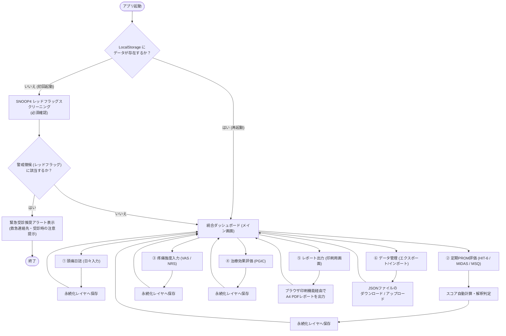
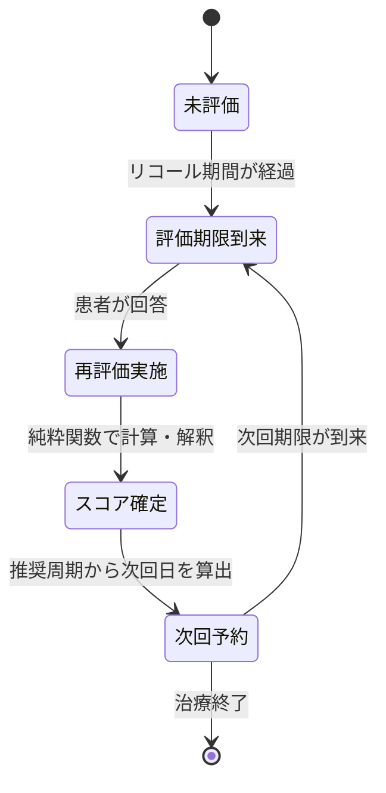
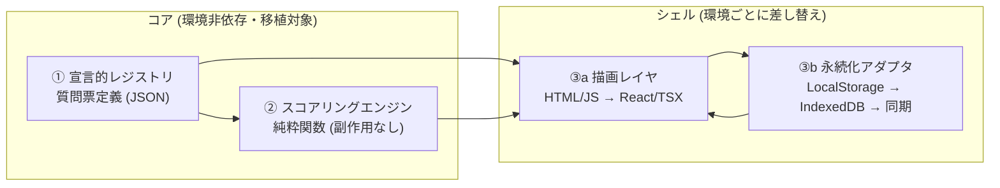

# 患者向け頭痛転帰測定（PROM）統合チェッカー HTML アプリケーション設計仕様書

本仕様書は、頭痛患者が自身の病状、日常生活への影響、QOL（生活の質）、および治療変化などを包括的かつ客観的に自己評価・記録し、医療従事者と共有するための「Web アプリケーション」の設計について規定します。

第一段階では**単一 HTML 完結型**として実装しますが、**Next.js への移行**および**将来のアカウント／サーバ同期**を前提に、移植容易性と拡張性を最優先したアーキテクチャを採用します。

> **典拠**: 本仕様の臨床ロジックはすべて `Types-of-headache/md-files/Patient-Reported-Outcome-Measures/` 配下の 6 つの教育用 Markdown（Headache-Diary / Headache-Impact-Test(HIT-6) / Migraine-Disability-Assessment(MIDAS) / Migraine-Specific-Quality-of-Life(MSQ v2.1) / Numerical-Rating-Scale-Visual-Analogue-Scale(NRS/VAS) / Patient-Global-Impression-of-Change(PGIC)）に基づきます。

---

## 1. システム概要と開発目的

### 1.1 背景と目的

頭痛医療において、患者が主観的に感じる症状や日常生活への支障度を捉える **患者報告アウトカム（PROM: Patient-Reported Outcome Measures）** は、診断や治療選択の最も重要な指標です。しかし、複数の質問票（HIT-6、MIDAS、MSQ v2.1 など）や日誌を手動で管理することは患者にとって大きな負担です。

本システムは、これらの評価ツールを 1 つの Web アプリに統合し、オフライン環境でも動作可能で、プライバシーを厳格に守りながら、スコアの自動計算と臨床的解釈の提示までを自己完結で行うことを目的とします。

### 1.2 アプリケーションの特長

- **段階的アーキテクチャ**: 第一段階は単一 `index.html`（バックエンド不要、ブラウザのみで動作）。第二段階で Next.js（App Router + TypeScript + Tailwind v4 を想定）へ移行。**コアロジックは両段階で 1:1 移植可能**な設計とする（第 8 章）。
- **ローカルファースト（local-first）**: 入力データは既定で**端末内（LocalStorage / IndexedDB）に保持**し、サーバへ送信しない。**将来はオプトインのエンドツーエンド暗号化同期**に対応できる永続化抽象を採用する（第 9 章）。プライバシーは既定挙動として担保する。
- **マルチデバイス対応**: レスポンシブ設計により、スマートフォン、タブレット、PC のいずれでも快適に操作可能。アクセシビリティ（大きなタップ領域、コントラスト、キーボード操作）を考慮する。
- **医師共有機能**: 印刷に最適化された A4 レポートを出力可能（PDF 化前提）。
- **データポータビリティ**: JSON 形式によるデータのエクスポートおよびインポートが可能（スキーマバージョン付き、第 7 章）。

### 1.3 重要な臨床上の前提（免責）

- 本ツールは**患者の自己評価・記録支援**を目的とし、**医師の診断ではない**。緊急性の判断や治療方針の決定は必ず医療従事者が行う。
- HIT-6 / MIDAS などの質問票は**前向き（プロスペクティブ）頭痛日誌を代替しない**（REFORM 2026）。治療効果の評価には日誌との併用が前提である。

---

## 2. アプリケーション構成フロー

患者がシステムを起動してから、日々の記録や評価を完了し、結果を出力するまでの基本フローを以下に示します。



---

## 3. 機能要件

### 3.1 SNOOP4 レッドフラッグスクリーニング

重大な二次性頭痛（生命に危険のある疾患）を未然に検出するため、初回起動時およびユーザーが任意のタイミングで実行できるスクリーニング機能です。

#### 判定項目とロジック

以下のチェックボックス項目のうち、**1 つでも「はい」に該当する場合**、画面全体に赤色のアラート警告を表示し、頭痛管理よりも即時受診を促します。

| 記号 | 項目名 | 患者向け確認チェック内容 | 該当時の医療的懸念（内部判定理由） |
|:---:|---|---|---|
| **S** | 全身の症状・兆候 | 発熱がある、首の後ろが硬くて曲がりにくい（項部硬直）、説明のつかない体重減少がある、がんの既往や免疫不全がある。 | 細菌性髄膜炎、脳炎、脳転移など |
| **N** | 神経の症状 | 手足の麻痺やしびれがある、言葉がうまく出ない、物が二重に見える、意識がぼんやりする、物忘れが急に進んだ。 | 脳卒中、脳腫瘍、硬膜下血腫など |
| **O** | 突然の発症 | 「人生で最も激しい頭痛」である、突然（数秒〜数分で）痛みのピークに達した（雷鳴頭痛）。 | くも膜下出血（SAH）など |
| **O** | 50歳以降の発症 | 50歳を過ぎてから、これまでに経験のない新しいタイプの頭痛が始まった。 | 側頭動脈炎、頭蓋内新生物など |
| **P** | パターンの変化 | 頭痛の頻度や強さがどんどん悪化している、頭をぶつけた後に始まった、寝ると悪化する（または起き上がると悪化する）。 | 頭蓋内圧亢進症、低髄液圧症など |
| **4** | 4つの特殊病態 | 医師から「乳頭浮腫」を指摘された、腰椎穿刺の後に始まった、けいれん発作の後に始まった、妊娠中または出産直後である。 | 静脈洞血栓症、子癇前症など |

> SNOOP4 はスコア化せず**ゲート（関門）**として機能する。陽性時はダッシュボードへの遷移をブロックし、受診を最優先で案内する。

---

### 3.2 頭痛日誌（Headache Diary）

毎日の頭痛の状況を前向き（プロスペクティブ）に記録する機能です。カレンダー UI または日付選択式の入力フォームを提供します。

> **設計要件（データ完全性）**: 頭痛日誌は**前向き記録が必須**であり、後ろ向き想起は診断的に信頼できない。電子日誌の記録遵守率は **94〜96%（紙は 71〜77%）** と高く、**各記録にタイムスタンプを付与しバックデート入力を禁止**することで「記録の遡及改変」を防ぐ。これをデータモデルの不変条件とする。

#### 記録項目一覧

- **日付・時刻**: 頭痛の開始日時、終了日時（自動的に持続時間を算出。ICHD-3 の診断基準: 片頭痛 4〜72 時間、緊張型頭痛 30 分〜7 日）。
- **痛みの部位**: 片側 / 両側、前頭 / 側頭 / 後頭 / 目の周り（複数選択可）。
- **痛みの性質**: 拍動性（ズキズキ）/ 非拍動性（締め付けられる・重い）/ 刺すような。
- **痛みの強度（NRS）**: 0（痛まない）〜10（想像しうる最悪の痛み）のスライダー。**発症時・ピーク時・服薬2時間後**の 3 時点を記録（IHS 標準）。**NRS ≥ 4 は急性期薬投与の標準的な目安**。
- **随伴症状**: 吐き気・嘔吐、光がまぶしい（光過敏）、音がうるさい（音過敏）、匂いが気になる（匂い過敏）（複数選択可）。
- **前兆の有無**: キラキラした光・ギザギザした光（閃輝暗点）、手足のしびれ、言葉の出にくさなど（チェックボックス）。運動麻痺・脳幹性前兆は要神経内科相談・トリプタン禁忌の可能性があり注意喚起する。
- **予兆・後兆**: あくび、首のこわばり、異常な疲労感、気分の変化など。
- **使用した薬剤**: 薬剤名（選択式＋自由記入）、用量、服用時刻、2 時間後の効果（NRS 再入力）。**MOH（薬剤の使用過多による頭痛）検出の基礎データ**となる。
- **誘発因子（トリガー）**: 睡眠不足/寝すぎ（週末の寝だめ >2 時間も誘因）、ストレス/ストレス解放、月経（開始日＝周期 Day 1）、特定の食べ物（チョコ、チーズ、赤ワイン等）、天候/気圧変化、欠食・脱水（<1.5L/日）・カフェイン離脱など。
- **睡眠・生活**: 就寝/起床時刻、睡眠の質（NRS 0〜10）、ストレスレベル（NRS 0〜10）。
- **日常生活への影響**: 0（影響なし）、1（軽度：仕事や家事は可能）、2（中等度：効率が低下）、3（重度：寝込む・何もできない）。MIDAS 算出の基礎となる。

#### MOH（薬剤の使用過多による頭痛）判定（ICHD-3 8.2）

服薬記録の月間集計から、以下を**自動判定**して安全域 / 注意 / 乱用超過を表示する。

| 薬剤分類 | 乱用とみなす服用日数 | 期間 |
|---|---|---|
| トリプタン / エルゴタミン / オピオイド / 複合鎮痛薬 | **月 10 日以上** | 3 ヶ月継続 |
| 単純鎮痛薬 / NSAIDs | **月 15 日以上** | 3 ヶ月継続 |

> 関連する閾値: **慢性片頭痛** = 月 15 頭痛日以上 × 3 ヶ月（ICHD-3 1.3）。**予防療法の検討** = 月 4 発作以上 または 月 8 頭痛日以上 または MIDAS ≥ 11。**治療反応（50% レスポンダー）** = 発作頻度または NRS の 50% 以上の減少。

---

### 3.3 疼痛強度評価（VAS / NRS シミュレーター）

現在の痛みの強さを直感的に記録するための入力インターフェースです。

#### ① VAS（Visual Analogue Scale）入力

- **UI 仕様**: 目盛りのない、左右幅 `100px`（またはレスポンシブな比率で `100%` に引き伸ばした線上）のスライダーコンポーネント。**数値ラベル・目盛り・中間注記は表示しない**（連続尺度の性質を保つ）。
- **アンカー表示**: 左端に「痛みなし」、右端に「想像しうる最悪の痛み」のみを表示。
- **内部処理**: スライダーのつまみの位置（0%〜100%）をミリメートル換算（0〜100）の実数データとして保存。前回値のアンカリング効果を防ぐため、初期値は中央ではなく「非表示（クリックまたはタップして初めてつまみが現れる）」または「左端」から開始します。

#### ② NRS（Numerical Rating Scale）入力

- **UI 仕様**: 0 から 10 までの丸ボタン（セグメントコントロール）または明示的に数字が振られたスライダー。**整数のみ**（小数・範囲は不可）。
- **アンカー表示**: 0 の位置に「痛みなし」、10 の位置に「想像しうる最悪の痛み」を表示。
- **内部処理**: 0〜10 の整数値として保存。

#### ③ MCID（最小臨床的重要差）と尺度の一貫性

治療効果の判定に用いる**臨床的に意味のある変化量**を解釈に組み込む。

| 尺度 | MCID（改善の目安） | 補足 |
|---|---|---|
| NRS | **−2.0 点（≈30% 減）** | 最小改善 −1.0〜1.5 点（15〜20% 減）、強い反応 ≥50% 減 |
| VAS | **急性痛 −13 mm** | 慢性痛 −10〜15 mm（15〜30% 減）、痛みゼロ＝Pain Freedom |

> **注意**: VAS と NRS は**相互に直接変換しない**。特に高齢者（≥65 歳）では両者に有意な乖離があるため（Rognstad 2023）、**患者ごとに 1 つの尺度を一貫して使用**する。NRS〜VAS の対応（参考のみ）: 0=0 / 軽度 1〜3≈10〜30mm / 中等度 4〜6≈40〜60mm / 重度 7〜10≈70〜100mm。

---

### 3.4 質問票（PROM）の実装

#### ① HIT-6（Headache Impact Test）

過去 4 週間の頭痛の影響度を判定します（所要約 5 分）。

- **設問構成**: Q1〜Q6 の 6 問（痛みの強さ／日常活動の制限／横になりたい／疲労／いらだち・落ち込み／集中力）。
- **回答選択肢と配点**:
  - まったくない（Never）: **6 点**
  - めったにない（Rarely）: **8 点**
  - ときどき（Sometimes）: **10 点**
  - 非常によく（Very Often）: **11 点**
  - いつも（Always）: **13 点**
- **計算方法**: 6 つの回答の単純合計（範囲: 36〜78 点）。
- **判定解釈**:
  - **36〜49 点**: グレード 1（生活への影響は軽微または皆無）
  - **50〜55 点**: グレード 2（日常生活にある程度の影響あり）
  - **56〜59 点**: グレード 3（日常生活に相当な影響あり、予防療法の検討推奨）
  - **60〜78 点**: グレード 4（日常生活に重度の影響あり、積極的な専門的治療の推奨）
- **MCID**: 反復性片頭痛 **−2.5〜6 点**、慢性片頭痛 **≥6 点**の改善で臨床的に意味のある変化（推移表示に利用）。

#### ② MIDAS（Migraine Disability Assessment Scale）

過去 3 ヶ月間の頭痛による支障日数を判定します（所要約 5 分）。

- **設問構成**: Q1〜Q5（スコア用 5 問: 仕事/学業の欠勤・生産性半減、家事の不能・生産性半減、社会活動の欠席）＋ 補足質問 A（過去 3 ヶ月の総頭痛日数 0〜90）、補足質問 B（平均の痛み強度 NRS 0〜10）。**A・B はスコアに含めない**が臨床的文脈として保存・表示する。
- **回答形式**: 日数を表す数値入力（0〜90 の範囲）。
- **計算方法**: Q1〜Q5 に入力された日数の合計（範囲: 0〜270 日）。
- **判定解釈**:
  - **0〜5 点**: グレード I（支障なし、または極めて軽微）
  - **6〜10 点**: グレード II（軽度の支障）
  - **11〜20 点**: グレード III（中等度の支障）
  - **21 点以上**: グレード IV（重度の支障）
    - *詳細細分化*: **21〜40 点** = Grade IV-A（重度）、**41 点以上** = Grade IV-B（最重度）
- **MIC（最小重要変化）**: グレード II〜III（6〜20 点）で **≥−4 点**、グレード IV（≥21 点）で **≥−30%**、臨床試験のレスポンダー定義は **≥50% 改善**。

#### ③ MSQ v2.1（Migraine-Specific Quality of Life Questionnaire）

過去 4 週間の片頭痛に特化した QOL を評価します。

- **設問構成**: 14 項目（全項目同一の 6 段階リッカート）。
- **回答選択肢（イベントコード）**:
  - まったくない: 1 ／ ほとんどない: 2 ／ ときどきある: 3 ／ かなりある: 4 ／ ほとんどいつもある: 5 ／ いつもある: 6
- **逆転コーディング**: 最終項目値 = `7 - イベントコード`（例: 「まったくない(1)」→「6 点」）。これにより**高スコアほど QOL 良好**と判定。
- **ドメイン分類とスコア変換式（0〜100 点換算）**:
  - **役割機能制限ドメイン (RFR)**: Items 1〜7（原スコア合計 7〜42）
    - `RFR スコア = (原スコア合計 - 7) * 100 / 35`
  - **役割機能阻害ドメイン (RFP)**: Items 8〜11（原スコア合計 4〜24）
    - `RFP スコア = (原スコア合計 - 4) * 100 / 20`
  - **感情機能ドメイン (EF)**: Items 12〜14（原スコア合計 3〜18）
    - `EF スコア = (原スコア合計 - 3) * 100 / 15`
- **解釈バンド（0〜100、参考値）**: 0〜40 重度 / 40〜60 中等度 / 60〜80 軽〜中等度 / 80〜100 軽度〜良好。**絶対値は病型・背景で変動するため、ベースラインからの変化を主指標とする**。
- **MWPC（患者が知覚できる意味のある変化, Speck 2021）**: **RFR ≥25.71 / RFP ≥20.00 / EF ≥26.67**。

#### ④ PGIC（Patient Global Impression of Change）

治療開始前からの総合的な改善度を自己評価します。

- **設問構成**: 1 問（7 段階選択）。
- **採用バージョン**: 本アプリは**昇順版（バージョンA: 高スコア＝改善大、CGRP 抗体試験の標準）**を既定とする。文献には**降順版も存在する**ため、`pgicVariant: "ascending" | "descending"` を設定値として持ち、解釈ロジックを切り替え可能にする（拡張性）。
- **回答選択肢（昇順版A）**:
  - 1: 変化なし（または悪化）
  - 2: ほぼ同じ、ほとんど変化なし
  - 3: 少し良いが、気づける変化なし
  - 4: やや良いが、実質的な差なし
  - 5: 中程度に改善、わずかだが気づける変化あり ★
  - 6: 改善し、真に価値ある確実な改善 ★
  - 7: 大幅に改善し、大きな変化 ★
- **判定ロジック**: 昇順版では **5〜7 点**を「臨床的に有意な改善あり（favorable response）」と判定。PGIC は他尺度（NRS/HIT-6/MIDAS）の MCID を導くアンカー指標としても用いられる。

---

## 4. 評価尺度のライセンス・出典・免責

各質問票は著作権・ライセンス状況が異なる。**全尺度を収録するが、各票に出典・著作権・免責を明示**し、教育/個人利用の範囲で提供する。臨床判断は医師が行う旨を併記する。

| 尺度 | 著作権 / ライセンス状況 | 実装時の表示要件 |
|---|---|---|
| **HIT-6™** | © QualityMetric Incorporated（2001, 2015）。学術利用は可、商用利用は要許諾。日本語版は検証済み（Sakai 2004）。 | 出典＋© 表記＋「教育/個人利用目的、診断は医師」免責 |
| **MSQ v2.1** | **専有**。Mapi Research Trust の**事前の書面による許諾が必須**（eprovide.mapi-trust.org）。ePRO 版は検証済み（Speck 2019/2021）。 | 出典＋許諾要の注記＋免責。公開配布時は許諾状況に注意 |
| **MIDAS** | 明示的な著作権表記なし。日本語版は検証済み（Iigaya 2003, 北里大学）。 | 出典明記＋免責 |
| **PGIC** | **パブリックドメイン**（Guy 1976 の CGI 由来）。自由利用可。 | 出典明記＋免責 |
| **NRS / VAS** | 一般尺度。IHS / FDA が PRO エンドポイントとして承認。 | 出典明記＋免責 |

> **共通免責文（全画面・レポートに表示）**: 「本ツールは自己評価・記録支援を目的とし、医師の診断ではありません。スコアや解釈は参考情報であり、治療や緊急受診の判断は必ず医療従事者にご相談ください。質問票はそれぞれの権利者に帰属します。」

---

## 5. 再評価スケジューリング（リコール期間と通知）

各尺度はリコール期間（想起対象期間）が異なるため、**適切な再評価周期**で患者に促す。これは将来の通知・リマインダー機能の基盤となる。

| 尺度 | リコール期間 | 推奨再評価周期 |
|---|---|---|
| HIT-6 | 過去 4 週間 | 月次 |
| MSQ v2.1 | 過去 4 週間 | 月次〜4 週ごと |
| MIDAS | 過去 3 ヶ月 | 四半期（3 ヶ月ごと） |
| PGIC | 治療開始から評価時点まで | 治療開始後 4 / 12 / 24 / 52 週 |
| 頭痛日誌 | 日次（前向き） | 毎日。最低 30 日のベースライン、標準 12 週監視 |

各尺度の状態遷移は以下の通り。通知（リマインダー）は将来拡張点として `reminders` 設定に分離する。



---

## 6. UI/UX デザイン仕様

「Web Application Development」のベストプラクティスに基づき、高い審美性と使いやすさを両立したモダンな CSS デザインシステムを定義します（**本アプリ専用のデザイン体系**。教育用 HTML ページの `Migraine.html` 系とは別系統）。

### 6.1 カラーパレット

プレーンな原色を避け、目に優しく洗練されたダーク/ライトハイブリッドテーマ（デフォルトはライト、OS 設定に自動追従）を採用します。

| 用途 | 変数名 | ライトモード値 | ダークモード値 |
|---|---|---|---|
| メイン背景 | `--bg-main` | `#f8fafc` (Slate 50) | `#0f172a` (Slate 900) |
| カード背景 | `--bg-card` | `#ffffff` | `#1e293b` (Slate 800) |
| 主テキスト | `--text-primary` | `#0f172a` (Slate 900) | `#f8fafc` (Slate 50) |
| 副テキスト | `--text-secondary` | `#475569` (Slate 600) | `#94a3b8` (Slate 400) |
| プライマリ（アクセント） | `--color-accent` | `#4f46e5` (Indigo 600) | `#6366f1` (Indigo 500) |
| レッドフラッグ（警告） | `--color-danger` | `#ef4444` (Red 500) | `#f87171` (Red 400) |
| 成功 / 改善あり | `--color-success` | `#10b981` (Emerald 500) | `#34d399` (Emerald 400) |
| 境界線 | `--border-color` | `#e2e8f0` (Slate 200) | `#334155` (Slate 700) |

### 6.2 デザインの要素（CSS）

- **タイポグラフィ**: Google Fonts の `Outfit`（見出し）および `Inter`（本文）をインポートして使用。
- **ガラスモルフィズム**: カード要素やダイアログには、バックドロップフィルタを併用した半透明スタイルを採用。

  ```css
  background: rgba(var(--bg-card-rgb), 0.75);
  backdrop-filter: blur(12px);
  border: 1px solid var(--border-color);
  ```

- **アニメーション**: タブ切り替えやチェックボックスの選択状態の遷移に `transition: all 0.3s cubic-bezier(0.4, 0, 0.2, 1)` を適用し、スムーズなマイクロインタラクションを実現。
- **入力コントロール**: チェックボックスやラジオボタンは、標準コントロールを非表示にし、カスタムの美しいボタン型タグ（Chip スタイル）またはカード選択スタイルに置き換える。

### 6.3 アクセシビリティ

- タップ領域は最低 44×44px を確保し、高齢者・運動症状のある患者でも操作しやすくする。
- テキストコントラストは WCAG AA を満たす（実色で確認。`var(--xxx)` は静的解析で誤検知される場合がある）。
- 全操作はキーボードのみで完結可能とし、フォーカスリングを明示。スライダーには数値入力の代替手段を併設。
- 尺度（NRS/VAS）は患者ごとに一貫させ、混在による混乱を避ける。

---

## 7. データ保持と入出力設計

### 7.1 永続化レイヤのキー構成

データはすべて**永続化アダプタ**（第 8 章）経由で保存する。第一段階の実装は `LocalStorage`（JSON 構造化）。

- `headache_prom_settings`: 基本情報（名前省略可、前治療開始日、使用している急性期薬リスト、`pgicVariant`、`reminders` など）。
- `headache_prom_snoop`: SNOOP4 チェック履歴（日付、結果の boolean）。
- `headache_prom_diary`: 頭痛日誌データ（タイムスタンプ付き、バックデート禁止）。
- `headache_prom_scores`: PROM 評価履歴（日付、`instrumentId`、`instrumentVersion`、スコア、解釈）。

各レコードには `schemaVersion` / `instrumentId` / `instrumentVersion` を付与し、後方互換マイグレーションの足場とする。

### 7.2 JSON エクスポート / インポート仕様

機種変更やブラウザのキャッシュ消去対策として、データを以下のスキーマで JSON ファイルとしてローカルに保存・復元できるようにします。

```json
{
  "schemaVersion": "1.0",
  "exportDate": "2026-06-21T01:23:54Z",
  "settings": {
    "hasCompletedSnoop": true,
    "pgicVariant": "ascending",
    "medicationList": ["スマトリプタン", "ロキソプロフェン"]
  },
  "snoopHistory": [
    { "date": "2026-06-01", "result": false }
  ],
  "diary": [
    {
      "id": "diary_1718928000000",
      "createdAt": "2026-06-20T11:50:00Z",
      "date": "2026-06-20",
      "startTime": "08:30",
      "endTime": "11:45",
      "nrs": { "onset": 6, "peak": 8, "post2h": 1 },
      "drugs": [
        { "name": "スマトリプタン", "time": "08:45", "effectNrs2h": 1 }
      ]
    }
  ],
  "promScores": [
    {
      "date": "2026-06-20",
      "instrumentId": "hit6",
      "instrumentVersion": "1.0",
      "total": 62,
      "interpretation": "grade4"
    },
    {
      "date": "2026-06-20",
      "instrumentId": "msq-v2.1",
      "instrumentVersion": "2.1",
      "domains": { "rfr": 40.0, "rfp": 55.0, "ef": 46.6 }
    }
  ]
}
```

---

## 8. アーキテクチャと Next.js 移行容易性

本アプリの中核設計指針。**「質問票＝データ」「スコアリング＝純粋関数」「描画/永続化＝差し替え可能なシェル」**の 3 層に分離し、単一 HTML と Next.js の間でコアを 1:1 移植する。



### 8.1 宣言的レジストリ（質問票＝データ）

各質問票を**コードではなくデータ**として定義する。新尺度の追加＝レジストリへの追記のみ（プラグイン的拡張）。

```json
{
  "id": "hit6",
  "version": "1.0",
  "title": "HIT-6",
  "recallPeriod": "P4W",
  "reassessEvery": "P1M",
  "items": [
    { "id": "q1", "label": "激しい頭痛はどのくらい起こりますか？" }
  ],
  "responseOptions": [
    { "label": "まったくない", "value": 6 },
    { "label": "めったにない", "value": 8 },
    { "label": "ときどき", "value": 10 },
    { "label": "非常によく", "value": 11 },
    { "label": "いつも", "value": 13 }
  ],
  "scoring": { "method": "sum", "reverseCoding": false, "range": [36, 78] },
  "interpretationBands": [
    { "min": 36, "max": 49, "grade": "grade1" },
    { "min": 50, "max": 55, "grade": "grade2" },
    { "min": 56, "max": 59, "grade": "grade3" },
    { "min": 60, "max": 78, "grade": "grade4" }
  ],
  "mcid": { "episodic": [2.5, 6], "chronic": 6 },
  "license": { "holder": "QualityMetric", "note": "学術利用可・商用は要許諾" }
}
```

> MSQ のようにドメイン別の換算式を持つ尺度は `scoring.method: "domain-rescale"` とし、`domains[]`（item 範囲・式の係数）を宣言する。MIDAS は `method: "sum"` + 数値入力、PGIC は `method: "single-ordinal"` + `variant` を持つ。

### 8.2 スコアリングエンジン（純粋関数）

すべての採点・解釈を**副作用のない純粋関数**として実装する。入力は回答配列、出力はスコアと解釈のみ。外部状態（DOM / Storage / 時刻）に触れない。

```ts
// 環境非依存。HTML 版・Next.js(TS) 版で同一実装を共有する
type Answer = number;
interface ScoreResult {
  readonly total?: number;
  readonly domains?: Readonly<Record<string, number>>;
  readonly interpretation: string;
}
type ScoreFn = (answers: readonly Answer[], def: InstrumentDef) => ScoreResult;
```

- DOM 非依存のため**そのまま単体テスト可能**（第 11 章の検証値を満たす）。
- `any` を使わず、回答の型は `unknown` を型ガードで絞り込む。

### 8.3 永続化アダプタ（差し替え可能なインターフェース）

```ts
interface StorageAdapter {
  load<T>(key: string): Promise<T | null>;
  save<T>(key: string, value: T): Promise<void>;
  exportAll(): Promise<string>;       // JSON 文字列
  importAll(json: string): Promise<void>;
}
```

- 第一段階: `LocalStorageAdapter`
- 次段階: `IndexedDBAdapter`（大容量・構造化）
- 将来: `SyncAdapter`（リモート同期、第 9 章）

UI は具体実装を知らず `StorageAdapter` のみに依存する（依存性逆転）。これにより HTML→Next.js 移行時もコア・永続化契約は不変。

### 8.4 スキーマ versioning と i18n

- すべての永続データに `schemaVersion` を持たせ、読み込み時にマイグレーション関数チェーンを適用。
- 表示ラベルはコードに埋め込まず**レジストリ（データ）側**に持たせ、将来の多言語化（i18n）に備える。質問票の翻訳は**正式に検証された言語版のみ**を使用する。

### 8.5 移行時の補助

Next.js 移行時は本リポジトリのスキル `html-to-nextjs-migration` / `md-to-nextjs-migration`（Tailwind v4 前提）を利用する。`<pre>` 内改行・`dangerouslySetInnerHTML`・`class→className`・HTML エンティティの扱いなど既知の落とし穴に対応する。

---

## 9. 将来のアカウント / 同期とプライバシー・セキュリティ

**ローカルファーストを既定**としつつ、将来的にユーザーアカウント・複数端末同期・医療者ポータル連携を見据える。実装は段階的に行い、以下を設計原則とする。

- **オプトイン同期**: サーバ送信は明示的同意のもとでのみ行う。既定は端末内完結。
- **エンドツーエンド暗号化**: 同期データはクライアントで暗号化し、サーバは復号できない（zero-knowledge）。鍵は患者が所有。
- **最小権限・データ最小化**: 氏名等の識別情報は任意・省略可。収集は目的に必要な範囲に限定。
- **データ所有権**: 患者がいつでもエクスポート・完全削除できる。
- **送信前同意とログ**: 外部送信は同意フローを経る。センシティブデータをログに出力しない。
- **認証**: 将来導入時はパスワードレス/多要素を検討。秘密情報はハードコードしない（環境変数管理）。

> これらは `SyncAdapter`（第 8.3）の背後に隠蔽し、UI とコアロジックには影響を与えない。

---

## 10. 医師共有用レポート（印刷用 CSS）

患者が医師の診察時にスマートフォンの画面を提示するか、事前に印刷または PDF 化して持参できるように、A4 サイズに最適化したレポート印刷用スタイルを設定します。

```css
@media print {
  body {
    background: #ffffff;
    color: #000000;
    font-size: 11pt;
  }
  /* ナビゲーションや入力フォームなど不要なUIの非表示 */
  .no-print, nav, button, form, input, select, textarea {
    display: none !important;
  }
  /* A4内に収まるようにコンテナ幅を設定 */
  .print-container {
    width: 100%;
    margin: 0;
    padding: 0;
    box-shadow: none;
  }
  /* 改ページ制御 */
  .page-break {
    page-break-before: always;
  }
  /* テーブルの境界線を明瞭化 */
  table {
    border-collapse: collapse;
    width: 100%;
  }
  th, td {
    border: 1px solid #000000;
    padding: 6px;
  }
}
```

### レポートのレイアウト構成

1. **ヘッダー**: 印刷用サマリー（「頭痛評価レポート」、出力日、評価対象期間）。
2. **基本サマリー（表形式）**: 期間中の「総頭痛日数」「急性期薬服用日数」「**MOH リスク判定（安全域 / 注意 / 乱用超過）**」（第 3.2 の閾値に基づく）。
3. **最新 PROM スコア**: HIT-6、MIDAS、MSQ v2.1（RFR/RFP/EF）、PGIC のスコアと臨床判定のテキスト。
4. **推移と臨床的変化**: 直近 3 回分の推移（Mermaid または CSS バーチャート）と、**MCID/MWPC を超えたか**の判定（例: HIT-6 が前回比 −6 点 → 臨床的に意味のある改善）。
5. **頭痛日誌サマリー（直近 2 週間〜1 ヶ月分）**: 服薬タイミングとその効果（服用 2 時間後の NRS 変化）を記載した一覧表。
6. **免責**: 第 4 章の共通免責文と各尺度の出典を脚注表示。

---

## 11. 開発・検証計画

### 11.1 スコアリング純粋関数の単体テスト

コアの純粋関数（第 8.2）は環境非依存のため、HTML 版・Next.js 版共通で AAA パターン（Arrange-Act-Assert）の単体テストを実施する。正常系・異常系（範囲外入力・欠損回答）の両方をカバーする。

### 11.2 検証用テストシナリオ

1. **SNOOP4 動作テスト**:
   - 項目にチェックを入れずに完了した場合はメイン画面に遷移することを確認。
   - いずれか 1 項目（例: 「突然の強い痛み」）にチェックを入れた際、赤色のアラートが表示され遷移がブロックされることを確認。
2. **HIT-6 計算ロジック検証**:
   - すべて「まったくない（6 点）」と答えた場合の合計が `36 点`（グレード 1）になるか。
   - すべて「いつも（13 点）」と答えた場合の合計が `78 点`（グレード 4）になるか。
3. **MIDAS 範囲バリデーション**:
   - 各日数入力に `91` 以上の値を入力できないか、および文字入力を弾くバリデーションが動作するか。補足質問 A・B がスコアに加算されないこと。
4. **MSQ v2.1 逆転＆換算ロジック検証**:
   - すべて「まったくない（コード 1 → 最終値 6）」を選択した場合: RFR 原 42 → **100 点** / RFP 原 24 → **100 点** / EF 原 18 → **100 点**。
   - すべて「いつもある（コード 6 → 最終値 1）」を選択した場合: RFR 原 7 → **0 点** / RFP 原 4 → **0 点** / EF 原 3 → **0 点**。
5. **PGIC バリアント検証**:
   - 昇順版で 5〜7 を選択時に「臨床的に有意な改善あり」と判定。`pgicVariant` 切り替えで判定が反転すること。
6. **MOH 判定検証**:
   - トリプタンを月 10 日以上 × 3 ヶ月で「乱用超過」、NSAIDs を月 15 日以上 × 3 ヶ月で「乱用超過」と判定されるか。
7. **PDF レポート確認**:
   - `window.print()` をトリガーし、印刷プレビューでナビゲーションやスライダーのつまみ、入力フォームが正しく非表示になり、結果のテキストと表だけが綺麗に A4 にレイアウトされるか確認。
8. **インポート/エクスポート・マイグレーション検証**:
   - エクスポートした JSON を別ブラウザまたはシークレットウインドウで読み込み、データが完全に再現されるか。`schemaVersion` 不一致時にマイグレーションが適用されるか。

---

## 12. HTML 作成依頼プロンプト

以下は、本設計書を唯一の仕様源として単一 HTML を生成させるための再利用プロンプトです。HTML 作成を依頼する際にそのまま使用してください。

```text
あなたは医療教育向け Web アプリのフロントエンド実装者です。本リポジトリの設計書
`docs/prom-patient-checker-design.md` を「唯一の仕様源」として、患者向け頭痛 PROM 統合
チェッカーの単一 HTML ファイル（index.html）を生成してください。

【成果物】
- 外部依存は Mermaid CDN と Google Fonts(Outfit/Inter) のみの、単一 index.html。
- バックエンド不要・ブラウザのみで動作。

【必須要件】
1. アーキテクチャ（設計書 第8章）を JavaScript で厳密に実装する:
   - ① 質問票は宣言的レジストリ（JSON/オブジェクト）として定義する。
   - ② スコアリングは副作用のない純粋関数として実装する（DOM/Storage/時刻に触れない）。
   - ③ 永続化は StorageAdapter インターフェース越しに行い、LocalStorageAdapter を実装する。
   - 後日 Next.js(App Router + TypeScript + Tailwind v4) へコアを 1:1 移植できる構造にする。
2. 全6尺度（HIT-6 / MIDAS / MSQ v2.1 / PGIC / NRS / VAS）と頭痛日誌・SNOOP4 を実装し、
   設計書 第11章の検証値（HIT-6=36〜78、MSQ 換算、MIDAS 範囲、MOH 閾値 10/15日 等）を満たす。
3. SNOOP4 を初回起動ゲートとして実装し、陽性時は緊急受診アラートで遷移をブロックする。
4. アプリ専用デザイン（設計書 第6章: Slate/Indigo、Outfit/Inter、グラスモルフィズム、
   OS のダーク/ライトに自動追従、WCAG AA、タップ領域44px以上）を適用する。
5. 各質問票に出典・著作権・免責（設計書 第4章）を表示する。
6. 印刷用 A4 レポート（設計書 第10章の @media print）と JSON エクスポート/インポート
   （設計書 第7章のスキーマ、schemaVersion 付き）を実装する。
7. 再評価スケジューリング（設計書 第5章）のリコール期間・推奨周期をデータとして保持する。

【禁止事項】
- ASCII による図解（罫線アート）は禁止。図解は Mermaid、表は Markdown/HTML テーブルで表現する。
- `any`・`var`・`==`・空 catch・非null アサーションの乱用は禁止（`unknown`＋型ガードを使う）。
- 秘密情報のハードコード禁止。データを外部へ送信しない（ローカルファースト）。

【Mermaid を HTML に埋め込む場合】
- 本リポジトリ規約（HTML エンティティエスケープ・SRI ハッシュ付き script・改行は <br/>）に従う。
  CDN: https://cdnjs.cloudflare.com/ajax/libs/mermaid/10.6.1/mermaid.min.js
  必要に応じてスキル fix-mermaid / md-to-medical-html を参照する。

【検証】
- 生成後、設計書 第11章の全テストシナリオを満たすことを確認し、結果を報告する。
```
